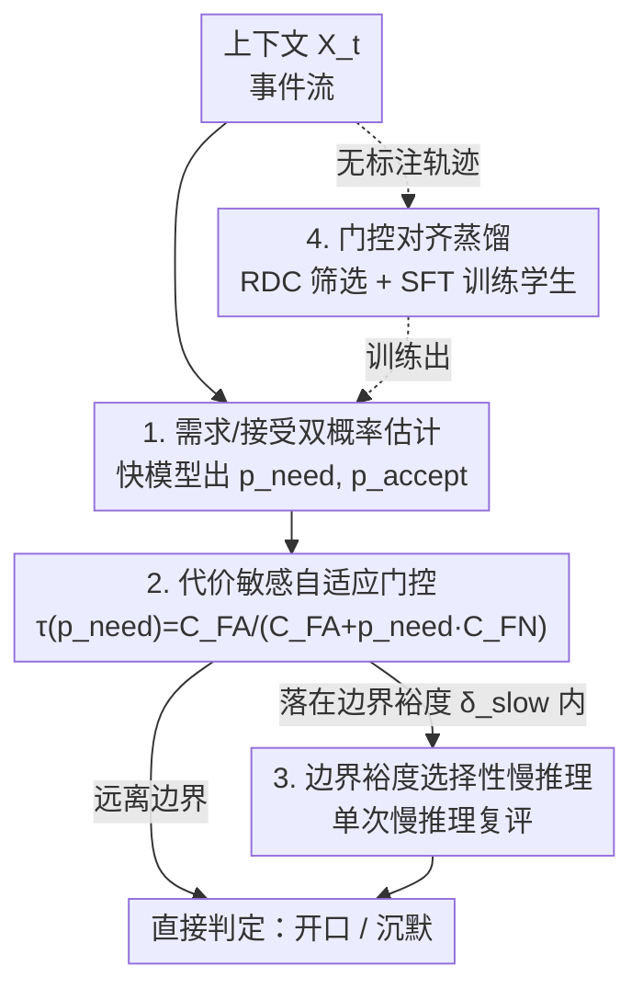

# PRISM: Festina Lente Proactivity—Risk-Sensitive, Uncertainty-Aware Deliberation for Proactive Agents

**会议**: ICLR 2026  
**OpenReview**: [https://openreview.net/forum?id=rH6IsmeJrv](https://openreview.net/forum?id=rH6IsmeJrv)  
**代码**: https://prism-festinalente.github.io/  
**领域**: Agent  
**关键词**: 主动智能体, 代价敏感门控, 选择性慢推理, 校准概率, 知识蒸馏

## 一句话总结
PRISM 把"主动智能体该不该开口"建模成**代价敏感的选择性干预问题**：先估计"用户是否需要帮助"和"用户是否会接受"两个校准概率，用一个由误报/漏报代价推出的自适应阈值做门控，只在决策边界附近触发一次"慢推理"，并用门控对齐的蒸馏训练学生模型，在 PROACTIVEBENCH 上把误报率降了 22.78%、F1 提升 20.14%。

## 研究背景与动机
**领域现状**：主动智能体（proactive agent）要在用户没开口之前就主动提供帮助，但又不能太烦人。这是一个"说还是不说"（speak or remain silent）的时序决策，而且误报和漏报的代价并不对称——误报会打断用户、消耗信任，漏报则错失了及时帮助。

**现有痛点**：目前主流系统要么靠**脆弱的启发式阈值**（ad hoc threshold）决定何时开口，要么**默认对所有事件都跑长链推理**（chain-of-thought）。前者对收益-负担的权衡几乎没有可控旋钮，后者则在显而易见的简单场景上也烧掉昂贵的慢推理，浪费算力。

**核心矛盾**：现有方法把"接受度优化"和"时机控制"**解耦成了两套独立逻辑**——prompt 和输出格式离线调好，然后再额外加一层启发式规则决定"什么时候说"。这模糊了"学到的策略"和"产品控制旋钮"的边界，削弱了对质量-效率权衡的可控保证。说到底，时机这件事没有被放进一个统一的、可解释的决策框架里。

**本文目标**：把主动干预统一成一个决策论问题——同时建模"需求"和"接受"，让门控、代价、慢推理触发都服从同一套显式规则，并让训练目标和部署时的决策架构完全对齐。

**切入角度**：作者借用拉丁谚语 *festina lente*（"慢中求快"）的思想——智能体应当**按期望效用门控**，并且只在决策边界附近这一狭窄、模糊、高风险的区域才动用慢推理，把算力精准投到"最可能改变结果"的地方。

**核心 idea**：把时机决策表达为对两个校准概率（$p_{\text{need}}$、$p_{\text{accept}}$）的选择性决策，用代价推出的自适应阈值门控，并只在边界附近触发单次慢推理；训练时复用同样的代价、门控与边界裕度来塑造学习信号。

## 方法详解

### 整体框架
PRISM（Proactive Risk Sensitive Intervention with a Slow mode Margin）把每个时刻 $t$ 的主动干预看成一次代价敏感的选择性决策。给定上下文 $X_t$，一个**快模型**先估计两个校准概率：$p_{\text{need},t} = \Pr(\text{需要帮助} \mid X_t)$ 和 $p_{\text{accept},t} = \Pr(\text{offer 被接受} \mid X_t, \text{干预})$。接着一个**代价敏感门控**比较接受概率与一个随需求概率变化的动态阈值 $\tau(p_{\text{need},t})$，决定是否干预。只有当快模型的初步估计**落在决策边界附近的狭窄裕度 $\delta_{\text{slow}}$ 内**（即模糊、高风险的情况）时，才触发一次更强的**慢推理**重新评估。训练侧则用一个跑完整 PRISM 流程的教师模型，在无标注交互轨迹上产出可执行监督，通过"决策一致性筛选 + 监督微调"把能力蒸馏进学生模型，且学生的回复策略与干预门控显式解耦，以便事后可调、可审计。

### 关键设计

**1. 需求/接受双概率解耦：分清"该帮"和"想要"**

主动智能体最常见的崩塌方式是"过度主动"——它给出的建议往往是**正确但不合时宜**的，用户嘴上接受、心里嫌烦。PRISM 把这个问题归因于把"是否需要帮助"和"是否会被接受"混为一谈。于是它显式估计两个分开的概率 $p_{\text{need}}$ 与 $p_{\text{accept}}$：前者刻画客观上是否需要介入，后者刻画用户主观上是否会买账。消融实验（表 5）显示，只用 $p_{\text{accept}}$ 做决策会让误报率灾难性飙到 62.50%，只用 $p_{\text{need}}$ 则更安全但偏保守，**两者结合才能同时兼顾时机与接受度**，把误报压到 22.94%。这种解耦正是 PRISM 能过滤掉"正确但不想要"提案的关键。

**2. 代价敏感自适应门控：让阈值随需求和代价一起动**

固定阈值无法表达"误报和漏报代价不对称"这一现实。PRISM 用一个由代价显式推出的动态阈值来门控：设 $C_{\text{FA}}$ 为误报（false alarm）代价、$C_{\text{FN}}$ 为漏报（false negative）代价，智能体仅当接受概率超过阈值时才干预：

$$p_{\text{accept},t} \ge \tau(p_{\text{need},t}) \triangleq \frac{C_{\text{FA}}}{C_{\text{FA}} + p_{\text{need},t}\cdot C_{\text{FN}}}.$$

这条规则的妙处在于它的单调性：当"需要帮助"的确定性 $p_{\text{need}}$ 越高，阈值 $\tau$ 越低，智能体就能**容忍更低的接受概率也敢开口**；反之在 $p_{\text{need}}$ 很低的良性场景（如用户只是在做无害的配置编辑），$\tau$ 被抬高，门控保持沉默，用户不被打断。作者进一步刻画了阈值如何随代价和 $p_{\text{need}}$ 单调变化，把"代价旋钮 → 指标"做成了一张紧凑可解释的映射表。

**3. 边界裕度选择性慢推理：只在模糊处动用 System 2**

慢推理（counterfactual check、scratchpad 式深思）质量高但又慢又贵，对所有事件都跑是极大浪费。PRISM 采用双过程架构：快模型先给初估 $(p^F_{\text{need},t}, p^F_{\text{accept},t})$，**只有当初估落在决策边界附近的裕度内**才触发单次慢推理：

$$|p^F_{\text{accept},t} - \tau(p^F_{\text{need},t})| \le \delta_{\text{slow}},$$

其中 $\delta_{\text{slow}}$ 是可配置裕度。这等于把额外算力精准集中在"最可能改变结果"的边界带上。实验取 $\delta = 0.1$ 时，只有约 11% 的边界样本被路由到慢推理，却把 F1 从 Fast-only 的 83.09% 提到 88.15%（+5.06），而 P95 延迟仅增加约 20ms——几乎以"System 1 的速度拿到 System 2 的质量"，定义出一条效率-质量的帕累托前沿。

**4. 门控对齐的决策一致性蒸馏（RDC-SFT）：训练复刻部署**

PRISM 让训练和部署用**同一套代价、同一个门控、同一个慢推理裕度**，以缩小仿真与真实部署的鸿沟。它用一个跑完整 PRISM 流程的教师在无标注轨迹上产生密集、可执行的监督，再用一个排序分数 $R_{\text{DC}}$ 筛选训练数据——奖励教师做出"被接受的干预"，惩罚其"概率估计失准"：

$$R_{\text{DC}} = y_{\text{accept}} - \left(q_{\text{need}} - y_{\text{need}}\right)^2 - \mathbb{1}\{y^{(\text{pred})}_{\text{need}}=1\}\left(q_{\text{accept}} - y_{\text{accept}}\right)^2,$$

其中 $(q_{\text{need}}, q_{\text{accept}})$ 是教师概率、$(y_{\text{need}}, y_{\text{accept}})$ 是真值标签。学生在排序最高的精选子集 $D^\star$ 上做全参数 SFT，训练目标 $L = L_{\text{need}} + L_{\text{acc}} + L_{\text{burden}}$：$L_{\text{need}}$、$L_{\text{acc}}$（用逆倾向加权处理选择偏差）保证两个概率校准良好，$L_{\text{burden}}$ 则对误报负担和过度慢推理做正则惩罚。关键在于学生的回复策略**与干预门控显式解耦**，使得门控可在部署时调旋钮、可审计，而不必重训模型。消融（表 4）显示 RDC-SFT 比在未筛选数据上做普通 SFT 的 F1 高出 10.52 个点，印证"数据质量 + 目标结构"才是主导因素。

### 一个例子：一次良性配置编辑
设想一个写代码的 copilot 场景。用户正在做一处敏感的配置修改，此时 CI 出现一个偶发（flaky）的失败。PRISM 的快模型先估出 $p_{\text{need}}$ 较低（这只是良性编辑、未必真需要介入）；由于 $p_{\text{need}}$ 低，自适应阈值 $\tau$ 被抬高，要求很高的接受概率才肯开口。快模型估计的 $p_{\text{accept}}$ 远低于这个抬高后的 $\tau$，**且不落在边界裕度 $\delta_{\text{slow}}$ 内**——于是连慢推理都不触发，门控直接判定"沉默"，用户毫不被打断地继续工作。只有当某个事件的快估计恰好卡在 $\tau$ 附近（模糊、高风险）时，才会被路由去做一次慢推理复评，再下最终决定。

### 损失函数 / 训练策略
学生模型 QWEN3-8B-PRISM 在官方训练集经 RDC 筛选后的 1,800 条子集（不到原始 1/3）上做全参数 SFT。优化器 AdamW，学习率 $1\times10^{-5}$，0.1 warm-up 比例 + cosine 调度，训练 3 个 epoch；采用 Qwen chat 模板、4096 token 上下文、bf16 精度，单卡 device 有效 batch size 为 4（per-device 1，梯度累积 4）。在单张 A100（80GB）上约 2.5 小时完成。

## 实验关键数据

### 主实验
在 PROACTIVEBENCH（coding / writing / daily life 三域，held-out 测试 233 个 clip）上评估，用 DeepSeek-R1 + GPT-4o + Claude-3.5-Sonnet 三模型多数投票做 LLM-as-Judge（与人类一致率 89.1%、Cohen's $\kappa = 0.71$）。

| 模型 | Recall ↑ | Precision ↑ | False-Alarm ↓ | F1 ↑ |
|------|------|------|------|------|
| GPT-4o | 98.11% | 48.15% | 51.85% | 64.60% |
| Qwen2-7B-Proactive (SOTA) | 100.00% | 49.78% | 50.22% | 66.47% |
| DeepSeek-R1（教师） | 98.12% | 72.35% | 27.64% | 83.28% |
| **Qwen3-8B-PRISM** | **98.88%** | **77.05%** | **22.94%** | **86.61%** |

相比前 SOTA Qwen2-7B-Proactive，F1 提升 20+ 点（66.47→86.61），误报率相对削减近 54%（50.22→22.94），且 Recall 几乎不掉。更关键的是**学生反超教师**：用更小的 backbone 在 Precision 上比 DeepSeek-R1 高 4.70 个点（$p<0.001$）、误报率显著更低，人类专家评测也佐证（PRISM F1 84.85% vs. 教师 82.05%）。

### 消融实验

| 配置 | F1 ↑ | False-Alarm ↓ | 说明 |
|------|------|------|------|
| 仅 $p_{\text{accept}}$（$p_{\text{need}}=1$） | 63.19% | 62.50% | 误报灾难性飙升 |
| 仅 $p_{\text{need}}$ | 81.72% | 29.10% | 安全但次优 |
| 双信号·未校准 | 85.12% | 25.23% | 已很强 |
| **双信号·校准（本文）** | **86.61%** | **22.94%** | 完整模型 |
| Fast-only | 83.09% | 28.92% | 不用慢推理 |
| Slow-only（全慢） | 86.79% | 24.83% | P95 延迟 312ms |
| **Slow-on-margin（$\delta=0.1$）** | **88.15%** | **21.19%** | 仅 ~11% 走慢推理，P95 196ms |

### 关键发现
- **双信号是降误报的核心**：只靠 $p_{\text{accept}}$ 误报飙到 62.50%，因为用户常接受"有用但不合时宜"的建议；必须同时建模 $p_{\text{need}}$ 才能压住误报。
- **边界裕度慢推理是帕累托改进**：只把约 11% 的边界样本路由到慢推理，就拿到了接近全慢推理的质量，而 P95 延迟仅比 Fast-only 多约 20ms。
- **数据质量与目标结构主导训练**：RDC 筛选 + 显式 $(p_{\text{need}}, p_{\text{accept}})$ 监督，比普通 SFT 的 F1 高 10.52 点；事后重加权（Weighted-SFT）或概率重缩放（DFT）在接受/时机噪声下都更逊色。
- **代价敏感门控需要校准信号**：在未做 RDC-SFT 的基模上，动态 $\tau(p_{\text{need}})$ 反而不如固定阈值（F1 70.29 vs. 80.74），因为边界附近的 $p_{\text{need}}$ 噪声大；只有概率校准后动态策略才超过固定阈值。

## 亮点与洞察
- **把"何时介入"提升成决策论问题**：用一条由代价推出的自适应阈值公式，把误报/漏报代价、需求确定性统一进一个可解释的门控，旋钮少而语义清晰——这是比"调 prompt + 加启发式"更有保证的范式。
- **"慢中求快"的算力分配哲学很优雅**：不是均匀地省或均匀地花，而是用边界裕度把昂贵的慢推理精准投到"最可能改变结果"的模糊样本上，思想可迁移到任何"快慢双过程 + 选择性深思"的系统。
- **训练-部署对齐**：训练时复用部署的代价、门控、裕度，让"靠更好的时机/校准带来的提升"和"靠界面/格式错配带来的虚假提升"被干净地隔离开，是一个值得借鉴的实验诚实性设计。
- **学生反超教师**：通过 RDC 筛选只喂"决策一致"的高质量轨迹 + 显式概率监督，小模型在 Precision/误报上超过自己的大教师，说明"教什么"比"用多大模型教"更重要。

## 局限与展望
- 评测主要依赖 LLM-as-Judge（虽与人类 $\kappa=0.71$、且有 229 事件的人类校验），但裁判模型自身的偏见/过自信仍可能传导到 $p_{\text{need}}$、$p_{\text{accept}}$ 的"真值"定义上。
- 代价 $C_{\text{FA}}$、$C_{\text{FN}}$ 与裕度 $\delta_{\text{slow}}$ 是需要人为设定的旋钮，论文给了 sweet spot（如 $\delta=0.1$）但在不同部署场景下如何自动整定仍待探索。
- 训练只用了 1,800 条 RDC 精选数据、单一 Qwen3-8B backbone，跨更大模型/更多域的可扩展性和分布漂移下的稳定性（论文称在附录中讨论）还需更广泛验证。
- 慢推理目前是"单次复评"，对真正高难度、需多步推理才能判断时机的场景是否够用，论文未深入。

## 相关工作与启发
- **vs Proactive Agent / ProactiveBench**：后者形式化了"接受度监督的干预"并强调时机与用户负担，PRISM 在其上更进一步——把门控、代价、可见 schema 在训练和推理间共享，以隔离"时机改善"带来的真实增益，而非界面/prompt 错配带来的假象。
- **vs 拒识选项 / 选择性预测（reject-option, selective prediction）**：经典代价敏感学习给出风险-覆盖权衡的原则性阈值，PRISM 把这套思想"算子化"成主动时机的近阈值慢推理带，并接到现代神经网络校准方法上。
- **vs 标准 RLHF**：RLHF 通常优化单一标量奖励，PRISM 则估计 $(p_{\text{need}}, p_{\text{accept}})$ 两个概率并与标签组合成结构化目标，跳出"二元奖励"框架，让概率直接参数化代价敏感门控而非塞进一个单体奖励。
- **vs 协议对齐的蒸馏**：用教师合成事件条件决策再蒸馏进小模型（self-instruct 式），并在不确定时调用慢推理 scratchpad，同时保持训练/评测可见 schema 完全一致，使可靠性增益源自更好的时机与校准而非格式漂移。

## 评分
- 新颖性: ⭐⭐⭐⭐⭐ 把主动干预统一成代价敏感选择性决策 + 边界裕度慢推理，框架简洁而原创。
- 实验充分度: ⭐⭐⭐⭐ 主表 + 四组消融 + 人类校验 + 效率帕累托分析，较完整；但 backbone/域较单一。
- 写作质量: ⭐⭐⭐⭐ 动机清晰、公式与旋钮语义讲得明白，*festina lente* 隐喻贯穿全文。
- 价值: ⭐⭐⭐⭐⭐ 让主动智能体精准、省算力、可控可审计，对真实部署很有用。

<!-- RELATED:START -->

## 相关论文

- [\[ICLR 2026\] FingerTip 20K: A Benchmark for Proactive and Personalized Mobile LLM Agents](fingertip_20k_a_benchmark_for_proactive_and_personalized_mobile_llm_agents.md)
- [\[NeurIPS 2025\] ContextAgent: Context-Aware Proactive LLM Agents with Open-World Sensory Perceptions](../../NeurIPS2025/llm_agent/contextagent_context-aware_proactive_llm_agents_with_open-world_sensory_percepti.md)
- [\[ICLR 2026\] SimuHome: A Temporal- and Environment-Aware Benchmark for Smart Home LLM Agents](simuhome_a_temporal-_and_environment-aware_benchmark_for_smart_home_llm_agents.md)
- [\[ICLR 2026\] MMSearch-Plus: Benchmarking Provenance-Aware Search for Multimodal Browsing Agents](mmsearch-plus_benchmarking_provenance-aware_search_for_multimodal_browsing_agent.md)
- [\[ICLR 2026\] DreamPhase: Offline Imagination and Uncertainty-Guided Planning for Large-Language-Model Agents](dreamphase_offline_imagination_and_uncertainty-guided_planning_for_large-languag.md)

<!-- RELATED:END -->
