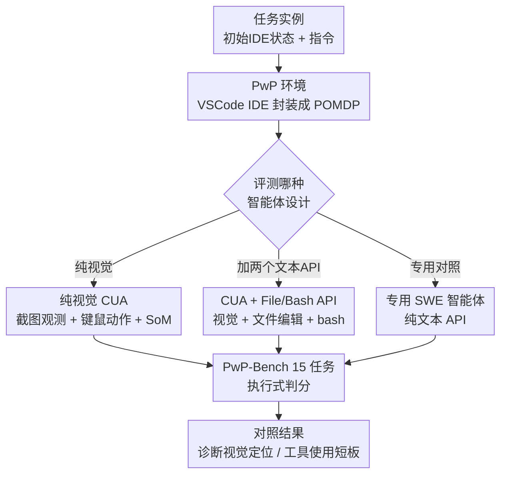

# Programming with Pixels: Can Computer-Use Agents do Software Engineering?

**会议**: ICLR 2026  
**OpenReview**: [https://openreview.net/forum?id=9N4Ps9Psfr](https://openreview.net/forum?id=9N4Ps9Psfr)  
**代码**: https://programmingwithpixels.com  
**领域**: Agent / 计算机使用智能体 / 软件工程评测  
**关键词**: 计算机使用智能体, IDE 环境, 软件工程, 视觉定位, Benchmark

## 一句话总结
作者构建了首个面向软件工程的"计算机使用"环境 PwP（智能体像人一样用键鼠看屏幕操作 VSCode）和配套的 15 任务基准 PwP-Bench，系统评测发现：纯视觉操作的通用计算机使用智能体（CUA）只有 22.9% 准确率、远逊于专用 SWE 智能体；但只要给它们两个文本 API（文件编辑 + bash），准确率就跳到 50.7%，逼近专用智能体——说明短板不在"会不会写代码"，而在视觉定位差、不会用 IDE 里的现成工具。

## 研究背景与动机

**领域现状**：计算机使用智能体（Computer-Use Agents, CUA）被寄予厚望——只靠点击、打字、看屏幕这些原始动作就能完成各种任务，从而不再需要为每个任务手工设计专门的动作接口。但目前对它们的评测几乎都停留在简单场景：网页导航、改改文档、调调操作系统设置（OSWorld、AndroidWorld、WindowsAgentArena 这类）。

**现有痛点**：这些简单任务上的表现，能不能迁移到真正复杂、专业的领域，没人知道。与此同时，软件工程方向已经发展出一大批"专用 SWE 智能体"（SWE-agent、Agentless、OpenHands 等），它们靠**手工打造的专用 API** 干活——SWE-agent 用语言相关的解析器和编辑命令，Agentless 依赖 Python 专属的 AST。这些脚手架每加一个工具都要可观的工程量和领域知识。

**核心矛盾**：通用 CUA 走的是"像人一样用同一套视觉界面操作所有工具"的路线，专用智能体走的是"为每个操作定制文本 API"的路线。前者通用但可能笨拙，后者强但不可迁移。两条路线从未在同一个公平环境里被直接比较过，于是一个根本问题悬而未决：通用计算机使用智能体能不能在软件工程这种复杂领域追平专用智能体？

**本文目标**：把软件工程作为试金石，回答"CUA 到底能不能做软件工程"，并定位它们的关键短板。选 SWE 是因为它（1）经济价值大、实践难度高；（2）已有强专用智能体作为对照基线。

**切入角度**：与其再做一个文本 API 智能体，不如造一个**真实 IDE 环境**——让智能体和人类开发者、专用智能体访问**完全相同**的工具集（调试器、linter、代码建议、扩展），唯一区别是 CUA 通过视觉界面访问。这样视觉交互是否足以做软件工程，就能被干净地测出来。

**核心 idea**：把整个 VSCode IDE 封装成一个 POMDP 环境（PwP），让智能体用键鼠看屏幕操作，再配一个覆盖 15 类 SWE 任务、14 种语言、多模态的基准（PwP-Bench），对纯视觉 CUA、带文本 API 的 CUA、专用 SWE 智能体三种设计做统一对照评测。

## 方法详解

这篇论文的"方法"本质是一套**环境 + 基准 + 评测协议**，不是某个新模型或训练算法。整体可以理解为：先把一个真实 IDE 抽象成标准的强化学习式环境（输入是屏幕截图/指令，输出是键鼠动作，执行测试给奖励），再在这个环境里铺设 15 类任务构成基准，最后用三种智能体设计跑同一套任务，从结果差异里诊断 CUA 的能力与短板。

### 整体框架

PwP 把 IDE + 操作系统建模成一个部分可观测马尔可夫决策过程 POMDP $\langle S, A, O, T, R\rangle$：状态 $S$ 描述 IDE 与 OS 上下文（打开的文件、活动编辑面板、光标位置）；动作空间 $A$ 是全部键鼠事件，底层由 `xdotool` 提供原始键鼠语法；观测 $O$ 随智能体设定而变（纯视觉是截图，带 API 时是文本输出）；转移 $T$ 大多确定（敲字符就改状态），但后台进程会带来时序随机性；奖励 $R$ 由任务定义，比如改完 bug 后跑测试套件算分。一条轨迹就像真实开发：智能体修 repo 里的 bug、调用建议工具写代码、生成文档，环境则追踪改动、跑测试、回传奖励信号。

环境之上是基准 PwP-Bench：每个任务给智能体一个初始 IDE 状态 $S_i$ 和指令 $I$，目标是到达终态 $S_f$，并用**基于执行**的标准（如单元测试）判分。任务由一个 setup 脚本定义初始状态、指令、评估逻辑，加新任务只要改配置文件。评测时分别用三种智能体设计跑同一批任务，对比它们的得分。

### 关键设计

**1. PwP 环境：把真实 IDE 封装成"表达力完整、工具齐全"的 POMDP**

要公平测 CUA 能不能做 SWE，环境必须满足两点：表达力完整（agent 能完成任何 IDE 里能做的 SWE 任务，无需语言/领域专属改造）和工具齐全（agent 能像人一样访问调试器、linter、重构工具、扩展等全部 IDE 功能）。PwP 用一个基于 VSCode 的 IDE 满足这两点——因为"使用 IDE 功能"本身就等于"执行一串原始操作"，所以只要把键鼠动作开放出来，所有 IDE 工具自然都可达。具体实现上，环境跑在隔离的 Docker 沙箱里，通过四条通道连接 VSCode 做实时屏幕捕获、DOM 信息提取和配置（分辨率、CPU/内存限制），并实现了状态 checkpoint（对搜索回溯和 RL 训练特别有用），对外只暴露一个 gymnasium 风格的 Python API，`pip install` 即可用。这种设计的好处是"未来自适应"：随着 IDE 装上更强的工具，环境无需改架构就自动纳入这些新能力。

**2. PwP-Bench：15 类任务覆盖 SWE 的深度与广度**

只测代码补全无法代表软件工程，所以基准要在语言、模态、技能上都够宽。PwP-Bench 含 15 个任务、共 5400 个实例，源自 13 个已有代码数据集 + 2 个作者新建任务，跨 14 种编程语言。选任务的三条原则是：必须大量交互 SWE 工具、必须多步、必须覆盖多语言多模态。任务分四大类：**代码生成与编辑**（n=6，含 HumanEval、SWE-Bench、SWE-Bench-Multilingual、DSBench、Res-Q/CanItEdit）；**多模态代码合成**（n=4，含 Design2Code 做 UI、Chart2Mimic 把图表转 Python、SWE-Bench-MM、依赖图像/PDF 的 DSBench）；**领域专用编程**（n=3，含 CTF 道德黑客、miniCTX 交互式定理证明，需要持续看 IDE 的 goal 状态、装扩展、跑可执行文件）；**IDE 专属与通用 SWE**（n=2，作者新建——IDE Configuration 测改主题/扩展/偏好，General-SWE 测性能剖析、重构、调标准库 bug、UI 草图设计、代码复原这五类非写码活动）。由于全量 5400 实例评测太贵，作者还提供 **PwP-Bench-Lite**：从每个基准随机抽 20 个、共 300 个实例的子集，保持难度分布又便于快速实验。

**3. 三种智能体设计：用"控制变量"隔离出短板到底在哪**

这是全文最关键的实验设计。作者在同一环境里评测三种递进的智能体：**纯视觉 CUA** 只能看截图、发键鼠动作，回合制推进；由于无 GUI 训练的视觉语言模型搞不定原始像素坐标，统一加 Set-of-Marks（SoM）——给模型原图 + 解析出的界面元素表示，让它用元素 ID 而非像素坐标交互。**CUA + File/Bash API** 在纯视觉基础上额外给两个文本 API：文件编辑（`read file`、`string replace`）和 bash 命令执行；此时截图改为按需获取（发 screenshot 动作才给），严格沿用 Anthropic computer-use 实现。**专用 SWE 智能体**（mini-swe-agent、OpenHands）完全走文本 API，作为"天花板"对照；多模态任务直接把图像喂进 prompt。三种设计的差异恰好对应"加什么能力 → 提多少分"，从而把短板精确归因：纯视觉→加文本 API 的巨大跳变说明瓶颈不在代码能力，而在"视觉操作 + 用工具"。统一约束是每个实例最多 20 步，跑完或发 stop 就用任务指标判终态。

### 一个完整示例

以 Design2Code（给一张 UI 设计图，让智能体写出对应网页代码）为例走一遍三种设计的差异：**纯视觉 CUA** 拿到截图后，要在 IDE 里新建文件、靠键鼠定位编辑器、一行行敲 HTML/CSS，还要打开 VSCode 内置浏览器的 live preview 把自己生成的页面和参考图并排比对、反复微调——Claude-Sonnet-4.0 能用上 live preview 这类基础工具，所以多模态类拿到 37.3%，但纯视觉编辑的笨拙限制了上限。**CUA + File/Bash** 在这个任务上 87.5% 的交互仍走计算机使用（因为要频繁开 live preview 对比视觉效果），只有 12.5% 走文件 API，准确率升到 48.1%。**Assisted（人工补 IDE 工具调用）** 进一步给它现成的 live preview、repo 结构、符号大纲等工具调用，Design2Code 直冲 79.5%——同一个模型、同一个任务，能不能用好 IDE 工具，差出近一倍的分。这个对比把"短板在工具使用而非代码能力"具象化了。

## 实验关键数据

### 主实验

在 PwP-Bench-Lite（300 实例、最多 20 步）上评测三类智能体（数值为四大类的总平均）：

| 智能体设计 | 代表模型 | Code Gen&Edit | 多模态 | 领域专用 | General SWE | 总平均 |
|--------|------|------|------|------|------|------|
| 纯视觉 CUA | Claude-Sonnet-4.0 | 14.3% | 37.3% | 6.7% | 40.0% | 22.3% |
| 纯视觉 CUA（最佳报告值） | Claude-Sonnet-4.0 | — | — | — | — | 22.9% |
| CUA + File/Bash | Claude-Sonnet-4.0 | 53.5% | 57.8% | 43.9% | 38.3% | **50.7%** |
| 专用 SWE 智能体 | mini-swe-agent | 49.4% | 60.3% | 40.0% | 37.5% | 48.8% |
| 专用 SWE 智能体 | OpenHands | 50.4% | 50.8% | 43.3% | 25.0% | 45.7% |

核心结论：纯视觉 CUA 最高才 22.9%，远低于专用智能体的 48.8%；但加两个文本 API 后跳到 50.7%，**反超** mini-swe-agent，证明 CUA 不缺代码能力，缺的是把意图落到界面上的执行能力。

### 关键分析实验

| 分析 | 关键数字 | 说明 |
|------|---------|------|
| 视觉定位错误率 | GPT-4o 20% / Claude-Sonnet-4.0 95% 轨迹至少一次定位错误 | CUA 普遍点错元素、误读 UI 状态、甚至幻觉屏幕内容 |
| 重构任务"提示用工具" | 25% → 75% | General-SWE 重构任务里，显式提示"用 rename/move to file" 后准确率三倍提升 |
| Assisted vs CUA（SWE-Bench/Design2Code/Chartmimic/BIRD） | 0/23.5/2.7/0% → 15/48.1/25.3/7%（+File/Bash）→ 19/79.5/61.6/17%（Assisted） | 人工补 IDE 工具调用平均再涨最多 13.3% |
| CUA 随时间进步 | Claude-Sonnet 3.5→3.7→4.0：10.5%→17.7%→22.9% | 7 个月内纯视觉性能翻倍；与带 API 版本的差距从 35.0% 缩到 27.8% |

### 关键发现
- **瓶颈不在代码能力，在视觉操作**：HumanEval 这种简单函数补全，带 File API 的 CUA 全靠文件 API 拿 100%，而纯视觉只有 25%——纯视觉连"把代码敲进文件"都做不利索。
- **视觉定位是头号短板**：连专门为 UI 交互训练的 Claude Computer Use 也有 95% 轨迹出现定位错误，且 Set-of-Marks 并没有解决问题（反而会选错元素）。作者推测 IDE 信息密度太高、且可能没被 computer-use 训练数据覆盖。
- **不会用高级 IDE 工具**：General-SWE 里很多任务用对工具只需 4-5 步，但 CUA 得分极低；全程没观察到一次成功使用 profiler、debugger（即便明确指示）。
- **任务自适应已现雏形**：带 API 的 CUA 在 HumanEval 全走文件 API、在 VSCode 设置任务全走视觉、在 Design2Code 混用，说明它能按任务在"视觉 vs API"间做选择。

## 亮点与洞察
- **用"控制变量"把模糊问题做成可证伪结论**：纯视觉 → +文本 API → Assisted 的三级阶梯，把"CUA 能不能做 SWE"拆成"代码能力 vs 执行能力"两个独立变量，干净地证明短板在后者。这种实验设计本身比任何单个数字都有价值。
- **环境即基准的"未来自适应"思路**：因为环境就是真实 IDE、动作就是原始键鼠，所以 IDE 一升级、装上新工具，基准自动变难变全，无需改架构——这让 PwP 不会像静态 benchmark 那样很快饱和。
- **"提示就涨 50 个点"的反差**：重构任务 25%→75% 只靠一句"请用 rename 工具"，说明能力其实潜在存在，只是 agent 不主动去用 IDE 功能——这把"训练 agent 探索并利用环境功能"指成明确的未来方向。
- 可迁移的 trick：把任意 GUI 应用封装成 gymnasium POMDP + checkpoint + 执行式奖励的范式，可直接搬到其他"专业软件操作"评测（如 CAD、Office、专业设计工具）。

## 局限与展望
- **作者承认**：当前 CUA 的核心短板是视觉定位差和不会利用环境里丰富的工具；Set-of-Marks 这类辅助并未根治定位问题。
- 评测受预算约束，主结果跑在 300 实例的 Lite 子集、且步数上限多为 20 步（仅 SWE-Bench 类在附录加测 250 步），大步数预算下的上限尚未充分探明。
- 专用智能体只选了 mini-swe-agent / OpenHands 作对照，覆盖面有限；不同任务难度差异大，跨类直接比大小需谨慎（如 General SWE 只有 2 个任务）。
- 改进思路明确：训练 CUA 主动探索并调用 IDE 工具（而非死记动作序列）、强化 IDE 这种高信息密度界面下的视觉定位、把现成专用工具以 IDE 内可达的形式注入 CUA。

## 相关工作与启发
- **vs OSWorld / AndroidWorld / WindowsAgentArena**: 它们测的是文档编辑、日历管理这类简单 OS/网页任务，无法说明能否迁移到复杂专业领域；PwP-Bench 首个专测计算机使用智能体能否做软件工程，且有强专用智能体作对照基线。
- **vs SWE-agent / Agentless / OpenHands**: 这些专用智能体靠语言/任务专属的手工 API（解析器、AST、IPython kernel）取得强性能，但不可迁移；本文反过来问"和人类用同一套视觉界面的通用 CUA 能不能追平它们"，并把两种设计放进同一环境直接对比。
- **vs 预定义动作集 + 可访问性树的 GUI agent**: PwP 同时支持"预定义动作集（配 DOM/SoM 辅助定位）"和"纯键鼠原始动作"两种 agent 设计，因此能在同一平台横向比较不同 CUA 架构。

## 评分
- 新颖性: ⭐⭐⭐⭐⭐ 首个面向软件工程的计算机使用环境 + 基准，问题切口（视觉 vs API 执行能力）独到。
- 实验充分度: ⭐⭐⭐⭐ 三种设计 × 十余个模型 × 15 任务，分析扎实；但主结果限于 Lite 子集和 20 步预算。
- 写作质量: ⭐⭐⭐⭐⭐ 问题驱动、结论清晰，失败案例与归因分析到位。
- 价值: ⭐⭐⭐⭐⭐ 给"通用 agent 能否达到专用水平"提供了可复现平台与明确的改进方向（视觉定位 + 工具利用）。

<!-- RELATED:START -->

## 相关论文

- [\[ICLR 2026\] Grounding Computer Use Agents on Human Demonstrations](grounding_computer_use_agents_on_human_demonstrations.md)
- [\[ICLR 2026\] ScaleCUA: Scaling Open-Source Computer Use Agents with Cross-Platform Data](scalecua_scaling_open-source_computer_use_agents_with_cross-platform_data.md)
- [\[ICLR 2026\] Efficient Agent Training for Computer Use](efficient_agent_training_for_computer_use.md)
- [\[ICLR 2026\] SCUBA: Salesforce Computer Use Benchmark](scuba_salesforce_computer_use_benchmark.md)
- [\[ICLR 2026\] VideoAgentTrek: Computer Use Pretraining from Unlabeled Videos](videoagenttrek_computer-use_pretraining_from_unlabeled_videos.md)

<!-- RELATED:END -->
