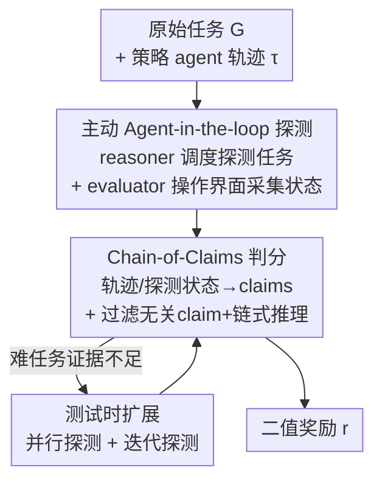

# ProRe: A Proactive Reward System for GUI Agents via Reasoner–Actor Collaboration

**会议**: ICLR 2026  
**OpenReview**: [https://openreview.net/forum?id=xtysskccFc](https://openreview.net/forum?id=xtysskccFc)  
**代码**: https://github.com/V-Droid-Agent/ProRe  
**领域**: Agent  
**关键词**: GUI Agent, 奖励模型, 主动探测, Reasoner-Actor, 测试时扩展

## 一句话总结
针对 GUI agent 难以获得可验证奖励的问题，ProRe 让一个通用推理器（reasoner）调度"状态探测任务"、再由领域专用评估 agent（actor）主动操作界面去采集关键状态，最终用 chain-of-claims 推理判定任务是否成功，把奖励准确率做到 93.7%（首个 >90% 的 GUI 奖励系统），并把策略 agent 的成功率最多提升 22.4%。

## 研究背景与动机

**领域现状**：要让 LLM 驱动的 GUI agent（操作手机/网页/桌面完成任务）持续进化，需要可验证的奖励信号（RLVR）。最简单有效的奖励是"任务是否完成"的二值判断。现有方法分两类：一类是**规则式**，由人工为每个任务手写单元测试代码去检查目标状态（如 AndroidWorld 写了 116+ 段、WindowsAgentArena 写了 150+ 段），准确但完全无法规模化；另一类是 **LLM-as-a-Judge**，用 GPT-4o 等模型看任务轨迹（通常是截图序列）来判断是否完成，可规模化但准确率不够。

**现有痛点**：作者指出 LLM-as-a-Judge 在 GUI 场景下失效有两个根因。其一是**状态可观测性不完整**——GUI 状态只能通过截图这类模态被动监测，而界面交互复杂、动态，很多成功标志根本没出现在截图里（例如"拍两张照片"，截图里看不到第二张缩略图，连人都判断不了），加上截图按固定间隔采样会漏掉关键的状态跳变。其二是**通用 LLM 缺乏领域知识**——判断 GUI 任务状态需要对 App、UI 交互的专门理解，GPT-4o/Gemini 这类通用模型在 GUI 相关任务上表现普遍不佳，而要把它们后训练成领域奖励模型又需要标注数据，重新陷入规模化困境。

**核心矛盾**：被动看轨迹（passive monitoring）拿不到判定成功所需的关键证据，而让通用 reasoner 直接去啃低层 GUI 细节又超出了它的能力范围——观测能力和领域能力两头都不够。

**本文目标**：在不依赖 ground-truth 轨迹、不依赖手写测试代码、也不需要训练领域奖励模型的前提下，给任意 GUI agent 输出准确、可验证的二值奖励。

**切入角度**：作者的关键观察是——与其被动地看策略 agent 留下的轨迹，不如**主动去环境里"探一探"**。判定"删了文件 A 没有"，最可靠的方式不是盯着删除动作的截图，而是另起一个任务"去目标应用里搜 A 还在不在"。而且这种探测任务通常比执行任务简单得多（实测成功率高 23.8%、轨迹短 50.3%）。

**核心 idea**：用"reasoner 调度 + actor 主动探测 + chain-of-claims 推理"替代"通用 LLM 看静态轨迹判分"，把通用推理与领域执行解耦——reasoner 负责想"要验证什么"和"证据是否自洽"，领域 evaluator agent 负责"去界面里把关键状态捞回来"。

## 方法详解

### 整体框架

ProRe 的输入是一条由策略 agent π 执行原始任务 G 后产生的轨迹 τ，输出是一个二值奖励 r（任务成功/失败）。它不直接对 τ 做 LLM-as-a-Judge，而是引入一个通用 LLM reasoner $J$ 和一组领域专用 evaluator agent（actor）$\pi_e$ 协同：

1. **调度探测任务**：reasoner 先分析原始任务 G 的预期结果，识别出"判定成功需要看哪些关键状态"，据此生成一批状态探测任务 $G_e$；
2. **主动探测状态**：evaluator agent 拿着 $G_e$ 在策略 agent 执行结束后**继续操作环境**，逐步导航到相关页面，采集关键状态观测；
3. **总结为 claims**：evaluator 把策略 agent 的原始轨迹和自己探到的状态，分别浓缩成一组高层、可验证的"声明"（claims），避免把低层 GUI 细节一股脑塞给 reasoner；
4. **chain-of-claims 判分**：reasoner 分析策略 claims 与 evaluator claims 之间的关系（确认/矛盾/互补/无关），做链式推理，输出最终奖励 r。

此外，对单次探测不足以拿到关键证据的难任务，ProRe 提供**测试时扩展**（并行探测 + 迭代探测）来提升探测质量。

### 关键设计

**1. 主动 Agent-in-the-loop 状态探测：从被动看轨迹到主动去捞证据**

这是 ProRe 最核心的转变，直接针对"状态可观测性不完整"的痛点。reasoner（通用 LLM）先对原始指令 G 做分析，生成探测任务：

$$G_e \sim J(G \mid \text{Exp}, E, L),\quad \text{Exp} = J(G),\ G \in \mathcal{G}$$

其中 $\text{Exp}$ 是对任务 G 期望结果的分析，$E$ 是少样本示例，$L$ 是把任务映射到探测任务的指引。比如让策略 agent"删除文件 A"，对应的探测任务 $G_e$ 就是"去目标应用里搜 A 是否还存在"。注意这一步只需要通用 LLM 分析用户预期的推理能力，**不需要太多 App/UI 的领域知识**。随后 evaluator agent 拿着 $G_e$ 一步步与环境交互采集状态：

$$s^e_{t+1} = F(s^e_t, a^e_t),\quad a^e_t = \pi_e(s^{\pi_e}_t, G_e)$$

这里 $F$ 是环境状态转移。这一步主要吃 GUI agent 的 UI 领域知识，对理解用户预期的推理要求很低。之所以有效，关键在作者揭示的**"执行-探测 gap"**：探测任务只需导航到正确页面、不要求连续无错执行，因此通常远比创建/修改/删除这类执行任务简单（表 1：V-Droid 在探测任务上成功率 66.7% vs 执行 53.6%，轨迹也更短）。正因为探测更简单，奖励系统比策略 agent 更容易泛化到没见过的任务/应用。对需要跨多页检查多个状态的长程任务，探测任务可拆成多个子任务由 evaluator 顺序执行。

**2. Reasoner–Actor 解耦：让通用 LLM 只干它擅长的逻辑活**

这一设计针对"通用 LLM 缺领域知识"的痛点。ProRe 把奖励生成拆成两个角色：通用 reasoner（用 Gemini-2.5-Pro）只负责高层调度（想该探什么）和最终的逻辑一致性判断，这正是通用 LLM 的核心能力圈；领域专用的 evaluator agent（默认 V-Droid）负责所有具体的 GUI 操作。这样一来，既不用把通用模型后训练成领域奖励模型（省掉标注数据），又不用让通用模型去硬啃它不懂的低层 UI 细节。更妙的是，evaluator 本身就是策略 agent 同类，随着策略 agent 变强，探测执行也能一起进化，让奖励系统与策略 agent **协同演化**。消融实验印证了这一解耦的价值：当 reasoner 真正去调度探测任务（而非用简单规则）时，准确率从 89.5% 跳到 91.4%。

**3. Chain-of-Claims 判分 + claim 过滤：把低层细节抽象成可推理的声明链**

直接把探到的海量低层 GUI 状态丢给 reasoner 会把它淹没，所以 evaluator 先把策略轨迹和探测状态各自总结成两组结构化声明：策略声明 $C_\pi = \{c^\pi_1,\dots\}$ 和 evaluator 声明 $C_{\pi_e} = \{c^{\pi_e}_1,\dots\}$，每条声明 $c = \text{Claim}(\tau_{g_j})$ 对应轨迹或探测状态的一个子片段。reasoner 再做链式推理：

$$r = J(G, \text{Exp}, C),\quad C = \{(c^\pi_i, c^{\pi_e}_j, r_{ij})\}$$

其中 $r_{ij}$ 刻画一条策略声明与一条 evaluator 声明之间的关系——确认、矛盾、互补或无关。作者发现让 evaluator 生成覆盖轨迹不同部分的多条声明，比用学习到的 embedding 做状态聚类切分更有效。此外还加了 **claim 过滤器**：在链式推理前先识别并剔除与原始任务无因果关联的误导性声明（去掉它在 AndroidWorld 上掉 1.7%）。同时为降低开销，会过滤掉主屏操作、连续相同状态、以及被判定与任务目标无关的冗余循环。消融显示加入 chain-of-claims 又带来 1.7% 的准确率提升。

**4. 测试时扩展：并行与迭代探测兜底难任务**

对于单次探测拿不到关键证据的复杂任务，ProRe 引入两种测试时扩展。**并行探测**：策略 agent 完成后把最终状态分发到多个模拟器实例，各实例并行做主动探测（通过记录策略每步动作并按序重放、再用模糊匹配对齐目标 UI 元素来复现状态），最后汇总各 evaluator 与策略的声明做 chain-of-claims。**迭代探测**：基于上一轮的探测任务和声明生成新一轮探测任务，共 N 轮：

$$G_e(n) \sim J(G \mid \text{Exp}, E, L, G_e(n-1), \tau_e),\quad n = 1,\dots,N$$

多轮结果用多数投票聚合。理论上（Lemma 1）当奖励准确率 $p_c > 0.5$ 时，测试时扩展下策略 agent 的最终成功率随 $p_c$ 单调上升，这正是 ProRe 把奖励准确率拉高的现实意义。消融里迭代探测把准确率从 93.1% 推到 94.8%；实测中并行探测的增益比迭代探测更大，作者推测是 reasoner 缺乏领域知识、不太会利用中间观测与历史动作。

## 实验关键数据

### 主实验

在 AndroidWorld、AndroidLab、MobileAgentBench 三个动态 benchmark 的 3K+ 条轨迹上，对比多种 SOTA 奖励方法（DigiRL、DistRL、WebRL 等结果奖励模型，StepCritic 进度奖励模型）。公平起见，主对比中 ProRe 不开测试时扩展。

| 方法（最优配置） | 平均 Acc | 平均 F1 |
|--------|------|------|
| DistRL (Full) | 86.1 | 60.9 |
| DigiRL (Full) | 84.6 | 59.9 |
| WebRL (Full) | 86.9 | 62.8 |
| Step-Critic (Full) | 88.4 | 63.6 |
| **ProRe (Proactive)** | **93.7** | **83.0** |

ProRe 平均准确率 93.7%，比最强 baseline 高 5.3%，F1 高 19.4%，是首个突破 90% 准确率的 GUI 奖励系统。值得注意的是 baseline 在 UI-TARS 轨迹上准确率看着不低但 F1 极低（如 DistRL-Full 仅 14.3），原因是 UI-TARS-1.5-7B 朴素 agent 模式成功率只有 7.9%、样本极度不均衡，baseline 判不准成功样本，而 ProRe 靠 evaluator 捞到正确关键状态，在这种困难、不均衡轨迹上依旧稳。跨平台试验（表 3）中，ProRe 在 OSWorld(PC) 达 92.0%、OSWorld-Chrome(Web) 达 93.5%，分别领先最佳 baseline 4.0% 和 6.5%。

### 消融实验

| 配置（逐步叠加） | Acc | 说明 |
|------|---------|------|
| 全去掉（≈被动判分） | 88.8 | 基线 |
| + 主动状态探测 | 89.5 | 仅规则式探测，增益有限 |
| + 探测任务调度 | 91.4 | reasoner 真正调度探测，跳升最大 |
| + Chain-of-Claims | 93.1 | 结构化声明分析再 +1.7 |
| + 迭代状态探测 | 94.8 | 多轮精炼补全关键状态 |

### 关键发现

- **reasoner 调度探测任务是最大单点贡献**：从规则式探测（89.5%）到 reasoner 调度（91.4%）是最大跳升，印证"把规划/推理与执行解耦"的核心主张。
- **奖励准不准直接决定策略能涨多少**：用 ProRe 引导测试时扩展，V-Droid 成功率从 56.5% 升到 67.2%，M3A(GPT-4o) 提升 22.4%，比其他奖励方法引导分别再高 3.9%/4.3%。
- **reasoner 与 evaluator 的选择都很敏感**：reasoner 换 Gemini-2.5-Pro→GPT-4o，准确率从 93.1% 掉到 85.0%；evaluator 换 V-Droid-8B→UI-TARS-72B，从 93.1% 掉到 86.2%——评估 agent 的决策质量直接传导到奖励质量。

## 亮点与洞察
- **"执行-探测 gap"是整套方法的地基**：作者用实测数据证明"验证一个任务比完成它更简单"，这让奖励系统天然比策略 agent 更易泛化——这个观察可迁移到任何"做 vs 验"不对称的 agent 场景。
- **把奖励从"看证据"升级成"主动找证据"**：传统 LLM-as-a-Judge 受限于策略 agent 留下的截图，ProRe 让评估方自己去界面里操作捞证据，相当于给裁判一双手，从根上解决可观测性不足。
- **解耦带来协同演化的可能**：evaluator 与策略 agent 同源，策略越强、探测越准、奖励越好、又反哺策略，形成正循环——这是把奖励系统也做成"可进化组件"的巧思。

## 局限与展望
- **依赖能主动操作环境的可交互沙盒**：探测需要在执行后继续操作界面（甚至重放动作到多个模拟器实例），对无法回放或状态不可逆的真实环境适配性存疑。
- **奖励质量被 reasoner/evaluator 能力卡死**：消融显示换弱一点的 reasoner 或 evaluator 都会显著掉点，方法本身不产生领域能力，强依赖现成强模型。
- **并行优于迭代但原因未深究**：作者只推测 reasoner 缺领域知识导致迭代探测利用历史信息不佳，迭代探测的潜力如何释放尚未给出方案。
- **探测带来额外执行开销**：每条轨迹后都要再跑一遍探测 agent（并行时还要多实例），相比静态判分的推理成本更高，大规模训练时的成本权衡未充分讨论。

## 相关工作与启发
- **vs LLM-as-a-Judge（DigiRL / DistRL / WebRL / StepCritic）**：它们都被动地用策略 agent 的静态轨迹判分，受限于不完整观测和通用 LLM 缺领域知识；ProRe 主动探测 + reasoner-actor 解耦，准确率和 F1 全面领先（+5.3% / +19.4%）。
- **vs 规则式测试代码（AndroidWorld / WindowsAgentArena）**：规则式准确但需人工为每个任务手写单测、无法规模化；ProRe 用 reasoner 自动生成探测任务替代人工脚本，兼顾准确与可扩展。
- **vs agent-as-a-judge（配 web 搜索/代码执行等工具）**：那类奖励系统受限于预定义工具箱，难覆盖野外多样任务；ProRe 用通用 GUI evaluator agent 探测任意界面状态，泛化性更强。

## 评分
- 新颖性: ⭐⭐⭐⭐⭐ 首次把"主动状态探测 + reasoner-actor 解耦"引入 GUI 奖励，从被动判分范式转向主动找证据。
- 实验充分度: ⭐⭐⭐⭐⭐ 3K+ 轨迹、3 个移动 benchmark + PC/Web 跨平台、逐组件消融、reasoner/evaluator 敏感性、测试时扩展全覆盖。
- 写作质量: ⭐⭐⭐⭐ 动机与方法清晰，"执行-探测 gap"讲得透彻；部分公式与符号略密。
- 价值: ⭐⭐⭐⭐⭐ 首个 >90% 准确率的 GUI 奖励系统，且能直接转化为策略成功率最多 +22.4%，对 GUI agent 训练有实际意义。

<!-- RELATED:START -->

## 相关论文

- [\[ICLR 2026\] FingerTip 20K: A Benchmark for Proactive and Personalized Mobile LLM Agents](fingertip_20k_a_benchmark_for_proactive_and_personalized_mobile_llm_agents.md)
- [\[ICLR 2026\] GUI-Shift: Enhancing VLM-Based GUI Agents through Self-supervised Reinforcement Learning](gui-shift_enhancing_vlm-based_gui_agents_through_self-supervised_reinforcement_l.md)
- [\[ACL 2026\] Taming Actor-Observer Asymmetry in Agents via Dialectical Alignment](../../ACL2026/llm_agent/taming_actor-observer_asymmetry_in_agents_via_dialectical_alignment.md)
- [\[ICLR 2026\] Collaborative Gym: A Framework for Enabling and Evaluating Human-Agent Collaboration](collaborative_gym_a_framework_for_enabling_and_evaluating_human-agent_collaborat.md)
- [\[ICLR 2026\] PRISM: Festina Lente Proactivity—Risk-Sensitive, Uncertainty-Aware Deliberation for Proactive Agents](prism_festina_lente_proactivityrisk-sensitive_uncertainty-aware_deliberation_for.md)

<!-- RELATED:END -->
