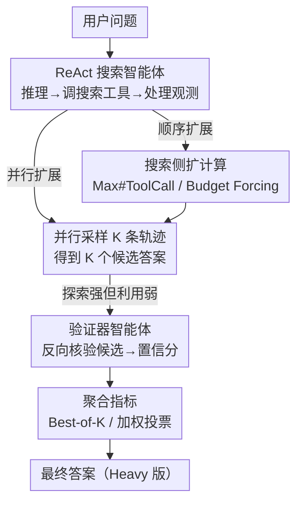

# Pushing Test-Time Scaling Limits of Deep Search with Asymmetric Verification

**会议**: ICLR 2026  
**OpenReview**: [https://openreview.net/forum?id=hxL4Uf9tR3](https://openreview.net/forum?id=hxL4Uf9tR3)  
**代码**: https://github.com/hkust-nlp/deepsearch-tts  
**领域**: Agent / LLM推理  
**关键词**: 深度搜索智能体, 测试时扩展, 非对称验证, Best-of-K, 计算最优

## 一句话总结
本文系统研究了深度搜索智能体的测试时计算扩展，发现"搜索难、验证易"的非对称验证特性，提出把一部分计算从搜索分配给验证器智能体来高效筛选候选答案，把 GLM-4.5、K2、Qwen3-2507、Tongyi-DeepResearch 等开源模型升级成 "Heavy" 版，在 BrowseComp 等基准上最高提升 20+ 个百分点，达到与 OpenAI Deep Research、o3 相当的水平。

## 研究背景与动机

**领域现状**：测试时扩展（test-time scaling）是当今最强 AI 系统（Grok 4 Heavy、GPT-5 Pro、Gemini-2.5 Pro Deep Think）的核心支柱，它有两条互补路径——**顺序扩展**（sequential scaling，拉长单条思维链/轨迹，如 o1、DeepSeek-R1）和**并行扩展**（parallel scaling，采样多条轨迹后用 Best-of-K 等聚合方法选优）。而"深度搜索"（Deep Research）类任务——需要在网页空间里递归搜索、浏览成百上千个页面、定位满足用户需求的信息——正是检验测试时扩展的代表性场景。

**现有痛点**：作者通过实验发现，简单地把计算砸到搜索智能体身上会撞上两堵墙。其一，**顺序扩展会过犹不及**：用 budget forcing 强制模型多调用工具，初期能把 GLM-4.5 在 BrowseComp 上的 Pass@1 从 19% 拉到 27%，但轨迹一长，模型难以维持连贯的长程推理，性能反而开始下降。其二，**并行扩展只增"探索"不增"利用"**：GLM-4.5 的 Pass@32 能飙到 67%（说明 32 条轨迹里几乎总有一条答对了），但 K2 的 Maj@16 只有约 12%，远低于其 Pass@16 的 34%——模型有能力"探索到"正确答案，却无法在一堆候选里"识别并选出"它。

**核心矛盾**：扩大探索空间增加了命中正确答案的概率，但搜索智能体本身缺乏从候选中挑出最优答案的能力；继续给搜索砸算力，边际收益急剧衰减且代价高昂（GLM-4.5 把准确率从 30% 提到 40% 需要约 500 次额外工具调用）。

**切入角度**：作者抓住"非对称验证"（Asymmetry of Verification）这一关键观察——很多任务**验证一个答案远比生成它容易**（数独、八皇后是经典例子）。深度搜索恰好具备这一性质：正向搜索要在巨大、稀疏的信息空间里导航，而反向验证只需从一个候选答案出发、核对它是否满足若干明确条件，搜索空间被极大压缩。实测在 BrowseComp 上，GLM-4.5 平均需要约 75 次工具调用才能搜出一个候选，验证它却只需约 18 次。

**核心 idea**：与其把所有算力都投到无止境地扩大候选数量，不如把相当一部分算力分配给**验证**——用一个与搜索智能体几乎同构的"验证器智能体"给候选答案打置信分，再用 Best-of-K / 加权投票筛选，从而以小得多的代价换取与扩搜索同等甚至更大的准确率提升。

## 方法详解

### 整体框架

本文不提出新模型，而是给"如何花测试时算力"建立一个统一框架：把扩展拆解成三个正交维度——**扩展目标**（搜索智能体 vs 验证器智能体）、**扩展策略**（Max # Tool Call / Budget Forcing / 并行采样）、**聚合指标**（Pass@1 / Maj@K / Best-of-K / 加权投票）。整条流水线是：先用一个极简的 ReAct 搜索智能体生成多条轨迹和候选答案；当发现单纯扩搜索"探索强、利用弱"后，引入一个仅改了 system prompt 的验证器智能体，对每个候选做几轮反向核验、输出置信分；最后按置信分聚合选出最终答案。沿这三个维度做"计算最优"的分配，就能把开源模型升级成 Heavy 版。

### 关键设计

**1. 极简 ReAct 搜索智能体：让"搜索算力"可控可量**

为了在受控条件下研究测试时扩展，作者基于 ReAct 设计了一个精简通用的搜索智能体：它迭代地"推理 → 生成并执行动作 → 处理来自真实网页环境的观测"，动作空间只有两种——给出最终答案，或调用搜索工具。搜索工具复用 WebThinker 的网页检索+浏览功能，输入是"查询 + 明确的搜索意图"，内部由一个固定的辅助模型（全文统一用 K2，不更换，以隔离变量）决定如何组织检索内容、是否需要进一步浏览。关键在于：作者用**实际工具调用次数**来近似测试时计算量，因为深度研究任务的本质就是反复与外部工具交互——这让"搜索算力"成为一个可量化、可控制的轴，后面所有扩展实验都建立在这个统一标尺上。

**2. 搜索侧顺序与并行扩展：暴露"探索强、利用弱"的瓶颈**

作者把扩搜索算力分两类。顺序扩展沿单条轨迹加码，含 Max # Tool Call（在 system prompt 里放宽最大工具调用数）和 Budget Forcing（模型给出初始答案后，再分配预算逼它继续探索别的解法路径）。实验显示 Max # Tool Call 利用率低（配额从 15 加到 50，工具用量和性能几乎不涨甚至倒退），而 Budget Forcing 能主动榨干算力（GLM-4.5 工具用量翻倍、Pass@1 从 19% 升到 27%），但轨迹过长后增益饱和并退化。并行扩展则独立采样 K 条轨迹再聚合，Pass@K 随 K 快速上升（GLM-4.5 从 16% 涨到 67%）。但这里暴露出核心瓶颈：Pass@K 的暴涨说明模型**能探索到**答案，Maj@K 却很低（K2 Pass@16≈34% 但 Maj@16≈12%），说明多数投票这种无验证的聚合**无法把对的挑出来**——这正是引入验证器的动机所在。

**3. 非对称验证器智能体：用小算力撬动大收益**

这是全文的核心。作者把搜索智能体几乎原封不动地改造成验证器智能体——**共享同一套框架、搜索工具，只改 system prompt**：让模型用搜索工具专门去核验某个预测答案是否成立，并据搜索结果给出一个置信分。之所以这样有效，是因为深度搜索的非对称验证性质：正向搜出一个 BrowseComp 候选要约 75 次工具调用，反向验证它只要约 18 次（见 Table 1，且这种非对称性随任务难度增大而增大）。作者用一个例子说明——"找一款 1992 年发售、系列首作上过世界纪录大全、第三作启发了传承续作、第五作首次有中文配音的游戏"——生成要遍历海量候选，但给定一个游戏，逐条核对发售年份、首作是否上榜即可轻松验证。因此把算力从"扩搜索"转向"加验证"，能用约 100 次额外调用就把 GLM-4.5 从 Maj@8 的 35.7% 提到加权投票的 45%，而单纯扩搜索要约 560 次调用才从 35.7%（Maj@16）涨到 40.8%（Maj@32）。

**4. 验证器的可扩展性 + 聚合指标：三轴联合的计算最优配置**

验证器本身也能继续扩展：对它施加 Max # Tool Call、Budget Forcing 或并行采样（对每个候选生成多条验证轨迹、置信分取平均以降低单次采样偏差），都能进一步抬高性能上限（K2 加 Budget Forcing 把准确率从 10% 拉到 20%）。聚合侧则用验证器的置信分做 **Best-of-K**（选分最高的轨迹）或 **加权投票**（按分加权聚合候选）。但增益高度依赖模型与策略组合——GLM-4.5 用"并行扩展 + Best-of-8"收益最大（达 42%），K2 反而用 Budget Forcing 以更低算力拿到更好的 Best-of-8。结论是：在实际部署中，**扩展目标、扩展策略、聚合指标三者应根据模型特性和算力预算联合选择**，以最大化"每单位算力的性能"。把这套三轴最优配置应用到开源模型上，就得到了各自的 Heavy 版本。

## 实验关键数据

### 主实验

最终在 4 个高难度信息检索基准（BrowseComp、BrowseComp-zh、GAIA、xbench-DeepSearch）上，Heavy 版相对原模型大幅提升，并追平顶尖闭源系统（†为作者实测的最大 Pass@1）：

| 模型 | BrowseComp | BrowseComp-zh | GAIA | xbench-DeepSearch |
|------|-----------|---------------|------|-------------------|
| OpenAI DeepResearch | 51.5 | 42.9 | 70.5 | 66.7 |
| OpenAI o3† | 55.0 | 59.0 | 68.0 | 68.0 |
| GLM-4.5† | 19.0 | 27.0 | 58.0 | 58.0 |
| **GLM-4.5 Heavy** | **54.0 (+35.0)** | 49.0 (+22.0) | 66.0 (+8.0) | 68.0 (+10.0) |
| Tongyi DeepResearch† | 43.0 | 39.0 | 70.6 | 68.0 |
| **Tongyi DeepResearch Heavy** | **69.0 (+26.0)** | 55.0 (+16.0) | 72.8 (+2.2) | 80.0 (+12.0) |
| Qwen3-2507 Heavy | 29.0 (+21.0) | 42.0 (+19.0) | 53.4 (+8.7) | 63.0 (+17.5) |
| K2 Heavy | 24.0 (+13.0) | 36.0 (+14.0) | 58.3 (+8.3) | 57.0 (+3.0) |

GLM-4.5 Heavy 作为开源系统，在 BrowseComp 上达 54.0%，与 OpenAI DeepResearch、o3 相当；Tongyi DeepResearch Heavy 进一步把 BrowseComp 推到 69.0%。

### 消融实验

非对称验证的核心证据（Table 1，各模型在各基准上"搜索 vs 验证"的平均工具调用数）：

| 模型 | BrowseComp 搜索 | BrowseComp 验证 | GAIA 搜索 | GAIA 验证 |
|------|-----------------|-----------------|-----------|-----------|
| GLM-4.5 | 75.3 | 18.0 | 17.4 | 10.6 |
| Qwen3-2507 | 32.4 | 11.3 | 9.7 | 7.9 |
| K2 | 27.8 | 11.2 | 6.2 | 5.8 |

验证器扩展策略对比（以 GLM-4.5 为例，从 Maj@8 的 vanilla 起步，应用各策略后的 Best-of-8 准确率）：

| 配置 | Qwen3-2507 | K2 | GLM-4.5 |
|------|-----------|-----|---------|
| Vanilla（仅扩搜索 Maj@8） | 16.9 | 10.0 | 30.6 |
| + Max # Tool Call | 20.0 | 18.0 | 39.0 |
| + Budget Forcing | 19.0 | 20.0 | 39.0 |
| + Parallel Scaling | 21.0 | 19.0 | 42.0 |

### 关键发现
- **验证比扩搜索的"准确率-代价"权衡好得多**：同样涨 10 个点，加验证器只需约 100 次额外调用，扩搜索要约 500 次——非对称性带来不成比例的收益。
- **探索≠利用**：Pass@K 暴涨但 Maj@K 低迷，说明瓶颈在"识别并选出正确答案"，而非"采样到正确答案"，这是引入验证器最直接的依据。
- **最优策略因模型而异**：GLM-4.5 偏好"并行 + Best-of-8"，K2 用 Budget Forcing 性价比更高——没有放之四海皆准的配置，需按模型特性和预算调。
- **顺序扩展有上限**：Budget Forcing 初期有效，过度施加后因长程推理难以维持而退化，并非越多越好。

## 亮点与洞察
- **"把算力从搜索挪到验证"是一个被低估的正交扩展维度**：以往测试时扩展主要在搜索/生成侧加码，本文用非对称验证给出一条更省的路——验证器与搜索智能体同构、改个 prompt 即可复用，工程代价极低却收益显著。
- **用工具调用数而非 token 数量计量算力**很贴合智能体场景，让"搜索贵、验证便宜"这一非对称性变得可测量、可比较，是整套论证的基石。
- **三轴解耦（目标/策略/指标）**给出了一张清晰的"测试时算力分配图"，把零散的扩展技巧统一进一个可指导部署决策的框架，可迁移到其他需要"生成-验证"的智能体任务（代码、数学、多步规划）。

## 局限与展望
- 非对称验证只对"验证易于生成"的任务成立；论文也指出存在近对称（如矩阵乘法）甚至难验证（如代码安全审计）的任务，本文方法在那些场景未必奏效。
- 为控成本，BrowseComp/BrowseComp-zh 仅用 100 个随机抽样任务评测（虽在附录做了三组互斥子集的鲁棒性分析），全量评测的稳定性仍待确认。
- 验证器复用搜索智能体框架、且全程固定 K2 作辅助模型，最优配置依赖大量逐模型调参；不同模型/策略/聚合的组合空间很大，缺乏自动选择最优配置的机制，留待后续。

## 相关工作与启发
- **vs Budget Forcing (Muennighoff et al., 2025)**: 该工作在推理任务里靠强制延长生成提升性能；本文把它搬到智能体搜索场景，并指出它过度施加会退化，转而引入验证器弥补"利用"短板。
- **vs Majority Voting / 自一致性 (Wang et al., 2022)**: 多数投票无需外部验证器，但本文实验显示在开放式深度搜索上 Maj@K 远低于 Pass@K，无法有效挑出正确答案，因此用基于验证器置信分的 Best-of-K / 加权投票替代。
- **vs WebThinker / ReAct (Yao et al., 2023)**: 本文复用其搜索-浏览工具与 ReAct 范式作为搜索智能体骨架，贡献不在 scaffold 本身，而在如何沿测试时算力维度高效扩展并加入验证。

## 评分
- 新颖性: ⭐⭐⭐⭐ 把"非对称验证"系统性引入深度搜索智能体的测试时扩展，视角新且实用
- 实验充分度: ⭐⭐⭐⭐ 覆盖 4 个基准、4 个开源模型、三轴扩展策略，证据链完整，但部分基准仅 100 抽样
- 写作质量: ⭐⭐⭐⭐ 从现象（探索强利用弱）到机制（非对称验证）再到框架（三轴）逻辑清晰
- 价值: ⭐⭐⭐⭐⭐ 让开源模型逼平 o3 / OpenAI DeepResearch，且方法工程代价低、可直接落地

<!-- RELATED:START -->

## 相关论文

- [\[ICLR 2026\] GTA1: GUI Test-time Scaling Agent](gta1_gui_test-time_scaling_agent.md)
- [\[ICLR 2026\] Test-Time Adaptation for LLM Agents via Environment Interaction](test-time_adaptation_for_llm_agents_via_environment_interaction.md)
- [\[ICLR 2026\] EvoTest: Evolutionary Test-Time Learning for Self-Improving Agentic Systems](evotest_evolutionary_test-time_learning_for_self-improving_agentic_systems.md)
- [\[ACL 2025\] METAL: A Multi-Agent Framework for Chart Generation with Test-Time Scaling](../../ACL2025/llm_agent/metal_a_multi-agent_framework_for_chart_generation_with_test-time_scaling.md)
- [\[ICLR 2026\] Open Data Synthesis for Deep Research](open_data_synthesis_for_deep_research.md)

<!-- RELATED:END -->
