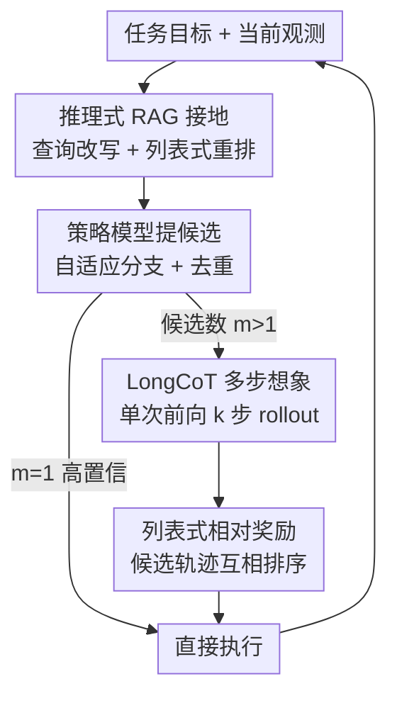

# R-WoM: Retrieval-augmented World Model for Computer-use Agents

**会议**: ICLR 2026  
**OpenReview**: [https://openreview.net/forum?id=5ZaoXB3MdP](https://openreview.net/forum?id=5ZaoXB3MdP)  
**代码**: 待确认  
**领域**: Agent / 计算机操作智能体 / 世界模型 / 检索增强  
**关键词**: 世界模型, 计算机操作智能体, 检索增强, 长程规划, 列表式奖励

## 一句话总结
作者先系统验证「LLM 当世界模型」短程能行、长程崩，再提出 R-WoM——用外部教程检索把世界模型的多步想象和奖励估计「接地」，在 OSWorld / WebArena 上相对最强基线提升最高 23.4%，且越是长程优势越明显。

## 研究背景与动机
**领域现状**：世界模型（world model）让智能体在真正执行动作前先「在脑子里模拟」未来状态、预估动作后果，从而避开计算机/浏览器环境里那些不可逆、试错代价高的操作。早期是 Dreamer、MuZero 这类在隐空间学环境动力学的 MBRL，近两年转向直接拿 LLM 当世界模型——靠大规模预训练来推理动作的后果。

**现有痛点**：LLM 天生爱幻觉，又只依赖训练时固化的静态知识，所以它做世界建模本质上是「不接地」的。在 OS 这种环境里，没有接地的智能体会生成「看起来连贯、实际跑不通」的操作步骤——论文 Figure 1 的例子里，让智能体把截图复制到光标处，靠内部知识它会丢失光标位置卡死，而有教程接地后它会用对的「插入图片」操作并保住光标位置。

**核心矛盾**：LLM 到底有没有资格当世界模型？作者把世界模型拆成两个核心能力——未来状态预测和奖励估计——设计三个探测任务去测：下一状态识别、全流程规划对齐、里程碑转移识别。结论很关键：LLM 在「识别下一状态」「判断哪段转移更有希望」这种短程/局部任务上很强（准确率普遍 75%+、80%+），但一到「全流程规划对齐」就崩（很少超过 65%）。也就是说，LLM 缺的不是泛泛的世界知识，而是特定环境下具体、最新的「操作流程知识」，长程模拟会误差累积。

**本文目标**：给 LLM 世界模型补上这块缺失的程序性知识，让它在长程模拟里不跑偏。

**切入角度**：教程（tutorial）可以看作环境动力学的高层抽象。如果在模拟时把相关教程检索进来当「依据」，就能把想象和奖励估计接地。但标准检索常常召回噪声或跑题内容（查「fork chatgpt」却召回通用的 Git fork 教程），所以接地的关键是先把检索做准。

**核心 idea**：用「推理式 RAG 检索到的环境教程」给 LLM 世界模型接地，再配合单次长思维链（LongCoT）多步想象和列表式相对奖励，替代旧方法昂贵的策略-世界模型反复 rollout 和不稳定的绝对奖励。

## 方法详解

### 整体框架
R-WoM 在每个决策步 $i$ 上的核心循环是：策略模型先看任务目标 $g$ 和当前观测 $o_i$ 提出 $m$ 个候选「思考-动作」对；世界模型在检索到的教程证据 $E$ 接地下，对每个候选做 $k$ 步想象 rollout，模拟出可能的未来轨迹；最后用世界模型对所有 rollout 做列表式相对打分，选出得分最高的动作真正执行，观测到 $o_{i+1}$ 后进入下一步，直到任务完成。整个过程由 Algorithm 1 串起来，教程证据 $E$ 在任务开始时检索一次、贯穿整个回合复用。

### 关键设计

**1. 推理式 RAG 接地：把「跑题召回」挡在世界模型之前**

世界模型接地的前提是教程检索要准，但纯 embedding 相似度会漏掉细粒度的任务约束、召回语义相近却跑题的内容。R-WoM 把检索做成两段：先把任务目标 $g$ 编码成查询 $q=f_{enc}(g)$，在向量空间按余弦相似度取 top-$k$ 候选块 $C_k$；再用策略模型本身当列表式重排器，条件在 $(q, C_k)$ 上对候选打分，产出最终证据集 $E=f^*_{p\text{rank}}(C_k, q)$。世界模型随后只在 $E$ 上接地做未来想象和奖励估计。实验里查询改写擅长处理表述含糊的任务（如「Fork ChatGPT」），重排则跨基准都能过滤掉语义无关候选，两者叠加时召回最高——这一步直接决定了接地知识的质量天花板。

**2. LongCoT 单次多步想象：用一次前向推理替代反复 rollout**

旧的世界模型方法（WebDreamer、WebEvolver）在策略模型和世界模型之间反复来回调用生成 rollout，多步想象要多轮模型调用，既慢又容易误差累积。R-WoM 受 DeepSeek-R1 启发，改用长思维链 rollout：给定教程证据 $E$，对候选 $(t_i^{(j)}, a_i^{(j)})$ 在一次前向推理序列里就把整条 $k$ 步想象轨迹 $\hat{\tau}_i^{(j)}=\pi_w^{LongCoT}(o_i, t_i^{(j)}, a_i^{(j)}; E)$ 展开完。为进一步省成本，它还加了自适应 rollout：**自适应动作分支**让策略自己决定提几个候选（$1 \le m \le n$），只有对下一步没把握时才展开多个、有把握时就提一个高置信动作；**动作去重**在 rollout 前用策略模型当验证器，剪掉语义等价的冗余候选。这样既保住了长程模拟，又把「不必要的全量模拟」砍掉了。

**3. 列表式相对奖励：让相近候选之间分得开**

先前工作用绝对稀疏奖励给每条 rollout 单独打分，但当候选轨迹都说得通、只在细微处有差别时，绝对分数会不敏感、打分不稳。R-WoM 借鉴相对奖励建模，改成列表式排序机制：把所有候选轨迹 $\hat{\tau}_i^{(j)}$ 放在一起用 LongCoT 推理互相比较、给相对偏好分，再选最优动作

$$(t_i^*, a_i^*) = \arg\max_{(t_i^{(j)}, a_i^{(j)}) \in A_c}\left[f_w\left(R(\hat{\tau}_i^{(j)}, g, E)\right)\right]$$

每条 rollout 都是在「所有候选的比较语境」里被打分，从而压掉绝对奖励信号带来的偏置，让动作选择更稳。

**4. 自博弈合成教程：把方法扩展到没现成教程的领域**

R-WoM 的接地依赖外部教程，但很多场景根本找不到现成教程。作者从自博弈轨迹里合成「经验式教程」来补这块：用 AgentNet 开源的约 2k 条轨迹合成约 1.3k 条对 OSWorld 任务可能有用的教程（与测试任务无重叠），当作通用操作指南喂给世界模型接地。在 Claude-3.7/4/4.5 三个模型上，这种合成教程接地仍稳定优于各基线，说明 R-WoM 在教程稀缺时也能靠自博弈合成知识落地，而不是只能吃现成文档。

## 实验关键数据

### 主实验
在 OSWorld（采样 87/361）和 WebArena（采样 113/301）两个真实环境上，对比 Vanilla、RAG、WebDreamer 三个基线，三次运行取均值。R-WoM 在所有 backbone 上都稳定最优：

| 模型 | 方法 | OSWorld | WebArena |
|------|------|---------|----------|
| Qwen-2.5-VL-72B | 最强基线(RAG/WebDreamer) | 30.84 / 28.37 | 24.50 |
| Qwen-2.5-VL-72B | R-WoM | **37.48** ↑21.5% | **28.49** ↑16.3% |
| Claude-3.5-Sonnet | 最强基线 | 23.48 | 30.70 |
| Claude-3.5-Sonnet | R-WoM | **26.01** ↑10.8% | **33.15** ↑8.0% |
| Claude-3.7-Sonnet | 最强基线 | 31.24 | 32.75 |
| Claude-3.7-Sonnet | R-WoM | **38.54** ↑23.4% | **34.58** ↑5.6% |

### 消融与分析

| 配置 / 分析 | 关键指标 | 说明 |
|------|---------|------|
| 检索：查询改写 + 重排 | Recall@5 > 85%(OS) / 接近 86%(Web) | 两者叠加召回最高，互补 |
| 接地质量：无接地→检索→oracle | 性能单调上升 | 程序知识越准，长程模拟越好 |
| 想象步长 1→4（WebDreamer） | 2 步后停滞甚至下降 | 无接地易误差累积 |
| 想象步长 1→4（R-WoM） | 约第 3 步达峰 | 教程接地稳住长程 rollout |
| 教程稀缺（自博弈合成） | 三个 Claude 上稳定超基线 | 合成教程也能接地 |

### 关键发现
- **越长程优势越大**：WebDreamer 这类无接地世界模型超过 2 步就因预测误差累积而停滞/下滑，R-WoM 靠教程接地能撑到第 3 步左右才回落——接地的价值正在长程模拟上。
- **接地质量决定上限**：从无接地到检索教程再到 oracle 教程，端到端成功率单调上升，说明「程序性知识的准确度」直接转化为长程模拟质量。
- **检索两段缺一不可**：查询改写主要救含糊任务，重排主要过滤语义无关候选，单独用都不如叠加。

## 亮点与洞察
- **先证伪再补救的叙事**：论文没有上来就提方法，而是先用三个探测任务把「LLM 当世界模型」的能力边界量化清楚（短程行、长程崩），让 R-WoM 的「接地」动机非常扎实——这种「先诊断后开药」的写法值得借鉴。
- **用 LongCoT 把多轮 rollout 压成单次前向**：把「策略↔世界模型反复通信」换成一次长思维链展开整条想象轨迹，既是效率优化也是减少累积误差的手段，是 R1 式推理范式迁移到 agent 规划的巧妙落点。
- **列表式相对奖励解决「都对但有细微差别」**：当候选 rollout 都合理时绝对打分会糊成一团，改成互相排序天然把它们拉开——这个思路可迁移到任何「候选质量接近、需要细分」的打分场景。
- **自博弈合成教程**让「检索增强」摆脱了对现成文档的依赖，把方法的适用面从「有教程」扩到「能自博弈」。

## 局限与展望
- **依赖教程/知识库质量**：R-WoM 的接地效果天花板就是检索到的教程质量，oracle 设置远好于自动检索说明自动检索仍有差距；外部来源也可能引入偏见（作者在伦理声明中承认）。
- **评测在采样子集上**：主实验只在 OSWorld/WebArena 「有教程可检索」的子集上做（87/361、113/301），对那些天然没有教程、也难自博弈的任务覆盖如何尚不清楚。
- **想象步长仍有上限**：即便接地，R-WoM 也只是把回落点从第 2 步推到第 3 步左右，并没有真正解决超长程模拟的误差累积，只是延缓。
- **改进方向**：把世界模型与策略做更紧的协同进化、或在 rollout 内动态触发再检索，可能进一步把长程上限往后推。

## 相关工作与启发
- **vs WebDreamer**：WebDreamer 开创「LLM 当世界模型模拟候选动作」，但用策略-世界模型迭代 rollout、且无外部接地；R-WoM 用单次 LongCoT 替代迭代、用教程检索接地，长程上明显更稳。
- **vs WMA（Web agents with world models）**：WMA 把状态转移抽象成自然语言摘要来辅助规划，仍是内部知识；R-WoM 强调引入外部、最新的环境特定程序知识。
- **vs WKM / WebEvolver**：它们走「世界模型与策略协同进化」路线，逐步精炼模拟与规划；R-WoM 不训练协同进化，而是在推理时直接用检索教程接地，更轻量。
- **vs Synatra / AgentTrek / Learn-by-interact**：这些工作用教程离线生成轨迹去训练 agent；R-WoM 的差异是在推理时用教程接地世界模型，而非离线造数据。

## 评分
- 新颖性: ⭐⭐⭐⭐ 「检索接地世界模型 + LongCoT 单次 rollout + 列表式相对奖励」的组合在 computer-use agent 上是新的，单个组件有先例。
- 实验充分度: ⭐⭐⭐⭐ 三个 backbone × 两个真实基准 + 探测分析 + 接地质量/想象步长/教程稀缺多角度消融，较完整。
- 写作质量: ⭐⭐⭐⭐⭐ 「先量化能力边界再对症下药」的结构清晰，动机扎实。
- 价值: ⭐⭐⭐⭐ 给「LLM 世界模型为何长程崩、怎么救」提供了可复用的诊断+接地范式，对 computer-use agent 社区有实用价值。

<!-- RELATED:START -->

## 相关论文

- [\[ICLR 2026\] VideoAgentTrek: Computer Use Pretraining from Unlabeled Videos](videoagenttrek_computer-use_pretraining_from_unlabeled_videos.md)
- [\[ICLR 2026\] SCUBA: Salesforce Computer Use Benchmark](scuba_salesforce_computer_use_benchmark.md)
- [\[ICLR 2026\] ViMo: A Generative Visual GUI World Model for App Agents](vimo_a_generative_visual_gui_world_model_for_app_agents.md)
- [\[ICLR 2026\] OSWorld-MCP: Benchmarking MCP Tool Invocation in Computer-Use Agents](osworld-mcp_benchmarking_mcp_tool_invocation_in_computer-use_agents.md)
- [\[ICLR 2026\] Grounding Computer Use Agents on Human Demonstrations](grounding_computer_use_agents_on_human_demonstrations.md)

<!-- RELATED:END -->
