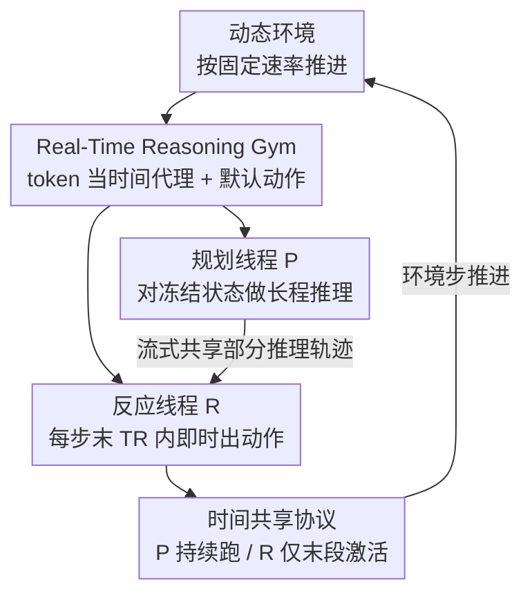

# Real-Time Reasoning Agents in Evolving Environments

**会议**: ICLR 2026  
**OpenReview**: [https://openreview.net/forum?id=n1AvXiU2lu](https://openreview.net/forum?id=n1AvXiU2lu)  
**代码**: 待开源（作者承诺论文发表后放出）  
**领域**: Agent / LLM 推理  
**关键词**: 实时推理、动态环境、反应式智能体、规划式智能体、双线程

## 一句话总结
这篇论文提出"实时推理（real-time reasoning）"这一新问题——环境在智能体思考时仍在不停演化，并构建了 Real-Time Reasoning Gym 来衡量它；进一步提出 AgileThinker，让"规划线程"和"反应线程"两个 LLM 并行跑、且反应线程能读到规划线程未完成的中间思考，在认知负荷和时间压力上升时稳定超越只用单一范式的智能体。

## 研究背景与动机
**领域现状**：当前绝大多数 LLM 智能体的评测都建立在一个隐含假设上——环境只在智能体产出一个动作后才推进一步（turn-based）。无论是 ReAct 式的推理-行动循环，还是各种 planning 增强，环境都会"礼貌地"停下来等智能体把推理走完。

**现有痛点**：真实世界不会暂停。开车时你还在盘算走哪条车道，前车已经刹停、出口已经掠过；做饭时你还在想下一步，搭档已经把锅端走了。在这种"环境与计算并行演化"的世界里，智能体面临一个被现有评测完全回避的难题：既要逻辑正确，又要时机及时（logical **and** timely）。现有方法因为假设环境会等它，所以从未被真正测过"边想边变"的能力。

**核心矛盾**：推理深度和响应延迟之间存在根本的 trade-off。想得越深越准，但花的时间越长、环境变得越多，等你想完世界已经不是当初那个世界了；反过来，想得越快越能跟上变化，但又缺乏对未来后果的远见。单一范式无法同时兼顾。

**本文目标**：(1) 把"实时推理"形式化成一个可复现、可调难度的评测问题；(2) 系统比较反应式与规划式两类智能体在时间压力下的表现；(3) 设计一个能同时吃到两种范式好处的智能体。

**切入角度**：作者借用认知科学的双过程理论（System 1 快直觉 / System 2 慢审慎），但关键观察是——人类的两套系统不是割裂运行的，快系统能实时参考慢系统**尚未完成**的思考。现有的 dual-system LLM 方法要么两套系统各跑各的、要么一套必须等另一套跑完才能用其输出，恰恰丢掉了这个"共享中间状态"的精髓。

**核心 idea**：让两个 LLM 真正并行——规划线程持续做长程推理，反应线程在每个环境步的最后时刻被唤醒、读取规划线程**部分**推理轨迹后即时出动作，用"共享未完成思考"打通深度与速度。

## 方法详解

### 整体框架
论文分两块：先定义评测台 Real-Time Reasoning Gym，再在其上提出三类智能体设计，最后落到 AgileThinker。

Gym 的核心改动是把 OpenAI Gym 的智能体循环改成"环境按固定速率推进、不等智能体思考完"。常规循环里 `agent.think()` 会阻塞到推理结束才 `step`；实时循环里 `agent.think(timeout=T_E)` 只给固定预算 $T_E$，超时还没产出有效动作就用一个默认动作（沿用上一方向 / 原地待命）让环境强行前进。为了硬件无关、可复现，作者用**生成 token 数当时间代理**：解码时间 $T = N_T \times \text{TPOT}$，每生成 $N_{T_E}$ 个 token 环境就走一步。

在这个台子上比较三种范式：反应式智能体（每步都在 token 预算 $N_i \le N_{T_E}$ 内出一个动作，保证及时但想不深）、规划式智能体（一次性生成多步动作序列或一段 code-policy，想得深但对环境变化反应迟钝），以及二者并行的 AgileThinker。

### 关键设计

**1. Real-Time Reasoning Gym：把"环境边变边等不及"做成可复现评测**

针对"现有评测都假设环境会暂停、根本测不出及时性"这个痛点，作者把决策问题重新形式化：环境状态以固定速率更新，与智能体是否想完无关，没产出动作就执行默认动作。为了让评测不依赖具体硬件、可复现，关键一招是**用生成 token 数代替墙钟时间**——因为 LLM 解码时间几乎随输出长度线性增长（$T = N_T \times \text{TPOT}$，预填充时间在长序列下可忽略），于是"每 $N_{T_E}$ token 推进一步"就成了一个硬件无关的时间单位。Gym 含三个游戏，各自压测动态环境的一个侧面：Freeway 考"动态危险"（车流穿行）、Snake 考"转瞬即逝的机会"（苹果限时出现）、Overcooked 考"与动态伙伴协作"（脚本伙伴按非平稳策略自行行动）。

**2. 两个可调旋钮：认知负荷与时间压力解耦**

光有动态环境还不够，要能系统地扫出"在多难、多急的情况下谁先崩"。作者给每个游戏设计了独立可调的两个维度。**认知负荷**控制任务本身有多难：Freeway 用过马路的最少步数 $S$（路越长越需要深规划），Snake 用障碍密度 $N$，Overcooked 用厨房台面长度 $L$（台面越长导航越复杂、长短期目标落差越大），每个游戏分 easy/medium/hard 三档。**时间压力**控制每步给多少 token 预算 $N_{T_E}$，设 32k / 16k / 8k / 4k 四档，从松到紧。分数按该游戏可达最高分归一化到 $[0,1]$；强实时推理能力的体现不是绝对高分，而是随负荷和压力上升时**掉得更慢**。要注意 Gym 是在固定模型族（如 DeepSeek-V3/R1）下比较系统设计，跨模型比较因 tokenizer 和架构不同并不公平。

**3. AgileThinker 双线程并行 + 共享未完成思考：同时拿到深度与速度**

这是本文的方法核心，直接针对"单一范式无法兼顾"的矛盾。AgileThinker 跑两个并行线程：规划线程 $P$ 持续对（被冻结的）游戏状态做长程多步推理，流式吐出思考过程；反应线程 $R$ 在严格时间约束 $T_R \le T_E$ 下，基于**最新观测**和 $P$ 当前**已经产出的部分**推理轨迹，即时给出当前这一步动作。与既有 dual-system 方法的根本区别在于：别人要么两套系统各跑各的、要么 System 1 必须等 System 2 跑完才能用其输出，而这里 $R$ 能实时读 $P$ 尚未结束的中间 insight——$P$ 关于长期目标的判断（如"先别吃最近那个苹果会害死自己"）很多在较长时间窗内都有效，$R$ 拿来即用，既不必从零思考也不必干等。两线程靠**时间共享协议**协调：每个环境步内 $P$ 一直跑，$R$ 只在最后 $T_R$ 时间单位激活。超参 $T_R$ 决定二者资源分配——$T_R$ 越大反应越灵敏，但留给 $R$ 参考的 $P$ 推理就越少；如何平衡是成败关键。

### 一个例子：Snake 第 3 步的三方对照
同一局 Snake，环境演化到第 3 步：

- **反应式智能体（V3）**：只看眼前，贪心冲向最近的苹果 $(5,2)$，三步后必然撞死——它没算到这口食会把蛇逼进死角。
- **规划式智能体（R1）**：还在对**第 1 步的旧观测**做推理，蛇其实早已前移，于是默认往左，按过时计划走最终撞墙；但它的推理里其实**正确识别**出"最近的苹果寿命够长、可以晚点吃、先吃会害死自己"。
- **AgileThinker**：反应线程读到规划线程这条"别急着吃 $(5,2)$"的中间判断，于是当前步选择向上奔向更安全的食物目标 $(3,5)$，既避开陷阱又跟上了环境的实时变化。

这个例子正好把"规划线程有远见但慢、反应线程及时但短视、共享中间思考后二者互补"具象化。

### 损失函数 / 训练策略
本文不训练模型，是一个评测台 + 推理时智能体架构的工作，固定用 DeepSeek-V3（非思考模型）和 R1（思考模型）。关键的资源调度策略是反应线程 token 预算 $N_{T_R}$ 的设置：实验发现性能在 $N_{T_R}$ 逼近 $R$ 的"自然 token 上界"（由 $R$ 不受截断时 token 用量的 CDF 给出）时达到峰值——太小则 $R$ 来不及消化 $P$ 的指导，太大则 $R$ 早早做完只能干等而 $P$ 还在产出有用推理。最优预算随环境不同需经验调，但 AgileThinker 在很宽的预算范围内都稳超单系统基线，所以粗略估上界即可；附录还给了一个测试时动态调整 $N_{T_R}$ 的机制，同样有效。

## 实验关键数据

### 主实验
评测在两组设置下扫描：(1) 固定时间压力 8k token/步、变认知负荷（易/中/难）；(2) 固定中等负荷、变时间压力（4k–32k）。每个设置跑 32 次（8 游戏种子 × 4 采样种子）取均值。

| 维度变化 | 范式 | 起点分 | 终点分 | 解读 |
|----------|------|--------|--------|------|
| 认知负荷 易→难 | 反应式 | 0.89 | 0.15 | 缺远见，难度一上来就崩 |
| 认知负荷 易→难 | AgileThinker | 0.88 | 0.50 | 掉得明显更慢 |
| 时间压力 松→紧 | 规划式 | 0.92 | 0.05 | 计划基于过时观测，压力下几乎全废 |
| 时间压力 松→紧 | AgileThinker | 0.90 | 0.58 | 始终保持高位 |

结论清晰：反应式牺牲质量换效率（认知负荷一高就掉到 0.15），规划式牺牲效率换质量（时间一紧就掉到 0.05），只有 AgileThinker 在两个维度恶化时都稳。

墙钟时间验证（$T_E=6$ 分钟、约 8k token/步，用实测 TPOT=0.047 s/token）进一步确认优势不是模拟产物：

| 环境 | 反应式 (V3) | 规划式 (R1) | AgileThinker |
|------|-------------|-------------|--------------|
| Freeway | 0.24 | 0.12 | 0.88 |
| Snake | 0.37 | 0.04 | 0.45 |
| Overcooked | 0.57 | 0.00 | 0.89 |

### 消融实验

| 配置 | 关键表现 | 说明 |
|------|---------|------|
| AgileThinker（完整） | 各维度稳超基线 | 双线程 + 共享中间思考 |
| R1 + Budget Forcing（反应变体） | 0.01 < 0.39 (vs V3) | 强行截断推理多半产出 no-op，反而更差 |
| R1 + Code-Policy（规划变体） | 仅 Freeway 类算法任务有效 | 需 Theory-of-Mind 的复杂场景压不进代码 |
| $N_{T_R}$ 过小 (0.5k) | 低分 | $R$ 来不及消化 $P$ 的指导 |
| $N_{T_R}$ 过大 | 性能回落 | $R$ 做完干等、浪费了 $P$ 的产出 |

### 关键发现
- 反应线程 token 预算 $N_{T_R}$ 的最优值约等于 $R$ 不被截断时的自然 token 用量上界（由 CDF 揭示），说明"让 $R$ 充分用满又不浪费"是关键。
- token 数与真实推理时间近乎完美线性：$T = 0.0473 N + 334.55$，$R^2 = 0.9986$，从而验证了"用 token 当时间代理"这一核心抽象的实际相关性。
- 现成的预算控制方法（budget forcing 等）无法在松/紧两种预算下都奏效，从反面论证了实时环境需要双 LLM 架构。

## 亮点与洞察
- **"环境不暂停"这一形式化本身就是最大贡献**：一行 `think(timeout=T_E)` + 默认动作，把被整个领域回避的"边想边变"问题落地成可跑的 Gym，简单却切中要害。
- **用 token 当硬件无关的时间单位**：既绕开 GPU/网络抖动让结果可复现，又用 $R^2=0.9986$ 的线性关系证明它对应真实墙钟时间——这是把模拟和现实接上的关键一笔。
- **"反应线程读规划线程未完成的思考"是真正新的机制**：以往 dual-system 要么并行隔离、要么串行等待，这里的"共享流式中间轨迹"让快系统借到慢系统的远见而无需等待，可迁移到任何需要"边算边用"的级联/双系统设计。
- **评分哲学反直觉**：好坏不看绝对分，看"随难度和压力上升掉得多慢"，这对所有时间受限系统的评测都有借鉴意义。

## 局限与展望
- **只在 DeepSeek 上验证**：作者坦言一是开源模型整体偏弱、系统间差异不显著；二是 OpenAI/Google/Anthropic 不提供推理轨迹，而 AgileThinker 恰恰依赖"读到中间思考"，因此无法在主流闭源思考模型上跑。这限制了结论的普适性。
- **与人类双系统的类比仅是启发**：作者明确说没有实证证明 AgileThinker 真在建模人类 System 1/2，连接与差异需更严格评估。
- **最优 $N_{T_R}$ 需逐环境经验调**：虽然有动态调整机制，但跨环境没有自适应的统一解。
- 三个游戏虽各压一个侧面，但仍是格子/小游戏，离真实开放世界（多目标、长程、噪声）还有距离，未来可扩到更现实场景，或反过来用 Gym 训练"有紧迫感"的 LLM 智能体。

## 相关工作与启发
- **vs 传统 RL 的延迟建模（Delay-Aware MDP / sticky-action / 异步交互 MDP）**：它们也处理"计算有延迟"，但局限在传统 RL 范畴；本文首次把实时推理问题形式化到 LLM 智能体，并用 token 计数作硬件无关的时间单位，使跨系统比较公平可复现。
- **vs 预算控制方法（budget forcing / L1 等）**：这类方法试图在固定预算下榨干 LLM 性能，但对生成 token 数控制不精、预算偏离适配区间就掉点；本文实验证明它们无法在松紧两种预算下同时奏效，从而论证了双 LLM 架构的必要性。
- **vs 既有 dual-process LLM 设计（FSM/ViT/小模型当 System 1 + LLM 当 System 2）**：它们大多把两套系统当级联阶段或隔离并行；AgileThinker 的差异在于让 System 1 实时访问 System 2 的部分推理轨迹，用共享上下文打通"经典实时效率"与"现代 LLM 推理能力"。

## 评分
- 新颖性: ⭐⭐⭐⭐⭐ 首次形式化实时推理问题，"共享未完成思考"的双线程机制是真新点
- 实验充分度: ⭐⭐⭐⭐ 双维度扫描 + 墙钟验证 + 资源消融充分，但只在 DeepSeek 一个模型族上
- 写作质量: ⭐⭐⭐⭐⭐ 问题动机讲得极清楚，case study 把机制讲活了
- 价值: ⭐⭐⭐⭐⭐ 为时间受限 AI 系统立了一个可复现 testbed，方向开阔

<!-- RELATED:START -->

## 相关论文

- [\[ICLR 2026\] Gaia2: Benchmarking LLM Agents on Dynamic and Asynchronous Environments](gaia2_benchmarking_llm_agents_on_dynamic_and_asynchronous_environments.md)
- [\[ICLR 2026\] Test-Time Adaptation for LLM Agents via Environment Interaction](test-time_adaptation_for_llm_agents_via_environment_interaction.md)
- [\[ICLR 2026\] MemGen: Weaving Generative Latent Memory for Self-Evolving Agents](memgen_weaving_generative_latent_memory_for_self-evolving_agents.md)
- [\[ACL 2026\] ZARA: Training-Free Motion Time-Series Reasoning via Evidence-Grounded LLM Agents](../../ACL2026/llm_agent/zara_training-free_motion_time-series_reasoning_via_evidence-grounded_llm_agents.md)
- [\[ICLR 2026\] VitaBench: Benchmarking LLM Agents with Versatile Interactive Tasks in Real-world Applications](vitabench_benchmarking_llm_agents_with_versatile_interactive_tasks_in_real-world.md)

<!-- RELATED:END -->
