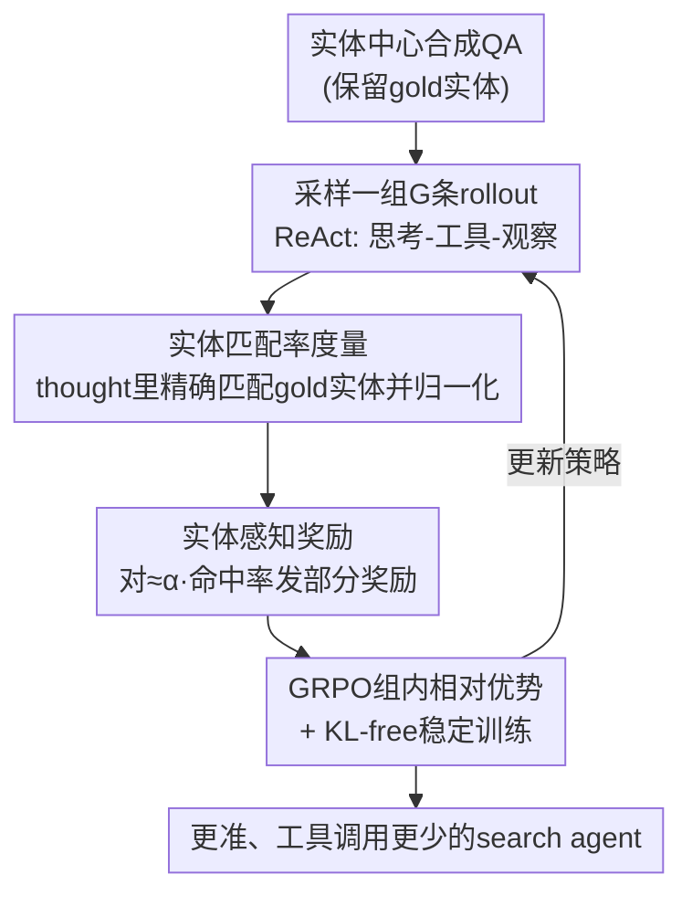

# Repurposing Synthetic Data for Fine-grained Search Agent Supervision

**会议**: ICLR 2026  
**OpenReview**: [https://openreview.net/forum?id=CByVWPpb8T](https://openreview.net/forum?id=CByVWPpb8T)  
**代码**: 待确认  
**领域**: LLM Agent / 强化学习 / 搜索智能体  
**关键词**: 搜索智能体, GRPO, 实体感知奖励, 稠密奖励, 合成数据

## 一句话总结
用来合成训练数据时埋下的"关键实体"反过来当作过程监督信号，提出实体感知的 E-GRPO：给答错但中间推理对了一半的"擦肩而过"样本按实体命中率发部分奖励，从而在多个 QA 与深度检索基准上稳定超过 GRPO，并且学到工具调用更少的策略。

## 研究背景与动机
**领域现状**：LLM 搜索智能体（search agent）越来越依赖"实体中心"的合成数据来训练——先有一个简单的种子问题，再通过事实注入（fact injection）、模糊化（fuzzing）等操作不断套娃，把一个个具名实体替换成绕弯子的描述，造出层层嵌套的难题。这些被替换掉的实体，恰恰构成了正确答案的事实骨架。训练时主流用 GRPO（Group Relative Policy Optimization）这类 RL 方法。

**现有痛点**：GRPO 用的是基于结果的稀疏奖励——答对给 1，答错给 0，把数据合成阶段精心埋进去的实体信息全部丢弃。这导致奖励稀疏：一个答错但中间正确识别出了演员（Leonardo）和电影（Titanic）的"擦肩而过"（near-miss）样本，和一个完全没搞懂问题的彻底失败样本，拿到的奖励都是 0，被一视同仁地惩罚。模型因此学不到藏在部分正确推理里的宝贵信号，被迫反复重学它本已掌握的步骤。

**核心矛盾**：搜索智能体需要细粒度的过程监督，但数学/代码领域那套办法在这里行不通——网页搜索是开放式的，给每一步标注训练 PRM（过程奖励模型）成本高得离谱；轨迹动辄几十次工具调用，基于树搜索的步级采样在计算上也不可行。于是留下一个空缺：怎么拿到既细粒度、又有信息量、还计算上便宜的奖励信号？

**切入角度**：作者观察到答案其实"藏在眼皮底下"——就是 GRPO 丢弃的那些合成实体。他们做了一个关键的实证分析：对每个问题跑 8 次 rollout，分别统计答对和答错的 rollout 平均命中了多少 gold 实体，发现答对组的实体命中率高于答错组的问题，以约 4:1 的比例（1939 vs 487）压倒性多于反例。这说明实体命中率是答案正确性的强代理。

**核心 idea**：把合成数据里被丢弃的 gold 实体重新利用起来，构造一个稠密的实体感知奖励——答错的样本不再统一给 0，而是按它在推理中命中的实体比例发部分奖励，让"擦肩而过"比"彻底失败"得分更高。

## 方法详解

### 整体框架
E-GRPO 不改 GRPO 的优化主干，只重写奖励函数。流程是：拿一条保留了 gold 实体的实体中心合成 QA，采样一组 $G$ 条 rollout；对每条轨迹统计它的"实体匹配率"——即智能体在思考（thought）文本里精确字符串匹配到了多少 gold 实体；再用这个匹配率构造稠密奖励：答对给满分、答错按归一化匹配率给部分奖励、格式/超长错误给 0；最后照常用 GRPO 的组内相对优势把奖励变成训练信号去更新策略。整套改动几乎零额外计算成本，因为实体匹配只是字符串比对。

### 关键设计

**1. 实体匹配率：把合成数据里丢弃的实体变成可量化的细粒度信号**

要把实体重新利用，先得能量化"这条推理对了多少"。给定一条合成 QA $(q, gt)$，保留生成时用到的 $m$ 个 gold 实体 $E_q=\{e^{(1)},\dots,e^{(m)}\}$。对一条 rollout $H^{(i)}$，把它所有思考片段拼起来，统计其中以完整短语精确字符串出现过的 gold 实体集合 $E^{(i)}_{matched}$，则该轨迹的实体匹配率为

$$\gamma_i = \frac{|E^{(i)}_{matched}|}{|E_q|} = \frac{|E^{(i)}_{matched}|}{m}.$$

直接用 $\gamma_i$ 有个问题：不同问题难度不同，绝对命中率没法横向比。于是再做组内归一化——用本组内观测到的最大命中率 $\gamma_{max}=\max_j \gamma_j$ 去除，得到归一化匹配率 $\hat{\gamma}_i = \gamma_i / \gamma_{max}$（$\gamma_{max}=0$ 时取 0），把所有 rollout 拉到统一的 0–1 尺度，保证后续优势计算跨组稳定。作者进一步分析了归一化匹配率的分布：答对样本（绿）在 1.0 处尖峰，答错样本（红）呈双峰——一个大峰在 0.0（彻底失败），另一波散布在中高区间（正是有价值的"擦肩而过"），说明这个指标不是简单的过/不过，而是能把 near-miss 从彻底失败里区分出来的连续刻度。

**2. 实体感知奖励：给"擦肩而过"发部分奖励，造出区分负样本质量的稠密谱**

有了匹配率就能重写奖励。GRPO 的奖励只有 $R_i\in\{0,1\}$，答错全是 0，对一组全错的样本梯度为零、什么也学不到。E-GRPO 把奖励改成三档：

$$R_i = \begin{cases} 1 & H^{(i)} \text{ 答对} \\ \alpha \cdot \hat{\gamma}_i & H^{(i)} \text{ 答错} \\ 0 & H^{(i)} \text{ 出错(格式/超长)} \end{cases}$$

其中 $\alpha\in[0,1]$ 是平衡"答对"和"实体命中"两件事权重的超参。这一改带来两个直接好处：其一，它在答错样本之间造出一条稠密奖励谱——一个命中了 Leonardo 的 near-miss 拿到 $\alpha\cdot 0.5$，比命中 0 个实体的彻底失败（0 分）更高，模型从此知道"虽然答错了但你这条路走对了一半"；其二，即便整组全答错，只要有人命中实体就有非零奖励差，组内归一化后仍有梯度，而标准 GRPO 此时完全没有学习信号。这个奖励照常通过 $\hat{A}_{i,j} = (R_i - \text{mean}(\{R_k\})) / \text{std}(\{R_k\})$ 变成 token 级优势，再进 GRPO 目标，因此除了改奖励几乎不增加任何计算。

**3. KL-free 训练与错误处理：保证稠密奖励下策略不崩**

光改奖励还不够，作者在所有模型（包括 baseline）上统一加了几项工程处理来稳住训练。RL 之前先做冷启动 SFT（11K SailorFog-QA 样本），让模型先学会智能体输出格式，避免奖励崩溃。训练时沿用 DAPO 的做法去掉 KL 正则项、并用 clip-higher 抬高上裁剪界 $\varepsilon_{high}$ 来鼓励探索。错误处理上：格式错的 rollout 直接给 0 奖励（因为冷启动后模型本该会格式，从严惩罚合理）；超长 rollout 也给 0，但有个细节——它们仍参与组内 mean/std 的归一化计算，却被排除在最终 loss 之外，因为预实验发现直接在超长样本上优化会导致策略崩塌。这些设计共同保证了稠密实体奖励引入后训练依然稳定。

## 实验关键数据

### 主实验
覆盖 11 个基准（单跳/多跳 QA + 4 个深度检索），模型用 Qwen2.5-7B-Instruct 与 Qwen3-30B-A3B（含 dense 和 MoE 两种架构），分 Local（本地维基语料模拟）与 Web（真实联网）两种环境。用 Qwen2.5-72B 做 LLM-as-Judge，报 Pass@1 / Pass@3。

| 设置 | 模型 | 平均 | 相对 GRPO |
|------|------|------|----------|
| Local 环境 QA | Local-7B-SFT | 60.2 | — |
| Local 环境 QA | Local-7B-GRPO | 61.4 | baseline |
| Local 环境 QA | Local-7B-E-GRPO | **64.2** | +2.8（较 SFT +4.0） |
| Web 环境 QA | Local-7B-GRPO | 66.2 | baseline |
| Web 环境 QA | Local-7B-E-GRPO | **67.8** | +1.6 |

深度检索基准上（Web 环境），E-GRPO 在 7B 和 30B 两个规模都稳超 GRPO：

| 模型 | GAIA P@1 | BrowseComp | BrowseComp-ZH | xbench-DS |
|------|----------|-----------|---------------|-----------|
| WebSailor-32B | 53.2 | 10.5 | 25.5 | 53.3 |
| Web-30B-GRPO | 47.6 | 12.3 | 25.7 | 45.3 |
| Web-30B-E-GRPO | **48.5** | **12.9** | **26.4** | **46.7** |

Web-30B-E-GRPO 在 BrowseComp（12.9）和 BrowseComp-ZH（26.4）上拿到 ≤32B 开源智能体最佳，BrowseComp 上甚至反超 Claude-4-Sonnet（12.2）。

### 消融实验

| 配置 | 关键结果 | 说明 |
|------|---------|------|
| $\alpha=0.0$ | 退化为 GRPO | 不发实体奖励 |
| $\alpha=0.1$ | 普遍上升 | 加一点实体奖励即有增益 |
| $\alpha=0.3$ | **峰值** | 各基准最优 |
| $\alpha=0.5$ | 多数基准回落 | 实体奖励过强分散了"答对"的主目标 |
| Pass@3（GAIA） | GRPO 44.7 → E-GRPO 51.5 | +6.8，Pass@3 增益最显著 |

### 关键发现
- **实体匹配率确实是正确率的代理**：训练动态中实体匹配率曲线和准确率曲线同涨同跌；E-GRPO 通过显式激励更高的实体命中率，把这个子目标转化为最终准确率的提升。
- **学到的策略更高效**：E-GRPO 持续用更少的工具调用完成 rollout——奖励命中关键实体引导智能体走更直接、更有信息量的路径。
- **Pass@3 增益最大**：GRPO 的结果奖励倾向于打磨已有的成功策略，而 E-GRPO 鼓励探索"有希望但不完整"的路径，构建更多样的解集，因而在少数几次尝试内命中的概率显著提高。
- **$\alpha$ 要适中**：太大（0.5）会让模型偏离"答对"主目标，0.3 是甜点。

## 亮点与洞察
- **变废为宝的视角**：数据合成阶段被丢弃的中间实体，本来是"垃圾"，作者发现它正是免费的过程监督——不需要训 PRM、不需要树搜索采样，一次字符串匹配就拿到细粒度奖励，计算成本几乎为零。这种"信号藏在眼皮底下"的洞察很优雅。
- **先做相关性分析再设计奖励**：作者没有拍脑袋，而是先用 4:1 的统计证据证明实体命中率和正确率强相关，再据此设计奖励，方法论上自洽。
- **可迁移性**：把"用生成数据时的中间产物当奖励"的思路推广开——任何用程序化方式合成训练数据的任务（合成代码题保留的中间变量、合成数学题保留的中间步骤），都可能用类似办法造稠密奖励。

## 局限与展望
- **依赖合成数据保留 gold 实体**：方法的前提是训练数据在生成时记录了关键实体，对于非实体中心、或拿不到中间产物的真实数据集就用不上。
- **实体匹配用精确字符串匹配**：同义改写、缩写、跨语言的实体可能匹配不上，会低估真实命中率（作者在附录有讨论但仍是硬约束）。
- **只在思考文本里匹配**：实体可能出现在工具调用或观察里却没进 thought，这部分信号被忽略。
- **规模相对有限**：为验证算法用了较小的数据（1k RL 样本），作者明确说目标是验证算法而非刷 SOTA，更大规模下的表现待验证。

## 相关工作与启发
- **vs GRPO / DAPO**：同属组内相对策略优化，区别在 GRPO 用 0/1 结果奖励、对负样本一刀切，E-GRPO 在答错档插入 $\alpha\cdot\hat\gamma$ 的稠密项区分负样本质量；DAPO 的 KL-free + clip-higher 被 E-GRPO 直接拿来稳训练。
- **vs PRM / 树搜索步级监督**：数学/代码领域靠 PRM 或树搜索拿过程奖励，但在开放式网页搜索里标注太贵、轨迹太长不可行；E-GRPO 用合成实体绕开了昂贵标注，是面向 search agent 的轻量替代。
- **vs ASearcher / SailorFog-QA**：这两者是实体中心数据合成方法（注入/模糊化、知识图谱随机游走），E-GRPO 正是复用它们生成时保留的实体来构造奖励，把"数据合成"和"奖励设计"两端打通。

## 评分
- 新颖性: ⭐⭐⭐⭐⭐ "复用被丢弃的合成实体当稠密奖励"这一视角既简单又少见，切中 GRPO 稀疏奖励痛点
- 实验充分度: ⭐⭐⭐⭐ 11 基准 + 两环境 + 两规模 + dense/MoE，$\alpha$ 消融清晰；但 RL 数据规模偏小
- 写作质量: ⭐⭐⭐⭐⭐ 先证相关性再设计奖励，动机—方法—实验链条紧凑自洽
- 价值: ⭐⭐⭐⭐ 几乎零成本即插即用的奖励改进，对实体中心搜索智能体训练有直接落地意义

<!-- RELATED:START -->

## 相关论文

- [\[ACL 2026\] SynthAgent: Adapting Web Agents with Synthetic Supervision](../../ACL2026/llm_agent/synthagent_adapting_web_agents_with_synthetic_supervision.md)
- [\[ICLR 2026\] WebSailor-V2: Bridging the Chasm to Proprietary Agents via Synthetic Data and Scalable Reinforcement Learning](websailor-v2_bridging_the_chasm_to_proprietary_agents_via_synthetic_data_and_sca.md)
- [\[ICLR 2026\] Agent Data Protocol: Unifying Datasets for Diverse, Effective Fine-tuning of LLM Agents](agent_data_protocol_unifying_datasets_for_diverse_effective_fine-tuning_of_llm_a.md)
- [\[CVPR 2026\] Seeing as Experts Do: A Knowledge-Augmented Agent for Open-Set Fine-Grained Visual Understanding](../../CVPR2026/llm_agent/seeing_as_experts_do_a_knowledge-augmented_agent_for_open-set_fine-grained_visua.md)
- [\[ACL 2026\] MOOSE-Copilot: A Web-Based Interactive Assistant for Unified Exploratory and Fine-Grained Scientific Hypothesis Discovery](../../ACL2026/llm_agent/moose-copilot_a_web-based_interactive_assistant_for_unified_exploratory_and_fine.md)

<!-- RELATED:END -->
