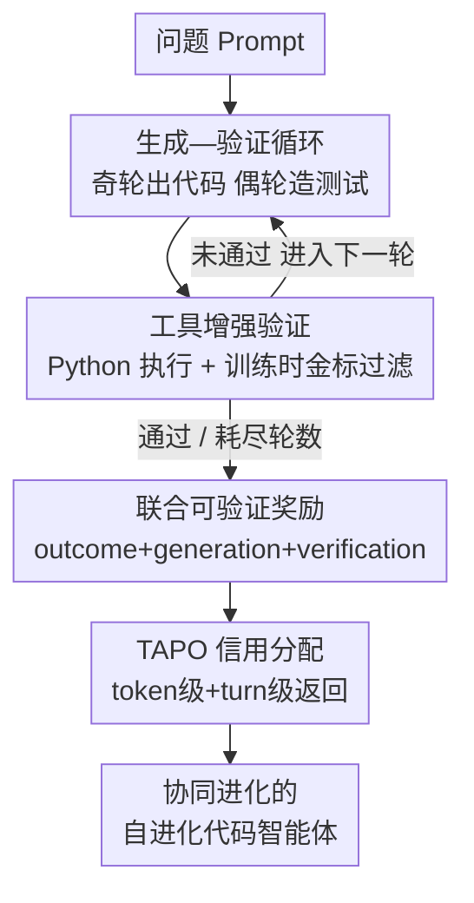

# ReVeal: 通过可靠自验证实现自进化的代码智能体

**会议**: ICLR 2026  
**OpenReview**: [https://openreview.net/forum?id=q56ZI1Co43](https://openreview.net/forum?id=q56ZI1Co43)  
**代码**: https://ReVeal.github.io/  
**领域**: Agent / LLM推理 / 强化学习  
**关键词**: 代码生成, 自验证, 多轮强化学习, 测试时扩展, 信用分配

## 一句话总结
ReVeal 把代码生成组织成「生成—验证」交替的多轮循环，并用一套 turn-level 强化学习算法（TAPO）显式优化自验证能力，让一个仅训练 3 轮的 32B 模型在推理时能持续自我修正 20+ 轮，在 LiveCodeBench V6 上 Pass@1 从 34.8% 一路爬到 38.7%。

## 研究背景与动机
**领域现状**：带可验证奖励的强化学习（RLVR）是当前提升 LLM 推理能力的主流路线，DeepSeek-R1、OpenAI o 系列都靠它催生出"反思 + 自验证"的能力。近期分析把这种增益归因于**验证—生成不对称性**（verification–generation asymmetry）：验证一个解通常比从头解出来更容易，而这正是测试时扩展（test-time scaling）能起效的底层机制。

**现有痛点**：但现有 RLVR 方法只用 **outcome reward**（最终对/错）来监督整条长推理链，**从不显式优化验证本身**。结果是模型的自验证很不可靠——在难题上要么产出冗长却没信息量的"反思"，要么纯靠瞎猜；而且一旦测试时算力超过训练时的推理步数预算，性能就会 plateau，扩展不动。

**核心矛盾**：复杂问题（如竞赛编程）本质需要多轮"验证—修订"迭代，准确的反馈是引导修订的关键。可现有方法要么单独训一个 critic 模型来打分（不用工具反馈、还多了一套推理开销），要么依赖预先存在的公开测试用例去执行反馈（现实里这种测试集几乎拿不到）。两条路给出的验证都有限且不可泛化，自验证始终不可靠。

**本文目标**：把"验证"从一个副产品变成**一等优化目标**，主动**拉大** V-G 不对称性——让验证变得更可靠、更容易，从而在推理时用可靠的验证信号去驱动更难的生成过程持续进化。

**切入角度**：用同一个 policy 同时承担生成与验证，让它在每一轮自己构造测试用例、调用 Python 解释器执行，从真实环境拿到细粒度反馈，再据此修订下一轮的代码——不依赖外部 critic、也不依赖预置测试。

**核心 idea**：用 dense 的 turn-level 奖励**显式监督验证质量**，并配一套防奖励作弊的信用分配算法（TAPO），让代码与测试在训练中**协同进化**，把验证信号变成可靠的、可持续的改进驱动力。

## 方法详解

### 整体框架
ReVeal 要解决的是"如何让一个代码智能体在没有现成测试的情况下，靠自己可靠地验证并持续修正代码"。它把长程推理拆成**交替的生成轮与验证轮**：奇数轮（生成）产出候选代码 `<generation-answer>`，偶数轮（验证）合成并执行测试用例 `<verification-answer>`，中间夹着工具执行反馈 `<tool-feedback>`。一个共享的 policy LLM 同时干这两件事，解与验证策略在同一套训练方案下共同演化；循环持续到找到合法解或耗尽轮数预算 $K$。

训练侧的关键在于奖励与信用分配：ReVeal 把奖励拆成 outcome / generation / verification 三块联合可验证奖励，再用 TAPO 把这些奖励**按 token 和 turn 两个粒度**精确分配回去，既对齐最终正确性，又给中间每一步验证密集监督，同时防止"生成垃圾代码骗验证奖励"的作弊。

### 关键设计

**1. 生成—验证交替循环：把单次解题改成带工具反馈的闭环迭代**

针对"自验证不可靠、难题上只能瞎猜"的痛点，ReVeal 不再让模型一次性给答案，而是把推理结构化成交替的生成轮和验证轮。每一轮模型先自由地展开思考，再吐出结构化输出：可执行代码放进 `<generation-answer>`、可执行测试放进 `<verification-answer>`。验证阶段模型会主动假设潜在失败模式和边界条件来设计多样化测试，`<tool-feedback>` 段则记录执行结果——运行时错误、无效测试，以及每个有效测试的期望输出、实际输出和通过/失败判定。模型读这些 trace 和报错，诊断根因，再在下一轮同时调整候选代码**和**验证计划。整个闭环不需要外部 critic，也不需要预置测试，靠工具反馈把"识别错误→修订策略→逐轮精炼"串起来。

**2. 工具增强验证 + 训练时金标过滤：用真实执行信号换可靠监督，又不被噪声测试污染**

验证要可靠，前提是测试用例本身可信。ReVeal 用 Code Judge 作为执行环境，统一支持函数式和标准输入输出两种测试格式。关键的不对称设计在于训练和推理时对测试的处理不同：**训练时**采用过滤机制——模型生成的测试用例只有先在金标准解（golden solution）上验证通过，才会被拿去跑候选代码，这保证执行 trace 提供的是合法监督，把探索导向正确解；**推理时**没有金标可用，所有生成的测试都直接执行，验证完全自主。这种"训练有金标兜底、推理全靠自己"的安排，对模型生成高质量测试的能力提出了强要求，也正是后面 RL 算法要重点激励的方向。工具反馈还有个额外好处：它通过暴露具体失败模式拓宽了 RL 的探索空间，把 policy 推向搜索空间里更有希望的区域、帮它跳出局部最优，实测带来比 base model 更高的 Pass@k。注意 `<tool-feedback>` 段在训练时被排除在 loss 之外、只作为上下文输入，这样既稳定优化又保持多轮 rollout 连贯。

**3. 联合可验证奖励：把验证质量做成可优化目标，而非副产品**

为了同时训练生成和验证，ReVeal 把奖励拆成三块互补分量。**Outcome reward** 监督最终解质量：$r_{\text{outcome}} = r_{\text{format}} + r_{\text{passrate}}$，其中格式奖励 $r_{\text{format}}\in\{1,-1\}$ 确保输出符合生成/验证标签规范（以便可靠切分每一轮并提取代码与测试），$r_{\text{passrate}} = 5\times \text{passrate}$，于是 $r_{\text{outcome}}\in[-1,6]$。**Generation reward** 只奖励"跨轮的真实改进"：对第 $k$（奇）轮，

$$r^k_{\text{gen}} = \begin{cases} r^1_{\text{passrate}}, & k=1 \\ \text{abs}\cdot r^k_{\text{passrate}} + \text{imp}\cdot\big(r^k_{\text{passrate}} - r^{k-2}_{\text{passrate}}\big), & k\ge 3 \end{cases}$$

论文取 $\text{abs}=0,\ \text{imp}=1$，即只奖励代码准确率相对前一次生成的**提升量**，而非绝对值。**Verification reward** 对第 $k$（偶）验证轮，奖励"生成的测试在金标代码上的通过比例"：$r^k_{\text{ver}} = \#\{\text{该轮通过的测试}\}/\#\{\text{该轮生成的测试}\}$。三块奖励天然把生成与验证耦合进一个协同进化的回路。

**4. TAPO 双粒度信用分配：在 token 与 turn 两级精确派发奖励，防奖励作弊**

只用 outcome reward 监督整条长链，会给中间的验证步骤分配不精确的信用，常退化成"盲目反思"。TAPO（Turn-Aware Policy Optimization）保留 PPO 的 actor-critic 框架，只改 advantage 估计器：不用标准 GAE，而用 **turn-aware return**。它结合两级返回——**Token-level return** 取 $\lambda=\gamma=1$（纯蒙特卡洛），把 $r_{\text{outcome}}$ 全放在末位 token：$R_t = r_t + R_{t+1}$，对齐最终正确性；**Turn-level return** 则专门针对生成—验证博弈设计防作弊规则：每个 generation reward 同时赋给它自己的生成轮**和紧邻的前一个验证轮**，而每个 verification reward **只**限于它自己的验证轮。这样生成轮只凭代码质量拿奖励、而非靠验证是否"成功"，从而堵住"生成 trivial 代码去 hack 验证奖励"的漏洞。最终返回把两级相加 $\widetilde{R}_t = R_t + R^{\text{turn}}_t$，advantage $A_t = \widetilde{R}_t - V_t$（$V_t$ 为 critic 估值），替换 PPO 里的 GAE。这套设计形成正反馈：更强的测试暴露错误→驱动代码改进→被 generation reward 强化→更好的代码又抬高验证门槛→逼模型造更难的测试。TAPO 本身是通用的信用分配算法，可用于任何"生成与验证都可验证奖励"的推理任务。

### 一个完整示例
以 LiveCodeBench 的一道竞赛题为例走一遍：**Turn 1（生成）** 模型先思考再产出一版候选代码；**Turn 2（验证）** 它假设若干失败模式与边界条件，造出一批测试用例，Python 解释器执行后 `<tool-feedback>` 报告某个边界用例期望输出与实际输出不符 + 一处运行时错误；模型读 trace 诊断出是边界处理逻辑漏了，于是 **Turn 3（生成）** 修订代码、同时调整验证计划。如此往复。训练时只放开 3 轮，但推理时这套可靠自验证能力可外推到 20+ 轮——Pass@1 从 turn 1 的 34.8% 升到 turn 3 的 36.7%、再到 turn 25 的 38.7%，把原本解不出的题逐步攻克。为控制超长 rollout 的上下文膨胀，ReVeal 还用了一个短期记忆机制：只保留最近 3 轮作为上下文，既不爆 context 也不掉精度。

### 损失函数 / 训练策略
基座为 DAPO-Qwen-32B（已用数学数据强化），在代码数据上继续 RL。训练数据来自 TACO（26,443 道竞赛题），过滤掉交互式/图像类、统一两种测试格式、丢弃金标解都过不了自身测试的题，最终保留 11,151 题训练 + 509 题测试。框架用 Verl，在 8/16 张 AMD Mi300x 上训练，RL 训练时最大轮数设为 3。

## 实验关键数据

### 主实验
在 LiveCodeBench V6 与 CodeContests 上对比。Pass@1 为成功率，$\Delta\uparrow$ 表示"初始错误经修订后变对"的比例，$\Delta\downarrow$ 表示"初始正确经修订后变错"的比例（越低越好）。

| 方法 | LCB V6 Pass@1 | LCB $\Delta\uparrow$ | LCB $\Delta\downarrow$ | CodeContests Pass@1 |
|------|------|------|------|------|
| Qwen2.5-32B-Instruct (base) | 24.8 | - | - | 13.3 |
| DAPO-Qwen-32B | 31.1 | - | - | 18.5 |
| w/ critic×5 CTRL | 33.4 | 3.75 | 0.89 | - |
| Single-turn RL (outcome-only) | 32.8 | - | - | 21.0 |
| **ReVeal×25** | **38.7** | **7.50** | **0.0** | **33.6** |

ReVeal 大幅超过单轮 RL 基线，且在 turn 1 同等推理预算下 Pass@1（34.8%）就已高于单轮 RL，说明多轮训练把探索收益转化进了更强的策略。相比 critic 类方法（CTRL），ReVeal 用单一 policy 自验证就拿到更高修正率 + 近乎零退化（$\Delta\downarrow=0.0$），验证可靠性极高。

### 消融实验
同样轮数预算下对比是否用 TAPO 联合奖励：

| 配置 | LCB V6 Pass@1 | $\Delta\uparrow$ | $\Delta\downarrow$ | CodeContests Pass@1 |
|------|------|------|------|------|
| ReVeal×8 w/ outcome reward | 36.1 | 4.69 | 1.32 | 27.4 |
| ReVeal×8 w/ TAPO 联合奖励 | **37.7** | **5.62** | **0.0** | **30.4** |

TAPO 联合奖励在同等轮数下 Pass@1 更高、$\Delta\uparrow$ 更大、$\Delta\downarrow$ 被压到 0；而 outcome-only 的 $\Delta\downarrow$ 偏高，说明验证优化不足会驱动错误修订。

### 关键发现
- **测试时扩展能外推**：仅训 3 轮却能在推理时持续改进到 25 轮（34.8%→38.7%），新发现的解还能蒸馏回模型继续增强。
- **推开推理边界**：Pass@k（k=1~128）上 ReVeal 全程超过 base 与单轮 RL；而单轮 RL 在 k≥32 后增益逐渐消失、追不上 base。归因于工具辅助验证带来的"验证驱动探索"。
- **生成与验证协同进化**：训练中测试用例准确率从 step 40 的约 50% 升到近 88%，对正确测试的代码判对率超 85%；最终解持续优于 turn 1 解且差距随训练拉大。
- **TAPO 在更长链上收益更大**：outcome-only 信号对超长链太粗、对中间验证步信用不精，dense 的 turn-level 监督在强基座长链场景下增益明显更大。

## 亮点与洞察
- **把"验证"提升为一等优化目标**：大多 RLVR 只优化"答得对不对"，ReVeal 显式优化"验得准不准"，主动拉大 V-G 不对称性——这是个可迁移到任何"验证比生成容易"任务的范式洞见。
- **防奖励作弊的信用分配很精巧**：generation reward 同时赋给生成轮和前一验证轮、verification reward 只归本轮，这条简单规则就堵住了"造 trivial 代码骗验证奖励"的常见漏洞。
- **训练/推理验证不对称**：训练有金标过滤兜底保证监督质量，推理全自主逼出真实自验证能力——既稳了训练又没在推理时作弊，设计很干净。
- **单 policy 同时生成+验证**：省掉额外 critic 模型的训练与协调成本，还能跨能力迁移，工程上更轻。

## 局限与展望
- **领域局限于可执行验证的任务**：方法强依赖"测试可执行、反馈可验证"的代码场景，对没有清晰可验证奖励的开放式任务（如自由写作）迁移性存疑。
- **训练时金标依赖**：验证奖励 $r_{\text{ver}}$ 和测试过滤都要金标准解，限制了在缺乏金标的真实数据上扩展；作者也承认现实里预置测试稀缺正是动机之一，但训练阶段仍绕不开金标。
- **计算成本**：32B 模型 + 多轮 rollout + 工具执行，训练（8/16 张 Mi300x）和推理（20+ 轮）开销都不小，短期记忆机制只缓解上下文膨胀、不省总轮数算力。
- **改进方向**：把新发现的解蒸馏回基座做持续学习（作者已提出）、与其它工具增强 RL 方法正交组合、向更小模型与更多基准推广（附录已有 Qwen3-4B 等初步验证）。

## 相关工作与启发
- **vs CTRL（独立 critic）**: CTRL 单独训一个 critic 模型做五轮 critique-revision，多一套模型、不用工具反馈；ReVeal 用单 policy 自验证 + 工具执行，Pass@1 更高（38.7 vs 33.4）且 $\Delta\downarrow$ 更低，证明联合优化生成与验证比"分工"更省更强。
- **vs Single-turn RL（outcome-only）**: 单轮 RL 只用最终对错监督、无显式验证优化，k 大时 Pass@k 增益消失；ReVeal 用 dense turn-level 奖励，能推开 base 的推理边界，本质区别是"验证是否被显式优化"。
- **vs ReAct / Reflexion（prompt 启发式）**: 它们靠 prompt 交织推理与自我批评、无 turn-level 可验证监督，难题上自验证不可靠；ReVeal 把验证做成可训练的 RL 目标，提供细粒度信用，二者正交可结合。
- **vs Search-R1 / ReTool / ToRL（工具增强多轮 RL）**: 这些方法多是 outcome-driven、不显式优化验证也不跨轮分配信用；ReVeal 的 TAPO 给生成轮和验证轮都派发细粒度奖励，是对这一系列工作的补充。

## 评分
- 新颖性: ⭐⭐⭐⭐⭐ 把验证做成一等优化目标 + 双粒度防作弊信用分配（TAPO），是 RLVR 范式上的实质创新。
- 实验充分度: ⭐⭐⭐⭐ 两 benchmark + 多基座 + Pass@k + 协同进化曲线，附录还有大量扩展；但主表对比的 baseline 略少、CTRL 数字跨版本引用。
- 写作质量: ⭐⭐⭐⭐ 动机—方法—分析逻辑清晰，V-G 不对称这条主线贯穿全文。
- 价值: ⭐⭐⭐⭐⭐ 给"自进化代码智能体"和长程推理测试时扩展提供了可落地、可迁移的训练范式。

<!-- RELATED:START -->

## 相关论文

- [\[ICLR 2026\] Pushing Test-Time Scaling Limits of Deep Search with Asymmetric Verification](pushing_test-time_scaling_limits_of_deep_search_with_asymmetric_verification.md)
- [\[ICLR 2026\] Zephyrus: An Agentic Framework for Weather Science](zephyrus_an_agentic_framework_for_weather_science.md)
- [\[ICLR 2026\] Helmsman: Autonomous Synthesis of Federated Learning Systems via Collaborative LLM Agents](helmsman_autonomous_synthesis_of_federated_learning_systems_via_collaborative_ll.md)
- [\[ICLR 2026\] ToolTree: Efficient LLM Agent Tool Planning via Dual-Feedback Monte Carlo Tree Search and Bidirectional Pruning](tooltree_efficient_llm_tool_planning_via_dual-feedback_monte_carlo_tree_search_a.md)
- [\[ICLR 2026\] GTool: Graph Enhanced Tool Planning with Large Language Model](gtool_graph_enhanced_tool_planning_with_large_language_model.md)

<!-- RELATED:END -->
