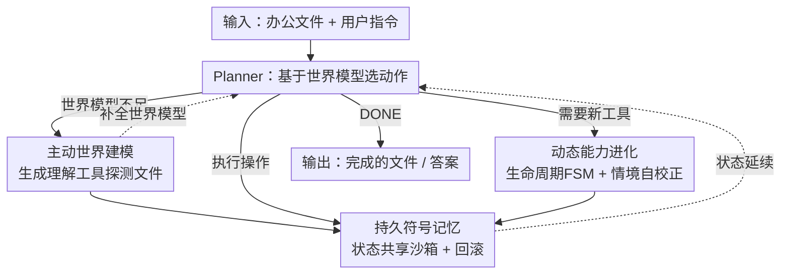

# ROGA: Scaling Generalist Agents for Office Productivity Tasks via Tool Generation

**会议**: ICLR 2026  
**OpenReview**: [https://openreview.net/forum?id=KTyLxtODB9](https://openreview.net/forum?id=KTyLxtODB9)  
**代码**: https://github.com/morgen52/roga  
**领域**: Agent / 工具生成 / 办公自动化  
**关键词**: 通用智能体, 自动工具生成, 世界模型, 符号记忆, 能力进化

## 一句话总结
针对现有"自动工具生成"(ATG)智能体在长程、有状态的办公任务上严重掉点的问题，ROGA 重构了智能体范式——用主动世界建模补全部分可观测的文件上下文、用持久符号记忆维持跨步状态、用动态能力进化让生成的工具可复用，在 OSWorld / WindowsAgentArena / GAIA-Office 等基准上把任务成功率最高提升 13.64%，并在表格任务上反超专用智能体。

## 研究背景与动机

**领域现状**：基于 LLM 的工具型智能体正从"为每个任务手工固定工具集"转向"通用智能体 + 自动工具生成(ATG)"。ATG 让智能体在已有工具不够用时即时编写新工具（如 Craft、Trove、Creator），再被 AutoAgent、Alita 等通用智能体框架吸纳，从而无需大量人工就能泛化到开放任务。

**现有痛点**：作者把矛头指向**办公生态**（Excel / Word / PowerPoint）这一典型的长程、有状态、部分可观测场景。一个动机实验对比三个代表性 ATG 智能体（AutoAgent / OctoTools / OWL）和一个领域专用智能体 SheetAgent，发现 ATG 智能体在 Pass@1 上最多落后专用智能体 **27.43%**（TableBench 上 AutoAgent 24.04% vs SheetAgent 51.47%）。也就是说，现在这套"反应式"ATG 范式根本扛不住真实办公任务。

**核心矛盾**：作者把掉点归因于现有范式的三个根本缺陷——(1) **建不起连贯的世界模型**：现有方法靠被动地"读完整文件"感知环境，但 LLM 上下文窗口装不下冗长、部分可观测的办公文档；(2) **无记忆的执行模型**：工具调用被当作彼此孤立、无状态的函数，断了跨步操作同一对象时的状态链；(3) **静态能力生成**：只为眼前需求一次性生成工具，相似步骤反复重新生成，既浪费又不积累经验。

**本文目标**：让通用 ATG 智能体真正胜任长程、有状态、部分可观测的办公任务，对应解决"世界模型 / 状态延续 / 能力复用"三个子问题。

**切入角度**：把智能体的运行建模成一个离散时间决策过程，状态 $S_t=(F_t, M_t, T_t)$（文件上下文、符号记忆、能力集），每步从 $\{$工具生成, 工具执行, 完成$\}$ 中选动作 $a_t\sim\pi(S_t)$，再由状态转移 $S_{t+1}=\delta(S_t,a_t)$ 更新。三个缺陷分别对应去补强 $F_t$ 的理解、$M_t$ 的延续、$T_t$ 的进化。

**核心 idea**：用"主动探测建世界模型 + 持久符号记忆维状态 + 能力按生命周期进化复用"三件套，把反应式循环升级成结构化、状态感知的智能体范式。

## 方法详解

### 整体框架

ROGA 把办公任务的求解组织成一个由 Planner 驱动的离散决策循环。输入是一份冗长、部分可观测的办公文件 $F_t$ 加用户指令，输出是完成后的文件/答案。每一步，**Planner** 根据当前的世界模型（存在符号记忆 $M_t$ 里）判断该做什么：当世界模型不足以支撑任务时进入**理解阶段**，主动生成"理解工具"去探测文件、补全世界模型；当理解充分时进入**操作阶段**，由 **Executor** 在一个状态共享沙箱里执行"操作工具"，并把中间状态记进持久符号记忆；所有工具的生成、验证、复用、淘汰则由 **Tool Manager + Tool Generator/Validator** 按能力生命周期管理。这样三类组件分别对应补强 $F_t$、$M_t$、$T_t$，循环往复直到 Planner 输出 DONE。

### 关键设计

**1. 主动世界建模(AWM)：把"被动读全文"换成"主动探测式提问"**

针对"上下文窗口装不下整份文档、被动感知必然遗漏细节"的痛点，ROGA 在真正动手操作前插入一个专门的**理解阶段**。当 Planner 发现 $M_t$ 里的世界模型不足时，它不去硬塞整份文件，而是进入一个元认知循环：识别知识缺口 → 把它表述成一个具体的信息检索子目标（例如"哪些工作表包含数据透视表？"）→ 动态生成并调用**专用理解工具**精确回答这个问题。理解工具的签名是固定的（输入数据对象、输出元信息字符串、依赖 LLM），可以专门抽取 Excel 公式、Word 样式、PPT 版式这类嵌入细节。每轮的答案被并入 $M_t$ 的世界模型，缺口被逐块填上，而生成出来的理解工具又进了能力集 $T_t$ 供后续复用。这种"逐块探测"把部分可观测环境拆成一连串可回答的小问题，显著降低了遗漏与误读，也让"理解工具 / 操作工具"职责分离、利于模块化复用。

**2. 持久符号记忆(PSM)：用显式状态账本接续跨步操作的状态链**

针对"无记忆执行、工具调用彼此孤立"的痛点，ROGA 引入持久符号记忆——它不只是一块共享内存，而是一个**显式的符号状态账本** $M_t$：维护所有中间产物（代码对象、文件句柄、dataframe 等）的符号句柄并追踪其演化，使第 $t$ 步的工具能直接引用并操作第 $t-i\ (i\in[1,t-1])$ 步创建的对象，从而支持时序推理与有状态交互。落地靠一个**状态共享沙箱**：它给所有工具提供统一的"保存/读取中间状态"API，让符号状态账本 $M_t$ 在工具间一致共享，支撑对同一共享对象（如 $F_t$）的迭代更新。为保证状态链的完整性，沙箱还强制两条算法性质——**原子性**与**可逆性**：每次工具调用要么完整成功并提交、生成新状态 $M_{t+1}$，要么失败并整体回滚到上一个一致状态 $M_t$；这套记录-重放状态修改历史的回滚机制确保执行错误不会污染状态链，把一串独立动作变成连贯、可协同的长程工作流。

**3. 动态能力进化：让生成的工具按生命周期"留存-精炼-复用"，告别一次性重复生成**

针对"静态一次性生成、相似步骤反复重造"的痛点，ROGA 把工具生成当作对能力集 $T_t$ 的**持续元学习**，由两个紧耦合的组件实现。其一是**能力生命周期形式化**：用一个有限状态机(FSM)刻画每个能力的演化阶段——Generated（新建的候选模板，待验证）、Active（已验证可靠、进入可复用技能库）、In-use（正映射到当前任务上下文、正在执行）、Modifying（映射失败后由该次失败上下文驱动做针对性精炼）、Deprecated（多次跨任务映射失败后被永久剔除，避免错误扩散）。能力在 In-use 时每次"能力→任务"映射的成败被记成经验性**适应度分数**，用来指导检索时的选择概率与各能力的进化路径，使智能体能从经验中系统地进化能力，而不是临时拼凑、反复重造。其二是驱动这些状态转移的**情境自校正(SSC)**：它的关键在"情境性"——校正不是离线、脱离上下文的，而是深扎在智能体当前状态 $M_t$ 与即时目标里。每当提出一个新/改的候选工具，SSC 在两条互补通道里做有状态验证：一是**状态感知的功能测试**，在一个完美复刻 $M_t$ 的影子沙箱(shadow sandbox)里执行，回答"在当前状态下它能否成功运行并产生预期效果"（超越单纯的语法正确性）；二是**语义意图验证**，用 LLM 做代码审查，检查工具是否契合用户意图与文件上下文、参数用得对不对。双通道反馈共同决定能力进化：成功则把 Generated/Modifying 提升为 Active，失败则带着精确错误上下文转入 Modifying，驱动元学习循环生成更精炼的候选。

## 实验关键数据

### 主实验

办公任务上的端到端执行成功率(Exec@1)与任务成功率(Pass@1)，统一用 GPT-4.1 作为骨干 LLM（OWL 因调用专用子智能体，相当于本场景的领域专用基线）：

| 基准 | 指标 | ROGA | 最强基线 | 提升 |
|------|------|------|----------|------|
| OSWorld | Exec@1 | 95.45 | 79.09 (OWL) | +16.36 |
| OSWorld | Pass@1 | 31.82 | 18.18 (OctoTools) | +13.64 |
| WindowsAgentArena | Exec@1 | 97.62 | 76.19 (OWL) | +21.43 |
| WindowsAgentArena | Pass@1 | 28.57 | 26.19 (OctoTools) | +2.38 |
| GAIA-Office | Exec@1 | 96.15 | 92.31 (OWL) | +3.84 |
| GAIA-Office | Pass@1 | 76.92 | 73.08 (OWL) | +3.84 |

在更具挑战的纯表格任务上，ROGA 还反超了专门为表格设计的 SheetAgent：

| 基准 | 指标 | ROGA | SheetAgent |
|------|------|------|------------|
| TableBench | Exec@1 / Pass@1 | 95.03 / 56.09 | 89.39 / 51.47 |
| SheetCopilotBench | Exec@1 / Pass@1 | 100.00 / 25.91 | 98.64 / 23.53 |

### 消融实验

逐个移除核心组件（GPT-4.1 骨干，OSWorld / WAA / GAIA-Office 的 Pass@1）：

| 配置 | OSWorld | WAA | GAIA-Office | 说明 |
|------|---------|-----|-------------|------|
| 完整 ROGA | 31.82 | 28.57 | 76.92 | — |
| w/o 主动世界建模 | 20.00 | 19.05 | 50.00 | Pass@1 全面大跌，但 Exec@1 几乎不变 |
| w/o 情境自校正 | 23.64 | 14.29 | 46.15 | Exec@1 与 Pass@1 同时下降 |
| w/o 持久符号记忆 | 19.09 | 21.42 | 46.15 | 两个指标降幅最大 |
| w/o 能力生命周期 | 29.09 | 26.19 | 53.85 | GAIA-Office 明显受损；缺工具复用导致平均推理步数增至 1.54× |

### 关键发现
- **持久符号记忆贡献最关键**：去掉它两个指标降幅最大，印证了在迭代任务里维持共享对象状态延续的重要性——没有它，跨步对同一对象的修改就会丢失，引发长程任务特有的级联错误。
- **AWM 影响的是"做对"而非"能跑"**：去掉主动世界建模后 Pass@1 全面骤降、Exec@1 几乎不变，说明动作单独都能执行，但缺了主动探测就建不起连贯世界模型，结果错；这恰好坐实了它处理部分可观测性的核心价值。
- **能力复用降本不只是降分**：去掉能力生命周期管理使平均推理步数增至 1.54×，说明反复重造工具会同时推高执行错误与推理开销。
- **对骨干 LLM 敏感**：ROGA 在 GPT-4.1 上最好、Claude Sonnet 4 略低，而 OpenAI-o3 大幅掉点（OSWorld Pass@1 仅 10.00），主因是 o3 上下文窗口更小，装不下冗长文件上下文与长推理链。
- **更贵但更值**：成本分析显示 ROGA token 用量高于基线，但作者认为这是对更优推理范式的"前置投资"，避免了基线那种基于错误假设、烧光预算却失败的"高成本失败"。

## 亮点与洞察
- **把"理解"显式做成一个阶段**：不少智能体把读文件当成隐式的一次性步骤，ROGA 把它升级成可迭代、可生成专用工具去"提问—回答"的主动探测循环，对部分可观测的大文件特别有用——这个"先主动建模再操作"的思路可迁移到任何上下文超窗的长文档/代码库任务。
- **状态账本 + 原子回滚**：把数据库式的原子性、可逆性引入工具执行，让一连串工具调用变成可回滚的事务，错误不污染状态链；这是从"无状态函数调用"到"有状态工作流"的关键工程抽象。
- **用 FSM + 适应度分数管理工具**：把生成的工具当作有生命周期、会被打分、会被淘汰的"能力"，让智能体从经验中进化工具集而非反复重造，是对 ATG"一次性生成"范式的实质性升级。
- **情境化验证**：在复刻当前状态 $M_t$ 的影子沙箱里验证工具（而非真空环境），加上 LLM 语义审查双通道，直击"代码能跑但在当前状态下做错事"的隐患。

## 局限与展望
- **成本偏高**：ROGA token 用量与单位成本明显高于基线（如 OSWorld 输入 56.10k vs AutoAgent 15.35k），虽换来更高成功率，但在预算敏感场景未必划算。
- **强依赖大上下文骨干**：o3 上的崩盘说明方法对上下文窗口与长推理能力高度敏感，换到小窗口模型效果难保证。
- **办公域为主**：尽管数学/MMLU-Pro 上也保持了泛化，但核心收益集中在办公文件类任务，对其他长程有状态领域（如复杂 GUI、多模态文档）的迁移效果仍待验证。
- **可改进方向**：理解工具的探测策略目前由 Planner 启发式触发，若能学习"何时探测、探测什么"的策略，或对能力库做更主动的剪枝与组合，有望进一步降本。

## 相关工作与启发
- **vs 工具检索(Toolformer / ToolLLM / ToolGen)**：它们改进的是"从预定义工具集里选对工具"，本质受限于固定工具集；ROGA 在工具不够用时即时生成，泛化到开放办公任务。
- **vs 传统自动工具生成(Craft / Trove / Creator)**：它们多需良定义的工具规格、在脱离上下文的真空里验证代码；ROGA 不依赖现成规格，而是用 AWM 从文件上下文里推断需求、用 SSC 在当前状态里做情境化验证。
- **vs ATG 智能体(AutoAgent / Alita)**：它们停留在数学、基础计算机操作等简单无状态任务；ROGA 用 PSM 补上状态延续、用动态能力进化补上工具复用，专攻长程有状态办公场景并反超专用智能体。
- **vs 办公专用智能体(SheetAgent / OWL 的子智能体)**：它们靠预定义工具与流水线、跨任务泛化差；ROGA 作为通用 ATG 智能体，在 TableBench / SheetCopilotBench 上反超 SheetAgent，说明通用范式也能吃下专用域。

## 评分
- 新颖性: ⭐⭐⭐⭐⭐ 把"主动世界建模 + 符号状态账本 + 能力生命周期 FSM"系统整合，重定义了 ATG 智能体范式，不是单点改进。
- 实验充分度: ⭐⭐⭐⭐ 覆盖 5 个基准 + 三种骨干 + 四项消融 + 成本分析，较扎实；但样本量偏小（如 GAIA-Office 仅几十题），统计稳健性有限。
- 写作质量: ⭐⭐⭐⭐ 动机—缺陷—对策映射清晰，但术语密集（FSM 各状态、双通道验证）需要反复对照图才能消化。
- 价值: ⭐⭐⭐⭐⭐ 办公自动化是高频高价值场景，"理解阶段 + 状态账本 + 工具复用"的设计思路对长程有状态智能体有普遍借鉴意义。

<!-- RELATED:START -->

## 相关论文

- [\[ICLR 2026\] AgentSynth: Scalable Task Generation for Generalist Computer-Use Agents](agentsynth_scalable_task_generation_for_generalist_computer-use_agents.md)
- [\[ICLR 2026\] Scaling Synthetic Task Generation for Agents via Exploration](scaling_synthetic_task_generation_for_agents_via_exploration.md)
- [\[ICLR 2026\] TaskCraft: Automated Generation of Agentic Tasks](taskcraft_automated_generation_of_agentic_tasks.md)
- [\[ICLR 2026\] OmniActor: A Generalist GUI and Embodied Agent for 2D&3D Worlds](omniactor_a_generalist_gui_and_embodied_agent_for_2d3d_worlds.md)
- [\[ICLR 2026\] MCP-Bench: Benchmarking Tool-Using LLM Agents with Complex Real-World Tasks via MCP Servers](mcp-bench_benchmarking_tool-using_llm_agents_with_complex_real-world_tasks_via_m.md)

<!-- RELATED:END -->
