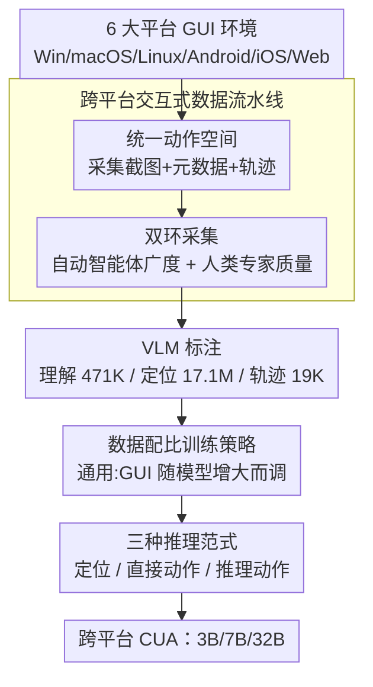

# ScaleCUA: Scaling Open-Source Computer Use Agents with Cross-Platform Data

**会议**: ICLR 2026  
**OpenReview**: [https://openreview.net/forum?id=yBFUqdJFZn](https://openreview.net/forum?id=yBFUqdJFZn)  
**代码**: https://github.com/OpenGVLab/ScaleCUA  
**领域**: Agent / 多模态VLM  
**关键词**: 计算机使用智能体, GUI Agent, 跨平台数据, 统一动作空间, 数据规模化

## 一句话总结
ScaleCUA 用一条「自动智能体 + 人类专家」双环数据流水线，跨 6 大操作系统采集并标注出涵盖理解、定位、轨迹三类任务的超大规模 GUI 语料（471K 理解 + 17.1M 定位 + 19K 轨迹），在其上训练出支持三种推理范式的开源计算机使用智能体，在多个 GUI benchmark 上刷出新 SOTA（WebArena-Lite-v2 +26.6、ScreenSpot-Pro +10.7）。

## 研究背景与动机
**领域现状**：视觉-语言模型（VLM）让「计算机使用智能体（Computer Use Agent, CUA，也叫 GUI agent）」成为可能——智能体仅凭屏幕截图就能像人一样点击、输入、操作桌面/手机/网页应用。目前强势的 CUA（UI-TARS、Claude Computer Use、OpenAI CUA 等）大多建立在闭源模型或不公开的私有数据集之上。

**现有痛点**：要让 CUA 真正鲁棒，模型必须掌握大量「软件界面长什么样、某个操作该怎么点」的领域内知识。但和互联网上俯拾皆是的图文对不同，**计算机使用数据——尤其是细粒度的操作轨迹——极其稀缺、采集昂贵、且不会被自然归档到网上**。更糟的是软件、网页、操作系统快速迭代，旧轨迹很快过时。

**核心矛盾**：数据采集存在「质量 vs 规模/多样性」的两难——纯人工采集轨迹质量高但贵且难扩展；纯自动化探索（如随机游走）可规模化却充满噪声，二者单独都凑不出训练通用 GUI 智能体所需的「质量 + 多样性」平衡。同时现有开源 VLM 跨平台迁移能力有限，整个方向被「数据规模」和「模型泛化性」双重瓶颈卡住。

**本文目标**：拆成两件事——(a) 构建大规模、跨平台、以 GUI 为中心的训练语料；(b) 训练一族可规模化、通用的计算机使用基座模型。

**切入角度**：作者押注「数据驱动的规模化（data-driven scaling）」——既然瓶颈在数据，那就把数据采集本身做成一条可跨 6 个操作系统统一运转的工业化流水线，让自动智能体负责广度、人类专家负责质量与校验。

**核心 idea**：用「自动智能体 + 人类专家」的双环闭环流水线规模化采集跨平台 GUI 数据，配上一套统一动作空间，训练出支持「定位 / 直接动作 / 推理动作」三种推理范式的开源 CUA 基座模型 ScaleCUA。

## 方法详解

### 整体框架
ScaleCUA 由两部分构成：**前端是一条跨平台交互式数据流水线**（负责造数据），**后端是一族基于 Qwen2.5-VL 训练的智能体模型**（负责用数据）。数据流水线在 Windows、macOS、Linux、Android、iOS、Web 六大平台上，通过两个协同的环路采集原始截图、结构化元数据（A11y Tree / DOM / XML）和操作轨迹，再用先进 VLM（GPT-4o、Claude-3.7）把这些原料标注成三大类任务——GUI 理解、GUI 定位、任务完成——形成训练语料。模型侧用一个统一动作空间消化所有平台的轨迹，训练出 3B/7B/32B 三档模型，每个模型都支持三种推理范式以适配不同的 agent 框架。

整条管线是「采集 → 标注 → 训练」的串行流，但采集环节本身是个自动+人工的闭环：

### 关键设计

**1. 跨平台交互式数据流水线：用「自动+人工」双环破解质量与规模的两难**

这是全文的发动机，直接针对「纯人工贵、纯自动噪」的核心矛盾。流水线由两个协同环路组成。第一个是 **Agent-Environment 交互环**：把六大平台的「观测获取」和「动作执行」标准化抽象——桌面端从 A11y Tree 抽元数据、Web 从 DOM 抽、Android 从 XML 布局文件抽；当 iOS/iPadOS 这类平台元数据缺失或受限时，用 OmniParser 估计 UI 元素的包围框补上。这一层抽象把「前端界面」和「后端环境」解耦，让采集者能高效在平台间切换。第二个是 **Agent-Human 混合采集环**：自动智能体和人类专家共用同一套接口采集轨迹。自动侧作者对比了两种探索策略——VLM 驱动（GPT-4o/Claude-3.7）和规则驱动的随机游走（random-walk）；前者依赖私有 VLM、对计算机使用任务偏置和幻觉严重，所以**没被用作主力**；后者做深度优先探索，每步从动作空间随机选动作，再用启发式剪枝去掉冗余/无信息的分支来拓宽 GUI 覆盖。随机游走的轨迹虽然缺乏明确的高层目标，但其子序列仍是有价值的弱语义监督。

质量则靠人类专家兜底：专家先列任务清单再亲自采集高质量轨迹，并且**对自动采集的轨迹按 20% 比例随机抽检复核**（采集后和标注后各一次）——这就是「混合采集（hybrid acquisition）」的含义。靠这套双环，作者跨平台采集了超过 2M 张原始截图。作者坦诚这条流水线概念上并不复杂，难的是跨异构操作系统和软件生态把它真正跑通，背后是大量非平凡的工程。

**2. 统一动作空间：让六个平台的轨迹能被同一个模型一致地学**

如果每个平台各用一套动作定义，模型学到的策略就无法跨平台迁移、数据也无法混合训练。作者为数据采集和环境交互设计了一套统一动作空间：它把**通用操作**（如 `click`、`write` 等）和**平台特有操作**（如移动端的 `long press`、`open app`）组合在一起，保证跨平台行为建模的一致性，简化下游策略学习。形式化上，单步交互被写成 $a_t = \pi_\theta(\text{task}, o_t, h_{<t})$、$o_{t+1} = E(a_t)$，其中 $\pi_\theta$ 是智能体模型、$E$ 是环境（虚拟机或 Docker 容器），观测 $o$ 只取屏幕截图像素（刻意不用嘈杂的 A11y Tree / DOM 作为观测，以贴近人类行为、避免噪声干扰），历史 $h_{<t}=\{(a_0,o_0),\dots,(a_{t-1},o_{t-1})\}$ 则被压成自然语言描述以节省推理成本。统一动作空间让所有平台的轨迹都能以同一套语义标注、混入同一个模型训练，是「跨平台」真正落地的接口层。

**3. 三种推理范式：一个模型适配从纯定位到长程推理的不同 agent 框架**

CUA 的使用场景差异很大——有时只想要一个「定位器」配合外部强规划器，有时想要端到端快速响应，有时面对模糊/长程任务又需要显式推理。ScaleCUA 把这三种需求统一进同一个模型的三种推理范式：**Grounding Mode（定位模式）** 仅根据截图+文本描述输出 UI 元素的点/框/坐标动作，适合当模块化「grounder」嵌入更强的规划器；**Direct Action Mode（直接动作模式）** 给定当前屏幕和交互历史，直接吐出 `<operation>` 和 `<action>` 标签包裹的可执行低层动作，没有显式推理，感知-动作回路快但长程任务容易累积漂移；**Reasoned Action Mode（推理动作模式）** 先在 `<think>` 标签里生成一段思维链再产出动作，靠多花延迟和 token 换来模糊/长程任务上更高的可靠性与可解释性。三种范式共享同一套跨平台动作语义，让模型能灵活接入不同的 agentic workflow。

**4. 数据配比训练策略：模型越大，越能吃下更高比例的通用数据而不稀释 GUI 能力**

只喂 GUI 数据会丢掉通用多模态能力，喂太多通用数据又会稀释 GUI 专精，这是个配比难题。作者训练 3B/7B/32B 三档，关键做法是**让「通用数据 : GUI 数据」的比例随模型增大而上调**：3B 用 25%、7B 用 50%、32B 用 75% 的通用数据。其依据来自诊断实验的观察——随着通用数据比例上升，GUI benchmark 会缓慢下滑、而通用 benchmark 稳步上升（约在 75% 见顶）；但更大的模型记忆容量更强，能在吸收更高比例通用数据的同时不稀释 GUI 专精。所有模型统一用学习率 $1\times10^{-5}$、最大 token 长度 40,960，在 128 张 A100/H200 上训练。这条经验把「保留通用推理 vs 保留 GUI 专精」的平衡显式地和模型规模挂钩。

### 损失函数 / 训练策略
模型基于 Qwen2.5-VL 做监督微调（SFT），把理解、定位、任务完成三类任务的标注语料混合训练。训练语料经过数据增强（元素裁剪、合成分辨率缩放、推理 prompt 富化）进一步多样化。三档模型的硬件配置不同（3B：mini-batch 4 / grad-accum 1；7B 与 32B：mini-batch 2 / grad-accum 2），通用与 GUI 数据配比如上随规模递增。

## 实验关键数据

### 主实验
评测覆盖三个维度——GUI 理解、GUI 定位、端到端任务完成，全部在纯视觉观测下进行。

| 维度 / Benchmark | 指标 | ScaleCUA-32B | 对比基线 | 提升 |
|--------|------|------|----------|------|
| MMBench-GUI L1-Hard（理解） | Acc | 94.4 | GUI-Owl-32B 94.2 | 新 SOTA |
| ScreenSpot-Pro（定位） | Acc | 59.2 | — | +10.7 vs 基线 |
| OSWorld-G（定位） | Acc | 60.6 | — | 新 SOTA |
| WebArena-Lite-v2（任务,50步） | SR | 47.4 | UI-TARS-72B-DPO 21.4 | +26.0 |

GUI 理解上，即便轻量的 ScaleCUA-3B 也拿到 89.9%，比 Qwen2.5-VL-72B 高出 +25.3 分；7B 升到 92.3%，32B 达 94.4%。任务完成上，原生 ScaleCUA-32B 在 Web 上 50 步预算下取得 47.4%，比最强原生基线 UI-TARS-72B-DPO 高 +26.0 分；以 GPT-4o 为规划器、ScaleCUA-7B 为 grounder 的 workflow 在 AndroidWorld 上达 48.3%、OSWorld 上 28.1%，优于 JEDI-7B 等强 grounder。

### 消融实验
诊断分析揭示了几条关键 trade-off：

| 配置 / 因素 | 关键发现 | 说明 |
|------|---------|------|
| 数据规模化 | WebArena-Lite-v2 近线性增长 | 越难的在线任务需要越多数据 |
| 推理模式 RAM vs DAM | RAM 全面优于 DAM，绝对增益 +1.4%~+8.2% | 但 RAM 推理更慢、token 更贵 |
| 通用数据比例 | GUI 指标随比例上升而缓降，通用指标升至约 75% 见顶 | 大模型可吃更高比例 |
| 输入分辨率 | 取决于 benchmark 数据分布 | ScreenSpot-Pro（含 4K）受益于升到 2K 但 4K 反降 |

### 关键发现
- **数据是主因**：从 3B→7B→32B 在各平台单调涨点，证明跨平台数据 + 统一动作空间能随模型容量增大转化为更强的 CUA。
- **推理换可靠**：Reasoned Action Mode 一致优于 Direct Action Mode，但代价是更高延迟和 token 成本；而把 ScaleCUA-7B 当 grounder 配 GPT-4o 规划，在 OSWorld（28.1% vs 15.0%）、WindowsAgentArena（36.6% vs 20.7%）上又比自身的 RAM 更高，说明 ScaleCUA 与通用 VLM 互补。
- **分辨率不是越高越好**：影响取决于 benchmark 截图分布——输入分辨率超过训练上限（1080p）会饱和甚至反降，只有含原生 4K 的 ScreenSpot-Pro 才从更高分辨率受益（到 2K，但 4K 仍掉）。
- **作者诚实承认短板**：即便用了自家数据，模型在 agentic workflow 里的规划能力仍明显落后于 GPT-4o，离闭源/私有数据训练的强模型还有可观差距。

## 亮点与洞察
- **把数据采集做成跨平台工业化流水线**：双环设计让「自动智能体跑广度、人类专家把质量 + 20% 抽检」各司其职，比纯人工或纯自动都更平衡，这套「混合采集」思路可迁移到任何需要真实交互轨迹的具身/操作类任务。
- **统一动作空间 + 纯截图观测**是跨平台落地的关键接口——刻意丢掉 A11y Tree/DOM 作为观测、只留截图，既贴近人类也避开了各平台元数据噪声不一致的坑。
- **「模型越大、通用数据比例越高」的配比经验**很实用：给出了一条把「通用能力 vs 领域专精」平衡显式挂到模型规模上的可操作规则（3B/7B/32B → 25%/50%/75%）。
- 一个模型三种推理范式的设计，让同一套权重既能当独立端到端 agent、又能当外部规划器的 grounder，工程上极具复用性。

## 局限与展望
- 作者承认在 agentic workflow 中模型的**规划能力仍显著弱于 GPT-4o**，端到端长程任务上离顶尖闭源系统有差距。
- 随机游走采集的弱语义轨迹缺乏明确高层目标，监督信号偏弱；高质量目标导向轨迹（4K 条）相对稀少。
- 流水线「概念简单、工程繁重」，跨异构系统的可复现性和维护成本高；软件/系统快速演化也会让采集到的轨迹逐渐过时。
- macOS（MacOSArena）等平台上各模型成功率普遍很低（ScaleCUA-32B 仅 7.1%），桌面长程任务整体仍是难点。

## 相关工作与启发
- **vs UI-TARS / AGUVIS（原生 agent）**: 二者也用大规模轨迹训练端到端原生智能体，但多基于私有数据；ScaleCUA 的差异在于把全部数据、模型、代码开源，并显式做跨 6 平台覆盖与统一动作空间，Web 任务上大幅领先 UI-TARS-72B-DPO（+26.0）。
- **vs JEDI / OS-Atlas（数据/定位侧）**: 它们偏重某一类数据（桌面定位、grounding），ScaleCUA 同时覆盖理解/定位/轨迹三类任务且跨桌面+移动+Web，规模上 17.1M 定位标注 + 19K 轨迹（均 9 步）显著更全面。
- **vs OS-Genesis（自动化探索）**: OS-Genesis 等纯自动方法可扩展但噪声大；ScaleCUA 用人类专家 20% 抽检 + 弱语义轨迹复用，在可扩展性和质量间取得更好折中。

## 评分
- 新颖性: ⭐⭐⭐⭐ 数据流水线和模型设计单看都不算颠覆，但「双环采集 + 统一动作空间 + 跨 6 平台全开源」的系统组合很有分量
- 实验充分度: ⭐⭐⭐⭐⭐ 横跨理解/定位/任务完成、6 平台、3 档模型、4 组诊断消融，证据扎实
- 写作质量: ⭐⭐⭐⭐ 结构清晰、对自身局限诚实，个别表述（4K 反降、配比依据）需对照原文细读
- 价值: ⭐⭐⭐⭐⭐ 全开源数据+模型+代码，为开源 CUA 社区提供了稀缺的大规模跨平台基座

<!-- RELATED:START -->

## 相关论文

- [\[ICLR 2026\] Efficient Agent Training for Computer Use](efficient_agent_training_for_computer_use.md)
- [\[ICLR 2026\] Programming with Pixels: Can Computer-Use Agents do Software Engineering?](programming_with_pixels_can_computer-use_agents_do_software_engineering.md)
- [\[ICLR 2026\] Grounding Computer Use Agents on Human Demonstrations](grounding_computer_use_agents_on_human_demonstrations.md)
- [\[CVPR 2026\] OS-Oracle: A Comprehensive Framework for Cross-Platform GUI Critic Models](../../CVPR2026/llm_agent/os-oracle_a_comprehensive_framework_for_cross-platform_gui_critic_models.md)
- [\[ICLR 2026\] SCUBA: Salesforce Computer Use Benchmark](scuba_salesforce_computer_use_benchmark.md)

<!-- RELATED:END -->
