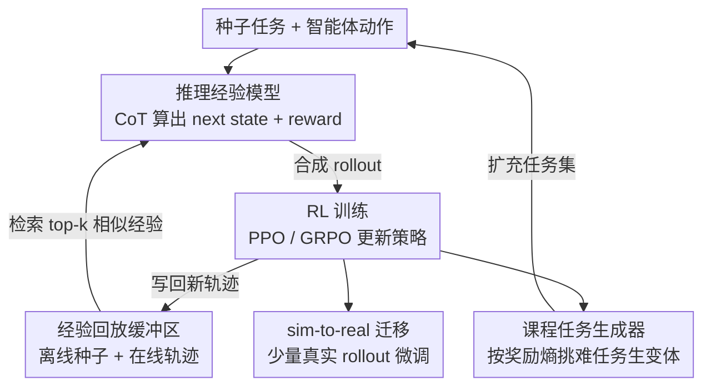

# Scaling Agent Learning via Experience Synthesis

**会议**: ICLR 2026  
**OpenReview**: [https://openreview.net/forum?id=cf7qpBwttr](https://openreview.net/forum?id=cf7qpBwttr)  
**领域**: LLM Agent / 强化学习 / 经验合成  
**关键词**: 经验模型, 合成经验, 课程学习, RL, sim-to-real

## 一句话总结
DreamGym 用一个"会推理的经验模型"在抽象文本状态空间里合成智能体与环境的交互（状态转移 + 奖励），配合经验回放缓冲区和基于奖励熵的课程任务生成器，让 LLM 智能体几乎不用真实环境 rollout 就能跑 RL，在非 RL-ready 的 WebArena 上比所有 baseline 高 30%+，在 RL-ready 环境用纯合成数据追平 GRPO/PPO。

## 研究背景与动机
**领域现状**：让 LLM 智能体（网页导航、具身控制、多轮工具调用）真正变强，强化学习（RL）是当前最被看好的路线——智能体通过与环境交互、从自己的经验里 bootstrap 出更好的策略。

**现有痛点**：但把 RL 用到 LLM 智能体上，工程和数据上都极其昂贵。作者把障碍拆成四条：（1）真实环境 rollout 成本高、样本效率低，一条轨迹动辄十几步、每步算力大、奖励稀疏；（2）任务多样性不足，多数环境只有一小撮静态指令，而验证新任务是否可行又要靠人工；（3）奖励信号不稳定，网页/GUI 这类动态环境会给出嘈杂、稀疏甚至错误的反馈，还存在不可逆动作（删数据）和缺乏 reset 机制的安全隐患；（4）基础设施重，要靠 Docker / 虚拟机搭真环境，大批量采样工程量巨大。

**核心矛盾**：RL 想要"大量、多样、信息丰富、奖励可靠"的交互数据，而真实环境恰恰在这几点上都给不起——可扩展的经验数据收集成了卡脖子的瓶颈。

**本文目标**：造一个统一框架，能可扩展地"合成"出多样且有用的经验数据，让在线 RL 训练真正跑得起来，且能迁移回真实环境。

**切入角度**：作者的关键洞察是——**智能体训练并不需要完美还原真实环境**，它需要的只是"足够多样、足够有信息量、且因果上站得住"的交互数据来习得目标任务的知识。既然如此，就没必要像传统世界模型那样在原始像素/HTML 空间里逐字复现环境，而可以用 LLM 的推理能力，在一个抽象的文本元表示空间里直接"想象"出合理的下一步状态和奖励。

**核心 idea**：用一个**基于推理的经验模型**替代昂贵的真实环境，靠 CoT 推理产出一致的状态转移和反馈信号，再用回放缓冲区保稳定、用课程任务生成器保多样，把"采经验"这件事变成可无限扩展的合成过程。

## 方法详解

### 整体框架
DreamGym 把传统"智能体 ↔ 真实环境"的回路，换成"智能体 ↔ 经验模型"的回路。给定一批种子任务，一个基于推理的经验模型 $M_{exp}$ 与智能体多轮交互：每一步智能体根据当前状态出动作，经验模型不去真实环境执行，而是结合交互历史、任务指令、以及从回放缓冲区检索到的相似经验，通过 CoT 推理"算出"下一个状态 $s_{t+1}$ 和奖励 $r_{t+1}$。合成出的 rollout 喂给标准 RL 算法（PPO/GRPO）更新策略；每轮迭代后，经验模型又切换身份当任务生成器，挑出高奖励熵的"难且可行"任务，生成更具挑战性的变体扩充任务集。整个"交互—训练—课程扩张"的循环持续到收敛或预算耗尽。三大组件——推理经验模型、经验回放缓冲区、课程任务生成器——共享同一个底座模型，串成一个为 RL 量身定做的可扩展环境。

### 关键设计

**1. 推理经验模型：在抽象文本空间里"想象"状态转移而非复现真实环境**

这一条直击"真实环境贵、慢、不稳"的痛点。$M_{exp}$ 不在原始观测（HTML、像素）上工作，而是在一个抽象的元表示文本空间 $S$ 里合成转移——比如网购任务里，它直接吐出干净的元素列表，丢掉 header、tag 这些无关结构噪声。这样既降维又省 token，合成出的轨迹比从原始观测里抠出来的更有信息量。具体推理时，除了当前 state-action 对，作者发现还有三类上下文对状态质量至关重要：交互历史 $\{(s_i,a_i)\}_{i=0}^{t}$ 维持多轮一致性；任务指令 $\tau$ 让模型按目标解读动作、从而更准地预测转移和奖励；以及从回放缓冲区按语义相似度检索的 top-k 示范 $\{d_j\}_{j=1}^{k}=\text{Top}_k(\cos(\phi(s_t,a_t),\phi(s_i,a_i)))$ 来抑制幻觉、提升知识密集型预测的事实性。给定这些输入，模型先产出显式推理轨迹 $R_t$，再据此预测：

$$(s_{t+1}, r_{t+1}) = M_{exp}\big(R_t \mid \{(s_i,a_i)\}_{i=0}^{t}, \{d_j\}_{j=1}^{k}, \tau\big)$$

奖励用结果导向方案——只在任务最终成功那一步给 $r=1$，其余为 $0$；动作非法就转入失败状态并给零奖励。训练经验模型本身极省样本：用公开离线轨迹数据（如 WebArena Leaderboard）即可，每条转移先由 LLM 标注一段解释"为什么这个动作会导致这个结果"的推理轨迹 $R_t^*$，再用 SFT 联合优化推理生成和下一状态预测：

$$L_{SFT} = \mathbb{E}\big[-\log P_\theta(R_t^* \mid s_t,a_t,H_t,D_k) - \log P_\theta(s_{t+1} \mid s_t,a_t,R_t^*,H_t,D_k)\big]$$

这让模型不止模仿专家轨迹，还学会泛化推理、为 RL 训练里没见过的 rollout 生成一致状态。

**2. 经验回放缓冲区：用离线知识打底、在线轨迹续养，让经验模型与策略协同进化**

合成经验最怕两件事：脱离事实（幻觉）和与当前策略脱节（off-policy 漂移）。回放缓冲区同时治这两点。它先用离线真实数据做种子，为状态预测提供必要的事实上下文（前述 top-k 检索就从这里取）；训练过程中又被在线新生成的轨迹持续灌入，于是缓冲区始终跟着智能体不断更新的策略一起演化——经验模型据此产出的 rollout 也就和智能体当前策略对齐，训练更稳。这是一个"经验模型 ↔ 智能体"互相喂养的闭环：智能体产生新轨迹丰富缓冲区，缓冲区又反过来引导经验模型预测更靠谱的状态。

**3. 课程任务生成器：用奖励熵挑出"难而可行"的任务，自动织出课程**

光有多样转移还不够，任务本身也得多样且难度递进，否则探索很快饱和。但人工扩任务又贵。作者让同一个经验模型兼任任务生成器 $M_{task}$，从 $m$ 个种子任务生成变体 $\tau_t = M_{task}(\{\tau_{t-1}^i\}_{i=1}^{m})$。挑种子任务的标准是**组内奖励熵**：对任务 $\tau$ 跑 $n$ 次 rollout，定义其价值为奖励的方差 $V_\tau = \frac{1}{n}\sum_{i=1}^{n}(r_i-\bar r)^2$。方差非零意味着智能体在该任务上既有成功又有失败，说明任务"可行但有挑战"；当成功失败各半时熵最大、对 credit assignment 的信息增益最高——这和"LLM 在中等难度任务上学得最快"的发现一致。把这些高熵任务喂回 $M_{task}$ 生成更难的变体，就织出了一条随智能体能力提升而加码的课程。为防训练失稳，还引入超参 $\lambda$ 限制每轮合成任务的比例，既保留原始任务分布覆盖，又把探索导向当前策略的薄弱区。

**4. 从合成经验学习 + sim-to-real 迁移：把合成环境当 RL 的可扩展暖启动**

前三块拼出一个纯合成的训练回路；这一条管它怎么用。纯合成模式下，DreamGym 从种子任务出发，智能体出动作、经验模型给状态、收集 rollout 喂给 PPO/GRPO 更新策略，每轮再用课程生成器扩任务，循环至收敛（作者还在信赖域假设下给出了纯合成训练对真实环境策略提升的解析下界）。更实用的是 **DreamGym-S2R（sim-to-real）**：先在合成环境里用多样、课程驱动的经验把策略训出一个强初始化，再迁到真实环境做小规模 RL。合成预训练以低成本铺开探索覆盖面、让智能体先习得广泛知识，使后续真实环境学习样本效率大增；迁移时通过同一套规则映射函数或轻量微调模型保证合成与真实状态空间一致。结果是只用 <10% 真实数据就比从零真实训练高 40%+，成为通用 RL 的可扩展暖启动方案。

## 实验关键数据

### 主实验
在 WebShop、ALFWorld、WebArena-Lite 三个环境、Llama-3.2-3B / Llama-3.1-8B / Qwen-2.5-7B 三个 backbone 上评测（成功率 %，经验模型用 Llama-3.1-8B 训）：

| 算法 | 真实数据量 | WebShop (L3.1-8B) | ALFWorld (L3.1-8B) | WebArena (L3.1-8B) |
|------|-----------|-------------------|--------------------|--------------------|
| SFT | 20K | 35.1 | 68.0 | 5.5 |
| DPO | 40K | 31.0 | 63.9 | 4.8 |
| GRPO（真实环境） | 80K | 65.0 | 70.9 | 6.1 |
| **DreamGym (GRPO)** | **0** | 63.9 | 66.3 | **9.1** |
| **DreamGym-S2R (GRPO)** | **5K** | **75.0** | **75.9** | **9.7** |
| PPO（真实环境） | 80K | 64.2 | 72.9 | 4.8 |
| **DreamGym (PPO)** | **0** | 58.1 | 70.8 | **10.9** |

关键看点：在非 RL-ready 的 WebArena 上，纯合成的 DreamGym 把成功率从 baseline 的 4~7% 提到 9~14%（跨 backbone 普遍 30%+ 相对提升），而真实环境 RL 因探索贫乏、奖励稀疏几乎学不动；在 RL-ready 的 WebShop/ALFWorld 上，DreamGym 用 0 真实交互就追平了吃 80K 真实交互的 GRPO/PPO；DreamGym-S2R 只加 5K 真实 rollout 就反超所有从零真实训练的 baseline。训练成本上，DreamGym 在 WebArena 上把采样时间 + GPU 时压到真实 RL 的 1/3~1/5。

### 消融实验
平均成功率 %（去掉各组件）：

| 配置 | WebShop | WebArena | 说明 |
|------|---------|----------|------|
| DreamGym（完整） | 63.9 | 13.3 | — |
| w/o Exp. Replay | 59.2 | 9.7 | 去掉回放缓冲区 |
| w/o Exp. Reasoning | 55.8 | 7.3 | 经验模型不带推理 |
| w/o Task Generation | 57.3 | 7.3 | 去掉课程任务生成器 |

### 关键发现
- **三大组件都不可少**：去掉推理掉点最狠（WebShop −8.1，WebArena −6.0），说明 CoT 推理是合成"有信息量、事实可靠"状态的核心；去掉任务生成器智能体会先进步后快速 plateau（WebShop −6.6、WebArena −6.0），因为缓冲区会被低熵重复轨迹塞满、探索停滞。
- **经验模型质量拆解**（GPT-4o 当裁判，从一致性/多样性/信息量/幻觉四维打分）：去掉历史主要伤一致性——没有前几轮上下文，模型会跑题、破坏多步因果连贯；去掉推理主要伤信息量并加重幻觉——状态变浅、不接地气。历史和推理互补：前者保时序因果，后者保深度与事实。
- **极省离线数据**：经验模型很数据高效，WebShop 上 Llama-3.1-8B 只用 10K 离线样本就破 50% 成功率，无需大规模离线集；更小的 3B backbone 也可用，只是随数据增长更慢。
- **跨域可迁移但有边界**：WebShop↔WebArena 之间训练的策略能互相迁移并超过直接 SFT，说明学到的是域无关的行为先验而非死记任务模式；但从网页类迁到 ALFWorld（具身）时大幅掉点，暴露当前元表示的域差距上限。

## 亮点与洞察
- **"训练不需要真实环境、只需要因果上站得住的多样经验"** 这个洞察很解放思路：它把世界模型从"逐像素复现现实"的重负里解放出来，转成"用 LLM 推理在抽象空间合成够用的经验"，从而绕开 reset、安全、基础设施等一系列工程死结。
- **同一个模型一人分饰三角**（经验模型 + 任务生成器，共享参数）很经济：转移合成、奖励生成、任务课程统一在一个 LLM 服务里，天然可扩展、无异构环境瓶颈。
- **奖励熵当课程信号**很巧：用组内奖励方差识别"既可行又有挑战"的中等难度任务，把"该练什么"自动化，且理论上对应信息增益最大的样本——可迁移到任何带 group rollout 的 RL 流程里做难度筛选。
- **S2R 暖启动**给出了一条务实落地路径：合成训练不必追求替代真实 RL，而是当性价比极高的 mid-training 阶段，<10% 真实数据撬动 40%+ 提升。

## 局限与展望
- 作者承认：当域差距过大（网页 → 具身 ALFWorld），合成策略迁移会显著掉点，说明当前抽象元表示的覆盖面有限，跨大模态的泛化仍是开放问题。
- 合成质量上限受经验模型本身能力约束——若 $M_{exp}$ 的推理不够强或离线种子数据偏窄，合成转移可能系统性偏离真实动态，而结果导向（仅终点给奖励）的稀疏奖励设计也可能放大长程任务里的误差累积。
- 评测集中在三个相对结构化的文本/网页/具身基准，对开放世界、强视觉依赖、或动态对抗环境的适用性尚未验证；经验模型"想象"出的状态与真实环境的细粒度偏差对下游策略的潜在风险也值得更细的量化。
- 改进方向：引入更细粒度/过程级奖励、对合成转移做真实环境校验回环、以及探索更通用的跨域元表示空间以突破当前迁移边界。

## 相关工作与启发
- **vs 世界模型（Dreamer / WebDreamer / WebEvolver）**：它们多在原始观测空间复现环境动态用于规划/训练，数据需求大且工程重；DreamGym 在抽象文本空间用推理合成转移，省样本、可扩展，且直接面向 RL 训练而非仅规划。
- **vs UI-Simulator**：同样用 LLM 当步进式模拟器，但 UI-Simulator 需大量专家工程适配不同环境、且只生成轨迹变体用于 SFT；DreamGym 是面向通用 RL 的完整工具箱，支持多样任务生成 + 一致 rollout 合成 + 丰富奖励信号。
- **vs 合成数据/任务方法（AgentSynth / SCA）**：这些方法仍依赖真实环境采集数据，受可扩展性限制；DreamGym 把数据收集整体搬进合成回路，从根上摆脱真实交互依赖。

## 评分
- 新颖性: ⭐⭐⭐⭐⭐ 把"经验合成"系统化为统一可扩展 RL 框架，抽象空间推理 + 奖励熵课程的组合是清晰的新贡献。
- 实验充分度: ⭐⭐⭐⭐⭐ 三环境 × 三 backbone × PPO/GRPO，含纯合成/S2R/消融/经验质量/数据效率/跨域多维分析。
- 写作质量: ⭐⭐⭐⭐ 动机层层递进、组件职责清晰，唯部分公式与附录细节需对照原文。
- 价值: ⭐⭐⭐⭐⭐ 直击 LLM 智能体 RL 落地的成本与基础设施痛点，S2R 暖启动有很强实用性。

<!-- RELATED:START -->

## 相关论文

- [\[ICLR 2026\] Helmsman: Autonomous Synthesis of Federated Learning Systems via Collaborative LLM Agents](helmsman_autonomous_synthesis_of_federated_learning_systems_via_collaborative_ll.md)
- [\[ICLR 2026\] GTA1: GUI Test-time Scaling Agent](gta1_gui_test-time_scaling_agent.md)
- [\[CVPR 2026\] Learning to Select Visual Tools from Experience](../../CVPR2026/llm_agent/learning_to_select_visual_tools_from_experience.md)
- [\[ICLR 2026\] Dyna-Mind: Learning to Simulate from Experience for Better AI Agents](dyna-mind_learning_to_simulate_from_experience_for_better_ai_agents.md)
- [\[ICLR 2026\] A Benchmark for Deep Information Synthesis (DeepSynth)](a_benchmark_for_deep_information_synthesis.md)

<!-- RELATED:END -->
