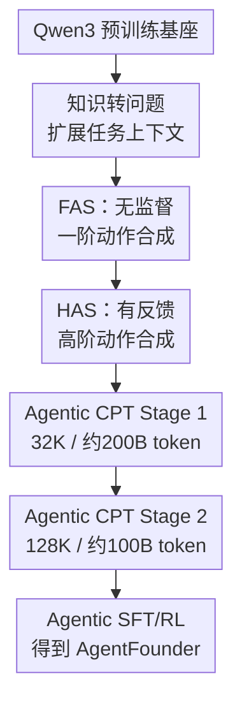

# Scaling Agents via Continual Pre-training

**会议**: ICLR2026  
**OpenReview**: [https://openreview.net/forum?id=Dru5mm9anE](https://openreview.net/forum?id=Dru5mm9anE)  
**代码**: 未公开 / 待确认  
**领域**: LLM Agent  
**关键词**: Agentic CPT, 深度研究智能体, 工具调用, 合成轨迹, 持续预训练  

## 一句话总结
本文把 agent 能力的学习前移到持续预训练阶段，提出 Agentic Continual Pre-Training，并用 FAS/HAS 两类大规模合成数据训练出 AgentFounder，使开源 30B 级深度研究 agent 在 BrowseComp、GAIA、HLE 等 10 个基准上达到很强表现。

## 研究背景与动机
**领域现状**：深度研究 agent 已经不只是回答单轮问题的聊天模型，而是要在开放网页、搜索引擎、代码解释器、学术检索和文件解析等工具之间来回切换，完成多步检索、证据整理、推理和报告生成。当前多数开源系统沿用通用 LLM 的训练路线：先拿一个通用基座模型，再通过 SFT 或 RL 加入 ReAct 轨迹、工具调用格式和任务偏好。

**现有痛点**：这种“通用基座 + agent 后训练”的方案在困难 agent 任务上很吃力。原因不是简单的数据量不够，而是后训练同时背负两件事：一边要让模型学会如何规划、何时搜索、怎样读网页、如何综合证据；另一边又要让模型贴近专家轨迹和奖励信号。agent 轨迹很长、动作空间巨大，SFT 很容易把模型锁进少数演示模式，RL 又只能拿到延迟的轨迹级反馈，难以稳定塑造中间决策。

**核心矛盾**：深度研究 agent 需要的是一种“agentic inductive bias”：模型在进入 SFT/RL 之前，就应该已经习惯长上下文、工具结果、逐步决策和事实综合。如果基座模型完全缺少这种先验，后训练就会把能力学习和行为对齐揉在一起，形成优化冲突；如果先通过持续预训练建立 agent 基础能力，后训练就更像是在释放和校准已有能力。

**本文目标**：作者希望回答三个问题：第一，能不能把 agent 能力作为持续预训练目标，而不是只靠后训练补课；第二，如何在不真实调用昂贵工具 API 的情况下，规模化合成足够多样的 agent 训练语料；第三，这样得到的 agentic base model 是否能稳定适配不同 SFT 数据，并在深度搜索/研究任务上超过同尺寸开源模型。

**切入角度**：论文从“数据形态”切入。作者没有只收集完整成功轨迹，而是把静态知识、工具响应、废弃轨迹和历史检索结果都改造成适合 next-token prediction 的 agent 行为文本：有的样本训练初始规划动作，有的训练信息充分后的逻辑综合，有的把真实轨迹拆成逐步多选决策。

**核心 idea**：用大规模 Agentic CPT 先训练一个“预对齐的 agent 基座”，再接常规 agent SFT/RL，从而把 agent 能力学习从脆弱的后训练阶段提前到更稳定、更可扩展的持续预训练阶段。

## 方法详解

### 整体框架
AgentFounder 的训练流程是在 Qwen3 系列预训练模型之后，插入两阶段 Agentic CPT，再进行通用和 agent 后训练。Agentic CPT 仍然使用标准 next-token prediction，但训练语料不再是普通网页文本，而是围绕工具调用、规划、证据综合和轨迹决策重写后的 agent 行为数据。

第一阶段使用约 200B token、32K 上下文，目标是让模型初步习得工具调用格式、多步规划和知识推理。第二阶段使用约 100B token、128K 上下文，重点训练长轨迹、长证据链和复杂行动空间。最终得到 AgentFounder-Base 后，再用不同 SFT 配置训练成 AgentFounder-30B。

### 关键设计
**1. Agentic CPT：把 agent 对齐从后训练前移到持续预训练**

本文最关键的判断是：深度研究 agent 的困难不是“学一个工具调用格式”这么表层，而是模型需要在开放环境中形成稳定的规划、检索、阅读、综合和修正习惯。因此作者把 Agentic CPT 放在预训练和后训练之间，让模型用 next-token prediction 先暴露在大规模 agent 行为文本中。训练目标仍然是 $L=-\sum_{t=1}^{T}\log P(x_{t+1}\mid x_1,\ldots,x_t)$，但 $x$ 的内容已经从普通文本变成了问题、思考、工具调用、工具响应、候选动作和最终判断的混合序列。

这种设计解决的是后训练的“双重负担”。如果没有 Agentic CPT，SFT/RL 要同时教会模型 agent 能力和专家偏好；有了 Agentic CPT，后训练只需要在已有 agent 行为先验上做校准。论文的 SFT loss 分析也支持这一点：在同一套 SFT-A 数据上，AgentFounder 系列的最终 loss 明显低于直接从 Qwen3 base 后训练的 baseline，且 CPT token 越多，loss 越低。

**2. FAS：用知识到问题再到动作的链条，低成本扩展 agent 行为空间**

First-order Action Synthesis 解决的是“没有足够完整 agent 轨迹怎么办”。作者先把网页、工具响应、CommonCrawl、离线 Wikipedia 和历史轨迹中的静态知识转成实体锚定的开放世界记忆：实体不是固定 schema 里的节点，而是关联一组带时间、来源和语气的事实陈述。随后从同一组实体知识中合成不同风格的问题，包括事实检索、数值计算、多跳推理、网页导航和报告综合。

有了问题之后，FAS 不直接让模型完整跑完搜索轨迹，因为那会消耗昂贵的搜索和网页访问 API。它只合成“规划动作”和“推理动作”。规划动作让 LLM 针对问题生成初始分析和第一步工具调用或直接回答；为了避免同一个问题被重复改写，实际做法是从同一知识记忆中生成 $K$ 个风格不同的问题，再分别生成 reasoning-action 数据。推理动作则模拟“工具信息已经收集充分之后如何综合答案”：先让模型凭内部知识拆解问题并给出初稿 $A_1$，再把问题和映射到的必要知识交给模型修正为 $A_2$。两类样本都通过 LLM-as-Judge 做 reject sampling，规划数据的过滤后准确率从约 50% 提升到 82%。

**3. HAS：把废弃轨迹改写成逐步多选决策，而不是简单复制成功路径**

High-order Action Synthesis 针对 post-training 中大量“没完全成功但包含有用中间信号”的轨迹。传统做法通常按轨迹级成败来保留或丢弃，失败轨迹被整体浪费；如果强行给中间 step 打分，又容易引入不可靠监督。HAS 的做法更巧妙：不判断每个备选动作绝对好坏，而是把原始轨迹中的每一步改造成一个有上下文、有候选、有最终轨迹级判断的决策样本。

具体来说，给定问题 $Q$ 和轨迹 $T=\{(S_1,R_1),\ldots,(S_K,R_K)\}$，第 $k$ 步的条件上下文是 $C_k=(Q,S_1,R_1,\ldots,S_{k-1},R_{k-1})$。作者在不真实执行工具的情况下，为 $C_k$ 合成 $N$ 个 alternative “thought and invocation”，再把原始 step $S_k$ 放进去并随机打乱。训练文本会展示多个候选方案，然后写出“选择原始轨迹对应的选项”，接真实工具响应 $R_k$，最后拼接整条轨迹的成败判断。这等于让模型看到同一状态下可能有哪些局部决策，并学习专家轨迹在候选空间中的选择，而不是只死记一条长路径。

**4. 两阶段长上下文课程：先学基础 agent 行为，再学完整长轨迹**

Agentic CPT 的第二个关键不是只堆 token，而是按上下文长度和数据质量分阶段。Stage 1 用 32K 上下文和约 200B token 建立基础，数据中约 110B 是 Planning Action，约 30B 是 Reasoning Action，约 40B 是 HAS，同时混入数学、代码和长链推理等通用数据以缓解遗忘。Stage 2 则用 128K 上下文和约 100B token，把重点放到长上下文 HAS 与通用工具使用数据上，并 replay Stage 1 的约 20B 子集来保持分布稳定。

这个课程设计直接对应深度研究 agent 的实际使用场景：困难任务往往不是三五步搜索，而是几十次工具调用、多个网页证据、长报告组织和反复验证。消融里，Stage 1&2 比只做 Stage 1 在 BrowseComp-en、BrowseComp-zh 和 GAIA 上都更好，尤其 BrowseComp-zh 的 Pass@3 提升达到 8.0 点，说明完整长上下文轨迹不是可有可无的装饰。

### 一个完整示例
假设训练系统从网页知识中看到几条关于 Paris 的事实：Louvre 在 2024 年接待 870 万游客，巴黎在 2023 年经历过臭虫相关公共事件，Paris Air Show 2025 上不同航空公司宣布订单。FAS 会先把这些事实组织到以 “Paris” 为锚点的开放世界记忆里，再合成一个需要多跳定位的问题：题面不直接说 Paris Air Show，而是用“有玻璃金字塔入口的博物馆”“全球体育庆典期间的高个位数百万游客”“前一年城市公共事件”等线索让模型推断事件。

对这个问题，Planning Action 样本可能只训练第一步：模型需要意识到要搜索 “pyramid-fronted museum high single-digit visitors Olympics”，并判断 Louvre/Paris 是关键线索。Reasoning Action 样本则在给出必要知识后训练最终综合：根据订单表识别 Riyadh Air 的 25 架 firm order 和 25 架 option 是“firm orders equal to options”。如果后来有一条真实 agent 轨迹经历 50 步搜索才答对，HAS 会在每个搜索/访问步骤旁边加入多个候选动作，让模型学习“在当前证据状态下为何选这一步”，而不是只学习最后答案。

### 损失函数 / 训练策略
Agentic CPT 没有引入新的强化学习目标，而是把复杂 agent 行为全部序列化为语言建模数据，继续优化 next-token prediction。这个选择很重要：它让大规模训练可以沿用成熟的预训练基础设施，不必在 CPT 阶段执行工具、打在线奖励或处理不稳定的交互式 RL。

训练数据总量约 300B token。Stage 1 采用 32K context，主要覆盖 planning、reasoning、HAS 和通用能力保持数据；Stage 2 扩到 128K context，训练 64K 到 128K 的长上下文 HAS，并混入通用 tool-use 与 Stage 1 replay 数据。后训练阶段使用三套 SFT 配置验证适配性：SFT-A 是通用对话后接 ReAct 轨迹，SFT-B 在每阶段都混合通用对话和 ReAct 轨迹，SFT-C 使用带 summarized reasoning 的 ReAct 轨迹。推理评测时温度为 0.85，top-p 为 0.95，repetition penalty 为 1.1，最大工具调用次数为 128，上下文长度为 128K。

## 实验关键数据

### 主实验
论文在两类 benchmark 上评估 AgentFounder-30B：通用 web search / deep search，以及场景化 deep research。整体结果显示，它在多数开源 deep research agent 上取得明显优势，并在部分任务上接近或超过商业 deep research 系统。

| 基准 | 指标 | AgentFounder-30B | 强开源对比 | 商业对比 | 主要结论 |
|------|------|------------------|------------|----------|----------|
| BrowseComp-en | Accuracy | 39.9 | DeepSeek-V3.1 30.0 | OpenAI Deep Research 51.5 / o3 49.7 | 显著超过开源 SOTA，仍低于 OpenAI 系列 |
| BrowseComp-zh | Accuracy | 43.3 | GLM-4.5 37.5 / DeepSeek-V3.1 49.2 | OpenAI-o3 58.1 | 超过 GLM-4.5，但中文侧仍落后于 DeepSeek-V3.1 和 o3 |
| GAIA-text | Accuracy | 72.8 | GLM-4.5 66.0 / DeepSeek-V3.1 63.1 | OpenAI-o3 70.5 | 在文本子集上超过列出的开源和商业对比 |
| xbench-DeepSearch | Accuracy | 73.0 | DeepSeek-V3.1 71.0 / GLM-4.5 70.0 | Kimi-Researcher 69.0 | 深度搜索任务上达到最高结果 |
| WebWalkerQA | Accuracy | 71.9 | GLM-4.5 65.6 / Kimi-K2 63.0 | OpenAI-o3 71.7 | 略高于 OpenAI-o3，说明网页遍历能力强 |

场景化任务中，AgentFounder-30B 在 HLE、Frames、SEAL-0、AcademicBrowse 等任务上表现也很突出，尤其 HLE 31.5 Pass@1 是论文强调的关键结果。

| 基准 | 指标 | AgentFounder-30B | 强开源对比 | 商业对比 | 主要结论 |
|------|------|------------------|------------|----------|----------|
| HLE | Pass@1 | 31.5 | DeepSeek-V3.1 29.8 / GLM-4.5 21.2 | Gemini Deep Research 26.9 / OpenAI Deep Research 26.6 | 首个超过 30 分的开源结果之一 |
| DeepResearch Bench | RACE Overall | 47.9 | GLM-4.5 39.2 / DeepSeek-V3.1 35.4 | Gemini Deep Research 49.7 / OpenAI Deep Research 46.5 | 接近 Gemini，并超过 OpenAI Deep Research 报告值 |
| Frames | Pass@1 | 89.6 | DeepSeek-V3.1 83.7 / GLM-4.5 78.9 | OpenAI-o3 84.0 | 多视角事实整合能力很强 |
| SEAL-0 | Pass@1 | 43.9 | DeepSeek-V3.1 42.6 / GLM-4.5 34.2 | Kimi-Researcher 36.0 | 抗干扰搜索能力强 |
| AcademicBrowse | Pass@1 | 75.3 | DeepSeek-V3.1 65.0 / GLM-4.5 55.6 | 未给出强商业完整对比 | 学术浏览和证据检索收益明显 |

### 消融实验
作者从 SFT 适配、训练策略、数据类型、通用能力和 scaling 几个角度验证 Agentic CPT 的作用。最重要的是：同样的后训练数据放在 AgentFounder-Base 上，比放在 Qwen3-30B-A3B-Base 上稳定更好，说明 CPT 不是只对某一套 SFT 数据过拟合。

| 实验 | 配置 | 关键指标 | 说明 |
|------|------|----------|------|
| SFT 适配性 | Qwen3 Base + SFT-A vs AgentFounder Base + SFT-A | BrowseComp-en 26.9 → 31.4，GAIA 67.0 → 72.8，HLE 23.5 → 30.4 | 同一 SFT-A 下，Agentic CPT 带来全面提升 |
| SFT 适配性 | Qwen3 Base + SFT-B vs AgentFounder Base + SFT-B | BrowseComp-en 28.6 → 39.9，BrowseComp-zh 35.6 → 43.3 | SFT-B 上收益最大，说明更好的后训练数据仍很关键 |
| SFT 适配性 | Qwen3 Base + SFT-C vs AgentFounder Base + SFT-C | BrowseComp-en 24.5 → 38.8，BrowseComp-zh 36.7 → 44.3 | summarized reasoning 轨迹也能释放 CPT 基座能力 |
| 两阶段训练 | Stage 1 Only vs Stage 1&2 | BrowseComp-en Pass@1 31.4 → 35.5，BrowseComp-zh Pass@3 50.5 → 58.5 | 长上下文第二阶段显著改善复杂搜索 |
| 数据类型 | Non-CPT vs FAS vs FAS+HAS | BrowseComp-zh Pass@1 29.8 → 37.0 → 40.1 | FAS 已有效，HAS 对中文搜索和 Pass@3 有补充收益 |
| 通用能力 | Qwen3 Base vs AgentFounder Base | MMLU 81.38 → 80.11，GPQA 43.94 → 42.58 | agent 能力提升伴随轻微通用能力回退 |
| 数据 scaling | 0B → 315B token | Avg Pass@3 54.2 → 62.2 | Agentic CPT 呈现随数据量增长的收益趋势 |

### 关键发现
- Agentic CPT 的收益不是只体现在最终分数。相同 SFT 语料下，AgentFounder 的 SFT loss 更低，说明模型在进入后训练前已经具备更接近 agent 任务的表示和行为先验。
- FAS 的主要价值是规模化和低成本：它不真实调用搜索或网页 API，却能合成大量规划与推理样本；过滤后规划样本准确率从 50% 到 82%，证明 reject sampling 对质量控制很关键。
- HAS 的价值在于复用真实轨迹中的局部决策信号。它不要求给每一步定义精确奖励，而是通过候选动作和最终判断让模型学习决策结构。
- Stage 2 的 128K 长上下文训练对深度研究任务尤其重要。BrowseComp、HLE 这类任务常常需要几十次工具调用和长证据综合，截断轨迹会直接损伤模型对长 horizon 的学习。
- 通用能力有轻微下降，MMLU、SuperGPQA、GPQA 都掉约 1.3 到 1.5 点。论文认为这是 agent 数据占比过大导致的可接受 trade-off，但也说明未来需要更精细的数据配比。
- 工具调用分析显示模型能按任务复杂度调整调用密度：BrowseComp-en 和 HLE 呈重尾分布，WebWalker 和 GAIA-text 更保守，说明它不是简单地“多搜就好”。

## 亮点与洞察
- 本文最有价值的概念贡献是把 agentic alignment 和传统 instruction alignment 区分开。agent 对齐不只是输出偏好一致，而是 reasoning chain、tool invocation、环境反馈处理和最终答案都要接近专家行为。
- Agentic CPT 是一个很实用的训练管线创新。它没有发明复杂新 loss，而是通过数据重写把 agent 行为纳入 next-token prediction，这让方案更容易扩展到现有 LLM 预训练系统。
- FAS 的“实体锚定开放世界记忆”比固定知识图谱更贴近网页信息流。它保留时间、来源和新闻式表述，适合生成 BrowseComp 这类需要最新事实和隐式线索的问题。
- HAS 对失败轨迹的利用很有启发。很多 agent 训练浪费在轨迹级 reject 上，而本文把轨迹内部每一步转成多选决策，绕开了不可靠 step reward，却保留了局部行动空间。
- 论文展示了 agent 能力也可能存在 scaling law。无论模型大小从 1B 到 30B，还是数据从 15B 到 315B，平均表现都持续上升，这对“agent foundation model”方向很有信号意义。
- 这个思路可以迁移到其他 agent 场景，例如 GUI agent、代码 agent、科学发现 agent 或企业工作流 agent。关键不是照搬 web search 数据，而是把各领域的环境反馈和局部决策改写成可持续预训练的序列。

## 局限与展望
- 论文的训练成本非常高。约 300B token 的 Agentic CPT 加 128K context 训练不是普通研究团队容易复现的规模，开源社区更需要小规模可验证版本。
- 数据合成依赖 LLM-as-Judge 和已有 LLM 生成 reasoning/action，这会继承生成模型自身偏差。虽然 reject sampling 提升了质量，但 judge 的误判和风格偏好仍可能影响最终 agent 行为。
- 中文表现仍有差距。BrowseComp-zh 上 AgentFounder-30B 低于 DeepSeek-V3.1 和 OpenAI-o3，作者将其归因于中文训练数据不足和 Google Search 中文场景不理想，但这也提示 agent CPT 数据需要更强的语言和地区覆盖。
- 通用能力轻微退化说明数据配比还有优化空间。未来可以探索动态 mixture、能力保持 regularization，或在 Stage 2 replay 中增加更有代表性的通用长上下文数据。
- HAS 选择原始轨迹 step 作为“正确选项”，但原始轨迹不一定局部最优。若能结合可靠的轻量 step verifier 或 hindsight relabeling，可能进一步减少对原轨迹路径的依赖。
- 论文主要评估单 agent ReAct 范式。多 agent 协作、带视觉网页理解、长周期项目执行等更复杂设置下，Agentic CPT 的收益还需要进一步验证。

## 相关工作与启发
- **vs WebSailor / WebSailor-V2**: WebSailor 系列重点在合成困难信息寻求问题和用 RL/SFT 训练 web agent，本文更强调在后训练之前构建 agentic foundation model。两者可以互补：WebSailor 式任务生成可作为 Agentic CPT 的数据源。
- **vs WebThinker / ASearcher / WebDancer**: 这些工作更多围绕长 horizon 搜索和强化学习展开，目标是让模型在交互中学会深搜。AgentFounder 则把大量交互模式离线重写成 CPT 语料，用预训练方式先塑造行为先验。
- **vs Toolformer / Tool Learning with Foundation Models**: Toolformer 关注模型如何学习调用工具，本文的工具调用只是更大 agent 行为的一部分，还包含开放问题规划、长证据综合、轨迹决策和报告生成。
- **vs Continual Pre-training for LLMs**: 传统 CPT 常用于领域知识适配，例如医学、代码或新语料更新。本文把 CPT 的目标从“补知识”扩展到“补 agent 能力”，说明持续预训练可以适配行为分布，而不只是内容分布。
- **对后续工作的启发**: 如果要训练专用 agent，不一定等到 SFT/RL 才放入轨迹。可以先把环境日志、失败尝试、工具响应和用户任务改造成 CPT 数据，再用少量高质量后训练数据做对齐，这可能比单纯堆 expert demonstration 更稳。

## 评分
- 新颖性: ⭐⭐⭐⭐⭐ 把 Agentic CPT 系统化地放进深度研究 agent 训练管线，并提出 FAS/HAS 两类数据合成，方向上很清晰。
- 实验充分度: ⭐⭐⭐⭐⭐ 覆盖 10 个 agent benchmark、三套 SFT 数据、多项消融、通用能力和 scaling 分析，证据链比较完整。
- 写作质量: ⭐⭐⭐⭐☆ 主线明确，方法图和实验表充分，但部分合成数据细节仍需要依赖附录和示例才能完全复现。
- 价值: ⭐⭐⭐⭐⭐ 对开源 deep research agent 训练路线很有参考价值，尤其是“先预训练 agent 基座，再后训练对齐”的范式。

<!-- RELATED:START -->

## 相关论文

- [\[CVPR 2026\] WebGym: Scaling Training Environments for Long-Horizon Visual Web Agents with Realistic Tasks](../../CVPR2026/llm_agent/webgym_scaling_training_environments_for_long-horizon_visual_web_agents_with_rea.md)
- [\[ICLR 2026\] PolySkill: Learning Generalizable Skills through Polymorphic Abstraction for Continual Agents](polyskill_learning_generalizable_skills_through_polymorphic_abstraction_for_cont.md)
- [\[ICLR 2026\] Cyber-Zero: Training Cybersecurity Agents without Runtime](cyber-zero_training_cybersecurity_agents_without_runtime.md)
- [\[ICML 2026\] Position: Modular Memory is the Key to Continual Learning Agents](../../ICML2026/llm_agent/position_modular_memory_is_the_key_to_continual_learning_agents.md)
- [\[ICLR 2026\] Scaling Synthetic Task Generation for Agents via Exploration](scaling_synthetic_task_generation_for_agents_via_exploration.md)

<!-- RELATED:END -->
