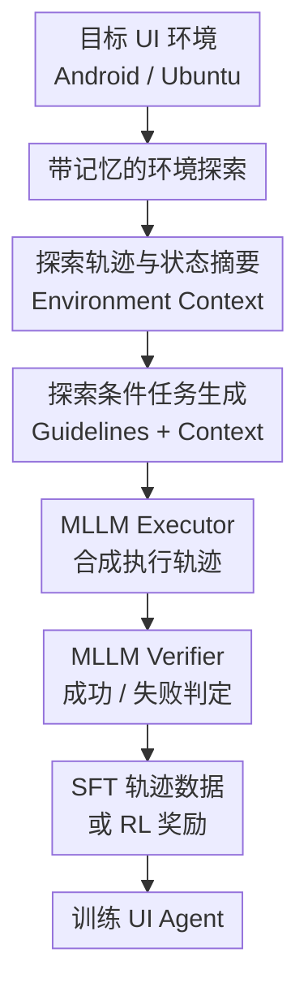

# Scaling Synthetic Task Generation for Agents via Exploration

**会议**: ICLR 2026  
**OpenReview**: [https://openreview.net/forum?id=ng4KgSRAW8](https://openreview.net/forum?id=ng4KgSRAW8)  
**代码**: 无公开代码  
**领域**: LLM Agent / UI Agent / 合成任务生成  
**关键词**: 合成任务生成, UI Agent, 环境探索, 多模态大模型, 强化学习  

## 一句话总结
AUTOPLAY 通过让多模态大模型先主动探索 Android 与 Ubuntu UI 环境、再基于探索轨迹和任务 guideline 生成可执行任务，自动构建大规模 UI agent 训练数据，并在 SFT 与 RL 后显著提升移动端和桌面端 agent 的任务成功率。

## 研究背景与动机
**领域现状**：多模态大语言模型已经开始被用作 computer-use、web navigation、mobile-use 乃至机器人场景中的交互式 agent。典型训练范式不是只让模型回答静态问题，而是给它一个截图、一个自然语言目标和历史动作，让它逐步点击、输入、滚动、返回，最终完成一个真实环境里的任务。

**现有痛点**：这类 agent 的瓶颈不只是模型能力，还在于缺少下游交互任务数据。一个可用训练样本通常需要两部分：一条自然语言任务，例如“删除下周二所有日程”；以及一条完成该任务的交互轨迹。现实里这些数据往往藏在手机应用、桌面软件、商业网站或个人设备里，不能像网页文本那样天然积累到互联网规模。依赖人工写任务、人工演示轨迹的路线成本高，而且很难覆盖每个应用的细碎功能。

**核心矛盾**：合成任务要真正有用，必须同时满足多样、可执行、可验证三个条件。只让 LLM 根据应用简介或初始截图编任务，容易生成“看起来合理但当前环境里不存在”的指令，例如要求删除一个截图中没有出现的事件；而只把探索轨迹 hindsight relabel 成一个任务，又会被单条轨迹限制，覆盖不了同一环境里多个可组合功能。

**本文目标**：作者希望自动生成大规模 agentic task dataset $D$，其中每个任务是自然语言目标 $g$ 与初始状态 $s_0$ 的组合。这个任务集既要覆盖 Android 和 Ubuntu 应用中的真实功能，又要能驱动后续 executor 生成演示轨迹，还要能用 verifier 过滤 SFT 数据或作为 RL 奖励。

**切入角度**：论文的核心观察是，任务生成前必须先知道环境“现在有什么”和“能做什么”。这些信息不是模型参数里稳定存在的知识，而是需要通过交互得到：当前日历里有哪些事件、设置页里有哪些选项、文件管理器里有哪些实体、哪些按钮会打开哪些表单。AUTOPLAY 因此把“探索环境”从隐式副产物变成任务生成的第一阶段。

**核心 idea**：用带记忆的 MLLM explorer 系统性探索 UI 环境，把探索轨迹转成环境上下文，再让 task generator 在具体上下文和任务 guideline 的约束下批量生成 grounded、feasible、verifiable 的 agent 任务。

## 方法详解
AUTOPLAY 面向可表示为 POMDP 的交互环境。状态空间为 $S$，观测空间为 $O$，动作空间为 $A$，任务目标来自自然语言 goal distribution $G$；训练目标是得到 goal-conditioned policy $\pi(a_t \mid o_t, g)$。在 UI agent 实例化里，观测 $o_t$ 是设备截图，动作包括点击、输入、滚动、打开应用等，目标 $g$ 则是用户自然语言任务。

### 整体框架
AUTOPLAY 的核心 pipeline 分成两层。第一层先不带具体任务目标地探索每个应用，让 explorer 尽量访问新状态和新功能，并把多轮探索压缩成可放入上下文的记忆。第二层把探索轨迹当作 environment context，再结合不同任务类型的 guideline，让 task generator 生成大量自然语言任务；随后 executor 尝试执行这些任务，verifier 判断轨迹是否成功，成功轨迹用于 SFT，任务本身也可配合 verifier reward 做 RL。

在形式化上，AUTOPLAY 生成的是任务数据集 $D = \{(g, s_0)\}$。这里的 $g$ 是生成出的自然语言任务，$s_0$ 是对应探索轨迹的起始状态。后续若走 SFT，就用 executor 采样轨迹 $\tau = (o_0, a_0, \ldots, o_T)$，再用 verifier 过滤出成功演示；若走 RL，就在环境中从 $(g, s_0)$ 开始 rollout，并用 verifier 给整条轨迹打二值奖励 $R(\tau, g) \in \{0,1\}$。

### 关键设计
**1. 带记忆的环境探索：先发现真实可操作空间**

AUTOPLAY 的第一阶段不是让模型立刻编任务，而是给 explorer 一个通用目标：“尽可能完整地探索这个应用的功能、状态和已存数据”。Explorer 每一步看到当前截图、历史交互记忆，并选择下一个 UI 动作。这样得到的轨迹 $\tau = (o_1, a_1, \ldots, o_K, a_K)$ 不被视为某个任务的成功演示，而是被视为环境上下文，告诉后续生成器哪些页面存在、哪些按钮可点、哪些实体可编辑或删除。

关键在于“多轮探索 + 摘要记忆”。同一个应用会探索 $M$ 轮；第 $i$ 轮开始前，系统不会把前面所有高维截图轨迹硬塞进上下文，而是用 summarizer MLLM 把每条旧轨迹压缩成文本记忆 $m_i = \mathrm{MLLM}(\mathrm{summary\_prompt}, \tau_i)$。这些记忆记录已访问页面、已发现功能和环境中已有的数据，帮助下一轮 explorer 避免反复打开同一页面，转而寻找新的状态。这个设计直接针对 UI 环境的长尾功能覆盖问题：很多任务能否生成，取决于探索阶段有没有见过对应表单、设置项或可操作实体。

**2. 探索条件任务生成：把轨迹从“演示”改造成“任务素材”**

第二阶段使用 task generator MLLM，但它的输入不是空泛应用说明，而是探索轨迹和任务 guideline。对每个探索上下文 $\tau \in E$，系统采样一个 guideline $p \in P$，让模型生成一组任务 $(g_1, \ldots, g_K)$。每个任务都和该轨迹的初始状态 $s_1$ 配对，形成 $(g_i, s_1)$。因此，同一条探索轨迹可以派生多个任务：一次打开日历创建表单的探索，不只可以变成“创建会议”，也可以变成“编辑已有事件”“删除某个事件”“查询某天有几场会议”等不同任务。

这个设计与 hindsight relabeling 路线的差别很重要。以往一些方法把一段探索轨迹总结成一个长任务，任务空间会被轨迹本身强绑定；AUTOPLAY 则把轨迹看成“功能和状态证据”，再在 guideline 的约束下生成多个可执行目标。这样既保留了 grounding，也突破了“一条轨迹只对应一个指令”的限制。

**3. 任务 guideline：把多样性写成可控约束**

AUTOPLAY 不把“生成多样任务”完全交给模型自由发挥，而是显式准备任务 guideline。移动端实验中有四类 guideline：Feature-Use、Feature-Composition、Information Retrieval、Subtask Repetition。它们分别鼓励模型生成基础功能使用、多个功能组合、信息检索和重复操作任务。桌面端也使用面向 Ubuntu 应用的 feature-use 与 composition guideline，并定义搜索、过滤、编辑、删除、表单、multi-hop reasoning、重复操作等 primitive。

这些 guideline 的作用不只是提示风格，而是约束任务的可执行性。例如涉及创建、编辑、删除的任务必须明确参数；删除或编辑已有实体时，参数应来自探索截图中确实存在的实体；信息检索任务必须要求 agent 最后用自然语言回答，而不是让它“展示如何查看”。这种约束把任务从“像真实用户请求”推向“当前环境里真的能执行且能验证”。消融结果显示，去掉 guideline 后任务执行成功率和下游 agent 表现都会下降，说明探索上下文解决 grounding，guideline 则负责覆盖结构和任务形态。

**4. Executor-Verifier 闭环：从任务集扩展到可训练数据与 RL 奖励**

生成任务本身还不能直接训练 agent，AUTOPLAY 进一步用一个模块化 MLLM executor 去尝试完成任务。移动端 executor 使用 GPT-4o 作为 high-level planner 和 reflection model，用 UI-TARS-1.5 7B 做 grounding；桌面端使用 GPT-4o 加 GTA1-7B grounding，并在复杂 UI 交互里给 expert executor 一些 heuristic action。Planner 每一步基于任务、截图、历史动作和上一动作 reflection 生成高层动作，grounding model 再把点击类动作落到像素坐标。

Verifier 是闭环里的质量闸门。它读取任务指令和图像-动作交错轨迹，先总结屏幕变化，再推理任务是否完成，最后输出 success 或 failure。SFT 时，只有 verifier 判定成功的轨迹会进入训练集；RL 时，verifier 直接作为 reward model 给整条 rollout 二值奖励。这个设计的价值在于不需要 privileged environment state，也不需要人工逐条标注成功与失败，从而把合成任务扩展成可训练监督和可扩展 RL 信号。

### 一个完整示例
假设目标环境是一个日历应用。第一轮 explorer 从首页进入月视图，打开某天的事件列表，发现已有 “Catch up” 和 “Meeting with Marketing” 两个事件；随后它进入创建事件页面，看到标题、地点、开始时间、持续时间和提醒等字段。Summarizer 会把这些交互压缩成：日历支持查看事件、创建事件、删除已有事件、设置提醒，并记录截图中出现的事件名称和日期。

任务生成阶段如果抽到 Feature-Use guideline，generator 可以基于这些实体提出“删除 10 月 21 日的 Catch up 事件”或“创建一个 16:00 开始、持续 1 小时、地点为 Office 的 Discuss Project Deadline 会议”。如果抽到 Information Retrieval guideline，它可以生成“10 月 16 日下午 1 点后有多少个会议？”这种需要查询环境状态并回答的任务。注意这些任务不是凭空编出来的：删除任务使用了探索中看到的真实事件，创建任务使用了探索中确认存在的字段，查询任务使用了当前环境里可访问的数据。

随后 executor 从对应初始状态开始操作。若它成功删除事件或创建会议，verifier 根据前后截图和动作判断 success，该轨迹进入 SFT 数据；若它只完成了部分子目标，verifier 应该判为 failure，不进入 SFT。RL 设置下，同样的任务可以被反复 rollout，成功轨迹得到 $1$，失败轨迹得到 $0$，用于 GRPO 训练。

### 损失函数 / 训练策略
SFT 训练使用 AUTOPLAY 生成任务经过 executor 执行、verifier 过滤后的成功轨迹。作者在 AndroidWorld 的 20 个应用上生成约 20k 个任务，最终得到约 8k 条成功轨迹；在 Ubuntu 的 13 个应用上生成约 10k 个任务，最终得到约 3.5k 条成功轨迹。基础模型是 Qwen2.5-VL Instruct 3B、7B、72B，训练后的模型记为 AUTOPLAY-3B、AUTOPLAY-7B、AUTOPLAY-72B。

RL 训练使用 AUTOPLAY 任务和 MLLM verifier 作为奖励。每个环境 worker 从任务集采样 $(g, s_0)$，让当前策略完成任务，rollout 结束后由 Qwen2.5-VL-32B verifier 判定成功与否，并给奖励 $1$ 或 $0$。为了稳定训练，RL 只使用 executor 至少成功过一次的约 8k 个移动端任务。优化算法是 GRPO，group size 为 8，使用 32 张 H100，学习率 $1 \times 10^{-6}$，训练 120 次 GRPO 更新。

## 实验关键数据

### 主实验
作者在 AndroidWorld 和 OSWorld 上评估训练后的 UI agent。指标 Pass@1 表示 5 次独立随机试验的平均成功率，Pass@5 表示 5 次试验中至少一次成功的任务比例。两个 benchmark 的评估 verifier 使用具有 privileged environment information 的 ground truth verifier，而训练数据生成阶段不使用这种特权信息。

| Benchmark | 模型 | Pass@1 | Pass@5 | 相对同尺寸基座提升 |
|--------|------|------|------|------|
| AndroidWorld | Qwen2.5-VL 7B | 19.5 | 27.7 | - |
| AndroidWorld | AUTOPLAY-7B | 40.1 | 58.4 | Pass@1 +20.6, Pass@5 +30.7 |
| AndroidWorld | Qwen2.5-VL 72B | 35.0 | 43.5 | - |
| AndroidWorld | AUTOPLAY-72B | 47.9 | 68.2 | Pass@1 +12.9, Pass@5 +24.7 |
| OSWorld | Qwen2.5-VL 7B | 3.7 | 4.1 | - |
| OSWorld | AUTOPLAY-7B | 11.4 | 12.1 | Pass@1 +7.7, Pass@5 +8.0 |
| OSWorld | Qwen2.5-VL 72B | 4.4 | 5.4 | - |
| OSWorld | AUTOPLAY-72B | 14.5 | 16.0 | Pass@1 +10.1, Pass@5 +10.6 |

这些结果说明，AUTOPLAY 生成的数据不只是让模型记住训练应用里的固定脚本，而是能提升通用 UI 操作能力。尤其是 AndroidWorld 上，AUTOPLAY-3B 的 Pass@1 达到 34.2，已经接近 Qwen2.5-VL-72B 的 35.0；AUTOPLAY-72B 还超过了用于收集数据的 GPT-4o + UI-TARS executor 的 43.1，说明 verifier 过滤后的合成数据可以蒸馏出比专家采样策略更强的 end-to-end agent。

### 消融实验
论文重点比较了探索方式和 guideline 对任务质量的影响。所有消融在 AndroidWorld 上生成 5k 个任务，使用相同 executor/verifier 采集成功轨迹，并微调 Qwen2.5-VL-7B。

| Task Generator | 任务执行 Pass@1 | 下游 AndroidWorld Pass@1 | 下游 AndroidWorld Pass@5 | 说明 |
|------|------|------|------|------|
| No Exploration | 21.3 | 28.8 ± 1.5 | 49.2 | 只用静态应用描述和起始截图，容易幻觉任务 |
| Iterative Exploration | 56.4 | 21.6 ± 1.7 | 33.6 | 短子任务逐步执行再 hindsight relabel，任务更容易但多样性不足 |
| AUTOPLAY w/o task guidelines | 43.5 | 26.7 ± 2.7 | 38.9 | 有探索但缺少任务类型约束，覆盖结构变差 |
| AUTOPLAY | 46.0 | 38.2 ± 3.1 | 58.5 | 探索 grounding 与 guideline 多样性同时保留 |

一个有意思的现象是，Iterative Exploration 的任务执行成功率最高，达到 56.4，但训练出的 agent 最差。这说明“executor 容易完成”不等于“训练价值高”：如果任务来自一串短子目标拼接，难度和覆盖都可能偏窄。AUTOPLAY 的执行成功率略低于它，却训练出明显更强的下游 agent，说明探索覆盖和 guideline 多样性更接近真实 benchmark 分布。

| 分析项 | 数值 / 结论 | 启示 |
|------|------|------|
| Android 任务规模 | 20 个应用约 20k 任务，约 8k 成功轨迹 | 合成任务可以扩展到万级，不依赖人工演示 |
| Ubuntu 任务规模 | 13 个应用约 10k 任务，约 3.5k 成功轨迹 | 桌面端也可复用同一 pipeline |
| RL 增益 | AUTOPLAY-3B 从 34.2 提升到 39.9 Pass@1 | verifier reward 能进一步利用 synthetic tasks |
| GPT-4o verifier 人类一致性 | Accuracy 59.3, Precision 56.9, Recall 82.8 | verifier 偏乐观，召回高但精度有限 |
| Qwen2.5-VL verifier 人类一致性 | Accuracy 61.8, Precision 57.7, Recall 95.9 | 开源 MLLM 可作为 verifier，但误判成功仍是风险 |

### 关键发现
- AUTOPLAY 对不同模型尺寸都有效。7B 和 72B 在 AndroidWorld、OSWorld 上都显著超过同尺寸 Qwen2.5-VL 基座，说明合成任务不是只在小模型上“补基础技能”。
- 探索上下文主要解决 feasibility 和 grounding。No Exploration 常见失败是任务中出现环境里没有的实体或功能；AUTOPLAY 因为先看过当前状态，能把任务参数绑定到真实 UI 内容。
- Guideline 主要解决任务分布和覆盖。没有 guideline 时，任务仍然可生成，但会少掉组合、重复操作、信息检索等结构化类别，下游训练效果明显下降。
- Verifier 是当前质量上限的重要瓶颈。人类评估显示两个 verifier 都偏乐观，尤其容易把“完成部分子目标”的长任务误判为成功，这会把噪声轨迹放进 SFT 或给 RL 错误奖励。
- 桌面端覆盖还不如移动端完整。论文指出 OSWorld 中 cross-app interaction、bash scripting、web search 等类别生成不足，原因可能是 computer-use guideline 不够丰富，而不是探索框架本身失效。

## 亮点与洞察
- AUTOPLAY 最巧妙的地方是把探索轨迹的角色重新定义了：它不是必须被标注成一个任务的演示，而是可以作为生成许多任务的状态证据。这样一条轨迹能放大成多个 grounded tasks，数据效率更高。
- 论文把 synthetic task generation 的评价从“任务看起来像不像”推进到“能否训练出更强 agent”。消融表明，可执行率最高的方法未必最好，真正重要的是任务覆盖、难度结构和 benchmark 分布是否匹配。
- 带记忆探索是很实用的工程设计。UI 应用里的功能经常藏在二级页面、设置菜单或长列表中，直接让模型反复看完整历史不可行，摘要记忆在覆盖率和上下文预算之间给了一个合理折中。
- Executor-Verifier 闭环让任务生成、轨迹生成和 RL 奖励连成一条自动化管线。这个思路可以迁移到 web agent、office agent、软件 IDE agent，甚至具备可视环境和可验证目标的模拟器任务。
- 论文诚实展示了 verifier 的不足，没有把自动验证包装成完美 oracle。这一点很关键，因为未来扩展 synthetic agent data 时，错误成功标签很可能成为比任务生成本身更难的瓶颈。

## 局限与展望
- AUTOPLAY 仍然依赖强 MLLM 作为 explorer、generator、executor 和 verifier，尤其 GPT-4o 在数据采集阶段扮演重要角色。虽然作者展示 Qwen2.5-VL verifier 也可用，但整体成本和闭源依赖仍然存在。
- Verifier 精度不高且偏乐观。约 60% 的 human agreement 意味着不少失败轨迹会被当作成功，长任务部分完成尤其容易误判。后续可以引入状态差分检查、应用 API 验证、可执行断言或多 verifier 投票来降低假阳性。
- 任务 guideline 需要人工设计，跨领域迁移时仍有专家成本。Android 端四类 guideline 覆盖较好，但 Ubuntu 端在跨应用、bash、web search 上覆盖不足，说明 guideline 的颗粒度直接影响最终任务分布。
- 探索本身没有显式最优覆盖目标。当前主要靠 MLLM prompt 和摘要记忆鼓励新状态探索，未来可以把 UI 状态新颖度、功能覆盖率、实体覆盖率定义成可优化指标，进一步减少重复探索。
- 论文主要验证 UI agent 场景。虽然动机里提到 web、robotics 和 broader agent domains，但真实实验集中在 AndroidWorld 与 OSWorld。迁移到机器人或开放网页环境时，动作空间、失败成本和 verifier 设计都会更复杂。

## 相关工作与启发
- **vs PAE / No Exploration 类任务生成**: 这类方法通常根据人工应用描述、静态截图或有限环境信息生成任务，成本低但 grounding 弱。AUTOPLAY 的区别是先交互探索环境，用真实状态和功能作为任务生成上下文，因此更少幻觉当前不存在的实体或操作。
- **vs AgentSynth / iterative exploration**: Iterative exploration 会逐步提出短子任务、执行后再总结成长任务，优点是任务容易被 executor 完成，缺点是轨迹路径会约束后续任务空间。AUTOPLAY 把探索和任务生成解耦，同一探索上下文可生成多个任务，覆盖更广。
- **vs BAGEL / NNetNav 类无监督探索 agent**: 这些工作同样重视通过环境交互获得训练信号，但 AUTOPLAY 更强调任务 dataset 的生成质量，并用 task guideline 显式控制任务类别，使生成的数据更适合后训练 MLLM UI agent。
- **对后续研究的启发**: 如果把“任务生成”看作 agent 训练的上游数据引擎，那么环境探索、任务约束、执行策略、验证器四者都可以单独扩展。尤其值得做的是可学习的 guideline 选择、覆盖率驱动的 explorer，以及更可靠的 multimodal verifier。

## 评分
- 新颖性: ⭐⭐⭐⭐☆ 把探索轨迹作为任务生成上下文的思路清晰有效，创新更多体现在可扩展 pipeline 与数据闭环组合上。
- 实验充分度: ⭐⭐⭐⭐☆ 覆盖 AndroidWorld、OSWorld、SFT、RL、探索消融、guideline 消融和 verifier 分析，但 verifier 误差对训练噪声的更细粒度影响还可继续展开。
- 写作质量: ⭐⭐⭐⭐☆ 方法结构和主实验清楚，图 1 很好地解释了两阶段 pipeline；部分表格和符号命名略有重名，如 Algorithm 中多个 $K$ 容易让读者混淆。
- 价值: ⭐⭐⭐⭐⭐ 对 UI agent 训练非常有参考价值，特别适合缺少人工任务和演示轨迹的新应用环境，是一条可以继续放大的 synthetic agent data 路线。

<!-- RELATED:START -->

## 相关论文

- [\[ICLR 2026\] AgentSynth: Scalable Task Generation for Generalist Computer-Use Agents](agentsynth_scalable_task_generation_for_generalist_computer-use_agents.md)
- [\[ICLR 2026\] ROGA: Scaling Generalist Agents for Office Productivity Tasks via Tool Generation](roga_scaling_generalist_agents_for_office_productivity_tasks_via_tool_generation.md)
- [\[ICLR 2026\] Meta-RL Induces Exploration in Language Agents](meta-rl_induces_exploration_in_language_agents.md)
- [\[ICLR 2026\] Go-Browse: Training Web Agents with Structured Exploration](go-browse_training_web_agents_with_structured_exploration.md)
- [\[ACL 2026\] Supplement Generation Training for Enhancing Agentic Task Performance](../../ACL2026/llm_agent/supplement_generation_training_for_enhancing_agentic_task_performance.md)

<!-- RELATED:END -->
