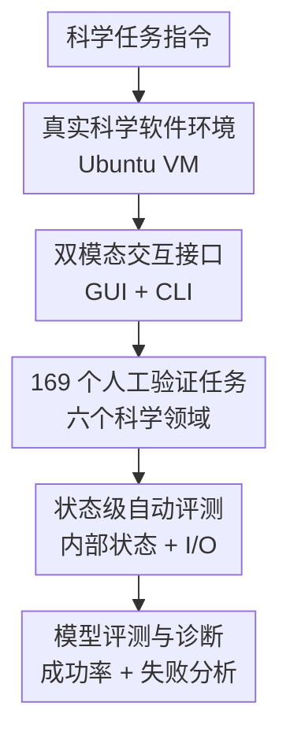

# ScienceBoard: Evaluating Multimodal Autonomous Agents in Realistic Scientific Workflows

**会议**: ICLR 2026  
**OpenReview**: [https://openreview.net/forum?id=bJvwJahJeF](https://openreview.net/forum?id=bJvwJahJeF)  
**代码**: ScienceBoard Homepage  
**领域**: LLM Agent / 多模态自主智能体评测  
**关键词**: 科学工作流, 电脑使用智能体, GUI/CLI交互, 多模态评测, 科学发现  

## 一句话总结
ScienceBoard 构建了一个集成真实科学软件的 Ubuntu 虚拟机环境和 169 个跨学科任务，用状态级执行评测检验多模态电脑使用智能体在真实科学工作流中的能力，结果显示最强模型总体成功率仍远低于人类。

## 研究背景与动机
**领域现状**：LLM/VLM Agent 已经从问答、代码生成和网页操作扩展到更开放的电脑使用场景。新的 computer-using agent 可以看屏幕、读 accessibility tree、点击 GUI、输入命令行，理论上能够像研究者一样操作 ChimeraX、GrassGIS、Celestia 这类专业软件。

**现有痛点**：科学发现并不是“回答一道科学题”这么简单。真实研究流程往往需要安装和配置软件、读取文件、调用专业功能、观察可视化结果、在 GUI 和 CLI 之间切换，并最终产出可验证的状态。很多已有 benchmark 要么是静态 QA，要么是单步代码任务，要么是通用桌面软件操作，无法反映科学软件中密集 UI、复杂输入输出、领域知识和长程执行共同出现时的难度。

**核心矛盾**：科学 Agent 的评测需要足够真实，才能暴露软件操作和科学推理的瓶颈；但越真实，评测越难自动化，因为最终结果可能不是一段文本，而是分子是否被正确选中、地图图层是否被正确显示、天体时间是否落在容差范围内，甚至某个中间文件是否按要求生成。

**本文目标**：作者希望补上“真实科学工作流中的自主 Agent 评测”这一块空白。具体来说，论文要解决三个子问题：第一，怎样搭建一个可复现、可扩展、包含专业科学软件的桌面环境；第二，怎样把科学家的日常软件操作整理成高质量任务；第三，怎样在不依赖人工主观打分的前提下判断任务是否真正完成。

**切入角度**：ScienceBoard 选择从 computer-using agent 的视角切入，而不是只考模型的科学知识。这个角度很关键，因为科学助手的实际价值不只在于会不会解释概念，还在于能不能把“预测这个蛋白结构”“显示某个地理图层”“设置天文模拟时间”这样的自然语言目标落到真实软件动作上。

**核心 idea**：用“真实虚拟机 + 专业科学软件 + 人工策划任务 + 状态级自动评测”替代静态问答式科学 benchmark，从而直接测量多模态自主智能体能否完成科学工作流。

## 方法详解

### 整体框架
ScienceBoard 的整体框架可以理解为一个面向科学 Agent 的闭环实验台：任务先在虚拟机中初始化，Agent 通过截图、a11ytree、GUI 动作和 CLI 命令与软件交互，最后由评测器读取软件内部状态和关键 I/O 来判断是否成功。它的贡献不在训练一个新模型，而在把环境、任务和自动评测三件事一起做成可复现的基础设施。

从实现上看，ScienceBoard 把每个任务都绑定到一组初始化文件、配置函数和评价函数。Agent 看到的是自然语言目标和当前桌面观测，能执行点击、拖拽、键盘输入、等待、提交答案、运行代码、调用 API、DONE/FAIL 等统一动作；评测器看到的则是虚拟机内部状态、软件暴露出的运行时变量、文件和命令输出。

论文把交互过程形式化为 POMDP：目标是 $g$，状态空间是 $S$，动作空间是 $A$，观测空间是 $O$，状态转移是 $T:S\times A\to S$。Agent 的策略 $\pi$ 基于目标、当前状态和由历史观测动作组成的记忆 $m_t$ 生成动作，轨迹概率写为：

$$
p_{\pi}(\tau)=p(s_0)\prod_{t=0}^{T}\pi(a_t|g,s_t,m_t)T(s_{t+1}|s_t,a_t)
$$

这个形式化的价值在于，它把科学软件操作看成一个部分可观测、长程、动态反馈的决策问题，而不是一次性预测答案。

### 关键设计
**1. 真实科学软件环境：把 Agent 放进研究者实际会用的工具链**

ScienceBoard 没有把科学任务简化成文本题，而是在 Ubuntu 22.04 虚拟机里集成开源或免费可用的专业软件。六个领域分别对应不同工具：Biochemistry 使用 UCSF ChimeraX，Algebra 使用 KAlgebra，Theorem Proving 使用 Lean 4，GIS 使用 GrassGIS，Astronomy 使用 Celestia，Scientific Documentation 使用 TeXstudio。这些软件覆盖了分子结构、符号数学、形式化证明、地理空间分析、天文模拟和科学文档写作。

这一步解决的是“评测载体太玩具化”的问题。科学工作流的难点常常藏在软件里：按钮很多、菜单层级深、输入格式复杂、输出是可视化或内部状态而不是一句话。作者因此要求软件不仅要有代表性，还要开源或可自由获取，并且要支持可访问性树或可被适配，方便 Agent 观测和评测器读取状态。

**2. GUI + CLI 统一动作空间：让评测覆盖真实的混合操作策略**

真实科学软件经常同时暴露 GUI 和 CLI。以 ChimeraX 为例，同一件事可能既能通过命令行完成，也能通过菜单和面板完成；GrassGIS 也有图形界面和命令接口。ScienceBoard 因此不把 Agent 限制在单一交互方式，而是设计了统一动作空间，既包括 `click(x,y)`、`dragTo(x,y)`、`doubleClick(x,y)`、键盘输入等 GUI 操作，也包括系统命令、应用内脚本、`CODE`、`API`、`ANS`、`DONE`、`FAIL` 和 `WAIT[n]`。

这个设计很重要，因为“会用 CLI”并不等价于“会用软件”，而“会点屏幕”也不等价于“能完成科学任务”。论文后续分析显示，混合 GUI + CLI 通常比 GUI-only 更稳；同时，有些模型能规划却不能准确落点，有些 GUI action model 能点得准但缺领域知识。统一动作空间让这些能力差异能够被看见。

**3. 人工策划的多领域任务：从教程学习到交叉验证，避免任务只像自动生成脚本**

ScienceBoard 的 169 个任务由有学科背景的标注者设计，流程包括学习教程和手册、策划任务、标准化指令、写配置函数、写评测函数以及双人交叉验证。任务类型覆盖配置、模拟、QA、领域知识、软件操作和跨应用文档生成，难度分为 Easy、Medium、Hard 和 Open Problems。

这套流程的核心不是追求任务数量最大，而是让任务真的像科学家的日常动作。比如在 ChimeraX 中预测蛋白结构、选择水分子并绘制质心；在 Celestia 中设置 Julian date 或展示行星轨道；在 GrassGIS 中显示特定图层；在 TeXstudio 中把上游实验结果整理成报告。每个任务都必须可执行、答案唯一或可判定，并且能通过自动评测可靠验证。

**4. 状态级评测器：用软件内部状态验证完成度，而不是只比文本答案**

ScienceBoard 最关键的工程点是评测。论文指出，科学软件中的正确性往往不能靠最终截图或自然语言回答判断。例如蛋白质旋转不应影响可视化任务的正确性，但天文模拟任务会被当前时间状态影响；地图图层任务可能要求“只显示某一层”，不能只看是否出现关键词。

为此，作者对软件做了适配：在应用主 UI 进程旁注入轻量服务器，通过 HTTP 请求暴露运行时内部状态；如果软件没有原生远程控制 API，就修改并重新编译源代码。评测函数再根据任务选择 exact match、集合相等、范围检查、数值容差、文件比较、谓词满足、Lean 编译通过等模板。这样，完成状态可以直接由 VM 内部状态和关键 I/O 判定，而不是依赖模型自报“DONE”。

### 一个完整示例
假设任务是“在 ChimeraX 中用 AlphaFold 预测给定氨基酸序列的蛋白结构”。任务初始化脚本会打开或准备好 ChimeraX 环境，并给 Agent 一条自然语言指令。Agent 可以先观察截图或 a11ytree，找到 AlphaFold widget，输入序列，等待预测完成，再根据界面或命令行反馈判断是否需要进一步操作。

如果 Agent 只是生成“我已经预测完成”的文字，评测不会通过。ScienceBoard 的评测器会读取 ChimeraX 暴露的内部状态，检查目标结构是否真的存在、相关模型是否被加载、必要元素是否满足预设条件。类似地，GrassGIS 任务会检查图层列表，Celestia 任务会检查模拟时间和天体可见性，Lean 任务会检查证明代码是否编译通过。这样，一个看似“桌面操作”的任务最终被转成可重复、可自动化的状态验证。

## 实验关键数据

### 主实验
论文评测了多类 Agent backbone，包括 GPT-4o、GPT-5、Claude-3.7-Sonnet、Claude-Opus-4.6、Gemini 系列、Qwen2.5-VL、InternVL3、QvQ、GPT-oss，以及 UI-TARS、OS-Atlas、UGround、GUI-Actor 等 GUI action model。观测设置包括纯截图、a11ytree、截图 + a11ytree、Set-of-Mark。

| 观测设置 | 模型 | Algebra | Biochem | GIS | ATP | Astron | Doc | Overall |
|----------|------|---------|---------|-----|-----|--------|-----|---------|
| Screenshot + a11ytree | GPT-5 | 41.93% | 62.07% | 5.88% | 7.69% | 15.15% | 12.50% | 24.20% |
| Screenshot + a11ytree | Gemini-2.5-Pro | 16.13% | 55.17% | 2.94% | 0.00% | 15.15% | 12.50% | 16.98% |
| Screenshot + a11ytree | Claude-3.7-Sonnet | 12.90% | 41.37% | 8.82% | 3.85% | 9.09% | 18.75% | 15.79% |
| Screenshot | Claude-Opus-4.6 | 3.23% | 68.97% | 2.94% | 0.00% | 6.06% | 6.25% | 14.58% |
| Human Performance | Human | 74.19% | 68.97% | 55.88% | 42.31% | 51.52% | 68.75% | 60.27% |

这张表最醒目的结论是：即使 GPT-5 在最有利的截图 + a11ytree 设置下总体也只有 24.20%，与人类 60.27% 相差很大。模型在 Biochemistry 上相对好一些，在 GIS、ATP 和 Astronomy 上明显困难，说明 dense UI、空间理解、形式证明和领域软件操作仍是瓶颈。

| 统计项 | 数值 | 含义 |
|--------|------|------|
| 总任务数 | 169 | 覆盖六个科学领域 |
| GUI 任务 | 38 (22.5%) | 主要依赖图形界面操作 |
| CLI 任务 | 33 (19.5%) | 主要依赖命令行或脚本 |
| GUI + CLI 任务 | 98 (58.0%) | 需要或允许混合交互 |
| Easy / Medium / Hard / Open | 91 / 48 / 28 / 2 | 难度分层明显 |
| 平均任务指令长度 | 20.0 | 用户目标较短但执行链长 |
| 平均 Agentic Prompt 长度 | 374.9 | 每个领域需要软件背景和动作约束 |
| 平均执行步数 | 9.0 | 不是单步问答 |
| 平均耗时 | 124 秒 | 任务包含真实软件等待和操作成本 |

任务统计说明 ScienceBoard 的设计重点是“可管理但足够真实”。169 个任务并不算巨大，但每个任务都要在 VM 中初始化、执行和验证，且多数任务支持或要求 GUI + CLI 混合操作，因此评测成本和信息密度都较高。

### 消融实验
论文没有做模型结构消融，而是围绕 Agent 设计原则做了多组分析。最有代表性的是“规划器 + grounding 模型”的解耦：让 GPT-4o 负责高层规划，再让不同 VLM 或 GUI action model 负责把计划落到屏幕动作上。

| Planner | Grounding model | Algebra | Biochem | GIS | Astron | Overall |
|---------|-----------------|---------|---------|-----|--------|---------|
| GPT-4o | OS-Atlas-Pro-7B | 6.25% | 10.34% | 0.00% | 3.03% | 4.92% |
| GPT-4o | UGround-V1-7B | 0.00% | 3.45% | 0.00% | 3.03% | 1.62% |
| GPT-4o | Qwen2.5-VL-72B | 12.50% | 34.48% | 11.76% | 9.09% | 16.96% |
| GPT-4o | UI-TARS-72B | 3.23% | 10.34% | 5.88% | 6.06% | 6.38% |
| GPT-4o | GUI-Actor-7B | 21.88% | 44.83% | 2.94% | 12.12% | 20.44% |
| GPT-4o | GPT-4o | 3.23% | 0.00% | 0.00% | 0.00% | 0.81% |

这个分析表明，单个强模型不一定同时擅长规划和动作落地。GPT-4o 自己做截图 grounding 时几乎不可用，但配合 GUI-Actor-7B 或 Qwen2.5-VL 后明显改善。论文据此提出未来科学 Agent 可能需要异构多智能体架构：一个负责科学规划，一个负责 GUI grounding，一个负责领域知识或软件手册检索。

| 设置 | 观察模态 | 推理强度 / token | Algebra | Biochemistry | GIS |
|------|----------|------------------|---------|--------------|-----|
| GPT-5 | Screenshot | max_tokens 1500 | 41.90% | 62.10% | 11.80% |
| GPT-5 | Screenshot | max_tokens 2500 | 41.90% | 65.52% | 14.70% |
| GPT-5 | Screenshot + a11ytree | Reasoning medium | 48.39% | 68.96% | 14.70% |
| GPT-5 | Screenshot + a11ytree | Reasoning high | 51.61% | 72.41% | 17.64% |

测试时计算量增加有帮助，但提升有限。它能让 Biochemistry 和 GIS 稍好一些，却没有根本改变总体困难度，说明瓶颈不是“多想一会儿”就能解决，而是感知、定位、软件知识和可执行动作之间的链路还不够稳。

### 关键发现
- 截图 + a11ytree 通常是最强观测设置，因为截图提供视觉布局，a11ytree 提供结构化文本属性；单独截图容易 grounding 错，单独 a11ytree 又会丢失密集视觉信息。
- 模型在 Biochemistry 和 Algebra 上相对好，是因为这些软件更容易用 CLI 或结构化操作完成；GIS 和 Astronomy 更依赖密集地图、星图和 3D 空间理解，因此成功率低。
- GUI + CLI 混合能力是科学 Agent 的关键能力。未来系统不能只优化“会点屏幕”，也不能只优化“会写命令”，而要学会判断哪种接口在当前软件和任务中更可靠。
- Hard 任务基本没有被当前模型解决，说明长程科学工作流还远超现有 computer-use agent 的稳定能力。

## 亮点与洞察
- ScienceBoard 的最大亮点是把科学 Agent 评测从“知识题”推进到“真实软件任务”。这使得 benchmark 能暴露非常实际的问题：按钮点错、文件打开错、CLI 参数写错、等待状态处理不当、输出状态没有真正生效。
- 状态级评测比截图或文本答案更可信。科学任务中很多正确性只存在于软件内部状态，例如图层列表、分子选择集、模拟时间、Lean 编译状态；直接读取这些状态能减少主观判断。
- 论文把多模态 Agent 的短板拆得很清楚：规划、视觉 grounding、GUI/CLI 选择、领域知识和软件知识是不同能力轴。一个模型在通用 OSWorld 上表现好，不代表它能自动迁移到科学软件。
- 任务策划流程值得复用。先让标注者学习教程和手册，再设计任务、写初始化和评测函数、做交叉验证，这种流程比简单让 LLM 自动生成任务更可靠。
- 对未来 AI co-scientist 的启发是：真正可用的科学助手很可能不是一个端到端大模型，而是可组合系统，包含手册检索、规划器、动作模型、领域工具调用和状态验证器。

## 局限与展望
- 当前评测主要给二元成功/失败标签，难以反映部分完成度。一个 Agent 如果完成了 8 步中的 7 步但最后保存失败，会和完全没开始一样记为失败；论文也指出 partial credit 是未来方向。
- 任务规模和软件覆盖仍有限。六个领域和 169 个任务足以开局，但科学工作流远比这些软件更丰富，包括湿实验仪器、HPC 集群、数据管理系统、Jupyter 工作流和协作写作平台。
- 环境适配成本很高。为了读取内部状态，作者需要注入轻量服务器、修改和重编译软件；这提高了评测可信度，也意味着扩展到新软件需要较强工程投入。
- 评测可能仍受环境稳定性影响。论文在稳定性分析中提到 Biochemistry 任务会受到网络连接或系统延迟影响，这类动态环境问题会让重复实验更复杂。
- 当前分析主要说明“现有 Agent 不够好”，但还没有提供系统级训练方案。后续可以把 ScienceBoard 的失败轨迹转化为训练数据，用于强化 GUI grounding、接口选择和科学软件操作策略。

## 相关工作与启发
- **vs OSWorld / AndroidWorld / WebArena**: 这些 benchmark 评测通用桌面、移动或网页 Agent，ScienceBoard 继承了真实环境交互的思想，但把任务域推进到专业科学软件，要求更多领域知识和复杂 I/O 验证。
- **vs ScienceQA / SciCode / ScienceAgentBench**: 这些工作更偏科学问答、科学编程或数据驱动发现，ScienceBoard 则强调 GUI 自动化、CLI 混合操作和动态软件状态，是另一类“科学任务真实执行”评测。
- **vs Spider2-V**: Spider2-V 也关注数据科学和工程工作流中的多模态 Agent，ScienceBoard 的不同点在于覆盖更多科学软件和领域，并把内部状态评测作为核心设计。
- **vs AgentBench / AgentBoard**: 这些工作从通用多轮 Agent 能力出发，ScienceBoard 更专门地把 Agent 放进科学探索流程里，因此对软件知识、视觉 grounding 和状态验证要求更高。
- **对研究启发**: 做科学 Agent 不能只堆更强推理模型，还要研究“任务状态如何可观测”“什么时候用 GUI 什么时候用 CLI”“如何从手册学习软件操作”“如何把失败轨迹转成可训练信号”。

## 评分
- 新颖性: ⭐⭐⭐⭐⭐ 第一次系统性地把多模态电脑使用 Agent 放入真实科学软件工作流中评测，问题定义和环境建设都很有开创性。
- 实验充分度: ⭐⭐⭐⭐ 覆盖模型、观测模态、接口方式、规划/动作解耦和测试时计算扩展，但任务数量和软件范围仍有继续扩展空间。
- 写作质量: ⭐⭐⭐⭐ 论文结构清楚，环境、任务和实验分析层次分明；少量未来模型命名和主页信息依赖外部材料，读者需要结合项目仓库复现。
- 价值: ⭐⭐⭐⭐⭐ 对科学 Agent、GUI Agent、多模态评测和 AI co-scientist 都有直接参考价值，尤其适合作为后续训练与诊断平台。

<!-- RELATED:START -->

## 相关论文

- [\[ICLR 2026\] Towards Multimodal Data-Driven Scientific Discovery Powered by LLM Agents](towards_multimodal_data-driven_scientific_discovery_powered_by_llm_agents.md)
- [\[ICML 2025\] Evaluating Retrieval-Augmented Generation Agents for Autonomous Scientific Discovery in Astrophysics](../../ICML2025/llm_agent/evaluating_retrieval-augmented_generation_agents_for_autonomous_scientific_disco.md)
- [\[ICLR 2026\] NewtonBench: Benchmarking Generalizable Scientific Law Discovery in LLM Agents](newtonbench_benchmarking_generalizable_scientific_law_discovery_in_llm_agents.md)
- [\[ICLR 2026\] MC-Search: Evaluating and Enhancing Multimodal Agentic Search with Structured Long Reasoning Chains](mc-search_evaluating_and_enhancing_multimodal_agentic_search_with_structured_lon.md)
- [\[ICLR 2026\] TusoAI: Agentic Optimization for Scientific Methods](tusoai_agentic_optimization_for_scientific_methods.md)

<!-- RELATED:END -->
