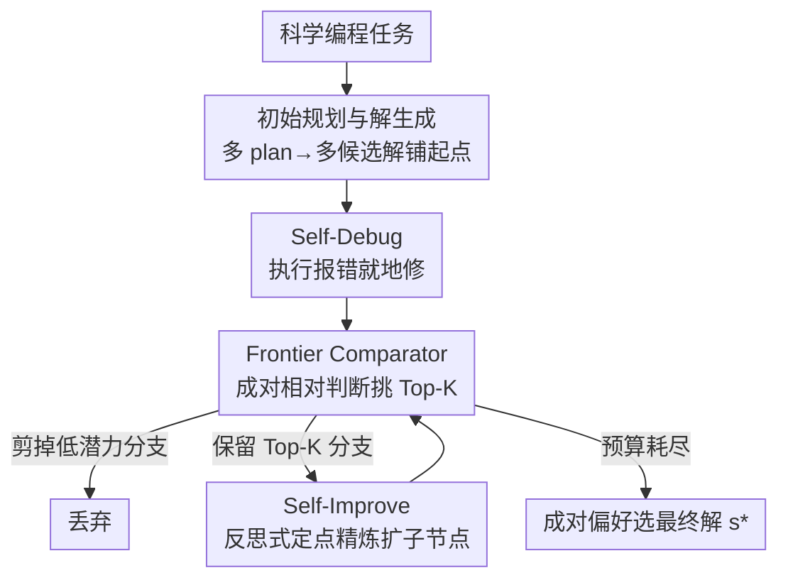

# SciNav: A General Agent Framework for Scientific Coding Tasks

**会议**: ICLR 2026  
**OpenReview**: [https://openreview.net/forum?id=8iEsrg51Fs](https://openreview.net/forum?id=8iEsrg51Fs)  
**代码**: https://github.com/OSU-NLP-Group/SciNav  
**领域**: Agent / 科学编程 / 测试时搜索  
**关键词**: 科学智能体, 树搜索, 相对判断, 测试时扩展, 代码生成

## 一句话总结
SciNav 把"成对相对判断"嵌进 Top-K 树搜索（TKCTS），让 LLM 智能体在没有预定义评测指标、搜索预算受限的现实条件下解科学编程任务——靠"两两比哪个更好"而非"给每个解打绝对分"来挑分支、剪枝、扩展，在 ScienceAgentBench 和 DA-Code 上显著超过 Self-Debug、OpenHands 等基线。

## 研究背景与动机
**领域现状**：基于 LLM 的"科学智能体"近来很火，像 Agent Laboratory、ResearchAgent、AI Scientist 这类系统想端到端自动化整个科研流程——提假设、设计实验、写报告。但它们瞄准的是开放式科学问题，产出的假设/实验方案/分析文本本质上是主观的，很难严格客观地评测，往往要靠专家评审或昂贵的人工研究来判定好坏。

**现有痛点**：与开放式问题相对的是"科学编程任务"——DSBench、DA-Code、SciCode、ScienceAgentBench 这些 benchmark 的输出是**可执行的程序**，能拿真值客观打分。但目前打这些 benchmark 的 agent 要么直接套通用智能体（OpenHands、Auto-GPT），要么是面向工程的流水线（管 Bash 环境、读写文件），本质上是"工程驱动的 pipeline"，缺一个**结构化的、能高效探索解空间的框架设计**。即便是专门做 ML 编程的 AIDE，也默认了两个现实里很难成立的前提：(i) 有明确的评测指标（如 leaderboard 准确率）让 agent 直接优化；(ii) 有巨大的探索预算（如跑 24 小时穷举）。

**核心矛盾**：现实科学任务里，不同问题需要不同的评判标准，很多标准事先根本不知道；而长时间搜索又贵得离谱。于是出现一个空白：**没有一个端到端、结构化、且能在"没有预定义指标 + 受限预算"下高质量解科学编程任务的智能体框架**。

**本文目标**：造一个在受限搜索预算下、不依赖预先给定的成功指标就能产出高质量可执行解的科学编程智能体。

**切入角度**：作者借用了一个心理测量/评测领域的稳健发现——**相对判断（比较两个输出哪个更好）比绝对打分（给单个输出打分）更可靠、判别力更强**。给绝对分时 LLM 噪声大、尺度漂移；但"把 A 当锚、问 B 比 A 好在哪/差在哪"能给出更锐利、更稳定、更贴合任务指令的信号。

**核心 idea**：用"成对相对判断"替代"绝对打分"作为树搜索的评价信号——在树搜索里反复两两比较候选解，保留 Top-K 最有潜力的分支、剪掉低潜力的，再沿保留分支扩展子节点，从而在受限预算下把算力导向高质量解。

## 方法详解

### 整体框架
SciNav 把科学推理当成"轨迹驱动"的过程：不做一锤定音的单次决策，而是同时探索多条候选解路径，靠相互比较来比较、剪枝、再精炼。整套机制叫 **Top-K Comparative Tree Search（TKCTS）**：输入是一个科学编程任务 $T$，先生成一批初始候选解 $S_0$ 放进优先队列 $Q$；之后在比较预算 $B$ 内循环——每轮选若干候选对做 LLM 成对比较、更新排名、保留 Top-K（beam size $K$）、剪掉其余、对保留分支扩展出子节点（继续 self-debug / self-improve）再塞回队列；预算耗尽后由成对偏好选出最终解 $s^\star$。

支撑这个循环的有四个相互咬合的组件：**初始规划与解生成**（broad 地铺起点）、**Self-Debug**（执行报错就地修）、**Self-Improve**（反思式迭代精炼）、**Frontier Comparator**（成对相对判断挑分支，是全框架的"导航仪"）。前三个负责"生成 + 修正"候选，最后一个负责"该留谁、该扩谁、该剪谁"。

### 关键设计

**1. Top-K 比较式树搜索（TKCTS）：用成对比较而非绝对分来导航搜索**

这是 SciNav 的骨架，针对"绝对打分噪声大、单次决策没法回溯"的痛点。它把搜索组织成一棵树：维护一个优先队列 $Q$，每轮从中选候选对 $(s_i, s_j)$，调用 $\text{COMPARE}(T, s_i, s_j)$ 让 LLM 回答"谁更好、为什么"，用结果更新队列里候选的排名，然后取 $\text{TOPK}(Q, K)$ 保留、其余 $S_{drop}$ 剪掉，对保留分支 $\text{EXPAND}$ 出子节点再 $\text{INSERT}$ 回队列；每比较一次预算 $B \leftarrow B-1$，耗尽后 $\text{SELECTFINAL}$ 返回最优解。Top-K 这个设计同时干了两件事：一是**可控回溯**——保留 K 个候选意味着当前最优路径若停滞/失败，agent 能退回到此前排名较低的候选继续探索，避免过早押注次优解；二是**控成本**——每轮只对 Top-K 做两两比较，把成对判断的开销限制住。和"一锤定音打分"或"纯工程 pipeline"相比，它把轨迹选择从一次性评分变成了系统化、迭代、可回溯的导航。

**2. Frontier Comparator：把候选解两两对照而非孤立打分**

这是 TKCTS 里最关键的评价模块，直接落实"相对判断 > 绝对打分"的核心 idea。它不给每个候选解单独打一个绝对分（那种分尺度漂移、噪声大），而是把候选解直接两两对照：给定候选池，通过迭代式成对比较挑出有潜力的分支，Top-K 保留扩展、低潜力剪掉；搜索变深后新生成的子解也进池子用同样的成对方式评。这种相对评价提供更锐利的区分、更高的稳定性、和人类偏好更贴近。每轮成对判断后，还会对优先队列里的候选跑一个排序算法更新质量序（附录 F）。它的判别力在实验里得到验证：相对判断把 SR 从绝对打分的 16.2% 提到 18.6%，且不需要任何真值信息——这正是它比依赖真值 rubric 的方案更能落地的原因。

**3. 初始规划 + 解生成：靠测试时扩展把"至少一个解接近对"的概率拉高**

针对"单次推理容易整体跑偏、没有好的起点"的痛点。作者沿用 PlanSearch、CodeMonkeys 等观察到的**测试时扩展**规律：随着生成候选解数量增加，数据集里"至少被一个候选成功解出"的题目比例近似 log-线性增长（即 Pass@K 提升）。所以 SciNav 先让 LLM 生成多个 high-level plan（并把已生成的 plan 喂回模型，避免重复出同样的 plan），再对每个 plan 各生成一段程序作为候选解，铺出一个多样化的初始候选池。消融显示初始解从 1 个增到 5 个，平均"成功初始解数"从 0.24 升到 0.98，整体成功率从 40.5% 升到 45.2%——起点越多越可能有一个接近正确，后续搜索就有据可依。

**4. Self-Debug + Self-Improve：执行反馈修错 + 反思式定点精炼**

这两者是沿保留分支"把候选越改越好"的引擎，针对"科学编程要求代码真能跑、且初版往往不完整"的痛点。Self-Debug 接入代码解释器，在树搜索过程中检测并修复 bug，让 agent 能修掉某一步的错误而不必丢掉整条轨迹。Self-Improve 则不止于修错——它让模型基于任务描述在选中的 frontier 解里找一个**具体的精炼点**去改，模拟人类逐步把粗解打磨向正确完整。消融里 Self-Improve 的作用最突出：同样 5 个初始解，开启后"成功节点平均数"从 1.14 跳到 2.69（近乎翻倍），成功率从 45.2% 升到 57.1%，是端到端成功率最大的单一驱动力。为控预算，作者把初始解设 5、最大 debug 步设 3、总探索步设 10（self-improve 在 debug 没耗尽预算时进行）。

## 实验关键数据

### 主实验
在 ScienceAgentBench（"无专家知识"设定）上，跨四个基座模型对比，SR（成功率，最重要）和 VER（有效执行率）：

| 基座模型 | 方法 | SR | VER | Cost ↓ |
|--------|------|------|------|------|
| GPT-4o (0513) | Direct Prompting | 7.50 | 42.2 | 0.011 |
| GPT-4o (0513) | OpenHands | 13.1 | 62.8 | 1.093 |
| GPT-4o (0513) | Self-Debug | 14.7 | 71.2 | 0.057 |
| GPT-4o (0513) | **SciNav** | **16.1** | 66.0 | 0.512 |
| GPT-4o (1120) | Self-Debug | 15.0 | 67.0 | 0.030 |
| GPT-4o (1120) | **SciNav** | **18.6** | **69.9** | 0.342 |
| Claude-3.7 | Self-Debug | 22.5 | 84.3 | 0.066 |
| Claude-3.7 | **SciNav** | **25.5** | 72.5 | 0.893 |
| DeepSeek-R1 | Self-Debug | 18.6 | 59.8 | 0.023 |
| DeepSeek-R1 | **SciNav** | **19.6** | **67.6** | 0.298 |

SciNav 在四个基座上 SR 都超过最强基线 Self-Debug：GPT-4o(1120) 上相对提升 24%、VER 绝对 +2.9；Claude-3.7 上 SR +3、DeepSeek-R1 上 SR +1。注意 SciNav 只跑 3 个 debug 步而 Self-Debug 跑 10 步，所以个别情况下 Self-Debug 的 VER 反而更高（如 GPT-4o 0513、Claude-3.7）。成本上 SciNav 比 Self-Debug 贵，但远低于 OpenHands 且效果更好。在 DA-Code（采样 100 题）上，SciNav 在数据操作（+29 绝对点）、统计分析（+29）、平均（+13）上明显超 Self-Debug，难任务上提升尤为突出（+23）。

### Frontier Comparator 对比
固定 GPT-4o(1120)，换不同的解选择策略：

| Frontier Comparator | SR | VER | 说明 |
|------|------|------|------|
| Random Selection | 15.2 | 64.7 | 随机挑候选 |
| LLM-Absolute | 16.2 | 69.1 | 给每个解打绝对分选最高 |
| **Relative Judgments（本文）** | **18.6** | **69.9** | 成对相对判断 |
| Rubric-Absolute (w/ GT) | 21.1 | 74.5 | 用真值 rubric，仅作上界参考 |

相对判断在不用真值的策略里 SR/VER 双高，明显超随机和绝对打分。Rubric-Absolute 最高，但它偷看了真值打分步骤，现实里拿不到详细评分标准，所以只当参考上界——这反过来印证相对判断"无需真值还能强"的实用价值。

### 消融实验
在 ScienceAgentBench 的 40 题（至少被某 agent 解出过一次）上，拆初始解数量与 Self-Improve：

| 初始解数 | Self-Improve | 成功节点均数 | 成功率 |
|------|---------|------|------|
| 1 | No | 0.40 | 40.5 |
| 2 | No | 0.57 | 40.5 |
| 5 | No | 1.14 | 45.2 |
| 5 | Yes | **2.69** | **57.1** |

### 关键发现
- **Self-Improve 是最大功臣**：在 5 个初始解下开启它，成功节点数 1.14→2.69（近翻倍）、成功率 45.2%→57.1%，说明反思式精炼能把有缺陷/不完整的初始解救活。
- **多初始解直接拉高成功率**：初始解 1→5，成功初始解均数 0.24→0.98、成功率 40.5%→45.2%，验证测试时扩展"起点多则至少一个接近对"的逻辑。
- **相对判断稳健性可迁移**：换四个差异很大的基座（强生成的 Claude、强推理的 R1）都一致超 Self-Debug，说明相对判断导航不挑模型。
- **难任务收益更大**：DA-Code 上越难的任务 SciNav 相对提升越多（hard +23），说明结构化搜索+比较在容易"一次跑偏"的复杂任务上更有用。

## 亮点与洞察
- **把"相对判断更可靠"这条评测学结论，工程化成树搜索的剪枝信号**：很多人知道成对比较比绝对打分准，但 SciNav 第一次把它系统地嵌进 Top-K 树搜索当 frontier comparator，绕开了"必须有预定义指标"的强假设，这是最让人"啊哈"的地方。
- **Top-K 一石二鸟**：保留 K 个候选既实现了可控回溯（停滞就退回较低排名解），又把成对比较的开销限制在 Top-K 内，省钱和抗局部最优一起拿。
- **面向"现实预算 + 无真值"的设定**：相比 AIDE 假设有 leaderboard 指标和 24 小时预算，SciNav 明确瞄准"指标未知、预算紧"的真实科学场景，这个问题设定本身就更接地气，可迁移到很多缺金标信号的任务。
- **可迁移 trick**：在任何"候选解打分噪声大"的 agent 选择/精炼场景（不限科学编程），都可以把绝对打分换成成对相对判断 + Top-K 队列排序，作为更稳的选择器。

## 局限与展望
- **成本仍偏高**：SciNav 比 Self-Debug、Direct Prompting 贵不少（如 0.512 vs 0.057），虽比 OpenHands 便宜，但成对比较和多候选生成本身就费 token，预算极紧时性价比要权衡。
- **VER 未必占优**：因为只跑 3 个 debug 步，部分基座上 VER 反被跑 10 步的 Self-Debug 超过，说明"执行通过率"和"任务成功率"之间作者明显偏向后者，纯求代码能跑的场景未必最优。
- **绝对数字仍低**：即便最强配置 SR 也只在 16%~25% 区间，科学编程任务整体远未解决，框架是相对改进而非绝对突破。
- **依赖 LLM 比较的可靠性**：相对判断的质量上限就是基座 LLM 的成对判断能力，若模型对某领域不熟，比较信号会失真；排序算法（附录 F）对成对噪声的鲁棒性也值得进一步分析。

## 相关工作与启发
- **vs AIDE**：AIDE 也用树搜索做 ML 编程，但默认有明确指标（leaderboard 准确率）直接优化、且预算大（24 小时穷举）；SciNav 不依赖预定义指标、靠相对判断在受限预算下导航，更适配指标未知的真实科学任务。
- **vs OpenHands / Auto-GPT**：这些通用 agent 是 ReAct 式逐步生成、工程驱动，缺结构化的解空间探索；SciNav 用 Top-K 比较树搜索做系统化探索+回溯，在 SR 上明显更高且比 OpenHands 便宜。
- **vs Self-Debug**：Self-Debug 只有单条轨迹上的自我调试，没有轨迹搜索、外部评价或排名；SciNav 在它之上加了多候选生成、相对判断选择和 Self-Improve，把"修错"扩成"探索+比较+精炼"。
- **vs 测试时扩展（PlanSearch / CodeMonkeys / SFS）**：这些工作证明多生成候选能 log-线性提升覆盖率；SciNav 在多组件复用了这一思想，并额外引入相对判断的 frontier comparator 来在搜索中选/精炼候选，不需要金标信号。

## 评分
- 新颖性: ⭐⭐⭐⭐ 把相对判断系统化嵌入 Top-K 树搜索、面向"无指标+受限预算"的科学编程设定，组合新颖。
- 实验充分度: ⭐⭐⭐⭐ 两 benchmark、四基座、frontier comparator 与组件双消融都有，但绝对 SR 偏低、成本分析可更深。
- 写作质量: ⭐⭐⭐⭐ 动机和组件交代清晰，算法伪码直观；个别 DA-Code 数字表述（%/绝对点）略含糊。
- 价值: ⭐⭐⭐⭐ 给"现实预算下、无金标信号"的科学编程智能体提供了可复用的搜索+比较范式。

<!-- RELATED:START -->

## 相关论文

- [\[ICLR 2026\] Huxley-Gödel Machine: Human-Level Coding Agent Development by an Approximation of the Optimal Self-Improving Machine](huxley-godel_machine_human-level_coding_agent_development_by_an_approximation_of.md)
- [\[ICLR 2026\] FeatureBench: Benchmarking Agentic Coding for Complex Feature Development](membership_privacy_risks_of_sharpness_aware_minimization.md)
- [\[ICLR 2026\] TaskCraft: Automated Generation of Agentic Tasks](taskcraft_automated_generation_of_agentic_tasks.md)
- [\[ICLR 2026\] TusoAI: Agentic Optimization for Scientific Methods](tusoai_agentic_optimization_for_scientific_methods.md)
- [\[ICLR 2026\] Zephyrus: An Agentic Framework for Weather Science](zephyrus_an_agentic_framework_for_weather_science.md)

<!-- RELATED:END -->
