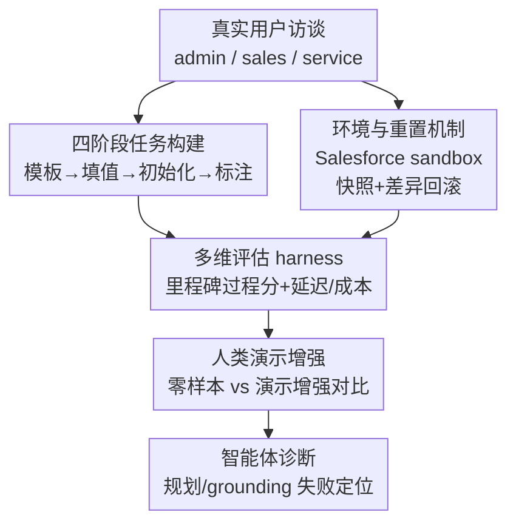

# SCUBA: Salesforce Computer Use Benchmark

**会议**: ICLR 2026  
**OpenReview**: [https://openreview.net/forum?id=bkjKnO9s7T](https://openreview.net/forum?id=bkjKnO9s7T)  
**代码**: https://github.com/SalesforceAIResearch/SCUBA  
**领域**: Agent / 计算机操作智能体 / Benchmark  
**关键词**: 计算机操作智能体, CRM 工作流, 企业软件, 过程奖励, 演示增强

## 一句话总结
SCUBA 是一个建立在真实 Salesforce sandbox 环境上的计算机操作智能体（computer-use agent）评测基准，含 300 个来自真实用户访谈的 CRM 任务，配套可重置环境、里程碑式细粒度评估和人类演示，揭示了开源/闭源模型、浏览器型/桌面型智能体之间的巨大性能鸿沟（零样本下开源模型成功率 <5%，闭源最高 39%；加演示后可达 50% 并同时降本提速）。

## 研究背景与动机

**领域现状**：视觉语言模型（VLM）正被改造成能通过图形界面（GUI）自动化复杂工作流的自主智能体。这类智能体以屏幕截图为主要输入，输出点击、输入、代码块等可执行动作，已经在 WebArena、OSWorld 等基准上展现出不错的能力。

**现有痛点**：现有基准与真实企业软件场景存在系统性脱节。WebArena/OSWorld 评测的是网页导航和通用桌面应用，抓不到企业级平台的复杂度；WorkArena 系列虽然搭在 ServiceNow 平台上，但任务局限于客服场景；CRMArena 系列虽然也搭在 Salesforce 上，却主要面向工具调用（tool-use）智能体，且任务全是信息检索——**不写、不改**环境里的数据记录和配置。换句话说，没有一个基准能真正考验智能体在企业软件里"动手干活"的能力。

**核心矛盾**：真实企业部署里，"能不能完成任务"只是其中一维，**延迟和成本同样是决定性因素**；而现有评测既不覆盖读写型任务，又只给 0/1 成功信号，无法定位智能体到底卡在哪一步，也无法衡量它的效率代价。

**本文目标**：构建一个既真实、又可解释、还高效的企业级 CRM 工作流评测基准，覆盖 UI 导航、数据操作、工作流自动化、信息检索、故障排查五类企业关键能力，并把延迟、成本、里程碑进度都纳入度量。

**切入角度**：作者直接采用 Salesforce 官方提供的 sandbox developer org——它的 UI 与生产环境完全一致，免费档功能足以支撑全部任务，从而保证"真实性"；同时用快照+差异回滚的方式解决企业环境难以重置的问题。

**核心 idea**：用真实访谈驱动的读写型任务 + 规则化里程碑评估器 + 人类演示，搭一个"既像真业务、又能细粒度诊断、还跑得快"的计算机操作智能体竞技场。

## 方法详解

### 整体框架

SCUBA 本质是"环境 + 任务 + 评估"三件套，外加一条把用户访谈变成可评测任务的构建流水线。环境是一个可并行、可按任务级重置的 Salesforce sandbox；任务是 300 个分布在管理员（admin，57%）、销售（sales，25%）、客服（service，18%）三类人物画像上的实例，每个任务都配一份初始化脚本和一套规则化评估器；评估器不仅给二元成功分，还给里程碑过程分（process reward）和延迟/成本度量。任务本身由一条四阶段流水线产出：从访谈抽模板 → 填值生成查询 → 准备初始化与评估器 → 人工标注质检。

### 关键设计

**1. 环境与重置机制：用快照+差异回滚把企业 sandbox 变成可大规模评测的环境**

真实性要求逼着作者放弃合成网站、改用 Salesforce sandbox developer org，但这带来一个棘手问题：像 WebArena/OSWorld 那样靠重启 Docker 容器来重置环境的办法在这里行不通——把一个 Salesforce org 重置回初始状态等价于重新创建一个 org，代价高到无法支撑大规模评测。作者的解法是给 org 的初始状态拍快照（下载一组配置文件），智能体跑完一轮后，把修改后的状态与初始状态做差异比对，**只回滚被改动的那部分配置文件**。由于每个任务预期会改动哪些配置是已知的，所以重置可以做到**任务级**精度，而不必整体重建。配合可并行的基础设施（按需起多个 headless 浏览器会话或多个 Docker 桌面容器），大量智能体可以被分配到各自专属环境里异步评测，全量评估能在 90 分钟内跑完。环境同时支持截图、可访问性树（accessibility tree）、扁平化 DOM 字符串三种观测，以及 Playwright 和 PyAutoGUI 的全部原子动作。

**2. 四阶段任务构建：让访谈里的真实工作流变成可复现、可评测、难度可控的任务**

任务不是凭空编的，而是从对真实 Salesforce 用户（方案工程师、org 管理员、销售代表、客户经理等）的访谈里提炼出来，再经四阶段流水线落地。**阶段一（模板创建）**：每个工作流抽象成一个带占位符的任务模板（如"为 {object name} 对象配置组织级默认可见性……"），每个模板挂一篇 Trailhead 知识文章，并按 UI 操作复杂度和所需独特能力打上 easy/medium/hard 难度标签。**阶段二（查询生成）**：每个模板填入不同取值生成 5 条查询，刻意让同模板的查询在难度上有差异（比如一条需要额外滚动或按字母检索定位目标，另一条需要记住更多已取消勾选的复选框），再用 GPT-5 改写以贴近真实人类措辞、增加语言多样性，最后两位作者人工校验。**阶段三（初始化与评估）**：多数任务有前置条件（合成上传依赖数据、开启 org 设置授予权限等），作者用 Salesforce 的 Metadata API、Tooling API 为每个查询手工编写评估方法。**阶段四（人工标注）**：所有实例送内部标注团队，既做质量控制（确保人类能完成、评估器结果与人类预期一致），又顺带产出可用于提升智能体表现的标注轨迹。最终得到 300 个实例（60 个模板）。

**3. 多维评估 harness：用里程碑过程分把"失败"拆成"哪一步失败"**

企业场景下只给 0/1 成功分远远不够——一个任务可能完成了 80% 却仍判 0 分，看不出问题在哪。SCUBA 的每个任务都配一个规则化评估器，除了二元成功分外，还给出**里程碑分（milestone score，即过程奖励 process reward）**：把任务拆成若干带权重的里程碑（rubric），逐项判定是否达成。例如一个"建队列并加成员"的任务拆成"建出正确名称的队列（权重 0.3）/ 队列绑定正确对象类型（0.2）/ 发出邮件通知（0.25）/ 加入指定成员（0.25）"四个里程碑，若智能体完成前三项但漏了成员，则里程碑分为 0.75 且明确指出失败原因。这套机制让评估器不仅判成败，还能定位智能体具体卡在任务的哪个环节。此外评估器还同步给出延迟（time）、步数（steps）、token 消耗、成本（cost）等效率度量，呼应了"企业部署里延迟和成本同样决定性"的诉求。

**4. 人类演示增强：把 Trailhead 式教程当"岗前培训"喂给智能体**

作者观察到智能体在企业平台上失败，很大程度源于缺乏对 Salesforce UI 设计和功能的领域知识——就像真人也需要培训才会用。于是 SCUBA 随基准附带知识文章和人类演示轨迹，构造出**演示增强（demonstration-augmented）**设置：把任务查询与同类/同一任务的人类演示拼在一起喂给智能体，与只给查询的**零样本（zero-shot）**设置对照。这套演示对多数智能体能同时提升成功率、降低耗时/步数/token/成本，是论文最重要的实证发现之一；但也存在例外（如 UI-TARS-1.5-7B、OpenCUA-7B 无法有效利用演示，成功率涨了但其他指标也涨）。

## 实验关键数据

测试覆盖两类智能体共 9~11 个：**浏览器型（Browser-Use）** 用 SOM（Set-of-Mark，给截图上交互元素打数字框）+ DOM 文本作观测、19 个动作，backbone 为 GPT-5/o3/Claude-4-sonnet/Gemini-2.5-pro；**桌面型（Computer-Use）** 仅用整屏截图、15 个动作，含 UI-TARS-1.5-7B、OpenCUA-7B、GUI-Owl-7B、OpenAI-CUA、Claude-4-sonnet(computer)、Agent-S2.5、MobileAgentV3。最大步数 50、单任务最长 90 分钟、分辨率 1920×1080、温度 1.0。

### 主实验（零样本设置）

| 智能体 | 类型 | 里程碑分 ↑ | 成功率 ↑ | 时间(min) ↓ | 成本($) ↓ |
|--------|------|-----------|---------|------------|----------|
| GPT-5 | Browser-Use | 0.73 | 51.33% | 19.31 | 0.55 |
| o3 | Browser-Use | 0.65 | 45.67% | 21.37 | 0.56 |
| Agent-S2.5 (w/GPT-5) | 桌面型框架 | 0.58 | 39.00% | 25.13 | 1.17 |
| Claude-4-sonnet | Browser-Use | 0.56 | 34.67% | 11.25 | 1.16 |
| Gemini-2.5-Pro | Browser-Use | 0.47 | 31.00% | 7.27 | 0.24 |
| Claude-4-sonnet(computer) | Computer-Use | 0.48 | 27.00% | 8.02 | 1.44 |
| OpenAI-CUA | Computer-Use | 0.29 | 16.00% | 5.80 | 0.59 |
| MobileAgentV3 | Computer-Use | 0.11 | 3.10% | 21.47 | 1.17 |
| UI-TARS-1.5-7B | Computer-Use | 0.10 | 2.67% | 6.14 | - |
| GUI-Owl-7B | Computer-Use | 0.05 | 1.00% | 12.96 | - |
| OpenCUA-7B | Computer-Use | 0.05 | 0.67% | 20.48 | - |

可以看到：在 OSWorld 上表现不错的开源桌面型智能体（UI-TARS、OpenCUA、GUI-Owl）在 SCUBA 上成功率几乎归零（<5%），而闭源 backbone 的方法最高能到 39%（Agent-S2.5）甚至 51%（浏览器型 GPT-5）。

### 演示增强 vs 零样本（成功率对比）

| 智能体 | 零样本成功率 | 演示增强成功率 | 时间变化 |
|--------|------------|--------------|---------|
| GPT-5 (BU) | 51.33% | 53.85% | 19.31 → 17.76 |
| o3 (BU) | 45.67% | 50.00% | 21.37 → 17.05 |
| Gemini-2.5-Pro (BU) | 31.00% | 46.15% | 7.27 → 10.02 |
| Claude-4-sonnet(computer) | 27.00% | 47.69% | 8.02 → 7.33 |
| OpenAI-CUA | 16.00% | 28.85% | 5.80 → 5.29 |
| UI-TARS-1.5-7B | 2.67% | 9.16% | 6.14 → 6.52 |

摘要中"成功率可提升到 50%、同时降本 16%/提速 13%"即来自此设置：演示几乎全面提升成功率并普遍降低耗时与成本。

### 关键发现
- **观测/动作空间设计 > 专用训练**：浏览器型智能体（SOM+DOM）凭借更丰富的观测、更高效的动作空间，加上 foundation VLM 更强的规划能力，整体超过专门训练的桌面型智能体——但代价是浏览器型需要对 Salesforce 平台做大量 DOM parser 定制（原生 parser 会漏检元素，导致许多任务直接不可行）。
- **泛化是桌面型的硬伤**：从 OSWorld 迁到 SCUBA（无演示）时，桌面型智能体成功率断崖式下跌——OpenCUA-7B 跌 97.6%、GUI-Owl-7B 跌 96.9%、UI-TARS 跌 90.1%、Agent-S2.5 跌 27.8%。失败主因是**规划（planning）和 grounding（坐标定位）**：规划问题可部分靠演示缓解（这也是成功率提升的主要来源），但 grounding 问题（预测错交互元素坐标）依然顽固，作者建议用多次预测+多数投票来改善。
- **没有免费午餐**：Gemini-2.5-pro（演示增强）在成功率、延迟、成本三者间取得最佳平衡；闭源/开源模型之间存在实质性鸿沟。

## 亮点与洞察
- **任务级差异回滚**是真正落地企业 sandbox 评测的关键工程巧思：不靠重建环境、而是"快照→比对→只回滚改动项"，把不可承受的重置成本压到可大规模并行的程度，这个思路可迁移到任何"重置代价高、但改动范围可知"的有状态环境评测。
- **里程碑过程分**把黑盒成败变成可诊断的进度条，让基准从"打分"升级为"体检"——能告诉你智能体在 31 步、跨 8 个页面的长任务里到底哪一环掉链子，这对企业部署的可信度评估极有价值。
- **演示=岗前培训**的类比很自然地把"非结构化教程/文档如何提升智能体"这个开放问题摆上台面：当结构化人类演示不总是可得时，如何更高效利用 Trailhead 这类教程是后续方向。

## 局限与展望
- **评估器只查终态、不查过程安全**：和 OSWorld 一样只比对环境最终状态是否匹配，无法检测智能体是否"偷偷"修改/删除了任务无关的数据。理想做法是比对运行前后完整环境状态，但 Salesforce 状态文件巨大、下载会耗尽每日 API 配额，不可行；作者只能靠标注员抽查+任务级特定检查打补丁，承认这既不可扩展也不全面。
- **只覆盖企业工作流的子集**：真实企业流程常跨多平台（如 HubSpot 找线索 → LinkedIn Sales Navigator 确认决策人 → Salesforce 管理线索），即便只在 Salesforce 内部，线索评分、AI 洞察等任务也因属付费功能或无免费 sandbox 而被排除。
- 自己的观察：300 实例来自 60 个模板（每模板 5 条查询），同模板查询共享结构，模板级多样性其实有限；且评估高度依赖手工编写的规则评估器，扩展到新任务/新平台的人力成本不低。

## 相关工作与启发
- **vs WebArena / OSWorld**：它们评测通用网页导航和桌面应用，靠重启容器重置；SCUBA 聚焦企业级 CRM、用快照差异回滚做任务级重置，且任务是读写型而非纯导航。
- **vs WorkArena 系列**：同为生产级 sandbox（ServiceNow），但 WorkArena 任务局限客服场景；SCUBA 覆盖 admin/sales/service 三类画像，且含 60 个模板的读写任务。
- **vs CRMArena 系列**：同搭 Salesforce 平台，但 CRMArena 面向工具调用智能体、任务全是信息检索（不写不改数据）；SCUBA 面向计算机操作智能体、任务真正写入/修改环境，并提供过程奖励和人工标注，是表 1 里唯一同时满足"读写任务+过程奖励+人工标注+超出客服场景"四项的基准。

## 评分
- 新颖性: ⭐⭐⭐⭐ 首个面向 Salesforce 读写型 CRM 工作流的计算机操作智能体基准，任务级差异回滚和里程碑评估是实打实的工程创新。
- 实验充分度: ⭐⭐⭐⭐⭐ 9~11 个智能体 × 两种设置全面对比，含 OSWorld→SCUBA 泛化掉点、成本/延迟权衡等多维分析。
- 写作质量: ⭐⭐⭐⭐ 动机清晰、表 1 定位精准，工程细节（重置/并行/评估）交代充分。
- 价值: ⭐⭐⭐⭐⭐ 直指企业软件自动化落地的真实痛点，可解释评估与演示增强对工业界很有参考价值。

<!-- RELATED:START -->

## 相关论文

- [\[ICLR 2026\] VideoAgentTrek: Computer Use Pretraining from Unlabeled Videos](videoagenttrek_computer-use_pretraining_from_unlabeled_videos.md)
- [\[ICLR 2026\] R-WoM: Retrieval-augmented World Model for Computer-use Agents](r-wom_retrieval-augmented_world_model_for_computer-use_agents.md)
- [\[ICLR 2026\] Efficient Agent Training for Computer Use](efficient_agent_training_for_computer_use.md)
- [\[ICLR 2026\] OSWorld-MCP: Benchmarking MCP Tool Invocation in Computer-Use Agents](osworld-mcp_benchmarking_mcp_tool_invocation_in_computer-use_agents.md)
- [\[ICLR 2026\] Grounding Computer Use Agents on Human Demonstrations](grounding_computer_use_agents_on_human_demonstrations.md)

<!-- RELATED:END -->
