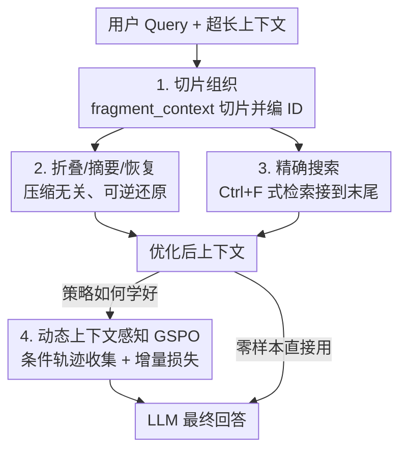

# Sculptor: Empowering LLMs with Cognitive Agency via Active Context Management

**会议**: ICLR 2026  
**OpenReview**: [https://openreview.net/forum?id=HPeiH7da0Z](https://openreview.net/forum?id=HPeiH7da0Z)  
**代码**: 待确认  
**领域**: LLM Agent / 长上下文 / 工作记忆管理  
**关键词**: 主动上下文管理, 前摄干扰, 长上下文, 工具调用, 强化学习

## 一句话总结
本文提出 Sculptor 框架，给 LLM 配上一套可逆的「主动上下文管理（ACM）」工具——切片、折叠/摘要/恢复、精确搜索，让模型像雕刻家一样主动剔除无关信息、聚焦关键内容，再配合一种针对动态上下文设计的 GSPO 强化学习方法，在多个长上下文 benchmark 上把 13B 模型的平均分从 39.4 拉到 73.8。

## 研究背景与动机
**领域现状**：处理长上下文的主流做法要么是扩大上下文窗口，要么是引入外部记忆系统（RAG、Mem0、MemAgent 等）来扩充模型能访问的信息量。这些方法都在「让模型能看到更多」上发力。

**现有痛点**：单纯把窗口拉长会暴露出位置偏置（lost in the middle）、信息过载和干扰问题；外部记忆系统虽然能存更多信息，却不解决一个根本问题——**前摄干扰（proactive interference）**，即上下文中较早出现的、已经过时或无关的信息会持续干扰后续推理与记忆检索。更糟的是，RAG/记忆类方法做的是**不可逆**的过滤：它们只依据最终 query 做一次性筛选，一旦丢弃了「初看无关、后来才关键」的信息就无法找回，这在多跳推理里是致命的。

**核心矛盾**：信息容量（capacity）和信息整理（curation）是两回事。现有方法只顾扩容量，却没给模型「主动整理自己工作记忆」的能力——而人类专家恰恰是靠选择性注意、归纳要点、暂时搁置次要细节、需要时再翻回来，才能在复杂任务里保持专注。当前 LLM 缺的就是这种认知能动性。

**本文目标**：不靠堆 token 窗口，而是让 LLM 能够主动塑造自己的**内部工作记忆**（即注意力实际运作、推理实际发生的当下上下文），从而（1）抑制前摄干扰，（2）在零训练和训练两种设定下都能用上，（3）保证整理过程完全可逆、不永久丢信息。

**切入角度**：作者把「上下文」类比成一块大理石，LLM 是雕刻家——通过选择性地「移除材料」露出想要的形状。这个过程称为 Active Context Management（ACM）。关键观察是：现代 LLM 本身已经具备很强的工具调用与指令跟随能力，所以可以直接把上下文操作封装成工具交给模型自己决定何时用。

**核心 idea**：给 LLM 一套**确定性、可逆、不改变消息数量与顺序**的上下文操作工具（切片/折叠/摘要/恢复/搜索），让它在单轮对话内多步调用这些工具主动管理工作记忆；再设计一套适配「上下文会被工具改变」这一非单调特性的 RL 训练方法把策略学好。

## 方法详解

### 整体框架
Sculptor 的运作可以分成三层：**工具设计原则**（定下工具该长什么样）→ **Sculptor 工具套件**（三类共六个工具）→ **教模型用工具**（零样本提示 + 动态上下文感知的 GSPO 强化学习）。运行时，模型在单轮内接收用户消息后进行多步工具调用：先用 `fragment_context` 把超长对话切成带唯一 ID 的片段，再按需对这些片段做折叠/摘要以压缩无关内容，或用精确搜索把埋在中段的信息捞到末尾，反复操作直到生成最终回答。整个过程是「过载上下文 → 主动管理 → 优化后上下文」的转换，且任何修改都可逆。

### 关键设计

**1. 四条工具设计原则：把上下文操作做成可被 RL 训练的「干净算子」**

这一组工具不是随手设计的，而是为了「既能让模型零样本就会用，又能稳定地被强化学习训练」而立的四条铁律。其一**确定性、自包含**：每个工具都是不依赖外部组件（如 embedding 模型）的确定性算子，部署稳定，且能把模型的「认知能动性」隔离出来做纯粹评估——搜索用的是精确匹配而非语义检索，正是为了把语义理解留给 LLM 自己。其二**认知对齐**：工具刻意模仿人类有效策略，`search_context` 就是「Ctrl+F」式的精确匹配，计算开销小。其三**结构保持**：工具被严格约束**绝不改变消息的数量与顺序**，从而维持一个稳定的状态表示——这是 RL 里可处理「信用分配（credit assignment）」的关键前提。其四**可逆与优雅降级**：所有改上下文的操作都是非破坏、完全可逆的（`fold` 用 `expand` 撤销），保证框架是基线模型能力的**严格超集**——若一个工具都不调用，模型行为与原始未修改状态完全一致。这四条共同保证了 ACM 不会因为「乱改上下文」把训练带崩。

**2. 三类六个工具：可逆地切片、折叠、检索**

工具套件按功能分三类、共六个，在单轮内协同工作。**① 上下文切片**由 `fragment_context` 完成，用起止标记把长对话切成可管理的片段，每段得到一个 6 字符唯一 ID，供后续操作引用。**② 压缩与恢复**由三个互补工具组成：`summarize_fragment` 按用户指定的关注点（如技术细节、关键决策、待办项）对某片段生成聚焦摘要、压缩内容但保留要点；`fold_fragment` 暂时隐藏片段内容、只显示一个折叠标记以大幅减少视觉杂乱；`restore_fragment` 提供统一的还原能力，把摘要过或折叠过的片段恢复成原文，确保信息不会被永久丢失。**③ 精确搜索与检索**由两个工具完成：`search_context` 在用户消息、助手回复或全部内容里做精确关键词匹配（对标 Ctrl+F），最多返回 50 条匹配并可配置上下文窗口；`get_search_detail` 围绕某条搜索结果取更长的上下文。关键技巧是：搜索结果被**追加到对话历史末尾**，从而缓解「lost in the middle」——把埋在中段的信息搬到模型最容易注意的位置。

**3. 动态上下文感知的 GSPO：解决「上下文被自己改写」带来的信用分配难题**

光有工具还不够，要让模型自主学会高效策略就得训练，但这里有个传统多步 RL 处理不了的麻烦：常规多步 RL 假设每条轨迹 $\tau_t$ 是 $\tau_{t+1}$ 的前缀，因此只在最终轨迹上训练即可；但 ACM 工具会**主动删改信息**，导致 $c_t \not\subset c_{t+1}$——上下文状态发生分叉，前缀假设不成立。本文以 GSPO（Group Sequence Policy Optimization）为骨架，它在序列级做重要性比与优化，适合长上下文下的稳定训练：对 query $x$ 与一组采样轨迹，目标为 $J_{\mathrm{GSPO}}(\theta)=\mathbb{E}_{x\sim D}\big[\frac{1}{G}\sum_i \min(s_i(\theta)\hat{A}_i,\ \mathrm{clip}(s_i(\theta),1-\varepsilon,1+\varepsilon)\hat{A}_i)\big]$，其中序列级重要性比 $s_i(\theta)=\big(\pi_\theta(\tau_i|x)/\pi_{\theta_{old}}(\tau_i|x)\big)^{1/|\tau_i|}$，优势用组内归一化 $\hat{A}_i=(r-\mathrm{mean})/\mathrm{std}$。

在此之上，作者提出**条件轨迹收集（Conditional Trajectory Collection）+ 增量损失分配（Incremental Loss Assignment）**两件套。每当一次工具调用改变了上下文，就以该「改写步」为界切出一个新的训练实例（如 D1、D2），最终 reward 传播到同一 rollout 内的所有子轨迹；训练时**只对新产生的 completion 计损失（loss=1），对此前已学过的 completion 做 mask（loss=0）**。这样每次工具调用在所有 completion 中**恰好只收到一次梯度信号**，既避免重复学习，又防止模型学到「改写工具反复自触发」的虚假模式导致训练崩溃。值得注意的是，这套方法对 SFT 和 RL 同样适用，给动态上下文训练提供了统一框架。

### 损失函数 / 训练策略
训练分两段：先用 Claude-4-Sonnet 配精心设计的任务专属提示，在 BABILong 和 GSM-Infinite 上采集成功的工具使用轨迹，结合条件轨迹收集 + 增量损失做 **SFT** 得到 Sculptor-M3（学会基础 ACM 工具能力）；再在同样的数据上用 **动态上下文感知 GSPO** 做 RL，得到 Sculptor-M3-RL（自主发现最优工具策略）。训练时每轮工具步数上限设为 20，与 Claude-4-Sonnet 零样本的有效用量对齐，同时保证 rollout 效率。

## 实验关键数据

### 主实验
评测覆盖五个长上下文 benchmark：PI-LLM（前摄干扰）、NeedleBench 多针推理、MRCR（多轮共指）、LongBenchV2、FRAMES。下表为 13B 自研基座 M3 与开源 MoE 模型 GLM-4.5-air 的归一化平均分对比（M3 为无工具基线，Sculptor-* 加工具，-RL 进一步 GSPO 训练）：

| 方法 | PI-LLM | NeedleBench-M-RS | MRCR | LongBenchV2 | FRAMES | 平均 |
|------|--------|------------------|------|-------------|--------|------|
| M3（基线） | 22.5 | 30.0 | 46.3 | 33.0 | 65.2 | 39.4 |
| M3 + RAG(BM25) | 17.9 | 12.5 | 6.6 | 25.8 | 33.6 | 19.3 |
| M3 + Mem0 | 39.2 | 19.0 | 9.2 | 29.0 | 52.8 | 29.8 |
| M3 + MemAgent | 41.5 | 24.0 | 22.1 | 29.6 | 61.5 | 35.7 |
| **Sculptor-M3** | 71.8 | 67.6 | 79.1 | 29.2 | 51.2 | 59.8 |
| **Sculptor-M3-RL** | **99.4** | **84.8** | **85.7** | 34.5 | 64.6 | **73.8** |
| GLM-4.5-air（基线） | 29.4 | 24.5 | 43.1 | 46.9 | 76.0 | 44.0 |
| **Sculptor-GLM-4.5-air-RL** | 86.0 | 84.0 | **99.0** | 50.7 | 79.2 | **79.8** |

关键信号：**只有 Sculptor + RL 这条路线能持平或超越全注意力基线**，而所有传统方法（RAG/Mem0/MemAgent）平均分都**低于各自基线**——因为它们做的是不可逆过滤，丢掉了「事后才发现关键」的信息。Sculptor-M3-RL 把 M3 从 39.4 抬到 73.8，GLM-4.5-air 从 44.0 抬到 79.8。

前沿模型零样本（带任务专属提示）结果（NeedleBench-M-RS / PI-LLM 平均）：

| 模型 | NeedleBench Avg | ∆ | PI-LLM Avg | ∆ |
|------|-----------------|-----|------------|-----|
| Claude-4-Sonnet | 67.0 → 94.0 | +27.0 | 84.04 → 89.94 | +5.90 |
| GPT-4.1 | 48.0 → 71.0 | +23.0 | 73.29 → 79.87 | +6.58 |
| DeepSeek-V3 | 50.0 → 58.0 | +8.0 | 57.39 → 57.27 | −0.12 |

### 消融实验

| 配置 | 平均(M3) | 说明 |
|------|---------|------|
| M3 基线 | 39.4 | 无工具，全注意力 |
| Sculptor-M3（仅 SFT） | 59.8 | 加工具 + ACM 数据微调，已 +20.4 |
| Sculptor-M3-RL | 73.8 | 再加动态上下文 GSPO，又 +14.0 |

另外提示工程的对照（Claude-4-Sonnet，图 3）显示：统一通用提示下工具选择很差（PI-LLM 90.7% 调用都堆在搜索上、耗尽预算），换成任务专属提示后 PI-LLM 从「搜索为主」转向「先切片再折叠」（fold 调用从少量升到 1206 次），NeedleBench 搜索从 77 升到 206 次——平均分 PI-LLM 72→89.9、NeedleBench 74→94.0。

### 关键发现
- **RL 贡献明确**：仅 SFT 已把 M3 平均分 +20.4，再叠加动态上下文 GSPO 又 +14.0，说明「教会用工具」和「学会高效策略」是两段独立的收益。
- **可逆性是胜负手**：RAG/MemAgent 在多数 benchmark 上反而拖累基线，根因是基于最终 query 的一次性不可逆过滤；Sculptor 折叠后仍可恢复，所以能保住信息可达性。
- **注意力分析证实机制**：在 PI-LLM 的 46 个关键 KV 对上，折叠无关内容后，模型对关键值的注意力 93.5%（43/46）上升、平均提升 9.9%，说明显式移除干扰确实增强了注意力聚焦——并非「注意力天生会忽略无关信息」。
- **显著省 token**：在 NeedleBench/PI-LLM/MRCR 上平均上下文长度下降 81.4%（如 PI-LLM 72.4K→8.0K，−89.0%），说明主动管理在提升性能的同时还降本。
- **越难提升越大**：NeedleBench 针数从 2 增到 5，Sculptor-Claude 相对基线提升从 +23% 一路升到 +80%，干扰越强、主动整理的价值越突出；但 DeepSeek-V3 在 PI-LLM 上 −0.12，说明收益依赖模型本身的工具使用能力。

## 亮点与洞察
- **把「上下文管理」变成模型自己的动作**：以往长上下文工作要么改架构要么外挂记忆，本文换了个视角——把上下文整理封装成可逆工具交给模型在推理时自主调用，理念上从「被动处理越来越长的上下文」转向「主动 curation」。
- **可逆性 + 结构保持是为 RL 量身定做的**：「绝不改变消息数量与顺序」「fold 可被 expand 撤销」这两条看似工程约束，实则是为了让信用分配可处理、让框架成为基线的严格超集——设计动机非常具体。
- **条件轨迹收集 + 增量损失**优雅地解决了「上下文被工具改写后前缀假设失效」的训练难题，每个工具调用只收一次梯度，避免自触发崩溃，且 SFT/RL 通用，这套思路可迁移到任何「智能体会改写自身历史」的训练场景。
- **折叠提升注意力**的量化分析很有说服力，把「显式删干扰 > 指望注意力自己学会忽略」用 token 级证据钉死。

## 局限与展望
- 作者承认零样本设定高度依赖任务专属提示工程（统一提示下工具选择很差），需要人工设计 prompt，这正是引入 RL 的动机，但也说明免训练版本的鲁棒性有限。
- DeepSeek-V3 在 PI-LLM 上零样本几乎无收益甚至微降，说明 ACM 工具的效果强烈依赖底座模型自身的工具调用与指令跟随能力，对弱工具能力的模型不一定奏效。
- 搜索采用精确匹配（Ctrl+F），刻意回避语义检索以保持确定性，但这可能在需要语义近似召回的任务上成为短板，作者把语义理解的担子全压给了 LLM 自身推理。
- 评测的长上下文 benchmark 仍偏合成/检索类（PI-LLM、NeedleBench、MRCR），在更开放的真实长文档推理上的泛化性还需更多验证；定位在单轮工作记忆，跨会话持久记忆仍需外部系统互补。

## 相关工作与启发
- **vs 外部记忆系统（Mem0 / MemAgent）**：它们面向跨会话持久化或外部存储，做的是不可逆的信息筛选；Sculptor 聚焦单会话内部工作记忆且完全可逆，因此能保住「事后才关键」的信息。本文把二者定位为互补而非替代。
- **vs RAG（BM25 / 稠密检索）**：RAG 基于最终 query 一次性检索、引入信息损失，实验里平均分大幅低于全注意力基线；Sculptor 折叠后可恢复，维持信息可达性。
- **vs 上下文压缩方法**：压缩类工作证明前景化关键信息能同时提精度、降成本；Sculptor 进一步把「压缩与否、压缩什么」交给模型在推理中动态决定，并保留还原能力。
- **vs 单纯扩窗口**：呼应「显式上下文控制 > 单纯更大 token 窗口」的核心主张，把鲁棒性的关键从容量转向能动性。

## 评分
- 新颖性: ⭐⭐⭐⭐⭐ 「把上下文管理做成可逆工具 + 为动态上下文专门设计 RL 信用分配」是少见且自洽的组合。
- 实验充分度: ⭐⭐⭐⭐⭐ 五 benchmark、两类底座、零样本/SFT/RL 多设定，含注意力级与成本级分析。
- 写作质量: ⭐⭐⭐⭐ 雕刻家类比贯穿，机制讲得清楚，部分细节（工具命名 summary_by_id vs summarize_fragment）略有出入。
- 价值: ⭐⭐⭐⭐⭐ 提供了一条「不堆 token、靠主动整理」的长上下文鲁棒性新路径，且能省 80%+ 上下文 token。

<!-- RELATED:START -->

## 相关论文

- [\[ICLR 2026\] Empowering LLM Tool Invocation with Tool-call Reward Model](empowering_llm_tool_invocation_with_tool-call_reward_model.md)
- [\[CVPR 2026\] ReFAct: Empowering Multimodal Web Agents with Visual and Context Focusing](../../CVPR2026/llm_agent/refact_empowering_multimodal_web_agents_with_visual_and_context_focusing.md)
- [\[AAAI 2026\] Verification-Guided Context Optimization for Tool Calling via Hierarchical LLMs-as-editors](../../AAAI2026/llm_agent/verification-guided_context_optimization_for_tool_calling_via_hierarchical_llms-.md)
- [\[ICML 2026\] Internalizing Agency from Reflective Experience](../../ICML2026/llm_agent/internalizing_agency_from_reflective_experience.md)
- [\[ICLR 2026\] Web-CogReasoner: Towards Multimodal Knowledge-Induced Cognitive Reasoning for Web Agents](web-cogreasoner_towards_multimodal_knowledge-induced_cognitive_reasoning_for_web.md)

<!-- RELATED:END -->
