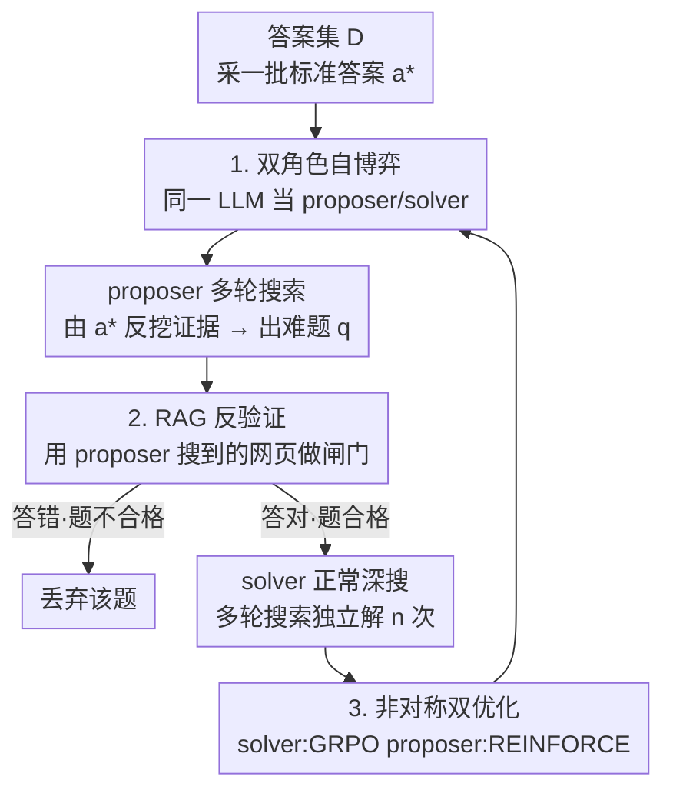

# Search Self-Play: Pushing the Frontier of Agent Capability without Supervision

**会议**: ICLR 2026  
**OpenReview**: [https://openreview.net/forum?id=ZmGirmNJqE](https://openreview.net/forum?id=ZmGirmNJqE)  
**代码**: https://github.com/Qwen-Applications/SSP  
**领域**: Agent / 强化学习 / 深度搜索  
**关键词**: 自博弈, 深度搜索智能体, RLVR, RAG 验证, 无监督训练

## 一句话总结
让同一个 LLM 同时扮演"出题人"和"答题人"在深度搜索任务上自我对弈：出题人造越来越难、但有可验证标准答案的搜索问题，答题人去解，再用出题人搜到的网页做 RAG 反向验证问题是否站得住脚——整套流程不需要任何人工标注，就能在七个 QA benchmark 上把搜索智能体的性能全面拉高（Qwen2.5-7B-Base 平均 +26.4 分）。

## 研究背景与动机
**领域现状**：训练 LLM 智能体（尤其是会多轮调用搜索引擎的"深度搜索智能体"）目前的主流范式是 RLVR（Reinforcement Learning with Verifiable Rewards）——给每个任务配一个标准答案，智能体多轮探索后只看最终答案对不对来发奖励。这避开了对中间轨迹做人工标注的麻烦，是 Search-R1、ZeroSearch、R-Search 这类开源工作的共同底座。

**现有痛点**：RLVR 的瓶颈从"标轨迹"变成了"标问题+答案"。它依然需要海量"精心设计、答案可验证"的 query-answer 对才能 scale，而 agentic 场景下不同工具集的轨迹互不通用，人工出题成本极高。后来有人做 query-synthesis（自动合成问题），但合成是**离线**的：每个合成 QA 对都得严格校验答案正确性与逻辑一致性，扩展性受限；更关键的是离线合成无法在训练中**动态调节难度**，造出来的题要么太简单（没梯度）要么太难（无法验证）。

**核心矛盾**：要无监督地持续供给"难度适配、答案可信"的训练任务，与离线合成"难度不可控、验证成本高"之间存在根本冲突。AlphaGo Zero 式的自博弈本是天然解药——靠自己跟自己下棋无限自我提升、不需外部监督——但自博弈在 LLM 上只用于推理/对齐/安全，**从未被搬到需要调用外部工具的 agentic 场景**，因为以往自博弈出题人只能用 LLM 的内部知识，造不出需要外部检索才能答的题，也无法保证答案正确。

**本文目标**：设计一个深度搜索场景下的自博弈机制，要同时解决三件事——(1) 出题人能造出有明确可验证标准答案的搜索题；(2) 题目难度随答题人水平自适应上升；(3) 全程零人工监督。

**核心 idea**：用一个 **Search Self-Play（SSP）** 博弈替代离线合成：同一个 LLM 交替当 proposer 和 solver，靠"既竞争又合作"自我进化——竞争来自 proposer 想难住 solver 的零和对抗，合作来自一道"RAG 反验证"约束逼着 proposer 只能出真正答得出的题。

## 方法详解

### 整体框架
SSP 把深度搜索智能体的训练建模成一个**带验证约束的零和对抗博弈**。输入是一个预定义答案集 $D$（只要纯答案，不要问题），输出是一个被持续强化、搜索能力越来越强的 LLM 策略 $\pi_\theta$。同一套参数 $\pi_\theta$ 用两套不同 system prompt（$x_{\text{propose}}$ / $x_{\text{solve}}$）切换出两个角色。

一轮训练里数据这样流转：从 $D$ 采一批标准答案 $a^*$ → **proposer** 拿到 $a^*$，多轮调搜索工具去"反向挖掘"支撑这个答案的隐含事实证据，然后生成一道难题 $q$（注意它知道答案、要把答案藏进一道需要多跳推理的题里）→ 把这道题先送进**RAG 反验证**这道闸门：收集 proposer 整条轨迹里搜到的所有网页 $O_T$ 当 RAG 材料，让 solver **不准搜索**、只靠这些材料作答，答对了才说明"这题答案唯一、证据充分、不是瞎编"，放行；答错则丢弃 → 通过验证的题再交给 **solver** 按正常深度搜索流程（多轮搜索+推理）独立去解 $n$ 次 → 用 solver 的成败同时给两个角色发奖：solver 答对得正奖、proposer 在 solver 答错时得正奖（min-max 对抗）。

### 关键设计

**1. 双角色自博弈：竞争+合作的协同进化机制**

这一步直接针对"无监督、难度不可控"的核心矛盾。SSP 让同一个 $\pi_\theta$ 用两套 prompt 当 proposer 和 solver：给定答案 $a^*$，出题策略是 $u(\cdot|a)=\pi_\theta(\cdot|x_{\text{propose}},a)$；给定问题 $q$，解题策略是 $v(\cdot|q)=\pi_\theta(\cdot|x_{\text{solve}},q)$。基础博弈是零和对抗——proposer 想造题难住 solver，solver 想无论多难都答对，写成 min-max 目标：

$$\min_u \max_v\ \mathbb{E}_{a^*\sim D,\ \tau\sim u(\cdot|a^*),\ \rho\sim v(\cdot|q=Q(\tau))}\big[r(A(\rho),a^*)\big]$$

其中 $Q(\cdot)$、$A(\cdot)$ 分别从 proposer 轨迹 $\tau$、solver 轨迹 $\rho$ 里抽出"问题"和"预测答案"，$r$ 是个二元 LLM-as-judge，判 solver 的答案与 $a^*$ 语义是否等价。这个对抗回路的妙处在于：solver 变强 → proposer 必须出更难的题才能拿奖 → 题目难度自动跟着 solver 水平爬升，形成一条**自适应课程**，既不会像固定题库那样让 solver 过拟合，也不会难到无解。但纯对抗会被钻空子（见设计 2），所以 SSP 又叠了一层合作约束，让两个角色"既是对手又是队友"。

**2. RAG 反验证：用搜索证据当闸门，堵死出题人作弊**

纯对抗博弈有个致命漏洞：proposer 只要一直生成**根本无解或答案错误**的题，solver 永远答不对，proposer 就能一直骗到高奖——博弈会退化崩溃。SSP 的解法是加一道合作约束：把 proposer 整条轨迹搜到的全部网页 $O_T=O(\tau)$ 收集起来当 RAG 材料，让 solver **关掉搜索工具**、只用这堆材料作答。逻辑是——如果这道题答案唯一、且 proposer 的搜索动作确实挖到了必要证据，那么仅凭这些材料 solver 就该能答对。于是加一条等式约束：

$$\max_u\ \mathbb{E}\big[r(A(\sigma),a^*)\big]\quad\text{s.t.}\ \mathbb{E}_{\sigma\sim v(\cdot|q,O_T)}\big[r(A(\sigma),a^*)\big]=1$$

只有满足"RAG 能答对"的题才合格。这逼着 proposer 和 solver 必须**合作**把验证这关过了，才轮到对抗——SSP 因此同时具备竞争与合作两种张力。作者还发现联合优化竞争+合作目标训练效率很低（合作目标要求题完全正确，否则对抗目标会被 reward hacking 拖垮），所以实践中改用**拒绝采样**：动态过滤掉 RAG 验证不过（$r(A(\sigma),a^*)\neq 1$）的题，攒满一整批合格题后再去优化对抗目标。为进一步防作弊，验证时还会从**同 batch 其他轨迹随机混入若干无关网页**——否则 proposer 会钻"对固定几篇文档好答、但放开搜索后线索不足"的空子（如搜了 5 篇人物传记后出"谁出生最早"，RAG 在这 5 篇里好答、真深搜却线索不足），混入噪声逼它出"答案被证据强支撑且唯一"的稳健题。消融显示混入 **4 篇**噪声效果最佳。

**3. 非对称双算法优化：solver 用 GRPO、proposer 用 REINFORCE**

通过验证的每道题 $q_i$，solver 会独立 rollout $n$ 条轨迹 $\{\rho_i^j\}$，拿到一组二元奖励 $\{r_{\text{solve},i}^j\}$。两个角色因为奖励结构不同，用了不同的强化算法。Solver 这边一组内有多条轨迹、奖励有方差，天然适合 **GRPO**——用组内平均奖励当 baseline 降方差，优势 $\hat A_i^j = r_{\text{solve},i}^j-\frac1n\sum_k r_{\text{solve},i}^k$，朝答对的轨迹方向更新。Proposer 这边的奖励是"solver 越答不出、我越高"，即 $R(\tau_i)=1-\frac1n\sum_j r_{\text{solve},i}^j$（也等于 proposer 的期望奖励 $\bar r_{\text{propose},i}$），用 **REINFORCE** 提升那些让 solver 成功率低的出题轨迹的对数概率。这套非对称设计让 proposer 持续被推着出更难的题、solver 持续被推着答得更准，两者在同一参数里交替更新、协同进化。与以往只用 LLM 内部知识出题、靠 majority vote 等弱验证的合成方法相比，SSP 靠"与外部搜索环境交互取证 + 可验证 RAG 管线"让出题既有外部信息支撑、又有可信验证。

### 一个例子：以"Dr. Will Boyd"为答案的一局
给定标准答案"Dr. Will Boyd"，proposer 先搜"Who is Dr. Will Boyd?"挖出他是病理学家，再搜"他的角色与贡献"发现他既是 National Cancer Institute 创始成员、又因病理学服务被授予加拿大勋章——于是反向编出一道隐藏了答案的多跳题："谁既是国家癌症研究所的创始成员，又因作为病理学家的服务被授予加拿大勋章 Companion 称号？"。**RAG 反验证**：把 proposer 这一路搜到的网页喂给 solver、关掉搜索，solver 仅凭材料就推出"Dr. Will Boyd"，题目合格放行（Cooperative Outcome）。随后 solver 进入正常深搜：先搜创始成员+加拿大勋章病理学家无直接命中 → 重构检索词聚焦奖项 → 最终锁定 William Boyd，答出"Dr. Will Boyd"（Adversarial Outcome）。一道无人工标注的难题就这样被自动生产、验证并求解。

### 损失函数 / 训练策略
整体目标即式 (3) 的带约束 min-max。训练用 VeRL + SGLang 异步多轮 tool-integrated rollout 实现；检索器为本地 E5 + Wiki-2018 语料，每次取 top-3、每条轨迹最多 10 轮搜索。学习率 1e-6（5 步 warmup），global/mini batch = 256/128，prompt 最长 4096 token、回复 8192 token，每轮训练 150–200 步。LLM-as-judge 用 Qwen2.5-32B-Instruct。答案集 $D$ 仅采自公开训练集的答案部分。

## 实验关键数据

### 主实验
在 7 个 QA benchmark（NQ / TriviaQA / PopQA / HotpotQA / 2Wiki / MuSiQue / Bamboogle）上用 pass@1 准确率评测，覆盖 from-scratch、跨架构泛化、对搜索专精模型的持续训练、以及更大模型扩展四类设定。SSP 在**所有**设定下都一致超过对应 baseline。

| 设定 / 模型 | 平均分(base) | +SSP | 提升 | 亮点单项 |
|------|------|------|------|------|
| Qwen2.5-7B-Base（从零） | 22.3 | 48.7 | **+26.4** | TriviaQA +40.4 |
| Qwen2.5-7B-Instruct | 41.5 | 49.5 | +8.0 | PopQA +15.4 |
| LLaMA-3.1-8B（跨架构） | 36.7 | 46.3 | +9.6 | 2Wiki +15.0 |
| Qwen3-8B | 52.5 | 56.3 | +3.8 | Bamboogle +8.8 |
| Search-R1-7B（持续训练） | 53.9 | 55.7 | +1.8 | Bamboogle +4.0 |
| R-Search-7B（持续训练） | 52.8 | 54.6 | +1.8 | TriviaQA +3.2 |
| Qwen2.5-32B-Instruct（扩展） | 55.1 | 58.5 | +3.4 | HotpotQA +5.8，5/7 SOTA |

关键观察：越是"未经指令微调、起点低"的 base 模型增益越大（+26.4）；对已在搜索任务上充分训过的强开源模型（Search-R1、R-Search）也仍能再涨，证明 SSP 可作为有效的**持续训练**策略；且 model-agnostic，跨 Qwen / LLaMA / Qwen3 都有效。

### 消融实验
**(a) 自博弈 vs 固定对手**（Qwen2.5-7B-Instruct，七 benchmark 平均）：

| 配置 | 平均分 | 说明 |
|------|------|------|
| 基座 | 41.5 | 不训练 |
| Solver-Only | 44.2 | 固定 proposer，只训 solver |
| Proposer-Only | 41.7 | 固定 solver，只训 proposer |
| **SSP（完整）** | **49.5** | proposer/solver 协同进化 |

**(b) RAG 反验证 + 噪声文档数**（GeneralQA / Multi-HopQA 平均）：

| 配置 | GeneralQA | Multi-HopQA |
|------|------|------|
| 无 RAG 验证 | 49.5 | 36.7 |
| RAG + 0 噪声 | 58.5 | 38.2 |
| RAG + 1 噪声 | 58.5 | 36.9 |
| **RAG + 4 噪声** | **60.0** | **41.6** |
| RAG + 7 噪声 | 57.8 | 35.9 |

### 关键发现
- **协同进化是涨点根因**：Solver-Only 的 in-game reward 很快饱和到 ~0.9，说明它迅速吃透了固定题库的静态分布、开始过拟合，NQ/2Wiki 的 held-out 分数先升后降；Proposer-Only 因只学到通用工具使用、对复杂多跳推理无济于事。只有完整 SSP 里 solver 的 in-game reward 先升后**略降**——这个下降不是退化，恰是 proposer 学会出更难题、压低 solver 成功率的协同进化证据，从而维持稳定持续的涨点。
- **RAG 验证不可或缺**：去掉它在 GeneralQA 上大幅掉点，证实它能有效剪掉无效/错误题、防止 solver 被噪声数据污染。
- **噪声文档要适量**：混入 4 篇随机无关文档最佳（GeneralQA 60.0），逼 proposer 出"答案被证据强支撑且唯一"的稳健题；但混到 7 篇会因验证时混淆过度而掉点。

## 亮点与洞察
- **"出题人也要被训"才是关键**：以往很多工作只训 solver、把出题当固定数据源，本文把 proposer 也纳入 RL 并让两者共享参数协同进化——这正是难度自适应课程的来源，是把自博弈真正搬进 agentic 场景的核心。
- **RAG 反验证是个巧妙的"防作弊预言机"**：用 proposer 自己搜到的证据反过来当判据，既保证了答案可验证（无需人工标注），又用合作约束堵死了"乱出无解题骗奖"的退化路径，一招同时解决"答案正确性"和"博弈稳定性"两个问题。
- **混噪声防 hacking 的洞察可迁移**：proposer 会钻"对固定文档好答、真深搜却线索不足"的空子，靠注入同 batch 无关文档破解——这种"用分布外干扰逼出鲁棒样本"的思路可迁移到其他自博弈/数据合成任务。
- **非对称算法选择**：solver 多轨迹组内比较用 GRPO、proposer 单轨迹奖励用 REINFORCE，按各自奖励结构选算法而非一刀切，是个实用工程细节。

## 局限与展望
- **领域受限于检索式 QA**：实验全在 Wiki 语料 + 七个事实型 QA benchmark 上，答案集 $D$ 也采自公开 QA 训练集，能否泛化到 GUI/coding 等其他工具集的 agentic 场景未验证（作者把推广到更广场景列为愿景但未实证）。
- **依赖 LLM-as-judge**：奖励和验证都靠 Qwen2.5-32B 当裁判，judge 本身的偏差会直接进入奖励信号，可能引入难以察觉的系统误差。
- **持续训练增益递减**：对已强的模型（Qwen3-8B、Search-R1）提升仅 +1.8~3.8，强模型上的天花板效应明显；且不同 benchmark 难度/轮次预算不同，跨设定的提升幅度不可直接横向比大小。
- **改进方向**：把 SSP 推广到非检索工具集、用更可靠的可验证奖励替代 LLM judge、探索 proposer 难度上升的显式课程控制而非仅靠胜率隐式调节。

## 相关工作与启发
- **vs Search-R1 / ZeroSearch / R-Search**: 它们都是 agentic RLVR，依赖一批固定的 query-answer 训练对，受限于训练题数量；SSP 则让智能体自己造题自己解、题目难度自适应，把这些模型当 base 做持续训练还能再涨点。
- **vs WebDancer / WebSailor / ASearcher（query-synthesis）**: 它们用离线合成管线造多跳题，难度不可在训练中动态调；SSP 是在线自博弈，难度随 solver 水平实时上升，且每题都过可验证 RAG 闸门，比 majority vote 等弱验证更可信。
- **vs 早期 LLM 自博弈（如对抗语言游戏增强推理 / SPIN / 自问自答类）**: 它们要么只在纯文本词游戏里、要么只训 solver、要么受限于 LLM 内部知识；SSP 两点不同——proposer 通过"外部检索+可验证 RAG"产出有准确 ground-truth 的题，且用搜索工具给出题人接入外部信息，打破了仅靠内部知识的天花板。

## 评分
- 新颖性: ⭐⭐⭐⭐⭐ 首次把自博弈搬进需要外部工具的深度搜索 agent，RAG 反验证设计解决了"出题人作弊"这一自博弈核心难题
- 实验充分度: ⭐⭐⭐⭐ 覆盖 7 benchmark × 多模型 × 四类设定，消融到位；但局限在检索式事实 QA，未跨工具集
- 写作质量: ⭐⭐⭐⭐ 动机推导清晰、博弈目标与算法表述严谨，图 2 的具体例子很有助理解
- 价值: ⭐⭐⭐⭐⭐ 给出一条"零人工监督、难度自适应"的 agentic RL scaling 路径，代码开源，对实践有直接借鉴

<!-- RELATED:START -->

## 相关论文

- [\[ICLR 2026\] Pushing Test-Time Scaling Limits of Deep Search with Asymmetric Verification](pushing_test-time_scaling_limits_of_deep_search_with_asymmetric_verification.md)
- [\[ICLR 2026\] DeepScientist: Advancing Frontier-Pushing Scientific Findings Progressively](deepscientist_advancing_frontier-pushing_scientific_findings_progressively.md)
- [\[ICLR 2026\] Expanding the Capability Frontier of LLM Agents with ZPD-Guided Data Synthesis](expanding_the_capability_frontier_of_llm_agents_with_zpd-guided_data_synthesis.md)
- [\[ICLR 2026\] Repurposing Synthetic Data for Fine-grained Search Agent Supervision](repurposing_synthetic_data_for_fine-grained_search_agent_supervision.md)
- [\[ICLR 2026\] WebSeer: Training Deeper Search Agents through Reinforcement Learning with Self-Reflection](webseer_training_deeper_search_agents_through_reinforcement_learning_with_self-r.md)

<!-- RELATED:END -->
