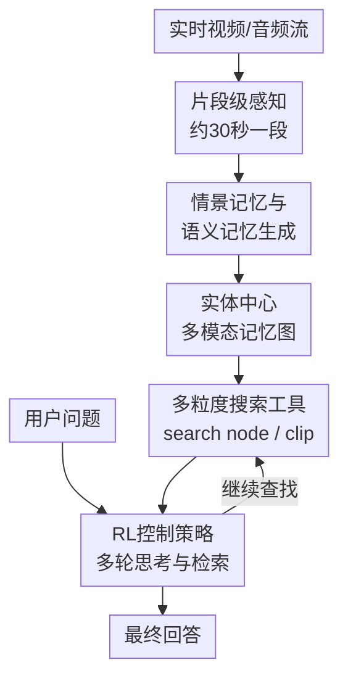

# Seeing, Listening, Remembering, and Reasoning: A Multimodal Agent with Long-Term Memory

**会议**: ICLR2026  
**OpenReview**: [https://openreview.net/forum?id=PMz29A7Muq](https://openreview.net/forum?id=PMz29A7Muq)  
**代码**: https://github.com/ByteDance-Seed/m3-agent  
**领域**: 多模态 Agent / 长期记忆 / 视频理解  
**关键词**: 多模态智能体, 长期记忆, 记忆增强推理, 长视频问答, 强化学习  

## 一句话总结
M3-Agent 把实时视觉与音频流转成实体中心的多模态长期记忆，再用强化学习训练的控制模型多轮检索和推理，在 M3-Bench 与 VideoMME-long 上超过提示式闭源 agent 和在线长视频理解基线。

## 研究背景与动机
**领域现状**：长视频理解和多模态 agent 正在从“看完一段视频再回答问题”走向“持续感知环境、积累经验、在需要时调用过去经验”。已有路线大致有两类：一类扩展上下文窗口或压缩视觉 token，让模型一次性吞下更长视频；另一类把视频切成片段，生成文本描述或特征记忆，回答问题时再做检索增强生成。

**现有痛点**：这些方法离真实 agent 还差一截。真实机器人或家庭助理面对的是近乎无限长的流式经历，而不是一段固定离线视频；它还需要记住“这个人是谁、她喜欢什么、她和另一个人什么关系、这个物品通常放在哪里”这类世界知识。只把每个片段写成独立 caption，会丢掉跨片段身份一致性；只做单轮 RAG，又容易一次检索不到关键线索，无法像人一样边想边查。

**核心矛盾**：长视频问答的难点不只是上下文长度，而是“记忆如何形成”和“记忆如何被使用”。如果记忆没有实体中心结构，脸、声音、名字、偏好会散落在不同片段里；如果控制过程只是把 top-k 片段塞进上下文，复杂问题里的多跳线索、跨模态线索和人物属性推断就很难闭环。

**本文目标**：作者把问题拆成三个子任务：第一，连续处理视频和音频流，在线生成可累积的记忆；第二，把事件、人物、语音、脸和语义知识组织成一致的长期记忆；第三，当收到问题时，让 agent 自主决定查什么、查几轮、何时回答。

**切入角度**：论文借鉴人类认知里的情景记忆和语义记忆：情景记忆记录具体发生过什么，语义记忆抽取“人、关系、偏好、规则”等更稳定的知识。这个角度有希望，是因为 agent 真正需要的不是完整回放所有视频，而是能在长期经验中保留可检索、可关联、可更新的世界模型。

**核心 idea**：用“实体中心的多模态长期记忆 + 强化学习训练的多轮检索控制器”替代单轮视频 RAG，让多模态 agent 能边看边记、边查边推理。

## 方法详解

### 整体框架
M3-Agent 由一个多模态长期记忆数据库和两个策略模型组成：记忆化策略负责从连续视频/音频片段中生成记忆，控制策略负责面对问题时检索记忆并给出答案。系统运行时分成两条并行流程：memorization 持续把环境输入写入长期记忆，control 在收到指令后多轮调用记忆搜索工具完成推理。

和普通长视频 QA pipeline 的关键差别在于，M3-Agent 不把视频当成一次性上下文，而是把每个约 30 秒片段转成可持久化的记忆节点；这些节点按实体、时间和模态连接成图。回答问题时，控制模型生成“推理 + 动作 + 参数”，可以反复执行 `[Search]`，把搜索结果追加到轨迹中，直到选择 `[Answer]`。

### 关键设计
**1. 实体中心多模态记忆图：把长期经验从片段列表变成可关联的世界知识**

M3-Agent 的长期记忆不是简单的文本 caption 库，而是一个外部数据库形式的多模态图。每个记忆节点保存唯一 ID、模态类型、原始内容、可靠性权重、embedding、时间戳等信息；节点之间用无向边表示关系，例如同一实体的脸、声音、名字和相关知识会被连接起来。这样，“Alice 的脸”“voice_3 的声音”“Alice 早上喜欢喝咖啡”不再是三条孤立记录，而会逐步汇聚成同一个人物的记忆簇。

这个设计直接针对长视频中的身份漂移问题。纯语言描述常会把同一个人写成“红裙女士”“戴眼镜的人”“Bob 的朋友”，时间一长就难以对齐。M3-Agent 使用人脸识别、说话人识别和 `search node` 把新片段中的脸/声纹链接到已有节点；若命中已有实体，就激活对应节点或边并提高权重，若没有命中则创建新节点。冲突信息在推理时用加权投票处理，频繁被验证的节点和边优先级更高，因此长期记忆可以随经历逐渐稳定下来。

**2. 情景记忆 + 语义记忆：同时保留“发生了什么”和“由此知道什么”**

记忆化流程按片段处理视频流，每个片段生成两类文本记忆。情景记忆更接近原始经历，记录某个时间段里看见和听见的事件，例如某个人说了什么、拿了什么、把物品放到哪里；语义记忆则从这些事件中抽取更通用的知识，例如人物偏好、人物关系、物品功能、生活规则。论文强调语义记忆不是简单摘要，而是服务于未来任务的知识提炼。

这两类记忆互补：情景记忆适合回答“具体哪一刻发生了什么”，语义记忆适合回答“这个人通常怎样”“这个物品应该放在哪里”。在生成语义记忆时，模型还会做跨模态推理，把同一人物的脸和声音连起来；连通后，检索时可以用共享的 `<character id>` 进行一致推理。这个机制解释了为什么 M3-Agent 在 person understanding 和 cross-modal reasoning 上提升明显：它不是临时从视频里找片段，而是在长期记忆中维护人物和实体的可复用知识。

**3. 多轮控制与检索工具：让回答过程从一次性 RAG 变成可规划的记忆访问**

控制流程把问题、长期记忆和最大轮数 $H$ 作为输入。每一轮控制策略 $\pi_\theta$ 生成一段推理、一个动作和动作参数；如果动作是 `[Search]`，系统就用参数查询长期记忆，并把返回结果追加到下一轮上下文；如果动作是 `[Answer]`，流程结束。论文提供两类搜索工具：`search node` 接受文本、图像或音频查询，返回相关记忆节点；`search clip` 返回与查询最相关的片段级情景/语义记忆。

这个设计比单轮 RAG 更适合复杂问题。比如“去过 Ding Cha 之后又去了哪家奶茶店”需要先定位 Ding Cha，再沿时间线查后续片段；“Lucas 会不会做饭”需要先确认 Lucas 身份，再汇总多个烹饪行为；“机密文件放在哪个文件夹”需要同时结合视觉颜色和语音规则。多轮控制让模型可以把中间发现变成下一轮查询，而不是指望第一次检索就命中所有证据。

**4. 分工训练与 DAPO 强化学习：让记忆生成和记忆使用分别专门化**

论文没有把所有能力压到一个模型里，而是分别训练记忆化模型和控制模型。记忆化模型以 Qwen2.5-Omni-7B 初始化，因为它能处理视觉和音频；控制模型以 Qwen3 初始化，因为它更擅长语言推理。记忆化阶段用 GPT-4o、Gemini-1.5-Pro 和规则算法合成示范数据，包括情景记忆、脸-声身份映射和多种语义记忆，然后做监督微调。

控制阶段先用训练视频生成长期记忆环境，再用 DAPO 训练控制策略。每个 QA 对 $(q, a)$ 下，策略 rollout 多条轨迹，最终答案 $y_i$ 交给 GPT-4o evaluator 判断是否正确，奖励为二值：

$$
R_i = \begin{cases}
1, & \text{GPT-4o evaluator}(q, a, y_i)=\text{True} \\
0, & \text{otherwise}
\end{cases}
$$

优化只作用在模型生成 token 上，并用组内奖励归一化得到优势估计。直观地说，RL 不只是让模型“答案更像参考答案”，而是鼓励它学会何时搜索、搜索什么、如何把多轮搜索结果串成推理链。这也是消融里去掉 inter-turn instruction 或 reasoning 后掉点很大的原因。

### 一个完整示例
假设家庭机器人看到一天中的多个片段：早上 Alice 拿走咖啡并说“没有它我早上不行”；下午 Bob 喊“Alice，这个给你”；晚上 Alice 把空瓶扔进绿色垃圾桶。记忆化流程会先在每个 30 秒片段里识别人脸和说话人，给出类似 `<face_1>`、`<voice_3>` 的身份引用，再生成情景记忆：“<voice_3> 说自己早上离不开咖啡”“<face_1> 把空瓶放入绿色垃圾桶”。

随后语义记忆会把这些片段变成更稳定的知识：“<face_1>/<voice_3> 的名字是 Alice”“Alice 早上喜欢喝咖啡”“绿色垃圾桶用于回收”。当用户问“Alice 早上通常想喝什么”时，控制模型可能先用 `search node` 查 Alice，拿到她的脸、声音和名字映射；再用 `search clip` 查 coffee/morning 相关片段；最后合并语义记忆和原始情景记忆，回答“她早上通常想喝咖啡”。如果用户问“机密文件应该放到哪个文件夹”，控制模型则会查询规则片段，把语音里的“confidential documents go in this folder”和视觉里的红色文件夹绑定起来。

### 损失函数 / 训练策略
记忆化模型 `memory-7b-sft` 使用监督微调，训练数据来自 500 个长视频、26,943 个 30 秒片段和 2,736 个 QA 对。示范数据包括 10,952 条合成样本，其中 200 条留作验证；训练 3 个 epoch，学习率 $1e-5$，batch size 为 16，使用 16 张 80GB GPU。

控制模型使用 DAPO。对每个问题，策略生成一组轨迹，轨迹中包含多轮 reasoning、搜索动作、搜索参数和最终答案。只有 GPT-4o evaluator 判断为正确的答案获得 $1$ 奖励，否则为 $0$；同时论文只在 LLM 生成 token 上计算 loss，避免把用户输入和检索结果也当作需要优化的模型输出。最终得到的控制模型记为 `control-32b-rl`。

## 实验关键数据

### 主实验
论文在 M3-Bench-robot、M3-Bench-web 和 VideoMME-long 上比较三类基线：Socratic Model、在线长视频理解方法、提示式 agent 方法。M3-Agent 在三个测试集上都是最强，其中 M3-Bench-web 和 VideoMME-long 分别比 Gemini-GPT4o-Hybrid 高 7.7 和 5.3 个百分点；M3-Bench-robot 上相对最强在线方法 MA-LMM 高 6.3 个百分点。

| 方法 | M3-Bench-robot All | M3-Bench-web All | VideoMME-long | 备注 |
|------|-------------------|------------------|---------------|------|
| GPT-4o Socratic Model | 8.5 | 28.7 | 38.8 | 片段描述 + RAG |
| MA-LMM | 24.4 | 24.3 | 17.3 | 在线视频理解基线 |
| Gemini-Agent | 16.9 | 34.1 | 55.1 | Gemini 同时做记忆和控制 |
| Gemini-GPT4o-Hybrid | 24.0 | 41.2 | 56.5 | Gemini 记忆 + GPT-4o 控制 |
| M3-Agent | 30.7 | 48.9 | 61.8 | 记忆 SFT + 控制 RL |

按问题类型看，M3-Agent 的优势集中在需要稳定实体记忆和跨模态绑定的任务上。例如在 M3-Bench-web 的 Person Understanding 上达到 59.3，而 Gemini-GPT4o-Hybrid 为 43.8；Cross-modal Reasoning 上达到 44.3，而 Hybrid 为 37.6。这说明它的长期记忆并不只是压缩上下文，而确实改善了人物一致性和音视频联合推理。

| 数据集 / 类型 | 最强基线 | 最强基线分数 | M3-Agent | 提升 |
|---------------|----------|--------------|----------|------|
| M3-Bench-robot / All | MA-LMM | 24.4 | 30.7 | +6.3 |
| M3-Bench-robot / Cross-modal | MA-LMM | 22.7 | 31.2 | +8.5 |
| M3-Bench-robot / Person | MA-LMM | 39.1 | 43.3 | +4.2 |
| M3-Bench-web / All | Gemini-GPT4o-Hybrid | 41.2 | 48.9 | +7.7 |
| M3-Bench-web / Person | Gemini-GPT4o-Hybrid | 43.8 | 59.3 | +15.5 |
| VideoMME-long | Gemini-GPT4o-Hybrid | 56.5 | 61.8 | +5.3 |

### 消融实验
记忆消融固定控制模型为 `control-32b-rl`。结果显示，`memory-7b-sft` 优于提示式 Gemini 记忆和未微调 Qwen 记忆；去掉实体等价关系或语义记忆会显著退化，尤其去掉语义记忆后 M3-Bench-robot 从 30.7 降到 13.6。

| 记忆模型 | M3-Bench-robot | M3-Bench-web | VideoMME-long | 说明 |
|----------|----------------|--------------|---------------|------|
| memory-gemini-prompt | 28.7 | 46.3 | 52.7 | 闭源模型提示式记忆 |
| memory-7b-prompt | 25.3 | 39.9 | 50.8 | 未 SFT 的开源记忆 |
| memory-7b-sft | 30.7 | 48.9 | 61.8 | 完整 M3-Agent 记忆 |
| w/o equivalence | 19.5 | 39.7 | 52.1 | 去掉身份等价连接 |
| w/o semantic memory | 13.6 | 29.7 | 48.7 | 去掉语义记忆 |

控制消融固定记忆模型为 `memory-7b-sft`。DAPO 在 8B、14B、32B 上都带来明显增益，32B 从 prompt 的 20.7/40.9/52.5 提升到 RL 的 30.7/48.9/61.8。去掉轮间指令或 reasoning 后明显掉点，说明 agent 学到的不只是最终答案格式，而是多轮记忆访问策略。

| 控制模型 | M3-Bench-robot | M3-Bench-web | VideoMME-long | 说明 |
|----------|----------------|--------------|---------------|------|
| control-32b-grpo | 30.0 | 47.7 | 58.7 | GRPO 训练 |
| control-32b-prompt | 20.7 | 40.9 | 52.5 | 仅提示，无 RL |
| control-32b-rl | 30.7 | 48.9 | 61.8 | DAPO 训练 |
| control-32b-rl w/o inter-turn instruction | 20.2 | 43.1 | 55.9 | 去掉轮间指令 |
| control-32b-rl w/o reasoning | 19.0 | 40.1 | 52.3 | 去掉显式推理 |

### 关键发现
- 语义记忆是最关键的记忆成分。去掉 semantic memory 后，M3-Bench-robot 下降 17.1 个百分点，M3-Bench-web 下降 19.2 个百分点，说明很多问题依赖从片段中抽出的稳定知识，而不是原始事件检索。
- 身份等价关系也很重要。去掉 face/voice/character 的 equivalence 后，三个数据集分别下降 11.2、9.2、9.7 个百分点，证明实体中心图对长期一致性不是装饰。
- DAPO 训练带来的收益随模型规模保持存在。8B、14B、32B 控制模型从 prompt 到 RL 都有明显提升，说明多轮搜索策略可以通过 RL 学到，而不是只能依赖大模型提示能力。
- M3-Bench 本身比传统 LVQA 更偏 agent 能力：M3-Bench-robot 有 100 个机器人视角视频、1,276 个开放 QA；M3-Bench-web 有 920 个网页视频、3,214 个开放 QA，并显式覆盖多证据、多跳、跨模态、人物理解和知识抽取。

## 亮点与洞察
- 把“长期记忆”落到实体中心多模态图上，这是比“保存历史文本摘要”更适合 agent 的抽象。它把脸、声音、名字、关系和偏好放进同一个可增长结构，能解释为什么人物理解和跨模态推理提升明显。
- 情景记忆和语义记忆的拆分很实用。情景记忆保真，语义记忆抽象；前者防止过度概括，后者让 future query 不必每次从细碎片段里重新归纳。
- 控制过程没有停留在“检索后回答”，而是把搜索动作纳入策略学习。这个思路可以迁移到网页浏览 agent、代码库 agent、机器人任务规划等场景：记忆库不只是被动上下文，而是可被策略主动查询的环境。
- M3-Bench 的问题类型设计很贴近 agent 使用场景。尤其 person understanding 和 general knowledge extraction，不再只问动作识别或时间顺序，而是问 agent 是否能从生活经历中形成稳定知识。

## 局限与展望
- 记忆仍以文本节点为核心承载。虽然节点支持图像和音频模态，论文的主要记忆生成和推理接口仍大量依赖文本条目；对于细粒度视觉属性、空间关系或长时间运动轨迹，文本化可能损失信息。
- 语义记忆质量依赖示范合成与模型归纳能力。语义记忆一旦抽错，后续加权投票可能缓解冲突，但也可能让早期错误在图中被反复激活；论文还需要更系统地研究错误记忆的发现、修正和遗忘机制。
- 自动评估依赖 GPT-4o evaluator。作者做了 100 个样本的人类一致性验证并得到 96% agreement，但开放式 QA 的细粒度正确性仍可能受 evaluator 偏差影响。
- 训练成本不低。记忆模型 SFT 使用 16 张 80GB GPU，控制模型是 32B 级别 RL；若要部署到端侧机器人，还需要进一步压缩记忆生成、检索和控制模型。
- M3-Bench-robot 用人类佩戴头戴相机模拟机器人视角，而不是真实机器人自主执行。它覆盖了感知和记忆推理，但还没有把行动成功率、交互反馈和在线纠错纳入闭环评估。

## 相关工作与启发
- **vs Socratic Models / VideoAgent**: 这些方法通常先把视频片段转成文本，再做检索增强推理；M3-Agent 的区别在于记忆结构是实体中心的多模态图，并且控制器可以多轮调用搜索工具，而不是单轮注入 top-k 描述。
- **vs MA-LMM / Flash-VStream / MovieChat**: 在线视频理解方法关注如何高效处理长视频流，通常把历史压缩成视觉特征或记忆 token；M3-Agent 更强调长期世界知识构建，尤其是人物、声音、关系和语义规则的可持续更新。
- **vs LLM Agent 长期记忆系统**: 许多 LLM agent 记忆系统处理的是对话或工具轨迹；本文把记忆扩展到视频、音频、人脸、声纹和开放世界场景，使“记忆”更接近 embodied / multimodal agent 的需求。
- **启发**: 对研究者来说，一个值得继续做的方向是把 M3-Agent 的记忆图和主动行动结合起来：agent 不仅回答问题，还能在不确定时主动观察、询问或验证，从而把长期记忆从“被动记录”推进到“主动维护”。

## 评分
- 新颖性: ⭐⭐⭐⭐⭐ 用实体中心多模态长期记忆和 RL 多轮控制统一建模多模态 agent，问题设定和系统组合都比较新。
- 实验充分度: ⭐⭐⭐⭐ 覆盖新 benchmark、VideoMME-long、主实验和多组消融，但真实机器人闭环任务和错误记忆分析仍不足。
- 写作质量: ⭐⭐⭐⭐ 论文结构清楚，方法和 benchmark 交代完整；部分实现细节散在 appendix，需要来回对照。
- 价值: ⭐⭐⭐⭐⭐ 对长期记忆、多模态 agent、长视频问答和具身智能评估都有直接参考价值。

<!-- RELATED:START -->

## 相关论文

- [\[ICLR 2026\] From Single to Multi-Granularity: Toward Long-Term Memory Association and Selection of Conversational Agents](from_single_to_multi-granularity_toward_long-term_memory_association_and_selecti.md)
- [\[ICLR 2026\] MEM1: Learning to Synergize Memory and Reasoning for Efficient Long-Horizon Agents](mem1_learning_to_synergize_memory_and_reasoning_for_efficient_long-horizon_agent.md)
- [\[ACL 2026\] HiGMem: A Hierarchical and LLM-Guided Memory System for Long-Term Conversational Agents](../../ACL2026/llm_agent/higmem_a_hierarchical_and_llm-guided_memory_system_for_long-term_conversational_.md)
- [\[ICLR 2026\] MC-Search: Evaluating and Enhancing Multimodal Agentic Search with Structured Long Reasoning Chains](mc-search_evaluating_and_enhancing_multimodal_agentic_search_with_structured_lon.md)
- [\[ICLR 2026\] Memory-T1: Reinforcement Learning for Temporal Reasoning in Multi-session Agents](memory-t1_reinforcement_learning_for_temporal_reasoning_in_multi-session_agents.md)

<!-- RELATED:END -->
