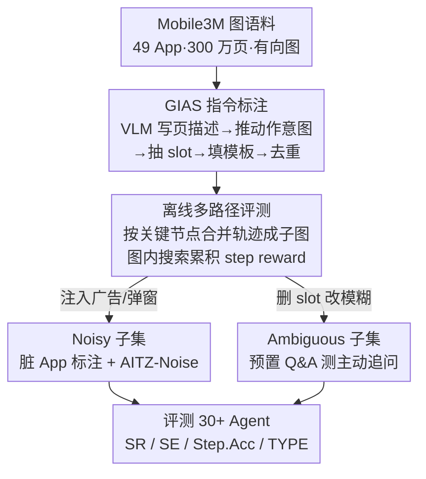

# SMAN-Bench: A Cross-System Benchmark for Mobile Agents under Single- and Multi-path, Ambiguous, and Noisy Tasks

**会议**: ICLR 2026  
**OpenReview**: [https://openreview.net/forum?id=IWDpCaSF9Q](https://openreview.net/forum?id=IWDpCaSF9Q)  
**代码**: https://github.com/gezelligheid0314/SMAN-Bench  
**领域**: Agent / 多模态VLM / Benchmark  
**关键词**: 移动 GUI Agent、多路径评测、噪声鲁棒性、主动交互、slot 标注

## 一句话总结
SMAN-Bench 把一个 300 万页的图结构手机操作语料（Mobile3M）改造成一个移动 Agent 评测基准：用 slot 模板自动给多条轨迹标注同一条指令，从而支持「离线多路径」评测（一条指令可以有多种正确走法），并额外造了带广告噪声和模糊指令两个子集，系统性地测出现有 VLM Agent 在真实脏环境和需要主动追问时的明显短板。

## 研究背景与动机

**领域现状**：基于 VLM 的手机 Agent（看截图 + XML 操作 GUI）越来越多，评测它们的基准分两类——在线评测（真机上跑、看最终页面里控件的值判成败、允许多种路径）和离线评测（预先在真机上录好「黄金路径」的截图和动作，让 Agent 逐步预测动作、和黄金动作逐步对比）。

**现有痛点**：两类基准各有硬伤。在线评测受设备环境波动影响——系统更新、App 更新、用户偏好缓存都会让 step reward 抖动不稳，无法给出稳定的细粒度奖励；而且只看最终页面对不同 Agent 不公平，因为两个都失败的任务可能完成进度天差地别。离线评测则把任务硬塞进「单一路径」，这和 GUI 任务天然的多解性矛盾——Agent 在某个基准上刷出高分，可能只是拟合了标注者的路径偏好，换到真实场景就崩。更要命的是，MobileAgentBench、AutoDroid 这类基准建在 Google 全家桶这种「干净」页面上，没有广告、弹窗、无关按钮，而真实用户也常常给不出一次说全的精确指令。

**核心矛盾**：单路径标注（稳定但偏置）和多路径真实性（贴近现实但难给稳定奖励）之间存在 trade-off；同时现有基准回避了噪声环境和指令不完整这两个真实世界的核心难点。

**本文目标**：造一个同时覆盖 **S**ingle-path / **M**ulti-path / **A**mbiguous / **N**oisy 四种设定的基准（SMAN 即取这四个首字母），既要能给多路径任务稳定的 step reward，又要把广告噪声和模糊指令搬进评测。

**切入角度**：作者发现已有一个现成的图结构语料 Mobile3M——它在 49 个 App 上用随机游走采集了 300 万 UI 页面、2000 万动作，并把探索树去重压成有向图（节点是页面、边是动作）。这个图天然就编码了「多条路径汇到同一关键状态」的结构，正好是多路径评测要的底料，缺的只是给轨迹配上指令。

**核心 idea**：用「slot 模板匹配」把一条指令和多条轨迹绑定起来——指令由模板 + 关键页面抽出的 slot 信息生成，只要多条轨迹经过相同的 slot 关键节点，就都算这条指令的合法解，由此把单路径标注升级成多路径评测，再外挂噪声和模糊两个子集补齐真实性。

## 方法详解

### 整体框架
SMAN-Bench 不是从零采集，而是「拿现成图语料 → 自动标指令 → 改造评测协议 → 外挂两个难度子集」。整条管线的主体是数据构建：从 Mobile3M 图语料里采样固定起止页的多条轨迹，用 VLM 给每个页面写描述、推断动作意图、抽出 slot，再用 slot 去填指令模板，最后去重简化得到指令；评测侧把这些离散轨迹按「关键节点等价」合并成一张子图，Agent 可以在图里自由搜索并累积 step reward（多路径），也可以退化成和黄金路径逐步对齐（单路径）。在此基础上，再造两个专门的难度子集——SMAN-Bench-Noisy（广告/弹窗污染）和 SMAN-Bench-Ambiguous（指令删 slot + 预置 Q&A）。

### 关键设计

**1. GIAS：用 slot 把一条指令绑到多条轨迹上**

要把无标注的随机游走轨迹变成可评测的任务，难点在于「一条指令怎么对应多条走法」。GIAS（Generating Instructions From Action Sequences）抓两个关键点：**动作意图理解**和 **slot 匹配**。前者是因为纯坐标动作脱离页面无法复现语义——比如同一个「+」按钮在不同页面可能是加「榛果拿铁」也可能是加「曲奇摩卡」，必须借页面描述还原意图；后者是把关键页面里的可变信息抽成 slot 填进预设模板，slot 同时充当关键节点的奖励锚点。整条算法（Algorithm 1）是：选取从同名起始节点出发、终止于「同质节点」（页面相似度或相同 UI 元素数超阈值）的多条轨迹 $\sigma_i$，对每个页面 $s_{ij}$ 用 VLM 得到描述 $D_{s_{ij}}$，由相邻两页面 + 动作推出意图 $T_{ij}$，由页面对抽出 slot $C_{ij}$，再 $I_{ij} \sim \text{Uniform}(\gamma)$ 用 slot 填模板；最后对指令两两算相似度，$\text{Sim}(I_i,I_j)\ge\tau$ 就丢掉重复的，并验证轨迹无冗余步骤。整个流程除了一步验证用闭源模型，其余全用开源模型、零人工。关键在于：一个模板能匹配多条共享关键节点的轨迹，这才是多路径评测的根基——单路径标注的不稳定偏好会让模型在没见过的任务上掉点。

**2. 离线多路径评测：把离散轨迹合并成图，按关键节点给 step reward**

这是本文最核心的协议创新，目的是兼得在线的「多路径 + 过程奖励」和离线的「稳定可复现」。做法是把若干条离散单路径在预录图语料里合并成一张统一子图，合并后的节点对应当前指令的关键状态，合并依据有两条：① 动作空间 + 像素差（BM25 阈值）判同页（同一 App 主界面跨会话略有差异但视为等价）；② Android XML/无障碍树里按钮值一致则页面等价（不同浏览器搜同一关键词的结果页合并成一个关键节点）。Agent 在不超步数上限的前提下可在图内自由搜索，到达任一等价关键节点就累积奖励；由于预录无法覆盖所有搜索结果，作者给指令配了预定义查询池，超出池子的搜索算无效。评测同时支持两种模式：多路径下判 Agent 是否到达终态页面（SR）并用步效率 $SE=S_{actual}/S_{min}$ 衡量是否绕路；单路径下逐步对齐黄金动作算 $Step.Acc=S_{tp}/S_{gt}$。实验里同一模型的多路径 SR 普遍高于单路径，说明多路径更能反映 Agent 的真实能力，而非对单条标注路径的过拟合。

**3. 噪声子集：把真实广告弹窗搬进评测**

干净页面测不出 Agent 在真实脏环境的鲁棒性，所以 SMAN-Bench-Noisy 从两路造数据。一是人工标注：从第三方应用市场选 20 个广告/弹窗严重的脏 App，操作时故意不预先处理登录、更新、权限、广告弹窗、VIP 订阅这些干扰，甚至刻意误点广告页看 Agent 能否从岔路恢复，所有噪声步和跳转页都额外标记（方便带回滚机制的 Agent 用）。二是数据污染：往 AITZ（AITW 的高质量子集）的正常轨迹里随机插入至少一个广告（从 Google Store 随机采的 150+ 条广告之一），构成 AITZ-Noise，每条只注入一个广告，用来测「除了背景截图变了之外其它都一样」时 Agent 还能不能撑住。真实广告的难点被归纳成三类：倒计时结束广告自动消失导致延迟点击误触、早期阶段视频广告关不掉、误触广告触发 App 跳转。

**4. 模糊指令子集：测 Agent 主动追问的能力**

真实用户往往给不出一次说全的指令，所以 SMAN-Bench-Ambiguous 专门测主动交互。构造方式是先写完整指令、标好轨迹，再把 slot 信息删掉退化成模糊指令，并按缺失的 slot 预置多组 Q&A 挂到对应页面上。例如完整指令是「我要一台 16GB+512GB 午夜色的 MacBook Pro M4」，模糊版变成「我想买台 MacBook」，其中「16GB+512GB」「Pro M4」「午夜色」被当成三个 slot、各自挂到对应页面充当 step reward；Agent 需要在执行中适时追问（如「你想用哪个 App？」），且只能问和指令相关的补充信息，不允许直接问下一步决策或某按钮功能。每条轨迹至少配 5 组人工 Q&A，与缺失 slot 严格对齐。

## 实验关键数据

### 数据规模
- common 主集：12,854 条指令 + 800 个模板，按步数分简单（1–6 步，9,620 条，均 5.62 步）和复杂（7–15 步，3,234 条，均 8.21 步）；整库 EN&CN、约 4.8 万截图、均 7.28 步，单/多路径双支持。
- 评测实际用 Random-800 子集（分布与全集一致、800 指令 1:1 对应 800 模板），简单/复杂任务最大步数分别设 20 / 25。
- noisy 子集 100 条（20 个脏 App，均 12.74 步）；AITZ-Noise 在 2,504 条轨迹里各注入 1 条广告（150+ 广告池）；ambiguous 子集 100 条（均 7.53 步，每条 ≥5 组 Q&A）。
- 数据质量验证：复杂集仅 8% 数据被判次优（slot 多导致填充后语义不自然），人工修正后达标。

### 主实验（Random-800，节选 SR）

| Agent 框架 / 模型 | Common-Simple SR | Common-Complex SR | Noisy SR | Ambiguous SR |
|---|---|---|---|---|
| AppAgent-v1 + Qwen2-VL-72B (单) | 21.1 | 5.0 | 3.0 | 8.0 |
| MobileAgent-E + Qwen-VL-Max (单) | 32.5 | 25.5 | 21.0 | 29.0 |
| MobileAgent-E + GPT-4o (单) | 27.5 | 19.0 | 14.0 | 24.0 |
| OpenCUA-32B（预训练 Agent，单） | 39.0 | 38.0 | 13.5 | 43.0 |
| UI-TARS-1.5-7B（预训练 Agent，单） | 39.0 | 38.5 | 15.0 | 42.0 |
| Claude 4.5 Sonnet（推理模型，单） | 39.0 | 39.0 | 15.5 | 43.0 |

关键观察：① 框架层面，AppAgent-v1 在单路径最好（预置正确历史动作让它专注当前页），MobileAgent-v2 靠反思/预期机制在多路径更稳，Mobile-Agent-E 凭动态知识注入 + 规划在多数指标领先（但短上下文的 Llama3.2-VL-90B 因 in-context 受限掉点）。② 多路径 SR 普遍高于单路径，佐证多路径更能反映真实能力。③ 专用移动 Agent（grounding 更强）整体显著优于纯框架方案，且推理步数压到原来约 1/5；通用「慢思考」多模态模型（如 Doubao-1.5-Thinking-pro）已能和专用 Agent（OpenCUA-32B）打平，而把思考模型塞进框架并无额外收益，暗示框架与模型内生思考能力存在某种等价。

### 噪声鲁棒性（AITZ vs AITZ-Noise，Step.Acc）

| Agent | Normal Total | Noise 子集 Total | 噪声步 Step.Acc |
|---|---|---|---|
| Qwen2-VL-7B | 46.9 | 43.9 | 17.4 |
| OS-Atlas-7B | 48.6 | 45.1 | 21.7 |

从 normal 到 in-domain noise，Step.Acc 仅平均掉 3.0% / 3.5%，但单看噪声步本身准确率只有 17.4% / 21.7%——说明开源 Agent 几乎学不会广告特征、在迁移噪声上几乎零泛化，一旦被困在无关页面就不知如何继续。

### 模糊指令消融（Table 5，提供 Q&A 后 Type / StepAcc 增量）

| 模型 | AppAgent Type 增量 | MobileAgent Type 增量 |
|---|---|---|
| InternVL2-40B（弱） | +5.9 | +15.5 |
| Llama3.2-VL-90B（中） | +17.5 | +6.5 |
| GPT-4o（强） | +15.0 | +3.9 |

主动交互模块带来最多 +17.5% 的提升，但收益非线性：弱模型（InternVL，+5.9%）问不出有效问题、强模型（GPT-4o，+3.9%）本就会规划，**中等水平模型（Llama3.2-VL-90B，+17.5%）获益最大**；端到端 Agent 难以按预设设定形成并探索问题，这是一个明确的未来方向。

### 关键发现
- 多路径评测比单路径更能反映真实能力，单路径高分往往是对标注偏好的过拟合。
- 噪声是现有 Agent 的最大短板：训练数据缺广告样本 → 噪声步准确率低、迁移泛化几乎为零。
- 主动追问的价值取决于模型档位，中等模型最吃这套机制；专用 Agent 的 grounding 优势远大于框架设计带来的差异。

## 亮点与洞察
- **「拿现成图语料反向标指令」的思路很省**：不重新真机采集，而是利用 Mobile3M 图结构里天然存在的多路径汇聚结构，用 slot 模板把一条指令绑到多条轨迹，几乎零人工就造出了多路径基准——这条路径可迁移到任何已有图结构 GUI 语料。
- **多路径合并的两条等价判据可复用**：BM25 像素差判同页 + XML 按钮值一致判等价节点，是给「不同走法到达同一关键状态」做对齐的通用工具，可用于其它需要把离散轨迹聚成图的评测。
- **把「噪声」和「模糊」当一等公民评测**，并给出可操作的造数据配方（脏 App 故意不预处理 + AITZ 注广告；删 slot + 预置 Q&A），让鲁棒性和主动交互第一次能被量化对比。
- **「中等模型最吃主动交互」是个反直觉的有用结论**：强模型不需要、弱模型用不好，提示这类辅助机制应按目标模型档位有选择地上。

## 局限与展望
- 多路径评测依赖预录图语料，搜索结果超出预定义查询池就算无效，覆盖度受限于 Mobile3M 的采集广度。
- 为省成本主要在 Random-800 子集上做零样本评测，未在 1.2 万全集上系统跑，长尾任务表现未充分暴露。
- 噪声子集广告来自特定脏 App 和 Google Store 采样，广告形态随时间/地域漂移，基准可能很快过时。
- 端到端 Agent 在模糊任务上难以按预设 Q&A 设定提问，说明评测对「自由形态主动交互」的刻画仍偏受限——预置 Q&A 终究不是开放对话。

## 相关工作与启发
- **vs 在线基准（MobileAgentBench / Mobile-Bench）**：它们在真机上判最终页面、允许多路径，但 step reward 受环境波动抖动；本文用预录图语料做离线多路径，牺牲一点真实交互换来稳定可复现的过程奖励。
- **vs 离线单路径基准（AITW / AITZ / GUI Odyssey）**：它们把任务锁成单条黄金路径，鼓励过拟合标注偏好；本文用 slot 关键节点把单路径升级成多路径，并直接复用/污染 AITZ 造 AITZ-Noise 做对照。
- **vs 干净页面基准（建在 Google 全家桶上的）**：本文专门引入广告/弹窗脏 App 和模糊指令两个子集，补上现有基准系统性回避的两个真实难点。

## 评分
- 新颖性: ⭐⭐⭐⭐ 「图语料反向标多路径指令 + 噪声/模糊两个子集」组合到一个基准里，角度扎实但底层语料是复用 Mobile3M。
- 实验充分度: ⭐⭐⭐⭐⭐ 覆盖 30+ 模型（框架 / 预训练 Agent / RL Agent / 推理模型），四个子集 + AITZ-Noise 对照 + 模糊消融，相当全面。
- 写作质量: ⭐⭐⭐⭐ 设定多、表格密，主线清晰但子集命名和指标较多，需要对照才看得顺。
- 价值: ⭐⭐⭐⭐⭐ 为多路径、噪声鲁棒、主动交互三个真实难点提供了可量化的统一评测底座，对 GUI Agent 后续研究是实用基础设施。

<!-- RELATED:START -->

## 相关论文

- [\[ICLR 2026\] FingerTip 20K: A Benchmark for Proactive and Personalized Mobile LLM Agents](fingertip_20k_a_benchmark_for_proactive_and_personalized_mobile_llm_agents.md)
- [\[ICLR 2026\] From Single to Multi-Granularity: Toward Long-Term Memory Association and Selection of Conversational Agents](from_single_to_multi-granularity_toward_long-term_memory_association_and_selecti.md)
- [\[ICLR 2026\] WARC-Bench: Web Archive based Benchmark for GUI Subtask Executions](warc-bench_web_archive_based_benchmark_for_gui_subtask_executions.md)
- [\[ICLR 2026\] MCP-Bench: Benchmarking Tool-Using LLM Agents with Complex Real-World Tasks via MCP Servers](mcp-bench_benchmarking_tool-using_llm_agents_with_complex_real-world_tasks_via_m.md)
- [\[ICLR 2026\] InfoMosaic-Bench: Evaluating Multi-Source Information Seeking in Tool-Augmented Agents](infomosaic-bench_evaluating_multi-source_information_seeking_in_tool-augmented_a.md)

<!-- RELATED:END -->
