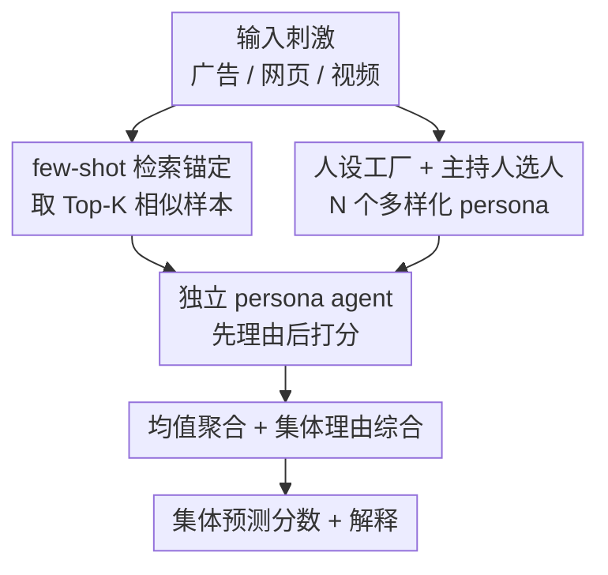

# Social Agents: Collective Intelligence Improves LLM Predictions

**会议**: ICLR 2026  
**OpenReview**: [https://openreview.net/forum?id=73J3hsato3](https://openreview.net/forum?id=73J3hsato3)  
**项目主页**: [https://behavior-in-the-wild.github.io/social-agents](https://behavior-in-the-wild.github.io/social-agents)  
**代码**: 待确认（论文释出 persona 预测数据集）  
**领域**: Agent / 多智能体 / 行为预测  
**关键词**: 群体智慧, 人设智能体, 多智能体集成, 行为预测, 集体决策

## 一句话总结
本文提出 **Social Agents**，把同一个 LLM 用不同人口学/心理学画像（persona）条件化成一群"虚拟社会"中的独立评估者，让它们各自给刺激（广告/网页/视频）打分并说理由，再取均值聚合，从而把"群体智慧（Wisdom of Crowds）"搬进 LLM；在 11 个行为预测任务上，相对单 LLM baseline 在低层任务最高提升 164%、高层任务最高 24%，9 个模型平均提升 21.5%。

## 研究背景与动机
**领域现状**：在估牛重、预测选举、预测金融市场这些经典案例里，把大量彼此独立的猜测平均起来，往往比单个专家更准——这就是"群体智慧"。它成立靠四个条件：观点多样、判断独立、知识分散、恰当聚合。但 LLM 默认只吐**一个**确定答案，这种"统一口径"恰恰抹掉了真实人群对广告、视频、网页反应时天然存在的判断多样性。

**现有痛点**：要操作群体智慧，传统做法得真的去召集、激励一大群人，成本高、难规模化，也没法对每一个决策场景都跑一遍。而单 LLM 即便很强，给出的也只是一个"平均人格"的回答，无法刻画不同年龄、职业、价值观人群对同一内容的分歧。已有的"persona prompting"研究只证明了 LLM 能扮演**某一个**给定人设，却没把它系统地组织成一个能产生群体智慧的集成。

**核心矛盾**：行为预测的真值本质上是**人群分布的统计量**（如某广告的 CTR 百分位、网页平均好感度），而单次 LLM 调用只能采样到这个分布的一个点，且反复重采样只能降方差、消不掉"系统性视角缺失"带来的偏差。

**本文目标**：能不能用 LLM 把群体智慧"操作化"——每个实例扮演一个独立人设，聚合它们的回答，从而提升 LLM 的预测与推理表现？

**切入角度**：基础模型在 Reddit 等多人群语料上预训练，隐式见过不同人口学/心理学群体如何表达观点、如何权衡，因此**同一个 backbone 条件化到不同 persona，就能从其潜空间里采样出系统性不同的视角**，而不是只采样随机噪声。

**核心 idea**：用"人设条件化的多智能体集成"取代"单次/重复单 LLM 调用"，把群体智慧的四支柱（多样、独立、分散、聚合）逐一落到 LLM 上，让结构化的人群间差异（而非采样内噪声）来驱动预测精度。

## 方法详解

### 整体框架
Social Agents 是一条"建社会 → 各自评 → 聚合"的流水线。给定一个待评刺激（广告、网页截图、视频等），系统先算它的 embedding 并从语料库检索 Top-K 语义相似样本作为 few-shot 例子来锚定预测；同时一个 **moderator（主持人）** 从 **Persona Agent Factory** 里挑出 N 个在人口学（年龄、性别、地域）和心理学（兴趣、价值观、生活方式）维度上多样化的人设，把同一个 backbone LLM 实例化成 N 个独立 agent。每个 persona agent 拿到刺激和 few-shot 例子后，**先以自己人设的口吻写一段理由、再据此给一个量化分数**；这些分数最后由 moderator 取均值聚合成集体预测，并把所有理由综合成一段集体解释。整条线的关键在于：N 个 agent 彼此**不交互、独立提示**，差异来自人设而非随机性。

### 关键设计

**1. 人设智能体工厂与主持人选人：把"多样 + 分散"落到 backbone 上**

群体智慧要求观点多样、知识分散，本文用一个 **Persona Agent Factory** 来实现：工厂里存着一批由人口学属性（年龄段、性别、地域）和心理学特质（职业、兴趣、价值观）定义的人设模板，由一个 moderator 从中**挑选 N 个尽量多样的 panel**，再用**同一个 backbone 模型**但不同 persona prompt 把它们实例化成 N 个 agent。关键不是用多个不同模型，而是同模型不同条件化——作者在 N≈10 时就能让"年轻女大学生、退伍老兵、时尚爱好者、教师、高中生"等画像对同一网页给出从 2.5 到 5.6 不等的分数，覆盖了单 prompt 永远采不到的群体间差异。每个 agent 只依据自己被分配的画像、调用各自的日常语境来判断，提供了"去中心化"的判断基础。

**2. 独立提示与"先理由后打分"的链式决策：保住独立性、防群体思维**

群体智慧的另一支柱是判断独立，一旦 agent 之间互相influence就会塌缩成"群体思维"。本文让 N 个 persona agent **彼此完全不交互、分别提示**，每个 agent 面对查询时**先从自己人设视角生成一段 rationale，再以该 rationale 为条件输出一个数值分数**。这种"理由在前、分数在后"被作者当作一次显式的 chain-of-thought：让人设的推理先落地，模型再去 commit 到具体数字，实测能同时提升输出的可复现性和可解释性。正因为每个 agent 的随机性来自人设差异而非互相抄答案，最终聚合时不同画像的分布才是"互补"而非"冗余"的。

**3. 均值聚合与集体理由综合：让个体误差互相抵消**

最终预测由所有 persona 分数取**简单均值**得到：$\hat{S} = \frac{1}{N}\sum_{i=1}^{N} s_i$，其中 $s_i$ 是第 $i$ 个人设的分数，$\hat{S}$ 是集体估计。这一步带来三个好处：① **误差抵消**——个体的特异性高估/低估在平均中相互offset，聚合值更贴近真值（如广告例子里 66/52/60/42/66 平均成 54，逼近真值 51）；② **多样性带来鲁棒性**——异质视角天然抵御系统性偏差和离群点；③ **可解释的群体动态**——理由的分布揭示了共识与分歧的来源。与"假设判断独立"的经典集成不同，这里 persona 条件化引入的是**系统性变异**：每个 agent 从相关但不同的分布采样，共享 backbone 又带来 agent 间相关性，正好镜像真实人群"既多样又有共性"的结构。聚合完后，同一个 LLM 以"中立无条件专家"模式把所有理由综合成一段集体解释，供下游可解释性使用。

**4. few-shot 检索锚定与公平预算约束：让提升来自人设而非更长输出**

为了让 persona 的判断有据可依，系统先对刺激算 embedding，用 OpenAI `text-embedding-3` 检索 Top-5 最近邻样本（排除目标本身）当 few-shot 例子喂给每个 agent；除"行为属性分类"任务用 zero-shot 外，其余都是 5-shot。为排除"提升只是因为输出更长"这一 confound，作者对 No-Persona baseline 和 Social Agents **统一卡 300-token 生成上限**，从而把增益归因到结构化人设多样性 + 聚合机制本身，而非更多的生成空间。

### 一个例子：广告 CTR 百分位预测
以 Fig.2 的广告为例：它视觉清淡优雅，对创意人群有吸引力，但对追新的年轻用户偏冷。Social Agents 用多个人设分别评估——34-45 岁有家庭的女性市场营销毕业生给 66，25-34 岁男性市场营销毕业生给 52，34-45 岁科技从业者给 60，18-24 岁追时尚女性给 42，13-17 岁男生给 66。这些判断分歧明显，但取均值后极端值被熨平，得到集体分 54，逼近真值 51。作为对照，"No-Persona（同 prompt 重复调 10 次）"只能靠采样随机性制造变化（类似大数定律设定），在网页好感度任务上与人类分布的 KDE 重叠只有 61.5%，而 Social Agents 达到 78.4%——说明真正起作用的是**群体间结构化差异**，而非群体内噪声。

## 实验关键数据

### 主实验
覆盖 11 个按建构水平理论（CLT）划分的行为任务（低/中/高建构），9 个模型（GPT-4o、LLaMA 3.3 70B、Qwen3 32B 及视觉版、若干小模型），主比较对象是 No-Persona（单 LLM 当专家，5-shot）与任务专用专家模型（LCBM / Henry / Behavior-LLaVA / XGBoost）。

| 任务（建构层次） | 指标 | 提升幅度 | 说明 |
|--------|------|------|------|
| 网页好感度（低） | Pearson r | **+164.2%** | GPT-4o vs No-Persona，单模型最大增益 |
| 广告 CTR（低） | MAPE↓ | 34.7%（GPT-4o）/ 28.2%（跨模型均值） | 也超过微调 LCBM 34.4% |
| 推文互动（低） | 准确率 | +21.75% | 跨 backbone/行业均值 |
| ROAS（中） | MAPE↓ | 27.9% 均值；PE@20 +75% | GPT-4o 在房产域 ROAS MAPE↓39.8% |
| 长期记忆度（高） | Spearman ρ | +24.2%（GPT-4o）/ +13.2%（跨模型） | 唯一仍不及专家 Henry 的任务 |
| 低层任务整体 | 平均 | **+30.5%** | 跨模型平均 |
| 高层任务整体 | 平均 | **+9.9%** | 跨模型平均 |
| 全部 11 任务 × 9 模型 | 平均 | **+21.5%** | 模型无关性证据 |

与专家模型比：CTR 上超过微调 LCBM（MAPE↓34.4%）、网页好感度上 Pearson 超 XGBoost 10.45%、ROAS PE@30 在创意域超 XGBoost 126.9%；行为属性分类上相对 Behavior-LLaVA（zero-shot）在 persuasion 上最高 +55.3%。

### 消融与分析

| 配置 / 分析 | 关键指标 | 结论 |
|------|---------|------|
| Social Agents vs No-Persona(Mean of 10 Trials) | 与人类分布 KDE 重叠 78.4% vs 61.5% | 人设差异 > 重复采样 |
| persona 数量 N | MAPE 在 N≈10-20 最低后 plateau | 默认 N=10，超出收益递减 |
| 温度敏感性 | GPT-4o CTR ~47.5% MAPE（多温度）vs 72.45%(No-Persona) | 增益非来自随机解码 |
| 聚合方式 mean vs median | 结果稳健 | 增益源于结构化多样性 |
| clubbed-emotion 分类 | 比 Behavior-LLaVA(zero-shot) 低 22.7% | 唯一系统性回退 |
| 与人类对齐 | Pearson r 最高 0.71（18-24 男）→ 0.22-0.25（55+） | 年轻人群对齐最好 |

### 关键发现
- **增益来自"人设多样性"而非"多调用"**：No-Persona 重复调用很快 plateau 且误差更高，甚至"Wisdom of the Silicon Crowd"（聚合多个 LLM 但不做人设条件化）也不如单模型 + 多人设。
- **模型无关、跨尺度成立**：即使 LLaMA 8B、Qwen 7B 这类小模型，绝对精度低但相对各自 No-Persona 仍有清晰提升。
- **低/中建构任务收益最大，高建构任务收益温和**：直觉判断（好感度、CTR）更易从群体平均中获益；需要抽象推理与长期预测（记忆度）的任务，专门训练的专家仍有优势。
- **对齐随年龄衰减**：LLM 预训练语料偏年轻数字原生用户，老年人群口味在训练中欠表征，导致 persona 条件化更难复原其判断。

## 亮点与洞察
- **"同模型不同人设"就是廉价的群体智慧**：不需要多模型集成，只靠 persona prompt 把单 backbone 条件化成异质评估者，既省又把"群体间结构化差异"这一关键信号引了进来——这正是它跑赢"重复采样"和"多模型聚合"的根因。
- **rationale-then-score 是巧妙的小设计**：先写理由再打分，相当于强制 chain-of-thought 落地，同时提升可复现性与可解释性，且让聚合后的理由分布天然成为"为何共识/为何分歧"的解释材料。
- **300-token 统一预算 + 重复采样 baseline 是严谨的消融**：直接堵死了"提升只是输出更长 / 只是降方差"两个最容易被质疑的 confound，把功劳干净地归给人设多样性。
- **可迁移**：这套"人设条件化集成"思路可迁移到任何需要逼近人群分布统计量的任务（用户调研、内容 A/B 预估、主观评分），把 LLM 当作可规模化的"代理人群"。

## 局限与展望
- **高建构任务仍不及专用专家**：长期记忆度上仍输给在专门语料上训练的 Henry，说明对认知距离远、需深度语义推理的任务，纯 persona 多样性补不齐专用训练的优势。
- **存在系统性回退**：在 clubbed-emotion（粗粒度情绪二/少分类）上一致地低于 Behavior-LLaVA(zero-shot) 约 22.7%，作者归因于粗粒度标签下专用微调边际优势更大。
- **对老年/欠表征人群对齐差**：受限于预训练语料分布，55+ 群体对齐 Pearson 仅 0.22-0.25，意味着对这些人群的"群体智慧"会失真——这既是局限也是随基模改善而自然受益的方向。
- **N 偏小、聚合简单**：受预算限制默认 N=10、均值聚合；更复杂的加权聚合、动态选人、跨任务人设迁移都还没探索。

## 相关工作与启发
- **vs No-Persona / 重复采样（Law of Large Numbers）**：后者靠采样随机性降方差，消不掉系统性视角缺失；本文靠人设引入群体间结构差异，KDE 与人类重叠 78.4% vs 61.5%。
- **vs Wisdom of the Silicon Crowd（多 LLM 聚合）**：仅聚合多个模型而不做人设条件化，反而不如单模型 + 多人设，印证"差异要来自人设而非模型/采样"。
- **vs 任务专用专家（LCBM / Henry / Behavior-LLaVA / XGBoost）**：专家靠数十万到上亿标注训练，本文仅 5-shot 即在低/中建构任务上反超多数专家，提供了一条免大规模任务训练的可扩展替代路径。
- **vs 单 persona prompting（Santurkar 等）**：已有工作证明 LLM 能扮演单一人设，本文把它系统组织成产生群体智慧的集成，是从"扮演一个人"到"模拟一个社会"的跃迁。

## 评分
- 新颖性: ⭐⭐⭐⭐ 把群体智慧四支柱系统映射到 LLM 多智能体集成，概念清晰、操作化干净，但单组件（persona prompting、均值聚合）均非全新。
- 实验充分度: ⭐⭐⭐⭐⭐ 11 任务 × 9 模型，含温度/聚合/N/重复采样等多重消融与人类对齐分析，覆盖面很广。
- 写作质量: ⭐⭐⭐⭐ 动机与四支柱叙事流畅、图例直观；部分指标口径（多种 MAPE/PE@K/跨域均值）较密集需细读。
- 价值: ⭐⭐⭐⭐ 提供可规模化、可解释的"LLM 代理人群"范式，对行为/营销预测与主观评分任务实用性强。

<!-- RELATED:START -->

## 相关论文

- [\[ICLR 2026\] When AI Agents Collude Online: Financial Fraud Risks by Collaborative LLM Agents on Social Platforms](when_ai_agents_collude_online_financial_fraud_risks_by_collaborative_llm_agents_.md)
- [\[ICLR 2026\] WebFactory: Automated Compression of Foundational Language Intelligence into Grounded Web Agents](webfactory_automated_compression_of_foundational_language_intelligence_into_grou.md)
- [\[AAAI 2026\] SoMe: A Realistic Benchmark for LLM-based Social Media Agents](../../AAAI2026/llm_agent/some_a_realistic_benchmark_for_llm-based_social_media_agents.md)
- [\[CVPR 2026\] ProactiveMobile: A Comprehensive Benchmark for Boosting Proactive Intelligence on Mobile Devices](../../CVPR2026/llm_agent/proactivemobile_a_comprehensive_benchmark_for_boosting_proactive_intelligence_on.md)
- [\[ICLR 2026\] Opponent Shaping in LLM Agents](opponent_shaping_in_llm_agents.md)

<!-- RELATED:END -->
