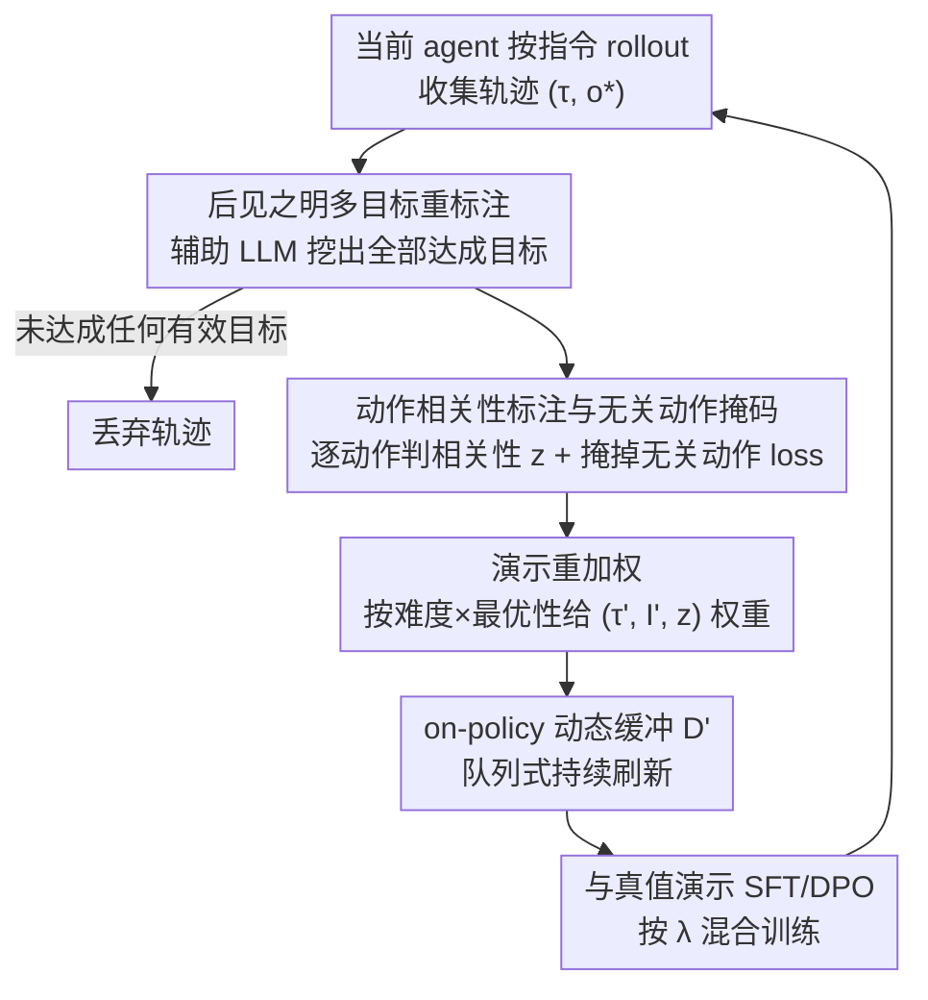

# Spinning Straw into Gold: Relabeling LLM Agent Trajectories in Hindsight for Successful Demonstrations

**会议**: ICLR 2026  
**OpenReview**: [https://openreview.net/forum?id=QNfmqMSR7r](https://openreview.net/forum?id=QNfmqMSR7r)  
**代码**: 无  
**领域**: Agent / LLM 后训练 / 模仿学习  
**关键词**: LLM Agent、后见之明重标注、监督微调、样本效率、目标条件学习

## 一句话总结
把 LLM agent 跑出来的"失败/次优"轨迹用一个辅助 LLM 回看一遍、重新标注成它**实际完成了的所有目标**，再配合"无关动作掩码 + 演示重加权"把这些废料变成成功演示来追加微调；在 ALFWorld / PlanCraft / WebShop 上即插即用地涨点，并且只用四分之一的真实演示就能超过用全量数据训练的 baseline。

## 研究背景与动机

**领域现状**：训练 LLM agent 主流靠监督微调（SFT）在专家演示上学，或者用 DPO / PPO 这类偏好/强化学习来从更弱的监督里学。SFT 简单稳定但依赖大量人工专家轨迹，贵且缺乏多样性；RL 理论上能从 agent 自己的试错里学，但在长程、稀疏奖励的任务里要先"撞上"高回报轨迹才能学起来，非常难。

**现有痛点**：这两条路都没有充分利用 agent 自己生成的海量 rollout。agent 在 POMDP（部分可观测）环境里跑一趟，往往**没完成被指派的任务**，于是整条轨迹按原指令算就是"失败"，被直接丢掉。但这条轨迹里其实藏着大量它**无意中真的做成了的事**——只是没人给它贴上正确的标签。

**核心矛盾**：监督信号是瓶颈，而 agent rollout 里其实自带一种被忽视的监督——"非预期但成功"的目标。问题不在于 agent 没做成事，而在于没有人把"它到底做成了哪些事"翻译成可学习的演示。

**本文目标**：在不依赖任何真值动作和奖励信号的前提下，把 agent 已有轨迹里所有真正达成的目标挖出来，转成成功演示来补充训练；同时要处理这些"借来的"演示天生次优的问题。

**切入角度**：灵感来自目标条件 RL 里的后见之明经验回放（HER）——"既然没走到蓝旗，但走到了红旗，那这条轨迹对'去红旗'就是一条成功示范"。作者的关键假设是：**重标注比解题本身简单**，因为它是在整条轨迹采完之后做的，不需要预测环境动态（恰恰是 agent 任务里最难的部分），只需要 LLM 读观测、做感知与推理——这正是 LLM 擅长的。

**核心 idea**：用辅助 LLM 在事后给 agent 轨迹重标注它"真正达成的全部自然语言目标"，把废料轨迹变成成功演示去再微调（Hindsight Supervised Learning, HSL）。

## 方法详解

### 整体框架
HSL 是一条**并行分支**，可以挂在任意现有后训练管线（SFT 或 DPO）旁边。它在每个训练步做三件事：让当前 agent 按训练集指令 rollout 收集轨迹 → 用一个强辅助 LLM 回看每条轨迹、标注出它实际达成的所有目标并判定每个动作是否相关 → 把这些"重标注演示"存进一个动态缓冲 $D'$，再从中采样、配合无关动作掩码和重加权做 SFT，并与真值演示上的原始损失按权重 $\lambda$ 混合。关键在于这个缓冲是**在线（on-policy）持续刷新**的：每步用**同一个**正在训练的 agent 重新生成轨迹，让重标注分布始终跟着 agent 的能力演化走。

### 关键设计

**1. 后见之明多目标重标注：把一条轨迹里所有"无意达成"的目标都挖出来**

针对的痛点是：agent 轨迹按原指令算几乎都是失败，监督信号被白白丢掉。HSL 用一个外部辅助 LLM $M$（论文里用 Llama-3.3-70B）零样本地回看整条轨迹 $\tau_T$ 和最终观测 $o^*$，推理出它沿途真正达成的一串目标 $\{I'_1,\dots,I'_K\} = M_{inst}(\tau_T, o^*)$，其中 system prompt 描述了合法目标空间。每个目标 $I'_k$ 配上它**首次被达成那一步之前的轨迹片段** $\tau_{S(I'_k)}$，构成一条成功演示；如果整条轨迹没达成任何有意义目标就直接丢弃。

和 RL 里的 HER 系方法（如 Cideron、GCSL）最大的区别在于：它们通常只给**失败轨迹**重标注**唯一一个最终目标**，而 HSL 主张挖出轨迹里**全部**达成的目标——哪怕原指令成功了，中间步骤也可能顺手做成了别的任务，而这些"非指派任务"对 agent 同样有学习价值。作者还假设这个重标注任务比解题简单，因为它纯靠事后感知推理、不用预测环境动态。

**2. 动作相关性标注与无关动作掩码：别让"借来"的轨迹里的废动作污染学习**

由于轨迹 $\tau_{S(I'_k)}$ 原本是为指令 $I$ 收集的，里面很多动作对重标注目标 $I'_k$ 其实毫不相关（比如弱 agent 在房间里来回乱逛）。如果天真地对所有动作做 SFT，就等于在模仿一个很次优的"后见之明专家"。HSL 复用 $M$ 给片段里每个动作 $a_u$ 打一个相关性标签 $z_u \in \{0,1\}$：$z_{1:S(k)} = M_{relevance}(\tau_{S(k)}, o_{S(k)+1}, I'_k)$。训练时**掩掉所有被判为无关（$z_t=0$）动作的 loss**，只在相关动作上回传：

$$\mathcal{L}^{D'}_\theta = \mathbb{E}_{d'=(\tau,I',z)\sim P(\cdot)}\left[\frac{1}{T}\sum_{t=1}^{T} -z_t \cdot \log P_\theta(a_t|\tau_{t-1}, o_t, I')\right]$$

这一步直接对应理论分析里要压低的"后见之明专家与真专家的偏差" $\delta_E$——掩掉无关动作就是在让被模仿的策略更接近最优。消融里在真值演示最少时，去掉掩码（NoMask）掉点最狠，正因为弱 agent 的废动作最多。

**3. 演示重加权：别让"容易达成"的目标主导训练**

有些目标 $I'$ 天生好达成，于是在缓冲里出现得格外频繁，会把 agent 带偏成只会做简单任务，导致占用覆盖率 $\kappa$ 变差。HSL 按权重 $w_d$ 采样演示，让"把更难的任务解得更最优"的演示优先：

$$w_d = \left(\frac{n_d}{T_d}\right)^\alpha \cdot n_d$$

其中 $n_d$ 是被标为相关（$z_u=1$）的动作数、$T_d$ 是该演示总动作数。比值 $n_d/T_d$ 衡量"任务解得多最优"，$n_d$ 当作"任务难度"的代理（相关动作越多通常任务越长越难），超参 $\alpha$ 平衡两者。最终采样概率 $P(d') = w_d / \sum_{d\in D'} w_d$。消融显示去掉重加权（UniWeight）在 Unseen split 上明显更差，说明它主要帮的是泛化。

**4. on-policy 持续刷新缓冲：让重标注分布跟着 agent 一起进化**

与 BAGEL、BehaviorClone 这类离线数据合成方法的本质区别在于：它们用一个**和目标 agent 不同的固定模型**一次性合成数据集然后冻住，而 HSL 用**同一个正在训练的目标 agent**每步重新生成轨迹、把缓冲 $D'$ 维护成一个大小固定的队列（论文里 size=100，每步加 18 条、挤掉最旧的）。理论上，这让后见之明占用分布 $\rho_{\pi_H}$ 随着 agent 越来越强而把质量集中到真专家 $\rho_{\pi^*}$ 有支撑的地方，收紧 Theorem 1 给出的专家-agent 偏差上界，并缓解固定合成数据带来的分布漂移。最终训练目标把重标注损失和真值演示损失按 $\lambda$ 混合：

$$\mathcal{L}^{HSL}_\theta = \lambda \mathcal{L}^{D'}_\theta + (1-\lambda)\,\mathbb{E}_{d=(\tau,I)\sim D_{train}}\left[\frac{1}{T}\sum_{t=1}^{T} -\log P_\theta(a_t|\tau_{t-1}, o_t, I)\right]$$

### 损失函数 / 训练策略
整体损失即上面的 $\mathcal{L}^{HSL}_\theta$，由真值演示的标准 SFT 损失（权重 $1-\lambda$）和重标注演示的掩码加权 SFT 损失（权重 $\lambda$）混合而成。实现上 agent 用 Llama-3.2-1B，重标注模型用 Llama-3.3-70B，$\lambda=0.3$、$\alpha=0.8$、缓冲队列大小 100、每步收集并重标注 $b=18$ 条轨迹。Theorem 1 证明对真值演示和重标注演示同时做 SFT 能压低 agent 与最优策略的差距，且随着覆盖率和后见之明专家最优性提升而进一步收紧，这正是引入掩码、重加权和在线刷新三招的理论依据。

## 实验关键数据

### 主实验
三个 benchmark：ALFWorld（具身、长程 $T=40$、目标多样、一条轨迹可达成多个目标）、PlanCraft（Minecraft 合成、$T=30$）、WebShop（网购、$T=10$、一条轨迹只能达成一个目标，报 Task Score）。

| 方法 | ALFWorld-seen | ALFWorld-unseen | PlanCraft | WebShop |
|------|------|------|------|------|
| ReAct (Llama-3.3-70B) | 33.57 | 20.90 | 59.17 | 48.37 |
| BehaviorClone | 83.57 | 88.81 | 64.38 | 65.19 |
| BAGEL | 84.29 | 91.79 | 69.17 | 62.18 |
| SelfImit | 84.29 | 76.87 | 56.25 | 58.37 |
| SFT | 82.14 | 78.36 | 70.00 | 63.81 |
| DPO (ETO) | 85.71 | 82.84 | 71.25 | 69.54 |
| **SFT+HSL（本文）** | **93.57** | **97.76** | **75.12** | 66.97 |
| **DPO+HSL（本文）** | 92.86 | 94.78 | **75.42** | **70.52** |

HSL 对 SFT 和 DPO 都能即插即用涨点，在目标空间大、轨迹长的 ALFWorld 上提升最大（unseen 从 78.36 → 97.76）；WebShop 提升最小，因为它一条轨迹只能达成一个目标，没什么"顺手做成的事"可挖。

### 样本效率与消融

| 配置 | ALFWorld-seen | ALFWorld-unseen | 说明 |
|------|------|------|------|
| SFT+HSL（800 真值演示） | 85.0 | 83.6 | 完整模型，仅 1/4 数据 |
| SFT only（全量 >3200） | 85.7 | 82.1 | 用满数据的 baseline |
| RelabelFailure | 79.3 | 80.0 | 只重标失败轨迹的最终目标（类 HER） |
| UniWeight | 82.1 | 58.2 | 去掉演示重加权 |
| NoMask | 62.9 | 58.2 | 去掉无关动作掩码 |

（注：上表消融数值取 800 真值演示档；表中"完整模型 800 档"对比"SFT 全量档"以体现样本效率——只用不到 1/4 数据即追平/超过全量 SFT。）

### 关键发现
- **无关动作掩码贡献最大**：真值演示最少时去掉掩码（NoMask）掉点最惨（seen 85.0→62.9），因为弱 agent 的废动作最多，不掩掉就会模仿一堆乱逛动作。
- **挖全部目标 vs 只挖失败轨迹**：RelabelFailure（只重标失败轨迹的最终目标，类似 HER）一致地差很多，且**不随真值演示增多而变好**——因为更强的 agent 失败轨迹更少，可挖的料反而枯竭，验证了"挖所有中间目标"的必要性。
- **样本效率惊人**：DPO+HSL 仅用 800 条真值演示就在 ALFWorld-unseen 达到 92.5%，而 DPO 用 >3200 条也只有 82.8%。
- **重标注质量高**：随机抽 200 条重标注演示人工核验，180 条正确（90% 准确率），且这是零样本下做到的，比 ReAct 用 in-context 例子预测动作还准——印证"事后重标注比执行任务本身更简单"的核心假设。
- **目标分布偏向常见任务**：重标注集里 put 类目标被增广最多、agent 对应几乎满分；examine 长尾（<10%），重标注里也少，agent 在它上面最差（54.85%）。

## 亮点与洞察
- **"变废为宝"的视角迁移**：把 RL 里的 HER 思想搬到 LLM agent 的 SFT 管线，但关键创新是"挖全部达成目标"而非只挖失败轨迹的单一最终目标——这个看似小的改动让可挖的监督信号成数量级放大，也是它能随训练持续受益的根本。
- **重标注比执行更简单，且 LLM 正好擅长**：把"预测环境动态"（最难）和"事后判定做成了啥"（感知推理，LLM 强项）解耦，90% 零样本重标注准确率是这套方法成立的实证地基。
- **on-policy 缓冲 vs 固定合成数据**：用同一个进化中的 agent 持续刷新缓冲，让监督分布对齐 agent 当前占用，这一点是它稳定超过 BAGEL/BehaviorClone 等离线合成方法的直接原因，思路可迁移到任何"自蒸馏/自我提升"管线。
- **理论与技巧一一对应**：掩码压 $\delta_E$、重加权和在线刷新提覆盖率 $\kappa$，每个工程技巧都能在 Theorem 1 的上界里找到对应项，不是拍脑袋堆 trick。

## 局限与展望
- **依赖强辅助 LLM**：重标注质量直接决定上限，作者用 70B 模型给 1B agent 当老师；若没有强 relabeler，掩码/重加权效果会打折（NoMask 的崩塌侧面说明对"后见之明专家"质量敏感）。
- **任务空间窄时收益小**：WebShop 这类"一条轨迹只能达成一个目标"的任务几乎没料可挖，HSL 退化成普通自模仿，提升有限；方法本质偏好开放、目标多样的任务。
- **长尾目标难补**：examine 这类训练数据里就稀有的目标，agent 很少"碰巧"达成，重标注也补不上，性能仍是短板。
- **仍需真值演示打底**：HSL 是补充而非替代，依赖一定量真值演示做稳定锚点（混合权重 $1-\lambda$），并非完全无监督。
- **重标注错误会引入噪声**：10% 的错标（如把"冷却了番茄但没放进冰箱"误标为完整目标）会注入次优监督，目前靠掩码缓解但未根治。

## 相关工作与启发
- **vs HER / GCSL / Cideron（目标条件 RL 重标注）**：它们假设可见完整状态、只重标失败轨迹的单一最终目标、用离线 RL 目标训练；本文在部分可观测 POMDP 下、重标全部达成目标（含成功轨迹的中间目标）、用 SFT + 掩码/重加权，并借 LLM 的推理能力做重标注。
- **vs BAGEL / BehaviorClone（离线数据合成）**：它们用一个固定的外部模型一次性合成数据然后冻结；本文用同一个进化中的目标 agent 持续在线刷新缓冲，分布对齐更紧、漂移更小，实证上稳定超过它们。
- **vs SelfImit（自我模仿成功轨迹）**：只学自己已经成功的轨迹、无法改进 SFT；本文连"非指派但达成"的目标也挖，故能涨点——印证挖全部成功演示的价值。

## 评分
- 新颖性: ⭐⭐⭐⭐ 把 HER 思想做成"挖全部目标 + on-policy 刷新"的 LLM agent 后训练，视角清晰且有理论支撑
- 实验充分度: ⭐⭐⭐⭐ 三 benchmark、SFT/DPO 双管线、样本效率曲线、组件消融、重标注质量核验都齐，但代码未开源
- 写作质量: ⭐⭐⭐⭐ 动机讲得直观（toy example 形象），理论与技巧对应清楚
- 价值: ⭐⭐⭐⭐ 即插即用、显著省真值数据，对长程多目标 agent 训练实用性强

<!-- RELATED:START -->

## 相关论文

- [\[ICLR 2026\] Grounding Computer Use Agents on Human Demonstrations](grounding_computer_use_agents_on_human_demonstrations.md)
- [\[ICML 2026\] Video2GUI: Synthesizing Large-Scale Interaction Trajectories for Generalized GUI Agent Pretraining](../../ICML2026/llm_agent/video2gui_synthesizing_large-scale_interaction_trajectories_for_generalized_gui_.md)
- [\[ICLR 2026\] Tree Search for LLM Agent Reinforcement Learning](tree_search_for_llm_agent_reinforcement_learning.md)
- [\[ICLR 2026\] Exploratory Memory-Augmented LLM Agent via Hybrid On- and Off-Policy Optimization](exploratory_memory-augmented_llm_agent_via_hybrid_on-_and_off-policy_optimizatio.md)
- [\[ICLR 2026\] Your Agent May Misevolve: Emergent Risks in Self-evolving LLM Agents](your_agent_may_misevolve_emergent_risks_in_self-evolving_llm_agents.md)

<!-- RELATED:END -->
