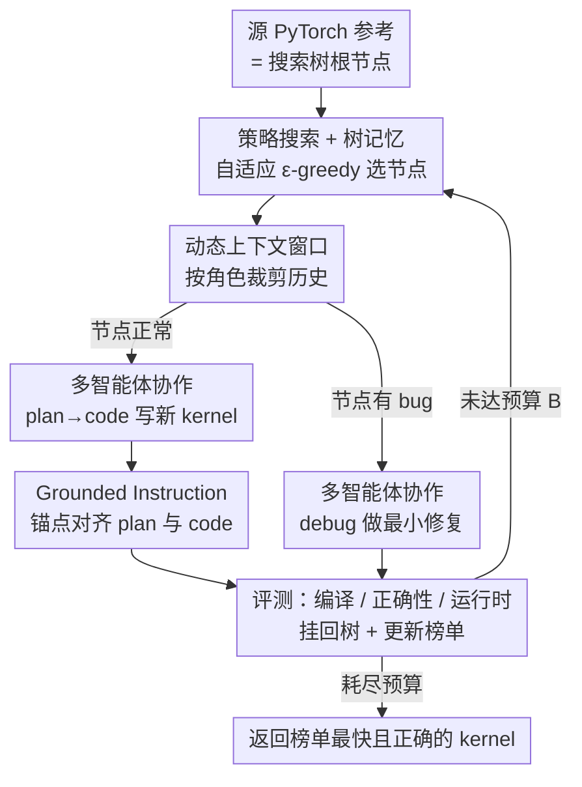

# STARK: Strategic Team of Agents for Refining Kernels

**会议**: ICLR 2026  
**OpenReview**: [https://openreview.net/forum?id=nWaZTH1JMx](https://openreview.net/forum?id=nWaZTH1JMx)  
**代码**: 无  
**领域**: Agent / LLM 代码生成 / GPU 内核优化  
**关键词**: 多智能体, GPU Kernel 优化, 策略搜索, 树记忆, KernelBench

## 一句话总结
STARK 把 GPU kernel 优化重构成「专业团队协作 + 在树记忆上做策略搜索」的智能体框架——用 plan/code/debug 三个分工的 LLM 智能体、带锚点的 grounded instruction、按角色定制的动态上下文窗口和自适应 ε-greedy 搜索，模拟资深工程师的迭代调优流程，在 KernelBench 上相比基线智能体最高拿到 16× 的运行时加速。

## 研究背景与动机

**领域现状**：GPU kernel（矩阵乘、卷积等底层算子的实现）的效率直接决定大模型的训练时长、推理延迟和部署成本，但写好一个 kernel 极难，需要在线程调度、内存层级、同步、硬件特性之间精细权衡。传统路线要么靠专家手工调优（有效但难规模化），要么靠 TVM / Triton 这类编译器和 DSL 用启发式 + 搜索（对不规则算子和硬件差异常常力不从心）。LLM 的崛起带来了新机会：它不仅能生成正确代码，还能被引导着推理硬件 trade-off、吸收 profiling 反馈、迭代改写实现。

**现有痛点**：但已有工作大多把 LLM 当成「一次性代码生成器」或「朴素的逐轮 refine 工具」，没把它在 kernel 设计空间里做结构化探索的潜力发挥出来。作者具体点出三个症结：

**核心矛盾**：（1）**探索策略幼稚**——现有 agent 线性地 refine 代码，每次只从上一次尝试学习，忽略了大量历史尝试的信息，无法平衡探索-利用，容易困在局部最优；（2）**单体 agent 设计**——kernel 优化需要规划、实现、反思等截然不同的能力，全压在一个通才 LLM 身上效率低下，而且规划要高温（鼓励多样策略）、写代码要低温（保证精确）这对矛盾，单个固定温度的 agent 根本同时照顾不了；（3）**规划-实现鸿沟**——LLM 经常能想出正确的高层优化方案（如「做 memory tiling」），却写不出对应的合法 CUDA 代码，因为训练语料里专家级 kernel 代码太稀缺。

**本文目标**：让 LLM agent 像专家团队一样，系统地探索 kernel 设计空间，既能写出正确 kernel，又能真正把运行时压下来。

**切入角度**：把整个优化过程类比成一支工程团队的工作流——有人负责出策略、有人负责精确落地、有人负责修 bug，并在一个持久化的「尝试树」上做有方向的搜索，而不是盲目采样或近视地逐轮修改。

**核心 idea**：用「分工的多智能体 + 树记忆上的策略搜索 + 把高层指令锚定到具体代码片段」来替代单体 LLM 的线性 refine，让规划和实现各司其职、历史尝试被充分复用。

## 方法详解

### 整体框架

STARK 把 kernel refinement 组织成三层：（i）一个把规划、写码、调试拆开的**多智能体工作流**；（ii）两个协调机制——把规划好的改动**锚定到具体代码片段的 grounded instruction**、以及给每个 agent 呈现角色专属历史的**动态上下文窗口**；（iii）在迭代尝试间平衡探索与利用的**策略搜索**。整个系统维护一棵搜索树 $T$：根节点是源 PyTorch 参考实现，每条边对应「plan agent 发一条 grounded instruction → code agent（或 debug agent）把它实现成新 kernel」，每个节点存着候选 kernel 及其观测（运行时、正确性、编译诊断）。节点分数 $s(n)$ 直接取 kernel 运行时（越低越好），编译失败或不正确的 kernel 记为 $+\infty$。

主循环重复执行：用策略选一个有希望的节点 → 为各 agent 构建上下文窗口 → plan agent 提出优化并插入锚点 → code agent 把锚点实现成可执行 kernel（若选中节点本身有 bug，则改走 debug agent 做最小修复）→ 评测正确性与运行时 → 作为子节点接回树上、更新榜单 $C$，直到耗尽预算 $B$ 次尝试，最后返回榜单里最快且正确的 kernel。

### 关键设计

**1. 多智能体协作：让规划、写码、调试各用各的温度与角色**

针对「单体 agent 既要高温探索又要低温精确、顾此失彼」的痛点，STARK 把 kernel 优化拆成 plan / code / debug 三个角色。plan agent 基于角色专属上下文，针对源 kernel 或搜索策略选出的候选提出有的放矢的变换（如 fusion、向量化、shared-memory tiling），并发出带锚点的 grounded instruction；code agent 消费这些指令、把它落成可执行的 GPU kernel；debug agent 则对「有希望但失败」的候选，结合 plan 的指令和编译/运行时诊断做修复。论文的实例化里三个角色都用 Claude Sonnet 4，但 plan agent 取温度 $\tau=0.8$ 鼓励策略多样性，code 和 debug agent 取 $\tau=0.1$ 强制精确——这正是 3.1 节指出的「规划/探索需要高温、实现/事实正确需要低温」这对矛盾的直接解法。模块化还带来两个附带好处：可以单独给某个角色（如 code agent）做针对性微调而不影响其他角色，也能换上更强的 planner 或代码专精模型。

**2. 树记忆上的策略搜索：用自适应 ε-greedy 替代盲目采样与近视 refine**

针对「best-of-K 盲目浪费、迭代 refine 近视困在局部」的痛点，STARK 把优化重构成在持久化搜索树上的策略搜索。每步做四件事：按策略选一个节点扩展、调用 plan/code（或 debug）产生子候选、评测正确性与运行时、把结果记回树以指导后续选择。作者对比了 MCTS、进化、贪心、ε-greedy 等策略，发现在同等预算下 **ε-greedy 一致最优**。但 kernel 优化有两个领域特性——**根节点统治**（连超过源实现都很难）和**频繁的编译/运行时失败**——于是把经典 ε-greedy 改造成四条规则：（1）**根节点限流**：把根的直接子节点数上限设为 $n_{root}$，达到后根不再可选，避免重复的「第一跳」编辑；（2）**死枝剪枝**：若某节点子节点数超过 $n_{child}$ 且当前全失败，标记为不可选，省掉无谓试错；（3）**高探索率**：用较大的 $\epsilon$（经验上 $0.3$–$0.4$）对抗局部陷阱；（4）**叶偏探索**：以概率 $\epsilon$ 从所有可扩展叶子（不只失败节点）里均匀采样，鼓励跳出当前失败集去发现新方向。

**3. Grounded Instruction：把高层方案锚定到具体代码片段，弥合规划-实现鸿沟**

针对「LLM 能想对方案却写不对 CUDA」的核心鸿沟，plan agent 不仅要提出优化，还必须在 kernel 源码里插入显式的 span 锚点，用机器可校验的标签（如 `<<<IMPROVE BEGINS>>> ... <<<IMPROVE ENDS>>>`）把目标位置——某次 load/store、某个循环体、或 launch 配置——精确框住。code agent 拿到这份带标注的骨架，逐个锚点填入实现该指令的具体 CUDA 代码。这样做收紧了 plan 与 code 的对齐、抑制了凭空乱指挥的幻觉、缩小了 coder 的搜索空间，还提升了可追溯性——每条提议都在最终代码里留下可见、可验证的痕迹。论文观察到误解更少、坏 kernel 明显减少，且该机制在结构更深的 Level 3 任务（如 VGG）上尤其有效。

**4. 动态上下文窗口：按角色裁剪历史，各取所需**

历史尝试蕴含丰富信号，但不同 agent 需要看到的「视图」不同，于是 STARK 在每次选节点 $i$ 时为各 agent 重建专属上下文窗口 $W(i)$（始终包含根节点 $n_{root}$，因为源架构总要作为提示的一部分）。设 $p(i)$ 为父节点、$S(i)$ 为兄弟集合、$D(i)$ 为子节点集合，并维护一个小型全局榜单 $C$。**plan agent** 用局部 + 对比性全局上下文 $W_{plan}(i) = \{i, n_{root}\} \cup D(i) \cup \text{Top-}r(C)$：$D(i)$ 让它能反思和叠加自己先前的指令、并据此估计 code agent 的实现能力从而下达力所能及的指令；$\text{Top-}r(C)$ 提供强竞争者作为「野心校准」，搬运 warp-shuffle reduction、向量化 LD/ST、shared-memory tiling 等可迁移套路。**code agent** 用扩展上下文 $W_{code}(i) = \{i, n_{root}\} \cup D(i) \cup \{j : p(j) \in S(i)\}$，把「兄弟节点的子节点」纳入——它们往往与 $i$ 共享几乎相同的骨架，成功补丁和微优化能高概率迁移，相近上下文里的失败也帮 coder 避坑。**debug agent** 用局部上下文 $W_{debug}(i) = \{i, n_{root}\} \cup S(i)$：大多数修复是结构性且局部的（越界保护、stride/索引对齐、launch 参数微调、shared-memory 尺寸），在共享骨架的兄弟间直接可迁移，限定到 $S$ 也避免无关 kernel 分散调试 agent 的注意力。

### 损失函数 / 训练策略
STARK 不做任何训练，是纯推理期的智能体框架。所有 agent 都基于现成 Claude Sonnet 4，差异只体现在角色提示词与采样温度（plan $\tau=0.8$、code/debug $\tau=0.1$）以及搜索预算 $B$（实验中每个任务最多 30 次尝试）。框架的模块化使得「给某个角色单独做针对性后训练」成为可能，但作者把系统性的 agent 专属后训练留作未来工作。

## 实验关键数据

评测基准为 **KernelBench**：给定 PyTorch 参考实现，要求生成功能等价、运行时更短的自定义 GPU kernel，分三个难度——Level 1（单算子，如矩阵乘/卷积）、Level 2（多算子融合进单 kernel）、Level 3（ResNet/LSTM 等完整架构）。基线包括 Torch Eager、`torch.compile`（default / max-autotune）、Sampling Agent（KernelBench 原配单 agent，反复采样取最优）和 Reflexion Agent（按 Reflexion 范式逐轮用观测更新上一次尝试）。三项指标：**Success rate**（能编译且正确的比例）、**Fast1 rate**（生成 kernel 至少和 Torch baseline 一样快的比例）、**Speed**（baseline 运行时 / 生成 kernel 运行时的平均比）。所有 LLM agent 都用 Claude Sonnet 4，预算 $B=30$。

### 主实验

相对 Torch Eager 基线的对比（Success / Fast1 / Speed）：

| 难度 | 方法 | Success ↑ | Fast1 ↑ | Speed ↑ |
|------|------|-----------|---------|---------|
| Level 1 | Sampling Agent | 57.1% | 14.3% | 0.81× |
| Level 1 | Reflexion Agent | 92.6% | 28.6% | 1.24× |
| Level 1 | **STARK** | **100%** | **71.4%** | **3.03×** |
| Level 2 | Sampling Agent | 87.5% | 50% | 1.06× |
| Level 2 | Reflexion Agent | 100% | 75% | 0.88× |
| Level 2 | **STARK** | **100%** | **100%** | **2.69×** |
| Level 3 | Sampling Agent | 100% | 50% | 0.87× |
| Level 3 | Reflexion Agent | 67.5% | 25% | 0.79× |
| Level 3 | **STARK** | **100%** | **87.5%** | **1.58×** |

STARK 在三个难度都拿满或接近满的 Success rate，且 Speed 全面超过 1×（基线常常生成比 Torch 还慢的 kernel，如 Reflexion 在 Level 2/3 的 Speed < 1×）。相对基线 agent 的运行时加速（图 1）更夸张：Level 1 相比 Sampling 超 10×、相比 Reflexion 13.7×；Level 2 最高 16×；Level 3 仍维持 5–6×。

编译率与正确率分解（表 2）解释了 STARK 为何赢：各 agent 编译率大多 > 80%，但「既能编译又正确」的比例差异巨大——Sampling 在 Level 1 编译率超 90% 却只有 43% 正确，Reflexion 各难度正确率都 < 55%，而 STARK 全面最高，Level 2 达 61.2%、Level 3 达 35.5%，说明结构化规划 + 反馈驱动 refine 显著减少了无效/错误尝试的浪费。

### 消融实验

在 Level 3 上拆解两个智能体组件（相对 Torch Eager）：

| 配置 | Fast1 ↑ | Speed ↑ | 说明 |
|------|---------|---------|------|
| Sampling Agent | 50% | 0.87× | 基线 |
| Search Agent | 67.5% | 0.89× | 单 agent + 策略搜索 |
| MA-Only | 67.5% | 1.11× | 多智能体工作流 + best-of-K（无搜索） |
| **STARK** | **87.5%** | **1.58×** | 完整模型 |

### 关键发现
- 策略搜索和多智能体工作流**单独用都比 Sampling 基线强**，但二者组合（STARK）效果叠加最明显——策略搜索能利用多智能体产生的结构化提议，拿到最大增益。
- STARK 的优势随任务难度上升更突出：Level 1 已大幅领先，到 Level 2/3 基线开始崩（成功率掉、运行时跌破基线），STARK 仍保持满成功率且持续加速。
- 真正拉开差距的不是「能不能写对」，而是「写对的同时能不能真快」——基线偶尔正确却很少真正提速，STARK 把正确性和运行时两个 gap 同时补上。

## 亮点与洞察
- **把「温度」当成 agent 分工的一等设计变量**：plan 高温探索、code/debug 低温精确，用同一个底座模型靠温度差就实现了角色专精，简单却直击单体 agent 的核心矛盾。
- **grounded instruction 用一对文本锚点弥合规划-实现鸿沟**：让 LLM 的高层方案在源码里「指哪打哪」，既抑制幻觉又留下可验证痕迹，是个低成本、可迁移到任何「方案易想、落地难写」场景的 trick。
- **针对领域特性改造 ε-greedy**：根节点限流、死枝剪枝、高探索率、叶偏探索这四条，都是从「根统治 + 频繁失败」这两个 kernel 优化独有的观察反推出来的，比直接套通用搜索策略更对症。
- **动态上下文窗口按树关系裁剪历史**：plan 看子节点 + 全局榜、code 看堂兄弟节点、debug 只看兄弟，三种视图各自对应「反思/校准能力、迁移成功补丁、局部修复」的需求，是把「该给 agent 看什么历史」做精细化的好范例。

## 局限与展望
- 受算力限制，实验只在 KernelBench 的**代表性子集**上评测、每任务预算 $B=30$，更大规模、更长预算下的表现未充分验证。
- 当前实例化只用了单一底座模型（Claude Sonnet 4）和单一硬件，跨硬件架构、跨算子类别、跨 kernel 调度的泛化是作者明确点出的未来方向。
- 作者自承「代码合成保真度」仍是主要瓶颈——LLM 常需多次尝试才能忠实实现一条指令；agent 专属后训练（如专门微调 code agent）被列为正交的未来工作，尚未做系统研究。
- 节点分数直接用运行时、失败一律记 $+\infty$ 的设计简单有效，但对「接近成功的失败」缺乏更细的信用分配，可能让搜索浪费在反复试探难度过高的分支上。

## 相关工作与启发
- **vs Sampling Agent（best-of-K）**: 它独立采样多个候选取最快的，完全不利用历史反馈、反复探测冗余区域；STARK 在树记忆上做反馈驱动的策略搜索，把试错变成有方向的过程。
- **vs Reflexion Agent（迭代 refine）**: 它每步只基于最近一次尝试做更新，感知反馈但近视、易困在窄的次优盆地；STARK 通过树记忆 + 动态上下文窗口让全局历史和兄弟分支都能被利用。
- **vs TVM / Triton 等编译器与 DSL**: 它们靠静态启发式或搜索，对不规则算子和硬件差异常失效；STARK 直接在源码层做结构化改写，借 LLM 的代码推理能力处理不规则性。
- **vs AlphaTensor 等 RL 发现新算法**: 那类工作在固定搜索空间或纯形式化域里操作；STARK 直接作用于源代码、实现新颖的结构性改动。

## 评分
- 新颖性: ⭐⭐⭐⭐ 把多智能体分工、grounded instruction、动态上下文、领域定制 ε-greedy 搜索系统性地组合用于 kernel 优化，单点都不算全新但整合切中三大痛点。
- 实验充分度: ⭐⭐⭐⭐ 三难度 + 多基线 + 编译/正确率分解 + 消融齐全，但受算力限只在子集上、单硬件单模型评测。
- 写作质量: ⭐⭐⭐⭐ 痛点→机制→设计的逻辑清晰，图表对应工整，符号定义到位。
- 价值: ⭐⭐⭐⭐ kernel 优化是 AI 基础设施核心问题，最高 16× 加速和满成功率有实际意义，框架模块化也易扩展。

<!-- RELATED:START -->

## 相关论文

- [\[ICLR 2026\] AutoFigure: Generating and Refining Publication-Ready Scientific Illustrations](autofigure_generating_and_refining_publication-ready_scientific_illustrations.md)
- [\[ICLR 2026\] Dancing in Chains: Strategic Persuasion in Academic Rebuttal via Theory of Mind](dancing_in_chains_strategic_persuasion_in_academic_rebuttal_via_theory_of_mind.md)
- [\[ICLR 2026\] Presenting a Paper is an Art: Self-Improvement Aesthetic Agents for Academic Presentations](presenting_a_paper_is_an_art_self-improvement_aesthetic_agents_for_academic_pres.md)
- [\[ICLR 2026\] Language Agents for Hypothesis-driven Clinical Decision Making with Reinforcement Learning](language_agents_for_hypothesis-driven_clinical_decision_making_with_reinforcemen.md)
- [\[ICLR 2026\] Opponent Shaping in LLM Agents](opponent_shaping_in_llm_agents.md)

<!-- RELATED:END -->
