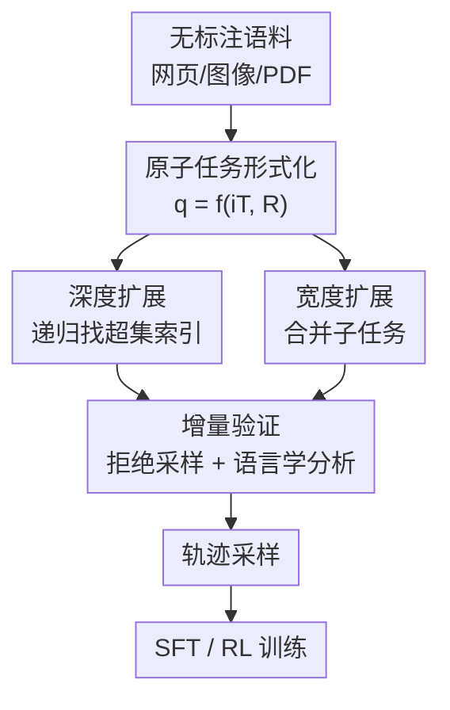

# TaskCraft: Automated Generation of Agentic Tasks

**会议**: ICLR 2026  
**OpenReview**: [https://openreview.net/forum?id=UJFCyrYM1V](https://openreview.net/forum?id=UJFCyrYM1V)  
**代码**: https://github.com/OPPO-PersonalAI/TaskCraft  
**领域**: Agent  
**关键词**: agentic 任务生成, 工具调用, 多跳推理, 拒绝采样, 难度可控

## 一句话总结
TaskCraft 提出首个全自动生成可扩展、多工具、可验证 agentic 任务的工作流：先造单工具"原子任务"，再用深度（递归找超集）和宽度（合并子任务）两种扩展逐步加难，配合只验证增量改动的高效验证，最终产出 41k 工具密集型任务，用它做 SFT/RL 训练在四个 agent benchmark 上刷到 SOTA。

## 研究背景与动机

**领域现状**：agentic 任务（需要多步问题求解 + 工具调用 + 自适应推理）正成为 NLP/AI 的核心评测对象，GAIA、BrowseComp、HLE 等 benchmark 推动了 agent 评估。

**现有痛点**：这些 benchmark 的规模被人工标注成本死死卡住——HLE 动用 1000 名专家才标出 2500 道题，根本没法大规模扩展。而过去用 LLM 自动造数据的工作（如 Self-Instruct）主要面向静态的指令跟随场景，造出来的 query 不需要与外部工具和环境交互，因此不足以训练或评测真正在动态环境里跑的 agent。

**核心矛盾**：要训练强 agent 需要海量、难度可控、且"必须用工具才能解"的任务，但人工标注既贵又不可扩展，纯 LLM 生成又造不出真正依赖工具链执行的任务。

**本文目标**：设计一个能自动、可扩展地生成"链式工具执行（chain-of-tool）"agentic 任务的工作流，并保证任务难度可调、确实需要工具、且可验证。

**切入角度**：作者先把一次工具调用抽象成一个最小结构——给定任务 $q$，工具执行分两步：定位输入索引 $i_T$（如某只股票的数据网页），再在其上执行工具 $T$ 得到上下文 $C$，最后 LLM 在 $C$ 上施加任务指定的关系 $R$（如"涨幅最高"）推出答案 $a$。于是一个 agentic 任务可被最小地定义为一对 $(i_T, R)$。

**核心 idea**：把任务写成 $q = f_q(i_T, R)$ 这一可参数化形式后，"加难度"就变成对 $i_T$ 和 $R$ 做结构化扩展——深度方向递归地把 $i_T$ 替换成需要再查一跳才能得到的子任务，宽度方向把多个任务拼起来，再用"只验证新增部分"的增量检查保证效率。

## 方法详解

### 整体框架

TaskCraft 是一条三阶段流水线：**生成原子任务 → 渐进扩展加难 → 高效验证**。起点是一批无标注语料（网页 75%、图像 15%、PDF 10%）；从中抽取输入索引 $i_T$，用工具执行得到文本上下文 $C$，让 LLM 从 $C$ 里挑候选答案 $a$ 并反推它与 $C$ 的关系 $R$，据此构造原子任务 $q = f_q(i_T, R)$。原子任务通过单次工具调用即可解决，是后续一切复杂任务的"种子"。

拿到原子任务后，沿两个正交方向加难：**深度扩展**把单跳任务递归延长成多跳（每一跳依赖上一跳的输出），**宽度扩展**把多个子任务合并成需要拆解才能完成的复合任务。每次扩展后立即做验证——但关键在于只对"新增的那部分"做验证，而非把整个扩展后任务重跑一遍。验证通过的任务再用现成 agent 工作流采样执行轨迹（trajectory），最终既能直接当 benchmark，也能喂给 SFT 和 RL 训练。

### 关键设计

**1. 原子任务形式化：把"一次工具调用"拆成可参数化的 (索引, 关系)**

直接让 LLM "给定答案造问题"会造出工具调用率低、难度不可控、工具需求不规范的烂任务（见原文 4.4 的对照实验）。TaskCraft 的关键是把任务显式参数化为 $(q, a) = (f_q(i_T, R), a)$：$i_T$ 是工具的输入索引（论文标题、歌名、PDF 文件名这类专有名词），$R$ 是在工具返回的上下文 $C$ 上要施加的关系。由于答案 $a$ 依赖于检索到的上下文 $C$，工具必须先被执行才能推出答案——这从结构上保证了任务"非用工具不可"。生成时假设一个理想检索引擎能基于 $i_T$ 精确取回数据，于是问题被规约为：从语料抽 $i_T$、执行工具得 $C$、LLM 从 $C$ 选答案并反推 $R$、最后由 $f_q$ 把 $i_T$ 与 $R$ 组装成自然语言问题 $q$。这种"先有结构、再生成语言"的做法，比"先生成语言再碰运气"稳定得多：消融显示带 $i_T$/$R$ 的结构化生成 pass rate 43.0% vs 纯 LLM 18.5%，且工具调用更少更稳（方差 $\sigma^2$ 0.4 vs 1.2）。

**2. 深度扩展：用"找超集"的可逆操作把单跳递归拉成多跳**

深度扩展要造出需要多次顺序工具执行、每步依赖前一步输出的任务。难点是怎样在不引入循环引用的前提下，把一个 $n$-hop 任务 $(q_n, a)$ 延长成 $(n{+}1)$-hop。作者的做法是先找一个中间子任务 $(\hat{q}_{n+1}, i_T^n) = (f_q(i_T^{n+1}, R_{n+1}), i_T^n)$：让一个 search agent 在网上或文件系统里搜出当前索引 $i_T^n$ 的**超集** $i_T^{n+1}$（如把"一句歌词片段"扩成"整首歌的标题"），之所以特意找超集而非任意相关项，是为了降低生成回环的风险。search agent 取回超集的完整内容 $C$ 后，LLM 分析出超集与原索引的关系 $R_{n+1}$（如"该片段是歌词第三行"）。最后用递归式 $(q_{n+1}, a) = f_m(q_n, \hat{q}_{n+1}, i_T^n)$ 把原任务 $q_n$ 里的 $i_T^n$ 替换成这个新子任务，得到更深一跳的问题。这样每加一跳就把一个显式可定位的实体藏到"需要再查一次才能浮现"的位置，难度沿深度方向稳步累积，而答案 $a$ 始终保持不变、可验证。

**3. 宽度扩展：把多个独立子任务合并成需要拆解的复合任务**

宽度扩展走的是另一条路——不加深推理链，而是增加并行的子任务数。对两个子任务 $q_1 \to a_1$、$q_2 \to a_2$，合并任务表示为 $(q_{width} = q_1 + q_2) \to a_1 + a_2$，其中 $+$ 表示用 LLM 把两个问题串合并、改写成一道读起来连贯的复合题（如把"Apple Q1 2025 EPS 是多少"和"同期 P/E 是多少"合成一句话同时问两个指标）。解题者必须把复合题重新拆成多个子任务、分别调用工具、再汇总答案。深度扩展和宽度扩展正交组合，让 TaskCraft 能在"推理深度"和"任务广度"两个维度上自由调节难度，覆盖从简单到超出生成 agent 自身能力的广谱任务。

**4. 增量验证：只验证新增部分，agent 推理只在原子层出手**

逐次扩展若每步都把整个任务跑一遍验证，成本会随跳数爆炸。TaskCraft 把验证拆成两相、且只检查增量。**原子任务验证**：放宽"单次调用"的定义，给 task agent 有限步数（如 3 步）解题，同时让一个不带工具的 infer-LLM 单独作答，再由 judge-LLM 判定——只有"带工具的 agent 答对、纯 LLM 答错"的任务才保留，这种拒绝采样确保任务真正依赖工具而非靠记忆。**扩展验证**：完全靠语言学分析、不再调 agent——judge-LLM 检查 ① 新索引 $i_T^{n+1}$ 与关系 $R_{n+1}$ 是否构成 $i_T^n$ 的合法超集、逻辑自洽，② 原任务里的 $i_T^n$ 是否被 $\hat{q}_{n+1}$ 正确替换；同时 infer-LLM 先把合并后任务解一遍，judge-LLM 据此过滤掉"合并后答案太容易被直接推出"的任务，防止信息泄漏让任务变得 trivial。整套框架只在"创建原子任务"时动用昂贵的 agent 推理，其余环节都用更快的 LLM 语言分析，既保证效率，又能生成超出 agent 自身能力的复杂任务——而反向推理过程本身又为 agent 学习/RL 提供了监督信号。

### 一个完整示例

以 figure 5 里的一道生成任务为例，看深度扩展和验证怎么串起来。最终任务是："对于那部以夏威夷为背景、讲述外星实验生物与家庭羁绊的经典迪士尼动画，它的真人版衍生电影何时正式上映？"——表面只有一个问题，实则要走两跳：
- 第一跳：先解出"这部经典迪士尼动画是什么？"→ 答案 *Lilo & Stitch*（这是被藏起来的中间索引 $i_T$）；
- 第二跳：再查"*Lilo & Stitch* 真人版何时上映？"→ 答案 2025 年 5 月 23 日。

构造时，原子任务原本是"*Lilo & Stitch* 真人版何时上映"（索引就是片名）；深度扩展把"片名"这个显式索引替换成"以夏威夷为背景、讲外星实验生物的迪士尼动画"这个需要再查一跳才能定位的描述（即把 $i_T$ 换成子任务 $\hat{q}$）。验证阶段先确认这个描述确实唯一指向 *Lilo & Stitch*（合法超集替换），再确认合并后答案不会被一眼看穿，任务才被保留。读者由此能看到：一道看似单句的题，背后是"索引被递归藏深"的结果。

### 损失函数 / 训练策略

任务生成本身不涉及训练 loss。下游训练里，作者基于工具集成推理（TIR）模型——LLM 输出带 `<tool>`/`<observation>`/`<think>` 等显式标签来组织推理流并触发工具调用。SFT 用 Oagents 为每道任务采样解题轨迹并转成 TIR 格式；RL 阶段采用 DAPO 继续训练。为排除"涨点只是学会了输出格式"，对照组用同量的多跳 QA 数据（MHQA，含 HotpotQA、NQ）。此外用 bootstrap few-shot（DSPy 风格）优化四个关键 prompt（原子任务答案抽取、深度扩展找下一索引、生成可唯一推导的关系 $R_{n+1}$、合并扩展任务），以最大化通过率/推理跳数。

## 实验关键数据

### 主实验

下游 agent 训练在 GAIA / WebWalker / BrowserComp / HLE 上的表现（Qwen-2.5-32B-Instruct 组节选）：

| 训练数据 | 范式 | GAIA(%) | WebWalker | BrowserComp | HLE |
|----------|------|---------|-----------|-------------|-----|
| 5k MHQA | SFT | 38.8 | 36.8 | 5.6 | 10.8 |
| 7.5k MHQA | SFT | 42.7 | 41.6 | 5.8 | 12.6 |
| 7.5k TaskCraft | SFT | 60.2 | - | 22.4 | 20.2 |
| 5k MHQA + 2.5k TaskCraft | SFT | 60.2 | - | 21.0 | 20.0 |
| 5k MHQA + 2.5k TaskCraft + 8k TaskCraft | SFT+RL | **60.8** | - | **24.8** | **20.6** |

同量替换下，把 2.5k MHQA 换成 2.5k TaskCraft 带来 5–16× 的更大增益；纯 SFT 的 TaskCraft 模型已能追平依赖 SFT+RL 的 SOTA 系统。在 7B 组上，TaskCraft 训出的 Qwen-2.5-7B 在 WebWalker 上甚至超过更大的 QwQ-32B。

### 消融实验

工具上下文（$i_T$/$R$）对原子任务生成的有效性（Table 4）：

| 配置 | Pass rate | 耗时 | 平均工具调用 | 调用方差 $\sigma^2$ |
|------|-----------|------|--------------|----------------------|
| LLM only（无 $i_T$/$R$） | 18.5% | 119.7s | 2.8 | 1.2 |
| Ours（结构化） | **43.0%** | **86.7s** | 2.1 | **0.4** |

Prompt learning 对生成效率的提升（Table 2）：原子任务 pass rate 54.9%→68.1%（耗时还降了）；深度扩展@6 通过率 41.0%→51.2%。

### 关键发现
- **结构化生成是效率与质量的关键**：显式引入 $i_T$/$R$ 把原子任务 pass rate 翻倍（18.5%→43.0%）、耗时降 ~28%、工具调用方差从 1.2 压到 0.4，说明纯 LLM 造 agentic 任务既低效又不稳。
- **TaskCraft 数据远胜同量 QA 数据**：同样 2.5k 规模，TaskCraft 带来 5–16× 于 MHQA 的增益，证明"必须用工具才能解"的任务对 agent 能力的训练价值远高于普通多跳 QA。
- **难度随模态递增且可扩展**：agent 在网页任务上表现尚可，但 PDF 抽取、图内信息理解的失败率显著更高，说明生成任务确实覆盖了从易到超出当前 agent 能力的广谱难度；训练集从 1k→3k→5k，GAIA-103 Pass@3 从 17.5%→31.1%→39.8%，呈清晰上升趋势。

## 亮点与洞察
- **把"加难度"变成对 $(i_T, R)$ 的结构操作**：深度=递归藏索引、宽度=拼接子任务，难度因此可编程、可扩展，而非靠 prompt 玄学，这套抽象很优雅且可迁移到其它需要"难度可控数据"的场景。
- **"找超集"防回环**：深度扩展特意搜当前索引的超集而非任意相关项，是个朴素却有效的防循环引用 trick。
- **拒绝采样定义"工具必要性"**：只保留"带工具 agent 答对、纯 LLM 答错"的任务，用一个简单判据从根上保证了数据的 agentic 属性，可直接复用到任何想筛"真需要工具"任务的 pipeline。
- **增量验证省算力**：扩展验证全程不调 agent、只做语言学分析，把昂贵的 agent 推理仅留给原子层，这是让"逐跳加难"在成本上可行的核心。

## 局限与展望
- **依赖理想检索假设**：原子任务生成假设存在一个能基于 $i_T$ 精确取回数据的理想搜索引擎，真实噪声检索下质量可能打折。
- **judge/infer-LLM 的可靠性上限**：扩展验证完全靠 LLM 语言分析，超集合法性、信息泄漏判断都受限于裁判模型本身的能力，人工评估里深度扩展仍有 8.5% 非超集、原子任务 11.7% 信息泄漏。
- **模态难度不均**：图内/PDF 理解类任务失败率高，生成-验证在这些模态上的稳定性还有提升空间。
- **可改进方向**：把验证从纯语言分析升级为轻量工具核验、引入更强的去泄漏机制、或把难度控制做成可显式指定目标跳数/工具组合的接口。

## 相关工作与启发
- **vs Self-Instruct**：Self-Instruct 用 LLM 批量造指令数据，但面向静态指令跟随、不涉及工具与环境交互；TaskCraft 专造"链式工具执行"任务，结构上强制工具必要性，填补了 agentic 数据的空白。
- **vs GAIA / BrowseComp / HLE**：这些是人工标注的高质量 benchmark，胜在权威但规模受标注成本限制（HLE 1000 专家标 2500 题）；TaskCraft 用自动化把规模拉到 41k，定位是可扩展的训练/评测数据来源而非精标 benchmark。
- **vs WebSailor / WebDancer / Search-o1 等 agent 系统**：它们聚焦于更强的 agent 工作流/推理，本文聚焦上游的"任务数据怎么造"，两者互补——用 TaskCraft 数据训练这些 TIR 模型即可进一步刷到 SOTA。

## 评分
- 新颖性: ⭐⭐⭐⭐⭐ 首个面向链式工具执行的自动 agentic 任务生成工作流，$(i_T,R)$ 抽象 + 深度/宽度扩展 + 增量验证组合很新。
- 实验充分度: ⭐⭐⭐⭐ 覆盖四个 benchmark、多模型多尺度、含人工评估与多个消融，唯独 RL 部分对照略稀疏。
- 写作质量: ⭐⭐⭐⭐ 抽象清晰、图示到位，部分扩展公式记号稍密。
- 价值: ⭐⭐⭐⭐⭐ 产出 41k 可用任务并显著提升 agent 能力、刷到 SOTA，对训练数据稀缺的 agent 领域价值高。

<!-- RELATED:START -->

## 相关论文

- [\[ICLR 2026\] ToolACE-MT: Non-Autoregressive Generation for Agentic Multi-Turn Interaction](toolace-mt_non-autoregressive_generation_for_agentic_multi-turn_interaction.md)
- [\[ICLR 2026\] VitaBench: Benchmarking LLM Agents with Versatile Interactive Tasks in Real-world Applications](vitabench_benchmarking_llm_agents_with_versatile_interactive_tasks_in_real-world.md)
- [\[ICLR 2026\] MATHMO: Automated Mathematical Modeling Through Adaptive Search](mathmo_automated_mathematical_modeling_through_adaptive_search.md)
- [\[ACL 2026\] Supplement Generation Training for Enhancing Agentic Task Performance](../../ACL2026/llm_agent/supplement_generation_training_for_enhancing_agentic_task_performance.md)
- [\[ICLR 2026\] WebFactory: Automated Compression of Foundational Language Intelligence into Grounded Web Agents](webfactory_automated_compression_of_foundational_language_intelligence_into_grou.md)

<!-- RELATED:END -->
