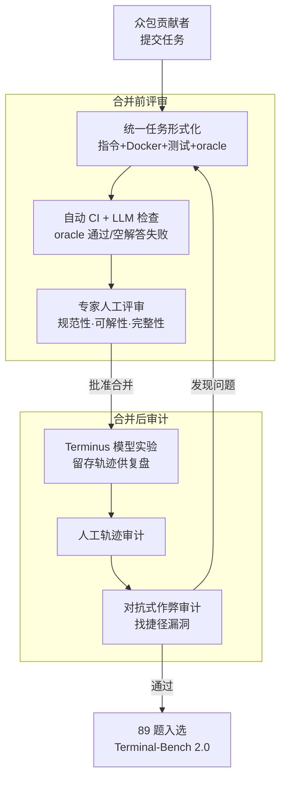

# Terminal-Bench：在命令行界面上对智能体进行困难、真实任务的基准测试

**会议**: ICLR 2026  
**OpenReview**: [https://openreview.net/forum?id=a7Qa4CcHak](https://openreview.net/forum?id=a7Qa4CcHak)  
**代码**: https://www.tbench.ai （数据与评测 harness 开源，实验配置见 github.com/laude-institute/terminal-bench-experiments）  
**领域**: Agent  
**关键词**: 智能体基准、命令行/终端、长程任务、Docker 沙箱、失败模式分析

## 一句话总结
Terminal-Bench 提出一个以"终端环境 + Docker 容器 + 测试验证 + oracle 解答"为单位的智能体评测框架，并发布经过数百人时人工审计的 89 道困难任务数据集 Terminal-Bench 2.0，结果显示即便最强的前沿模型/智能体（GPT-5.2 + Codex CLI）解决率也只有约 63%，小模型仅 15% 左右，并据此给出一套可指导后续改进的失败模式分类法。

## 研究背景与动机
**领域现状**：AI 智能体正在获得自主完成长程任务的能力，而终端（terminal）已经成为它们最常用的操作界面——Cursor、Codex CLI、Claude Code、Gemini CLI 都直接通过 `grep`、`find`、`cat` 等 shell 命令或自定义工具来读写文件、执行代码、检索网络。终端因其文本化、通用、强大的特性，承载了软件工程、科学计算、网络安全、机器学习等大量高技能、高价值的工作。

**现有痛点**：现有智能体基准要么不测真实世界任务（用合成环境、玩具问题），要么难度不足以区分前沿模型——很多 SWE 类基准已经被刷到很高分，无法再反映模型之间的真实差距。同时，很多基准只覆盖单一狭窄能力（如把自然语言翻译成 Bash、优化 shell 脚本、配置软件环境），不能体现终端工作的多样性与长程依赖。

**核心矛盾**：要"真实又困难"，任务就必须多样、长程、需要深领域知识——可这恰恰让任务的**正确性验证**变得极其困难：指令是否把所有可接受终态都描述清楚？测试是否真能捕捉这些终态？智能体会不会用现实中不存在的捷径"作弊"通过测试？多样性/真实性与可验证性之间存在天然张力。

**本文目标**：(1) 设计一个足够灵活、能表达困难长程任务的统一任务格式；(2) 构建一个经严格人工审计、对前沿模型仍然很难的数据集；(3) 在一个能解耦"模型能力"与"智能体脚手架"的公平设置下评测主流模型，并刻画它们的失败模式。

**切入角度**：把任务定义为"容器化环境 + 指令 + 测试 + oracle 解答"四元组，采用**结果驱动（outcome-driven）**验证——只检查容器最终状态是否满足要求，不检查智能体用了什么命令，从而既保证灵活性又能自动化判分。

**核心 idea**：用"真实终端里专业人士被付费完成的工作"作为任务来源，配合多轮人工 + LLM 审计保证可验证性，再用一个中性脚手架公平地把前沿模型逼到 65% 以下。

## 方法详解

### 整体框架
Terminal-Bench 不是一个模型，而是一个**任务规范 + 数据集 + 评测 harness**的三件套。最小单元是一道 task：它由一条自然语言指令（写在 `task.yaml`）、一个用 Dockerfile 构建的容器环境、一组验证测试（`tests/` + `run-tests.sh`）、一份人工编写的 oracle 解答（`solution.sh`）和一个时间限制组成。评测时，智能体被放进容器，只能看到指令和环境，通过反复调用工具（编辑文件、跑 Bash 命令）来探索和改变环境；任务结束后，把测试拷进容器执行，**只测最终容器状态的属性**（如某文件是否存在、程序输出是否与 COBOL 基线逐位一致），不测智能体的命令或控制台输出。这种结果驱动设计让每道题允许多种解法，也让 89 道题之外还能把 26 个已有基准适配进同一格式。

整个框架最重的不是"跑题"，而是**怎么把一道众包来的题审计到可信**。作者用一条多阶段、带"合并前评审 + 合并后审计"两相的流水线来保证每道题的规范性、可解性和防作弊性：

最终从 93 名贡献者提交的 229 道题里，挑出 89 道进入 Terminal-Bench 2.0。这些题平均每道经历约 3 小时的多人评审，合计数百人时。评测阶段，作者用 Harbor harness 在 Daytona 沙箱里并行跑 32–100 个容器，对 6 个智能体 × 16+ 前沿模型共做了 32,155 次 trial（每个模型-智能体组合至少跑 5 遍）。

### 关键设计

**1. 结果驱动的任务形式化：让"困难且多样"的任务也能自动判分**

基准的根本张力是真实任务千差万别、解法不唯一，难以写出标准答案逐字比对。Terminal-Bench 的解法是把每道题定义为"指令 + Docker 容器 + 测试 + oracle 解答 + 时限"五件套，并且**测试只检查容器终态、不检查过程**：智能体爱怎么做都行，只要最后容器状态满足指令描述的所有结果即可通过。这把"判对错"从"比对命令序列"降维成"检查终态属性"，于是既能容纳"把 COBOL 程序用 Python 重写到输入输出逐位一致""从源码编译并运行 Linux""逆向二进制文件"这种解法发散的题，又能完全自动化。oracle 解答的作用不是判分，而是证明任务**可解**（跑一遍能让所有测试通过）；空操作的"假"智能体则必须失败，用来排查测试过松。正是这种灵活规范，让作者还能把 26 个已有基准统一适配进 Harbor 格式。

**2. 多轮人工 + 对抗式审计的数据集构建：把"可验证性"当成一等公民**

众包任务最大的隐患是规范不严：指令没说清所有可接受终态（specificity）、根本无解（solvability）、或留有现实中不存在的作弊捷径（integrity，例如 git 任务里没删掉未来 commit，智能体直接偷看未来状态）。作者为此设计了两相流水线（见框架图）：合并前是自动 CI（跑 oracle 确认可解、跑空解答确认不会误判）+ 贡献者自查清单 + LLM 找常见错误 + 专家人工评审；合并后还要做人工轨迹审计和**对抗式作弊审计**——专门派一个"作弊智能体"去找能绕过测试的漏洞，再由审计员逐一核实。任何一关发现问题就打回重修。这套流程平均每题约 3 reviewer-hours、整体数百人时，是论文反复强调的"困难基准最该投入"的地方：作者在结论里直接呼吁后续数据集策划者也要在人工验证上下重注。

**3. Terminus 2 中性脚手架 + Harbor harness：解耦模型能力与智能体工程**

交互式基准有个公平性陷阱：很多智能体脚手架是为特定模型量身调过的（尤其模型和脚手架出自同一家公司），直接比"模型 A+脚手架 A"和"模型 B+脚手架 B"分不清是模型强还是工程强。作者造了 Terminus 2 作为中性测试床——它只有一个工具（无头终端），全程只用 Bash 命令完成任务，从而在同一最简脚手架下横向比模型。评测时既报告每个模型在其"最适配脚手架"下的最高分（图 1），也用 Terminus 2 统一比较。配套的 Harbor 是一个可规模化运行智能体评测的框架，Terminal-Bench 2.0 以 Harbor 任务格式分发，一行 `harbor run -d terminal-bench@2.0` 即可复现。借助这套解耦，作者得出一个有用结论：**模型选择通常比脚手架选择更重要**（Codex CLI 从 GPT-5-Nano 换成 GPT-5.2 解决率提升 52 个百分点；Gemini-2.5-Pro 从 OpenHands 换成 Terminus 2 只提升 17 个百分点）。

**4. 双层失败模式分类法：把"为什么失败"做成可指导改进的诊断**

光有分数不够，作者还要告诉模型/智能体开发者"该往哪改"。于是做了两套互补的错误分析。**轨迹级**：基于 MAST 多智能体失败分类法精简出三大类——Execution（执行：违背规范、步骤重复、不知何时该停）、Coherence（连贯：推理-动作不一致、上下文丢失、任务跑偏）、Verification（验证：过早终止、缺失/错误验证、验证过弱）；用 GPT-5（高推理）当裁判，在 20 条校准集上与人工标注一致率 93% Cohen's-κ，对 120 条人工标注轨迹达 90% 一致（92% 精确率、90% 召回）。结论是闭源前沿模型（Opus 4.5、GPT-5.2）以 Execution 错误为主，而开源的 Qwen Coder 三类错误更均衡且整体更高——暗示不同模型需要不同改进策略。**命令级**：用 LLM-as-judge 逐条审查 Terminus 2 的命令输入-输出对，命令错误率从 9.2%（Grok 4）到 26.7%（GPT-OSS-120B）不等；在 3,800 个均匀采样的失败上分类，发现"调用未安装/不在 PATH 的可执行文件"（command not found）最常见，占全部失败的 24.1%，其次是运行可执行文件失败（9.6%）。

### 一个完整示例
以数据集里的 COBOL 重写题为例走一遍框架：指令是"把 `/app/src/program.cbl` 的 COBOL 程序用 Python 重写，输出必须与 COBOL 基线逐位一致"。智能体进入容器后逐步执行 `ls data/`、`sed -n '1,60p' data/ACCOUNTS.DAT` 查看定长记录格式、`cobc src/program.cbl && ./program` 跑出基线输出，再据此写 Python 脚本。结束后测试被拷入容器执行，检查"必需文件是否存在""数据文件是否齐全""账户余额是否匹配"等终态属性——若 `BOOKS.DAT` 缺失或余额对不上则对应测试 FAILED。整个过程智能体用什么命令、试错几次都不影响判分，只看最终容器状态，这正是结果驱动设计的体现。

## 实验关键数据

### 主实验
对 6 个智能体 × 16+ 前沿模型共 32,155 次 trial 评测，每个模型-智能体组合至少 5 次。各模型取其最适配脚手架下的最高分：

| 模型（脚手架） | 解决率 | 说明 |
|--------|------|------|
| GPT-5.2 (Codex CLI) | 63% | 全场最高 |
| Claude Opus 4.5 (Terminus 2) | 58% | 第二 |
| Gemini 3 Pro (Terminus 2) | 57% | 第三 |
| Kimi K2 Thinking (Terminus 2) | 36% | 开源权重最强 |
| GPT-OSS-20B (Mini-SWE-Agent) | ~15% | 小模型梯队 |

前 13 名全部由专有模型占据，最强也不到 65%，说明基准对前沿模型仍构成实质挑战。作者还发现：平均轮次数与成功率**基本不相关**，token 用量更多也不必然更好；单题运行成本从 1 美元到上百美元不等，个别题智能体可跑近 2 小时、上百次 API 调用、近 1 亿 token。

### 难度与失败分析

| 分析维度 | 关键数字 | 说明 |
|------|---------|------|
| 人工难度 vs 经验难度 | r=0.436, p<0.001 | 正相关；人评"hard"的题 93.3% 模型也觉得 hard |
| 最大偏差 | 54.5% | 人评 medium 但模型觉得 hard（需创造性/对抗推理的题） |
| 完成时间分布 | 专家 95.9% 在 1 天内 / junior 71.6% 在 1 天内 | 个别题如 fix-ocaml-gc 专家也要近 1 天、junior 约 10 天 |
| 命令错误率 | 9.2%（Grok 4）~ 26.7%（GPT-OSS-120B） | 命令级失败 |
| 最常见命令失败 | 24.1% | command not found（调用未安装/不在 PATH 的程序） |

### 关键发现
- **模型 > 脚手架**：换更强的模型带来的提升（最高 +52 个百分点）远大于换更强脚手架（+17 个百分点），优化性能时优先换模型。
- **失败签名因模型而异**：闭源前沿模型以执行类错误为主，开源模型三类错误更均衡更高，意味着改进方向不同——前者应强化"严格遵守指令"，后者更需要一致性与自我监控机制。
- **人类直觉的优势集中在创造性/对抗性任务**：人评 medium 却让模型栽跟头的题，多是 XSS 过滤绕过、Corewars 策略这类需要创造或对抗推理、而非模式套用的任务。

## 亮点与洞察
- **结果驱动 + oracle 双保险**很巧妙：oracle 只用来证明"可解"、空解答用来证明"测试不松"，把判分和正确性证明这两件事干净地分开，既自动化又防误判。
- **对抗式作弊审计**是这类"开放沙箱 + 联网"基准最容易被忽视的一环：主动派智能体去找捷径漏洞，比事后被刷榜者钻空子要主动得多，值得任何允许联网的智能体基准借鉴。
- **把失败做成双层（轨迹级 + 命令级）诊断**而不仅报一个分数，让基准从"排名榜"升级成"改进路线图"——尤其"command not found 占 24.1%"这种具体到可执行文件可用性的洞察，直接指向工具环境配置的工程改进点。
- **中性脚手架解耦模型/工程**的思路可迁移到任何交互式智能体基准：想公平比模型，就给它套一个最简、统一、无偏向的脚手架。

## 局限与展望
- **可被污染/作弊**：基准允许联网，理论上智能体能搜到数据集偷看 oracle；作者称数万条轨迹中未观测到，但靠的是"未观测"而非机制保证。模型开发者也可能拿数据集训练，作者只能加 Big-Bench canary 字符串辅助去污染，私有测试集被认为超出本文范围。
- **可复现性受联网拖累**：尽管固定了包版本、提供预构建 Docker 镜像，但联网会引入外部依赖（API 变化、包下载、机器资源差异、容器运行时差异），可能导致实际任务环境不一致。
- **众包导致验证难度高**：作者坦承多样性/真实性是以更难验证为代价换来的，仍可能有任务未完全满足规范，只能靠社区持续提 issue 修正。
- **改进方向**：构建私有保留测试集防污染；把对抗审计进一步自动化、常态化；扩大失败分类法的覆盖与裁判一致性验证规模。

## 相关工作与启发
- **vs SWE-Bench / SWE-Lancer / DevEval**：它们聚焦软件工程任务且部分已被刷高；Terminal-Bench 强调跨领域、长程、专家众包，且在**真实 shell**里跑而非合成环境，难度对前沿模型更有区分度。
- **vs τ-Bench / Berkeley Function Calling**：那些测工具调用的窄能力；Terminal-Bench 测的是在真实计算机上的通用智能体操控。
- **vs WebArena / OSWorld / AppWorld**：同属"计算机使用"类基准但偏 GUI/Web/OS 合成环境；Terminal-Bench 专注命令行、以经济价值高的专业工作为任务来源。
- **vs 窄终端基准（shell 脚本优化 / 环境配置 / NL→Bash）**：那些只测命令行的单一切面，Terminal-Bench 覆盖一般化的终端智能体操作。

## 评分
- 新颖性: ⭐⭐⭐⭐ 框架本身（结果驱动 task 格式）是常规思路，但"困难+真实+经数百人时审计+对抗作弊"的工程组合与双层失败分类法很有价值。
- 实验充分度: ⭐⭐⭐⭐⭐ 6 智能体 ×16+ 模型 ×32,155 trial，含成本/难度/轨迹级/命令级多维分析。
- 写作质量: ⭐⭐⭐⭐⭐ 结构清晰、图表丰富、对验证难点与局限诚实。
- 价值: ⭐⭐⭐⭐⭐ 提供了一个对前沿模型仍未饱和（<65%）的高质量公开基准与可指导改进的诊断工具。

<!-- RELATED:START -->

## 相关论文

- [\[ICLR 2026\] TRAJECT-Bench：一个轨迹感知的智能体工具调用评测基准](traject-bencha_trajectory-aware_benchmark_for_evaluating_agentic_tool_use.md)
- [\[ICLR 2026\] WARC-Bench: Web Archive based Benchmark for GUI Subtask Executions](warc-bench_web_archive_based_benchmark_for_gui_subtask_executions.md)
- [\[ICLR 2026\] EXP-Bench: Can AI Conduct AI Research Experiments?](exp-bench_can_ai_conduct_ai_research_experiments.md)
- [\[ICLR 2026\] InfoMosaic-Bench: Evaluating Multi-Source Information Seeking in Tool-Augmented Agents](infomosaic-bench_evaluating_multi-source_information_seeking_in_tool-augmented_a.md)
- [\[ICLR 2026\] MCP Security Bench (MSB): Benchmarking Attacks Against Model Context Protocol in LLM Agents](mcp_security_bench_msb_benchmarking_attacks_against_model_context_protocol_in_ll.md)

<!-- RELATED:END -->
