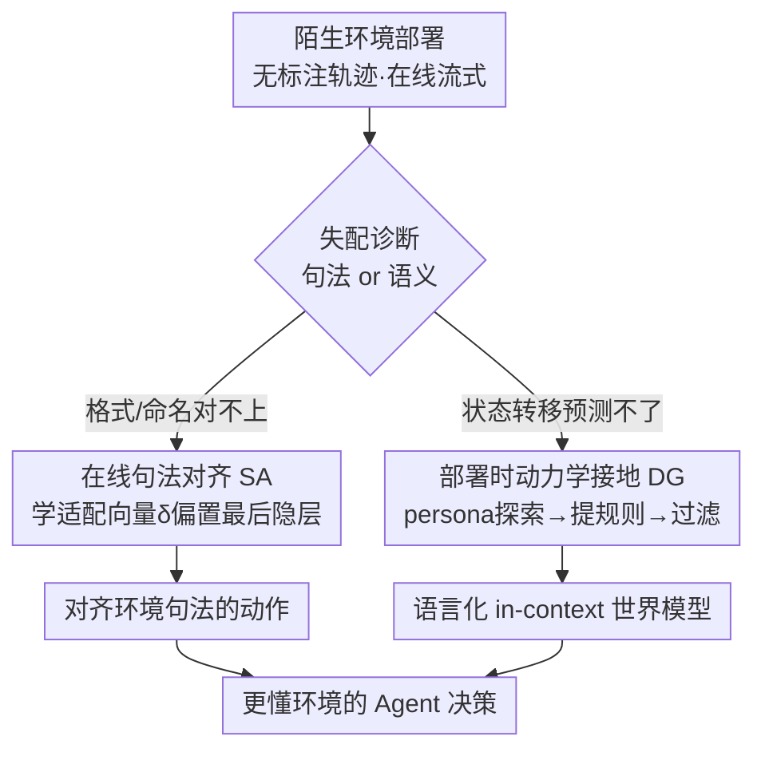

# Test-Time Adaptation for LLM Agents via Environment Interaction

**会议**: ICLR 2026  
**OpenReview**: [https://openreview.net/forum?id=OH4PE0TDo0](https://openreview.net/forum?id=OH4PE0TDo0)  
**代码**: https://github.com/r2llab/GTTA  
**领域**: Agent  
**关键词**: 测试时自适应, LLM Agent, 句法对齐, 动力学接地, 环境世界模型

## 一句话总结
针对 LLM Agent 部署到陌生网站 / 新工具集时的泛化失败，本文把失败拆成「句法失配」和「语义失配」两类，分别用一个在线学习的轻量适配向量（句法对齐 SA）和一段 persona 驱动的探索来在上下文里建一个语言化世界模型（动力学接地 DG），全程无需标注轨迹与微调，在 WebArena 多站点 split 上把成功率从 2% 拉到 23%。

## 研究背景与动机

**领域现状**：LLM Agent 在 Web 导航、函数调用等任务上已经很能打，但它们的能力高度依赖预训练语料里见过的环境格式与交互模式。一旦部署到一个全新的网站或一套没见过的 API，表现常常断崖式下跌。

**现有痛点**：作者把这种「部署泛化鸿沟」精确归因为两类**互相独立**的失败模式。其一是**句法失配（syntactic mismatch）**：Agent 的先验和环境具体的观测结构、元素命名对不上——比如它习惯性地生成 `click("Search")`，而新网站的按钮其实叫 `Go`、输入框叫 `dest field`，于是直接产出非法动作、当场失败。其二是**语义失配（semantic mismatch）**：Agent 没有这个环境特定的状态转移因果模型，预测不了动作的后果——它以为点 `Go` 会出航班结果，结果网站弹出一个日期确认浮层；不知道这个转移，它就规划不出正确的多步计划。

**核心矛盾**：现有补救手段都不适合「快速、在线」的部署适配。一类靠人工或 LLM 标注的示范轨迹，资源昂贵、且依赖对环境的已有先验；另一类显式世界建模（如 WMA）要先采集大量交互、再单独微调一个专门模型，计算重、换环境就得重训。两条路都有巨大 overhead，而真实部署往往只有「测试时无监督交互」这一点信息可用。

**本文目标**：在「无标注轨迹、在线流式、允许测试时无监督探索」三条约束下，分别堵上句法和语义两个窟窿。

**切入角度**：既然两类失配机制不同（一个是输出分布偏了，一个是缺世界模型），就不该用一招通吃，而要**对症下药**——句法问题用参数化的分布偏置快速纠偏，语义问题用语言化的规则注入补足。两者都只吃测试时的交互信号。

**核心 idea**：把「测试时自适应（TTA）」这个原本来自 CV 的范式系统地搬到 LLM Agent 上，用「在线适配向量」和「探索式语言世界模型」两个无标注、低成本的策略，在部署当下把 Agent 对齐到陌生环境。

## 方法详解

### 整体框架

方法的出发点是一个贴近真实部署的问题设定：Agent 进入一个**从未见过**的环境，拿不到任何专家示范或离线数据，任务一个一个流式到来，但允许它在接到具体任务前先对环境做一次无监督的「盲探索」。测试时模型输入被形式化为 $I = [p; o; \{a\}_{i=1}^{T-1}]$，其中 $p$ 是任务指令、$o$ 是当前观测（如可访问性树、函数返回）、$\{a\}$ 是历史动作；对观测很短的工具调用场景则直接把所有历史交互拼进去。

在这个设定下，本文先**诊断**失败属于句法还是语义，再走两条**并行**的适配路径：句法失配走在线句法对齐（SA），在每一步用一个适配向量偏置模型输出，让动作的命名 / 格式贴合当前环境；语义失配走部署时动力学接地（DG），在任务开始前用一段 persona 驱动的探索把环境的状态转移规则提炼成自然语言，注入上下文当作临时世界模型。两条路最终都指向更鲁棒、更「懂这个环境」的决策。

### 关键设计

**1. 失配诊断：把部署泛化鸿沟拆成句法与语义两条互不相同的病灶**

本文最关键的一步其实是「诊断」而非「下药」。以往工作笼统地说 Agent「泛化差」，本文坚持把它**操作性地**拆成两类：句法失配是 Agent 的输出分布和环境特定的字面格式（元素标签、动作语法、观测结构）对不上，属于「认字」问题；语义失配是 Agent 缺少环境的状态转移因果模型，预测不了动作后果，属于「懂事」问题。这个区分不是文字游戏——它直接决定了两类问题需要**不同的适配机制**：句法问题可以靠参数化地微调输出分布快速解决，而语义问题靠改分布没用，必须把环境规则当成知识喂进去。后面的 SA 和 DG 正是分别对应这两条病灶，框架里那个菱形诊断节点也由此而来。

**2. 在线句法对齐 SA：用一个每步更新、按 episode 重置的适配向量把输出分布拽向环境格式**

针对句法失配，本文引入一个轻量的适配向量 $\delta \in \mathbb{R}^d$（$d$ 为隐藏维），把它作为**加性偏置**加到最后投影层之前的隐表示上，得到适配后的 logits：

$$\text{logits}' = (H + \delta) W_{LM}^T$$

关键在于 $\delta$ 怎么更新——它不用任何标注，而是把**当前上下文本身**当作自监督信号。每一步对当前输入序列做一次语言建模（下一 token 预测），用交叉熵损失对 $\delta$ 走一步梯度下降：

$$\delta_{new} \leftarrow \delta_{old} - \eta \nabla_\delta \mathcal{L}_{CE}\big(f_{\theta,\delta}(I_{1:n-1}),\, I_{2:n}\big)$$

其中模型权重 $\theta$ 全程冻结，只动 $\delta$。直觉是：既然环境观测里已经出现了 `Go`、`dest field` 这些字符串，让模型去拟合「预测这些 token」的损失，就会把 $\delta$ 推向偏好这些 token 的方向，于是下一步生成时 `click("Go")` 的概率被抬高、`click("Search")` 被压低，自然纠正了句法。每步预测都重复这个「算损失→更新 δ→用新 δ 生成」的循环；而为了防止跨任务的灾难性遗忘，$\delta$ 在每个新 episode 开始时被**重置为零向量**——它被当成一个一次性的临时参数，只服务当前环境、当前这一段交互，单步更新只多 3% 延迟。这一点也是它和传统 steering vector 的根本区别：后者用固定向量去拨「诚实度」之类的高层人格特质，本文则让向量随环境响应在线更新、按 episode 复位，做的是动态、上下文相关的精准对齐。

**3. 部署时动力学接地 DG：用 persona 探索把环境转移规则提炼成自然语言世界模型**

针对语义失配，本文不去训一个参数化世界模型，而是用一条**部署时**的四步流水线，从少量探索交互里现场拼出一个语言化的 in-context 世界模型 $E_{clean}$，其成本一次性投入、之后摊销到该环境的所有任务上。四步是：①**persona / 探索目标合成**——拿环境的高层描述（网站用途、API 文档）让 LLM 生成 $N$ 个多样的「探索人设/目标」，比如「作为新用户，我想看看不选日期直接搜航班会怎样」；用 persona 而非「最大化状态新颖度」这类无结构探索，是为了引导 Agent 去试那些朴素策略容易漏掉的复杂多步交互，挖出语义更丰富的动力学。②**探索 + 边走边抽规则**——对每个 persona，让一个 LLM Agent 真去环境里交互，每执行一个动作、环境转移到新状态后，就把 (观测, 动作, 新观测) 三元组总结成一条人类可读的规则 $e$，并把已生成的规则列表回灌给 Agent，鼓励它去试没试过的动作。例子里执行 `click("Go")` 会被记成「在主页点 `Go` 会弹出选日期的日历浮层」。③**过滤与合并**——把所有抽到的规则 $E=\{e\}_{i=1}^M$ 交给一个 reasoning 模型（实验用 o3），滤掉琐碎（如「在文本框打字会显示文字」）或重复的规则，得到精炼的 $E_{clean}$。④**注入上下文**——测试时把 $E_{clean}$ 拼进输入 $I' = [I; E_{clean}]$，靠 LLM 的 in-context learning 让 Agent 提前预判动作后果、做转移感知的规划。和重量级 WMA 相比，DG 不训任何模型、只用约 50 次探索 roll-out，把「重训一个 8B 世界模型 + 每步 140 秒推理模拟」的代价砍成一次性的探索开销。

### 一个完整示例

以陌生网站 `travel-example.com` 上「订一张从纽约到 Saskatoon 的机票」为例：
- **句法侧（SA）**：episode 开始 $\delta$ 置零；不适配时模型按预训练先验倾向于生成 `click("Search")`；但页面可访问性树里有 `[145] <button>Go` 和 `dest field`，对这段上下文算语言建模损失并更新 $\delta$ 后，梯度把 `Go` 的 token 概率抬高；下一步生成时模型改成句法正确的 `click("Go")`。
- **语义侧（DG）**：探索阶段，persona「不选日期直接搜会怎样」驱动 Agent 点了 `Go`，记录到转移「点 `Go` 会弹出日历浮层」，过滤后进入 $E_{clean}$；正式执行任务时这条规则在上下文里，Agent 就提前知道点 `Go` 不会直接出结果而是要先选日期，于是把「选日期」纳入多步计划，绕过了原本会卡死的语义失配。

## 实验关键数据

### 主实验

在 WebArena（812 任务、6 类站点含多站点 split）、BFCLv3（多轮函数调用）、Tau-Bench（航空/零售对话式函数调用）上评测，骨干为闭源 GPT-4.1 / GPT-4o mini 与开源 Qwen2.5-14B-Instruct。成功率（%）：

| 模型 | WebArena | BFCLv3 | Tau-Air | Tau-Retail |
|------|---------|--------|---------|-----------|
| GPT-4.1 | 30.0 | 55.5 | - | - |
| GPT-4.1 (+DG) | **35.0** (+5.0) | **64.0** (+8.5) | N/A | N/A |
| GPT-4o mini | 12.0 | - | - | - |
| GPT-4o mini (+WMA) | 13.5 (+1.5) | N/A | N/A | N/A |
| GPT-4o mini (+DG) | **18.0** (+6.0) | - | N/A | N/A |
| Qwen2.5-14B | 17.0 | 18.5 | 21.6 | 43.3 |
| Qwen2.5-14B (+SA) | 18.0 (+1.0) | 20.0 (+1.5) | **25.2** (+3.6) | **44.9** (+1.6) |
| Qwen2.5-14B (+DG) | **20.0** (+3.0) | **22.0** (+3.5) | N/A | N/A |
| Qwen2.5-14B (hybrid) | 21.0 (+4.0) | 21.0 (+2.5) | N/A | N/A |

DG 在指令跟随强的 GPT-4.1 上增益最大；GPT-4o mini 仅用 DG（18.0）就大幅超过需要训练世界模型的 WMA（13.5）。WebArena 分站点结果里，DG 的威力集中在最难的**多站点 split**——GPT-4.1 从 2% 飙到 23%：

| 站点 | GPT-4.1 | +DG | Qwen-14B | +SA | +DG |
|------|--------|-----|----------|-----|-----|
| Multi-site | 2.0 | **23.0** | 6.0 | 6.0 | 10.0 |
| Reddit | 29.0 | 42.0 | 13.0 | 25.0 | 23.0 |
| Map | 28.0 | 31.0 | 13.0 | 16.0 | 20.0 |
| Avg | 30.0 | 35.0 | 17.0 | 18.0 | 20.0 |

### 消融实验

| 配置 | 关键指标 | 说明 |
|------|---------|------|
| GPT-4o mini DG (用 GPT-4.1 探索) | 18.0 (+6.0) | 强模型当探索/抽取策略 |
| GPT-4o mini DG (self) | 19.0 (+7.0) | **用自己探索反而更好**，DG 可自改进 |
| Qwen-14B DG (用 GPT-4.1) | 20.0 (+3.0) | — |
| Qwen-14B DG (self) | 20.0 (+3.0) | 自探索与用强模型持平 |
| DG w/o 过滤 (BFCLv3, 10 episodes) | 61.0 | 不滤规则 |
| DG w/ 过滤 (BFCLv3, 10 episodes) | 64.0 (+3.0) | 过滤琐碎/重复规则有效 |
| SA 延迟 (单步更新) | +3.0% | 实时可用的低开销 |

### 关键发现
- **DG 的价值与环境复杂度强相关**：在「点 search 出搜索框」这类符合常识先验的简单站点（如 Shopping），显式动力学提供的新信息少，过长上下文甚至轻微拖累；而在转移不可预测的多站点场景，DG 增益巨大（2%→23%）。
- **DG 能自改进**：探索/抽取用 Agent 自身就和用更强模型一样好，说明方法对探索策略选择鲁棒，不依赖外部强教师。
- **朴素混合 SA+DG 未必更好**：BFCLv3 上 hybrid（21.0）反而低于单用 DG（22.0），两种适配信号可能互相干扰，如何有原则地整合是 future work。
- **SA 对超参鲁棒但有边界**：合理学习率范围内普遍涨点，但 7B 模型用极端学习率 1.0 或训练 5 步会掉点；14B/32B 因适配向量维度更大（5120 vs 7B 的 3584），反而更受益于较大学习率。

## 亮点与洞察
- **把「泛化失败」做成可操作的二分诊断**：句法 vs 语义这条线不是修辞，而是直接推导出两种机制完全不同的解法，这种「先分类病灶再对症」的思路本身就很可迁移。
- **用语言模型损失当自监督信号做 TTA**：SA 把「环境观测里已经出现的字符串」当成免费监督，一步梯度就把输出分布拽过去，几乎零标注、零额外推理成本（+3% 延迟），是 CV 里 TTA 范式在 Agent 上的漂亮落地。
- **世界模型可以「只用语言、即用即抛」**：DG 把重量级的参数化世界模型替换成「探索→语言规则→注入上下文」，成本从重训 8B 模型 + 每步 140 秒模拟，压到一次性约 7M token 的探索，且对所有后续任务摊销。
- **per-episode 重置防遗忘**：把适配向量当一次性临时参数、每个 episode 清零，避免跨任务污染，这个细节是它区别于固定 steering vector 的关键。

## 局限与展望
- **SA 主要只在 Qwen2.5 家族验证**，缺乏更广开源架构的验证；且当前更新没按隐藏维归一化，作者认为归一化能进一步提升超参鲁棒性。
- **DG 只适用于有显式状态转移的环境**：纯对话式 / 无可观测状态转移的场景（如 Tau-Bench）抽不出动力学，DG 直接不适用，目前留白。
- **SA 与 DG 的整合还没解决**：朴素相加会互相干扰、甚至不如单用，作者设想用一个 meta-controller 评估环境复杂度，动态决定走轻量在线适配还是更贵的动力学接地。
- 自己的观察：DG 的效果高度依赖探索阶段能否覆盖到任务真正需要的转移规则，persona 合成质量与探索预算（30 步）会是隐形瓶颈；多站点 2%→23% 很亮眼，但绝对成功率仍低，离实用还远。

## 相关工作与启发
- **vs WMA（Web Agents with World Models, Chae et al. 2025）**：WMA 要先采集探索示范、再单独训一个 Llama-3.1-8B 来预测下一状态，重且换环境得重训；本文 DG 用语言化、即用即抛的 in-context 世界模型，不训任何模型、仅 50 次探索 roll-out，GPT-4o mini 上 18.0 大幅超 WMA 的 13.5。
- **vs 传统 steering vector（Tan/Zou et al.）**：标准 steering 用固定向量拨「诚实度」等高层特质；本文把向量当随环境在线更新、按 episode 重置的临时参数，做动态上下文对齐，更契合 Agent 任务的有状态、交互特性。
- **vs CV 的 TTA（Tent 等熵最小化）**：本文继承「测试时用无监督目标更新少量参数」的思想，但首次系统地把它用到 LLM Agent 的交互式、有状态新环境上，用语言建模损失替代熵最小化作自监督。

## 评分
- 新颖性: ⭐⭐⭐⭐ 句法/语义二分诊断 + 两个无标注测试时策略的组合很清晰，单点技术（适配向量、in-context 规则）借鉴成分较多
- 实验充分度: ⭐⭐⭐⭐ 三大 benchmark、开闭源多骨干、探索/过滤/超参消融齐全，但绝对成功率偏低、hybrid 失败暴露整合未解决
- 写作质量: ⭐⭐⭐⭐ 问题动机和方法对应关系讲得很顺，travel-example 贯穿全文易懂
- 价值: ⭐⭐⭐⭐ 给「部署时快速适配陌生环境」提供了低成本、无标注的实用范式，多站点 2%→23% 很有说服力

<!-- RELATED:START -->

## 相关论文

- [\[ICLR 2026\] GTA1: GUI Test-time Scaling Agent](gta1_gui_test-time_scaling_agent.md)
- [\[ICML 2026\] AdaMEM: Test-Time Adaptive Memory for Language Agents](../../ICML2026/llm_agent/adamem_test-time_adaptive_memory_for_language_agents.md)
- [\[ICLR 2026\] Pushing Test-Time Scaling Limits of Deep Search with Asymmetric Verification](pushing_test-time_scaling_limits_of_deep_search_with_asymmetric_verification.md)
- [\[ICLR 2026\] EvoTest: Evolutionary Test-Time Learning for Self-Improving Agentic Systems](evotest_evolutionary_test-time_learning_for_self-improving_agentic_systems.md)
- [\[ICLR 2026\] SimuHome: A Temporal- and Environment-Aware Benchmark for Smart Home LLM Agents](simuhome_a_temporal-_and_environment-aware_benchmark_for_smart_home_llm_agents.md)

<!-- RELATED:END -->
