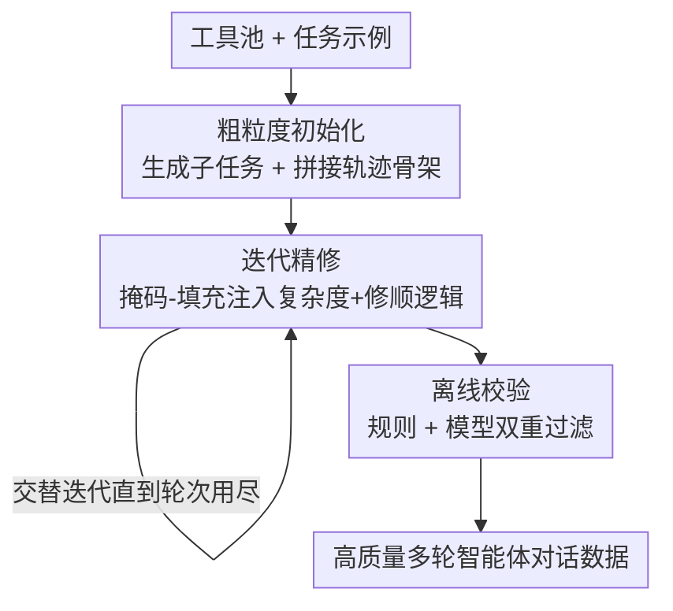

# ToolACE-MT: Non-Autoregressive Generation for Agentic Multi-Turn Interaction

**会议**: ICLR 2026  
**OpenReview**: [https://openreview.net/forum?id=KznJt9Fhjc](https://openreview.net/forum?id=KznJt9Fhjc)  
**代码**: 无  
**领域**: Agent / LLM 工具调用 / 数据合成  
**关键词**: 智能体数据合成, 多轮工具调用, 非自回归生成, 掩码-填充, 离线校验

## 一句话总结
ToolACE-MT 把多智能体仿真"逐轮自回归"造多轮工具调用数据的范式，换成"先搭骨架、再迭代精修、最后离线校验"的非自回归流水线，用更少的 API 调用造出连贯性和多样性都更高的智能体对话数据，训出来的 8B 模型在 BFCL-v3 多轮准确率从 9.25% 提到 40.25%。

## 研究背景与动机

**领域现状**：要让 LLM 具备智能体能力（多轮对话里反复调用工具、根据观测动态决策），高质量的"多轮+多步"交互数据是刚需。当前主流造数据的办法是**多智能体仿真（Multi-Agent Simulation, MAS）**：让若干个 LLM 分别扮演 user、assistant、tool，通过自回归的来回对话拼出完整轨迹。

**现有痛点**：MAS 有三个硬伤。一是**贵**——每一轮都要基于前文重新生成，长对话意味着大量来回交互，输入 token 爆炸；二是**难控**——任务复杂度和对话长度由模型交互隐式决定，没法显式约束，难以做精细的数据设计；三是**最致命的全局视野缺失**——assistant 是自回归生成的，看不到整体任务和步骤间依赖，很难优化整体结构、保证每一步一致，导致事实性、工具调用一致性、任务可解性都打折，本质上退化成"从更大的 assistant 模型蒸馏知识"。

**核心矛盾**：自回归生成天然是"局部最优"的——每一步只看历史、看不到未来，而智能体任务恰恰需要长程规划和全局一致性。MAS 把数据质量绑死在扮演 assistant 的那个 LLM 的能力上。

**本文目标**：造出又快、又可控、又全局一致的多轮智能体数据，且生成预算可弹性伸缩。

**切入角度**：作者借鉴**非自回归翻译（NAT）和掩码扩散语言模型**的思路——这类方法先并行生成一个粗糙的整体，再迭代精修，被证明在语言生成上更高效。作者把这个范式从 token 级搬到**轮（turn）级**：先一次性把整条轨迹的骨架搭出来（天然带全局视野），再局部精修。

**核心 idea**：用"非自回归迭代生成"代替"自回归多智能体仿真"——先生成结构完整但语义粗糙的对话骨架，再通过掩码-填充式的迭代精修注入复杂度和连贯性，最后离线校验过滤。

## 方法详解

### 整体框架

ToolACE-MT 要解决的是"怎么造一条多轮多步的智能体对话轨迹 $C=(o_0,a_1,o_1,\cdots,o_{n-1},a_n)$"，其中 $o_0$ 是用户初始消息，$a_t$ 是一个动作（函数调用或自然语言回复），$o_t$ 是对应的观测（工具输出或用户回复）。整条流水线分三个阶段串行推进：**粗粒度初始化 → 迭代精修 → 离线校验**。

和 MAS 逐轮自回归不同，ToolACE-MT 的关键转变是：**第一阶段就把整条轨迹的结构骨架一次性铺好**（因此天生具备全局视野），后续阶段只在这个骨架上做局部的掩码-填充式修改。初始化阶段为了好处理，刻意把轨迹造得"干净规整"（结构完整但语义浅）；迭代精修阶段往里注入真实世界的复杂度（澄清、工具感知、错误模拟等）并修顺逻辑；离线校验阶段用规则+模型双重检查把不合格样本筛掉。

### 关键设计

**1. 粗粒度初始化：先搭一具结构完整但语义粗糙的对话骨架**

针对"自回归没有全局视野"这个根因，作者反其道而行——先把整条轨迹的结构一次性铺出来。它分两步：**任务初始化**先从预定义工具池里采样一批候选工具，然后生成整体任务，包括一组子任务 $(u_1,u_2,\cdots,u_m)$（$m$ 每条实例预先指定）、每个子任务需要的工具、以及每个子任务需要几步工具调用——这一步相当于高层规划，先把整条轨迹的走向定下来，细节留到后面填。**轨迹初始化**则按子任务顺序拼接：对每个子任务 $u_t$，基于它的元信息（工具需求、步数）和已生成的前序子轨迹 $(C_0,\cdots,C_{t-1})$ 生成子轨迹 $C_t$，最后拼成 $C=C_0\cup C_1\cup\cdots\cup C_m$。

这里有两个刻意的简化约束：一是每个子任务的工具调用和输出**并行生成**以保证一致；二是强制让子任务的首条用户查询 $o_t^0$ 包含所有必要信息（如函数参数值），后续观测 $o_t^s\ (s\neq0)$ 全是工具输出。这样动作类型严格交替（函数调用后跟工具输出、自然语言回复后跟用户回复），后处理极其方便。这一阶段**只求结构完整、不求语义正确**——内容浅、可能局部不一致，都留给下一阶段修。

**2. 迭代精修：用掩码-填充往骨架里注入真实复杂度并修顺逻辑**

骨架太"干净"了，不像真实对话。作者借鉴 Masked-Predict，交替进行两类掩码操作直到所有轮都被精修过或达到预设次数。**复杂度注入（Complexity Injection）**用 mask-and-extend 实现——把某一轮整体替换成占位符 $X$，再填入修订内容并**额外加几轮**，形式化为 $(o_0,a_1,\cdots,a_t,o',a',o'',a_{t+1},\cdots,a_n)=f_{\text{LLM}}(\sigma,(o_0,a_1,\cdots,a_t,X,a_{t+1},\cdots,a_n))$，其中 $\sigma$ 是注入类型。注入类型有四种：**澄清**（用户给的信息不全、assistant 追问）、**工具感知**（assistant 识别出任务不被支持、用户更新工具列表）、**错误模拟**（工具调用失败、assistant 反思并调整）、**非函数调用需求**（闲聊等开放输入增加多样性）。因为骨架干净，可以维护一份注入日志记录哪些轮被改过，避免重复修改。

**合理性精修（Reasonability Refinement）**则用 mask-and-fill：随机掩掉若干**非相邻**的轮再用 LLM 重新生成，检查工具调用参数是否合适、回复是否切题、对话流是否顺。初始时每轮被选概率相等，但**被选过一次后概率下降**，鼓励不同轮都被精修到。为防止越改越差，还有一个 LLM judger 判断采纳新内容还是保留原文。每条轨迹上，复杂度注入和合理性精修**交替进行**。

**3. 离线校验：规则+模型双重把关，过滤幻觉和不一致**

前面大量用 LLM，长多轮+大工具列表下幻觉是顽疾，所以最后做一道离线校验，混合规则法和模型法。**规则法**检查对话和工具调用格式合规性、可执行性（有真实工具时）、重复、以及能被规则抓到的幻觉（如引用了历史里没出现过的特殊 ID）。**模型法**借鉴前作把评估**拆解成多个子问题**，每个子问题交给一个独立的 LLM 检查专家处理，最后聚合各专家输出做决策，主攻语义连贯性和规则法漏掉的复杂幻觉。值得一提的是，合理性精修和离线校验功能上有重叠（都能纠不一致），但实验显示二者互补——精修主修语义连贯和函数调用准确，校验擅长抓长程不一致和整体结构缺陷。

### 损失函数 / 训练策略
本文是**数据合成方法**，本身不引入新损失。下游训练用 LoRA 微调（rank 16、alpha 32），全局 batch 64、学习率 $1\times10^{-4}$、cosine 调度、warmup 0.1。数据生成端：每条实例子任务数从 $[2,5]$ 采样、每个子任务 $[1,6]$ 步；迭代精修时随机注入 1~3 种复杂度（避免重复模式伤害自然度）、合理性精修最多 5 次（经验上的成本-效果平衡点）。

## 实验关键数据

构建 8000 条训练实例，与同样用 GPT-4o-2024-11-20、同工具池、同离线校验的 MAS 方法对比；主实验基座 LLaMA3.1-8B-Instruct。

### 主实验

| 基准 | 指标 | 基座 8B | MAS | ToolACE-MT |
|------|------|---------|-----|------------|
| BFCL-v3 | Multi-Turn Overall | 9.25 | 31.38 | **40.25** |
| BFCL-v3 | Single-Turn Non-Live | 84.21 | 80.29 | 84.94 |
| BFCL-v3 | 综合 Overall | 49.57 | 64.17 | **65.41** |
| ACEBench | Multi-Turn | 24.0 | 48.0 | **51.0** |
| ACEBench | Agent PA | 18.3 | 15.0 | **34.0** |
| τ-Bench | Avg. (Retail+Airline) | 16.1 | 15.9 | **20.6** |

ToolACE-MT 在 BFCL-v3 多轮上把 8B 基座的 9.25% 拉到 40.25%（绝对 +31%），超过 LLaMA3.1-70B（12.5%）和 DeepSeek-V3（29.87%），也全面优于 MAS。单轮 Non-Live 上保住了基座水平（84.94%），而 MAS 反而掉到 80.29%。一个有意思的发现：Live 单轮上提升不如 MAS，因为真实用户查询常含糊，多轮监督训出来的模型倾向先追问澄清再调用——这是"谨慎多轮规划"和"激进单轮执行"之间的 trade-off。

### 消融实验

| 配置 | BFCL-v3 MT | BFCL-v3 综合 | 说明 |
|------|-----------|-------------|------|
| Full (ToolACE-MT) | 40.25 | 65.41 | 完整三阶段 |
| − Offline Verification | 32.50 | 63.01 | 去离线校验，综合掉 2.4% |
| − Iterative Refinement | 20.88 | 52.10 | 再去迭代精修，全面大跌 |

### 数据效率与质量

| 方法 | API 调用 | 定价 (USD) | 校验通过率 | BFCL 综合 |
|------|---------|-----------|-----------|-----------|
| MAS (GPT-4o) | 275k | 1,737 | 61.1 | 64.17 |
| ToolACE-MT (GPT-4o) | 188k | 1,380 | 72.3 | **65.41** |
| ToolACE-MT (GPT-4o-mini) | 394k | 148 | 48.7 | 60.13 |

数据统计上，ToolACE-MT 每条对话的用户轮更少（3.4 vs 5.8）但每轮工具调用更多（3.7 vs 2.3），更聚焦工具调用、多步任务完成更高效；连贯性（蕴含率 EnR 50.71 vs 43.60、语义相似度 SS 68.34 vs 65.23）和多样性（熵 H 9.28 vs 7.92、Distinct-3 0.357 vs 0.319）双双更优。

### 关键发现
- **迭代精修是性能主力**：去掉后 BFCL 多轮从 40.25% 崩到 20.88%，因为初始骨架很多过于简单或有语义缺陷；离线校验贡献相对小但稳（综合 −2.4%）。
- **两阶段互补**：精修次数少时校验作用大（差距约 5%），精修次数加到 15 次后差距缩到 2% 以内，但 30 次也消不掉——精修主修语义连贯，校验主抓长程不一致和结构缺陷。
- **生成端模型能力是上限**：换 GPT-4o-mini 后通过率暴跌（48.7%）、格式错误和幻觉增多，即便过滤后训出的模型仍比 GPT-4o 版差（60.13% vs 65.41%），说明长工具密集对话对长上下文能力要求高。
- **任务完成更高效**：τ-Bench 上 ToolACE-MT 训出的模型平均 13.7 个 assistant 轮完成任务，MAS 要 15.4 轮——非自回归骨架带来更好的整体规划，少了 MAS 的试错。
- **跨基座可泛化**：在 Qwen2.5-7B、Qwen3-8B 上同样优于 MAS 数据，Qwen2.5 系列 0.5B~7B 全尺寸验证有效。

## 亮点与洞察
- **把非自回归/扩散思路从 token 级搬到 turn 级**：核心洞察是"自回归造智能体数据的根本缺陷是没有全局视野"，而 NAT/掩码扩散"先并行铺骨架再迭代精修"恰好天然带全局视野，这个类比迁移得很巧。
- **"先造干净骨架再注脏"反直觉但好用**：初始化刻意求结构完整而非语义正确，把"造复杂度"和"保结构"解耦，后续掩码-填充因此能维护注入日志、避免重复修改——干净的中间态让流程可控。
- **复杂度可显式控制+预算可伸缩**：子任务数、步数、注入类型数、精修次数都是显式旋钮，迭代精修次数能根据预算调（Figure 5 是清晰的 scaling 曲线），这是 MAS 隐式交互给不了的。
- **离线校验的"分而治之"评估**：把质量评估拆成多个子问题交给独立 LLM 专家再聚合，比让一个 LLM 一次性判全部更聚焦，这个模块化评估思路可迁移到任何长文本质量把关。

## 局限与展望
- **强依赖生成端大模型的长上下文能力**：GPT-4o-mini 和 LLaMA3.1-8B 都造不出足够可用数据（后者大多数时候直接失败），方法的可及性受限于得用 GPT-4o 级别的强模型。
- **复杂度注入不适合在单条对话内反复施加**：作者自承复杂度注入重复用会伤自然度，scaling 实验只能靠加合理性精修，复杂度的弹性扩展是有上限的。
- **评估受基准自身缺陷干扰**：τ-Bench Airline 上基座 8B 反超所有训练模型，是因为该基准有"空动作即正确"的已知评估漏洞，弱模型恰好蒙对——提示这类智能体基准本身的可靠性待加强。
- **改进空间**：可探索更便宜的生成端模型 + 更强校验的组合，或把迭代精修与 agentic RL 结合，用合成数据稳住 RL 训练。

## 相关工作与启发
- **vs 多智能体仿真 (MAS, Wang et al. 2025 / Liu et al. 2025)**: 它们让多个 LLM 自回归来回扮演 user/assistant/tool，本文用非自回归骨架+迭代精修代替；区别在于本文第一阶段就有全局视野、复杂度可显式控制，优势是更省（API 调用 188k vs 275k、通过率 72.3% vs 61.1%）、质量更高，劣势是更吃生成端模型能力。
- **vs Prabhakar et al. (2025) 两阶段合成**: 二者第一阶段都生成任务配置和真值答案，但它第二阶段仍回退到多智能体仿真收集完整轨迹，本文则全程非自回归、连轨迹收集都靠掩码-填充。
- **vs 非自回归翻译 / Mask-Predict (Ghazvininejad et al. 2019)**: 本文把 token 级的掩码迭代精修范式扩展到对话**轮**级，思路同源但粒度和应用场景全新。

## 评分
- 新颖性: ⭐⭐⭐⭐⭐ 把非自回归/掩码扩散范式从 token 级迁到 turn 级造智能体数据，范式级创新
- 实验充分度: ⭐⭐⭐⭐ 三基准+多基座+成本对比+scaling 曲线齐全，但缺真实工具大规模验证
- 写作质量: ⭐⭐⭐⭐ 三阶段叙述清晰、图示到位，部分公式记号略密
- 价值: ⭐⭐⭐⭐⭐ 智能体数据合成是刚需，省钱又提质，方法可直接复用

<!-- RELATED:START -->

## 相关论文

- [\[ICLR 2026\] Evaluating Memory in LLM Agents via Incremental Multi-Turn Interactions](evaluating_memory_in_llm_agents_via_incremental_multi-turn_interactions.md)
- [\[ICLR 2026\] TaskCraft: Automated Generation of Agentic Tasks](taskcraft_automated_generation_of_agentic_tasks.md)
- [\[ICLR 2026\] FaSTA*: Fast-Slow Toolpath Agent with Subroutine Mining for Efficient Multi-turn Image Editing](fasta_fast-slow_toolpath_agent_with_subroutine_mining_for_efficient_multi-turn_i.md)
- [\[NeurIPS 2025\] T1: A Tool-Oriented Conversational Dataset for Multi-Turn Agentic Planning](../../NeurIPS2025/llm_agent/t1_a_tool-oriented_conversational_dataset_for_multi-turn_agentic_planning.md)
- [\[AAAI 2026\] Towards Trustworthy Multi-Turn LLM Agents via Behavioral Guidance](../../AAAI2026/llm_agent/towards_trustworthy_multi-turn_llm_agents_via_behavioral_guidance.md)

<!-- RELATED:END -->
