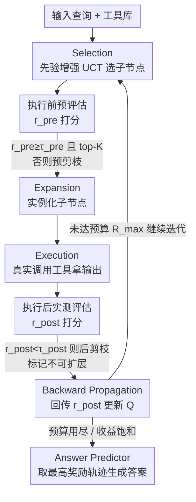

# ToolTree: Efficient LLM Agent Tool Planning via Dual-Feedback Monte Carlo Tree Search and Bidirectional Pruning

**会议**: ICLR 2026  
**OpenReview**: [https://openreview.net/forum?id=Ef5O9gNNLE](https://openreview.net/forum?id=Ef5O9gNNLE)  
**代码**: https://github.com/SYang2000/ICLR_2026_ToolTree  
**领域**: Agent / 工具规划  
**关键词**: 工具规划, 蒙特卡洛树搜索, 双向剪枝, LLM Agent, 训练无关

## 一句话总结
ToolTree 把 LLM agent 的多工具调用建模成一棵蒙特卡洛树搜索（MCTS），用「执行前预评估 + 执行后实测评估」两个 LLM 打分信号同时引导选择和剪枝，在固定算力预算下让 agent 既有前瞻又能基于真实反馈回退，4 个工具规划 benchmark 上平均比 SOTA 搜索范式高约 10%、且效率最高。

## 研究背景与动机

**领域现状**：让 LLM agent 解决复杂多步任务，核心是「工具规划」——不仅要选对工具，还要决定何时用、按什么顺序用。现有做法分两派：一是贪心式（ReAct、CoT 等），每步独立挑当下看起来最合适的工具；二是搜索式（ToT、A\*/ToolChain\*、LATS 等），同时展开多个候选分支再择优。

**现有痛点**：贪心式没有长期收益视角，早期一步选错就会沿着单一轨迹把错误不可逆地传播到后续步骤，而且只走一条路、不探索备选，算力也浪费；搜索式虽然展开多分支，但一旦涉及工具，分支因子会随工具类型、参数和状态演化指数爆炸，导致开销高、延迟不可控。

**核心矛盾**：更要命的是，很多搜索式变体打分的是「假想的 thought」而非「真正执行过的 action」，于是排序和工具的真实效用是脱钩的——某个工具几步之后才显现的好处，几乎不会被回传去奖励更早的决策。规划既要前瞻、又要落地到真实结果，还要在固定预算下省算力，三者很难兼得。

**本文目标**：设计一个同时具备前瞻（foresight）和回顾（hindsight）、且单位算力精度更高的工具规划范式，无需针对任务重新训练。

**切入角度**：作者观察到，工具调用其实有两类天然信号可用——执行前可以快速预测「这个工具大概有没有用」，执行后可以根据真实输出判断「它实际贡献了多少」。把这两个信号都注入经典 MCTS 循环，就能让搜索既快又准地聚焦在「既可能、又有用」的分支上。

**核心 idea**：用「执行前预评估 $r_{pre}$ 引导选择/扩展 + 执行后实测评估 $r_{post}$ 提供 rollout 奖励」的双反馈 MCTS，配上执行前/后双向剪枝，把树搜索压紧到高价值轨迹上。

## 方法详解

### 整体框架

ToolTree 把工具规划看成一个序贯决策过程：每个状态 $s$ 编码当前对话上下文和已累积的中间结果，每个动作对应从工具库 $T_{lib}=\{t_1,\dots,t_m\}$ 里调用一个候选工具，目标是在固定的 rollout 预算 $R_{max}$ 内找到使任务效用最大的轨迹。与依赖独立 planner 的旧方法不同，ToolTree 把工具选择、执行、评估、剪枝全部直接焊进 MCTS 循环里。

整个搜索是一个「先看后做再回看」的迭代循环，重复多次后由 Answer Predictor 取奖励最高的工具轨迹生成最终答案。单次迭代依次经过六个阶段：**Selection**（按先验增强的 UCT 从根往下选子节点）→ **Pre-Evaluation**（执行前用 LLM 给候选动作打 $r_{pre}$）→ **Expansion**（只把通过预评估/预剪枝的动作实例化成子节点）→ **Execution**（真正调用工具/API 拿到输出 $o_{t+1}$）→ **Post-Evaluation**（执行后用 LLM 给真实输出打 $r_{post}$）→ **Backward Propagation**（把 $r_{post}$ 回传更新路径上各边的价值估计）。其中 Pre-Evaluation、Post-Evaluation 和由两者驱动的双向剪枝是本文相对于 vanilla MCTS 的真正贡献，Selection/Expansion/Execution/Backprop 是 MCTS 的标准骨架。

### 关键设计

**1. 双信号评估：用执行前预测和执行后实测给搜索装上前瞻与回顾的眼睛**

经典 MCTS 只会平衡探索与利用，但它对「一个工具调用在执行前是否合理」「执行后真实输出是否有用」一无所知，这正是搜索式方法把假想 thought 当真、信用分配失真的根源。ToolTree 注入两个轻量、训练无关的 LLM 打分信号来补上这两只眼睛。**预评估** $r_{pre}(s,a)\in[0,1]$ 在执行前根据当前上下文 $C$、工具卡片（I/O schema、领域标签、示例）和一个 schema 合法的参数草稿，让 LLM judge 预测这个工具大概有没有用——这是「前瞻」。**后评估** $r_{post}(s_t,a)=J(C_t,a,o_{t+1})\in[0,1]$ 则在执行拿到真实输出 $o_{t+1}$ 之后，用同一个 LLM judge 评估任务一致性（正确性代理、相关性、约束满足）和鲁棒性线索——这是「回顾」。关键在于 $r_{post}$ 算在**已执行**的动作上，因此它给出的信用分配是忠实的，而不是像旧方法那样去给假想的推理步骤排序。

**2. 先验增强的 UCT 选择：把预评估直接焊进选择策略，让早期 rollout 偏向靠谱分支**

光有预评估分数还不够，得让它真正影响搜索往哪走。ToolTree 把 $r_{pre}$ 作为先验项塞进 UCT 的探索奖励里：

$$\text{UCT}(s,a) = Q(s,a) + \lambda\, r_{pre}(s,a)\sqrt{\frac{\ln N(s)}{N(s,a)}}$$

其中 $Q(s,a)$ 驱动「利用」、累积的是到目前为止拿到的后评估奖励，$N(s)$ 和 $N(s,a)$ 是访问次数，$\lambda$ 控制先验强度。这样一来，早期 rollout 会被偏向那些预评估看好的分支，同时仍保留 $Q(s,a)$ 带来的利用压力；只有输入 schema 与当前上下文兼容的合法动作 $a\in A(s)$ 才会被考虑，平局时按 $N(s)$ 更大者优先、再加一点随机抖动维持探索多样性。后评估则通过反向传播以运行均值更新 $Q(s,a)\leftarrow Q(s,a)+\frac{r_{post}(s_t,a)-Q(s,a)}{N(s,a)}$ 反哺利用项，让后续选择反映出观测到的真实效用。作者还提到可对 $\lambda$（或阈值 $\tau_{pre}$）做深度感知退火，随证据积累逐步削弱先验影响。

**3. 双向剪枝：执行前砍掉不靠谱、执行后砍掉无产出，把预算压在「又可能又有用」的轨迹上**

两个评估信号天然支持两侧的预算控制。**预剪枝**发生在扩展前：在叶状态 $s_t$ 枚举剩余合法动作时，只保留 $r_{pre}(s_t,a)\ge\tau_{pre}$ 且落在 top-K 的动作 $A_{keep}(s_t)=\text{top-}K(A^+(s_t);r_{pre})$ 去实例化子节点，直接在任何工具调用之前就剔除明显不兼容或低产出的分支，压低分支因子。**后剪枝**发生在执行后：若 $r_{post}(s_t,a)<\tau_{post}$，就把这条边标记为不可扩展，避免把预算浪费在已被证据证伪的无产出延续上。此外还有确定性缓存：以 $(a,\text{args})$ 为键，rollout 内出现过的相同调用直接复用其输出 $o_{t+1}$，持久失败则附上一个带类型的 error token，让兼容性检查和剪枝决策显式化（而不是靠隐式超时）。三者合力，把 rollout 集中到「预评估认为可能、后评估证明有用」的链条上，从而在固定 $R_{max}$ 下提升单位时间精度。

### 一个完整示例

以论文 Figure 1 的医学图像问答为例：输入一张图像 + 问题「肺部是否受影响？」。ToolTree 从根出发，**Selection** 按先验增强 UCT 在候选工具间挑选；对每个候选先做 **Pre-Evaluation**，把明显与图像/问题不相干的工具（如纯文本检索工具）在预剪枝阶段直接 $r_{pre}<\tau_{pre}$ 砍掉，只展开 top-K 个看起来靠谱的（如图像分割、区域定位、分类器）。被选中的工具被 **Execution** 真正调用，拿到输出后做 **Post-Evaluation**：若某条分支执行后发现输出与问题无关（$r_{post}<\tau_{post}$），就被后剪枝标记为死路，不再投入预算；有用的分支则把 $r_{post}$ 回传，抬高对应路径的 $Q$ 值。多轮迭代后，搜索收敛到一条高奖励工具轨迹，Answer Predictor 据此给出最终答案「No」——而贪心法可能一开始就选错工具、不可逆地答错。

## 实验关键数据

### 主实验

**闭集工具规划（GTA / m&m，typed I/O 的小工具集，Table 1，GPT-4o）**：

| 数据集 | 指标 | ToolTree | 次优 baseline | 提升 |
|--------|------|----------|--------------|------|
| GTA | AVG | **66.95** | LATS 64.78 | +2.17（比 vanilla MCTS 高 >2.2） |
| m&m | AVG | **88.61** | LATS 86.45 | +2.16（比 Zero-shot 高 >8） |

**开集工具规划（ToolBench / RestBench，几十~上万个真实 API，Table 2，GPT-4o）**：

| 数据集 | 指标 | ToolTree | 次优 baseline | 提升 |
|--------|------|----------|--------------|------|
| ToolBench | AVG | **69.04** | LATS 66.55 | ≈ +2.5 |
| RestBench–TMDB | AVG | **74.50** | LATS 71.35 | ≈ +3.1 |
| RestBench–Spotify | AVG | **71.36** | LATS 68.53 | +2.8 |

贪心控制器（Zero-shot / ReAct / CoT）整体落后于搜索式方法，印证了即便在小型 typed 工具集上前瞻也有价值；优势在分支多、计划跨多次调用的场景最明显。

### 消融实验

在 GTA + GPT-4o 上、同步长同 prompt 拆解双评估与双向剪枝（Table 3，准确率 / token 成本）：

| 配置 | 准确率 ↑ | Token 成本 ↓ | 说明 |
|------|---------|-------------|------|
| ToolTree（完整） | **76.44** | **18.2k** | 最高精度 + 最低成本 |
| – 预剪枝 | 75.28 | 20.4k | 去预剪枝，树变宽、成本升 |
| – 预评估 | 71.80 | 21.1k | 去前瞻信号 |
| – 后剪枝 | 75.82 | 22.9k | 去后剪枝 |
| – 后评估 | 68.94 | 22.9k | **掉点最多（>7 分）** |
| – 双剪枝 | 74.58 | 24.1k | 两侧剪枝都去 |
| – 双评估 | 66.70 | 24.3k | 退化为接近 vanilla MCTS |

### 关键发现

- **后评估贡献最大**：去掉后评估准确率掉 >7 分（76.44→68.94），说明「执行后的真实反馈」是引导搜索的最关键信号——这正好对应作者的核心论点，假想 thought 排序不可靠、真实执行结果才能做忠实信用分配。
- **剪枝直接收紧搜索树**：去掉预剪枝会把扩展节点中位数从约 70 升到约 95（树变宽）；去掉后剪枝则把 rollout 中位数从约 33 升到约 47（更难早收敛）。两侧剪枝同时降准确率又增 token 成本，是效率的核心来源。
- **效率—时间权衡好**：ToolTree 运行时间虽慢于 ReAct/Best-First，但与 ToT 相当、通常低于 LATS，而单位时间精度（accuracy-per-second）最高，16–64 步预算区间增益最大，甜点约在 32–64 步。
- **对检索器鲁棒**：换 Contriever / RoBERTa / BM25 三种 retriever，ToolTree 在 ToolBench G1/G2/G3 全部最优，且弱检索下退化最小，说明双评估能在不完美的工具候选列表上纠偏。

## 亮点与洞察
- **把「打分对象」从假想 thought 换成真实执行结果**：这是相对其他搜索式 agent 最本质的差异——$r_{post}$ 算在已执行动作上，信用分配忠实，这条洞察可迁移到任何「LLM + 搜索 + 外部反馈」的 agent 系统。
- **预评估同时身兼三职**：既进 UCT 当先验偏置、又当扩展门控（top-K + $\tau_{pre}$）、还当预剪枝阈值，一个轻量 LLM 打分被复用到极致，工程上很经济。
- **完全训练无关**：纯靠 LLM judge 的两个打分 + 阈值，不需任务特定再训练，可直接套到不同工具库上，落地门槛低。
- **双向剪枝的对称美感**：执行前用「可能性」砍、执行后用「有用性」砍，把固定预算两头夹紧，理念清晰，是可复用的搜索预算控制范式。

## 局限与展望
- **强依赖 LLM judge 质量**：$r_{pre}$ 和 $r_{post}$ 都由 LLM 打分，judge 偏置或不稳定会直接污染选择和剪枝；论文也在附录 A.9 讨论了指标耦合（pass/win 等）的潜在隐患。
- **阈值/超参较多**：$\tau_{pre}$、$\tau_{post}$、top-K、$\lambda$、退火策略等需要调，论文未充分给出跨数据集的敏感性全貌，迁移到新工具库时可能要重新调参。
- **额外评估调用带来开销**：每个候选动作都要查 LLM judge 做预/后评估，虽然靠剪枝和缓存摊薄，但相比纯贪心法仍有额外 LLM 调用成本；运行时间慢于 ReAct/Best-First。
- **改进方向**：可探索用更便宜的小模型或学习到的价值网络替代 LLM judge、把阈值做成自适应/可学习、以及在更长 horizon、更大工具库（论文附录已试到 10014 个工具）上的稳定性。

## 相关工作与启发
- **vs 贪心式（ReAct / CoT）**: 它们每步独立选当下最优工具、无长期视角，早期错误不可逆传播；ToolTree 用树搜索引入前瞻和回退能力，能从早期失误中恢复，主实验上稳定高出一截。
- **vs 搜索式（ToT / A\*-ToolChain\* / LATS）**: 它们也展开多分支，但多在假想 thought 上排序、信用分配与真实工具效用脱钩，且分支因子易爆炸；ToolTree 用执行后真实奖励做信用分配、用双向剪枝压紧树，单位算力精度更高，比最强 baseline LATS 平均高约 2–3 分。
- **vs vanilla MCTS**: 经典 MCTS 对工具调用的执行前合理性和执行后真实效用无感知；ToolTree 把两个 LLM 信号注入选择与剪枝，消融里「去双评估」几乎退回 vanilla MCTS 水平（76.44→66.70），直接量化了这两个信号的价值。

## 评分
- 新颖性: ⭐⭐⭐⭐ 把双信号评估 + 双向剪枝系统性焊进 MCTS 工具规划，思路清晰、对症下药，但底层是 MCTS + LLM-judge 的组合创新。
- 实验充分度: ⭐⭐⭐⭐ 闭集/开集 4 benchmark、双模型、检索器/模型规模/工具库规模多维消融，较全面。
- 写作质量: ⭐⭐⭐⭐ 动机—方法—实验逻辑顺畅，公式与流程交代清楚。
- 价值: ⭐⭐⭐⭐ 训练无关、即插即用、平均 +10%，对工具型 agent 实用性强。

<!-- RELATED:START -->

## 相关论文

- [\[ICML 2025\] KBQA-o1: Agentic Knowledge Base Question Answering with Monte Carlo Tree Search](../../ICML2025/llm_agent/kbqa-o1_agentic_knowledge_base_question_answering_with_monte_carlo_tree_search.md)
- [\[ICLR 2026\] GTool: Graph Enhanced Tool Planning with Large Language Model](gtool_graph_enhanced_tool_planning_with_large_language_model.md)
- [\[AAAI 2026\] Prune4Web: DOM Tree Pruning Programming for Web Agent](../../AAAI2026/llm_agent/prune4web_dom_tree_pruning_programming_for_web_agent.md)
- [\[ICLR 2026\] OrchestrationBench: LLM-Driven Agentic Planning and Tool Use in Multi-Domain Scenarios](orchestrationbench_llm-driven_agentic_planning_and_tool_use_in_multi-domain_scen.md)
- [\[ICLR 2026\] Efficient Agent Training for Computer Use](efficient_agent_training_for_computer_use.md)

<!-- RELATED:END -->
