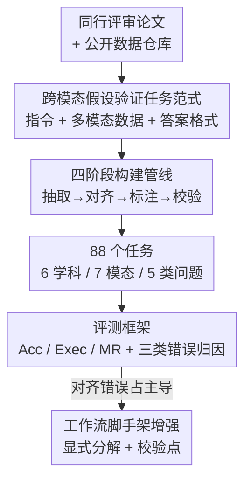

# Towards Multimodal Data-Driven Scientific Discovery Powered by LLM Agents

**会议**: ICLR 2026  
**OpenReview**: [https://openreview.net/forum?id=kZHSvETWdi](https://openreview.net/forum?id=kZHSvETWdi)  
**代码**: https://github.com/usail-hkust/MoSciBench  
**领域**: Agent / 科学发现 / 多模态  
**关键词**: 科学发现智能体, 多模态对齐, 假设验证, Benchmark, 工作流脚手架

## 一句话总结
本文提出 **MoSciBench**——首个面向「多模态、仓库级」数据驱动科学发现的基准，从同行评审论文出发用四阶段管线构造 88 个跨模态假设验证任务；系统评测发现即使最强智能体（o4-mini + ReAct）也只有 48.9% 准确率，超过 60% 的失败源于跨模态对齐，而轻量工作流脚手架能把准确率平均拉高 5.7%。

## 研究背景与动机
**领域现状**：LLM 智能体正在被用来「自动做科学」——读数据、生成分析管线、调用计算工具执行，已有 ScienceAgentBench、DiscoveryBench 等基准把「数据准备 → 分析 → 建模 → 验证」的工作流形式化。

**现有痛点**：这些基准几乎都被限制在**单模态、切片级**任务里——每个任务只绑定一张表、一段时间序列，智能体只在孤立模态内被评测，而且任务常定义在单点 / 单切片粒度，缺少真实研究中「访问整个数据仓库、跨文件推理」的现实感。

**核心矛盾**：真实科学发现天生是多模态的——气候研究要把卫星影像和时空元数据拼起来，健康研究要把生理信号和环境变量关联起来。要捕捉这种复杂度，必须考核智能体的**跨模态对齐、建模、推理**三种能力，而这恰恰是现有基准缺失的，导致对智能体「能否做真实科研」的评估存在系统性高估。

**本文目标**：构造一个能真实考核多模态、仓库级科学发现的基准，并系统回答：当前智能体到底做得怎么样、错在哪、怎么补。

**切入角度**：把每个任务设计成「**跨模态假设验证工作流**」——智能体必须先对齐、融合异构数据，才能建模与推理，从而把「跨模态对齐」这个真实瓶颈显式逼出来。

**核心 idea**：用「从同行评审论文反向构造可验证假设任务 + 强制多模态对齐」替代「单模态切片预测」，建立一个客观、可复现、贴近真实科研的测试床。

## 方法详解

### 整体框架
MoSciBench 由两部分组成：一是**任务范式**——把每个发现任务定义为端到端的跨模态假设验证工作流（输入是一条源自论文的科学指令 + 一组多模态数据集，输出是对假设的可验证答案）；二是**四阶段构建管线**——从科研论文里抽数据、做多模态对齐、写任务指令、人工多轮校验，最终得到 88 个任务，覆盖 6 个学科、7 种模态、5 类发现问题。在此之上配一套**评测框架**：把现有单域发现智能体改造到多模态设定，用 Accuracy / 代码执行成功率 / 建模合理性三个指标考核，并对失败做对齐/建模/推理三类错误归因，进而验证轻量工作流脚手架的增益。

整条数据是「论文 → 任务」的串行加工流水线，最后接评测回路，pipeline 清晰，框架图如下：

### 关键设计

**1. 跨模态假设验证任务范式：把「对齐」逼成必经之路**

针对「现有任务只在单模态内打转、不考对齐」的痛点，本文把每个任务都实例化为三件套：(i) 源自论文的**任务指令**（给出科学背景、待验证假设、期望答案格式）；(ii) 一组或多组**多模态数据集**作为证据；(iii) 一套**评测协议**判断输出是否与金标准假设一致。任务必须跨越 7 种模态——多传感器时间序列、表格、卫星影像、质谱、分子结构、基因型矩阵、HDF 矩阵——而且数据以带预览的结构化目录释放，智能体不仅要 load / 预处理，更要通过**共享索引做模态对齐**（如用被试 ID 把个体属性和生理时间序列连起来、用地理网格把卫星影像和环境变量对齐）才能往下分析。指令故意写得简洁开放，逼智能体自主决定探索、预处理、建模步骤，从而把真实科研里最难的跨模态融合显式纳入考核。

**2. 四阶段构建管线：用同行评审论文保证客观性与可复现**

针对「任务标注主观、答案缺乏权威依据」的痛点，本文把任务构造拆成四个可控阶段：① **原始数据抽取**——选取以宽松许可证发布数据、且提出明确数据驱动科学问题的论文，抽出多模态数据并登记变量名/时空覆盖等元数据；② **多模态处理与对齐**——特征过滤去缺失异常、多源整合、单位/时间戳/空间参考标准化，再用共享索引完成对齐，产出 aligned datasets；③ **任务指令形式化与标注**——把研究问题翻译成保留科学意图但不过度规定步骤的指令，配上可验证假设、金标准答案和显式答案格式（填槽 / true-false / 类别标签），必要处补最小领域知识但不泄露解法；④ **人工验证与质控**——多轮校验且只依赖已释放数据集，标注者还会写**端到端可执行脚本**复现工作流、在容差内自动核对数值/相关/因果方向/预测性能；凡人工验证与原始金标准冲突的任务直接剔除，最终保证标注与 ground-truth 假设 100% 一致。

**3. 假设中心评测 + 三类错误归因：定位真实瓶颈**

针对「只报总分、说不清智能体到底错在哪」的痛点，评测采用**精确匹配（exact match）**——类别输出要求严格相同，数值/列表/坐标按任务设定容差判定，使评测自动、客观、可复现；同时辅以**代码执行成功率（Exec）**和用 gpt-4o-mini 当裁判打 1–5 分的**建模合理性（MR）**。更关键的是把失败显式拆成三类——**对齐错误**（概念或实现上的模态错配）、**建模错误**（表示/规划/计算）、**推理错误**（统计或逻辑推断）——它们正好覆盖智能体工作流全链路。对最强的 o4-mini + ReAct 做归因发现：对齐错误占 31.8%、建模 13.6%、推理仅 5.7%，成功率 48.9%——一锤定音地指出**跨模态对齐才是主导瓶颈**，根因在于把不同形态、分布、尺度、分辨率的数据融成可计算表示同时保住领域信息本身就很难。

**4. 轻量工作流脚手架：对症下药补对齐**

既然多数失败来自对齐，本文从两个角度尝试增强智能体并对照：一是把**任务自带领域知识**塞进上下文，二是注入**轻量人工工作流脚手架**（显式任务分解 + 校验点）。结果很有意思：朴素灌入领域知识反而把平均准确率从 48.4% 拉低到 44.9%（气候 57.1%→50.0%、化学信息 33.3%→26.7%），说明硬塞知识会引入噪声与错配；而轻量工作流脚手架把平均提到 54.1%（+5.7%），气候 57.1%→71.4%、地球科学 35.7%→50.0% 增益最大，对齐错误占比从 31.8% 降到 27.3%、成功案例占比从 53.4% 升到 60% 以上。这与错误归因完全自洽——显式分解与验证检查点直接改善了对齐能力，从而稳住整体表现。

### 一个完整示例
以一个地球科学任务「判断地形复杂度与降水变率的相关方向」为例走一遍：智能体拿到指令 + 一个仓库级目录（`Images/Img_relief/Relief_31S_53W.png` 影像、`Precipitation_data.csv` 时间序列）。它必须先**对齐**——用地理网格 ID（如 `31S_53W`）把卫星影像和降水时间序列绑到同一空间单元；再**建模**——从影像提取地形复杂度、从时间序列算降水变率、计算 Pearson 相关；最后**推理**——评估显著性并解读相关方向，输出与金标准答案（如 `[(3, -78)]`）精确匹配才算对。整个流程中任何一步对齐失败（影像和时序对不上格网），后续建模推理再对也白搭——这正是 60% 失败的来源。

## 实验关键数据

### 主实验
在 6 个学科、88 个任务上评测 4 个 LLM 家族 × 多种智能体框架（NoDataGuess / ReAct / DataVoyager / Reflexion / SelfDebug / RAG-ReAct），指标为 Acc / Exec / MR 的宏平均：

| 基座模型 | 最佳框架 | Overall Acc | 说明 |
|----------|----------|-------------|------|
| o4-mini | ReAct | **48.9%** | 全场最强，但仍不到一半 |
| o4-mini | Reflexion | 45.8% | 反复重试增益有限 |
| DeepSeek-V3.1 | ReAct | 36.5% | 中游 |
| Qwen3-30B-A3B | RAG-ReAct | 37.3% | 小模型上限 |
| gpt-5-mini | ReAct | 17.4% | 明显落后 |
| 任意 | NoDataGuess | 0.0–10.5% | 纯内部记忆推理近乎崩溃 |

三条核心观察：① 多模态发现显著比单模态难，最强也只 ~48.9%；② 数据驱动不可或缺——脱离数据的 NoDataGuess 准确率塌到近零，而接入数据的框架普遍高 20–40%；③ 基座越强智能体越强，能力直接随底座扩展。

### 消融实验
对最佳的 ReAct（o4-mini）做错误归因与增强对照：

| 配置 | 平均 Acc | 对齐错误占比 | 说明 |
|------|---------|-------------|------|
| ReAct（vanilla） | 48.4% | 31.8% | 对齐错误主导，成功率 53.4% |
| ReAct + 领域知识 | 44.9%（−3.5%） | — | 硬塞知识引入噪声，反掉点 |
| ReAct + 工作流脚手架 | **54.1%（+5.7%）** | 27.3% | 成功率升至 >60% |

### 关键发现
- **对齐是主瓶颈**：对齐错误 31.8% 远高于建模 13.6% 与推理 5.7%——跨模态融合（不同尺度/分辨率/分布对齐）是智能体的真正软肋。
- **脚手架优于灌知识**：轻量工作流脚手架（显式分解 + 校验点）一致涨点，而朴素灌领域知识反而掉点，提示「提升工作流效率比单纯堆知识更有效」。
- **任务类型差异大**：因果推断 81.8% 最高（结构化假设检验、方向明确时 LLM 能稳定跟随），相关分析 33.3%、模式发现 35.7% 最低（需对弱关联/潜在结构敏感，当前智能体脆弱）。
- **成本效益分化**：生物医学工程性价比最高（成本 $0.57、分数 0.65、CE 1.1），群体基因组学与地球科学成本超 $1.0 却低分（CE 0.4）；Reflexion 最贵（$1.34）但增益常不抵开销——说明优化工作流级效率比扩模型/算力更划算。

## 亮点与洞察
- **把「对齐」做成可量化的第一性瓶颈**：通过强制跨模态任务设计 + 三类错误归因，本文用数据把「智能体做不好科研」精确定位到「对齐」这一步，而非笼统说「难」，为后续工作指明了改进靶点。
- **从论文反向构造任务**：以同行评审研究的金标准假设为答案来源 + 端到端可执行脚本复核，既保证客观性又能自动评测，是构造高质量科学发现基准的可复用范式。
- **「灌知识掉点、加脚手架涨点」的反直觉结论**：提示在 agent 系统里，结构化的流程约束比非结构化的知识注入更能稳住多步工作流，这一洞察可迁移到其他长链路 agent 任务。

## 局限与展望
- **没有原生多模态发现智能体**：本文是把单域发现智能体「改造」到多模态设定来评测，尚无专为跨模态对齐设计的智能体，留作后续。
- **精确匹配评测偏严**：exact match（数值带容差）对开放式探索任务可能偏保守，相关/模式发现这类弱信号任务的低分有多少来自评测严格度本身值得进一步拆解。
- **规模与成本约束**：88 个任务、单任务限时 1 小时是「广度 vs 可执行性」折中，覆盖面相对有限；高维噪声模态（基因型矩阵、地学数据）成本高、效率低，规模化评测受限。
- **改进思路**：把工作流脚手架内化为智能体自带的对齐模块（自动建立共享索引、校验点），而非外部注入，可能是把对齐错误进一步压下去的方向。

## 相关工作与启发
- **vs ScienceAgentBench / DiscoveryBench**：它们把发现工作流形式化但每个任务绑单一模态、常在单点/切片粒度评测；本文做仓库级、跨模态、强制对齐的端到端任务，难度与现实感显著更高。
- **vs 单域发现智能体（DataVoyager 等）**：本文不提新智能体，而是把这些框架统一搬到多模态设定下做横向评测，并用错误归因揭示它们共同的对齐短板，定位「评测 + 诊断」而非「方法」。

## 评分
- 新颖性: ⭐⭐⭐⭐⭐ 首个多模态、仓库级科学发现基准，把跨模态对齐做成可量化瓶颈
- 实验充分度: ⭐⭐⭐⭐⭐ 4 模型 × 6 框架 × 88 任务，含错误归因、增强对照、成本效益全套分析
- 写作质量: ⭐⭐⭐⭐ 结构清晰、观察编号明确，个别准确率数字（48.4/48.9/48.94）在文中略有出入
- 价值: ⭐⭐⭐⭐⭐ 为 LLM 科学发现智能体提供严谨测试床，并明确指出对齐是下一步攻坚方向

<!-- RELATED:START -->

## 相关论文

- [\[ICLR 2026\] NewtonBench: Benchmarking Generalizable Scientific Law Discovery in LLM Agents](newtonbench_benchmarking_generalizable_scientific_law_discovery_in_llm_agents.md)
- [\[ICLR 2026\] SR-Scientist: Scientific Equation Discovery With Agentic AI](sr-scientist_scientific_equation_discovery_with_agentic_ai.md)
- [\[ICLR 2026\] Expanding the Capability Frontier of LLM Agents with ZPD-Guided Data Synthesis](expanding_the_capability_frontier_of_llm_agents_with_zpd-guided_data_synthesis.md)
- [\[ICLR 2026\] TusoAI: Agentic Optimization for Scientific Methods](tusoai_agentic_optimization_for_scientific_methods.md)
- [\[ICLR 2026\] CoMind: Towards Community-Driven Agents for Machine Learning Engineering](comind_towards_community-driven_agents_for_machine_learning_engineering.md)

<!-- RELATED:END -->
