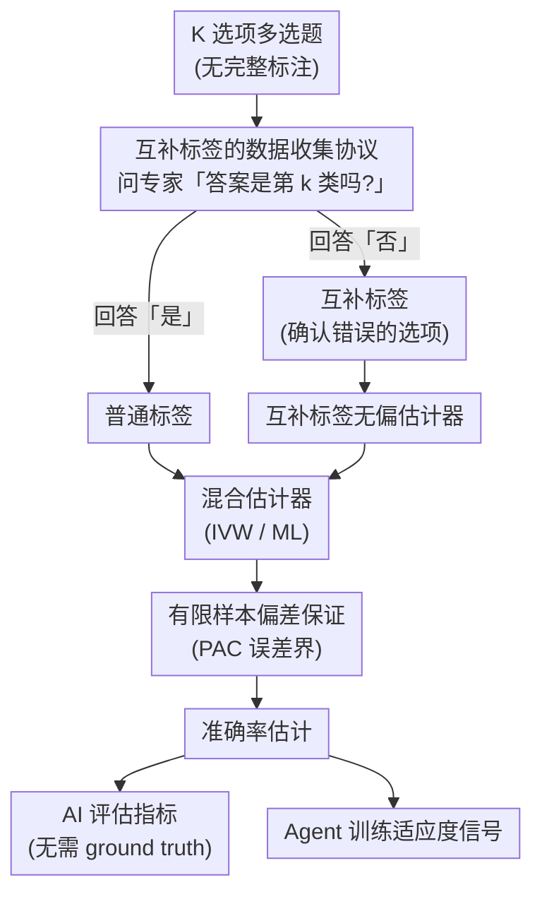

# Towards Scalable Oversight via Partitioned Human Supervision

**会议**: ICLR2026  
**arXiv**: [2510.22500](https://arxiv.org/abs/2510.22500)  
**代码**: 已开源  
**领域**: LLM Agent  
**关键词**: 可扩展监督, 互补标签, 分区人类监督, 无偏估计, Agent训练

## 一句话总结

提出基于分区人类监督的可扩展监督框架：当任务超越单个专家能力时，利用领域专家提供的互补标签（排除错误选项）构造无偏准确率估计器，实现无需完整标注即可评估和训练 AI 系统。

## 背景与动机

- 随着 AI 系统接近甚至超越人类专家水平，获取高质量人类监督信号（用于评估和训练）日益困难
- 跨学科高难度任务中，即使最优秀的专家也只精通单一窄领域
- 现有对齐流程（SFT、RLHF、RLVR）预设人类能可靠评估或设计验证器
- **关键洞察**：领域专家虽然不能给出正确答案，但可以可靠地排除其领域内的错误选项
    - 心脏科医生："这不是心血管疾病"
    - 肿瘤科医生："这与肿瘤学无关"
- 这种"互补标签"(complementary label)信号虽然弱，但大量可得且可靠

## 核心问题

当无法获得完整标注（ground truth）时，如何利用分区专家提供的弱信号（"这个选项是错的"）来评估和训练 AI 系统？

## 方法详解

### 整体框架

整套方法把"没人能给出正确答案、但每个专家都能否定自己领域的错误选项"这一事实，转化为一个统计估计问题。流程是：先用一套二元问询协议从分区专家手里收集互补标签（confirmed-wrong 的选项），由它构造准确率 $A$ 的无偏估计器；再把互补标签与少量普通标签融合成方差更小的混合估计器，并为估计误差套上有限样本置信带；最后让这个准确率估计同时充当 AI 评估指标和 agent 训练的适应度信号。

### 关键设计

**1. 互补标签的数据收集协议：把分区专家的弱否定信号变成可建模的随机变量**

任务设定为 $K$ 选项多选题，每题有未知的正确标签 $Y \in \{1, \ldots, K\}$。系统让 $K$ 个标注者各自负责一个类别，对一道题随机挑一位标注者询问"答案是第 $k$ 类吗？"：若回答"是"就得到一个普通标签，若回答"否"则得到一个**互补标签** $\bar{Y}$——一个被确认错误的选项。关键假设是互补标签在所有非正确选项上均匀分布，即 $p(\bar{Y}=k|Y) = \frac{1}{K-1}$ 对所有 $k \neq Y$ 成立。这个协议只要求专家做二元判断而非给出答案，因此即便任务超出任何单个专家的能力，仍能稳定收集到大量可靠信号。

**2. 互补标签无偏估计器：从"预测没撞上错误选项"反推准确率**

定义指示变量 $W = \mathbb{I}\{\hat{Y} \neq \bar{Y}\}$，即模型预测 $\hat{Y}$ 与互补标签不重合，并取其经验均值 $\hat{q} = \frac{1}{n_c}\sum_{i=1}^{n_c} w_i$。由于互补标签均匀采样自错误选项，$\hat q$ 与真实准确率之间存在线性关系，Corollary 1 给出无偏估计 $\hat{A}_{\text{comp}} = (K-1)\hat{q} - (K-2)$。其方差为 $\text{Var}(\hat{A}_{\text{comp}}) = \frac{(A+K-2)(1-A)}{n_c}$，由此可解出要与 $n_o$ 个普通标签达到同等方差所需的互补标签量 $n_c = \left(1 + \frac{K-2}{A}\right) n_o$——准确率越高，需要补的互补标签越少，使弱信号在高性能模型上反而更经济。

**3. 混合估计器：用普通标签和互补标签互补降方差**

当两种标签同时存在时，方法把它们融合成更紧的估计。逆方差加权（IVW）按各自方差的倒数分配权重 $\hat{A}_{\text{IVW}} = \hat{w}\hat{A}_{\text{ord}} + (1-\hat{w})\hat{A}_{\text{comp}}$，其中 $\hat{w} = \frac{\widehat{\text{Var}}(\hat{A}_{\text{comp}})}{\widehat{\text{Var}}(\hat{A}_{\text{ord}}) + \widehat{\text{Var}}(\hat{A}_{\text{comp}})}$，让方差更小的一方占主导。最大似然（ML）则联合两类观测写出对数似然，由于它对 $A$ 是二次型，存在闭合解 $\hat{A}_{\text{ML}} = \frac{-\beta + \sqrt{\beta^2 - 4\alpha\gamma}}{2\alpha}$，其中 $\alpha = N$、$\beta = (K-2)(T_o+T_c) + (K-3)S_o - S_c$、$\gamma = -(K-2)S_o$。两者都以闭式给出，避免迭代优化即可拿到接近全量标注的精度。

**4. 有限样本偏差保证：给估计误差套上可计算的置信带**

为了让估计器能放心用于评估和训练，方法给出非渐近的 PAC 型误差界。对互补标签估计器，Theorem 2 同时取 Hoeffding 界和经验 Bernstein 界的较小者 $|\hat{A}_{\text{comp}} - A| \leq (K-1)\min\left\{\sqrt{\frac{\log(2/\delta)}{2n_c}}, \sqrt{\frac{2\hat{q}(1-\hat{q})}{n_c-1}\log\frac{4}{\delta}} + \frac{7\log(4/\delta)}{3(n_c-1)}\right\}$，在低方差区域自动收紧。对混合估计器，Theorem 4 给出 Bernstein 型界 $|\hat{A}_{\text{mix}} - A| \leq \sqrt{2v\log\frac{2}{\delta}} + c\log\frac{2}{\delta}$，使融合后的估计同样带有可验证的置信保证。

## 实验关键数据

### 统计验证 (GPT-5-nano)

| 估计器 | MMLU-Pro | MedQA | GPQA | MATH | MATH(CoT) | 平均 |
|--------|----------|-------|------|------|-----------|------|
| Ord (普通标签) | 78.33±1.73 | 92.89±1.35 | 64.17±1.67 | 47.56±3.91 | 84.89±0.77 | 73.57 |
| Comp-$n_o$ (等量互补) | 77.00±12.49 | 92.67±1.53 | 59.17±3.82 | 48.44±10.78 | 80.44±2.78 | 71.54 |
| Comp-Var (方差匹配) | 75.67±2.15 | 90.61±1.43 | 63.67±5.01 | 41.10±3.17 | 81.35±0.29 | 70.48 |
| **IVW** | **77.97±1.58** | **91.86±1.11** | **65.14±1.38** | **44.87±3.82** | **83.86±0.83** | **72.74** |
| ML | 77.94±1.58 | 91.65±1.08 | 65.11±1.38 | 44.75±3.79 | 83.65±1.04 | 72.62 |
| Ord-Eval (全量参考) | 77.97 | 92.66 | 59.52 | 44.21 | 83.89 | – |

- IVW 和 ML 混合估计器在偏差和方差之间取得最佳平衡
- 互补标签等量替代下方差大幅增加，但方差匹配后接近普通标签

### Agent 训练

- 在 ADAS 和 AFlow agent 搜索框架中，用互补标签估计器替代准确率作为适应度信号
- 在无完整标注情况下，agent 仍能有效自我改进
- 证明了弱信号可作为训练信号的可行性

## 亮点

1. **独特的问题视角**：将专家知识的"分区+排除"建模为互补标签，巧妙利用了人类专业化的特点
2. **理论完备**：从无偏估计到方差分析到有限样本保证，数学推导严谨完整
3. **实用性强**：收集协议简单（二元判断），显著降低标注门槛
4. **双重应用**：同一框架既能评估 AI（无需 ground truth）又能训练 AI（agent 训练信号）
5. **IVW 和 ML 估计器高效**：少量互补标签即可实现接近全量标注的估计精度

## 局限与展望

- 均匀采样假设($p(\bar{Y}=k|Y) = 1/(K-1)$)在实践中可能不严格成立
- 仅验证了多选题设置，开放生成任务的适配需要额外工作
- Agent 训练实验为 proof-of-concept，更大规模的验证待做
- 互补标签的质量依赖专家的可靠性——专家犯错的情况未充分讨论
- 当 $K$ 很大时互补标签方差急剧增加（从 Eq.5 可见）

## 与相关工作的对比

| 可扩展监督方法 | 核心假设 | 与本文关系 |
|-------------|---------|----------|
| Weak-to-strong generalization | 强模型能超越弱监督者 | 正交：本文提供新的弱信号来源 |
| Easy-to-hard generalization | 评估比生成容易 | 正交：本文不假设评估更容易 |
| Debate | 对抗性论证揭示真相 | 正交：本文基于专家排除 |
| Constitutional AI | AI 自生成反馈 | 正交：本文用人类弱信号 |
| Recursive decomposition | 任务可分解为子任务 | 正交：本文基于专业化分区 |

## 启发与关联

- "排除法"的监督信号在其他场景中也广泛存在：代码 review（指出 bug 比写正确代码容易），学术审稿（指出问题比解决问题容易）
- 互补标签估计器可以直接集成到 RLHF 流程中，作为 reward 信号的替代
- 对超人类对齐(superalignment)问题有直接指导意义
- 分区专家的思想与多 agent 系统中的分工合作有共通之处

## 评分

- 新颖性: ⭐⭐⭐⭐⭐ — 问题设定极具原创性，互补标签在 AI 对齐中的应用首次提出
- 实验充分度: ⭐⭐⭐⭐ — 统计验证充分，但 agent 训练实验规模有限
- 写作质量: ⭐⭐⭐⭐⭐ — 理论推导严谨，实验设计合理
- 价值: ⭐⭐⭐⭐⭐ — 对超人类任务的可扩展监督提供了实用可行的方案

<!-- RELATED:START -->

## 相关论文

- [\[ICLR 2026\] Repurposing Synthetic Data for Fine-grained Search Agent Supervision](repurposing_synthetic_data_for_fine-grained_search_agent_supervision.md)
- [\[ACL 2026\] SynthAgent: Adapting Web Agents with Synthetic Supervision](../../ACL2026/llm_agent/synthagent_adapting_web_agents_with_synthetic_supervision.md)
- [\[ICLR 2026\] AgentSynth: Scalable Task Generation for Generalist Computer-Use Agents](agentsynth_scalable_task_generation_for_generalist_computer-use_agents.md)
- [\[ICLR 2026\] Grounding Computer Use Agents on Human Demonstrations](grounding_computer_use_agents_on_human_demonstrations.md)
- [\[ICLR 2026\] ToolWeaver: Weaving Collaborative Semantics for Scalable Tool Use in Large Language Models](toolweaver_weaving_collaborative_semantics_for_scalable_tool_use_in_large_langua.md)

<!-- RELATED:END -->
