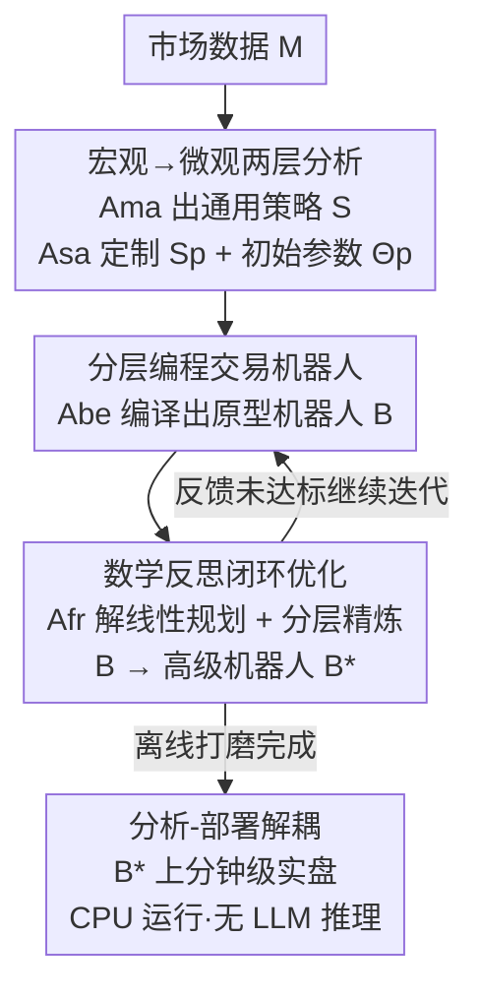

# Trade in Minutes! Rationality-driven Agentic System for Quantitative Financial Trading

**会议**: ICLR 2026  
**OpenReview**: [https://openreview.net/forum?id=ROEwZAxqyS](https://openreview.net/forum?id=ROEwZAxqyS)  
**代码**: 无  
**领域**: Agent / 量化金融  
**关键词**: 多智能体系统, 量化交易, 分析-部署解耦, 数学反思优化, 分钟级交易

## 一句话总结
TiMi（Trade in Minutes）是一套"理性驱动"的多智能体量化交易系统：用语义分析、代码编程、数学推理三类专长 LLM 在离线把交易策略打磨成一个可独立运行的程序化交易机器人，再把这个机器人部署到分钟级实盘——从而把"重推理"与"快执行"彻底解耦，在 200+ 股指/加密交易对上拿到稳定收益、低延迟和优良的风险控制。

## 研究背景与动机
**领域现状**：用 LLM 搭金融交易 agent 是当前热点，主流路线是"拟人化角色扮演"——让 agent 分别扮演新闻分析师、情绪分析师、不同风险偏好的交易员，再通过多 agent 辩论/协商给出买卖决策（如 FinMem、TradingAgents）。这类方法擅长处理新闻、研报等文本信息。

**现有痛点**：作者点出三个具体毛病。其一，**情绪偏差**——拟人化模拟天然把主观判断和情绪噪声引进决策；其二，**外围信息不可靠**——依赖社交媒体新闻、项目报告这类非结构化"边角信息"，对散户尤其危险，因为其中常含误导信号和时间滞后，容易错失机会或踩到不利波动；其三，**部署效率低**——实盘时每做一笔交易都要走一遍多 agent 的长推理和协商，算力开销大、动作延迟高，在高波动市场里直接表现为成交滑点和机会成本。

**核心矛盾**：拟人化 agent 追求的是"策略深度"，而量化交易真正需要的是"机械理性"和"分钟级响应速度"。现有方法把推理和执行绑在一起，鱼和熊掌不可兼得——要么深度推理但慢，要么快但浅。

**本文目标**：让 agent 的策略深度与量化交易必需的机械理性"和解"，具体拆成三件事——市场分析要去情绪化、数据选择要用客观技术指标、部署要低延迟。

**切入角度**：作者观察到现有工作几乎没用上 LLM 在**代码编程**和**数学推理**上的进步，而这恰恰是实现机械理性的钥匙。既然实盘要快，那就别在实盘里跑 LLM——把 LLM 的"想"全部前移到离线，让它产出一个不依赖 LLM 推理的程序化机器人去实盘"跑"。

**核心 idea**：用"分析-部署解耦"代替"持续多 agent 推理"——离线用专长 LLM 把策略编译成程序化交易机器人并迭代优化，实盘只跑这个轻量机器人，从而同时拿到策略深度和分钟级效率。

## 方法详解

### 整体框架
TiMi 把整个交易生命周期建模为 $(\mathcal{M}, \mathcal{W}, \mathcal{S}, \mathcal{F}, \mathcal{J})$（市场、时间窗、策略空间、反馈、评估函数），目标是最大化 $\mathcal{J}(\pi_\Theta)$。系统由**四个专长 agent** 协同：宏观分析 agent $\mathcal{A}_{ma}$、策略适配 agent $\mathcal{A}_{sa}$、机器人进化 agent $\mathcal{A}_{be}$、反馈反思 agent $\mathcal{A}_{fr}$，它们分别调用语义分析 $\phi$、代码编程 $\psi$、数学推理 $\gamma$ 三种能力。

整条管线分**三个阶段**，前两个在离线环境、最后一个在实盘环境：

- **策略阶段（Policy）**：$\mathcal{A}_{ma}$ 从技术指标里识别宏观市场形态、生成通用策略集 $\mathcal{S}$；$\mathcal{A}_{sa}$ 把通用策略定制成"对每个交易对量身定做"的规则 $\mathcal{S}_\mathcal{P}$ 和初始参数 $\Theta_\mathcal{P}$；$\mathcal{A}_{be}$ 把策略编译成程序化原型机器人 $\mathcal{B}$。
- **优化阶段（Optimization）**：原型机器人 $\mathcal{B}$ 在历史/模拟市场里跑，收集动作反馈 $\mathcal{F}$（执行回溯、风险极端案例）；$\mathcal{A}_{fr}$ 把反馈转成数学优化问题求解出精炼参数 $\Theta^*$ 和分层反馈 $\mathcal{F}^*$，再交给 $\mathcal{A}_{be}$ 做分层精炼，迭代出高级机器人 $\mathcal{B}^*$。
- **部署阶段（Deployment）**：通过模拟测试的 $\mathcal{B}^*$ 直接上实盘，CPU 即可运行、低延迟、不再需要任何 LLM 推理。

### 关键设计

**1. 分析-部署解耦：把"重推理"前移离线、实盘只跑轻量机器人**

这是 TiMi 的总纲，直击"实盘跑多 agent 太慢"的痛点。系统用三阶段把复杂推理（策略阶段+优化阶段，离线）与时间敏感的执行（部署阶段，实盘）彻底分开：离线阶段尽情调用专长 agent 反复打磨，产出一个参数已调好、逻辑已固化的程序化机器人 $\mathcal{B}^*$；实盘阶段只执行这个机器人，CPU 即可运行，不再调用任何 LLM。

为什么有效，作者给了量化的效率比 $\eta = \frac{c_{agent}\times n}{c_{policy}+c_{optimization}+c_{bot}\times n}$，其中 $c_{agent}/c_{bot}$ 是 agent/机器人每笔交易的推理成本、$n$ 是交易动作数。当高波动市场里 $n$ 增大，$\lim_{n\to\infty}\eta = \frac{c_{agent}}{c_{bot}}$，而通常 $c_{bot} \ll c_{agent}$，所以交易越频繁、解耦带来的效率优势越大。实测部署延迟仅 137ms，比持续推理的 TradingAgents（25,071ms）快约 180×。同时解耦让优化阶段不受实盘时间约束，可以充分精炼策略。

**2. 宏观→微观两层分析：用客观技术指标去情绪化地初始化策略**

针对"拟人化引入情绪偏差 + 依赖不可靠外围信息"两个痛点，TiMi 不再让 agent 扮演人类角色读新闻，而是只吃**客观技术指标**（成交量、振幅等）走两层分析。第一层是 $\mathcal{A}_{ma}$ 的宏观分析：金融市场在短时窗内存在可被技术指标识别的周期性形态，$\mathcal{A}_{ma}$ 在所有可观测市场状态上提取特征、生成有统计显著性的通用策略集，$\mathcal{A}_{ma}(\mathcal{M},\mathcal{W};\mathcal{I}) = \phi(\{\psi_i(\mathcal{M},w)\}) \to \mathcal{S}$，其中 $\psi_i$ 是把指标 $i$ 应用到时窗 $w$ 数据上的编程过程。

第二层是 $\mathcal{A}_{sa}$ 的逐对定制：不同交易对行为异质，先用语义分析 $\phi(\mathcal{S},p)\to\mathcal{S}_p$ 从通用集里挑选并适配出该对的候选策略，再用数学推理 $\gamma(\mathcal{S}_p,p)\to\Theta_p$ 标定参数。定制涵盖按历史表现排序策略、按该对波动率画像校准参数、按市场流动性设自适应风控规则。这种"市场级统计显著 + 交易对级灵活适配"的组合，比一刀切的单体策略在统计意义和适配性上都更优——消融里去掉 $\mathcal{A}_{sa}$（统一策略）会让最大回撤几乎翻倍到 28.4%。

**3. 分层编程交易机器人：把策略编译成可被反馈精炼的模块化代码**

策略要落地必须变成可执行代码，$\mathcal{A}_{be}$（Code LLM）把交易机器人 $\mathcal{B}$ 拆成三层：**策略层**封装决策逻辑（信号生成、仓位规模、进出场标准）；**功能层**提供策略所需的计算机制（技术指标、数据预处理、下单执行例程，可跨策略复用）；**参数层**集中管理所有可调参数。这种分层让机器人天然支持后续的分层反馈精炼。

为保证代码在多轮优化中结构不崩，作者定了三条**编程法则** $\mathcal{L}$：① 功能内聚法则——每个功能组件只负责一件事；② 单向依赖法则——依赖只能从高层流向低层；③ 参数外置法则——所有可调值必须从实现代码里抽出来集中管理。这三条法则不是空泛的工程规范，而是为下一步 $\mathcal{A}_{fr}$ 的"参数→功能→策略"分层精炼铺路：参数外置才能让数学优化只动参数层，单向依赖才能保证改低层不污染高层。

**4. 数学反思闭环优化：把风险案例转成线性规划求最优参数，并分层干预**

这是 TiMi"理性"的核心，针对"如何在不引入情绪的前提下迭代变强"。优化阶段机器人在实盘/历史市场跑出反馈 $\mathcal{F}$（绩效指标、风险事件、执行统计），$\mathcal{A}_{fr}$ 用数学推理 $\gamma$ 走三步：先把反馈里的风险场景组织出来、转成线性规划问题；再求可行参数解空间；最后在约束空间内优化参数使绩效最大化。形式化为：

$$\Theta^* = \arg\max_{\Theta\in C(\Theta)} \sum \omega_i \mathcal{J}_i(\Theta,\mathcal{F}) \quad \text{s.t.}\quad C(\Theta) = \{\Theta\in\mathbb{R}^n \mid A(R)\Theta \preceq b(R)\}$$

其中 $C(\Theta)$ 是可行参数空间，$\omega_i$、$\mathcal{J}_i$ 是第 $i$ 个目标权重与评估指标（如胜率），$A(R)$、$b(R)$ 是从风险场景 $R=\gamma(\mathcal{F})$ 导出的约束矩阵与阈值向量。$\mathcal{A}_{fr}$ 关键在于能识别相互竞争目标间的权衡、建立 Pareto 高效的参数配置。

求出参数后还有**分层优化**：遵循"最小干预原则"，先在参数层微调数值；当参数调整不足以满足要求（如风险模拟没过）才升级到功能层替换算法组件；最高级别才动策略层、对 $\mathcal{S}_p$ 里的决策规则做结构性修改。这种"先试低层、不行再动高层"的递进既保留了策略连续性，又建立了天然的复杂度阶梯。这一步对应第 3 点机器人三层结构与三条法则，二者是"可被精炼的代码结构"和"驱动精炼的数学引擎"的配套关系。

### 一个完整示例
以一个加密交易对 BTC 为例走一遍闭环：$\mathcal{A}_{ma}$ 从技术指标识别出当前适用 grid/stat-arb/trend 等通用策略 → $\mathcal{A}_{sa}$ 针对 BTC 的波动率画像选定 hybrid 策略、设 VaR99 风控、初始化参数 $\Theta_\mathcal{P}$ → $\mathcal{A}_{be}$ 把它编译成原型机器人 $\mathcal{B}$（分钟级网格策略：在 $P_i = P_{recent}\times(1\pm\Phi)^{M_P[i]}$ 价位挂单，下单量 $Q_i = A\times M_Q[i]\times c_m\times c_f$）→ 实盘模拟跑出反馈，发现某些极端行情下回撤过大 → $\mathcal{A}_{fr}$ 把这些风险场景转成线性规划、求解出更优的参数矩阵 $M_P$、$M_Q$，先在参数层更新；若仍不达标则升级到功能层加异常处理、再不行就在策略层"限制该对适用性" → 经过 C1–C4 多轮优化（图 2 的进化图），机器人从在盈亏平衡线徘徊的 $\mathcal{B}$ 演化到稳定收益 >20% 的 $\mathcal{B}^*$，最终以 137ms 延迟上实盘。

### 损失函数 / 训练策略
TiMi 不训练模型，而是"组装"已有专长 LLM：语义分析用 DeepSeek-V3，代码编程用 Qwen2.5-Coder-32B-Instruct，数学推理用 DeepSeek-R1，并做本地小模型 + API 大模型的混合推理以平衡性能与效率。agent 间用 XML 信封 + JSON 载荷的混合通信协议交换数据。系统还做**程序化后验检查**：在受控沙盒里验证生成的脚本和数学解、捕获执行回溯，确保输出和参数推导满足预定义约束后才部署。

## 实验关键数据

### 主实验
在 200+ 股指期货与加密货币交易对上评测，指标为年化收益率 ARR、夏普比率 SR、最大回撤 MDD。下表为 2025 年 1–4 月实盘对比（节选代表方法）：

| 类别 / 方法 | 山寨币 ARR%↑ | 山寨币 SR↑ | 山寨币 MDD%↓ | 支持对数 NP↑ | 频率 |
|--------|------|------|------|------|------|
| 量化 · Grid Trading | 1.8 | 0.15 | 28.4 | 213 | hourly |
| 量化 · OFI | 5.4 | 0.52 | 29.3 | 213 | second |
| ML/RL · DDPG | 5.9 | 0.54 | 38.1 | 150* | daily |
| ML/RL · PatchTST | 6.4 | 0.63 | 35.4 | 120* | daily |
| LLM-agent · FinMem | 3.8 | 0.39 | 23.7 | 50* | daily |
| LLM-agent · TradingAgents | 5.5 | 0.57 | 28.3 | 28* | daily |
| **TiMi (ours)** | **13.7** | **0.86** | 32.8 | **213** | **minute** |

实盘三个市场 ARR 分别为股指 6.4%、主流币 8.0%、山寨币 13.7%；在高波动山寨币市场优势最明显。TiMi 支持对数 NP=213 与量化方法持平，远超 ML/RL 和 agent 方法（后者常因收敛困难和数据需求只能覆盖几十个对）。2024 历史回测里 TiMi 山寨币 SR 达 1.27，在传统动量和纯语义分析都吃力的高波动反身性资产上稳健性突出。

效率上 TiMi 动作延迟 137ms，与量化方法同级，比 TradingAgents（25,071ms）快约 180×；资本利用率 63.7% 领先学习类方法；单位投入资本盈亏比 1.53，高于 Grid（1.22）和 TradingAgents（1.32）。数据需求也更省——山寨币上只需 M>4h 的市场指标即可达到 Sortino 0.91，而 TradingAgents 需 M&N>3d 才到 0.58。

### 消融实验
2024 加密市场内的组件消融：

| 配置 | ARR%↑ | SR↑ | MDD%↓ | 实盘部署 |
|------|------|------|------|------|
| TiMi 完整系统 | 20.9 | 1.23 | 15.3 | stable |
| $\mathcal{A}_{fr}$ 仅参数优化 | 12.5 | 0.92 | 16.3 | 逻辑不一致 |
| $\mathcal{A}_{fr}$ 仅语义反思 | 1.1 | 0.05 | 25.1 | stable |
| w/o $\mathcal{A}_{sa}$（统一策略） | 15.2 | 0.95 | 28.4 | stable |
| w/o $\mathcal{A}_{fr}$（原型机器人 $\mathcal{B}$） | 1.1 | 0.05 | 25.1 | 运行不稳 |
| w/o $\mathcal{A}_{sa}$ & $\mathcal{A}_{fr}$（最小基线） | -4.5 | -0.21 | 34.2 | 运行不稳 |

### 关键发现
- **$\mathcal{A}_{sa}$ 主管风险**：去掉策略适配 agent 后最大回撤几乎翻倍（15.3%→28.4%），说明逐对定制对"在异质资产间统一风险敞口"至关重要（稳定的实用代币 vs 高波动 meme 币）。
- **优化机制不能偏科**：仅语义反思能保稳定但盈利停滞（ARR 仅 1.1%）；仅参数优化有理论收益（12.5%）却因"代码-参数失配"在实盘逻辑不一致；只有数学反思 + 分层干预的完整闭环才能兼顾收益与稳定。去掉 $\mathcal{A}_{fr}$ 的原型机器人直接运行不稳。
- **迭代有效性**：机器人进化轨迹（图 5）显示未优化的 $\mathcal{B}$ 在盈亏平衡线附近停滞、$\mathcal{B}(1)$ 虽有 35% 瞬时峰值但会退化，而稳定后的 $\mathcal{B}(3)$ 收敛到 $\mathcal{B}^*$、持续收益 >20%，印证浅层调参不如结构性适配。
- **表现分布**：TiMi 方差最低（$\sigma=11.03\%$）、尾部风险事件 <2%，相比 DDPG（$\sigma=29.64\%$）的剧烈波动更可靠。

## 亮点与洞察
- **"离线编译、实盘执行"的解耦范式**：把 LLM agent 从"实盘决策者"降级为"离线策略编译器"，实盘只跑确定性程序——这一招同时解决了延迟、成本和情绪偏差三个问题，是全文最巧的设计。
- **把优化变成数学问题而非再来一轮 LLM 辩论**：用线性规划在约束解空间里求 Pareto 最优参数，比拟人化 agent 的主观协商更"机械理性"，也天然可验证（沙盒后验检查）。
- **三条编程法则 + 三层机器人结构是配套的**：参数外置/单向依赖让数学反思能精准地只动参数层、必要时才升级到功能/策略层，"最小干预"原则可直接迁移到其他需要迭代精炼代码的 agent 系统。
- **专长 LLM 分工而非单模型全包**：语义/编程/数学各用最强的开源模型（DeepSeek-V3 / Qwen2.5-Coder / DeepSeek-R1），混合本地+API 推理，这种"按能力选模型"的工程思路可复用到其他复合任务 agent。

## 局限与展望
- **依赖技术指标、主动放弃文本信息**：TiMi 只吃客观市场指标、刻意不用新闻/基本面，这在去情绪化的同时也意味着对突发事件（黑天鹅、政策、财报）反应滞后——它本质押注"短时窗内市场有可被指标捕捉的周期形态"，极端非周期行情下这一假设可能失效。
- **策略形态较固定**：实现以分钟级网格策略为主（图 6 案例都是网格挂单），对趋势性单边行情的适配主要靠参数缩放，是否能泛化到完全不同的策略族（如做市、套利组合）缺乏验证。
- **离线优化的过拟合风险**：参数在历史/模拟市场里被深度优化到 Pareto 前沿，存在对特定历史区间过拟合的隐患，作者用 2025 实盘验证了一定泛化性，但市场状态切换（regime shift）下的鲁棒性仍待长期检验。
- 作者也提到希望把这套理性驱动的分层反思推广为更通用的 agentic 优化范式，而非局限于金融。

## 相关工作与启发
- **vs TradingAgents / FinMem 等拟人化 agent**：他们让多 agent 扮演分析师/交易员、读新闻辩论决策，实盘持续推理（延迟 1.8–25 万 ms、支持对数仅几十个）；TiMi 改用客观指标 + 离线编译机器人 + 实盘零 LLM 推理，延迟 137ms、支持 213 对、山寨币 ARR 高一倍多。区别在于把"agent 当决策者"换成"agent 当离线优化器"，优势是快、省、去情绪，劣势是丢掉了文本信息维度。
- **vs 经典规则量化（MACD/网格/动量/统计套利）**：规则策略在特定市场形态下稳定但无法适应非线性波动和黑天鹅；TiMi 在保持量化级延迟和覆盖度的同时，靠 LLM 闭环优化获得了规则策略缺乏的自适应能力，山寨币上 SR、回撤、盈亏比全面领先。
- **vs ML/RL 方法（DQN/DDPG/PatchTST/Autoformer）**：它们靠学习预测/决策但收敛困难、覆盖对数少、方差大（DDPG $\sigma=29.64\%$）；TiMi 用数学规划替代端到端学习做参数优化，方差仅 11.03%、尾部事件 <2%，可靠性更高。

## 评分
- 新颖性: ⭐⭐⭐⭐⭐ "分析-部署解耦 + 把优化做成线性规划"在金融 agent 里是真正反主流的设计，而非又一个角色扮演框架。
- 实验充分度: ⭐⭐⭐⭐⭐ 覆盖 200+ 交易对、三类市场、回测+实盘、效率/资本/分布多维分析 + 完整组件消融，证据链扎实。
- 写作质量: ⭐⭐⭐⭐ 形式化清晰、图表丰富，但符号密集（四 agent × 三能力 × 大量参数矩阵），初读门槛偏高。
- 价值: ⭐⭐⭐⭐⭐ 给"LLM agent 落地高频低延迟场景"提供了可复用的解耦范式，分层反思和编程法则对通用 agentic 优化也有启发。

<!-- RELATED:START -->

## 相关论文

- [\[NeurIPS 2025\] Orchestration Framework for Financial Agents: From Algorithmic Trading to Agentic Trading](../../NeurIPS2025/llm_agent/orchestration_framework_for_financial_agents_from_algorithmic_trading_to_agentic.md)
- [\[ICLR 2026\] An Information Theoretic Perspective on Agentic System Design](an_information_theoretic_perspective_on_agentic_system_design.md)
- [\[ICLR 2026\] OrchestrationBench: LLM-Driven Agentic Planning and Tool Use in Multi-Domain Scenarios](orchestrationbench_llm-driven_agentic_planning_and_tool_use_in_multi-domain_scen.md)
- [\[ICLR 2026\] When AI Agents Collude Online: Financial Fraud Risks by Collaborative LLM Agents on Social Platforms](when_ai_agents_collude_online_financial_fraud_risks_by_collaborative_llm_agents_.md)
- [\[ICLR 2026\] CoMind: Towards Community-Driven Agents for Machine Learning Engineering](comind_towards_community-driven_agents_for_machine_learning_engineering.md)

<!-- RELATED:END -->
