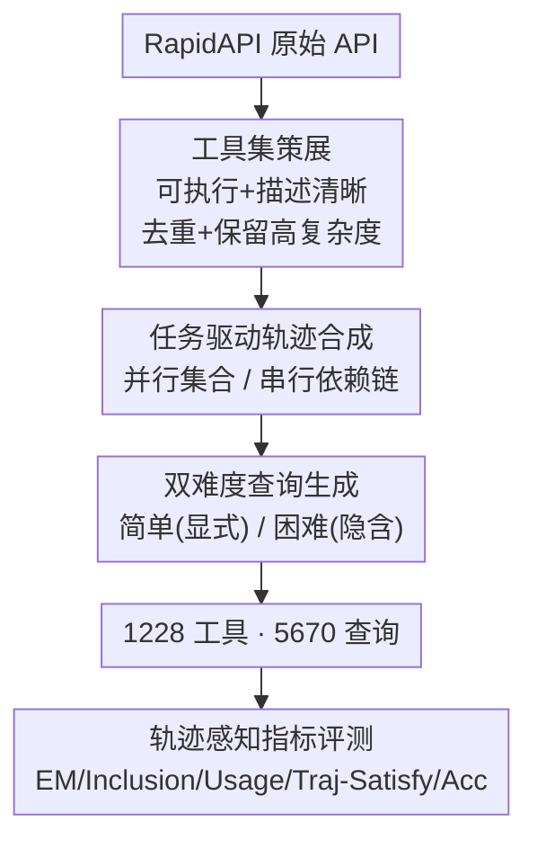

# TRAJECT-Bench：一个轨迹感知的智能体工具调用评测基准

**会议**: ICLR 2026  
**OpenReview**: [https://openreview.net/forum?id=TZWnWvsQ0X](https://openreview.net/forum?id=TZWnWvsQ0X)  
**代码**: https://github.com/PengfeiHePower/TRAJECT-Bench  
**领域**: Agent  
**关键词**: 工具调用, 智能体评测, 轨迹评测, RapidAPI, 工具检索

## 一句话总结
TRAJECT-Bench 用 1228 个可执行真实 API 构造了 5670 条「并行/串行」工具调用轨迹与「简单/困难」双难度查询，并把评测从「最终答案对不对」细化到「工具选对没、参数填对没、顺序/依赖满足没」的轨迹级诊断，从而揭示出大模型工具调用的具体失败模式（相似工具混淆、参数盲选）与「短轨迹→中等长度轨迹」的扩展瓶颈。

## 研究背景与动机

**领域现状**：大模型正越来越多地充当智能体的「大脑」，靠外部工具（搜索引擎、生产级 API、文件/系统操作）这双「手」去完成真实任务。如何评测大模型的工具调用能力，已经催生了 MetaTool、API-Bank、ToolBench、Gorilla、BFCL、ToolQA 等一批基准。

**现有痛点**：作者指出现有评测存在三个未被覆盖的缺口。第一，**轨迹复杂度被低估**——有的基准用的是小规模或模拟工具，多数只测短的、低深度的工具序列，而真实智能体面对的是大工具集和需要多个工具协同的复杂任务。第二，**查询复杂度被低估**——很多基准直接把 API 名字写进 prompt，而真实用户用的是间接、含隐含线索的口语化表达，模型得自己推断「该用哪个工具、参数怎么填」。第三，**只看最终答案**——ToolBench 只给 pass rate / win rate，BFCL 重度依赖整体准确率，这导致答案错了也定位不到根因（是选错工具？顺序乱了？还是参数填错？），而且无法把「工具调用能力」从「通用推理能力」里剥离出来——已有研究观察到模型即使调错工具，也能靠内部知识把答案蒙对。

**核心矛盾**：最终答案准确率这个「黑箱」指标，把工具选择、参数化、顺序/依赖三种正交能力揉成了一团，既看不清失败发生在哪一步，也分不清成功是「真会用工具」还是「内部知识兜底」。

**本文目标**：构造一个把工具调用本身当作一等评测目标的基准，需要同时提供（1）不同复杂度的工具调用轨迹、（2）同一轨迹下不同难度的查询、（3）从多个视角刻画工具调用能力的细粒度指标。

**核心 idea**：用「真实可执行工具 + 任务驱动的轨迹合成 + 双难度查询 + 轨迹感知指标」把工具调用拆解成可单独诊断的几个维度，让评测既能给出最终准确率，也能告诉你模型到底卡在选工具、填参数还是排顺序上。

## 方法详解

### 整体框架
TRAJECT-Bench 本质是一条「数据构造 + 评测」的流水线。数据侧先从 RapidAPI 里把 10 个真实领域（旅行、地图、金融、天气、电商、新闻/媒体、游戏、邮件、教育、音乐）的工具筛成一套高保真、可执行的工具集 $\mathcal{T}$；然后按任务类型驱动，分两条支路合成轨迹——**并行轨迹**（工具之间相互独立、是一个无序集合）和**串行轨迹**（工具构成依赖链、后一步吃前一步的输出）；每条轨迹再配上**简单**与**困难**两个语义对齐的查询版本。最终得到 1228 个工具、5670 条查询。评测侧把这些数据喂给一批 SOTA 大模型，既报最终答案准确率，也报一组**轨迹感知指标**（精确匹配、包含率、工具用法、轨迹满足度），并进一步评测「检索式工具选择」「模型自带的 agentic 工具调用」「ReAct 智能体」三类设定。

### 关键设计

**1. 高保真工具集策展：让评测站在真实、可执行、有区分度的工具之上**

现有基准要么用模拟/小工具，要么直接收录 RapidAPI 里大量描述含糊甚至跑不通的 API，导致评测不可靠。作者按四条标准人工策展：(1) **可执行且输出有意义**——用多组参数组合实际调用每个工具，丢掉报错的，再用 LLM 总结输出格式、删掉输出语义平凡（不提供有用信息）的；(2) **描述清晰、动作导向**——把原始稀疏文档和验证阶段观测到的真实 I/O 合并，例如原描述只有 "Get price (symbol)"，实测发现它有 50 条分页上限、返回 `{price, currency, timestamp}`，就把这些行为并进澄清后的描述；(3) **最小功能重叠**——对功能等价的 API（如多个航班搜索端点）去重、每个功能只保留一个代表，避免轨迹评测产生歧义，但参数化不同的近似工具会保留以增加难度；(4) **可控的工具复杂度**——人工保留参数复杂（字段多、类型/约束丰富）的工具，删掉过于简单（如无需输入）的，以便真正压测工具调用能力。最终得到高保真工具集 $\mathcal{T}$。

**2. 任务驱动的双结构轨迹合成：用并行与串行两种结构覆盖真实的广度与深度**

要让轨迹既真实又可控，作者不是凭空造工具序列，而是从**真实任务类型**（如旅行域的「实时行程监控与协助」、教育域的「创建数学与科学学习材料」）出发模板化地生成。轨迹被建模为两种基本结构。**并行轨迹**：提示 LLM 从任务类型描述和域内工具合成逻辑合法的计划，强制满足两条规则——必须用指定数量的工具（通常 3 到 10+ 个）、且每个调用自包含（输入预先固定）相互独立，因此编码为「带完整输入的工具调用无序集合」。**串行轨迹**：因为依赖很强、让 LLM 端到端直接产出正确链条很难，作者先构建一张有向工具图 $G_T=(V,E)$——每个工具是节点，当 $t_1$ 的输出能作为 $t_2$ 的输入参数时连一条有向边 $t_1\rightarrow t_2$（例如 `GetAllIATA` 返回的 IATA 码可喂给 `airportInfo`）；再在图上人工设计任务序列模板 $t_1\rightarrow t_2\rightarrow\cdots\rightarrow t_{n_{traj}}$，并显式标注相邻工具间的参数绑定（$t_i$ 的哪个输出填进 $t_{i+1}$ 的哪个输入字段），最后由 LLM 在模板基础上补全细节生成带参轨迹（每模板 5 条）。这样既保证了链条的逻辑自洽，又能在不同深度（工具数）上规模化、透明地评测。

**3. 双难度查询：把「查询难度」从轨迹复杂度里解耦出来单独测**

同一条轨迹，作者配两个语义对齐的查询版本。**简单版**给出直白精确的指令、显式点明需要的工具和关键参数；**困难版**则用自然线索和隐含表达传递同样的约束，模拟真实用户的口语化目标（如说「口碑好的酒店」而不是「按评分排序酒店」）。这样设计的价值在于：固定轨迹、只变查询难度，就能把模型的失败归因到「推断意图」这一层——如果简单版对、困难版崩，说明瓶颈不在工具知识而在从间接线索里推断该调哪个工具、填什么参数。所有轨迹和查询都经过 LLM 自动校验 + 人工审查以降低歧义。

**4. 轨迹感知评测指标：从「答案对不对」细化到「过程哪步错」**

这是基准最核心的差异点。除了最终答案的 (5) **Acc**（LLM 裁判判断最终答案是否匹配 ground truth），作者引入四个轨迹级指标：(1) **Exact Match (EM)**——预测轨迹的工具名集合是否和 ground truth 完全一致（只看工具名不看参数）；(2) **Inclusion**——ground truth 工具中有多大比例被包含进预测轨迹；(3) **Tool Usage**——预测的工具参数（schema 约束、格式、取值）是否匹配 ground truth；(4) **Traj-Satisfy**——当没有 gold trace 时，用 LLM 裁判（默认 Claude-4）打分判断预测轨迹在多大程度上能解决用户查询，模拟真实无标准答案的场景。检索式方法还额外报 (6) **retrieval rate**（ground truth 工具被检索到的比例）。EM、Inclusion、Usage 三者分别对应「选对工具集 / 召回工具 / 填对参数」，把过去糊成一团的工具调用能力拆成可单独诊断的维度——例如 Inclusion 高但 EM 低，就说明模型召回了对的工具但没凑齐完整集合。

## 实验关键数据

### 主实验
在域内工具设定下评测 10 个 SOTA 模型，并行查询结果（节选）：

| 模型 | 简单-EM | 简单-Acc | 困难-EM | 困难-Acc |
|------|---------|----------|---------|----------|
| Claude-4 | 0.846 | 0.905 | 0.445 | 0.517 |
| Gemini-2.5-pro | 0.851 | 0.911 | 0.442 | 0.498 |
| DeepSeek | 0.833 | 0.889 | 0.439 | 0.458 |
| qwen3-235b-A22B | 0.844 | 0.898 | 0.440 | 0.479 |
| Kimi-k2 | 0.815 | 0.902 | 0.321 | 0.448 |
| Claude-3.7 | 0.676 | 0.714 | 0.135 | 0.246 |
| Gemini-2.5-flash | 0.714 | 0.782 | 0.216 | 0.263 |

可以看到所有模型在**简单→困难**上都断崖式下跌（Claude-4 EM 0.846→0.445，Gemini-2.5-pro 0.851→0.442），说明从间接线索推断工具与参数是普遍短板。Traj-Satisfy 与 EM 高度同步（Claude-4 简单 8.549↔0.846、困难 4.882↔0.445），佐证 LLM 裁判可作为 EM 的有效代理。串行查询整体低于并行简单查询（Gemini-2.5-pro 并行简单 EM 0.851 vs 串行 0.807），说明步间依赖和顺序带来了额外挑战。

### 检索式工具选择（RQ2）

| 模型 | 设定 | 简单-EM | 简单-Acc | 困难-检索率 | 困难-EM |
|------|------|---------|----------|-------------|---------|
| Claude-4 | 无检索（域内全集） | 0.846 | 0.905 | — | 0.445 |
| Claude-4 | ToolLM-IR + Domain | 0.906 | 0.916 | 0.578 | 0.028 |
| Claude-4 | ToolLM-IR + All | 0.852 | 0.879 | 0.475 | 0.014 |
| Claude-3.7 | bge-large + Domain | 0.681 | 0.708 | 0.585 | 0.035 |

关键发现：当检索池已限定在域内时，检索对**简单查询几乎无增益**（EM/Acc 与不检索基本持平）；但对**困难查询检索成了严重瓶颈**——检索率多数仅五成出头，下游所有指标随之崩塌（困难-EM 跌到 0.01~0.03 区间）。根因是检索器重度依赖语义相似度，抓不到隐含查询背后的真实意图和步骤，导致级联失败。

### agentic 与 ReAct（RQ3）
- **模型自带 agentic 工具调用**（Table 5）：把工具走原生 tool-calling 接口 vs 当作 context 提供，两者表现对大多数模型相近（Claude-4 简单-EM 0.832 agentic vs 0.846 context）。
- **ReAct 智能体**（Table 6）：迭代式调用 + 检索能稳定提升。并行困难查询下 Claude-4 从 0.445 EM（单模型）提升到 0.463（ReAct），再用动态检索（每轮重新检索）进一步到 0.473；Claude-3.7 从 0.135 提到 0.186（域内工具）、动态 ReAct 下到 0.296。说明基于执行结果迭代调用，能为准确检索和用法提供更强基础。

### 关键发现
- **扩展瓶颈在「短→中等长度」轨迹**：随工具数增加所有模型 EM 都下滑，**最陡的下降发生在 3 到 5 个工具之间**；Claude-4 和 DeepSeek 泛化最稳，o4-mini 和 Kimi-k2 超过 7 个工具后急剧崩溃。
- **Inclusion 普遍高于 EM**（尤其困难并行和弱模型，如 Claude-3.7 0.554 vs 0.135），说明模型能召回部分对的工具，但凑不齐完整集合。
- **四类失败模式**：① 相似工具混淆（如 Spotify:Search vs YouTube Music:Search 分不清）；② 参数盲选（只看描述忽略参数，导致选错工具并级联失败，而 Kimi-k2 此问题罕见，暗示精细 agentic 训练有效）；③ 冗余调用（保守的「覆盖一切」式相关但无用调用，或幻觉式无关调用）；④ 困难查询下意图推断失败导致选了完全无关的工具。

## 亮点与洞察
- **把工具调用拆成可诊断的正交维度**：EM/Inclusion/Usage 分别盯「选对集合 / 召回 / 填对参数」，让「答案错了」第一次能定位到具体哪一步出错——这是相比只报最终准确率最实用的进步。
- **「同轨迹、双难度查询」是个巧妙的对照实验设计**：固定工具轨迹不变、只改查询表达方式，干净地把「意图推断难度」从「工具知识难度」里剥离，可直接迁移到任何需要解耦「理解 vs 执行」的评测里。
- **「3→5 工具是扩展悬崖」这一发现很有指导性**：它把「长程工具调用」的研究焦点从「能不能撑到 10 个工具」拉回到更现实的「中等长度轨迹的鲁棒性」，对训练数据构造和错误恢复机制设计有直接启示。
- **检索式工具选择在困难查询上的崩塌**戳破了「先检索缩小工具集」这一常见工程做法的可靠性假设：语义相似度抓不住隐含意图，这提示工具检索需要意图/步骤感知而非纯 embedding 匹配。

## 局限与展望
- **轨迹结构只覆盖并行与串行两种基本拓扑**，更丰富的图结构（混合/分支）留作未来工作，附录虽给了混合结构的初步实验，但主评测未纳入。
- **数据合成重度依赖 LLM**（轨迹、查询、描述澄清、裁判打分都用到 LLM），虽有人工审查，但 Traj-Satisfy 和 Acc 由 LLM 裁判给出，可能引入裁判模型自身的偏好/偏差。
- **领域固定为 10 个**，虽然作者称可按同样流水线扩展，但当前结论是否在更长尾、约束更怪的工业 API 上成立仍待验证。
- 改进方向：作者建议把精确的工具调用轨迹数据纳入训练（针对冗余调用与参数盲选），并探索意图感知的工具检索与显式建模依赖/顺序的推理方法。

## 相关工作与启发
- **vs ToolBench (Qin et al., 2023)**：ToolBench 同样用 RapidAPI、支持多步，但只报最终的 pass/win rate，且评测时只提供检索到的工具子集；TRAJECT-Bench 把工具选择策略本身当作评测的一部分（all/domain/retrieval 三种），并引入轨迹级指标，能诊断到选工具/参数/顺序哪一步出错。
- **vs Gorilla / BFCL (Patil et al.)**：它们把调用 ground 在公开 API、给跨域执行打分，但仍以整体准确率为主、轨迹结构与扩展性不在评测维度；本文显式建模轨迹结构（并行/串行）与工具数扩展，并新增轨迹感知指标。
- **vs ToolQA (Zhuang et al., 2023)**：ToolQA 面向工具增强推理、强调查询难度，但工具非真实可执行、无轨迹结构；TRAJECT-Bench 用 1228 个可执行真实工具补上了「实用工具 + 大而多样 + 轨迹结构与扩展」这几个维度。

## 评分
- 新颖性: ⭐⭐⭐⭐ 轨迹感知指标 + 双难度查询 + 双结构轨迹合成的组合在工具调用评测里是首次系统化，单项技术不算颠覆但拼图很完整。
- 实验充分度: ⭐⭐⭐⭐⭐ 覆盖 10 个 SOTA 模型 × 并行/串行 × 简单/困难 × 检索/agentic/ReAct，还做了扩展曲线和失败模式归因，实验非常密集。
- 写作质量: ⭐⭐⭐⭐ 动机—缺口—设计—发现的逻辑清晰，Table 1 的能力对照一目了然，指标定义稍显密集。
- 价值: ⭐⭐⭐⭐⭐ 提供可执行工具集 + 细粒度诊断指标 + 可操作洞察（扩展悬崖、检索瓶颈），对工具调用训练与评测都有直接参考价值。

<!-- RELATED:START -->

## 相关论文

- [\[ICLR 2026\] Terminal-Bench：在命令行界面上对智能体进行困难、真实任务的基准测试](terminal-bench_benchmarking_agents_on_hard_realistic_tasks_in_command_line_inter.md)
- [\[ICLR 2026\] EXP-Bench: Can AI Conduct AI Research Experiments?](exp-bench_can_ai_conduct_ai_research_experiments.md)
- [\[ICLR 2026\] WARC-Bench: Web Archive based Benchmark for GUI Subtask Executions](warc-bench_web_archive_based_benchmark_for_gui_subtask_executions.md)
- [\[ICLR 2026\] InfoMosaic-Bench: Evaluating Multi-Source Information Seeking in Tool-Augmented Agents](infomosaic-bench_evaluating_multi-source_information_seeking_in_tool-augmented_a.md)
- [\[ICLR 2026\] MCP Security Bench (MSB): Benchmarking Attacks Against Model Context Protocol in LLM Agents](mcp_security_bench_msb_benchmarking_attacks_against_model_context_protocol_in_ll.md)

<!-- RELATED:END -->
