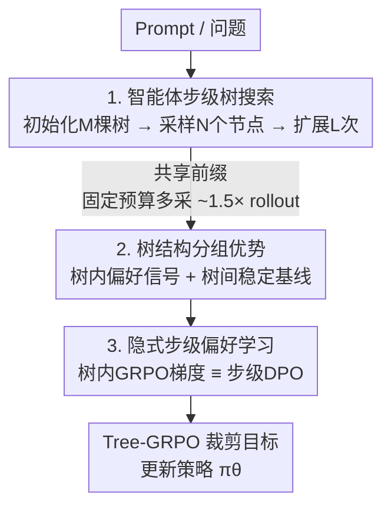

# Tree Search for LLM Agent Reinforcement Learning

**会议**: ICLR 2026  
**OpenReview**: [https://openreview.net/forum?id=ZpQwAFhU13](https://openreview.net/forum?id=ZpQwAFhU13)  
**代码**: https://github.com/AMAP-ML/Tree-GRPO  
**领域**: Agent / 强化学习  
**关键词**: 智能体RL, 树搜索, 过程监督, GRPO, 多轮工具调用

## 一句话总结
把多轮智能体 RL 的「链式独立采样」换成「智能体步级树搜索采样」，靠共享前缀在固定 token/工具调用预算下采到约 1.5× 的轨迹，并利用树的分支结构把稀疏的结果奖励自动转成步级过程监督信号（理论上等价于步级 DPO），在 11 个 QA 数据集上全面超过链式 GRPO。

## 研究背景与动机

**领域现状**：RL 已经成为 LLM 后训练的主流范式，只用结果奖励（outcome reward）就能在数学、代码这类单轮任务上练出强推理能力。近期工作把这套范式推广到多轮智能体场景——让 LLM 以 ReAct 的「思考-行动-观察」（Thought-Action-Observation）循环和环境交互、调用工具来完成长程任务。主流做法是 GRPO 这类基于分组的算法：对每个 prompt 独立采 $N$ 条完整轨迹，用组内均值当 baseline 估优势。

**现有痛点**：把链式 GRPO 直接搬到智能体上有两个硬伤。其一是**采样预算极重**：智能体轨迹动辄上万 token、还伴随多次工具调用（有的搜索 API 很贵），而独立采样的多条轨迹彼此高度冗余，rollout 阶段直接主导了整个训练耗时。其二是**监督极度稀疏**：轨迹随交互轮数线性变长，但奖励仍然只在最终结果处给一个标量，整条多步轨迹里每一步拿到的 credit 完全相同（见公式 $A(H)=A(\{\tau_0,\alpha_0,o_0\})=\dots=A(\{\tau_T,\alpha_T,o_T\})$）。哪一步对成功/失败有贡献根本分不清，导致学习信号严重失衡、甚至训练崩溃。

**核心矛盾**：即使猛加采样预算，采到的更多轨迹仍然被同样稀少的结果信号监督——「预算」和「监督粒度」两件事被链式采样绑死了，加预算不解决稀疏，省预算又没法探索。

**本文目标**：在**只用结果奖励、且预算受限**的前提下，为智能体 RL 同时做到「省采样预算」和「造细粒度过程信号」两件事。

**切入角度**：智能体任务天然有清晰的步结构——一个完整的 (思考, 行动, 观察) 元组就是一个语义自洽的决策单元。如果把采样组织成树、让不同轨迹共享公共前缀，那么固定预算下能多采轨迹（省预算）；更关键的是，树的每个分支点天然就是一次「同前缀、不同后续」的对照，分支间结果奖励的差异本身就是一个步级偏好信号（造监督）。

**核心 idea**：用**智能体步级的树搜索采样**替代链式独立采样，并在树结构上做「树内 + 树间」两级分组优势估计，把结果奖励隐式转成步级偏好学习目标——即 Tree-GRPO。

## 方法详解

### 整体框架

Tree-GRPO 在标准 GRPO 的「采样—估优势—更新策略」三段流程上动手术，但每一段都换成树结构版本。给定一个 prompt（问题），整体流程是：先用初始化-再扩展的方式为它建起 $M$ 棵树（每个树节点是一个完整智能体步），靠随机扩展在固定预算下采到比链式更多的 rollout；然后在树上做两级分组优势估计——树内分组在分支点构造过程/偏好信号、树间分组提供稳定 baseline；最后把合并后的优势喂进 GRPO 式的裁剪目标更新策略。理论分析进一步表明，树内分组优势的梯度结构和步级 DPO 等价，这解释了为什么纯结果奖励能产生步级监督。

### 关键设计

**1. 智能体步级树搜索采样：用共享前缀把固定预算榨出更多 rollout**

针对「采样预算重、轨迹冗余」这个痛点，作者把链式独立采样换成树搜索。难点在于经典 MCTS 依赖多轮顺序展开，和并行 LLM 推理引擎不匹配、吞吐被卡死。本文用**初始化-再扩展**（initialize-then-expand）规避：① **初始化**——对每个 prompt $x_i$ 先并行采 $M$ 条完整链式轨迹，作为 $M$ 棵树的初始主干；② **采样**——从每棵树里随机挑 $N$ 个非叶节点（叶节点是已给出答案的终点）；③ **扩展**——对每个被选节点，把从根到它的整段上下文 $H^i_{<t}$ 连同原 prompt 一起喂回策略模型，续生成剩余部分，作为新分支插回树里。把②③重复 $L$ 次，单个 prompt 最终得到 $M\times(L\times N+1)$ 条 rollout 作为组规模 $G$。

关键是节点单元的选取：现有树式 RL 多用 token/句子级节点，而智能体任务有清晰的步结构，于是这里**每个节点对应一个完整的 $(\tau,\alpha,o)$ 步**，上下文切分语义自洽，且能在 token 和工具调用两个维度上同时约束预算。由于一次随机扩展选中节点的期望深度是最大深度的一半、对应期望开销约 $B/2$（$B$ 为单条完整轨迹的期望预算），树搜索的总期望预算为
$$E[B_{\text{tree}}] = M\cdot B + L\cdot N\cdot B/2.$$
同等预算下树搜索能比链式多采约 1.5×（随树形而变）的轨迹。减小树数 $M$、增大扩展数 $N,L$ 可进一步提升 rollout 数，但会让更多轨迹共享前缀、收窄探索面，是个需要权衡的旋钮。

**2. 树内 + 树间两级分组优势：让稀疏结果奖励在分支点变成过程信号**

针对「监督稀疏、credit 分不清」这个痛点，作者利用树结构本身造过程监督。核心观察是：在树的**每个分支点**，从各自子树叶节点反传上来的结果奖励之间的差异，天然构成一个针对不同子树的偏好学习目标——而且子树越深、过程信号粒度越细；由于扩展是随机的，自然就产出了不同粒度的过程信号。具体实现是在每棵树内做分组优势估计 $\hat{A}_{\text{Intra-tree}}$，用同一棵树内的 rollout 集合做组内标准化：
$$\hat{A}_{\text{Intra/Inter-tree}}(H_i) = \big(R(H_i) - \text{mean}(\{R(H_j)\})\big) / \text{std}(\{R(H_j)\}).$$
但单棵树内分支数往往太少，导致 $\hat{A}_{\text{Intra-tree}}$ 方差高、baseline 不稳，RL 极易崩溃。于是再跨所有树做一次树间分组 $\hat{A}_{\text{Inter-tree}}$ 当稳定的后备 baseline，二者相加得到最终优势
$$\hat{A}_{\text{tree}}(H_i) = \hat{A}_{\text{Intra-tree}}(H_i) + \hat{A}_{\text{Inter-tree}}(H_i),$$
再代入 token 级重要性采样比 $r_{i,t}(\theta)$ 的 GRPO 裁剪目标（带 $\beta D_{KL}$ 正则）优化。这样既拿到了树内的步级偏好信号，又靠树间分组保住了训练稳定性。

**3. 隐式步级偏好学习：证明树内 GRPO 与步级 DPO 同构**

这是为设计 2「为什么纯结果奖励能产生步级监督」给出的理论支撑。作者在二元偏好假设下（每个中间节点 $(x,H_{<t})$ 的后续轨迹按奖励分成 win/loss 两类、奖励 $\{1,0\}$）推导发现：步级 DPO 的梯度和树内 GRPO 的梯度可以写成**同一个统一形式**
$$\nabla_\theta J_{\text{unified}}(\theta) = \underbrace{w}_{\text{权重}}\cdot\underbrace{\big(\nabla_\theta\log p_\theta(H^{\text{win}}_{\ge t}) - \nabla_\theta\log p_\theta(H^{\text{loss}}_{\ge t})\big)}_{\text{偏好优势梯度}},$$
唯一区别只在权重项 $w$ 的选择上。这说明树内 GRPO 实质上是在**在线 rollout** 设定下隐式做步级偏好优化，因而继承了步级 DPO 的细粒度优化性质，却不需要离线构造正负样本对、也不增加训练管线复杂度。

### 损失函数 / 训练策略
最终目标是 GRPO 式的 token 级裁剪目标，把组内优势换成 $\hat{A}_{\text{tree}}$，并保留 $\beta D_{KL}(\pi_\theta\|\pi_{\text{ref}})$ 正则：
$$J_{\text{Tree-GRPO}}(\theta) = \mathbb{E}\Big[\tfrac{1}{G}\sum_i \tfrac{1}{|H_i|}\sum_t \min\big(r_{i,t}\hat{A}_{\text{tree}}, \text{clip}(r_{i,t},1-\epsilon,1+\epsilon)\hat{A}_{\text{tree}}\big) - \beta D_{KL}\Big].$$
工具统一用搜索引擎：多跳/单跳 QA 用 E5 本地检索（Wikipedia dump），Web-Agent QA 用真实 web 搜索 API。默认每个 prompt 训练预算为 4 条完整轨迹的开销。

## 实验关键数据

在 11 个数据集、3 类 QA 任务上评测，模型覆盖 Qwen2.5（Base/Instruct）与 Llama3.2，参数量 1.5b/3b/7b/14b。指标：单跳/多跳 QA 用 EM，Web-Agent QA 用 F1。

### 主实验

多跳 QA（需要多轮交互）上，Tree-GRPO 相对链式 GRPO 的提升在小模型上最显著：

| 模型 | 任务 | 链式 GRPO | Tree-GRPO | 相对提升 |
|------|------|-----------|-----------|----------|
| Qwen2.5-1.5b | 多跳 QA Avg | 11.3 | **19.1** | +69% |
| Qwen2.5-1.5b | 单跳 QA Avg | 43.4 | **47.5** | +9.5% |
| Llama3.2-3b | 多跳 QA Avg | 26.7 | **36.8** | +38% |
| Qwen2.5-3b | 多跳 QA Avg | 31.8 | **36.8** | +16% |
| Qwen2.5-14b | 多跳 QA Avg | 41.8 | **45.3** | +8.4% |

小模型（<7b）在 ReAct 提示下几乎没有提升，说明光靠提示不足以完成长程智能体任务；而 Tree-GRPO 即便在 Qwen2.5-1.5b 上也能激发多轮工具使用，链式方法则学不起来。单跳 QA 因为多数题目一轮检索即可解决、树深通常只有 2，过程信号收益有限。Web-Agent QA 上提升受限于训练数据质量，但仍稳定优于链式，GAIA 上平均提升约 28%。

### 预算 / 优势消融

预算消融（Qwen2.5-3b，多跳 QA Avg）显示极限低预算下树搜索优势最大，且 Tree-GRPO 用 1/4 预算即可超过链式：

| 每 prompt 预算 | 链式 | 树式 | 相对提升 |
|----------------|------|------|----------|
| ≈2 | 14.9 | 31.6 (M=1,N=2,L=1) | +112% |
| ≈4 | 31.8 | 36.8 (M=2,N=2,L=1) | +16% |
| ≈8 | 31.4 | 36.4 (M=2,N=6,L=1) | +16% |
| ≈16 | 33.9 | 37.3 (M=4,N=5,L=1) | +10% |

优势估计消融（预算≈4，多跳 QA Avg）验证了「树内造信号 + 树间稳基线」的必要性：

| 优势配置 | 多跳 Avg | 说明 |
|----------|---------|------|
| Chain-based | 31.8 | 基线 |
| 仅 $\hat{A}_{\text{Intra-tree}}$ (M=2,N=2) | collapse | 树内分支太少，方差高、训练崩溃 |
| 仅 $\hat{A}_{\text{Inter-tree}}$ (M=2,N=2) | 33.8 (+6.3%) | 只用全局 baseline，已超链式 |
| $\hat{A}_{\text{Intra}}+\hat{A}_{\text{Inter}}$ (M=2,N=2) | **36.8 (+16%)** | 完整版，最稳最好 |

### 关键发现
- **分支数不足时树内优势会崩**：单棵树内 rollout 太少（N=2）时仅用 $\hat{A}_{\text{Intra-tree}}$ 直接 collapse，必须靠 $\hat{A}_{\text{Inter-tree}}$ 兜底；当分支充足（N=6）时树内优势单独也能用。即便只用 $\hat{A}_{\text{Inter-tree}}$，因树搜索同预算采样更高效，也已超过链式 GRPO。
- **预算越紧、树式越赢**：≈2 预算时相对提升高达 112%；随预算增大、单跳场景的「更多轨迹」红利逐渐消退，但多跳场景的「细过程信号」红利持续存在。
- **鼓励更长交互**：多跳 QA 上树式把平均工具调用/动作数从 2.4 提到 3.0，更愿意做长程探索而非走捷径，这对真正需要长程交互的任务很有价值。
- **对超参更鲁棒**：在所有学习率 warmup 比例与 KL 系数设置下树式都优于链式，小模型（<3b）训练对 LR warmup 尤其敏感，而树式更稳。

## 亮点与洞察
- **「省预算」和「造监督」用同一个机制一次解决**：树的共享前缀既减少了 rollout 冗余（省 token/工具调用），又在分支点天然提供了过程信号——一石二鸟，且整套东西只依赖结果奖励、即插即用、不需要训 PRM 或离线造 DPO 数据。
- **节点选在「智能体步」而非 token/句子**：这是和已有树式 RL（VinePPO、SPO 等）最本质的区别。智能体步是语义自洽的决策单元，切分清晰、能同时约束 token 与工具调用预算，让树搜索第一次真正适配智能体任务。
- **理论把在线 RL 和步级 DPO 接上了**：证明树内 GRPO 与步级 DPO 梯度同构，相当于「在线、免造对」地拿到 DPO 的细粒度好处，这个等价性视角可迁移到其他想把结果奖励变成过程奖励的场景。
- **initialize-then-expand 解决了树搜索与并行推理引擎的矛盾**：先并行建主干、再批量扩展节点，避免了 MCTS 顺序展开拖垮吞吐，是把树搜索塞进在线 RL 的工程关键。

## 局限与展望
- 作者承认 **Web-Agent QA 提升有限**，主因是开源 web-agent 基准多为测试集、缺高质量训练集，收集到的训练数据难度/质量配不上 BrowseComp 这类极难基准。
- **单跳/浅树场景收益小**：树深只有 2 时过程信号几乎退化成轨迹信号，方法的价值高度依赖任务本身的多轮深度。
- **树形超参敏感**：$M,N,L$ 之间存在「rollout 数 ↔ 探索面」的权衡，减小 $M$ 增大 $N,L$ 虽能多采但会因前缀重叠收窄探索，不同配置效果差异明显，需要按预算调。
- 二元偏好假设（win/loss、奖励 $\{1,0\}$）是理论等价性的前提，连续/稠密奖励下的等价关系还需进一步分析。
- 改进方向：把工具从单一搜索引擎扩到更丰富的工具集、为难基准补高质量训练数据、自适应选择扩展节点（而非随机）以更精准地分配过程信号粒度。

## 相关工作与启发
- **vs 链式 GRPO / GSPO**：它们独立采完整轨迹、credit 只在结果处给且全轨迹相同；本文用树共享前缀，既省预算又在分支点造步级信号，全面胜出。
- **vs token/句子级树式 RL（VinePPO、SPO）**：它们在 token/句子级建树，无法直接用于智能体任务；本文把节点锚在完整智能体步上，语义切分清晰、同时约束工具调用预算。
- **vs 离线步级 DPO（构造正负对的 MCTS-DPO 类）**：它们离线造 step-level 偏好数据、管线复杂；本文证明在线树内 GRPO 与步级 DPO 梯度同构，免造对、免离线、即插即用。
- **vs PRM 类过程奖励**：PRM 需要昂贵的步级标注且难训、难规模化；本文纯靠结果奖励 + 树结构自动得到过程信号，规模化友好。

## 评分
- 新颖性: ⭐⭐⭐⭐⭐ 把「智能体步级树搜索」和「树内 GRPO≡步级 DPO」的理论等价结合，角度新且落地
- 实验充分度: ⭐⭐⭐⭐⭐ 11 数据集 × 多模型多尺度，预算/优势/超参消融齐全
- 写作质量: ⭐⭐⭐⭐ 动机—方法—理论—实验链条清晰，公式与图配合到位
- 价值: ⭐⭐⭐⭐⭐ 同预算多采 + 免标过程信号，对昂贵多轮智能体 RL 训练实用价值高

<!-- RELATED:START -->

## 相关论文

- [\[ICLR 2026\] AlphaAgentEvo: Evolution-Oriented Alpha Mining via Self-Evolving Agentic Reinforcement Learning](alphaagentevo_evolution-oriented_alpha_mining_via_self-evolving_agentic_reinforc.md)
- [\[ICLR 2026\] ToolTree: Efficient LLM Agent Tool Planning via Dual-Feedback Monte Carlo Tree Search and Bidirectional Pruning](tooltree_efficient_llm_tool_planning_via_dual-feedback_monte_carlo_tree_search_a.md)
- [\[ICLR 2026\] WebSeer: Training Deeper Search Agents through Reinforcement Learning with Self-Reflection](webseer_training_deeper_search_agents_through_reinforcement_learning_with_self-r.md)
- [\[ACL 2026\] LiTS: A Modular Framework for LLM Tree Search](../../ACL2026/llm_agent/lits_a_modular_framework_for_llm_tree_search.md)
- [\[ICLR 2026\] Language Agents for Hypothesis-driven Clinical Decision Making with Reinforcement Learning](language_agents_for_hypothesis-driven_clinical_decision_making_with_reinforcemen.md)

<!-- RELATED:END -->
