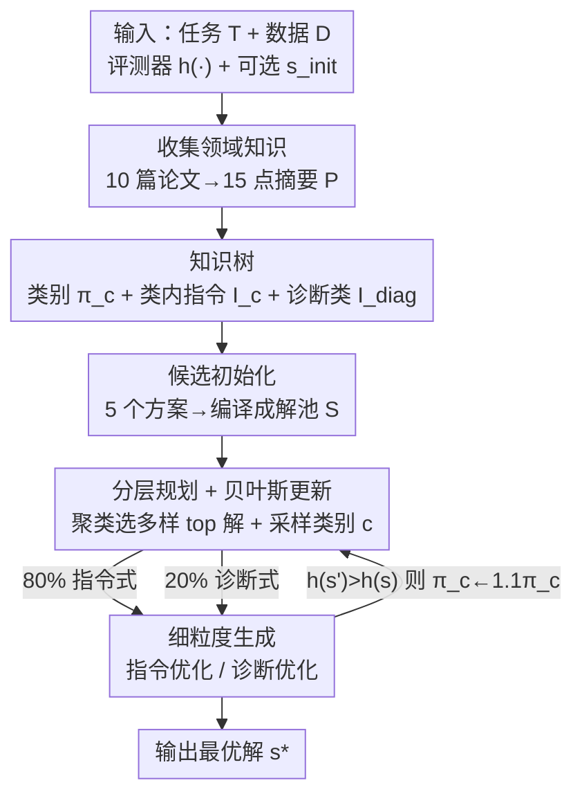

# TusoAI: Agentic Optimization for Scientific Methods

**会议**: ICLR 2026  
**OpenReview**: [https://openreview.net/forum?id=0M6BfcAVMW](https://openreview.net/forum?id=0M6BfcAVMW)  
**代码**: https://github.com/Alistair-Turcan/TusoAI  
**领域**: Agent / 科学发现 / 自动机器学习  
**关键词**: 科学方法优化, LLM Agent, 知识树, 贝叶斯采样, 单细胞分析

## 一句话总结
TusoAI 是一个为「科研计算方法开发」量身定制的 agent：给定任务描述、数据和一个评测函数 $h(\cdot)$，它把领域知识组织成知识树，再用贝叶斯更新的分层规划 + 诊断式细粒度优化，在候选解池上迭代自我改进，最终在 11 个科学任务上稳定超过专家方法、MLE agent 和通用科学 agent，还在两个遗传学难题上改进了 SOTA 方法并发现了被旧方法遗漏的新生物学。

## 研究背景与动机
**领域现状**：科学发现常常卡在「为分析实验数据而手工开发计算工具」这一步——科学家要反复读文献、用经验数据检验建模假设、再把洞见落成高效代码，一个鲁棒方法往往要多个专家组花数年。LLM 在文献综述、用数据推理、生成领域代码上都展现了能力，于是出现了两类系统：一类是「科学分析 agent」（如 Biomni、Stella、ChemCrow），擅长用**已有工具**拼装并执行分析流水线；另一类是「机器学习工程（MLE）agent」（如 AIDE、DS-Agent、MLE-STAR），能为通用 ML 任务**设计新算法**。

**现有痛点**：这两类系统都不适合科研「方法开发」。科学分析 agent 不创造新算法，只是调用现成工具；MLE agent 虽然能造新算法，却假设知识是结构化的、已有 ML 模型可复用、搜索空间固定——这些在科研里统统不成立。科研里的领域知识高度**非结构化**（散落在论文里），现成模型常常**不存在**，优化目标和搜索空间**随研究持续演化**。经典 AutoML/NAS 更是被预定义搜索空间锁死，无法吸收领域先验。

**核心矛盾**：方法开发既要**探索多样性**（避免在局部最优里反复打转、只会换皮微调），又要保证**解的质量**（不能盲目乱试浪费算力预算）；同时还要把非结构化的领域知识真正用进每一步优化里，而不是只靠 LLM 的参数先验。

**本文目标**：做一个能自主开发并优化科研计算方法的 agent，把结构化领域知识、系统化的假设探索、迭代式诊断都纳入同一个优化循环。

**切入角度**：模仿科学家做方法开发的循环——读文献建立先验、按类别尝试不同优化策略、诊断方法的中间输出再改进。关键观察是：如果把领域知识显式组织成「类别 + 类内指令」的树，就能既保证多样性（按类别采样）又保证相关性（指令来自论文），还能用贝叶斯更新把「哪类策略此刻更有用」的信念学出来。

**核心 idea**：用「知识树 + 贝叶斯分层规划 + 诊断式细粒度优化」三件套，把领域知识驱动的迭代优化做进一个 agent，让它只改大型代码库里的**一个函数**就能持续打磨出新方法。

## 方法详解

### 整体框架
TusoAI 把问题形式化为：在通用解空间 $S_{full}$（如所有 Python 脚本）上，找到最大化评测函数的解 $s^* = \arg\max_{s} h(s)$，其中 $h(\cdot)$ 可以是 AUC、多指标均值或领域专用度量（如推断疾病基因相对专家集的富集度）。输入是任务描述 $T$、数据集 $D$、评测器 $h(\cdot)$，以及可选的初始解 $s_{init}$（warm start，如某个 SOTA 方法）；它**只操作一个任意大代码库中的单个函数**，因此能在带大量脚手架的科研方法上灵活改造。

整体跑三大步：**Step 1 收集领域知识**——从 Semantic Scholar 按引用量取最多 10 篇相关论文，对每篇生成并迭代精炼一份 15 点技术摘要 $P=\{P_i\}$，让后续指令反映领域最佳实践而非纯 LLM 先验；**Step 2 构建知识树**——用「先草拟再精炼（draft-then-refine）」造出两层结构：优化策略**类别** $\mathcal{C}$（每类带效用概率 $\pi_c$）和**类内指令** $I_c$，外加一个预定义的诊断类别 $I_{diag}$；**Step 3 迭代优化**——先初始化候选解池 $S$，然后在时间预算（默认 8 小时）内反复挑出多样的 top 解，对每个解以 80% 概率做指令式优化、20% 概率做诊断式优化，并用贝叶斯更新调整类别概率、用反馈列表抑制重复。

### 关键设计

**1. 知识树：把非结构化领域知识组织成「类别 + 类内指令」的两层结构**

科研领域知识散落在论文里、形式各异，LLM 直接「优化这个模型」式的泛指令既无方向也容易重复。TusoAI 用知识树解决这点。第一层是**优化策略类别** $\mathcal{C}$，可以是通用的（如「正则化」「模型架构」）也可以是领域专属的（如「单细胞噪声建模」「遗传特征交互」）；每个类别带一个效用概率 $\pi_c$，初始化时让流水线靠前的类别（如「特征预处理」）权重高于靠后的（如「超参调优」）。第二层是**类内指令** $I_c$：先由 agent $A_{instr}$ 从任务描述草拟 10 条，再对每篇论文摘要 $P_i$ 追加 10 条精炼。每个类别还各挂一个反馈列表 $F_c$（初始为空），优化过程中不断累积「这次改动做了什么、效果如何」的总结。此外预定义一个诊断类别 $I_{diag}$，专门给出「记录训练曲线 / 检查分布 / 验证假设」这类用于诊断的指令。这样一来，知识既结构化又可采样，多样性（跨类别）和相关性（指令源自真实论文）兼得。

**2. 分层规划 + 贝叶斯更新：在保证质量的前提下主动探索多样解**

agent 优化最容易陷入「在局部最优附近反复换皮微调」。TusoAI 的对策有两层。先是**多样 top 解选取**：把当前解池按「代码-文本相似度」聚类，在每个簇内挑出性能落在该簇最优 0.1% 以内的**最短**解——既压低过拟合和随机性，又保留簇间多样性、鼓励简洁代码。再是**贝叶斯式类别采样**：每轮按类别效用分布 $c \sim \mathrm{Cat}(\{\pi_c\}_{c\in\mathcal{C}})$ 抽一个类别，若这次优化让 $h(s') > h(s)$，就做一次贝叶斯更新 $\pi_c \leftarrow 1.1\,\pi_c$ 再归一化，表示「此刻这个类别里含有用指令」的信念上升。这把「哪类策略当前更值得试」从静态先验变成随经验自适应的分布。规划层还随时间逐步收缩并行宽度（每 2 轮 $N_{top}\leftarrow\max(1, N_{top}-1)$），从广撒网逐渐聚焦到精修。消融显示去掉贝叶斯采样后计算效率掉得最多（优化耗时从 2.3h 升到 3.0h）。

**3. 细粒度生成：把指令式优化与诊断式优化拧成一个改进循环**

理解复杂数据规律很难，单靠「按指令改代码」不够，还需要像科学家那样**诊断方法的中间输出**再改进。TusoAI 对每个 top 解二选一：**指令式优化（80%）**——先采样类别 $c$，从 $I_c$ 里均匀抽 3 条候选指令、选最有希望的一条，结合该类别最近 5 条反馈把 $s$ 优化成 $s'$；改完由反馈 agent $A_{feedback}$ 总结这次变化（如「在前 50 个主成分上建 kNN 而非全基因，性能提升 15%」）并写回 $F_c$。**诊断式优化（20%）**——从 $I_{diag}$ 抽 3 条诊断指令选一条，先运行 $s$ 收集诊断日志（训练曲线、分布检查等），再据此产出改进解 $s'$，反馈写回 $F_{diag}$。每次实现尝试限时 10 分钟、至多 2 次修 bug，这种时间正则既防止少数低效实现拖垮整轮预算，也逼最终方法保持可扩展。两条路径配合知识树的指令与反馈，让 agent 既能「按已知策略改」也能「看数据反应再改」。

### 一个完整示例
以单细胞**去噪（Denoise）**任务为例看优化轨迹：TusoAI 从零起步，依次命中 5 个关键改动并逐步把性能推到最高——(1) 引入非负矩阵分解（NMF），(2) 对 dropout 率建模，(3) 对 Poisson 噪声建模，(4) 加入迭代精炼，(5) 加上稀疏性平衡步骤。值得注意的是，过程中它生成了大量**反而降低性能**的方法才收敛到高性能解——正是这种「广探索 + 反馈记忆」让它高效搜遍解空间。最终 TusoAI 设计出的 NMF 方案（建模 dropout + Poisson + 迭代精炼）与 OpenProblems 基准里唯一另一个 NMF 方法 ALRA 截然不同，是**全新方法而非现成包的调用**。

## 实验关键数据

### 主实验
评测覆盖 11 个科学任务：6 个单细胞分析任务（去噪 Denoise、标签投影 Label、批次整合 Batch、空间可变基因 SVG、空间解卷积 Decomp、降维可视化 Visual）+ 5 个科学深度学习任务（全向视觉 Spherical、假肢控制 NinaPro、心电诊断 ECG、卫星监测 Satellite、基因预测 DeepSEA）。每个任务跑 8 小时，验证集调优、测试集评测。

| 单细胞任务 | Avg | Avg Rank | 说明 |
|--------|------|----------|------|
| Expert（专家方法） | 0.57 | 3.7 | 顶级专家设计方法 |
| AIDE*（MLE agent） | 0.52 | 3.0 | 第二好的平均排名 |
| Biomni* | 0.49 | 3.7 | 科学分析 agent |
| ChatGPT-Agent* | 0.57 | 3.5 | GPT-5 后端 |
| **TusoAI*** | **0.66** | **1.2** | 从零生成代码，全面领先 |

在 5 个科学深度学习任务上，TusoAI 平均分 0.70、平均排名 2.8（第二好为 4.0），与专家方法（0.69）和 DARTS（0.71）相当或更优，且所有生成方法都计算高效（单细胞 <3 分钟、深度学习 <8 分钟）。

### 消融实验

| 配置 | Avg | Avg Rank | 说明 |
|------|------|---------|------|
| TusoAI (default) | 0.66 | 2.0 | 完整模型 |
| No categories | 0.57 | 3.2 | 去掉类别结构、指令全塞一类 |
| No Bayesian | 0.55 | 3.4 | 关闭贝叶斯采样、类别均匀采 |
| No diagnosis | 0.64 | 2.0 | 关闭诊断式优化 |
| No knowledge | 0.46 | 3.8 | 丢掉领域知识、只用泛指令 |

### 关键发现
- **领域知识贡献最大**：去掉领域知识（No knowledge）性能掉得最狠（0.66→0.46），代码多样性也从 0.48 跌到 0.33——说明把论文知识结构化进优化是核心增益来源。
- **贝叶斯更新主要管效率**：去掉它平均排名掉最多、优化耗时从 2.3h 升到 3.0h，证明自适应类别采样让搜索更快收敛。
- **多样性是关键中介**：TusoAI 全程代码多样性显著高于 AIDE（AIDE 在 Batch 任务反复提 UMAP 的小变体，TusoAI 则广探索多种降维/变换/缩放），消融各版本性能下降都伴随多样性下降。
- **小模型够用且便宜**：GPT-4o-mini、Claude-3.5-Haiku 等低延迟模型配上好系统设计，性能不输甚至超过 GPT-5/Claude-4-Sonnet——后者倾向「过度构建」（GPT-5 每个方法 300+ 行）反而难精炼；去噪任务跑 8 小时，GPT-4o-mini 只花 \$0.24，GPT-5 要 \$22.3。
- **遗传学实战出新生物学**：优化 scDRS 后因果模拟功效提升 >40%、真实数据多发现 21% 真关联（17 vs 14），24 小时内试了 167 个变体、花 \$0.37（原作者 3 个月才试 <10 版）；优化 pgBoost 后金标准链接富集提升 13.8%（eQTL）/7.2%（ABC），24 小时试 511 个特征组合、\$0.41（原作者 1.5 个月试 5 个特征），并找到 7 条被旧方法遗漏的变体-基因新链接。

## 亮点与洞察
- **只改一个函数**：TusoAI 只操作大型代码库里的单个函数，这让它能直接嫁接到 scDRS、pgBoost 这种「太大、改不动整脚本」的真实科研代码上，是它能落地遗传学难题的关键工程前提——也是相对「要重写整个 Python 脚本」的 agent 的硬区别。
- **知识树把多样性与相关性解耦**：类别保证「往不同方向探」，类内指令（源自论文）保证「每个方向都靠谱」，贝叶斯更新再把「哪个方向当前有用」学出来——三者把探索-利用的张力拆得很干净，是可迁移到任何 agent 搜索任务的设计范式。
- **诊断式优化模拟「看中间输出再改」**：80/20 的指令/诊断混合，把「按文献改」和「按数据反应改」两种科学家直觉都编码进循环，比纯指令驱动更能理解复杂数据规律。
- **「反而变差的中间解」是特性不是 bug**：去噪轨迹里大量降性能尝试恰恰是广探索的代价，配合反馈记忆最终带来更优收敛——提醒我们评估 agent 不应只看单调上升曲线。

## 局限与展望
- **依赖好的评测函数 $h(\cdot)$**：整个优化以 $h$ 为唯一信号，若评测指标本身有偏或不可靠（科研中常见），优化可能朝错误方向走，论文未深入讨论评测噪声的影响。
- **8 小时 / 时间正则的预算假设**：限时 10 分钟一次实现、8 小时总预算是经验设定，对需要长训练的大模型任务是否适用、如何调这些预算缺少系统分析。
- **横向比较的可比性 caveat**：不同任务难度差异大，单细胞平均排名 1.2 与深度学习 2.8 不可直接比；深度学习任务上 TusoAI（0.70/2.8）相对专家（0.69）和 DARTS（0.71）的领先并不明显。
- **与并发工作无法直接比**：Aygün et al. (2025) 解类似问题但代码未开源，无法直接对照；TusoAI 强调「不依赖现成模型、能只改大方法的一小部分」作为差异点。
- **改进思路**：把评测函数的不确定性纳入贝叶斯更新（用置信区间而非点估计驱动 $\pi_c$）、让知识树随优化在线扩充新类别，可能进一步提升鲁棒性与探索深度。

## 相关工作与启发
- **vs AIDE（MLE agent）**：AIDE 把 ML 工程当代码优化 + 树搜索，强调增量小改以保证可追溯，结果偏向局部调参；TusoAI 用知识树 + 贝叶斯采样主动维持多样性，多样性与最终性能都显著更高，且能处理 AIDE 不适用的非标准科学任务。
- **vs Biomni / ChatGPT-Agent（科学分析 agent）**：它们擅长用现成工具拼装执行分析流水线，但不**创造**新计算方法；TusoAI 专攻方法开发，能从零设计出与现有包不同的新算法。
- **vs MLE-STAR / DS-Agent**：这些从 Kaggle/网络检索候选模型再精修，依赖「现成 ML 模型可用 + 搜索空间固定」；科研里这两个前提常不成立，TusoAI 用结构化领域知识 + 演化搜索空间补上这块。
- **vs 经典 AutoML / NAS（auto-sklearn、DARTS、AMBER）**：受限于预定义搜索空间、无法吸收非结构化领域先验；LLM agent 能把「有原则的优化目标」和「启发式搜索」结合，更契合不断演化的科研场景。

## 评分
- 新颖性: ⭐⭐⭐⭐⭐ 知识树 + 贝叶斯分层规划 + 诊断式细粒度优化三件套针对科研方法开发量身设计，「只改一个函数」让它能嫁接真实大代码库
- 实验充分度: ⭐⭐⭐⭐⭐ 11 个任务 + 4 项消融 + 5 个 LLM 后端 + 2 个遗传学实战案例，并发现被旧方法遗漏的新生物学
- 写作质量: ⭐⭐⭐⭐ 方法形式化清晰、算法伪代码完整，但大量细节压在附录，正文部分结论的可比性需对照附录
- 价值: ⭐⭐⭐⭐⭐ 真正改进了 scDRS/pgBoost 两个 SOTA 遗传学方法并产出可解释新发现，展示了 agent 加速科研方法开发的实际潜力

<!-- RELATED:START -->

## 相关论文

- [\[ICLR 2026\] SR-Scientist: Scientific Equation Discovery With Agentic AI](sr-scientist_scientific_equation_discovery_with_agentic_ai.md)
- [\[ICLR 2026\] AutoFigure: Generating and Refining Publication-Ready Scientific Illustrations](autofigure_generating_and_refining_publication-ready_scientific_illustrations.md)
- [\[ICLR 2026\] Towards Multimodal Data-Driven Scientific Discovery Powered by LLM Agents](towards_multimodal_data-driven_scientific_discovery_powered_by_llm_agents.md)
- [\[ICLR 2026\] NewtonBench: Benchmarking Generalizable Scientific Law Discovery in LLM Agents](newtonbench_benchmarking_generalizable_scientific_law_discovery_in_llm_agents.md)
- [\[ACL 2026\] BAPO: Boundary-Aware Policy Optimization for Reliable Agentic Search](../../ACL2026/llm_agent/bapo_boundary-aware_policy_optimization_for_reliable_agentic_search.md)

<!-- RELATED:END -->
