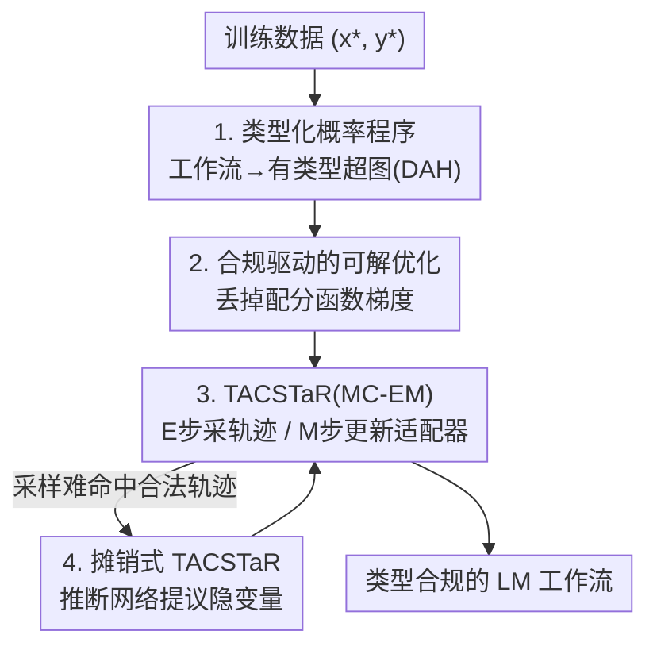

# Type-Compliant Adaptation Cascades: Adapting Programmatic LM Workflows to Data

**会议**: ICLR 2026  
**OpenReview**: [https://openreview.net/forum?id=aJmXct3igl](https://openreview.net/forum?id=aJmXct3igl)  
**领域**: Agent / LLM 工作流  
**关键词**: 类型化概率程序, LM 工作流适配, PEFT, MC-EM, 非归一化似然

## 一句话总结
本文把由多个 LLM 调用 + 确定性逻辑串成的工作流，整体重铸成一个"有类型的非归一化概率程序"，用轻量 PEFT 适配器作为可学习参数、配上一套丢掉配分函数梯度也证明无偏的 TACSTaR（MC-EM）训练算法，使整条管线能端到端梯度训练，在 FinQA、MGSM-SymPy 等结构化推理任务上大幅超过 DSPy 这类离散提示优化基线。

## 研究背景与动机
**领域现状**：把 LLM 串成多步工作流 / agentic 系统（DSPy、LangChain、ReAct 这类）已经是构建复杂推理系统的主流做法——靠链式调用模型再插入确定性逻辑，搭出能多步推理、能跟外部交互的管线。

**现有痛点**：但适配这些系统的主流范式是"在管线里优化离散的提示词"，这条路出了名的脆弱：优化退化成一个困难的离散搜索问题，要靠各种启发式，既贵又难规模化；更要命的是它几乎无法强制保证结构化任务所需的"格式/类型合规"——你想让中间步骤输出一个合法的 SymPy 表达式或 JSON，提示优化只能"祈祷"模型照做。

**核心矛盾**：根子在于把工作流当成"参数固定、只能调输入(提示)的黑箱系统"。这样一来，唯一的优化旋钮是提示文本（离散、不可微），而真正决定每一步行为的模型权重却被冻住、碰不到；同时整条管线缺乏对"中间产物必须是某个类型的合法对象"这件事的形式化约束。

**本文目标**：(1) 让整条工作流可以端到端、基于梯度地训练，而不是退化成离散提示搜索；(2) 把"类型合规"作为一等公民写进框架，让结构化任务能真正强制约束中间/最终产物的格式。

**切入角度**：作者提出一个视角转换——不要去优化喂给固定系统的提示，而是优化"程序参数本身"。把整条工作流看成一个带隐变量的参数化概率程序，每一步都是一个由 PEFT 适配器支撑的概率变换，再给每个变量套上"类型"作为硬支撑约束。这样适配就从临时的离散搜索，变成了干净的、以数据似然最大化为目标的梯度优化。

**核心 idea**：把"有类型的 LM 工作流"形式化为一个非归一化概率程序（用类型契约限制每个变换的支撑集），并证明"直接优化非归一化似然、忽略配分函数梯度"所带来的偏差，会随着模型学会类型合规而消失——于是得到一个既可解又有理论保证的训练范式 TAC。

## 方法详解

### 整体框架
TAC（Type-Compliant Adaptation Cascade）做的事情可以一句话概括：把"输入问题 → 一连串带类型的中间产物 → 最终答案"这条工作流，画成一张**有向无环超图（DAH）**，图里的节点是"带类型的数据容器"，边是"变换"——变换要么是可学习的 LM 适配器（PEFT/LoRA），要么是固定的确定性函数（如一段 Python）。然后把整张图当成一个对所有节点取值的**非归一化联合分布**，用 TACSTaR 算法做 MC-EM 训练。

以论文的跑例（图 1b）为例：英文数学题 `Q_en`（输入节点）→ LM 适配器生成逐步推理 `R` → 另一个适配器把推理转成形式化算术表达式 `E` → 确定性的 SymPy 求值函数算出答案 `A`（输出节点）。其中 `R`、`E` 这些中间节点在标注数据里是看不到的（隐变量），这正是训练的难点所在。

整条管线的转动分四步：先把工作流建成带类型约束的概率程序（设计 1）；为了让这种非归一化模型能训练，确定一个"丢掉配分函数梯度"的可解优化目标并给出理论保证（设计 2）；用 TACSTaR 的 E/M 交替来真正优化它——E 步采样合法的完整执行轨迹、M 步更新适配器（设计 3）；当朴素采样难以命中合法轨迹时，再用摊销式推断网络提议更好的隐变量（设计 4）。

### 关键设计

**1. 把整条工作流建模成"有类型的非归一化概率程序"**

针对"工作流被当成参数固定黑箱、且无法强制结构合规"这个痛点，TAC 把工作流形式化成有向无环超图 $C=(Z,E)$。节点 $z_m$ 是带类型 $\tau\in\mathcal{T}$ 的数据容器，存的是该类型对象的字符串表示；超边 $e_k$ 把一组源节点映到一组目标节点，分两种：**LM 适配器边**是 PEFT 微调过的随机变换，**确定性算法边**是固定函数。关键在于"类型"被实现成硬支撑约束：LM 适配器定义的不是普通分布，而是 $\tilde p(y\mid x;\theta)=p_{\text{LM}}(y\mid x;\theta)\,\mathbb{I}(z_t\in \text{valid}(\tau_o))$——只有当输出字符串是 $\tau_o$ 类型的合法对象时才有概率质量，否则被指示函数清零。正因为模型可能把概率分给非法字符串，总质量会小于 1，整个分布是**非归一化**的。字符串与类型对象之间靠 `parse`（把字符串验证/转成类型对象，失败则报 error）和 `canon`（把对象转成唯一的规范化字符串，且满足 `parse(canon(o),τ)=o` 的可逆性）两个操作桥接，作者用 Langfun/Pydantic/PyGlove 实现，支持基本类型、复合类型（Python 类）乃至递归类型。于是整张图既能当"程序"前向执行（按拓扑序跑），又能当"分布"看：完整执行轨迹的得分是各超边条件对数概率之和，$\log\tilde p_\theta(Z^*)=\sum_k \log\tilde p_\theta(\{z_t^*\}_{t\in T_k}\mid\{z_s^*\}_{s\in S_k};e_k)$。这套建模的好处是：可学习参数变成了轻量 PEFT 模块，整条带隐变量的工作流可以端到端训，而不再是逐段定义、参数冻死的命令式系统。

**2. 合规驱动的可解优化：直接丢掉配分函数梯度也无偏**

非归一化模型做正经的极大似然，M 步要算配分函数 $Z_\theta=\sum_{Z'}\tilde p_\theta(Z')$ 的梯度，而 $\nabla_\theta\log Z_\theta$ 通常难解、昂贵、方差大。本文的做法很大胆：干脆不算它，直接优化非归一化对数似然 $L'(\theta)=\log\tilde p_\theta(Z^*)$。表面看这会引入偏差，但作者把它改写成 $L'(\theta)=L(\theta)+\log Z_\theta$，于是优化 $L'$ 等价于**同时**最大化归一化似然 $L(\theta)$ 和模型的类型合规度——因为当参数良定（well-specified）时 $\log Z_\theta$ 在 $0$ 处取最大（即所有质量都落在合法输出上、$Z_\theta\to1$）。这一改写把"省掉难算的项"翻译成了"额外鼓励模型守规矩"，方向是对的。理论上：定理 1 说在良定假设下，最大化非归一化似然的解就等于真正的归一化 MLE 解 $\theta^*$；定理 2 进一步给出偏差上界——在 $\|\nabla_\theta p_{\text{LM}}\|$ 一致有界（界为 $G$）时，$\nabla_\theta\log Z_\theta\le 2G(1-Z_\theta)$。也就是说**偏差被类型违规程度 $(1-Z_\theta)$ 卡住**：模型越合规，偏差越小，趋于 0 时优化就收敛到真 MLE。而实验证实训练会很快把 $Z_\theta$ 推向 1，所以这个偏差在训练后可忽略——这正是整套方法"可解又可靠"的理论支点。

**3. TACSTaR：把 STaR 推广到类型化工作流的 MC-EM 训练**

由于 TAC 的中间节点通常是隐变量，作者用 Monte Carlo EM 来训练，并把 Self-Taught Reasoner（STaR）推广成 TACSTaR 算法，E/M 交替优化上面那个可解目标 $L'(\theta)$。**E 步**要采出与训练数据一致的完整合法轨迹 $Z^*$：先把 TAC 当概率程序正向执行一遍（forward），若成功就拿到完整赋值进 M 步；若失败，就走一个"合理化（rationalization）回退"——借鉴原版 STaR 在第二次尝试时条件于正确答案的做法，构造一个 fallback TAC，让输入节点同时吃进 $(x^*,y^*)$、其余结构不变，等于在问"什么样的中间步骤能从 $x^*$ 推到 $y^*$"（类似逆渲染问题），再在这张新图上前向采样出中间变量，从而引导生成与正确答案自洽的隐变量轨迹。**M 步**则用 E 步采到的样本最大化非归一化似然 $L'(\theta)$ 来更新适配器参数。一个工程上的好处是非归一化对数概率的梯度按超边线性可分解，$\nabla_\theta\log\tilde p_\theta(Z^*)=\sum_k\nabla_\theta\log\tilde p_\theta(\cdot;e_k)$，天然是"尴尬并行"的，M 步能轻松分布到多卡。和原版 STaR 比，TACSTaR 多了类型结构，实验上也确实赢过无类型 STaR。

**4. 摊销式 TACSTaR：用推断网络替代固定的回退启发式**

朴素 TACSTaR 在 E 步靠一个固定的 fallback 启发式来补隐变量，遇到复杂任务时这种固定提议可能效率低、难命中合法轨迹。摊销式 TACSTaR 把这个启发式参数化：训一个推断网络 TAC $C'$，它的节点类型与 $C$ 对应，但输入节点 $z'_1$ 的类型表示输入-输出对 $(x^*,y^*)$，且 $C$ 里每条适配器边都有一个额外条件于 $z'_1$ 的对应边 $e'_k$。$C'$ 与 $C$ 交替训练，目标是让 $C'$ 的非归一化分布 $\tilde q_\phi$ 逼近 $C$ 在给定 $(x^*,y^*)$ 下对中间节点的真实后验 $p_\theta(z_m\mid z_1,z_2)$。具体用自归一化多重重要性采样近似后验得到 $\hat p$，再优化 $\phi$ 去最小化 $\mathrm{KL}[\hat p\,\|\,q_\phi]$。这相当于把"该怎么猜中间步骤"也学出来，给出任务自适应的更优提议分布，从而让训练更稳、更高效——这也体现了概率框架"训练与推断解耦"的好处：可以事后条件于额外观测来改进 E 步。

### 损失函数 / 训练策略
训练目标是可解的非归一化对数似然 $L'(\theta)=\log\tilde p_\theta(Z^*)$（等价于联合最大化归一化似然 + 类型合规质量 $\log Z_\theta$），用 TACSTaR 的 MC-EM 交替优化。适配器取**秩-1 LoRA**，加在注意力权重上，每个适配器参数量极小（gemma-1.1-7b-it 约 57 万、gemma-2-27b-it 约 141 万、Qwen3-8B 约 96 万），LoRA 按 zero-init 初始化。`parse`/`canon` 由 Langfun 实现（提示 LLM 生成 Python 类与对象再解析）。

## 实验关键数据

### 主实验
在 MGSM、MGSM-SymPy、FinQA、MuSR 等推理重任务上，对比 DSPy（用 MIPROv2 / BootstrapFewShot 做提示优化，且用 XGrammar 做模式约束解码）这一强基线，跨 Gemma 7B / Gemma 2 27B / Qwen 3 8B 三个模型族。TAC 在每个设置都稳定且显著领先，差距在"模型越小 / 任务越结构化"时尤其大。

| 任务 | 模型 | DSPy | TAC | 提升 |
|------|------|------|-----|------|
| FinQA | Qwen3-8B | 12.0% | 24.7% | +12.7 |
| FinQA | gemma-2-27b-it | 12.7% | 34.0% | +21.3 |
| FinQA | gemma-1.1-7b-it | 0.7% | 9.7% | +9.0 |
| MGSM-SymPy | gemma-2-27b-it | 57.1% | 75.9% | +18.8 |
| MGSM | gemma-1.1-7b-it | 1.6% | 27.3% | +25.7 |
| MuSR | gemma-1.1-7b-it | 36.5% | 62.6% | +26.1 |

在 MGSM 上还对比了无类型 STaR：gemma-1.1-7b-it 上 STaR 仅 10.5%，远低于 TAC 的 27.3%；gemma-2-27b-it 上 STaR 76.9% 也低于 TAC 82.2%，说明"类型化结构"本身带来增益。作者另指出 DSPy 即便用到约 9× 于 TAC 的推理 token 也会饱和（§O）。

### 消融 / 分析实验

| 配置 | 任务 | 标准 TACSTaR | 摊销式 TACSTaR | 说明 |
|------|------|--------------|----------------|------|
| 摊销推断 | MGSM | 82.2 | 82.4 | 几乎持平 |
| 摊销推断 | FinQA | 36.0 | 41.7 | +5.7，复杂任务收益最大 |
| 摊销推断 | HotPotQA | 32.0 | 34.0 | +2.0 |

| 推断方式（MuSR 分类） | 重归一化分类 (Cla.) | 无约束生成 (Gen.) |
|------|------|------|
| gemma-1.1-7b-it | 62.6 | 62.1 |
| gemma-2-27b-it | 65.0 | 51.6 |

类型合规速度（cot-cascade-structure / gemma-1.1-7b-it，MGSM）：训练数据解析失败率第 1 个 epoch 末 83.0% → 第 2 个 epoch 末骤降到 1.0% → 第 4 个 epoch 末 0.4%。

### 关键发现
- **结构越硬、模型越小，TAC 越占优**：FinQA（结构化输入）和 MGSM-SymPy（结构化代码式输出）上提升最猛，gemma-1.1-7b-it 的 MGSM 从 1.6% 干到 27.3%。
- **摊销式推断对难任务最值**：FinQA +5.7、HotPotQA +2.0，而本就好采样的 MGSM 几乎无差——说明它的价值在于"帮模型在难以命中合法隐变量轨迹时学到更好的提议分布"。
- **类型合规确实快速达成**：解析失败率两个 epoch 内从 83% 跌到 1%，估计的合规概率质量 $Z_\theta$ 迅速逼近 1，直接支撑了定理 2"偏差随合规而消失"的论断。
- **无标签泄漏**：Langfun 的数据校验只对照类型定义检查生成数据，不接触真值 $y^*$ 或输入 $x$，结构约束只管格式；未适配模型与适配模型之间的巨大差距证明模型仍需真正学会推理。

## 亮点与洞察
- **"省掉难算的项"被翻译成"鼓励守规矩"**：把 $L'(\theta)=L(\theta)+\log Z_\theta$ 这一步改写是全文最漂亮的地方——本来是为了避开难解的配分函数梯度做的"近似妥协"，却被论证成"额外优化类型合规"，并且偏差被 $(1-Z_\theta)$ 卡死、随训练消失。理论与工程动机在这里完美对齐。
- **类型 = 硬支撑约束**：用 `valid(τ)` 的指示函数把"合法对象"写进概率密度，使得"结构合规"不再靠提示祈祷，而是模型分布层面的硬约束，这个建模视角可迁移到任何需要强格式保证的生成任务。
- **训练/推断解耦带来的灵活性**：因为是概率模型，可以事后条件于答案做合理化回退（E 步）、可以训摊销推断网络、还能在分类任务上用重归一化后验直接挑概率最高的标签——一套框架长出多种推断手段。

## 局限与展望
- **良定假设较强**：定理 1/2 都建立在"模型族能完美建模类型合法输出"（well-specified）的假设上；真实小模型未必满足，偏差消失只是渐近性质。
- **依赖类型/校验基础设施**：`parse`/`canon` 的表达力决定了整个类型系统，强依赖 Langfun/Pydantic/PyGlove 这类库，自定义复杂类型（如"由外部 LLM 判定连贯的对话"）的实现成本与可靠性值得关注。
- **实验局限**：都在数据集子集上做、适配器仅用秩-1 LoRA、任务集中在推理 QA / 代码式结构化，对更长更开放的 agentic 工作流（多轮工具调用、长程交互）的可扩展性尚未验证。
- **可改进处**：E 步合法轨迹的采样在更深的超图上可能更难命中，摊销推断网络本身的训练开销与稳定性、以及与 RL（作者在 §A 提到 TACSTaR 与 RL 的联系）的结合都值得进一步挖。

## 相关工作与启发
- **vs DSPy（提示优化）**：DSPy 优化的是固定系统的离散提示（靠 MIPROv2/Bootstrap 搜索），TAC 直接优化程序参数（PEFT 适配器）做梯度学习；区别在于一个调输入、一个调权重，TAC 在结构化任务上大幅领先且 token 效率更高。
- **vs 原版 STaR**：STaR 是单步、无类型的自举推理；TACSTaR 把它推广到带类型约束的多步工作流（MC-EM 形式化），并用合理化回退处理隐变量，实验上稳定超过无类型 STaR。
- **vs LM cascades（Dohan et al. 2022）**：同属把语言模型串成级联的非归一化分布视角，但 TAC 的关键区别是"为端到端适配而设计"——级联不只是用来推理，更是可训练的对象。

## 评分
- 新颖性: ⭐⭐⭐⭐⭐ 把 LM 工作流重铸成有类型非归一化概率程序、并证明丢配分函数梯度的偏差随合规消失，视角与理论都新。
- 实验充分度: ⭐⭐⭐⭐ 覆盖多任务多模型族、含摊销/分类/合规速度等分析，但均为数据集子集、适配器仅秩-1 LoRA。
- 写作质量: ⭐⭐⭐⭐ 形式化清晰、跑例贯穿全文，理论部分对非专业读者门槛偏高。
- 价值: ⭐⭐⭐⭐⭐ 给"可靠、任务合规的 LLM 系统"提供了一个有理论保证的训练范式，对结构化 agentic 工作流很有指导意义。

<!-- RELATED:START -->

## 相关论文

- [\[ICLR 2026\] Test-Time Adaptation for LLM Agents via Environment Interaction](test-time_adaptation_for_llm_agents_via_environment_interaction.md)
- [\[ICLR 2026\] Mix-ECom: Towards Mixed-Type E-Commerce Dialogues with Complex Domain Rules](mix-ecom_towards_mixed-type_e-commerce_dialogues_with_complex_domain_rules.md)
- [\[ICLR 2026\] FlowSearcher: Synthesizing Memory-Guided Agentic Workflows for Web Information Seeking](flowsearcher_synthesizing_memory-guided_agentic_workflows_for_web_information_se.md)
- [\[ACL 2026\] SynthAgent: Adapting Web Agents with Synthetic Supervision](../../ACL2026/llm_agent/synthagent_adapting_web_agents_with_synthetic_supervision.md)
- [\[ICLR 2026\] Open Data Synthesis for Deep Research](open_data_synthesis_for_deep_research.md)

<!-- RELATED:END -->
