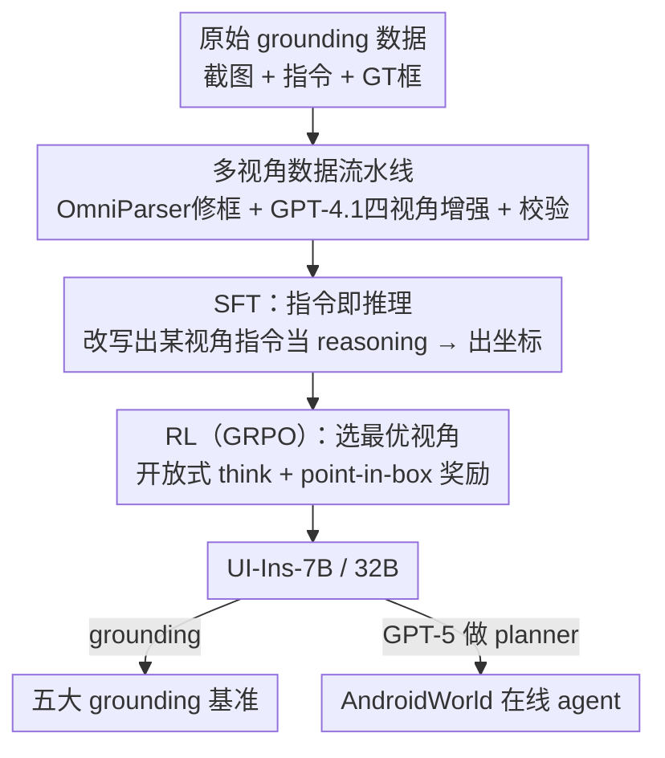

# UI-Ins: Enhancing GUI Grounding with Multi-Perspective Instruction-as-Reasoning

**会议**: ICLR 2026  
**OpenReview**: [https://openreview.net/forum?id=dsQHm7YX9c](https://openreview.net/forum?id=dsQHm7YX9c)  
**代码**: 有（论文称 All code and models are released）  
**领域**: Agent / 多模态VLM  
**关键词**: GUI grounding, 指令多视角, 指令即推理, SFT+GRPO, 数据清洗

## 一句话总结
这篇论文把"自然语言指令"从被动输入升级为主动的推理路径（Instruction-as-Reasoning）：先用数据流水线清洗噪声标注并把每条指令扩成外观/功能/位置/意图四种视角，再用 SFT 教模型把"改写出某一视角的指令"当作显式推理、最后用 GRPO 让模型自己挑选/组合最有效的视角，得到的 UI-Ins-7B/32B 在 5 个 GUI grounding 基准上刷到 SOTA（UI-I2E-Bench 87.3%、ScreenSpot-Pro 57.0%），并在 AndroidWorld 在线 agent 上取得 74.1% 成功率。

## 研究背景与动机
**领域现状**：GUI grounding 是 GUI agent 的核心能力——给定一张界面截图 $S$ 和一条自然语言指令 $I$，模型 $f$ 要输出目标可操作元素的坐标点 $p=(x_p,y_p)$。主流做法把指令当作一个静态的输入字符串，专注于改进视觉编码、坐标回归或奖励设计，几乎没人把"指令本身"当成可优化的变量。

**现有痛点**：作者指出两个被长期忽视的问题。其一是**指令质量**：人工抽查 OS-Atlas、AMEX、Widget Captioning 三个主流数据集的 1909 条样本，发现高达 23.3% 的指令存在实质缺陷——要么"歧义"（一条指令能对上多个 UI 元素），要么"错配"（界面里根本没有对应元素）。用这种脏数据训练会持续拖累下游精度。其二是**指令多样性**：现有模型几乎都是被训练成"单一固定风格指令 → 动作"的映射，缺乏跨视角推理的能力。

**核心矛盾**：人类描述同一个目标会灵活切换视角——关同一个窗口，可以说"点红色的 X"（外观）、"关闭文件管理器"（功能）、"右上角那个按钮"（位置）、"把这个界面弄走"（意图），并**策略性地挑选当前最有效的那一种**；而模型被锁死在一种风格里，丧失了这种灵活适配能力。作者在 ScreenSpot-Pro 上做受控实验：把原指令分别改写成四种视角，零样本测 Qwen2.5-VL-7B，发现外观/功能/意图视角都显著优于原指令；而"每条样本都选最优视角"的理想上界（Combined）相对原指令带来 **76% 的相对提升**——说明模型里藏着大量未被释放的潜力。

**本文目标**：① 把指令数据清干净，建立可靠训练基础；② 让模型学会用多种指令视角作为推理路径，并能在推理时动态挑选最优视角。

**切入角度与核心 idea**：不同指令类型不是"同义改写"，而是识别同一 UI 元素的不同分析角度。于是把指令从"静态输入"重定义为"动态推理路径"——这就是 **Instruction-as-Reasoning** 范式：模型不仅要看懂命令，还要主动选出最有效的推理过程来推断用户意图。落地为一套 SFT+GRPO 两阶段训练：SFT 先教会"用多视角指令做显式推理"，RL 再激励"为每个场景选/合成最优视角"。

## 方法详解

### 整体框架
方法分两条主线：先是一条**数据流水线**把现有 grounding 数据洗净并扩成多视角语料；再是**Instruction-as-Reasoning 两阶段训练**把这份语料喂给模型。数据流水线对每个样本先用 OmniParser V2 检测界面元素、用 IoU 修正/过滤原始 GT 框（顺手滤掉错配的脏指令），再用 GPT-4.1 围绕高亮的目标元素生成外观、功能、位置、意图四种视角的指令，并逐条做一致性校验确保"指令 ↔ 目标框"严格一对一。训练阶段，SFT 让模型先吐出一段"某一视角的改写指令"当作显式 reasoning、再输出坐标；RL 用 GRPO 把推理改成开放式"先 think 再答"、用 point-in-box 奖励激励模型自己选/组合最优视角。最终产出 UI-Ins-7B / UI-Ins-32B，可直接做 grounding，也能当 GPT-5 planner 下的执行器跑在线 agent。

### 关键设计

**1. 多视角数据流水线：先洗净再按四视角扩增**

针对 23.3% 的脏指令和单一视角的训练数据这两个痛点，流水线分两步。预处理阶段用 OmniParser V2 检测截图上所有 UI 元素，再用一个简单的 IoU 方法对照原始 GT 框做修正或过滤——既给每条指令绑定一个可靠的空间锚点，又顺手把无法对齐的错配/歧义指令滤除，把质量缺陷率从 23.3% 压到 8% 以下（流水线产物抽查 1542 条，精确匹配占 93.5%）。增强阶段以高亮目标元素的截图为输入，让 GPT-4.1 围绕外观、功能、位置、意图四个分析视角生成多条高质量改写；为抑制 LLM 幻觉、保证"指令 ↔ 目标"严格一对一，每条生成指令还要再过一遍 GPT-4.1 校验，确认它无歧义地只指向目标元素。这一步把"指令是固定输入"变成"指令是一组可选分析角度"的语料，是后面两阶段训练能成立的前提。

**2. SFT 阶段：把"某视角的改写指令"当作显式推理链**

SFT 的目标是把多视角推理能力"灌"进模型。具体做法是让模型先生成一段中间 reasoning 文本——其实就是从某一视角改写出来的指令（如"我从外观视角分析……我会点那个像图片的图标"），再输出最终坐标点。训练目标是在整个数据集上最大化目标序列的对数似然：

$$\max_{\theta}\sum_{(S,I,Y_{gt})\in D}\log P(Y_{gt}\mid S,I;\theta),\quad Y_{gt}=R_{gt}\oplus p_{gt}$$

其中 $\oplus$ 表示序列拼接，$R_{gt}$ 是从该样本若干个合法视角中**随机采样**出来的一条改写指令，$p_{gt}$ 是 GT 坐标。这个统一目标同时优化两件事：学会产出一条"某视角的推理"（Reasoning Generation），以及学会在自生成推理的条件下预测正确坐标（Grounded Prediction）。和直接回归坐标的旧做法相比，它显式地把"换视角思考"写进了输出格式，为 RL 阶段打下能探索多样推理的底子。

**3. RL 阶段：用 GRPO 让模型自己选/合成最优视角**

SFT 只教会了"能从多视角推理"，但没教"哪条路径更好"。RL 阶段用 Group Relative Policy Optimization（GRPO）来补这一课：关键改动是把 prompt 从"列出四个预定义视角"换成开放式的"先 think 再答"，**不再喂死预设视角**，鼓励模型去探索更大的推理空间——包括把多个视角揉成一条、甚至自创全新视角。奖励用一个 point-in-box 函数：预测点落在 GT 框内得 1、否则得 0；一组 $G$ 个 rollout 的奖励按组内均值方差归一化成优势

$$\hat{A}_{i,t}=\frac{r_i-\frac{1}{G}\sum_{i=1}^{G}r_i}{\sqrt{\frac{1}{G}\sum_{i=1}^{G}\left(r_i-\frac{1}{G}\sum_{i=1}^{G}r_i\right)^2}}$$

再用 $\mathcal{L}=-\frac{1}{G}\sum_{i=1}^{G}\frac{\pi(o_i\mid I,S)}{\pi_{old}(o_i\mid I,S)}\hat{A}_{i,t}$ 做优化。反复迭代后模型学会偏好那些稳定导向正确坐标的推理路径，形成一套"看场景选视角"的上下文相关策略。一个被作者反复强调的隐藏收益是：SFT 阶段灌进去的多样推理能力让 RL 阶段能产出多样的 rollout，从而**避免只用坐标做 GT 的 SFT 常见的 policy collapse**（响应高度同质、探索失效）。

### 一个完整示例
以"关闭文件管理器窗口"为例走一遍：数据流水线先用 OmniParser 把界面里的红色 X、菜单等元素框出来、用 IoU 把 GT 框对齐到那个 X 上，再让 GPT-4.1 生成四条视角指令——外观"点那个像图片/红色 X 的图标"、功能"关闭文件管理器"、位置"右上角的按钮"、意图"把这个界面弄走"，每条都过校验确认只指向那个 X。SFT 时模型看到"Click the close"，被训练成先吐 `<think>我从外观视角分析……点那个像图片的图标</think>` 再给坐标。到 RL 阶段 prompt 变成只让它"think"，模型在多次 rollout 里尝试不同视角，point-in-box 奖励告诉它哪条命中——最终它学会在这个场景优先用外观视角，甚至把"右上角的红 X"（位置+外观）组合起来推理。

## 实验关键数据

### 主实验
数据来自 OS-Atlas、Omniact、Android Control、AMEX、AgentNet 等公开数据集（覆盖 Windows/MacOS/Linux/Android），全部过流水线清洗；backbone 为 Qwen2.5-VL-7B / 32B。

| 基准 | 指标 | UI-Ins-32B | 之前最强对手 | 说明 |
|------|------|-----------|------------|------|
| UI-I2E-Bench | Avg. | **87.3** | GTA1-32B 83.5 | implicit 子集提升更大（+6.6%） |
| MMBench-GUI L2 | Avg. | **84.9** | GTA1-32B 83.4 | Advanced 子集相对 Qwen2.5-VL-32B +24.5% |
| ScreenSpot-Pro | Avg. | **57.0** | GTA1/UI-Tars-32B 53.6 | Icon 子集 30.0 |
| ScreenSpot-V2 | Avg. | **94.9** | 93.2 | 接近饱和仍领先 |
| ShowDown | Avg. | **73.8** | 71.1 | — |

7B 版同样在同规模里全面领先：UI-I2E 81.1 / MMBench-GUI L2 83.1 / ScreenSpot-Pro 52.2 / V2 94.0 / ShowDown 73.1。一个一致规律是**任务越难、提升越大**：MMBench-GUI L2 上 UI-Ins-7B 相对 Qwen2.5-VL-7B 的优势从 Basic 的 134.2% 扩到 Advanced 的 159.4%。

在线 agent：用 UI-Ins-7B 当执行器、GPT-5 当 planner，在 AndroidWorld 拿到 **74.1%** 成功率，超过 Gemini 2.5 Computer Use（69.7）、UI-TARS-2（73.3）等强基线，比同配置下的 Qwen2.5-VL-7B 基座绝对高出 24.1 个点，说明 grounding 能力的提升能直接转化为在线 agent 表现。

### 消融实验

| 配置 | MMBench-GUI L2 | UI-I2E | ScreenSpot-Pro | 说明 |
|------|----------------|--------|----------------|------|
| 无 SFT 无 RL | 63.4 | 56.0 | 24.4 | 基座 |
| 仅 RL | 72.4 | 69.2 | 37.0 | 缺先验探索 |
| 仅 SFT | 76.3 | 70.1 | 37.1 | 不会选最优视角 |
| SFT + RL（完整） | **83.1** | **81.1** | **52.2** | 两阶段缺一不可 |

| 分析点 | 关键对比 | 结论 |
|--------|---------|------|
| 中间推理是否必要 | 去掉 reasoning 直接回归坐标，全基准大幅掉点 | 显式推理是成功关键 |
| IR vs 自由形式推理(FFR) | RL 加 FFR：UI-Tars-1.5-7B 在 SS.Pro 相对 -6.4%；加 IR：+5.1%（Qwen 上 +9.9%） | 无结构 FFR 反而拖累，结构化的 IR 才有效 |
| 缓解 policy collapse | 普通 SFT+RL：Qwen2.5-VL-7B 在 SS.Pro -5.7%、JEDI-7B -12.7%；IR 版 SFT+RL：+24.0% | IR 式 SFT 当探索性热身，避免 RL 崩塌 |
| 数据流水线 | 缺陷率 23.3% → <8%；清洗数据训练在多基准一致涨点 | 清洗是有效训练的前提 |

### 关键发现
- **两阶段缺一不可且互补**：SFT 负责"会多视角推理"、RL 负责"选最优视角"，单独任一阶段都明显掉点，完整版在 ScreenSpot-Pro 上比单 SFT/单 RL 高约 15 个点。
- **推理的"形式"比"有没有"更关键**：同样是加中间推理，自由形式推理（FFR）在 RL 里难优化甚至掉点，而把推理约束成"某视角的改写指令"（IR）才稳定涨点——这是本文最反直觉的洞察。
- **意外的稳定器**：IR 式 SFT 让模型 RL 时能产出多样 rollout，直接化解了"只用坐标做 GT 的 SFT → 响应同质 → policy collapse"这一 SFT+RL 顽疾。
- **涌现能力**：训练后模型不仅会在四个预设视角间策略性选择，还会把多个视角组合成一条连贯推理（UI-I2E 的 1477 条样本里出现 5245 种推理方式），甚至自创"按分组归属""按 UI 元素状态"等训练中没见过的全新视角。

## 亮点与洞察
- **把"指令"重新问题化**：以往 grounding 工作都在卷视觉和奖励，本文反其道把镜头对准被当成废话的输入指令，先用 76% 相对提升上界证明"多视角"是块没被挖的金矿，再用 23.3% 缺陷率证明"数据脏"在拖后腿——动机扎实，是典型"重新定义问题比堆模型更值钱"的范例。
- **"指令即推理"是个可迁移的范式**：把 reasoning 约束成"换个视角重述任务"，而非放任自由发挥，恰好解决了 GRPO 在 grounding 上 FFR 难优化的痛点。这个思路可迁移到其他"输入即可多视角解读"的任务（如检索 query 改写、工具调用参数选择）。
- **SFT 当 RL 的探索热身**：用 SFT 注入多样性来防 RL 崩塌，给"SFT+RL 怎么配合"提供了一个具体可操作的解法，而不是泛泛地调 KL 系数。

## 局限与展望
- 数据流水线重度依赖外部强模型：用 OmniParser V2 检框、GPT-4.1 生成+校验四视角指令，质量和成本都受这两个外部组件牵制；GPT-4.1 的视角生成是否会引入系统性偏置（如偏爱某类描述）未充分讨论。
- 视角空间被先验框定为外观/功能/位置/意图四类，虽观察到涌现出新视角，但四视角划分本身的合理性、是否对所有 GUI 域都适用缺乏理论论证。
- 奖励仅用 point-in-box 0/1 信号，对"框很大时点哪都算对"这类粗粒度监督不敏感，可能高估精确度；在线 agent 实验依赖 GPT-5 当 planner，UI-Ins 自身的端到端规划能力未单独评估。
- 缺陷率/精确匹配等关键统计来自人工抽查（1909、1542 条），样本规模和标注者一致性细节有限，⚠️ 具体口径以原文为准。

## 相关工作与启发
- **vs GTA1 / InfiGUI-G1（强 grounding 基线）**: 它们主要在视觉特征、奖励或解码上发力、把指令当固定输入；本文把指令升级为可选推理视角并用 SFT+RL 学会挑选，在 implicit/Advanced 等难子集上拉开更大差距。
- **vs UI-TARS / UGround（grounding agent 模型）**: 同样追求强 grounding，但本文用更小的 7B 配 GPT-5 planner 就在 AndroidWorld 超过 UI-TARS-2，说明"指令多视角推理"带来的精度增益能高效转化为在线 agent 收益。
- **vs Phi-Ground 等 SFT+RL grounding 工作**: 二者都观察到只用坐标 SFT 会导致 RL policy collapse，本文给出的解法是用 IR 式 SFT 注入探索多样性，而非改动 RL 目标本身，思路更轻量。

## 评分
- 新颖性: ⭐⭐⭐⭐⭐ 把"指令"从静态输入重定义为动态推理路径，是 grounding 领域少见的换视角创新。
- 实验充分度: ⭐⭐⭐⭐⭐ 五大 grounding 基准 + 在线 agent + 四组消融/分析，覆盖全面且揭示 FFR vs IR、policy collapse 等深层洞察。
- 写作质量: ⭐⭐⭐⭐ 动机—分析—方法—验证逻辑闭环清晰；个别公式/图注排版有 OCR 噪声但不影响理解。
- 价值: ⭐⭐⭐⭐⭐ SOTA 模型已开源，且"指令即推理"范式与"SFT 防 RL 崩塌"经验有较强可迁移性。

<!-- RELATED:START -->

## 相关论文

- [\[CVPR 2026\] Towards GUI Agents: Vision-Language Diffusion Models for GUI Grounding](../../CVPR2026/llm_agent/towards_gui_agents_vision-language_diffusion_models_for_gui_grounding.md)
- [\[ICLR 2026\] An Information Theoretic Perspective on Agentic System Design](an_information_theoretic_perspective_on_agentic_system_design.md)
- [\[CVPR 2026\] BAMI: Training-Free Bias Mitigation in GUI Grounding](../../CVPR2026/llm_agent/bami_training-free_bias_mitigation_in_gui_grounding.md)
- [\[ICLR 2026\] MC-Search: Evaluating and Enhancing Multimodal Agentic Search with Structured Long Reasoning Chains](mc-search_evaluating_and_enhancing_multimodal_agentic_search_with_structured_lon.md)
- [\[NeurIPS 2025\] BTL-UI: Blink-Think-Link Reasoning Model for GUI Agent](../../NeurIPS2025/llm_agent/btlui_blinkthinklink_reasoning_model_for_gui_agent.md)

<!-- RELATED:END -->
