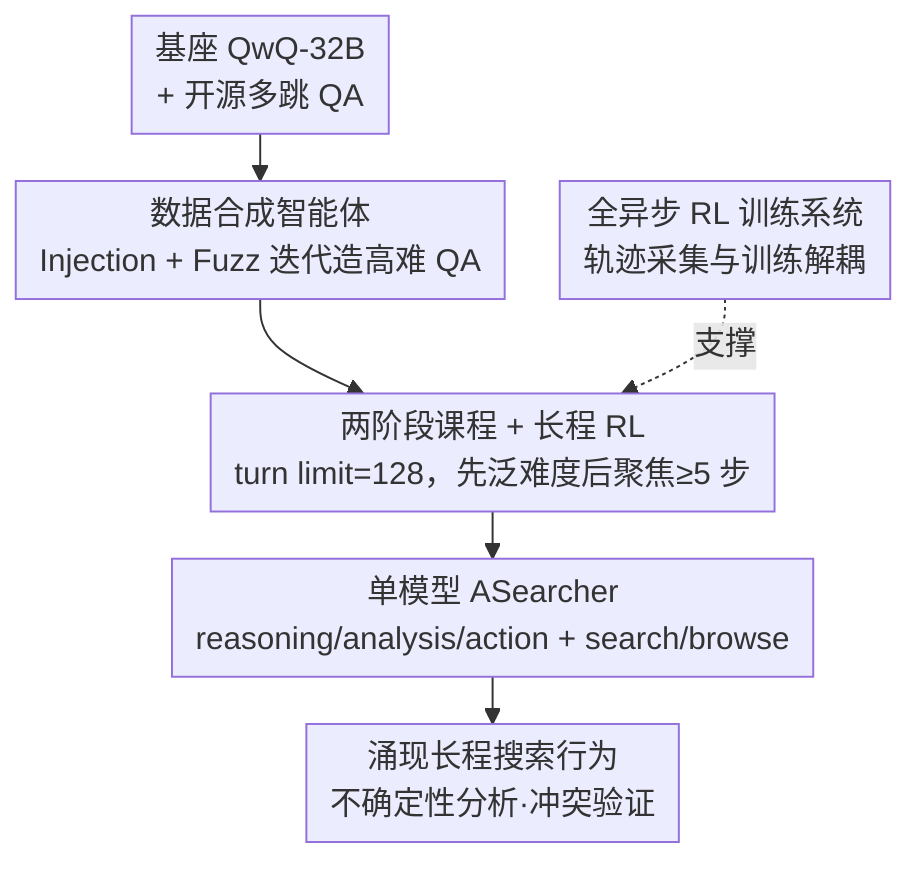

# Unlocking Long-Horizon Agentic Search with Large-Scale End-to-End RL

**会议**: ICLR 2026  
**OpenReview**: [https://openreview.net/forum?id=MfPDdPUGKi](https://openreview.net/forum?id=MfPDdPUGKi)  
**代码**: 匿名链接（模型评审后释放）  
**领域**: Agent / 强化学习 / 搜索智能体  
**关键词**: 搜索智能体, 端到端 RL, 长程探索, 数据合成, 异步训练

## 一句话总结
不靠任何商用大模型蒸馏数据、不当外挂工具，仅用纯端到端 RL 在单个 QwQ-32B 上训练出搜索智能体 ASearcher：靠"自动合成高难 QA 数据 + 把每条轨迹的工具调用上限放到 128 步做长程探索"，让模型自发涌现出不确定性分析、冲突核查等专家级搜索行为，仅用基础搜索工具就在 GAIA/xBench/Frames 上逼平商用 Deep Research 系统。

## 研究背景与动机

**领域现状**：搜索智能体（search agent）是 LLM agent 里最具代表性的一类——给模型接上搜索引擎和浏览器，让它通过多轮工具调用回答知识密集型问题。当前开源搜索智能体要拿到强性能，几乎都离不开商用大模型：要么从 Claude-Sonnet-4、Gemini-2.5-Pro 这种强模型上采集轨迹做 SFT 冷启动（如 AFM），要么直接把不同商用模型当作音频转写、视觉问答、复杂推理的专用子模块拼成多模型框架（如 MiroThinker）。

**现有痛点**：这种对闭源模型的依赖带来两个问题。其一是能力天花板被商用模型锁死，开源方案本质上是在"蒸馏"而非"自己学会"搜索；其二是复杂的多模型框架难以复现、难以规模化。一个根本性的问题被提出：能不能在不依赖任何商用模型的前提下，达到商用系统的性能？

**核心矛盾**：真实的搜索任务远比"查一下"复杂。比如"中国在 2012 伦敦奥运会拿了几枚金牌？"——当时记 38 枚，但十年后两起竞走兴奋剂取消资格让中国补了一枚，变成 39 枚。智能体必须在嘈杂、相互冲突的多源信息里调和历史记录、找出冲突根因，才能给出正确答案。这种深度检索能力需要长程（long-horizon）的多轮探索，而过往 RL 搜索工作大多在多跳 QA 上把训练 turn limit 设得很小（如 4 步），模型只学会短程工具使用，根本探索不到复杂策略。

**本文目标**：用纯 RL、单模型、仅基础搜索工具，激发出长程深度检索能力。这分解为两个子问题——训练数据从哪来（不能靠商用模型造），以及怎么让模型在训练中真正探索到长程策略。

**核心 idea**：作者把答案押在 DeepSeek-R1 式的"RL 自发涌现"思路上：只要给足够难的训练数据 + 足够大的探索空间（turn limit 拉到 128），纯端到端 RL 就能把单个模型从平均 1.67 次工具调用，一路逼到 20+ 次调用，并涌现出反思、外部信息引用、冲突验证等复杂搜索行为。

## 方法详解

### 整体框架

ASearcher 要解决的是"如何不靠商用模型、用纯 RL 把一个普通大模型训成长程搜索专家"。整条管线可以拆成三块：先用一个**数据合成智能体**自动造出 2.56 万条高难度 QA 作为训练燃料；再把这些数据按难度分成**两阶段课程**喂给 RL，并把每条轨迹的工具调用上限放到 128 步逼模型长程探索；而 128 步的超长轨迹会带来巨大的执行时间方差，于是用一套**全异步 RL 训练系统**把轨迹采集和权重更新彻底解耦，保证训练效率。训练完成后的产物就是 ASearcher——一个**单模型智能体**，每轮输出 reasoning/analysis/action 三段，仅调用 search 和 browse 两个基础工具，运行时不依赖任何外部模型。

### 关键设计

**1. 单模型 agent 设计：一个模型同时负责推理、规划、动作与网页摘要**

针对"开源方案靠多个商用模型拼框架"这个痛点，ASearcher 反其道而行，整个智能体就是一个模型在跑。每一轮，模型拿到用户问题和历史上下文后，连续生成三段内容：**Reasoning** 是内部推理，分析当前掌握的信息、评估解题进度、反思之前的结果、推断未解决的方面并制定后续计划；**Analysis** 是对 reasoning 的浓缩，抽取关键结论并给出下一步计划；**Action** 是最终决策，要么直接作答终止，要么发起工具调用。一个关键工程细节是：reasoning 段往往又长又噪，因此**不写入后续历史**，只有 analysis 和 action 进历史，保证上下文干净。工具只有两个——`<search>` 接搜索引擎返回相关片段和 URL，`<access>` 接浏览器返回网页内容；由于真实网页常超过 32K token，模型还会把网页按每块 10k 字符切分后自行摘要。这种"单模型全包"设计的意义在于：它证明了长程搜索能力可以内生于一个模型，而非必须外接专用子模型。

**2. 数据合成智能体：用 Injection 与 Fuzz 迭代制造高不确定性 QA**

纯 RL 最缺的是高难度训练数据，而又不能靠商用模型来造——这是本文最核心的设计。作者构建了一个由 QwQ-32B 驱动的数据合成智能体（如原文 Fig.3），从一个种子问题出发，迭代地把问题改难，过程中持续维护一份支撑事实清单以保证问题严格对齐可靠来源。每一步在两个动作里自动二选一：**Injection（注入）**先在问题里选一个实体，从维基百科等外部源取一条相关事实，再把这条事实注入问题来丰富其语境；**Fuzzing（模糊）**则刻意模糊问题里的细节来提高不确定性，比如把"Catskill Mountain Railroad"替换成"一条历史悠久的山区铁路"，逼模型去搜索还原。合成后还有一道严格的质量验证：基础质量检查（清晰度与可解性）、难度测量（让 QwQ-32B 不用工具直接作答，答不出说明够难）、答案唯一性检查（确认难度测量阶段产生的错误答案不会成为另一个合法答案）。最终把无需工具就能直接答对的问题过滤掉，得到 25.6k 条必须多轮工具调用才能解的高质量 QA。配合从 HotpotQA、2WikiMultiHopQA 经模型过滤（304k → 16k 难样本）的开源数据，构成完整训练集。

**3. 两阶段课程 + 大 turn limit 长程 RL：用渐进难度和宽探索空间逼出长程策略**

光有难数据还不够，得让模型在训练中真正走到长程。作者用 **128 的训练 turn limit**——远大于以往工作的 4~10 步——给模型一个足够宽的探索空间去发现复杂搜索策略；消融显示把 turn limit 砍到 10，GAIA 从 58.7 掉到 49.2、平均工具调用从 26.59 暴跌到 3.48，证明大 turn limit 是解锁长程能力的关键。同时配一套**两阶段课程**：第一阶段在覆盖各种难度（含只需一两次调用的简单题）的全量数据上训，让模型先掌握基本的工具调用和推理能力；第二阶段把所有少于 5 次工具调用就能解决的 QA 全部剔除，只在长程难题上继续训，专门激活稳定的长程搜索。消融里只用 Stage 1 数据继续训，工具调用只有 5.40、xBench 仅 43.0，验证了渐进课程的必要性。优化算法采用 **GRPO**：对每个问题采 $G$ 条轨迹，用组内相对奖励算优势 $\hat{A}_i$，目标为

$$J_{\text{GRPO}}(\theta) = \mathbb{E}_{x\sim D,\{\tau_i\}\sim\pi_{\theta_{old}}}\Big[\frac{1}{G}\sum_{i=1}^{G}\frac{1}{\sum_t|a_t^i|}\sum_t\sum_j \min\big(r_{t,j}\hat{A}_i,\ \text{clip}(r_{t,j},1-\epsilon,1+\epsilon)\hat{A}_i\big)\Big]$$

其中 $r_{t,j}$ 是新旧策略的 token 级概率比。奖励是稀疏的（轨迹结束时用 LLM-as-Judge 判对错），并去掉了格式奖励（QwQ-32B 本身格式就规整）；再加 **dynamic filtering** 把一组里所有轨迹奖励相同（优势为零、没有训练信号）的 query 剔除，提升训练效率。

**4. 全异步 RL 训练系统：把超长轨迹的执行方差从训练里隔离出去**

128 步的 turn limit 带来一个棘手的工程问题：少数超长轨迹会比短轨迹多出几十次工具调用，单条轨迹运行时间高度不可预测（原文 Fig.4 显示极长轨迹只占很小比例却拖慢整体）。传统的批生成 RL（如 one-step-off）即便把 rollout 和训练重叠，一个 batch 仍要等最慢的那条轨迹，导致 GPU 大量空闲。本文基于 AReaL 采用**全异步训练**，在两个层面解耦：**异步轨迹 rollout**——每条轨迹独立向工具服务器和 LLM 推理引擎发请求，互不阻塞，一条轨迹等工具响应时不耽误别的轨迹生成；**rollout 与训练解耦**——长轨迹不再阻塞生成、可跨多个权重版本存活，训练侧一旦凑够一个 batch 的轨迹就立刻启动训练步。这样 GPU 在生成阶段接近满载，整套 ASearcher 训练约耗 16k H800 GPU 小时。这个设计本身不提升模型能力，但它是"128 步长程 RL 在算力上可行"的前提。

### 损失函数 / 训练策略

整体按 MDP $(S, A, T, R)$ 建模：状态 $S$ 含历史、搜索结果与抓取的网页，动作 $A$ 是模型生成的 token（工具调用从 `<search>...</search>` 等标签里抽取），目标是最大化回报 $J(\pi)=\mathbb{E}[\sum_t R(s_t,a_t)]$。优化用上文的 GRPO + dynamic filtering，奖励为 LLM-as-Judge 的稀疏轨迹级奖励。基座 QwQ-32B，turn limit=128，batch size=64，AdamW 学习率 2e-6。

## 实验关键数据

### 主实验

评测基准：Frames（824 题，多源信息综合）、GAIA（103 题纯文本子集，多轮工具+逐步求解）、xBench-DeepSearch（100 题中文专家难题）、HLE（500 题专家级跨学科）。主指标为 LLM-as-Judge 下的 Pass@1（ASearcher 用 4 个 seed 评估）。

| 方法 | 无商用LLM | GAIA | xBench | Frames | HLE |
|------|:--:|:--:|:--:|:--:|:--:|
| OpenAI DeepResearch（商用） | - | 67.0 | - | - | 26.6 |
| Kimi-Researcher（商用） | - | - | 69.0 | 78.8 | 26.9 |
| WebSailor-32B | ✓ | 53.2 | 53.3 | 69.8 | - |
| AFM-RL-32B（多 agent） | ✗ | 55.3 | - | - | 18.0 |
| MiroThinker-32B-DPO（多工具） | ✗ | 60.9 | 56.0 | 74.8 | 20.6 |
| **ASearcher（单模型，仅搜索）** | ✓ | **58.7** | **51.1** | **74.5** | **21.5** |
| + Summary=DeepSeek-V3 | ✗ | 60.3 | 56.4 | 76.6 | 23.4 |
| + Test-time Search (K=16) | ✗ | **71.8** | **75.0** | **83.4** | **24.6** |

仅用单模型 + 基础搜索工具，ASearcher 就超过了一大批 32B 级开源智能体，GAIA/Frames 上甚至逼平用了额外多工具的 MiroThinker-32B-DPO。再叠加零样本增强——把网页摘要换成 DeepSeek-V3、并做 K=16 并行 rollout 的测试时扩展（用 DeepSeek-V3 聚合 16 次独立结论）——GAIA 71.8、xBench 75.0、Frames 83.4，与 Kimi-Researcher、OpenAI DeepResearch、o3 等商用系统同台竞技。

### 消融实验

所有消融从 Stage 1 检查点起再训 200 步，在 GAIA 和 xBench 上评估。

| 配置 | 训练时工具调用数 | GAIA | xBench |
|------|:--:|:--:|:--:|
| ASearcher（完整） | 26.59 | 58.7 | 51.1 |
| w. Turn Limit=10 | 3.48 | 49.2 | 39.3 |
| w. 仅 Stage 1 数据 | 5.40 | 51.6 | 43.0 |
| w. AFM 数据 | 4.12 | 50.9 | 39.9 |

### 关键发现
- **大 turn limit 是长程能力的命门**：把训练 turn limit 从 128 砍到 10，平均工具调用从 26.59 崩到 3.48，GAIA 掉 9.5 分——探索空间一窄，复杂搜索策略根本学不出来。
- **两阶段课程不可省**：只用 Stage 1 数据继续训，工具调用仅 5.40、xBench 仅 43.0；聚焦≥5 步难题的第二阶段是稳定长程搜索的关键。
- **数据质量碾压数据量**：用同 128 turn limit 但换成并发工作 AFM 的数据训练，工具调用只有 4.12、性能明显偏低，反衬本文合成数据的高难度与高质量。
- **能力是涌现而非教出来的**：训练过程中 "however/wait/alternatively" 等反思关键词、"doc/mention" 等外部信息引用关键词的词频持续上升（尤其第二阶段 step 200 后），印证了 DeepSeek-R1 式"RL 激发涌现"的判断。

## 亮点与洞察
- **数据合成智能体是真正的护城河**：Injection（注入事实增复杂度）+ Fuzz（模糊细节增不确定性）+ 三步质量验证（清晰度/难度/答案唯一性），是一套可自驱、不依赖商用模型、能精确控难度的造题机器；这套思路可迁移到任何需要"高难可验证训练数据"的 agentic RL 任务。
- **reasoning 不入历史**这个小工程决策很巧妙：既享受大推理模型自带的思考能力，又避免又长又噪的推理文本污染后续上下文，是长程多轮场景下管理上下文长度的实用 trick。
- **把"系统效率"提升到与算法同等地位**：全异步 RL 直面长程轨迹高方差这个真实瓶颈，没有它 128 步训练在算力上根本跑不动——提醒做 agentic RL 的人，turn limit 不是随便能拉大的超参，背后是训练系统设计。
- **零样本迁移到外部工具**：训练时是单模型，推理时却能无缝把网页摘要换成更强的 DeepSeek-V3、再叠测试时扩展，说明这套 agent 设计的接口是通用、可组合的。

## 局限与展望
- **运行时增强仍要借商用/强模型**：单模型版本性能（GAIA 58.7）虽强，但要真正逼平商用系统，还得靠 DeepSeek-V3 当摘要工具 + K=16 测试时扩展，后者推理成本显著（16 倍并行 rollout）。
- **仅限基础搜索/浏览工具**：当前只接 search 和 browse，对需要图像、音频、代码沙箱的真实任务（如 MiroThinker 覆盖的场景）尚未验证；扩展到更丰富工具集时，奖励设计和数据合成是否还成立有待观察。
- **奖励依赖 LLM-as-Judge**：稀疏的轨迹级 LLM 评判存在噪声和潜在偏置，对难以自动判对的开放式问题可能失真。
- **训练成本高**：16k H800 GPU 小时 + 128 turn limit 的长程 rollout，复现门槛不低；如何在更小算力下保留长程涌现是值得探索的方向。

## 相关工作与启发
- **vs AFM / MiroThinker（依赖商用模型的开源 agent）**：它们靠 Claude/Gemini 等商用模型采 SFT 数据或当专用子模块，ASearcher 全程纯 RL、单模型、零商用依赖，却在 GAIA/Frames 上打平甚至反超——核心区别是"自己学会搜索" vs "蒸馏商用模型"。
- **vs Search-R1 / 多跳 QA RL 工作**：这些工作把 turn limit 设得很小（如 4），只学到短程工具使用、且案例里有严重幻觉；ASearcher 用 128 turn limit + 高难合成数据，学到分解复杂查询、列举候选答案、grounded 验证等长程策略。
- **vs DeepSeek-R1**：本文把 R1"推理能力可由 RL 完全激发"的范式迁移到搜索 agent——把"长程搜索智能"也当作一种可被 RL 涌现激励的能力，是方法论上的直接呼应与延伸。

## 评分
- 新颖性: ⭐⭐⭐⭐ 纯 RL 单模型路线本身不算全新，但"自驱数据合成 + 128 步长程探索 + 全异步系统"三者合一打平商用系统，组合很有说服力。
- 实验充分度: ⭐⭐⭐⭐⭐ 四大基准、覆盖商用/通用 LLM/开源三类基线，turn limit、课程、数据质量三组消融都精准回答了关键问题。
- 写作质量: ⭐⭐⭐⭐ 动机清晰、用奥运金牌例子讲透长程检索的难处，系统与算法部分都交代到位。
- 价值: ⭐⭐⭐⭐⭐ 给"不靠商用模型也能训出强搜索 agent"提供了完整可复现的配方（数据+算法+系统），对开源 agentic RL 社区价值很大。

<!-- RELATED:START -->

## 相关论文

- [\[ACL 2026\] MemSearcher: Training LLMs to Reason, Search and Manage Memory via End-to-End RL](../../ACL2026/llm_agent/memsearcher_training_llms_to_reason_search_and_manage_memory_via_end-to-end_rein.md)
- [\[ICLR 2026\] MC-Search: Evaluating and Enhancing Multimodal Agentic Search with Structured Long Reasoning Chains](mc-search_evaluating_and_enhancing_multimodal_agentic_search_with_structured_lon.md)
- [\[ICLR 2026\] AgentGym-RL: An Open-Source Framework to Train LLM Agents for Long-Horizon Decision Making via Multi-Turn RL](agentgym-rl_an_open-source_framework_to_train_llm_agents_for_long-horizon_decisi.md)
- [\[ICLR 2026\] Repurposing Synthetic Data for Fine-grained Search Agent Supervision](repurposing_synthetic_data_for_fine-grained_search_agent_supervision.md)
- [\[ICLR 2026\] MEM1: Learning to Synergize Memory and Reasoning for Efficient Long-Horizon Agents](mem1_learning_to_synergize_memory_and_reasoning_for_efficient_long-horizon_agent.md)

<!-- RELATED:END -->
