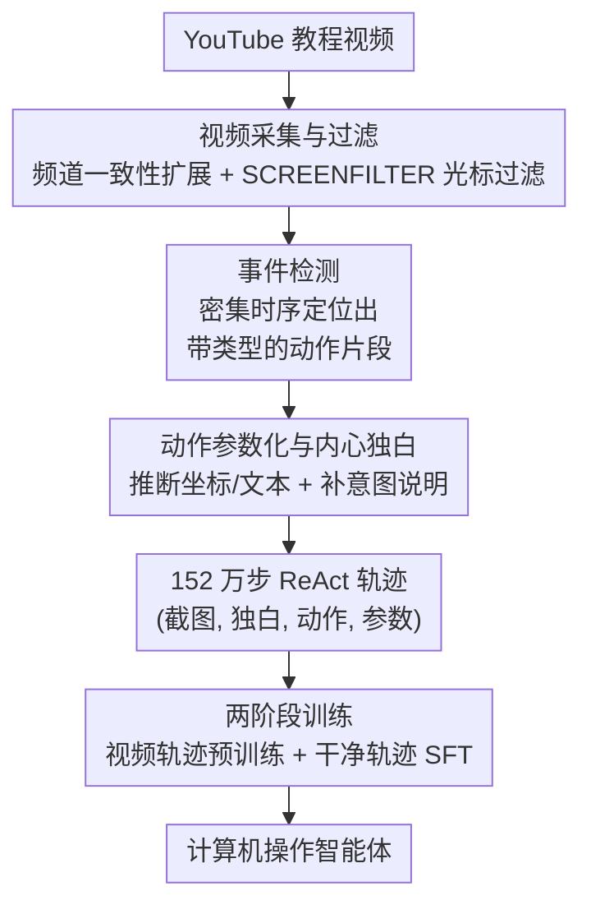

# VideoAgentTrek: Computer Use Pretraining from Unlabeled Videos

**会议**: ICLR 2026  
**OpenReview**: [https://openreview.net/forum?id=xxYPqm1qWz](https://openreview.net/forum?id=xxYPqm1qWz)  
**代码**: https://videoagenttrek.github.io （SCREENFILTER 与 VIDEO2ACTION 开源）  
**领域**: Agent  
**关键词**: 计算机操作智能体, 逆动力学, 无监督预训练, GUI 视频挖掘, 长程规划

## 一句话总结
本文提出 VideoAgentTrek，用一个逆动力学模块 VIDEO2ACTION 从 39,000 个无标注的 YouTube 屏幕录制教程里自动反推出带精确动作参数的操作轨迹（152 万步），再用"持续预训练 + 监督微调"两阶段把它喂给计算机操作智能体，把 OSWorld-Verified 成功率从 9.3% 拉到 15.8%（相对提升 70%）。

## 研究背景与动机
**领域现状**：训练计算机操作智能体（CUA，会点按钮、敲文字、在界面里导航的 agent）需要海量"截图 + 精确动作参数"的交互轨迹——每一步要记下截图、动作类型（click / type）以及参数（点击坐标 $(x,y)$、输入的字符串）。近期视觉语言模型让这类 agent 越来越可行，但它们的发展被数据量卡住了。

**现有痛点**：人工标注这种轨迹极其昂贵。要在多种应用、多种操作系统上达到鲁棒泛化所需的规模，靠人手记录每一次点击和输入是不现实的。现有的三条造数据的路各有短板：人工标注精确但覆盖窄、成本高；在插桩环境里程序化合成量大但受模拟器 API 限制、和真实 UI 有差异；网络爬取的教程/录屏虽然多样，却普遍缺少精确的时间边界和动作参数。

**核心矛盾**：互联网上有数百万段屏幕录制教程（Excel 教程、软件演示……），它们其实**隐式地**包含了所需的监督信号——画面里能看到光标点在哪、敲了什么字、界面如何响应。可这份资源一直没被用上，因为视频缺少训练所需的结构化动作标签：光标在动但没被追踪、文字出现了但没被抽取、动作的时机是隐含的但没被标注。

**本文目标**：把"被动观看的录屏"转成"主动训练用的轨迹"——即在没有真值标签的前提下，自动从原始像素变化里恢复出"什么时候发生了什么动作、参数是多少"。

**切入角度**：借鉴机器人领域的**逆动力学**（inverse dynamics，从观测反推动作）思路。如果能训练专门的模型去检测动作何时发生、并推断其参数，就能把无标签视频转化为有标签的交互数据。

**核心 idea**：用一个学习得到的逆动力学模块（VIDEO2ACTION）把原始录屏反解成 (截图, 动作, 参数) 三元组，从而绕开人工标注，把网络视频规模化地变成计算机操作智能体的监督信号。

## 方法详解

### 整体框架
VideoAgentTrek 是一条把"网络教程视频"端到端转成"agent 训练监督"的流水线，分三段串行：**视频采集与预处理** → **VIDEO2ACTION 逆动力学** → **两阶段 agent 训练**。第一段先用"频道一致性"思路从种子关键词滚雪球地抓教程视频，再用轻量级光标检测器 SCREENFILTER 把真正含 GUI 交互的片段留下来；第二段 VIDEO2ACTION 对每个片段先做密集事件检测（切出带类型和精确起止时刻的动作片段）、再做动作参数化（推断点击坐标 / 输入文本）、最后补一句"内心独白"说明意图，组装成 ReAct 风格的轨迹步 $(I_k, r_k, a_k, \pi_k)$；第三段把挖出来的大规模视频轨迹 + 人工演示 + GUI grounding 数据混合，分两阶段训练：先在含噪但广覆盖的视频轨迹上做持续预训练稳住感知/grounding，再在干净的人工轨迹上做 SFT 收敛策略。

### 关键设计

**1. 频道一致性自发现 + SCREENFILTER：把脏的网络视频低成本筛成干净 GUI 语料**

挖网络视频最大的麻烦是噪声多——关键词搜出来的视频里夹着 PPT 讲解、纯口播等大量非交互内容，逐个人工核验不现实。本文的解法分两步。采集端利用"频道一致性"这一观察：YouTube 频道通常内容类型和质量稳定，于是从"Excel tutorial""How to use Windows"这类种子关键词出发，一旦抽样发现某频道 $\geq 80\%$ 的视频合格，就把整个频道收进候选、不再逐条审查，并借其标签做迭代扩展。这一步刻意**重召回轻精度**（把脏内容留给后续过滤），最终从少量人工种子滚雪球出 5.5 万候选视频（约 1 万小时）。过滤端用 SCREENFILTER——一个基于 YOLOv8x 的轻量光标检测模型：只保留"连续 6 秒以上、至少 80% 帧含光标"的片段（允许 2 秒合并间隙做时序平滑），从 1 万小时原始视频里精炼出 7,377 小时真正含 GUI 交互的内容。两步配合，既把人工监督压到最低（只需校验种子和周期性抽查扩展效果），又保证了进入下游的数据视觉清晰、主题对齐。

**2. 动作事件检测：把 GUI 操作重构成"无提示词的密集时序事件检测"**

要从录屏恢复动作，第一关是定位"何时发生了什么动作"。本文把它建模成 prompt-free 的密集事件检测：给一段长为 $T$ 的录屏 $v$，模型 $f_\theta(v)\to S=\{(a_k, t^s_k, t^e_k)\}_{k=1}^K$ 一次性吐出一组带类型 $a_k$ 和紧致起止时刻 $(t^s_k, t^e_k)$ 的事件，而不是逐帧分类或基于查询检索。实现上给 Qwen2.5-VL-7B 装上视频 grounding 能力，对其做全参数微调，使它能直接从原始片段生成有序、带类型的事件区间。训练监督的妙处在于无需人工标注：用 OpenCUA 的标注工具采到"屏幕录像 + 时间戳同步的鼠标键盘事件"原始演示日志，把这些日志自动转成时序 grounding 监督。这样就把"关键帧检测"重构成"多类时序事件检测 + 紧边界定位"，为后续参数化切出干净的片段。

**3. 动作参数化 + 内心独白：把片段补全成可训练的 ReAct 步**

光知道"发生了点击"不够，还要知道"点在哪""敲了什么"，并补上"为什么这么做"。动作参数化用识别器 $h_\phi(v_k)\to(\hat a_k, \pi_k)$，对每个检测出的片段 $v_k=v[t^s_k:t^e_k]$ 同时预测动作类型和参数——click 段输出坐标 $(x,y)$、type 段输出输入文本 $\langle content\rangle$。它同样以 Qwen2.5-VL-7B 为底座、用 OpenCUA 日志转出的参数标签做全参微调，并可选地以检测器给的 $a_k$ 为条件来稳住类型预测。但密集检测和参数化只恢复了"屏幕上发生了什么"，丢了"每一步的理由"，于是再用 GPT-5 Medium 为每步生成一句简短的内心独白 $r_k$：输入动作类型、参数、动作前后的屏幕关键帧、以及动作前后各 1 分钟的 ASR 字幕，输出一句把意图、局部计划、预期状态变化讲清的理由（如"在搜索框输入查询以显示结果"）。这一步把轨迹补成 ReAct 三元组 $(I_k, r_k, a_k, \pi_k)$，给规划和信用分配提供结构化监督，对长程任务的纠错恢复尤其有帮助。

**4. 两阶段训练：先在含噪视频轨迹上稳 grounding，再在干净人工轨迹上收策略**

自动挖出来的轨迹规模大但难免残留噪声，直接当 SFT 数据会拖累策略学习。本文借"把感知/grounding 与策略学习解耦能提升鲁棒性"的经验，设计两阶段课程。底座是 Qwen2.5-VL-7B（一个通用 VLM，在 OSWorld 上端到端成功率仅 4.5%，正好用来检验 VideoAgentTrek 数据的增益）。Stage 1 用 152 万步视频轨迹对应的约 260 亿 token 训练一个 epoch（再掺少量 GUI grounding 对），数据排成图文交错的视觉-文本序列、帧与逐步文本输出按时序内联，loss 只算在文本部分、图像仅作条件不预测——这一步在广覆盖但不完美的监督上稳住基础 GUI 交互模式。Stage 2 再在约 80 亿 token 的干净人工标注轨迹上继续训练，数据改写成 user/assistant 对话模板、用标准 SFT 只对 assistant 轮计算 loss——这一步把策略收敛到任务相关的精确行为上。两阶段配合既吃到视频的广度，又靠干净数据校准了精度。

### 损失函数 / 训练策略
两阶段都用 masked 语言建模式监督：Stage 1 把图像当条件、只对文本 token 计 loss（260 亿 token，1 epoch）；Stage 2 用聊天模板、只对 assistant 轮计 loss（80 亿 token）。数据混合上，Stage 1 主体是 VideoAgentTrek 视频轨迹（约 26B）+ OSWorld-G 的 GUI grounding 对（约 1B），另有来自 OpenCUA / AGUVIS 的人工演示（约 8B，覆盖 Windows / macOS / Android）参与训练。

## 实验关键数据

### 主实验
在线基准 OSWorld-Verified（369 个 Ubuntu 桌面任务）与离线基准 AgentNetBench（100 个 Windows/macOS 代表任务）上，视频预训练带来一致增益：

| 基准 | 指标 | 底座模型 | 仅 Stage 2 (SFT) | Stage 1+2 | +测试时扩展 |
|------|------|----------|------------------|-----------|-------------|
| OSWorld-Verified | 任务成功率 | 4.5% | 9.3% | 14.13% | **15.78%** |
| AgentNetBench | 步成功率 | 38.5% | 64.1% | **69.3%** | — |

OSWorld 上完整方法相对纯 SFT 基线提升 70%（9.3%→15.8%）、相对底座翻三倍多；AgentNetBench 上比纯 SFT 高 5.2 个点、比底座高 30.8 个点。

### 消融实验
按 Stage 1 视频 token 用量（0% / 50% / 100%）做数据规模消融，Stage 2 SFT 保持一致：

| Stage 1 数据量 | AgentNetBench 步 SR | OSWorld-Verified 任务 SR@50 | 说明 |
|----------------|---------------------|------------------------------|------|
| 0%（仅 SFT） | 64.1% | 9.3% | 无视频预训练 |
| 50% | 68.1% | 13.3% | 半量视频预训练 |
| 100% | 69.3% | 15.7% | 全量，单调上升 |

此外 VIDEO2ACTION 自身的逆动力学质量：动作事件检测在留出测试集上整体精度 0.88、召回 0.70、F1 0.78（click/scroll 等指针类动作可靠，press/type 等纯键盘动作召回偏低因视觉线索弱）；动作参数化在 500 条野外样本上整体准确率 0.658（click 0.713、scroll 0.735 最高，drag/press 因细微视觉线索较差）。

### 关键发现
- **数据规模单调有效**：视频 token 从 0→50%→100%，两个基准都稳步上升，确立了"预训练数据量 ↔ CUA 性能"的清晰关系。
- **视频预训练解锁了测试时扩展**：把动作步预算从 20 放到 50，仅 SFT 基线纹丝不动（卡在 9.3%），而 Stage 1+2 模型从 14.13% 升到 15.78%（+1.65 点 / +11.7% 相对）——说明长视频轨迹教会了模型分解子目标、扛过中间失败、用额外预算去探索纠错。
- **长程监督是增益来源**：VideoAgentTrek 语料平均轨迹长 39.25 步，42.1% 超过 20 步、14.5% 达 50 步以上，远长于既有 CUA 语料，正是这份长程性带来了上述规划能力。
- **在线增益更大**：OSWorld（在线、对视觉变化更敏感）上的相对提升比离线的 AgentNetBench 更显著，说明视频带来的多样性对真实环境鲁棒性最关键。

## 亮点与洞察
- **把机器人逆动力学搬到 GUI**：VPT 早已证明无标签视频能反推动作训练 agent，本文的贡献是把这套思路具体落到 GUI 场景——用"密集事件检测 + 参数化"两段式，达成毫秒级时间定位和参数抽取，这是通用视频 grounding 框架做不到的精度。
- **频道一致性是低成本扩规模的钥匙**：用"整频道打包 + 后置过滤"替代"逐视频审查"，把人工监督压到只剩种子校验，这个"重召回 + 强过滤"的工程取舍可迁移到任何网络数据挖掘任务。
- **用同分布日志造监督**：检测器和参数化器都用 OpenCUA 的"录屏 + 时间戳事件日志"自动转监督，绕开了"GUI 没有真值框"的死结——这种"已有插桩数据反哺野外模型"的思路很值得复用。
- **测试时扩展作为预训练有效性的诊断信号**：用"加步数预算能不能涨"来区分模型是真学会了长程规划还是只会刷重复步，是个很巧的评估视角。

## 局限与展望
- **纯键盘动作恢复弱**：press / type 这类视觉证据细微的动作，检测召回（press 0.08）和参数化准确率（drag 0.366、press 0.362）都明显偏低，意味着挖出的轨迹在这些动作上噪声较大。
- **参数化无法自动评测**：因为没有真值目标框，动作参数化只能靠野外人工盲评，500 条样本的评估规模有限，整体准确率 0.658 也说明轨迹质量离精确还有距离。
- **绝对成功率仍低**：OSWorld 15.8% 虽是相对大涨，但绝对值仍低，离实用 CUA 有距离；底座固定为 7B，更大模型上的可扩展性未验证。
- **内心独白依赖 GPT-5 合成**：理由 $r_k$ 是事后用大模型配文生成的，可能与人类真实意图有偏差，且引入了对闭源模型的依赖。

## 相关工作与启发
- **vs 人工标注 / 程序化合成（OpenCUA、AGUVIS 等）**：他们靠插桩或脚本拿精确标签，但覆盖窄、成本高或受模拟器 API 限制；本文从野外视频反推，牺牲一点精度换来跨数百应用、跨 Windows/macOS/Web 的多样性与规模。
- **vs 通用视频时序 grounding（时序动作定位 / moment retrieval）**：它们关注语义层面的"何时发生何事"，但达不到重构 GUI 交互所需的毫秒级精度和参数抽取；本文把任务重定义为带紧边界的多类事件检测 + 参数识别。
- **vs VPT（从无标签视频学动作）**：VPT 在游戏/Minecraft 用逆动力学自动打标再行为克隆，本文把同一范式迁移到 GUI 操作，并补上 ReAct 式内心独白监督，强调长程规划。

## 评分
- 新颖性: ⭐⭐⭐⭐ 把逆动力学 + 频道一致性挖掘系统性地落到 GUI 录屏，思路清晰且工程完整。
- 实验充分度: ⭐⭐⭐⭐ 在线/离线双基准 + 数据规模消融 + 逆动力学质量评估都有，但参数化只能人工盲评、绝对成功率偏低。
- 写作质量: ⭐⭐⭐⭐ 三段式 pipeline 叙述清楚，图表完整，部分附录细节需另查。
- 价值: ⭐⭐⭐⭐ 提供了一条把互联网录屏规模化转成 CUA 监督的可复现路径，并开源 SCREENFILTER / VIDEO2ACTION，实用价值高。

<!-- RELATED:START -->

## 相关论文

- [\[ICLR 2026\] R-WoM: Retrieval-augmented World Model for Computer-use Agents](r-wom_retrieval-augmented_world_model_for_computer-use_agents.md)
- [\[ICLR 2026\] SCUBA: Salesforce Computer Use Benchmark](scuba_salesforce_computer_use_benchmark.md)
- [\[ICLR 2026\] Efficient Agent Training for Computer Use](efficient_agent_training_for_computer_use.md)
- [\[ICLR 2026\] OSWorld-MCP: Benchmarking MCP Tool Invocation in Computer-Use Agents](osworld-mcp_benchmarking_mcp_tool_invocation_in_computer-use_agents.md)
- [\[ICLR 2026\] Grounding Computer Use Agents on Human Demonstrations](grounding_computer_use_agents_on_human_demonstrations.md)

<!-- RELATED:END -->
