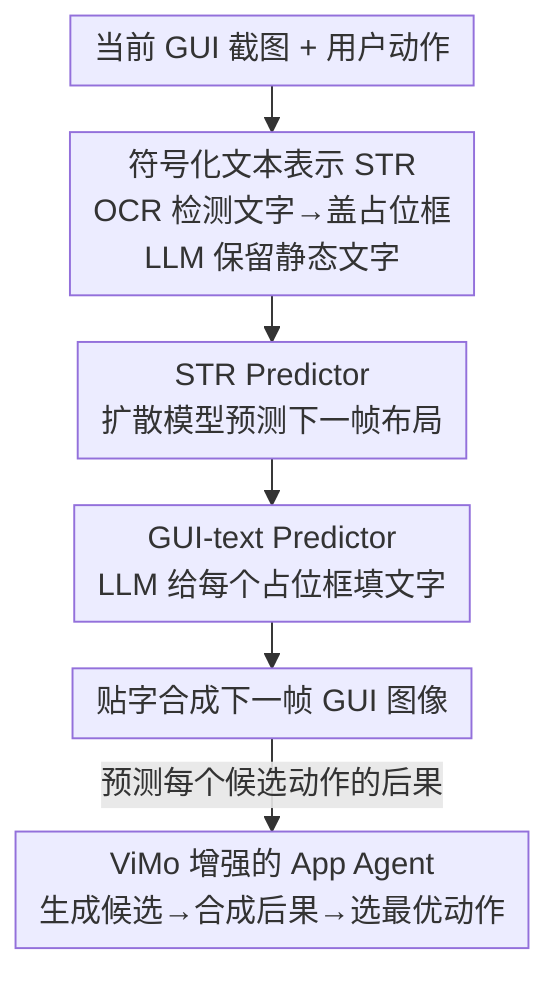

# ViMo: A Generative Visual GUI World Model for App Agents

**会议**: ICLR 2026  
**OpenReview**: [https://openreview.net/forum?id=mWoMyDEfbM](https://openreview.net/forum?id=mWoMyDEfbM)  
**论文**: [Project Page](https://ai-agents-2030.github.io/ViMo/)  
**代码**: 见项目页  
**领域**: Agent / 世界模型 / GUI 生成  
**关键词**: App Agent, GUI 世界模型, 符号化文本表示, 扩散模型, 长程规划

## 一句话总结
ViMo 是首个"视觉"GUI 世界模型——给定当前手机界面截图和一个用户动作，它直接生成动作执行后的**未来 GUI 图像**；为了解决像素级生成画不准小字的老大难问题，它把界面拆成"图形"和"文字"两条线分别生成，用一种叫 STR 的符号化占位表示让扩散模型只管画图形布局、再让 LLM 往占位框里填文字，从而把世界模型的预测结果喂给 App agent 做更准的动作选择。

## 研究背景与动机

**领域现状**：基于 LLM/VLM 的 App agent（在手机上自动操作 App 完成任务的智能体）这两年很火，它们通过读 GUI 截图、模仿人类点按滑动来执行任务。为了让 agent 在复杂任务上少走弯路，一个流行思路是引入**世界模型**：在真正执行动作前，先预测"这个动作执行完界面会变成什么样"，从而比较不同动作的后果再做决策。

**现有痛点**：现有的 GUI/Web 世界模型几乎都是**语言模态**的——它们把"下一步观测"描述成一段文字或 HTML。但文字描述天然抓不住界面里那些关键的视觉细节：某个按钮在屏幕的哪个位置、是什么颜色、有没有被高亮、弹窗里到底排了几个元素。这些细节恰恰是 agent 判断"动作是否成功、下一步该点哪"的依据。另一个看似直接的替代方案是直接在模拟器里真跑动作，但支付、重复下单这类操作一旦执行就很难回退，不适合大规模规划性试错。

**核心矛盾**：那为什么不干脆用图像生成（如 InstructPix2Pix、Stable Diffusion）直接逐像素画出未来 GUI？因为 GUI 里**文字占了极大比重**，而像素级生成画文字极不可靠——哪怕只错几个像素，小号字就会糊成一团、无法辨认。图形（布局、颜色、控件形状）可以容忍轻微像素误差，但文字不行。于是出现一个根本张力：**图形生成需要的是"像素级近似"，文字生成需要的却是"字符级精确"**，用同一个像素生成器同时干这两件事必然顾此失彼。

**本文目标**：造一个能生成**视觉上可信、文字上可读**的未来 GUI 图像的世界模型，并证明这种视觉世界模型能切实提升 App agent 的决策准确率。

**切入角度**：既然图形和文字对生成精度的要求完全不同，那就**别让它们共用一个生成过程**——图形交给擅长画布局/颜色的扩散模型，文字交给擅长理解语义、能精确输出字符的 LLM。

**核心 idea**：用一种"符号化文本表示"(STR) 把界面里所有文字先替换成统一的占位方块，这样扩散模型只需预测"占位框出现在哪、多大"（退化成定位问题），再由 LLM 看着预测好的布局往每个占位框里填真正的文字——**用"先定位、后填字"代替"直接画字"**。

## 方法详解

### 整体框架

ViMo 把"预测下一帧 GUI"这件事拆成**图形线**和**文字线**两条平行流水线，再合并出图。给定当前 GUI 图像 $x_k$ 和用户动作 $a$，世界模型 $f$ 要预测 $x_{k+1}^a = f(x_k, a)$，即动作执行后的下一帧界面。

整体走四步：① **构造 STR**——用 OCR 检测当前界面里的所有文字，把它们用统一的占位方块（白底黑边的矩形）盖住，同时用 LLM 把键盘、时钟这类"静态文字"过滤出来保留在图里，得到当前界面的符号化表示 $\text{STR}_{x_k}$；② **STR Predictor**——一个微调过的扩散模型，吃进 $\text{STR}_{x_k}$ 和动作 $a$，预测下一帧的符号化表示 $\text{STR}_{x_{k+1}^a}$（此时界面布局已经变了，但文字还是空占位框）；③ **GUI-text Predictor**——一个 LLM，先定位预测出的每个占位框并编号，再结合上下文给每个框填上该有的文字；④ **合成 + 应用**——把文字按坐标贴回占位框得到最终的下一帧 GUI 图像，并把这个能力包成"动作后果预测器"供 App agent 比较候选动作、选最优。

### 关键设计

**1. 符号化文本表示 STR：把"画字"难题降维成"定位框"难题**

这是全文的根基，直接针对"像素级生成画不准小字"这个核心痛点。STR 的做法是：对一张 GUI 图像，先用 OCR 模型检测出所有文字区域，然后把每段文字用一个**统一样式的占位方块**（白色填充、黑色边框的矩形，相当于一个特殊的 GUI 元素）盖掉，只留下图形内容。这样一来，生成模型面对的不再是"要把每个字符画对"，而只是"要预测这些占位方块出现在界面的什么位置、多大尺寸"——文字生成被**降维**成了文字定位。原文的说法是把"生成语义文字内容"放松为"预测指示位置和大小的文字符号"。

STR 还有一个容易被忽略但很关键的细节：**静态文字保留**。键盘、数字盘、时钟表盘上的文字不会随交互发生语义变化，且空间排布复杂（一整圈数字、九宫格按键），让 LLM 去预测这些反而容易出错。所以作者用一个 LLM 把这类静态文字**识别出来并原样保留在像素图里**，不纳入占位/预测流程。消融实验证明，保留静态文字对最终 agent 步准确率有明显贡献（去掉后 T3A 从 49.20 掉到 47.28）。

**2. STR Predictor：让扩散模型只管"界面布局怎么变"**

有了 STR，预测下一帧界面的图形就成了一个干净的图像编辑问题，交给扩散模型最合适。作者微调一个预训练的 Stable Diffusion：先把当前的 $\text{STR}_{x_k}$ 编码进隐空间 $z = \mathcal{E}(\text{STR}_{x_k})$，加噪得到 $z_t$，再训练一个 U-Net 去噪，条件是时间步 $t$、动作文本 $a$、噪声隐变量 $z_t$ 和图像条件 $\mathcal{E}(\text{STR}_{x_k})$，目标为

$$L = \mathbb{E}_{\mathcal{E}(\text{STR}_x),\,\epsilon\sim\mathcal{N}(0,I),\,t}\big[\|\epsilon - \epsilon_\theta(z_t, \mathcal{E}(\text{STR}_{x_k}), t, a)\|_2^2\big].$$

为了让模型能以图像为条件，它沿用 InstructPix2Pix 的做法，在第一层卷积上额外加通道，把图像条件 $\mathcal{E}(\text{STR}_{x_k})$ 和噪声隐变量 $z_t$ 拼接起来。因为预测对象是没有文字的占位表示，扩散模型可以把全部容量花在"布局、颜色、控件形状随动作怎么演变"上，不用再为画清楚小字发愁。另一个设计是**用自然语言动作指令（"点击加号图标"）而非抽象动作命令（click + 坐标）当条件**，这样能更好地复用预训练扩散模型对语言的理解；消融显示用指令比用命令明显更好（T3A 47.28 vs 42.81）。

**3. GUI-text Predictor：让 LLM 看着布局精确填字**

扩散模型给出的下一帧 STR 里，占位框的位置和大小已经定了，但框里是空的。这一步用 LLM 把每个框该有的文字精确生成出来。具体做法是：先用**颜色匹配 + 边界检测**在预测出的 STR 里定位所有占位框，按枚举给每个框分配唯一的 ID token，记作 $\mathcal{T}$；然后让 LLM 根据上下文预测每个框的文字内容：

$$\text{text}_{x_{k+1}^a} = \text{LLM}(\text{STR}_{x_{k+1}^a},\, x_k,\, a,\, \mathcal{T}).$$

LLM 同时看到预测好的下一帧布局 $\text{STR}_{x_{k+1}^a}$、当前界面 $x_k$、动作 $a$ 和所有占位框的 ID，于是能结合"原界面写了什么 + 用户做了什么动作"推断每个框现在该显示什么字（例如在邮箱输入框里填上用户刚输入的地址）。生成的文字带着对应的 ID token，最后按坐标把文字贴回占位框，并根据框的尺寸和周围颜色做动态排版（字号、颜色自适应），合成出完整的下一帧 GUI 图像。这一步本质上把"文字生成"从像素任务彻底拉回到 LLM 最擅长的"语义+字符"任务，从根上规避了像素糊字。

**4. ViMo 增强的 App Agent：把"预测后果"接进决策回路**

世界模型本身只是工具，最终目标是帮 agent 做更好的长程决策。作者设计了一个三步流程把 ViMo 接入 agent（见原文 Algorithm 1）：① **生成候选动作**——让 App agent 根据当前界面 $x_k$ 和目标 $g$ 产出 $n$ 个候选动作 $\mathcal{A}=\{a_1,\dots,a_n\}$；② **合成后果**——对每个候选 $a_i$ 用 ViMo 预测其执行后的界面 $x_{k+1}^{a_i} = \text{ViMo}(x_k, a_i)$；③ **选最优动作**——把每个 (动作, 预测界面) 对喂给一个 LLM 选择器 $S(\cdot)$ 挑出最优动作。选择器分两轮：先让 LLM 给每个候选打 valid/invalid 判断和置信分，再让 LLM 在得分最高的两个候选里做精细比较。这个两轮设计源自一个观察——超过 70% 的任务里前两名的分差 ≤ 0.1，说明粗打分常常分不出胜负，必须显式让 LLM 对顶部候选做细致对比才能选准。

### 一个完整示例

以"把闹钟设到某时间并保存"这类多步任务为例走一遍：当前界面 $x_k$ 是时钟设置页，目标 $g$ 是保存闹钟。agent 先生成若干候选动作（如"点 OK 保存""点取消""调整分钟"）。对"点击 OK 保存闹钟"这个候选，ViMo 先把 $x_k$ 的文字盖成占位框、保留时钟表盘这类静态文字得到 $\text{STR}_{x_k}$；STR Predictor 预测点 OK 后界面跳转、弹出保存成功提示的新布局 $\text{STR}_{x_{k+1}^a}$（此时提示框还是空占位）；GUI-text Predictor 定位新占位框、结合动作语义填进"Alarm saved"之类文字，贴字合成出可读的下一帧界面。agent 看到这个候选会真的带来"保存成功"的界面，于是选择器把它选为最优动作。整个过程中 agent 不必在真机上反复试错，就提前看到了每个动作的后果。

## 实验关键数据

数据集：作者从 Android Control 和 Android in the Wild (AITW) 采样构造 STR 数据集，共 19 个 App、3,550 条 episode、23,620 张图像、18,450 个动作；评测用 57 条 episode 的 partial split。默认 LLM 为 GPT-4o。

### 主实验

世界模型生成质量（GUI quality）——指标含 GUI 一致性 $s_{gc}$、指令准确性 $s_{ia}$、动作就绪度 $s_{ar}$ 及三者调和平均 $s_h$：

| 方法 | 自动 $s_h$ | 自动 $\Delta s_h$ | 用户研究 $s_h$ | 用户 $\Delta s_h$ |
|------|-----------|------------------|---------------|------------------|
| HTML-vision | 0.72 | +5.39% | 0.23 | +282.61% |
| IP2P* (在本文数据上微调) | 0.69 | +10.20% | 0.63 | +39.68% |
| UI-diffuser | 0.44 | +71.82% | 0.27 | +225.93% |
| **ViMo (本文)** | **0.76** | — | **0.88** | — |

ViMo 在自动指标上平均相对提升 29.14%，在用户研究上平均相对提升 182.74%。值得注意的是 HTML-vision 和 UI-diffuser 在 LLM 自动评测里还行，但在真人评测里掉得很惨——说明它们生成的界面在人眼看来视觉上不真实/功能上不连贯。

App agent 步准确率（step accuracy）：

| Agent | Overall | 接入 ViMo 后 | 相对提升 |
|-------|---------|-------------|---------|
| T3A (语言型) | 43.13 | **49.20** | +14.07% |
| M3A (多模态型) | 46.01 | **50.16** | +9.01% |

世界模型对比（都接到 M3A 上，step acc.）：无世界模型 46.01；语言型 Change-text 47.28 / HTML-text 46.65；视觉型 HTML-vision 48.89 / UI-diffuser 47.60 / IP2P* 48.56；**ViMo 50.16**——视觉型整体优于语言型，ViMo 又在视觉型里最好。

在线导航（AndroidWorld，116 个任务，task acc.）：T3A 基线 33.19 → T3A+ViMo **40.95**，绝对提升 7.76%。零样本到新 App：T3A+ViMo 达 47.6%、M3A+ViMo 47.6%，均显著超过各自基线。

### 消融实验

| 配置（条件输入） | T3A | M3A | 说明 |
|------|------|------|------|
| 不用 ViMo | 43.13 | 46.01 | 基线 |
| 保留静态文字 + 抽象动作命令 | 42.81 | 45.05 | 只保静态文字、用命令，反而不如基线 |
| 不保静态文字 + 动作指令 | 47.28 | 48.88 | 用自然语言指令明显提升 |
| 保留静态文字 + 动作指令（完整） | **49.20** | **50.16** | 两者叠加最佳 |

迭代步数（递归 roll-out 预测）：T3A+ViMo 迭代 1 次 46.06、2 次 46.65、3 次 45.05——2 次最高但成本更大，3 次反而下降。

### 关键发现
- **动作指令 > 动作命令**是提升最大的单一因素：把"click+坐标"换成"点击加号图标"这类自然语言，能更好地激活预训练扩散/语言模型的理解力，单这一项就把 T3A 从 42.81 拉到 49.20 量级。
- **静态文字保留**与动作指令叠加才发挥作用：单独保留静态文字（配抽象命令）甚至略低于基线，说明这些设计点之间存在协同，不能孤立看。
- **预测视野不是越长越好**：递归预测 3 步反而比 1~2 步差，作者归因于长视野虽带来更多前瞻，但也累积了更多预测误差，弊大于利；最终选 1 步作为性能/效率折中。
- **轻量可部署**：最低 16GB 显存即可，封装成即插即用 API，V100 上 STR 图生成约 8 秒、GUI 文字预测约 30 秒。

## 亮点与洞察
- **"图文分治"是核心洞察**：图形容忍像素近似、文字要求字符精确，二者对生成精度的需求根本不同，硬塞进同一个像素生成器必然失衡——把文字抽象成占位框、交给 LLM 填字，是对"生成式 GUI 画不准小字"这一痛点非常对症的拆解。
- **STR 把生成问题降维**：把"画对每个字符"放松成"预测占位框的位置和大小"，这种"用定位代替生成"的降维思路可迁移到任何"图像里嵌精确文字/符号"的生成任务（如文档、图表、表单生成）。
- **静态 vs 动态文字的区分**很务实：识别出键盘/时钟这类不变且空间复杂的文字直接保留在像素里、不交给模型预测，体现了对"哪些该生成、哪些该绕过"的清醒判断。
- **两轮选择器**针对"前两名分差极小"的真实观察设计，与其相信粗打分，不如让 LLM 显式对顶部候选做细比较——是个可复用的 LLM 决策 trick。

## 局限与展望
- **GUI-text 预测较慢**：单帧文字预测约 30 秒，远高于图形生成的 8 秒，在线交互场景下是瓶颈；对每个候选动作都跑一遍 ViMo，候选多时开销线性放大。
- **依赖 OCR 与静态文字过滤的质量**：STR 构造依赖 OCR 检测和 LLM 对静态文字的判断，这两步出错会传导到后续预测，论文未深入分析其失败模式。
- **长程预测误差累积**：递归 roll-out 超过 2 步即掉点，世界模型尚不能可靠地做更远的多步前瞻，限制了它在真正"长程"任务上的潜力。
- **评测规模偏小**：partial split 只取 57 条 episode，用户研究 70 人/80 样本，结论的统计稳健性有待更大规模验证。

## 相关工作与启发
- **vs 语言/HTML 世界模型 (Change-text, HTML-text)**：它们用文字/HTML 描述下一帧，抓不住元素位置、颜色等视觉细节；ViMo 直接出图像，在 agent 步准确率上视觉型整体压过语言型（50.16 vs 47 量级）。
- **vs 纯像素图像生成 (IP2P*, UI-diffuser)**：它们把图形和文字一起逐像素画，小字必糊；ViMo 用 STR 分治，图形交扩散、文字交 LLM，在用户研究里 $s_h$ 0.88 远超 IP2P* 的 0.63。
- **vs 直接用模拟器试跑动作**：真机执行支付/下单等动作不可回退、不安全；ViMo 作为"想象式"世界模型让 agent 在脑内预演后果，安全且可规模化。

## 评分
- 新颖性: ⭐⭐⭐⭐⭐ 首个视觉 GUI 世界模型，STR 图文分治的思路简洁有效、切中要害。
- 实验充分度: ⭐⭐⭐⭐ 覆盖生成质量、agent 增强、在线导航、零样本、消融多维度，但评测 split 偏小。
- 写作质量: ⭐⭐⭐⭐ 动机推导清晰、图示到位，部分实现细节放在附录。
- 价值: ⭐⭐⭐⭐⭐ 给 App agent 长程规划提供了可视化、可部署、即插即用的世界模型，方向有现实意义。

<!-- RELATED:START -->

## 相关论文

- [\[ICLR 2026\] R-WoM: Retrieval-augmented World Model for Computer-use Agents](r-wom_retrieval-augmented_world_model_for_computer-use_agents.md)
- [\[ICLR 2026\] MemGen: Weaving Generative Latent Memory for Self-Evolving Agents](memgen_weaving_generative_latent_memory_for_self-evolving_agents.md)
- [\[ICLR 2026\] PerfGuard: A Performance-Aware Agent for Visual Content Generation](radiometrically_consistent_gaussian_surfels_for_inverse_rendering.md)
- [\[ICLR 2026\] Dual-Scale World Memory for LLM Agents towards Hard-Exploration Problems](dual-scale_world_memory_for_llm_agents_towards_hard-exploration_problems.md)
- [\[ICLR 2026\] VitaBench: Benchmarking LLM Agents with Versatile Interactive Tasks in Real-world Applications](vitabench_benchmarking_llm_agents_with_versatile_interactive_tasks_in_real-world.md)

<!-- RELATED:END -->
