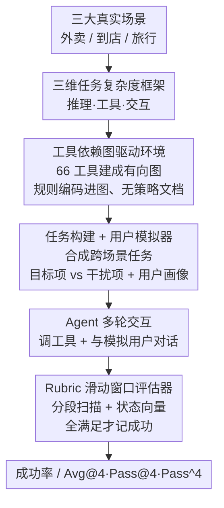

# VitaBench: Benchmarking LLM Agents with Versatile Interactive Tasks in Real-world Applications

**会议**: ICLR 2026  
**OpenReview**: [https://openreview.net/forum?id=rtcX9qOBaz](https://openreview.net/forum?id=rtcX9qOBaz)  
**代码**: https://vitabench.github.io  
**领域**: Agent / LLM 评测  
**关键词**: Agent Benchmark, 工具调用, 多轮交互, 用户模拟器, Rubric 评估

## 一句话总结
VitaBench 把外卖、到店、在线旅行三大生活服务场景抽象成一个含 66 个工具、400 个任务的最复杂"生活服务"模拟环境，用工具依赖图取代领域策略文档让 agent 自主探索，再配一个 rubric 滑动窗口评估器来打分，结果发现即便最强模型在跨场景任务上也只有 30% 成功率。

## 研究背景与动机
**领域现状**：随着 LLM 的推理和工具调用能力增强，agent 评测基准也从单轮 API 调用一路演进到多轮交互场景，出现了 τ-bench、τ²-bench、ToolSandbox、UserBench 等一批面向"真实世界"的基准。

**现有痛点**：但这些基准都只覆盖了真实复杂度的某一个侧面。早期基准（ToolBench、Gorilla）只看函数调用和参数正确率，靠堆工具数量或加干扰项来制造难度，却忽略了工具之间、工具与环境之间的依赖关系；τ-bench 这类则给 agent 套上冗长的领域策略文档（domain-specific policy）和受限的动作空间，把"自主探索"压成了"照章办事"；还有不少基准干脆不把用户当成会带来不确定性的环境组件，而真实部署里恰恰是用户的模糊、变卦、隐藏意图最难对付。

**核心矛盾**：实验室基准和真实部署之间隔着一条鸿沟——到底什么才构成 agent 在真实应用里的"任务复杂度"？没有一个基准能同时在多个复杂度维度上对 agent 施压。

**本文目标**：先回答"真实世界里 agent 的任务复杂度由什么构成"，再据此造一个能同时在这几个维度上拉满难度的基准。

**切入角度**：作者借鉴任务复杂度理论（Liu & Li, 2012）从结构、资源、交互三个角度拆解，提出 agent 任务复杂度由三个维度决定——推理复杂度（要处理整合多少环境信息）、工具复杂度（工具集建模成图后的节点数与边密度）、交互复杂度（用户行为属性与多轮对话带来的动态性）。

**核心 idea**：用工具依赖图把领域规则编码进工具结构本身（从而去掉策略文档、逼 agent 自主探索），把多个真实用户请求合成跨场景任务，再用 rubric 滑动窗口评估器来稳健地判分。

## 方法详解

### 整体框架
VitaBench 不是一个模型，而是一套"环境 + 任务 + 评估"三件套的基准。它从外卖（Delivery）、到店消费（In-store）、在线旅行（OTA）三个生活服务领域出发，抽象出 66 个 API 工具，把工具之间的前置/后置依赖建模成一张有向图，规则就藏在图里。在这套环境上，作者把多个真实用户请求合成出 400 个任务（100 个跨场景任务作主结果 + 300 个单场景任务），每个任务自带独立环境：标注好的用户画像、时空上下文、含大量"目标项 + 干扰项"的服务数据库，以及一份拆成原子标准的 rubric。评测时，被测 agent 以 function-calling 形式一边调工具读写数据库、一边和一个 LLM 用户模拟器多轮对话，跑出一条长轨迹；最后由 rubric 滑动窗口评估器逐窗扫描轨迹、维护"标准是否满足"的状态向量，全部满足才算成功。

整个流程是清晰的两阶段构建管线 + 一条评测回路，适合图文对照：

### 关键设计

**1. 三维任务复杂度框架：把"真实世界难度"拆成可量化的三个轴**

这一框架是整篇工作的概念地基，针对的是"现有基准各测一面、说不清什么叫难"这个痛点。作者在 POMDP 形式化（$(U, S, A, O, T, r)$，状态拆成数据库态与用户态 $S = S_{db} \otimes S_{user}$，用户转移 $T_{user}$ 由语言模型实现因而是随机的）之上，把任务复杂度写成 $C_{task} = \langle C_{reason}, C_{tool}, C_{interact}\rangle$。其中推理复杂度用观测空间熵 $H(O)$ 和部分可观测度 $\eta = 1 - \frac{|O|}{|S|}$ 刻画——值越大说明 agent 要在更大的不确定性下估计状态；工具复杂度把工具集建成有向图 $G=(V,E)$，用节点数 $|V|$、边密度 $\rho = \frac{|E|}{|V|(|V|-1)}$ 和任务相关子图覆盖率 $\frac{|V_{task}|}{|V|}$ 来量化；交互复杂度则由用户画像属性、行为属性（配合度、目标模糊度）以及会随对话演化的用户态 $S_{user}$ 共同构成。这三个轴不是空谈：后文的复杂度分析（Table 6）显示工具复杂度与任务难度强相关——跨场景任务工具最多（66 工具、512 条依赖边）成功率最低（16.2%），而搜索空间最大的到店域反而因推理点最少（5.6 个）成功率最高（42.1%），说明难度不靠数据库大小而靠这三维。

**2. 工具依赖图驱动的无策略环境：把领域规则编码进工具结构，逼 agent 自主探索**

针对 τ-bench 那类"用冗长策略文档喂规则、agent 沦为照章办事"的痛点，作者给每个工具标注前置条件（执行前需满足的状态）和后置条件（执行后的预期结果），并把工具间的依赖建成有向图。例如 `modify_order` 必须先执行 `get_order_detail` 拿到信息，这种自然的工作流依赖直接被编码进图结构。这样做有两层好处：一是规则不再写成文档而是藏在工具的前/后置约束里，agent 必须自己推理"要做 A 得先满足 B"，从而把推理复杂度抬上去、把"自主探索"还给 agent；二是这种图结构天然支持把不同场景的工具集灵活组合，于是同一套机制既能生成单场景任务、也能拼出跨场景任务。这正是 VitaBench 能在不写策略文档的前提下做出 400 个任务、并制造出比 τ-bench 高一个量级交互轮次（50–100 轮）的根本原因。

**3. 任务构建与受控用户模拟器：用"目标项混干扰项 + 渐进式暴露需求"逼出真实交互**

任务侧的数据由四部分组成：用户画像、任务指令、环境信息、rubric。用户画像取自真实平台数据做匿名脱敏后再扩写，赋予不同的情绪表达（急躁、焦虑、冷淡）和交互风格（注重细节、依赖型、逻辑型）；任务指令把多个真实用户请求合成为复合目标，可在单域内协调多个子目标，也可跨域；环境信息则刻意把"满足全部约束的目标项"和"违反某条约束的干扰项"混在一起，造出候选众多、可行解却寥寥的大搜索空间。关键之处在用户模拟器：它拿到完整需求却只渐进式地透露给 agent，隐含约束要 agent 主动问才给——而且设了知识边界，比如 agent 不能直接读到用户的忌口，得从历史订单或追问里推断。为防止完全放飞的用户引入过多随机性，模拟器用 prompt 约束保持人设一致并尽量不犯致命错误，在真实感与可复现性之间取受控的平衡（信息保真度 9.48/10、人设一致性 9.34/10）。

**4. Rubric 滑动窗口评估器：用原子标准 + 状态向量稳健评判超长多解轨迹**

真实任务的轨迹又长（50–100 轮）又多解（推荐、规划这类行为不改变最终数据库状态，靠比对末态根本测不出来），还常常超出评判模型的上下文长度，这让"怎么打分"成了硬骨头。作者为每个任务手工设计 rubric $R = \{r_1, \dots, r_k\}$，每条都是从任务信息派生的原子、客观、二值标准（如"餐厅在 500m 内""用户只吃素"）。评估时把轨迹切成相邻窗口共享 $\delta$ 轮的重叠窗口 $W_i$，逐窗抽取与 rubric 相关的信息并前向传播，维护一个状态向量 $s \in \{0,1\}^k$：某条标准在任一窗口被满足则置 1，若之后被推翻再复位为 0。基准打分用严格的全或无规则 $\text{score} = \mathbb{1}[\sum_j s_j = k]$，即所有标准都满足才算成功；同时这些细粒度 rubric 也能给出稠密分数用于分析甚至 RL 训练。消融显示去掉 rubric 后与人类判分的 Cohen's $\kappa$ 从 0.828 暴跌到 0.07 以下，去掉滑动窗口则 $\kappa$ 掉到 0.604，证明两者缺一不可。

## 实验关键数据

### 主实验
在 24 个先进模型（按 thinking / non-thinking 分类，hybrid 模型两种模式都测）上评测，每任务跑 4 次、温度 0.0，报告 Avg@4 / Pass@4 / Pass^4。

| 设置 | 最佳模型 | Avg@4 | Pass@4 | Pass^4 |
|------|---------|-------|--------|--------|
| 跨场景（主结果） | o3 (high) | 30.0 | 61.0 | 6.0 |
| 到店 In-store | LongCat-Flash-Thinking | 56.8 | 85.0 | 25.0 |
| 外卖 Delivery | o3 (high) | 53.5 | 83.0 | 24.0 |
| OTA 旅行 | o3 (high) | 37.8 | 66.0 | 10.0 |

跨场景成功率从单域的 50%+ 暴跌到 30.0%，暴露了 agent 在扩张动作空间、跨域协调上的根本缺陷。一个反直觉发现：难度不随数据库规模走——到店域产品最多反而最简单，因为外卖任务要在严格约束下精确协调多件商品。

### 消融与可靠性实验

| 配置 | Task Acc. | Rubric Acc. | Cohen's κ | 说明 |
|------|----------|-------------|-----------|------|
| Baseline（滑窗 + rubric） | 95.0 | 88.5 | 0.828 | 完整评估器 |
| w/o 滑动窗口 | 90.0 | 87.6 | 0.604 | 长上下文拖累判分 |
| w/o rubric | 22.0 | – | 0.018 | κ 崩塌，几乎随机 |
| w/o 两者 | 32.0 | – | 0.067 | 同上 |

交互复杂度消融（Figure 8）：用 Default User / Neutral User / Solo Agent 三档对比，去掉用户交互后 Claude-4-Sonnet 从 21.25 升到 27.75、GPT-4.1-Mini 也明显上升，证明用户交互本身就是一大难度来源；且对话风格主要拖累较弱模型。

### 关键发现
- **rubric 是评估器的命脉**：去掉 rubric 后 κ 直接从 0.83 崩到 0.02，几乎等于随机；滑动窗口则解决了评判模型长上下文能力不足的问题。
- **探索有用但不稳定**：Pass@4 随采样上升说明复杂环境奖励探索（对 RL 是好兆头），但 Pass^4 几乎归零，连最强模型一致性都极差；k=4 比 k=1 把 MSE 降低 77.5%，是精度与成本的最佳折中。
- **thinking 又准又省**：thinking 模型平均 23.8% vs non-thinking 17.9%，且轮次更少（61.1 vs 69.9），得益于更好的多步分解和更精准的澄清提问。
- **失败以推理错误为主**：跨场景失败中推理错误占 61.8%（决策 42.1% + 约束冲突 17.1% 等），工具使用错误 21.1%，交互错误 7.9%；agent 普遍自我认知差（有工具却放弃任务）、纠错能力弱（多在重复失败动作而非换策略）。

## 亮点与洞察
- **用图替策略文档**是最巧的一招：把"先查订单详情才能改单"这类业务规则编码进工具的前/后置条件，既去掉了冗长策略文档、又顺手把推理复杂度抬上去、还让跨场景组合变得天然——一个设计同时解决了三个问题。
- **三维复杂度框架不是装饰**：作者真的用 $H(O)$、边密度 $\rho$、推理点数把它落到 Table 6 的相关性分析上，证明"工具复杂度而非数据库规模决定难度"，这让"为什么难"有了可量化的解释而不是拍脑袋。
- **滑动窗口 + 状态向量**这套评估范式可迁移到任何长轨迹、多解、末态不变的 agent 任务评测——把"比对末态"换成"逐窗维护原子标准是否满足"，是对 τ-bench 状态比对法的实质升级。
- **把用户当随机环境组件**：用户模拟器渐进式暴露需求、设知识边界逼 agent 主动澄清，比"指令一次性给全"更贴近真实部署，也解释了为什么去掉用户交互后成功率立刻上涨。

## 局限与展望
- 评估器、用户模拟器都是 LLM，存在"评判/模拟与被测同源是否串通"的隐忧；作者用跨模型对照（Table 4）和二值客观 rubric 来缓解，但无法完全消除模型族偏好。
- 用户模拟器为可复现性做了"受控"设计（prompt 约束人设、避免致命错误），realism 与稳定性之间是人为权衡，scattered 人设可控性偏低，离真正放飞的真实用户仍有距离。
- 成功率用严格的全或无打分，对"差一条 rubric"和"全错"一视同仁，虽然细粒度分数可另作分析，但主榜单的二值化可能掩盖模型间的渐进差异。
- 三大领域、66 工具仍是真实生活服务的简化抽象，工具是"参照真实实现派生的简化 API"，与真正的线上系统在异常处理、并发等方面仍有差距。

## 相关工作与启发
- **vs τ-bench / τ²-bench**: 它们率先做有状态执行和工具依赖建模，但用冗长策略文档约束 agent、轮次 30–80；VitaBench 用工具依赖图把规则编码进结构、彻底去掉策略文档，工具数 66、轮次 50–100，逼 agent 真正自主探索，并首次同时拉满推理/工具/交互三个维度。
- **vs UserBench**: UserBench 独到地捕捉偏好驱动的交互，但任务复杂度其他方面有限；VitaBench 既有丰富用户画像与行为属性，又有复合目标、跨场景和密集工具依赖。
- **vs ToolSandbox / DialogTool**: 前者做了有状态执行但仍靠 policy，后者侧重 role-play 但只关注 agent 侧能力；VitaBench 把环境、用户、工具图三者统一进一个 POMDP 与复杂度框架，是对它们各自侧面的整合升级。

## 评分
- 新颖性: ⭐⭐⭐⭐⭐ 工具依赖图替策略文档 + 三维可量化复杂度框架 + 滑动窗口 rubric 评估器，三处都有实质创新。
- 实验充分度: ⭐⭐⭐⭐⭐ 24 个模型、400 任务、四维结果 + 评估器/模拟器可靠性消融 + 失败模式归因，非常扎实。
- 写作质量: ⭐⭐⭐⭐ POMDP 形式化与复杂度框架清晰，但符号与附录较多，需要对照图表才能完全跟上。
- 价值: ⭐⭐⭐⭐⭐ 最强模型跨场景仅 30%，留出巨大空间，是推动真实世界 agent 发展的高质量基准。

<!-- RELATED:START -->

## 相关论文

- [\[ICLR 2026\] MCP-Bench: Benchmarking Tool-Using LLM Agents with Complex Real-World Tasks via MCP Servers](mcp-bench_benchmarking_tool-using_llm_agents_with_complex_real-world_tasks_via_m.md)
- [\[ACL 2026\] Shopping Companion: A Memory-Augmented LLM Agent for Real-World E-Commerce Tasks](../../ACL2026/llm_agent/shopping_companion_a_memory-augmented_llm_agent_for_real-world_e-commerce_tasks.md)
- [\[ICLR 2026\] Benchmarking LLM Tool-Use in the Wild](benchmarking_llm_tool-use_in_the_wild.md)
- [\[ICLR 2026\] TaskCraft: Automated Generation of Agentic Tasks](taskcraft_automated_generation_of_agentic_tasks.md)
- [\[ICLR 2026\] OpenAgentSafety: A Comprehensive Framework for Evaluating Real-World AI Agent Safety](openagentsafety_a_comprehensive_framework_for_evaluating_real-world_ai_agent_saf.md)

<!-- RELATED:END -->
