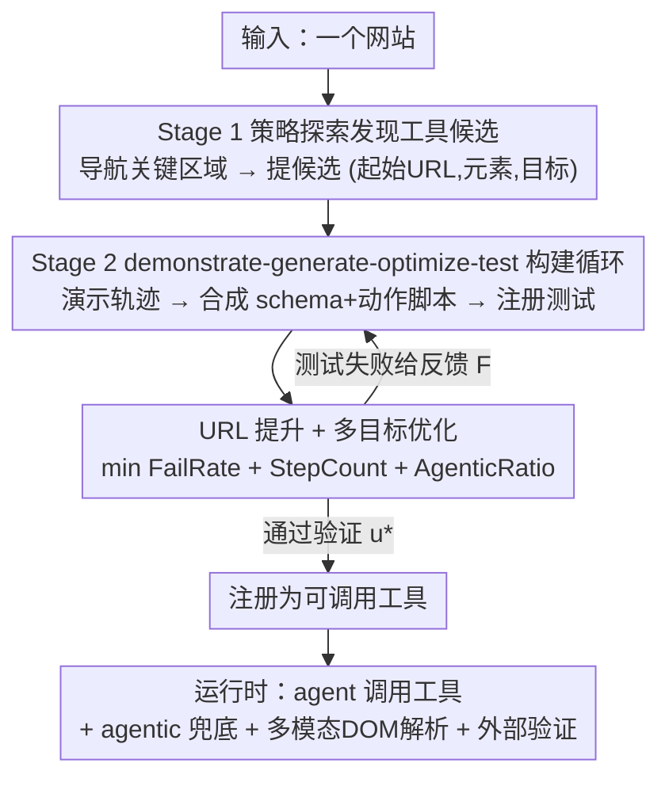

# WALT: Web Agents that Learn Tools

**会议**: ICLR 2026  
**OpenReview**: [https://openreview.net/forum?id=cgIDqcJcoI](https://openreview.net/forum?id=cgIDqcJcoI)  
**代码**: https://github.com/SalesforceAIResearch/WALT  
**领域**: Agent  
**关键词**: Web Agent, 工具学习, 浏览器自动化, 逆向工程, URL 提升

## 一句话总结
WALT 把网站早已设计好的功能（搜索、筛选、排序、发帖、增删改）逆向成一组可直接调用的确定性工具，让 web agent 从「一步步推理怎么点怎么填」转为「直接调用 `search(query)`」，在 VisualWebArena（52.9%）和 WebArena（50.1%）上拿到 SOTA，同时步数更少、对 LLM 推理依赖更低。

## 研究背景与动机

**领域现状**：让 agent 直接操作浏览器完成任务是个诱人方向。主流做法是 agent 在每一步都做密集的 LLM 推理——看截图（常配 Set-of-Mark 标注框）或解析 HTML，然后逐个 UI 原子动作地点击、输入、导航，靠 ReAct / chain-of-thought / MCTS 搜索来选下一步动作。

**现有痛点**：这种逐步 UI 推理在动态布局和长程任务下非常脆弱。一个「找最便宜的蓝色皮划艇」的任务，传统 agent 要推理怎么用搜索框、定位筛选控件、判断排序选项，同时还要操心元素选择和时机，往往要 8+ 个易碎的 UI 步骤。而人类天然以「网站功能」来思考：搜皮划艇 → 按价格筛 → 找第一个蓝的，把实现细节抽象掉，只关心要做什么而非界面机制怎么运作。

**核心矛盾**：已有的「技能发现」工作虽然想复用交互模式，但有两个根本缺陷。一是**技能从哪来**：要么只从成功轨迹里挖（等于把现有行为固化下来、不扩展能力），要么让 agent 凭空臆想有用的自动化（常产出不直观、过度特化或无关的技能）。二是**技能怎么实现**：两类做法都把技能落地成脆弱的 UI 动作序列，对动态元素和设计改版极其敏感。

**本文目标**：发现并实现一批**可靠、可复用、网站特定**的高层操作，让任务执行既高效又稳健。

**切入角度**：网站设计者其实已经把搜索栏、筛选器、排序机制、评论系统、导航控件这些「自动化」工程化地内建进了网站。与其让 agent 学这些交互模式的脆弱近似，不如把网站里已经存在的功能直接「曝露」成工具。

**核心 idea**：用「逆向工程网站既有功能」代替「agent 臆想技能」，把潜在的网站功能逆向成可调用、带校验输入 schema 的确定性工具——agent 不再推理 how，只管调用 `search(X)`、`filter(Y)`、`sort(Z)`，把算力从脆弱的逐步推理转移到可靠的工具调用上。

## 方法详解

### 整体框架

WALT 把浏览器自动化重新建模为「工具的发现与使用」：工具是高层、可调用的操作，把脆弱的底层交互抽象掉。形式上，给定网站集合 $W=\{w_1,\dots,w_n\}$ 和任务集合 $T$，普通 agent 用原子动作 $A_{prim}=\{a_{click}, a_{type}, a_{navigate},\dots\}$ 解任务；WALT 的目标是发现并实现工具 $u: S \to Goal$（$S$ 是结构化输入参数，$Goal$ 是目标结果），把它们作为高层动作 $A_{tools}$ 加进 agent 的动作空间。

整条管线分两阶段、且**全部离线**完成（探索期发现工具，运行期才调用，保证效率与可靠）：**Stage 1** 让浏览器 agent 策略性地探索网站、提出工具候选；**Stage 2** 对每个候选跑 demonstrate-generate-optimize-test 循环，把它构建成经过验证的可执行工具。每个工具背后是一段**优先确定性**（URL/DOM 操作）、必要时才插入 agentic 步骤的动作脚本。最终只有通过验证的工具才在运行时曝露给 agent。

### 关键设计

**1. Stage 1：策略探索发现工具候选**

针对「技能从哪来」这一痛点——只挖成功轨迹会固化行为、凭空臆想又产出垃圾技能——WALT 让一个浏览器 agent $B_{browser}$ 去**系统性地探索面向用户的网站区块**，主动识别可复用的功能模式。它被提示导航到关键区域（内容浏览、发现/搜索、通讯界面），并通过有针对性的交互去发现可交互元素：悬停下拉菜单露出选项、点击菜单暴露导航结构、与表单交互理解输入字段。

探索完后 agent 策略性地提出一组**有清晰用户意图**的工具候选，优化覆盖度（功能多样）、最小化冗余（避免重叠工具）。每个候选 $\tilde{u}=(s_i, E_i, G_i)$ 指明起始 URL $s_i$、相关可交互元素 $E_i$、要完成的具体目标 $G_i$。这样发现的工具天然对应「网站既有功能」（discovery：搜索/筛选/排序；communication：发帖/评论/点赞；content management：增/改/删），而不是 agent 拍脑袋想的怪技能。

**2. Stage 2：demonstrate-generate-optimize-test 构建循环**

针对「技能怎么实现」的痛点——直接堆 UI 动作序列太脆——WALT 用一个四步闭环把候选 $\tilde{u}$ 变成验证过的可执行工具。**Demonstrate**：让 $B_{browser}$ 演示该功能并记录详细执行轨迹 $X$（原子动作、DOM 状态及其带 fallback 的稳定选择器、URL 变化、真实测试输入 $I_{test}$），并被提示用不同输入组合多次演示，以逆向出功能的潜在结构（某输入是必填还是可选、能取哪些值）。**Generate**：一个专门的工具构建 agent $B_{tool}$ 把轨迹合成为可执行工具，包含三部分——带校验数据类型的结构化输入 schema $S$（如下拉框做成 enum、标注可选字段、给用法示例）、说明用途/前置条件/预期结果的工具描述、以及一段顺序执行的动作脚本。脚本步骤分四类：导航（URL/路由变更）、抽取（捕获 DOM 状态）、UI 交互（点击/输入）、agentic（动态交互）；$B_{tool}$ 被**刻意偏向确定性操作**（导航与交互）以提升稳健与效率，只在界面动态或模糊（懒加载、上传）时才允许 agentic 步骤。

**3. URL 提升 + 多目标优化**

这是把工具从「能跑」打磨到「又快又稳又确定」的关键。**Optimize**：$B_{tool}$ 在生成动作脚本后，尽量逆向出可参数化的 URL 路由（如 `?query=X&category=Y`），用单次导航替换多步 UI 序列。**Validate**：把 $(u, S, I_{test})$ 注册成可调用动作，用全新的 $B_{browser}$ 在预先核验过的 $I_{test}$ 上端到端执行；失败会产出结构化反馈 $F$（选择器漂移、未覆盖的 enum 值、时机问题、语义不匹配），$B_{tool}$ 据此细化选择器（优先稳定 hash）、补全 schema、或回退过激的 URL 提升。形式化地，Stage 2 迭代最小化：

$$\min \; \text{FailRate}(u, I_{test}) + \text{StepCount}(u) + \text{AgenticRatio}(u)$$

其中 FailRate 是失败测试用例占比（衡量正确性），StepCount 是实现执行的原子操作数（衡量效率），AgenticRatio 是需要 LLM 推理的步骤占比（衡量确定性）。循环持续到得到验证工具 $u^*$ 或预算耗尽——这正是和「先前工作一次性脚本抽取」的本质区别：WALT 是**压力测试 + 迭代优化**，三个目标同时压低，因此工具既准又快又少依赖 LLM。

**4. 运行时失败兜底 + 两个通用工具**

工具再稳也可能遇到意外（如网站大改版）。WALT 给 agent 配了 **agentic fallback**：脚本临场失败时，临时 spawn 一个全新 agent 去现场处理，作为最后失效保护。此外还额外曝露两个通用工具来增强感知与反思能力：**多模态 DOM 解析器**，把 HTML 转成交错的跨模态输入（markdown dump → interleaved 表示），让 agent 同时用图文推理；**外部验证工具**，对 agent 自报的结果做独立核对（follow SGV / WebJudge 思路），缓解 LLM 的自我同意偏置。这三者共同保证：确定性工具负责高频可靠路径，兜底与验证负责长尾鲁棒性。

### 一个完整示例：在 VisualWebArena 上学一个 search 工具

以 Fig.1 的搜索工具为例走一遍：**Proposal** — 浏览器 agent 探索站点、基于搜索界面提出一个 search 候选。**Demonstration** — $B_{browser}$ 跑一次样例搜索（query=「bicycle」, category=「bikes」），记录 DOM 交互（往搜索框打字、点 category 下拉、提交表单）并观察 URL 变化。**Generation** — $B_{tool}$ 分析轨迹，先生成基于 UI 交互的初版脚本，再用 URL 提升得到基于可参数化路由的更高效实现，同时从下拉菜单抽出带校验的 category enum（Bikes=7, Cars+trucks=10…）诱导出输入 schema。**Validation** — 用多样输入测试，失败（如缺某个 category 选项）触发 schema 细化直到测试通过。

最终工具长这样（简化）：`search_listings(sPattern: string[≥4], [sCategory]: enum[Boats=8,...], [bPic]: bool, [sPriceMin/Max]: float)`，前置条件「任意页可调」，动作脚本就两步——先 `goto(base/index.php?page=search)`，再 `goto(...?sPattern=X&sCategory=Y&...)`。于是「8+ 步脆弱 UI 操作」被压成「1 次稳健调用」。

## 实验关键数据

基础 agent 用 GPT-5 做 VLM planner + GPT-5-mini 做执行器，观测含截图 + SoM 框 + 可交互元素列表；最多跑 30 步、每 15 步重规划；验证 LLM 用 GPT-5-mini（follow WebJudge）。实现基于 browser-use / workflow-use。

### 主实验

VisualWebArena（910 个视觉 grounded 任务，三站点）成功率：

| 方法 | Classifieds | Shopping | Reddit | 平均 |
|------|-------------|----------|--------|------|
| GPT-4V+SoM | 9.8 | 17.1 | 19.3 | 16.4 |
| TreeSearch | 26.5 | 29.0 | 20.5 | 26.4 |
| Computer-Use (Claude) | 36.7 | 21.9 | 27.5 | 27.0 |
| ExaCT | 41.0 | 32.3 | 28.7 | 33.7 |
| SGV | 52.0 | **57.0** | 33.0 | 50.2 |
| **WALT (Ours)** | **64.1** | 53.4 | **39.0** | **52.9** |
| Human | 91.7 | 88.4 | 87.1 | 88.7 |

WALT 拿到最高均分 52.9%，Classifieds 比 SGV 高 +12.1 绝对、Reddit 高 +6.0，几乎是 Claude Computer-Use 的两倍。WebArena（812 个任务，6 个 split）平均 50.1%，在 5/6 个 split 最优（第六个打平），比最强的技能诱导方法 ASI（40.4%）高约 9 分。

| 方法 | Gitlab | Map | Shopping | CMS | Reddit | Multi | 平均 |
|------|--------|-----|----------|-----|--------|-------|------|
| AWM | 28.9 | 39.4 | 34.8 | 39.0 | 51.9 | 18.8 | 35.5 |
| ASI | 32.2 | 43.1 | 40.1 | 44.0 | **54.7** | 20.8 | 40.4 |
| Hybrid Agent (用 API 文档) | 44.4 | 45.9 | 25.7 | 41.2 | 51.9 | 16.7 | 38.9 |
| **WALT (Ours)** | **57.0** | **58.7** | **41.2** | **56.2** | 48.5 | **20.8** | **50.1** |

### 消融实验

在 VisualWebArena-Classifieds（工具最丰富、含 9 个工具）上做多 backbone 消融：

| 配置 (backbone / tools / dom / verify) | 平均步数 ↓ | 成功率 ↑ |
|------|---------|---------|
| gpt-5-mini / none / text / self | 8.9 | 57.5 |
| gpt-5-mini / **discovered** / text / self | 6.5 (−27%) | 61.5 (+7.0) |
| gpt-5-mini / **human demo** / text / self | 7.4 | 66.0（上界）|
| gpt-5-mini / none / **multimodal** / self | 7.5 | 59.0 (+2.6) |
| gpt-5-mini / none / text / **external** | 11.0 | 59.4 (+3.3) |
| gpt-5-mini / **discovered+multimodal+external** | 7.0 (−21.3%) | **64.1** |

Online-Mind2Web（139 个真实网站、300 任务）：WALT 自主发现 **252 个验证过的工具**，在不报环境错的 238 任务上比无工具基线成功率相对提升 **+20.5%**（42.9→51.2）、效率 +23.3%（10.8→8.2 步），且无任何专门训练就逼近 Claude Computer-Use 官方榜（51.2% vs 51.7%）。252 个工具构成：URL Promotion 31.7%、UI Only 15.1%、Agentic 23.8%、Mixed 29.4%。

### 关键发现
- **工具本身才是涨点主因**：用相同架构但去掉工具的基线成功率显著更低，证明增益不是单靠更强的 GPT-5；工具最高带来 30.7% 相对性能提升、1.4× 效率。
- **强 backbone 受益更大**：更好的推理改善的是「工具选择与组合」而非底层操作；且所有 backbone 共用同一套（用 GPT-5 发现的）工具，说明**学到的工具可跨模型迁移**、不绑定 backbone。
- **WALT 几乎追平人工示范上界**：人工 demo 工具上界 66.0%，全自动的 WALT 拿到 64.1%、还少 5% 步数。
- **agentic 步骤很罕见**：9 个工具里只有 3 个含至少一个 agentic 步骤；最短脚本对应 URL 提升（discover 类），最长脚本偏确定性 UI 交互（content-management 类，如填表）。
- **成本可摊销**：Online-Mind2Web 上 305 个候选成功验证 252 个（82.6%），平均 1.75 次尝试/工具、1.81 工具/站点；单工具生成约 $1.67，按 $0.12/任务推理成本，约 14 次复用即回本，之后无限复用持续收益。

## 亮点与洞察
- **「逆向网站既有功能」这个 reframing 是最 aha 的点**：不让 agent 发明技能、而是把站点设计者早就工程化好的稳健自动化「曝露」出来——这从根上回避了「臆想技能不靠谱 + UI 序列太脆」两个老问题。
- **三目标联合优化（FailRate + StepCount + AgenticRatio）很巧**：一次性同时压正确性、效率、确定性，其中 AgenticRatio 显式地把「少依赖 LLM」写进目标，直接对应「确定性工具更稳更便宜」的直觉，可迁移到任何「LLM 编排确定性子程序」的系统。
- **URL 提升是性价比之王**：把多步 UI 序列折叠成一次带参导航，既快又几乎不会因布局变化失效；这招对任何 RESTful/查询参数化的网站都通用。
- **工具跨模型迁移**：一次发现、任意 backbone 复用，意味着工具发现成本可以集中用最强模型做、推理则可下放给便宜模型，工程上很实用。

## 局限与展望
- **离线发现有 per-website 成本**，且发现工具的种类/质量既取决于探索覆盖、也取决于站点暴露了什么；高度动态界面、A/B 实验、CAPTCHA、强反自动化会降低确定性或挡掉 URL 提升。
- **schema 可能漏掉罕见参数值**，选择器在大改版后会漂移，复杂编辑器/文件上传等交互仍需 agentic 步骤。
- **真实世界很脏**：Online-Mind2Web 上 62 个任务因 bot 检测（35）或超时（27）失败，22 个网站（apartments.com、cars.com、UPS.com 等）因强反爬完全无法测试；该 benchmark 还只能测只读任务（带认证的写操作不安全）。
- 作者展望：选择器/schema 漂移时**在线打补丁**、抽取通用 web 模式（search/filter/sort 的规范形式）助力泛化、以及与官方 API / 外部 MCP server 混合集成。

## 相关工作与启发
- **vs 技能发现（SkillWeaver / AWM / ASI）**：它们多从成功轨迹挖技能、并用原子动作拼成脆弱 UI 序列，本质是固化现有行为；WALT 系统性探索网站功能、做 schema 校验 + 选择器稳定 + URL 逆向 + 定向 agentic 兜底，工具经压力测试与迭代优化，是「扩展能力」而非「编码已有行为」。
- **vs 用 API 的 web agent（Hybrid Agent 等）**：它们假设有 API 文档，而文档常缺失或专有；WALT **不假设任何 API 文档**，靠系统探索自主逆向出带校验 schema 的可调用工具（WebArena 上 50.1% vs Hybrid 38.9%）。
- **vs 测试时搜索（MCTS / reflective-MCTS / WebDreamer）**：它们靠运行时扩展搜索选更好动作序列，仍是逐步推理；WALT 把重活挪到离线工具构建，运行时只做高层规划 + 可靠调用，更快更稳。

## 评分
- 新颖性: ⭐⭐⭐⭐⭐ 「逆向网站既有功能成确定性工具」是对 web agent 范式的干净 reframing，区别于臆想技能与 API 依赖。
- 实验充分度: ⭐⭐⭐⭐⭐ 三大 benchmark（含 139 个真实站点）+ 多 backbone 消融 + 成本/步数细粒度分析，证据扎实。
- 写作质量: ⭐⭐⭐⭐⭐ 动机—方法—验证逻辑清晰，demonstrate-generate-optimize-test 闭环讲得很具体。
- 价值: ⭐⭐⭐⭐⭐ 工具一次发现、跨模型复用、带显式契约可审计，给「安全可维护的浏览器自动化」指了条实用路径。

<!-- RELATED:START -->

## 相关论文

- [\[ICLR 2026\] Web-CogReasoner: Towards Multimodal Knowledge-Induced Cognitive Reasoning for Web Agents](web-cogreasoner_towards_multimodal_knowledge-induced_cognitive_reasoning_for_web.md)
- [\[ICLR 2026\] How Dark Patterns Manipulate Web Agents](how_dark_patterns_manipulate_web_agents.md)
- [\[ICLR 2026\] ST-WebAgentBench: A Benchmark for Evaluating Safety and Trustworthiness in Web Agents](st-webagentbench_a_benchmark_for_evaluating_safety_and_trustworthiness_in_web_ag.md)
- [\[ICLR 2026\] Go-Browse: Training Web Agents with Structured Exploration](go-browse_training_web_agents_with_structured_exploration.md)
- [\[ICLR 2026\] WebFactory: Automated Compression of Foundational Language Intelligence into Grounded Web Agents](webfactory_automated_compression_of_foundational_language_intelligence_into_grou.md)

<!-- RELATED:END -->
