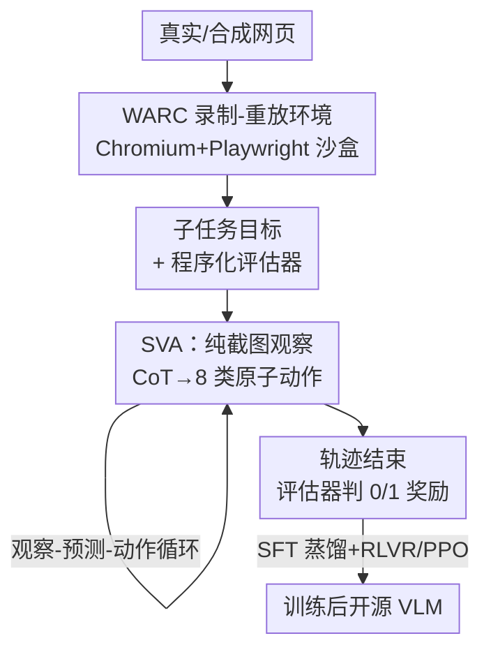

# WARC-Bench: Web Archive based Benchmark for GUI Subtask Executions

**会议**: ICLR 2026  
**OpenReview**: [https://openreview.net/forum?id=Hgw56DUFzD](https://openreview.net/forum?id=Hgw56DUFzD)  
**代码**: https://sanjari-orb.github.io/warc-bench/ (项目页)  
**领域**: Agent / 多模态VLM  
**关键词**: GUI Agent, 子任务执行, Web Archive, 可验证奖励, RLVR

## 一句话总结
本文提出 WARC-Bench——用 Web Archive 文件把真实网页"冻结"成可沙盒重放的交互环境，构建 438 个聚焦"中等粒度子任务"（选日期、拖滑块、滚容器抽信息等）的 GUI Agent 评测集，并用程序化可验证奖励自动判分；实验显示最强闭源模型也只有 64.8% 成功率，而作者用 SFT + RLVR 训练的开源 72B 模型达到 52.3%，超过多数前沿模型。

## 研究背景与动机
**领域现状**：Web Agent 研究目前分裂在两个极端。一端是**单步视觉定位**（visual grounding），只考"把'日语'按钮的像素坐标输出来"这种一步到位的映射（如 ScreenSpot）；另一端是 **WebArena、Mind2Web** 这类**长程多步导航**，考"在 Amazon 上下单一条 50 美元以下的绿色 Levi's 女牛仔裤"这种几十步的完整工作流。

**现有痛点**：真实的浏览器任务其实由一堆**中间粒度的"子任务"**拼起来——滚动探索页面、和日期选择器/下拉菜单/菜单栏交互、滚到某处抽实体、填表、改电子表格单元格、拖动滑块设值。这种"对人来说是一句话指令、但要拆成多个原子 UI 动作（1–20 步）"的中等复杂度任务，在现有真实 GUI benchmark 里几乎是空白：定位太简单不覆盖多步交互，长程导航又把这一层揉进端到端成功率里，无法单独诊断。

**核心矛盾**：长程任务表现差，到底是"规划坏了"还是"连选个日期、滚个容器这种基本子能力都不行"？现有 benchmark 把两者混在一起，无法解耦；而且很多 benchmark 要么靠模拟环境（WebArena、OSWorld，扩展一个新站点成本高），要么在真实站点上跑（有写操作风险、不可隔离、判分靠人或靠 LLM 不确定）。

**本文目标**：(1) 正式定义"GUI 子任务"这一介于定位与长程之间的层级；(2) 造一个真实、可隔离、判分确定、易扩展的子任务评测集；(3) 验证"子任务做得好"是否真能预测长程导航能力；(4) 探索如何把开源模型训到能打前沿闭源。

**切入角度**：用 **Web Archive（WARC）文件**把真实网页连同 HTML/CSS/JS/图片/HTTP 头一起录下来，在 Chromium 里高保真重放——这样既保留真实网页的复杂控件与稠密布局，又天然支持沙盒隔离、确定性、可扩展（加新环境＝加一个录制），还不碰真实线上站点。

**核心 idea**：用"录制-重放的真实网页 + 程序化可验证奖励"来评测一个被忽视的中间能力层——GUI 子任务执行，并证明它比定位/低保真控件任务更能预测长程导航能力。

## 方法详解

### 整体框架
WARC-Bench 不是一个模型，而是一套**评测套件 + 配套 Agent + 训练配方**。它要解决的是"如何可靠地评测并提升 Agent 在真实网页上的子任务执行能力"。整体可分成三块串起来：先用 **WARC 录制-重放**把真实/合成网页变成可交互的沙盒环境，每个环境配一条自然语言**子任务目标**和一个**程序化评估器**；然后让 Agent（作者设计的 **SVA** 或各家 computer-use agent）在环境里跑"观察-预测-动作"循环，轨迹结束时由评估器给出 0/1 奖励；最后用同一套可验证奖励驱动 **SFT + RLVR** 训练，把开源 VLM 提升到前沿水平。

### 关键设计

**1. WARC 录制-重放环境：用网页快照换来真实、隔离、可扩展**

针对"真实站点不可隔离、模拟环境又不真实且难扩展"的痛点，作者用 Web Archive 文件把网页**完整状态**录下来——不只是 HTML，还包括 CSS、JS、图片/视频、甚至 HTTP 头和元数据，这样录制的轨迹**完全可重放**，重放出来是原网页的真实交互克隆。他们写了一个轻量 WARC replayer，用 Playwright 在 Chromium 里跑，概念上类似 ReplayWeb.page，并把任务封装成 Gym 环境，可直接接入 BrowserGym、verl-agent 等训练框架。这套设计同时拿下表 1 里四个属性：**高保真**（真实复刻网页）、**任务隔离**（每次任务跑一份独立的环境副本，互不污染，且永不对真实站点做写操作）、**可扩展**（加新环境就是加一段网页录制，不像 WebArena/OSWorld 受限于手搭模拟器）、**多样观察空间**。代价（作者明说的局限）是：没录到或无法从存储 HTML/JS 渲染的交互不可重放，用 Cloudflare/反爬的站点常无法存档，URI 里带时间戳/随机数/session ID 的资源需要小心处理。

**2. 程序化可验证奖励：让判分与路径无关、确定可复现**

子任务评测最怕"对了但判错"或"靠 LLM 打分飘"。本文给每个任务配一个**代码化评估器**，在轨迹结束时检查网页**终态**是否达成目标，从而让评测**与 Agent 走的具体路径无关**——只要把页面改成了对的状态就算成功。评估器支持 4 种类型：(a) JS 函数评估器（如 `document.querySelector('#riskslider').value=='4'`，或 datepicker 检查 `getAttribute("calendarfocusdate")=="03/21/2025"`）、(b) URL 匹配、(c) 字符串匹配、(d) JSON 匹配（如 `{'total_tow_fee': 657}`，后两种主要用于信息抽取类任务）。因为目标本身被设计成"有确定且唯一的终态"，这套程序化奖励既是评测的判分器，也直接当作 RLVR 的奖励信号，一物两用。

**3. 真实+合成双源数据构建：兼顾真实性与规模**

子任务要覆盖广又要有真实站点，纯手工太慢、纯合成不真实。作者先归纳出 **15 类常见子任务**（菜单导航、填表、数据抽取、表格操作、datepicker、图标识别、拖放、列表导航、下拉、定位、搜索自动补全、文档编辑、对话框、分页、计算），然后两条腿走路：**真实侧**选 29 个可被存档、且能很好覆盖这些类别的真实站点（GitHub、Zoho Desk、Zendesk、Kaiser Permanente、Google Earth、Scrimba 等），目标与评估器由作者**人工标注**；**合成侧**用一条 LLM pipeline 生成 62 个含丰富 UI 控件的合成网页及其目标、评估器，再人工**校验可行性与正确性**（比纯手工端到端快很多）。最终造出 1497 个子任务，划分为 **训练 1059（合成）/ 开发 238（60 真实 + 178 合成）/ 测试 200（全真实）**。刻意把测试集限制为纯真实站点，是因为他们观察到 Agent 在真实任务上明显比合成任务差，凸显高质量真实测试集的必要。

**4. SVA + SFT/RLVR 训练配方：把开源模型练到能打前沿**

为公平评测并作为训练骨架，作者设计了极简的 **Subtask Vision Agent（SVA）**：每步只吃"目标 + 当前截图 + 动作空间 + 至多 5 步历史"，输出一段 CoT 加一个动作；**只用截图观察**（放弃 accessibility tree / HTML DOM，因为文本表示冗长易超上下文，而现代网页的图标、canvas 渲染用截图更忠实），动作空间是 8 类原子动作（click、complete、drag&release、hover、key press、scroll、type、wait），底层用 BrowserGym 驱动浏览器。SVA 虽简单，却比各家专用 computer-use agent 用更少 token、更短轨迹还更强。训练分两段：先用**教师轨迹蒸馏**——靠一个可扩展的子任务轨迹爬取框架，用强 UI 能力的教师模型收集约 12k 条轨迹（来源含 Common Crawl、UI 组件库网页、合成网页），把定位、规划、纠错、奖励建模能力蒸到 Qwen2.5-VL 7B/72B；再在 1059 个合成 Gym 任务上用 **PPO 做 RLVR**，奖励方案极简（成功轨迹 +10，失败或超步数截断 0），直接从带环境反馈的 rollout 学习。

## 实验关键数据

### 主实验
WARC-Bench 测试集（200 真实任务）成功率，CUA 表示用厂商自带 computer-use agent，其余用 SVA，均为 3 次平均：

| 模型 | Dev[TOTAL] | Test | 说明 |
|------|-----------|------|------|
| Claude Sonnet 4.0 (SVA) | 83.61 | **64.83** | 全场最高 |
| Claude Sonnet 3.7 | 81.93 | 59.83 | 闭源次高 |
| GPT-5 | 69.89 | 51.33 | |
| Claude Sonnet 4.0 (CUA) | 78.96 | 47.17 | 同模型 CUA 反而低于 SVA |
| OpenAI computer-use-preview (CUA) | 58.96 | 33.83 | |
| Qwen2.5-VL 72B (基座) | 61.06 | 37.33 | 开源最强基座 |
| **Ours-72B-SFT** | 75.88 | 48.33 | 较基座 +11 |
| **Ours-72B-RLVR** | **84.31** | **52.33** | SFT 基础上再 +4，超多数前沿 |
| Qwen2.5-VL 7B (基座) | 15.54 | 4.67 | |
| Ours-7B-SFT | 66.54 | 27.33 | 较基座 +22.7 |
| Ours-7B-RLVR | 72.13 | 29.17 | |

关键信号：(1) 最强闭源也只有 64.8%，子任务对前沿模型仍很难；(2) **同族模型下 SVA 设计普遍打过厂商专用 CUA**；(3) SFT 蒸馏把 7B 从 4.67%→27.33%、72B 从 37.33%→48.33%，提升巨大；(4) RLVR 在 SFT 上继续涨，72B 达 52.33%，且开发集上合成训练数据不仅涨合成任务（+9.41%）也涨真实任务（+7.78%）。

### 跨 benchmark 相关性分析

| 模型 | WARC-Bench(test) | WebArena(no map) | MiniWoB++ | ScreenSpot V2 |
|------|------------------|------------------|-----------|---------------|
| Qwen2.5-VL 72B | 37.33% | 15.68% | 53.87% | **88.05%** |
| GPT-5 | 51.33% | 34.06% | 52.27% | 26.39% |
| Claude 4 Sonnet | **64.83%** | **37.96%** | **71.73%** | 85.06% |
| Ours-72B-RLVR | 52.33% | 26.80% | 59.20% | 82.44% |

核心发现：**定位（ScreenSpot）和低保真控件（MiniWoB++）任务与长程导航（WebArena）相关性差**——例如 Qwen2.5-VL 72B 在 ScreenSpot 上 88% 反超前沿模型，却在 WebArena 长程任务上垫底；而 **WARC-Bench 的排名与 WebArena 在系统层面一致**，说明子任务执行能力是长程导航的前置能力。此外，用子任务数据微调的模型在几乎所有 benchmark（除纯定位外）上都比基座强，包括长程的 WebArena，印证"练好子任务能整体提升网页导航能力"。

### 关键发现（RLVR 行为分析，72B SFT vs RLVR）
- **动态任务提升最大**：填表、菜单导航、表格操作、datepicker 等需要探索和精细交互的类别涨幅最明显（如 datepicker 0.655→0.964、menu navigation 0.725→0.882、icon recognition 0.718→0.923），驱动力是更强的视觉定位与更好的探索/上下文感知。
- **效率更高**：RLVR 模型更多用滚动来探索页面、减少冗余点击、更常用复合操作（如 click-and-type），平均每个任务比 SFT 少约 **0.94 步**，轨迹更短。
- **真实 > 合成的难度差**：所有模型在真实任务上都比合成任务差，说明合成数据虽可放量但不能替代真实测试集。

## 亮点与洞察
- **WARC 文件当评测环境**是最巧的一招：用一个成熟的网页存档格式，一举拿下真实性、隔离性、可扩展性、安全性（不碰线上站点），且重放比跑实时网站更快更稳——把"造真实 GUI 环境"的成本从"搭模拟器"降到"录一段网页"。
- **可验证奖励一物两用**：同一套程序化评估器既是评测判分器（路径无关、确定可复现），又直接作为 RLVR 奖励信号，省去额外训奖励模型，这是 benchmark 设计与训练配方能闭环的关键。
- **"中间粒度"的定位很有洞察**：明确指出定位↔长程之间存在被忽视的子任务层，并用跨 benchmark 相关性实验证明它比定位/低保真控件更能预测长程能力——这给"为什么要单独评子任务"提供了实证而非仅靠直觉。
- **SVA 反超厂商 CUA** 是个可迁移的观察：纯截图 + 极简 8 动作 + 短历史的设计，用更少 token/步数却更强，提示当前很多 computer-use agent 的复杂脚手架未必划算。

## 局限与展望
- **WARC 重放的覆盖边界**（作者承认）：未录制或无法从存储 HTML/JS 渲染的交互不可重放；用 Cloudflare/反爬的站点常无法存档；URI 带时间戳/随机数/session ID 的资源需特殊处理——这会让某些真实站点天然进不了 benchmark，可能引入选择偏差。
- **子任务仍是"短程"**：定义限定在 1–20 个原子动作的自包含目标，长程规划、跨页面状态维持、错误恢复的长链条仍不在评测范围内；"子任务好→长程好"虽有相关性证据，但只是系统层排名一致，并非严格因果。
- **合成数据占训练大头**：训练集 1059 全是合成任务，RLVR 也只在合成环境上跑，真实任务的提升靠迁移；真实站点的长尾控件/反爬场景可能仍训不到。
- **判分依赖终态唯一性**：评估器假设目标有确定唯一终态，对开放式或多解的信息抽取/编辑任务，这种程序化判分可能漏判合理的替代解。

## 相关工作与启发
- **vs WebArena / OSWorld**：它们考长程导航、用模拟或真实环境，但扩展一个新环境成本高、且 WebArena 多步任务把子能力揉成端到端成功率；WARC-Bench 专攻中间粒度子任务、加环境只需加录制，且与 WebArena 排名一致可作其前置诊断。
- **vs Mind2Web / Online-Mind2Web**：Mind2Web 离线、不交互、无确定终态奖励；WARC-Bench 提供交互环境 + 任务隔离 + 确定性奖励（表 1）。
- **vs ScreenSpot V2 / MiniWoB++**：前者纯定位、后者低保真合成控件，本文实验证明二者与长程能力相关性弱，不能代替子任务评测。
- **vs FormFactory（并行工作）**：同样用 LLM 合成网页/控件，本文把它纳入更完整的"真实+合成双源 + 可验证奖励 + 训练配方"闭环。

## 评分
- 新颖性: ⭐⭐⭐⭐⭐ 首个基于 Web Archive 的真实 GUI 子任务 benchmark，"中间粒度"层级定位有洞察。
- 实验充分度: ⭐⭐⭐⭐⭐ 覆盖闭源/开源/CUA 多模型、跨 4 个 benchmark 相关性分析、SFT/RLVR 行为剖析齐全。
- 写作质量: ⭐⭐⭐⭐ 动机推导清晰、图表完整，部分实现细节散落附录。
- 价值: ⭐⭐⭐⭐⭐ 既补齐评测空白，又给出可验证奖励驱动的开源训练配方，对 Web Agent 研究实用性强。

<!-- RELATED:START -->

## 相关论文

- [\[ICLR 2026\] ST-WebAgentBench: A Benchmark for Evaluating Safety and Trustworthiness in Web Agents](st-webagentbench_a_benchmark_for_evaluating_safety_and_trustworthiness_in_web_ag.md)
- [\[CVPR 2026\] GUI-CEval: A Hierarchical and Comprehensive Chinese Benchmark for Mobile GUI Agents](../../CVPR2026/llm_agent/gui-ceval_a_hierarchical_and_comprehensive_chinese_benchmark_for_mobile_gui_agen.md)
- [\[ICLR 2026\] SMAN-Bench: A Cross-System Benchmark for Mobile Agents under Single- and Multi-path, Ambiguous, and Noisy Tasks](sman-bench_a_cross-system_benchmark_for_mobile_agents_under_single-_and_multi-pa.md)
- [\[ICLR 2026\] Terminal-Bench：在命令行界面上对智能体进行困难、真实任务的基准测试](terminal-bench_benchmarking_agents_on_hard_realistic_tasks_in_command_line_inter.md)
- [\[ICLR 2026\] TRAJECT-Bench：一个轨迹感知的智能体工具调用评测基准](traject-bencha_trajectory-aware_benchmark_for_evaluating_agentic_tool_use.md)

<!-- RELATED:END -->
