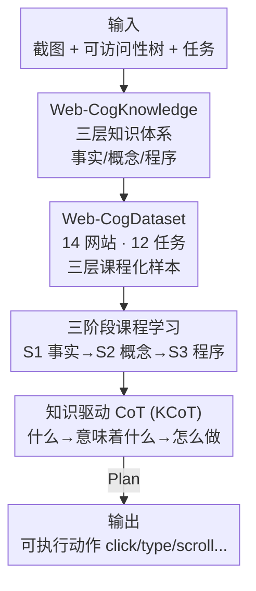

# Web-CogReasoner: Towards Multimodal Knowledge-Induced Cognitive Reasoning for Web Agents

**会议**: ICLR 2026  
**OpenReview**: [https://openreview.net/forum?id=siXHlHBYIe](https://openreview.net/forum?id=siXHlHBYIe)  
**项目页**: [https://Gnonymous.github.io/Web-CogReasoner](https://Gnonymous.github.io/Web-CogReasoner)  
**代码**: https://github.com/Gnonymous/Web-CogReasoner (有)  
**领域**: Agent / 多模态VLM  
**关键词**: Web Agent, 布鲁姆分类法, 知识驱动 CoT, 课程学习, 多模态

## 一句话总结
本文借鉴布鲁姆教育分类法，把 Web Agent 的能力拆成「知识内容学习」与「认知过程」两阶段，构建了事实/概念/程序三层的 Web-CogKnowledge 知识体系、配套数据集 Web-CogDataset 与评测基准 Web-CogBench，再用三阶段课程学习 + 知识驱动 CoT 训练出 Web-CogReasoner，在仅 7B 参数下于多个 web 导航基准上超越同规模开源 agent，并在未见任务上展现出由结构化知识带来的强泛化。

## 研究背景与动机

**领域现状**：Web Agent 从早期规则系统演进到如今基于 LLM / LVM 的多模态方案。文本型 agent 把 HTML 或可访问性树（Accessibility Tree）转成自然语言提示来推理；视觉型直接把截图映射到动作；混合型则两路融合。多模态大模型让 agent 能像人一样「看」网页、与数字环境交互。

**现有痛点**：在通用语料上预训练的 LLM/LVM 提供了强地基，但一到专业化的 web 任务就会遇到性能瓶颈——它们缺少系统化、专门化的网页知识。更关键的是，过去的「知识增强」方法大多缺乏系统性或理论支撑，只是零散地往模型里灌数据，说不清到底该灌什么知识、按什么顺序灌。

**核心矛盾**：作者认为问题的根源在于把「知识」和「认知推理」混为一谈。一个 agent 要想有效进行认知推理，必须**先**拥有足够的知识储备；没有扎实的事实与概念地基，直接训练高阶的规划与探索能力只会事倍功半。换句话说，知识的获取与推理的运用是两件应当分层解决的事。

**本文目标**：把 Web Agent 的能力形式化地分解为两个相继的阶段——知识内容学习（学「是什么」）与认知过程（学「怎么做」），并为每个阶段配齐知识体系、训练数据与评测手段。

**切入角度**：作者直接搬来教育学里的布鲁姆分类法（Bloom's Taxonomy）。它本身就是一套「由浅入深」的教学论：先打牢事实与概念，再发展复杂的程序性能力。这恰好对应人类的学习轨迹——先通过教育积累知识，再在此基础上学会应用、创新与创造。把这套范式映射到 web 世界，就得到一条天然的训练曲线。

**核心 idea**：用「事实知识 → 概念知识 → 程序知识」三层课程，配合显式的知识驱动 Chain-of-Thought，让 web agent 先记住网页世界、再理解它、最后才去探索它。

## 方法详解

### 整体框架

整个工作可以拆成「立框架 → 造数据 → 建基准 → 训模型」四步。首先，作者依据布鲁姆分类法提出 **Web-CogKnowledge** 知识体系，把网页知识分成事实（Factual）、概念（Conceptual）、程序（Procedural）三层，分别对应记忆（Memorizing）、理解（Understanding）、探索（Exploring）三种认知能力。其次，从 14 个真实网站采集多模态元数据，构建覆盖 12 个细粒度任务的 **Web-CogDataset**（三层分别约 81K / 27K / 62K 样本），让任务难度由识别元素属性逐级爬升到在真实约束下完成多步目标导向交互。第三，从数据集中精选子集组成 **Web-CogBench**（876 题），按记忆/理解/探索三个维度评测 agent。最后，在 Qwen2.5-VL-7B 上用三阶段课程学习（S1→S2→S3）逐层注入知识，训练出 **Web-CogReasoner**；推理时它把任务建模为部分可观测马尔可夫决策过程（POMDP）$P=(S,A,O,K,T,R)$，每步接收截图与可访问性树，生成一条**知识驱动 CoT（KCoT）**：先问「页面上有什么」（事实层）、再问「它意味着什么」（概念层）、最后问「该怎么完成任务」（程序层），把任务提示一路转成可执行动作。

### 关键设计

**1. Web-CogKnowledge：把网页知识按布鲁姆分类法拆成三层**

针对「过去知识增强缺乏理论支撑、不知道该灌什么知识」的痛点，作者把布鲁姆分类法的两阶段（知识内容学习 / 认知过程）落到 web 场景，定义三层知识。**事实知识**是从网页内容里抽取的具体信息，比如识别单个元素的属性、预测一次交互的直接后果。**概念知识**是网页内容与结构背后的语义关系和抽象模式，比如推断界面组件的功能、理解整张网页的目的与布局、解读其多模态内容。**程序知识**则是完成具体任务的可操作 know-how，包括规划、决策与顺序执行，比如执行目标导向的动作序列、从观察到的行为反推用户意图、处理弹窗等意外中断以完成复杂任务。三层知识各自对应一种 web 推理所需的认知能力，从而把「记住—理解—探索」这条认知链锚定在明确的知识类型上，而不是笼统地说「增强知识」。

**2. Web-CogDataset：用 12 个由浅入深的任务把三层知识灌进模型**

光有知识分类还不够，得有数据把它教给模型。作者从 14 个代表性网站爬取元数据，对齐三层知识设计了 12 个细粒度任务族，组成一条连贯的课程化流水线。事实层（约 81K）包含元素属性识别、子元素预测、页面变化预测、下一页预测、源元素预测；概念层（约 27K）包含元素理解、网页理解、Caption & QA；程序层（约 62K）包含用户意图预测、弹窗关闭、单步 web 任务、含噪多步 web 任务。这些任务被刻意设计成难度递增——从「识别红框里元素的 role 和 name」这种纯感知题，到「在 $500 预算约束下找到 Houston 的房源并给出信息」这种需要多步规划的真实任务。这种组织方式模仿人类学习轨迹，确保高阶推理建立在扎实的感知与概念地基之上，也为后续课程训练提供了天然的阶段划分。

**3. 三阶段课程学习：S1→S2→S3 逐层注入，先打地基再盖楼**

这是把「知识必须先于推理」这一核心主张落实到训练流程的设计。作者在 Qwen2.5-VL-7B 上做监督微调，但不是一股脑把所有数据混在一起，而是按事实（S1）→概念（S2）→程序（S3）的顺序增量注入对应层的数据。消融实验清楚地显示了每一阶段的专属增益：加入 S1 事实知识后，记忆维度从 67.6 跳到 85.5（+17.9）；加入 S2 概念知识后，理解维度从 64.2 升到 75.5（+11.3）；加入 S3 程序知识后，探索维度从 65.8 提到 85.0（+19.2），总分一路爬到 84.4。更重要的是层间依赖：单独只训 S3 的模型探索分尚可（78.0）但整体很差（60.66），而 S1+S3 在 WebVoyager 子集上的成功率（23.47%）几乎是 S3-only（13.14%）的两倍——这印证了「程序性探索必须依赖准确的事实地基」，只有完整的 S1+S2+S3 认知栈才能在各维度都强。

**4. 知识驱动 CoT（KCoT）：让模型显式地按三层知识逐步推理**

最后一个设计回答了一个微妙的问题：即便课程训练让模型在权重里**潜藏**了完整知识，它在推理时也未必会主动调用。KCoT 就是激活这套潜在知识的开关。它把推理显式拆成三层链条——事实层（识别页面元素与状态）、概念层（推断角色与交互含义）、程序层（规划目标导向的步骤），形成「任务提示 → 知识驱动 CoT → 规划 → 动作」的固定流向。从论文给的 Apple Store 例子能看到，模型会先输出任务回顾、网页布局描述、关键元素分析，再做任务分解和逐步推理，最后落到一条具体动作（如 `Action: Type [20]; 90028`）。消融显示：在同样拥有 S1+S2+S3 全量数据的前提下，去掉 KCoT 会让在线成功率从 42.9% 暴跌到 25.35%。这说明 KCoT 是「拥有知识」与「动态运用知识」之间的关键桥梁——知识需要被显式的推理结构激活才能转化为正确决策。

### 一个例子：在 Apple 官网按邮编找门店

给定任务「Find Apple Stores close to the zip code 90028」，agent 接收当前「Find a Store」页面的截图与可访问性树。**事实层**先识别页面上有什么：导航栏、搜索框 `[20] search 'find store'`、门店列表、分页控件等元素及其 role。**概念层**接着理解这些元素的含义：搜索框用于按 location/ZIP/store name 过滤门店，点击会更新下方列表；门店列表项点击后跳转详情。**程序层**据此规划：先把邮编填进搜索框，再查看更新后的列表，必要时用「Complete store list」兜底。最终模型输出动作 `Action: Type [20]; 90028`，完成这一步。整条 KCoT 让「看到什么—意味着什么—该怎么做」三层推理在一次前向里串成可解释的链路。

### 损失函数 / 训练策略

模型基座为 Qwen2.5-VL-7B，采用模仿学习（imitation learning）式的监督微调，输入为截图、可访问性树与推理轨迹的三元组。训练按 S1（事实）→S2（概念）→S3（程序）三阶段课程增量进行。动作空间包含 `click / type / scroll / dbclick / go_back / go_forward / stop / Restart / Wait` 等（见原文 Table 10），奖励为任务成功/失败的二值信号。作者也指出当前仅依赖模仿学习，未来计划引入强化学习以增强探索与自主发现程序知识的能力。

## 实验关键数据

### 主实验

在自建的 Web-CogBench（876 题，记忆/理解/探索三维）上，Web-CogReasoner 以 7B 体量超越所有开源基线，并逼近顶级商用模型：

| 模型 | 记忆 | 理解 | 探索 | Overall |
|------|------|------|------|---------|
| Claude Sonnet 4 | — | — | — | 76.8 |
| Gemini 2.5 Pro | — | — | — | 80.2 |
| Qwen2.5-VL-7B（基座） | 67.6 | 61.0 | 77.9 | 69.8 |
| UI-TARS-7B-SFT | — | — | — | 46.4 |
| **Web-CogReasoner (Ours)** | **90.8** | 74.1 | **85.0** | **84.4** |

值得玩味的是 UI-TARS：它在偏视觉感知的 VisualWebBench 上拿到 86.0% 高分，却在需要认知推理的 Web-CogBench 上只有 46.4%——说明强视觉感知本身并不等于稳健的认知推理。Web-CogReasoner 在 VisualWebBench 上达到 86.3%（略超 UI-TARS），两类基准都强，体现了「精确视觉感知 + 结构化知识推理」双能力的整合。

在线任务上同样取得开源 agent 中的 SOTA：

| 基准 | 指标 | Qwen2.5-VL-7B | OpenWebVoyager-IL | OpenWebVoyager-Max | **Ours** |
|------|------|---------------|-------------------|--------------------|----------|
| WebVoyager | 成功率 | 2.2% | 18.1% | 26.2% | **30.2%** |
| Mind2Web Cross-Task | 成功率 | 1.0% | 6.3% | 20.5% | 17.0% |
| Mind2Web Cross-Web | 成功率 | 1.0% | 6.6% | 11.7% | 10.1% |

WebVoyager 上 Ours 超过经过额外采样重训的 OpenWebVoyager-Max；Mind2Web 上虽未全面超 Max（Max 在高错误站点做了额外采集与重训，并非严格零样本可比基线），但无任务特定微调即稳超 OpenWebVoyager-IL，展现出强泛化。此外 Table 6 显示 Ours 平均成功步数最低（最终均值 7.00 步），效率优于所有对手，尤其在跨域场景。

### 消融实验

| 配置 | 记忆 | 理解 | 探索 | Overall | 说明 |
|------|------|------|------|---------|------|
| Base（Qwen2.5-VL-7B） | 67.6 | 61.0 | 77.9 | 69.8 | 基座 |
| + S1 事实 | 85.5 (+17.9) | 64.2 | 60.1 | 72.1 | 记忆大涨 |
| + S2 概念 | 88.1 | 75.5 (+11.3) | 65.8 | 78.3 | 理解大涨 |
| + S3 程序 | 90.8 | 74.1 | 85.0 (+19.2) | 84.4 | 探索大涨 |
| S3 only | 52.8 | 46.4 | 78.0 | 60.7 | 缺地基整体差 |
| S1+S3 | 85.1 | 53.5 | 82.3 | 76.2 | 加事实显著强化高阶 |

KCoT 的作用单列验证（WebVoyager 4 站子集）：S1+S2+S3 **w/o KCoT** 仅 25.35%，**w/ KCoT** 跃升至 42.9%。

### 关键发现
- **课程的每一阶段都精准提升对应认知维度**：S1→记忆（+17.9）、S2→理解（+11.3）、S3→探索（+19.2），三者几乎互不串扰，验证了知识分层的合理性。
- **低层知识是高层能力的前提**：S1+S3 在 WebVoyager 上成功率（23.47%）几乎翻倍于 S3-only（13.14%），说明程序性探索离不开准确的事实地基；单阶段模型整体都偏弱，只有完整 S1+S2+S3 才全维度强。
- **KCoT 是知识的「激活器」**：去掉它在线成功率近乎腰斩（42.9%→25.35%），证明「拥有知识」与「会用知识」之间需要显式推理结构来打通。
- **泛化优势在未见任务上最突出**：结构化知识让模型在 Mind2Web 这类跨任务/跨站点场景里依然稳健，而非仅靠记忆训练分布。

## 亮点与洞察
- **把教育学的布鲁姆分类法系统映射到 web agent 训练**：不是又一个「灌更多数据」的工作，而是给「该灌什么、按什么顺序灌」提供了理论框架——事实/概念/程序三层与记忆/理解/探索三能力一一对应，这种把认知科学结构借过来的做法很有迁移价值。
- **用消融把「知识 vs 推理」解耦得很干净**：S1/S2/S3 单/组合消融 + KCoT 开关消融，清楚地分离出「数据里潜藏知识」和「显式推理激活知识」两件事，KCoT 去掉即腰斩的对照尤其有说服力。
- **课程学习 + 显式分层 CoT 的组合可迁移**：「先按知识层级做 curriculum SFT，再在推理时用对应层级的 CoT 激活」这套范式，理论上能搬到 GUI agent、具身导航等同样有「感知→理解→决策」层级的任务上。
- **7B 打到接近商用模型**：在 Web-CogBench 上 84.4 已超 Claude Sonnet 4（76.8）、逼近 Gemini 2.5 Pro（80.2），说明结构化知识注入在小模型上的杠杆效应明显。

## 局限与展望
- **仅依赖模仿学习**：作者自己承认当前只用 IL，缺乏强化学习带来的自主探索；未来计划引入 RL 以增强探索、泛化与对程序知识的自主发现。
- **在线泛化仍有差距**：Mind2Web cross-task/cross-web 上 Ours（17.0% / 10.1%）距离商用模型（Claude 40.2%/21.7%、Gemini 37.5%/25.5%）仍有明显距离，结构化知识缩小了与同规模开源 agent 的差距，但尚未追平大模型。
- **知识体系与数据均围绕 14 个网站构建**：三层知识的覆盖面和泛化上限受限于这 14 站的元数据分布，面对结构迥异或强动态的站点时，事实/概念知识可能不足。
- **概念层数据量最小（约 27K）**：理解维度在 +S3 后甚至略降（75.5→74.1），提示概念知识与程序训练间可能存在轻微干扰，三层数据配比还有调优空间。

## 相关工作与启发
- **vs OpenWebVoyager**: 同为多模态在线 web agent，OpenWebVoyager 走「截图+边界框+可访问性树」端到端模仿（IL/Max），本文则在数据侧引入布鲁姆式三层知识课程、在推理侧引入 KCoT，结果在 WebVoyager 上以零样本超过其经过重训的 Max 变体。
- **vs UI-TARS**: UI-TARS 直接把截图映射到动作，视觉感知极强（VisualWebBench 86.0%），但缺乏结构化认知知识，在需要推理的 Web-CogBench 上仅 46.4%；本文论证了感知强 ≠ 认知强，结构化知识不可或缺。
- **vs CogAgent / SeeClick / OmniParser 等 GUI 理解工作**: 它们聚焦元素定位、组件理解、文本抽取等单点感知能力，本文把这些感知能力归入「事实/概念」两层，并额外补上「程序」层的规划与多步执行，形成完整认知栈。

## 评分
- 新颖性: ⭐⭐⭐⭐⭐ 把布鲁姆分类法系统化映射到 web agent 的知识体系+课程+基准+推理框架，理论自洽且落地完整
- 实验充分度: ⭐⭐⭐⭐ 四基准 + 细致的层级/组合消融 + KCoT 开关对照 + 人类基线，论证扎实；在线泛化对比稍欠绝对竞争力
- 写作质量: ⭐⭐⭐⭐ 框架清晰、图文对照好；部分定义需翻附录，正文略偏概念化
- 价值: ⭐⭐⭐⭐⭐ 7B 逼近商用模型 + 开源数据/基准/代码，对「知识先于推理」这一范式有较强示范与可迁移性

<!-- RELATED:START -->

## 相关论文

- [\[ACL 2025\] Explorer: Scaling Exploration-Driven Web Trajectory Synthesis for Multimodal Web Agents](../../ACL2025/llm_agent/explorer_scaling_exploration-driven_web_trajectory_synthesis_for_multimodal_web_.md)
- [\[ICLR 2026\] WALT: Web Agents that Learn Tools](walt_web_agents_that_learn_tools.md)
- [\[ICLR 2026\] How Dark Patterns Manipulate Web Agents](how_dark_patterns_manipulate_web_agents.md)
- [\[ICLR 2026\] WebArbiter: A Principle-Guided Reasoning Process Reward Model for Web Agents](webarbiter_a_principle-guided_reasoning_process_reward_model_for_web_agents.md)
- [\[ICLR 2026\] ST-WebAgentBench: A Benchmark for Evaluating Safety and Trustworthiness in Web Agents](st-webagentbench_a_benchmark_for_evaluating_safety_and_trustworthiness_in_web_ag.md)

<!-- RELATED:END -->
