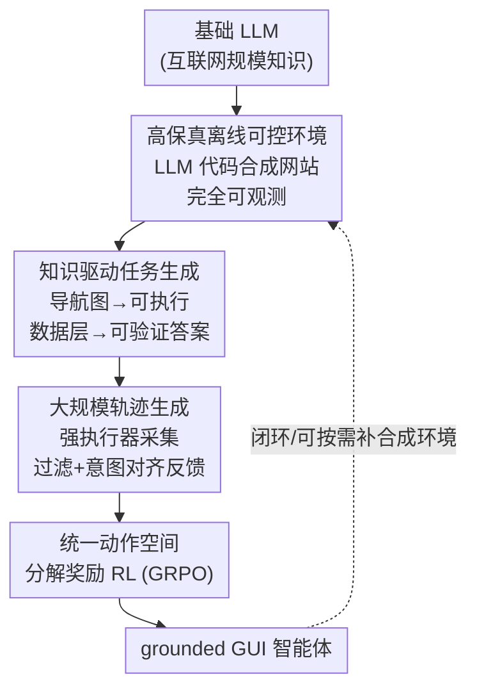

# WebFactory: Automated Compression of Foundational Language Intelligence into Grounded Web Agents

**会议**: ICLR 2026  
**OpenReview**: [https://openreview.net/forum?id=HaIEP2PD4S](https://openreview.net/forum?id=HaIEP2PD4S)  
**代码**: 论文称已开源全套工具链（环境 / 任务生成器 / 训练 / 评测），未在正文给出仓库地址 ⚠️ 以原文为准  
**领域**: Agent / 强化学习 / GUI 智能体  
**关键词**: GUI Agent, Web Agent, 离线环境合成, 知识驱动任务生成, GRPO 强化学习

## 一句话总结
WebFactory 把"训练 GUI 智能体"重新定义为"把 LLM 里压缩的互联网知识蒸馏成可落地动作"的问题，用一条全自动闭环流水线——LLM 合成高保真离线网站 → 知识驱动生成可验证任务 → 强 LLM 采集轨迹 → 分解奖励的 RL 训练——仅用 10 个合成网站训练出的 3B 智能体，就达到了用同等规模人工标注数据训练的智能体水平，并能迁移到 Amazon/Airbnb/Booking 等真实网站。

## 研究背景与动机

**领域现状**：训练 GUI/Web 智能体目前有两条主流路线。一条是在真实在线网页上让智能体探索学习（live web），另一条是靠人工标注大量交互轨迹、人工搭建高保真环境。两者都把"数据量"当成核心瓶颈来攻。

**现有痛点**：这两条路各有死穴。真实在线网页虽然规模无限，但充满非确定性（同一动作每次结果都可能不同）、安全风险（误操作真实账户/支付）和噪声，导致研究无法复现。人工路线则反过来——标注上千条轨迹成本极高且带偏见，手工复刻一个高保真网站环境往往要专家干上几周，根本扩展不动。

**核心矛盾**：可扩展性（scalability）与可控性（control）之间存在根本 trade-off，在线网页有规模没控制、人工方案有控制没规模，没有一条路能同时给出"既大规模又可复现"的训练信号。

**本文目标**：作者主张换一个视角——真正的瓶颈不是数据量，而是**把 LLM 潜在知识压缩成可执行动作的效率**（intelligence compression efficiency）。于是目标分解为：(1) 造一个既高保真又完全可控可复现的环境；(2) 在里面自动生成保证可执行、可验证的任务；(3) 自动采集高质量轨迹并训练；(4) 全程无需人工。

**切入角度**：不要把 LLM 当成"被微调的零件"，而是把它当成"为自己造身体的建筑师"——让 LLM 通过代码生成来合成网站、合成任务、采集轨迹。因为环境是 LLM 自己造的离线副本，它对环境**完全可观测**，这就把传统不可靠的任务生成变成了确定性过程。

**核心 idea**：用一座"智能压缩工厂"（Intelligence Compression Factory），把 LLM 里描述性的互联网知识，端到端地压缩成扎根于 GUI 的可执行行为。

## 方法详解

### 整体框架
WebFactory 是一条全自动、闭环、可脚本化的强化学习流水线，输入是一个基础 LLM（携带互联网规模的描述性知识），输出是一个能在真实网页上点击/输入/检索的 grounded GUI 智能体。整条线分四个阶段串行运转，且全部发生在 LLM 合成的离线网站里，从而绕开了真实网页的非确定性与安全风险。

第一步，用 LLM 代码生成造出一批高保真、完全可观测的离线网站；第二步，利用对环境的完全可观测性，抽取每个网站的"知识规格"（导航图 + 页面语义 + 标准交互流），据此自动合成保证可执行、带唯一标准答案的任务；第三步，用一个强 LLM 执行器（OpenAI 的 computer-use-preview）在离线环境里跑这些任务采集轨迹，并经过滤与"行为意图对齐反馈"清洗；第四步，把清洗后的轨迹喂给 GRPO 类 RL，在统一动作空间下用"分解奖励"优化学生策略。最后用基于关键节点对齐的脚本化评测验收，全程无需人工评审。

### 关键设计

**1. 高保真离线可控 Web 环境：让"造数据"既安全又可复现**

这一步针对的是"在线网页不可控、人工搭环境太贵"这个核心矛盾。作者不去爬真实网页，而是用 LLM 辅助的合成流水线，自动生成包含布局、工作流、内容的逼真网站，低成本快速扩张训练域。环境刻意消除了一切部署障碍：网站启动即进入预认证会话、带种子用户资料（绕过登录/MFA），关闭 CAPTCHA 和反爬检测（隔离出智能体本身的能力），所有内容都版本化在静态数据集（如 `Data.js`）里以保证逐位可复现；同时开放前端代码、数据库和交互逻辑的完全访问权。作者精选了覆盖电商、信息检索、出行规划、招聘、通信、企业服务等 6 大类活动的 **10 个网站家族**，UI 形态从简单表单到拖拽界面、悬停菜单都有。任务难度还能沿三个维度调节：数据复杂度（目录规模/网络密度）、UI 复杂度（多级导航/拖拽/悬停）、流程深度（单步查询 → 多步执行）。它的价值在于：因为环境是自己造的、完全可观测，下游的任务生成和奖励计算才有可能做到"确定性"。

**2. 知识驱动的任务生成：用完全可观测性保证任务"可执行且可验证"**

传统任务生成最容易踩的坑是生成出引用了不存在页面、查询无答案、动作无法执行的"废任务"。作者利用离线环境的完全可观测性，为每个网站抽取机器可读的知识规格：(i) 带合法页面跳转的导航图，(ii) 页面级语义与可供性（affordance），(iii) 标准交互流（如 browse → detail → cart）。基于这套知识生成两类互补任务：**操作类任务**（operation，如"把 256GB 的 iPhone 17 加入购物车"）通过遍历导航图合成，确保每条流程在真实站点上都可执行；**信息检索类任务**（retrieval，如"Cafe A 周末营业到几点"）的答案直接取自可观测的数据层，生成前先验证答案存在、并算出检索所需的精确导航路径，从而得到无歧义的标准答案（schema 见原文 Listing 1，含 `goal`/`expected_answers`/`key_nodes` 字段）。这一设计把不可靠的任务生成变成了确定性过程，是后续可自动算奖励的前提。

**3. 大规模轨迹生成 + 行为意图对齐反馈：把"采数据"做成低成本流水线**

有了任务集，作者用强执行器（OpenAI 的 computer-use-preview）在离线环境里执行任务、采集轨迹，再用三道过滤剔除低质轨迹：(i) 状态重放检查（state-replay）、(ii) 关键节点覆盖（key-node coverage）、(iii) 检索任务的答案校验。此外，网站暴露的辅助知识既能给执行器当提示、又能做额外一致性检查，同时提升准确率和产出率。针对信息检索任务，作者还引入一种"行为意图对齐反馈"（behavioral intent alignment feedback）进一步增强检索质量。其效果很直接（见 Table 2）：开启知识驱动后轨迹成功率从 42.6% 提到 84.3%、平均步数从 15.7 降到 9.8、有效数据占比从 58.3% 升到 89.6%——既更准又更短，得到一批可直接用于 SFT / 离线 RL / 混合训练的高质量语料。

**4. 统一动作空间 + 分解奖励的 RL：把多维正确性拆成可优化的细粒度信号**

训练基于 GUI-R1 框架并扩展以支持网页检索任务。作者把每个动作建模为统一三元组 $a_t = \{a^{act}_t, a^{point}_t, a^{text}_t\}$，其中动作类型 $a^{act}_t \in \{\text{click, double\_click, type, scroll, keypress, drag, get\_final\_answer}\}$，坐标 $a^{point}_t=[x,y]$（拖拽为两点），文本 $a^{text}_t$ 装输入内容或方向参数；特别新增了 `get_final_answer` 动作来处理数据获取类任务。单步奖励是格式奖励与准确率奖励的加权 $R_t = \alpha R_f + \beta R_{accuracy}$。关键在**分解奖励**用了分层校验——动作类型不对直接 0 分，类型对了才评估该类型专属的参数：

$$R_{acc} = \begin{cases} 0, & a_{type} \neq gt_{type} \\ \mathbb{I}[a_{coord}\in gt_{bbox}], & a_{type}=\text{click} \\ \mathbb{I}[F1(a_{text}, gt_{text})\geq\tau], & a_{type}\in\{\text{type, scroll}\} \\ \max_{r\in R}\mathbb{I}[F1(a_{text}, r)\geq\tau], & a_{type}=\text{get\_answer} \\ \mathbb{I}[\lVert a_{drag}-gt_{drag}\rVert_2\leq\epsilon], & a_{type}=\text{drag} \end{cases}$$

其中 $\tau=0.5$ 是 F1 阈值，检索任务用归一化（大小写/标点/格式无关）的 F1 对一组等价答案 $R=\{r_1,...,r_K\}$ 取最大匹配，以此稳定优化、提升鲁棒性。格式奖励 $R_f$ 则校验 JSON 结构是否合法、动作类型是否合规、参数类型是否正确、条件约束是否满足（如 type 动作必须带文本）。这种"点击看坐标命不命中框、输入/检索看 F1、拖拽看坐标距离"的细粒度分解，比一个稀疏的成功/失败标量提供了远更稠密、更稳定的学习信号。

### 一个完整示例
以检索任务 `task_retrieval_017`（站点 MealDash）为例走一遍闭环：任务目标是"搜索 Cafe A、打开详情页、告诉我周日营业时间（HH:MM 24 小时制）"。生成阶段先在数据层确认该答案存在（`expected_answers` 含 `11:00`/`11 am`/`opens at 11:00`），并算好 `key_nodes = [search_box, results_list, cafe_detail_page]`。采集阶段强执行器跑出一条轨迹，经状态重放 + 关键节点覆盖 + 答案校验三道过滤通过。训练阶段，智能体最后发出 `get_final_answer` 动作输出"11:00"，奖励函数对一组等价答案取最大 F1，$F1\geq0.5$ 即判正确并给正奖励；过程中每一步点击若落在目标 bbox 内、动作类型匹配，也各自累加细粒度奖励。整条任务无需任何人工评审即可自动算分。

### 损失函数 / 训练策略
采用 GRPO 及相关 RL 算法，在统一动作空间下优化策略 $\pi_\theta$ 以最大化 $J(\theta)$；生成轨迹填充重放缓冲 $(s_t, a_t, R_t, s_{t+1})$。奖励为格式奖励与分解准确率奖励的加权和（公式 2、3），$\alpha,\beta$ 为权重系数，检索答案用归一化 F1 评分。

## 实验关键数据

主干模型为 WebFactory-3B（基于 QwenVL2.5-3B），对照三个 baseline：未微调的 QwenVL2.5-3B、GPT-4o、以及用大规模人工标注数据训练的 GUI-R1-3B。评测覆盖内部离线基准（10 站点 100 任务）、离线→在线迁移（Amazon/Airbnb/Booking 各 30 任务）、公开基准（GUI-Act-Web / OmniAct-Desktop / GUI-Odyssey）。

### 主实验

内部离线基准（操作类 + 检索类），WebFactory-3B 仅用合成数据就追平甚至略超用人工数据训练的 GUI-R1-3B：

| 模型 | 操作类 TCR(%) | 操作类 Acc(%) | 检索类 TCR(%) | 检索类 F1 |
|------|------|------|------|------|
| QwenVL2.5-3B | 18.3 | 41.2 | 15.7 | 0.28 |
| GPT-4o | 26.7 | 48.6 | 22.3 | 0.35 |
| GUI-R1-3B（人工数据） | 68.2 | 85.3 | 64.6 | 0.76 |
| **WebFactory-3B（合成数据）** | **71.8** | **87.6** | **67.3** | **0.79** |

离线→在线迁移，WebFactory-3B 的泛化优势被进一步放大，平均 TCR 53.4% 相比 QwenVL2.5-3B（20.4%）提升 162%、相比 GUI-R1-3B（37.0%）提升 44%：

| 模型 | Amazon TCR(%) | Airbnb TCR(%) | Booking TCR(%) | 平均 TCR(%) |
|------|------|------|------|------|
| QwenVL2.5-3B | 22.3 | 18.7 | 20.1 | 20.4 |
| GPT-4o | 41.2 | 37.8 | 39.6 | 39.5 |
| GUI-R1-3B | 38.6 | 35.2 | 37.1 | 37.0 |
| **WebFactory-3B** | **55.7** | **51.2** | **53.3** | **53.4** |

### 消融实验

任务生成质量消融最能说明"知识 + 数据"双驱动的价值（Exe.=可执行率，Val.=有效率，Div.=多样性，Cmplx.=复杂任务占比）：

| 配置 | Exe.(%) | Val.(%) | Div. | Cmplx.(%) |
|------|------|------|------|------|
| 无知识/无数据 | 31.3 | 42.3 | 0.31 | 8.2 |
| 仅数据驱动 | 56.3 | 68.7 | 0.52 | 15.6 |
| 仅知识驱动 | 62.5 | 71.2 | 0.64 | 22.3 |
| **知识 + 数据** | **86.3** | **92.6** | **0.84** | **35.7** |

轨迹数据质量消融（SR=成功率，Steps=平均步数，VD=有效数据占比）：

| 指标 | 无知识 | 有知识 |
|------|------|------|
| SR(%) | 42.6 | 84.3 |
| Steps | 15.7 | 9.8 |
| VD(%) | 58.3 | 89.6 |

### 关键发现
- **知识驱动是核心增益来源**：可执行率从 31.3% 飙到 86.3%，复杂任务占比提升 4.4 倍；轨迹成功率几乎翻倍（42.6%→84.3%）的同时步数还降了 38%，说明完全可观测性既提质又提效。
- **合成数据可平替人工数据**：仅用 10 个合成网站训练，就在内部基准上追平用大规模人工数据的 GUI-R1-3B，且在跨域的 GUI-Odyssey 上 Type 准确率 66.0% 大幅超过 GUI-R1-3B 的 54.8%——合成数据的泛化反而更强。
- **基础模型决定"具身上限"**：用 GPT-5 / Claude Opus 4.1 / Claude Sonnet 4 驱动同一条流水线，GPT-5 整体最强、Claude Sonnet 4 波动最大，说明不同 LLM 的"具身潜力（embodiment potential）"差异显著，可作为评估模型的新维度。

## 亮点与洞察
- **把训练问题重新框定为"压缩效率"而非"数据量"**：这是全文最"啊哈"的地方——传统 agent scaling law 盯着数据量，作者提出渐近性能更可能由基础模型的"智能压缩效率 + 具身潜力"决定，给模型评估开了一条新坐标轴。
- **"LLM 当建筑师"的闭环很巧**：让 LLM 用代码生成造出自己的离线训练环境，天然获得完全可观测性，从而把"任务可执行/可验证"从概率问题变成确定性问题——这个"自己造身体"的视角可迁移到具身机器人等需要安全可复现环境的场景。
- **分解奖励是可复用的 trick**：把"动作正确"拆成类型→坐标/文本/拖拽的分层判定，比稀疏成功信号稠密得多，任何多字段结构化动作空间的 RL（如工具调用、表单填写）都能借鉴。

## 局限与展望
- 作者承认未对奖励机制做穷尽消融，分解奖励 vs 更稀疏奖励 vs LLM 生成奖励的对比留作未来工作。
- 流水线在根本不同的 GUI 范式（游戏引擎、专业创意软件）上的表现尚未系统验证。
- 自己观察：内部离线基准与在线迁移基准都是作者自建、规模偏小（离线 100 任务、在线每站 30 任务），"追平人工数据"的结论强依赖于这些自建评测；且训练用的强执行器 computer-use-preview 本身很强，蒸馏增益里有多少来自"环境/任务设计"、多少来自"教师够强"未完全拆清。
- 改进思路：把流水线的可编程性用于"定向能力进化"——系统化探测智能体弱点（如精细连续交互、复杂逻辑），再按需合成专门网站环境来补短板，形成自纠错引擎。

## 相关工作与启发
- **vs GUI-R1**: 本文直接在 GUI-R1 的 RL 框架上扩展，新增 `get_final_answer` 动作和检索奖励以支持信息获取任务；更关键的区别是 GUI-R1 靠大规模人工标注数据，而 WebFactory 全程用 LLM 合成的环境与任务，证明合成数据能平替人工数据。
- **vs 在线网页训练（如 live web RL）**: 它们有规模但牺牲可控性，面临非确定性、安全、噪声三重障碍；本文用高保真离线副本换取严格可复现与完全可观测，再靠离线→在线迁移实验证明不丢泛化。
- **vs 人工搭环境/标注路线（如 Mind2Web 类）**: 它们环境保真但搭建标注成本以"周"计且难扩展；本文用 LLM 代码生成把造网站成本压到近乎零，并能沿数据/UI/流程三维度灵活调难度。

## 评分
- 新颖性: ⭐⭐⭐⭐⭐ "智能压缩工厂 + LLM 当自身环境建筑师 + 具身潜力作为模型评估新轴"是一套自洽且新鲜的范式。
- 实验充分度: ⭐⭐⭐⭐ 覆盖任务生成/轨迹/内部/迁移/公开基准 + 多基础模型分析，但核心结论依赖自建小规模基准、奖励消融缺位。
- 写作质量: ⭐⭐⭐⭐⭐ 动机推导清晰，流水线五阶段叙述完整，公式与 schema 给得到位。
- 价值: ⭐⭐⭐⭐⭐ 开源全套环境/生成器/训练/评测工具链，为可复现的 Web agent 研究提供了低成本可扩展的基础设施。

<!-- RELATED:START -->

## 相关论文

- [\[ICLR 2026\] Social Agents: Collective Intelligence Improves LLM Predictions](social_agents_collective_intelligence_improves_llm_predictions.md)
- [\[CVPR 2026\] Ego2Web: A Web Agent Benchmark Grounded in Egocentric Videos](../../CVPR2026/llm_agent/ego2web_a_web_agent_benchmark_grounded_in_egocentric_videos.md)
- [\[ICLR 2026\] Web-CogReasoner: Towards Multimodal Knowledge-Induced Cognitive Reasoning for Web Agents](web-cogreasoner_towards_multimodal_knowledge-induced_cognitive_reasoning_for_web.md)
- [\[ICLR 2026\] Orak: A Foundational Benchmark for Training and Evaluating LLM Agents on Diverse Video Games](orak_a_foundational_benchmark_for_training_and_evaluating_llm_agents_on_diverse_.md)
- [\[ICLR 2026\] WALT: Web Agents that Learn Tools](walt_web_agents_that_learn_tools.md)

<!-- RELATED:END -->
