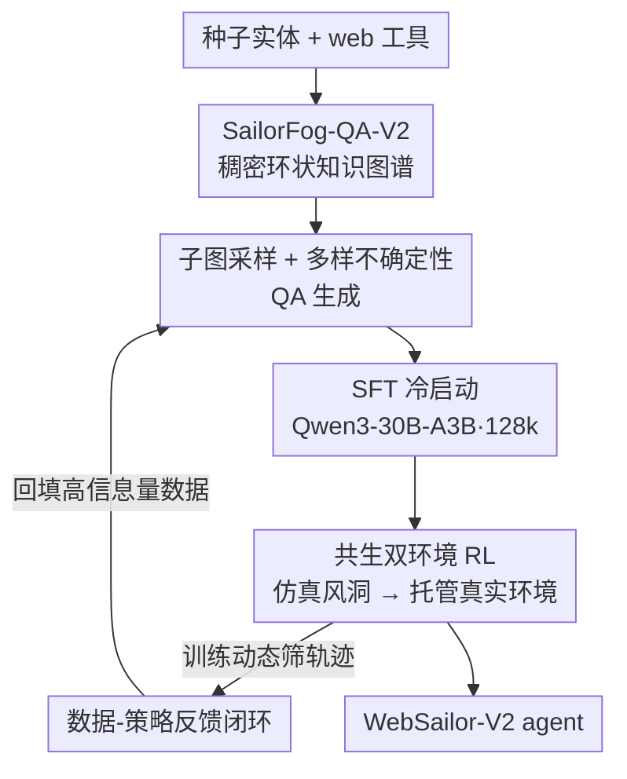

# WebSailor-V2: Bridging the Chasm to Proprietary Agents via Synthetic Data and Scalable Reinforcement Learning

**会议**: ICLR 2026  
**论文**: Published as a conference paper at ICLR 2026  
**代码**: 无（论文未给出明确链接，⚠️ 以原文为准）  
**领域**: Agent / LLM 推理 / 合成数据 / 强化学习  
**关键词**: Web Agent, Deep Research, 知识图谱合成数据, 双环境 RL, GRPO

## 一句话总结
WebSailor-V2 用一条「稠密环状知识图谱造数据 + 仿真/真实双环境 RL」的完整后训练管线，把一个只有 30B（激活 3B）的 MoE web agent 训到 BrowseComp-EN 35.3、HLE 30.6，反超 671B 的 DeepSeek-V3.1，把开源 deep research agent 拉到逼近闭源系统的水平。

## 研究背景与动机
**领域现状**：自主 web agent（"Deep Research" 范式）靠 search / browse / 代码执行等工具，把复杂的多步研究任务拆成"思考—行动—观察"的循环来做。社区已经从数据和训练两端发力，但开源方案和闭源系统（如 OpenAI DeepResearch）之间始终隔着一道明显的鸿沟。

**现有痛点**：作者把鸿沟归到两个最关键的阶段。其一，**数据侧不确定性太单一**——现有合成数据多用"由易到难"的迭代扩展，从一个种子问题逐步长出图，结果几乎都是树状/无环结构，且引入的不确定性主要是"混淆"（obfuscation）这一种。模型见不到带环依赖、反馈回路的复杂逻辑，就很难泛化到真实研究里那种盘根错节的信息。其二，**训练侧缺可扩展的 RL 环境**——agentic RL 一次 rollout 要打大量工具调用，直接打真实 web API 会撞上高成本、低 QPS、超时失败、返回不一致，这些噪声会污染训练数据、让学到的策略退化，算法迭代根本跑不快。

**核心矛盾**：真实环境的随机性和 RL 算法迭代所需的稳定性之间存在 trade-off——你越想用真实 web 训出能落地的策略，就越被它的波动性拖垮；想稳定迭代算法，又怕仿真和真实环境对不上。

**本文目标**：（1）造一套逻辑结构足够丰富、不确定性足够多样的合成数据；（2）搭一个既能高频稳定迭代、又能最终落到真实 web 的 RL 训练环境。

**切入角度**：把信息检索问题本质看成"在实体关系网里导航"，于是数据侧从图论入手——主动造稠密环状图、采样需要走"割点/桥"的子图，逼 agent 学会抽象的图搜索模式；训练侧借鉴机器人领域的 sim-to-real，用高保真仿真器当"风洞"先把算法调稳，再切真实环境。

**核心 idea**：用**拓扑数据合成**解决推理多样性，用**共生双环境 + 数据-策略反馈闭环**解决 RL 稳定性，两条线整合成一条完整后训练管线。

## 方法详解

### 整体框架
WebSailor-V2 是一条端到端后训练管线，建立在最朴素的 ReAct 框架上（作者刻意不上复杂多 agent 结构，遵循 "The Bitter Lesson"，相信可扩展计算最终胜过精雕细琢的人工设计）。动作空间只有 search / visit / Google Scholar / Python 解释器 + final answer 五个工具。整条管线分四步：先用 SailorFog-QA-V2 生成器造出稠密环状知识图谱并采样子图、生成带多样不确定性的 QA；再用拒绝采样得到的高质量轨迹做 **SFT 冷启动**（基座 Qwen3-30B-A3B-Thinking，上下文扩到 128k），给 RL 一个足够强的初始策略；然后进入**共生双环境 RL**——先在离线 Wikipedia 仿真器里高频调超参/做 reward shaping，再把验证好的配置搬到统一工具接口托管的真实环境跑最终训练；整个过程被一个**数据-策略反馈闭环**串起来，根据训练动态自动合成并筛选最有信息量的轨迹。

### 关键设计

**1. SailorFog-QA-V2：用稠密环状知识图谱代替树状扩展**

针对"现有合成数据几乎都是树状/无环、逻辑结构太单一"这个痛点，V2 仍从种子实体出发、用 web 工具发现相关实体并抽取信息，但在图扩展阶段**主动制造稠密连接、刻意构造环状结构**——结果不是一棵越长越大的树，而是一张充分互联的网，更贴近真实知识里那种环依赖、反馈回路、复杂互依的非线性结构。同时它保留更完整的过程信息（具体搜索 query、来源 URL），并为每个实体计算存储统计特征，供后续 QA 生成造更刁钻的题。最终数据集 3 万+ 条指令对，底层图平均约 30 节点、平均度 2.5。之所以管用：只有当训练数据覆盖了足够广、足够复杂的逻辑结构，模型才学得到能泛化到新问题的抽象搜索能力，而不是停在简单关键词检索。

**2. 子图抽取 + 多样化不确定性的 QA 生成**

图变稠密后，旧版那种"枚举所有固定边数子结构"的随机采样会组合爆炸、算不动，所以 V2 改用**随机游走采样**子图，并用 Weisfeiler-Leman 算法验证子图非同构，从而高效覆盖从简单链到复杂环、稠密簇的全谱结构而不必暴力搜索。生成 QA 时不把子图整个喂给 LLM，而是先分析拓扑里有多少非同构节点（占据不同结构角色的 orbit 节点），让题目焦点均匀分布到各类节点上。最关键的是它把不确定性从单一的"混淆"扩成三类：（1）**语义歧义**——刻意把关键实体/日期写得欠明确（如"推广了这个结果的数学家"而非具体姓名），逼 agent 靠图结构上下文消歧而非关键词匹配；（2）**干扰噪声**——注入貌似合理但事实错误的干扰项（如同作者另一篇论文的年份），逼 agent 主动交叉验证、检测矛盾；（3）**结构约束**——通过非同构节点分析找出桥/割点这类关键路径，专门出"必须走这些割边"的题，逼 agent 做全局图探索而不是局部贪心搜索。这三类不确定性正好对应真实研究里那些需要高阶推理的场景。

**3. 共生双环境 RL：仿真"风洞" + 托管真实环境的 sim-to-real**

针对"真实 web API 波动会污染训练、淹没算法信号"这个核心矛盾，作者把训练解耦成两个环境。**仿真环境**基于离线 Wikipedia 库从零搭建，配套一套仿真 web 工具，并把 SailorFog-QA-V2 生成管线改造到这个离线语料上，造出与仿真能力完全对齐的训练/测试集——它低成本、极快、完全可控可观测。关键定位是把它当算法"风洞"而非真实 web 的内容复制品：作者内部验证仿真器和真实环境在 Reward、Pass@1 趋势上高度相关，凡是能在仿真里稳住学习的算法改动，搬到真实环境同样稳。于是采取**分阶段训练**——在仿真里高频做超参调优和 reward shaping 验证，再把验证好的配置拿到真实环境跑最终的生产训练。**真实环境**侧的工程挑战（工具扩展后返回一致性、轨迹采样可复现、高并发与容错）则靠一个**统一工具执行接口**化解：调度管理层做 QPS 限制、结果缓存、超时重试、非关键失败降级、无缝切换备用数据源，把工具调用抽象成对 agent 而言确定且稳定的接口，把训练循环和真实世界的随机性隔离开。

**4. 稳定化 RL 算法 + 数据-策略反馈闭环**

RL 算法是 GRPO 的定制改造，优势用组内 leave-one-out 估计以降方差：

$$\hat{A}_{i,t} = R_i - \text{mean}(\{R_i\}_{i=1}^{G})$$

目标函数对每条轨迹做 token 级策略梯度，并用带 clip 的重要性采样比 $r_{i,t}(\theta)=\pi_\theta(o_{i,t}\mid \text{context})/\pi_{\theta_{old}}(o_{i,t}\mid \text{context})$ 控制更新幅度。训练严格 on-policy，轨迹始终由最新策略采样。一个关键经验是**负样本要保守处理**：未经筛选的负轨迹会让训练在长训后出现"格式崩溃"，所以对"超长度但没给出最终答案"的轨迹**屏蔽 loss**（信号模糊），而对"显式格式错误/非法工具调用"的轨迹**给负奖励**（让模型主动学着避免），既防崩溃又保稳定；为效率不做动态采样，改用更大 batch/group 维持小方差。更上层是**数据-策略反馈闭环**：全自动的数据合成+筛选管线根据实时训练动态动态调整训练集，持续把最有信息量的轨迹喂给模型。作者特别指出，算法重要但不是唯一决定因素——数据质量和环境稳定性往往更关键；他们实验过直接拿 BrowseComp 测试集训练，效果反而明显更差，因为人工标注数据天然更噪、规模又小，难以逼近一个可学习的底层分布，而合成数据分布更一致、更适合定向打磨。

### 损失函数 / 训练策略
SFT 冷启动用 SailorFog-QA-V2 生成器产出的纯合成轨迹（高性能开源模型解题 + 拒绝采样保质量），给 RL 提供足够强的初始策略——因为这类开放任务奖励稀疏，没有好的初始策略，agent 几乎完不成任务、拿不到正反馈。RL 阶段用上述定制 GRPO，token 级损失 + leave-one-out 优势 + 负样本差异化处理（屏蔽 vs 负奖励）。训练数据混合 SailorFog-QA（打底 web 导航）、SailorFog-QA-V2（复杂推理与纠错）和 IterBench（强化数学与学术推理，针对 HLE）。

## 实验关键数据

### 主实验
基座 Qwen3-30B-A3B-2507，在六个高难基准上评测，默认报告 pass@1（temperature 0.85 / top-p 0.95，LLM-as-judge）。

| Backbone | BrowseComp-EN | BrowseComp-ZH | xbench-DeepSearch | GAIA | HLE |
|----------|------|------|------|------|------|
| OpenAI DeepResearch‡ | 51.5 | 42.9 | - | 67.4 | 26.6 |
| OpenAI-o3 | 49.7 | 58.1 | 66.7 | 70.5 | 20.2 |
| DeepSeek-V3.1-671B‡ | 30.0 | 49.2 | 71.2 | 63.1 | 29.8 |
| GLM-4.5-355B‡ | 26.4 | 37.5 | 70.0 | 66.0 | 21.2 |
| WebSailor-72B | 12.0 | 30.1 | 55.0 | 55.4 | - |
| **WebSailor-V2-30B-A3B (SFT)** | 24.4 | 28.3 | 61.7 | 66.0 | 23.9 |
| **WebSailor-V2-30B-A3B (RL)** | **35.3** | **44.1** | **73.7** | **74.1** | **30.6** |

仅 30B（激活 3B）的 MoE agent，在 BrowseComp-EN / xbench / GAIA / HLE 上全面领先所有开源 agent，并反超 671B 的 DeepSeek-V3.1（35.3 vs 30.0 EN、30.6 vs 29.8 HLE），xbench/GAIA 甚至超过最强闭源系统。HLE 上 30.6 创下新 SOTA，超过更大的 DeepSeek-V3.1 和 OpenAI-o3，印证"强检索+综合能力能反过来增强逻辑推理"。

### 消融实验

| 配置 / 对照 | 关键指标 | 说明 |
|------|---------|------|
| SFT only | EN 24.4 / HLE 23.9 | 仅冷启动已超不少全量训练的开源 agent，是 RL 的必要前提 |
| + RL（完整） | EN 35.3 / HLE 30.6 | RL 在难任务上 pass@1、pass@3 同升，真正扩展能力上界 |
| 用 BrowseComp 测试集直接训练 | 明显更差 | 人工数据噪声大、规模小，分布难学；合成数据分布更一致 |
| 真实环境无统一接口 | 训练不稳/数据污染 | 统一工具接口把随机性隔离，reward 才能稳定上升（RQ2） |

### 关键发现
- **SFT 冷启动不可省**：开放任务奖励稀疏，没有强初始策略 agent 几乎探索不出成功轨迹；SFT 把策略垫到足够强，RL 才有稠密反馈可收敛。
- **RL 在难/易任务上作用不同**：BrowseComp 这类难题 pass@1 与 pass@3 同步上升（RL 扩展根本能力）；xbench/GAIA 这类相对简单的任务则主要是 pass@1 大涨、pass@3 几乎不变（RL 主要提升采样效率，让首答更可靠）。
- **数据与环境稳定性 > 算法本身**：作者试过大量算法和 trick，结论是数据质量和环境稳定性才是 agentic RL 能否 work 的更关键因素。
- **Deep Research 对比**：在 DeepResearch Bench 上拿 47.7，仅次于 Gemini-2.5-pro-DeepResearch（49.7），差距主要在报告"文风润色"层面而非检索推理能力。

## 亮点与洞察
- **把数据多样性问题转成图拓扑问题**：用"是否要走割点/桥、是否有环依赖"来定义推理难度，比"由易到难"的模糊扩展更可控，也更逼出抽象搜索能力——这个视角可迁移到任何需要造结构化推理数据的场景。
- **"风洞"式 sim-to-real**：不要求仿真器内容上等同真实 web，只要训练动态（Reward / Pass@1 趋势）高度相关就够了——把仿真定位成"调算法稳定性的工具"而非"真实环境替身"，是个很务实且省钱的工程选择。
- **负样本差异化处理**：超长无答案的轨迹屏蔽 loss、格式非法的轨迹给负奖励，这个区分直接治住了长训"格式崩溃"，是 agentic RL 很实用的稳定化 trick。
- **30B 反超 671B**：用强 agentic 能力"补"参数量不足，给"小模型 + 强工具/检索"路线提供了有力证据。

## 局限与展望
- 作者承认在 DeepResearch Bench 上输给 Gemini 主要是报告"呈现层"打磨不足，说明当前训练偏检索推理、轻最终报告生成。
- 整套管线工程复杂度高（仿真器、统一工具接口、自动数据闭环），复现门槛不低；论文未给出明确开源链接（⚠️ 以原文为准）。
- 与闭源系统的横向比较多为"manually evaluated through websites"，评测条件不完全一致，结论需谨慎看待；不同基准难度不同，分数不可直接横比大小。
- pass@3 在极难任务上可能仍不足以反映模型增强后的真实能力上界，作者自己也指出这点。

## 相关工作与启发
- **vs SailorFog-QA / WebSailor（前作）**：前作图扩展偏树状、不确定性主要靠 obfuscation；V2 造稠密环状图、引入语义歧义/干扰噪声/结构约束三类不确定性，并把基座换成 Qwen3-30B-A3B-Thinking、上下文扩到 128k。
- **vs 由易到难的数据扩展（Gao et al., Tao et al. 等）**：它们迭代扩展易得树状无环结构；本文主动造环、采样割点子图，逼模型学全局图搜索。
- **vs 直接在真实环境做 agentic RL**：真实 API 波动会污染训练；本文用仿真风洞 + 统一工具接口把随机性隔离，先稳算法再落真实环境。

## 评分
- 新颖性: ⭐⭐⭐⭐⭐ 把数据多样性问题化为图拓扑问题、双环境 sim-to-real 都是 web agent 后训练里少见的清晰切入。
- 实验充分度: ⭐⭐⭐⭐⭐ 六大基准 + 与众多开源/闭源 agent 对比 + 训练动态与上下文 scaling 分析，证据链完整。
- 写作质量: ⭐⭐⭐⭐ 动机—方法—实验逻辑清楚，部分工程细节（仿真器构造、数据闭环）偏概述。
- 价值: ⭐⭐⭐⭐⭐ 30B 反超 671B、逼近闭源，对开源 deep research agent 的落地路线有很强参考价值。

<!-- RELATED:START -->

## 相关论文

- [\[ICLR 2026\] Repurposing Synthetic Data for Fine-grained Search Agent Supervision](repurposing_synthetic_data_for_fine-grained_search_agent_supervision.md)
- [\[ICLR 2026\] MobileRL: Online Agentic Reinforcement Learning for Mobile GUI Agents](mobilerl_online_agentic_reinforcement_learning_for_mobile_gui_agents.md)
- [\[ICLR 2026\] Language Agents for Hypothesis-driven Clinical Decision Making with Reinforcement Learning](language_agents_for_hypothesis-driven_clinical_decision_making_with_reinforcemen.md)
- [\[ICLR 2026\] AlphaAgentEvo: Evolution-Oriented Alpha Mining via Self-Evolving Agentic Reinforcement Learning](alphaagentevo_evolution-oriented_alpha_mining_via_self-evolving_agentic_reinforc.md)
- [\[ICLR 2026\] WebSeer: Training Deeper Search Agents through Reinforcement Learning with Self-Reflection](webseer_training_deeper_search_agents_through_reinforcement_learning_with_self-r.md)

<!-- RELATED:END -->
