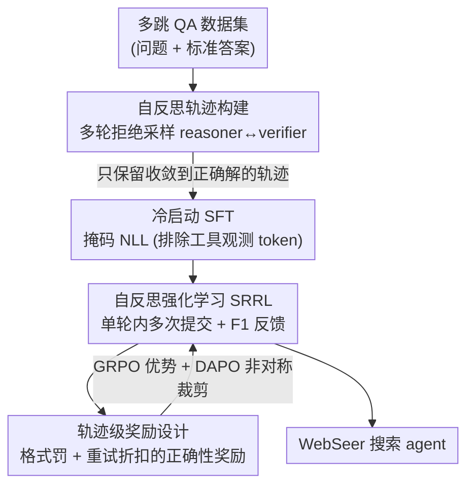

# WebSeer: Training Deeper Search Agents through Reinforcement Learning with Self-Reflection

**会议**: ICLR 2026  
**OpenReview**: [https://openreview.net/forum?id=YCXWIfVakj](https://openreview.net/forum?id=YCXWIfVakj)  
**代码**: https://github.com/（论文称 Github/WebSeer，具体链接以原文为准）  
**领域**: Agent / 工具使用 / 强化学习  
**关键词**: 搜索 agent, 自反思, 多轮检索, RL, 拒绝采样

## 一句话总结
WebSeer 用「拒绝采样造带反思轨迹的冷启动数据 + 允许单轮内多次提交答案的自反思强化学习（SRRL）」两阶段训练一个 14B 搜索 agent，让模型学会主动延长工具调用链、在不确定时回溯改写查询，在 HotpotQA / SimpleQA 上分别打到 72.3% / 90.0% 的 SOTA。

## 研究背景与动机

**领域现状**：用 LLM 做开放域多跳问答，主流是 agentic RAG——让模型自己决定何时调用搜索、读网页、跑代码等工具，沿着一条多步推理链边检索边推理。相比传统一次性检索的 RAG，它能自由浏览互联网、组合工具，处理更复杂的任务。

**现有痛点**：作者点出三个具体毛病。其一，**工具调用太少（Insufficient Search Calls）**：模型倾向于把手头已有的信息硬凑成一个看似合理的答案，而不是继续找证据，导致工具链很短、过早收敛。其二，**缺乏自发的自反思**：现有 agent 不会主动交叉验证、不会在拿不准时回退重写查询，一旦早期检索不全，后续生成就在残缺上下文上滚雪球，错误逐步累积。其三，**忽视真实 web 场景**：多数工作只在本地向量库里检索，没在开放的真实网页环境里训练。

**核心矛盾**：搜索深度（多调几次工具、多验证几轮）和模型的「早停偏好」之间存在张力——模型天然想尽快给答案，而高质量多跳推理恰恰需要它克制这种冲动、把链条拉长并自我纠错。普通 RL 只给最终答案对错的稀疏信号，不足以教会模型「错了要反思、要重试」。

**本文目标**：训练一个单模型搜索 agent，让它（1）愿意把工具链拉长、（2）会主动自反思与回溯、（3）能在真实 web 环境里稳定泛化。

**切入角度**：既然普通轨迹数据只示范了「一次答对」的成功路径、没教模型「答错怎么办」，那就专门构造**包含反思模式**的轨迹来冷启动；再在 RL 阶段把「允许多次提交答案」做进环境，让答案对错信号在单轮对话内反复回灌，显式奖励反思行为。

**核心 idea**：把 SFT 冷启动和 RL 统一在「自反思」范式下——用拒绝采样造带反思的长轨迹做冷启动，再用允许多次提交、按 F1 给奖励的自反思强化学习（SRRL）继续训，让模型学会「主动多调工具 + 不确定就回退重试」。

## 方法详解

### 整体框架

WebSeer 是一个**单模型**搜索 agent：所有决策、工具调用、答案验证都由同一个 14B 模型完成，不需要额外的 agent 控制器或更强的辅助模型。任务被形式化为一条工具增强的推理链——每一步模型先生成推理输出，再决定调用哪个工具，工具返回的 observation 拼回上下文，如此循环，直到模型不再调工具或调用特殊的 `answer_submit` 工具收尾；同时有最大步数 $T_{max}$ 防止无限链（推理时上限可达 50 步）。模型配三个互补工具：**搜索引擎**（关键词→Google 搜索→返回标题/URL/摘要）、**网页阅读器**（给定 URL+问题，让同一个模型读 HTML 并摘要式作答，绕开超长原始 HTML）、**代码执行器**（跑 Python 做精确计算）。

训练分两阶段，统一在自反思范式下：

### 关键设计

**1. 多轮拒绝采样构建自反思轨迹：让冷启动数据里带「答错→反思→纠正」的示范**

现有冷启动轨迹只有「一次答对」的成功路径，模型从没见过「答错该怎么补救」，自然学不会反思。作者用两个角色（其实是**同一个模型、只换 prompt**）来造数据：reasoner $G$ 给定问题和历史生成工具增强的推理路径并提出答案 $\hat{y}^{(t)}_i$，verifier $V$ 调工具判断这个答案对不对、返回 judgment（CORRECT/INCORRECT）和一段可拼接的验证路径。关键是一个**有效性判据** $\Psi$：只有当「判 CORRECT 且答案确实等于真值」或「判 INCORRECT 且答案确实不等于真值」时 $\Psi=1$，即 verifier 的判断**和事实一致**才被采纳；否则在预算 $K$ 内重采 verifier，全失败就丢掉该样本。整个过程迭代到 $\hat{y}^{(t)}_i = y^*_i$ 且判 CORRECT 才记录这条完整轨迹 $T_i = \{P_1, R_1, \dots, P_t, R_t\}$，到 $n_{max}$ 仍没成功则不记。作者**不限制反思的具体形式**，只要最终收敛到正确解就保留，以保证轨迹多样性。这样造出的轨迹天然包含多轮答案精炼，工具链比常规对话数据长得多。

**2. 排除观测 token 的掩码 SFT：只学 agent 自己的推理，不学复述工具输出**

直接对整条轨迹做 NLL，会逼模型去「背诵」搜索返回的网页片段等外部观测，既无意义又不稳定。作者把工具观测子序列 $O \subset T$ 从损失里掩掉，目标为

$$L(x, T; \theta) = -\frac{\sum_{t=1}^{T} \mathbb{I}[y_t \notin O] \cdot \log p_\theta(y_t \mid x, y_{<t})}{\sum_{t=1}^{T} \mathbb{I}[y_t \notin O]}.$$

即只在「agent 自己的输出」（内部推理、工具调用决策）上算 loss，跳过工具返回的原始 observation。这让模型专注学「何时检索、怎么组织中间步骤」，而不是去记忆易变的外部文本，实证上对性能和鲁棒性都更好，也为后续 RL 提供稳定的起点、避免退化式探索。

**3. 自反思强化学习 SRRL：单轮对话内允许多次提交答案，把对错信号反复回灌**

普通 RL 一轮只让提交一次答案，反思无从发生。SRRL 的核心改动是**允许模型在一次对话里多次提交答案**：当动作是 `answer_submit` 时，把提交答案 $\hat{y}^{(t)}$ 与真值算 token 级 F1 奖励 $r(t) = \text{F1}(\hat{y}^{(t)}, y^*) \in [0,1]$，并把这个标量**以文本形式**回灌进对话（如「Incorrect! The F1 score is …」）；只要 $r(t)$ 低于阈值，环境就允许模型继续推理、稍后再提交改进答案（训练中最多可达 20 次提交尝试）。优化上用混合目标：沿用 GRPO 的组内相对优势估计 $\hat{A}_{i,t} = \frac{R(o_i) - \mu_{group}}{\sigma_{group} + \delta}$（每个 query 采 $G$ 条轨迹、用组内均值方差归一化），同时借 DAPO 的**非对称裁剪** $\epsilon_{low}, \epsilon_{high}$ 来适配奖励分布的偏斜，防止策略过拟合到少数高奖励噪声轨迹。这样把 SFT 学到的反思模式在 RL 里真正激活并强化。

**4. 轨迹级奖励：既要答得对，也要管住「答多久 / 重试多少次」**

只奖励答案正确会让模型要么输出冗长、要么反复无意义重试。作者设计轨迹级奖励 $R(\tau) = R_{format}(\tau) + R_{correct}(\tau)$。**格式项**对输出长度分段处理：长度 $|y|$ 在安全阈值 $L_{expect}$ 内不罚，在 $(L_{expect}, L_{max}]$ 区间按 $-\frac{|y| - L_{expect}}{L_{max} - L_{expect}}$ 线性惩罚，超过硬上限 $L_{max}$ 罚满 $-1$。**正确性项**用 $R_{correct}(\tau) = r \cdot \alpha^T$：$r$ 是任务分数（token 级 F1），$T$ 是提交尝试次数，$\alpha \in (0,1]$ 是指数折扣——重试越多次、奖励衰减越狠，从而在「允许反思重试」和「别滥用重试」之间给出明确的梯度信号。

### 损失函数 / 训练策略
SFT 用上面的掩码 NLL；RL 用 GRPO 优势 + DAPO 非对称裁剪的 PPO 式目标（公式 (1)），奖励为格式罚 + 重试折扣的 F1 正确性（公式 (3)-(5)）。训练基于 verl 框架，每步采 12 个 prompt、每个 prompt 8 条候选轨迹、最多 30 轮交互，共训 100 步、花约 480 个 A800 GPU 小时。训练阶段为降噪/控成本把检索限制在 Wikipedia（Google Site Search + 官方 Wikipedia API），而推理部署时用 Google Web Search API + Jina API 抓真实网页。⚠️ 部分超参（$K$、$n_{max}$、阈值、$\alpha$ 等具体取值）以原文为准。

## 实验关键数据

### 主实验
评测覆盖 NQ、TQ、HotpotQA、2Wiki、MuSiQue、Bamboogle、PopQA 等多跳 QA（每集 512 例，Bamboogle 125 例），用 LLM-as-a-Judge 评分，所有模型评测时只许提交一个答案。

| 方法 | 环境 | NQ | TQ | Hotpot | 2Wiki | 域内 Avg |
|------|------|----|----|--------|-------|---------|
| Search-r1 (14B) | Local RAG | 66.9 | 82.6 | 69.8 | 57.0 | 69.1 |
| DeepResearcher (7B) | Web Search | 61.9 | 85.0 | 64.3 | 66.6 | 69.5 |
| **WebSeer (14B)** | Local RAG | **81.9** | 86.7 | 70.9 | 76.0 | **78.9** |
| **WebSeer (14B)** | Web Search | **82.8** | **91.0** | **72.3** | **84.2** | **82.6** |

域内平均达 82.4%（原文表述），比此前 SOTA Search-r1 高 12.5 个点，NQ / 2Wiki 提升最大（+15.9 / +27.2）。在更难的三个 benchmark 上也领先：

| 模型 | FanoutQA | FRAMES | SimpleQA | Avg |
|------|----------|--------|----------|-----|
| Qwen2.5-14B | 45.5 | 52.7 | 85.7 | 61.3 |
| Search-r1-14B | 12.6 | 29.5 | 36.4 | 26.2 |
| **WebSeer** | **55.4** | **56.1** | **90.0** | **65.3** |

FanoutQA 55.4 几乎追平 GPT-4o（55.8）；尽管训练时只用站点受限检索，部署到开放 web 反而更强，说明学到的是可迁移的检索-推理策略而非过拟合。

### 消融实验

| 配置 | HotpotQA Acc | Tool Call | SimpleQA Acc | Tool Call | 说明 |
|------|-------------|-----------|-------------|-----------|------|
| SFT only | 68.75 | 13.43 | 76.17 | 10.82 | 仅冷启动 |
| w/ GRPO | 67.27 | 7.38 | 75.98 | 6.15 | 普通 RL（单次提交） |
| w/ SRRL (WebSeer) | **70.90** | 7.91 | **78.91** | 8.61 | 多次提交自反思 RL |
| SRRL w/o SFT | 0.00 | N/A | 0.00 | N/A | 无冷启动直接崩溃 |

### 关键发现
- **SRRL > 普通 GRPO**：把「单轮多次提交」做进 RL，HotpotQA / SimpleQA 比普通 GRPO 分别 +3.63 / +2.93，且工具调用数比纯 SFT 收敛得更合理。
- **冷启动是命门**：去掉 SFT 直接上 RL，14B 模型输出畸形 JSON、奖励一路下滑直接崩到 0%，无法产生合法工具调用——反思能力必须先靠冷启动数据装进去。
- **规模决定成败**：SFT 普遍把工具用量推上去，但只有 14B 在准确率上稳定受益（HotpotQA +5.86、SimpleQA +10.74）；3B/7B 在两个数据集上常掉点、RL 阶段还会出现重复文本和畸形输出导致工具调用失败。
- **工具用量呈「少→多→精」演化**：Pre-SFT 多数样本约 3 次调用（保守早停），Post-SFT 峰值移到 10 次、最长可到 50 次（过度使用），Post-RL 收敛到 5–8 次（策略性使用）。即便 RL 没惩罚「调太少」，模型也很少产出 <5 次调用的轨迹，说明重复工具使用被隐式强化（有助验证）。
- **SFT 数据配比关键**：单次答对轨迹 vs 多轮精炼轨迹的比例显著影响行为，长轨迹占比越高工具用得越多但不必然更准，需要折中（ratio=1.5 在 HotpotQA 上达 72.3）。

## 亮点与洞察
- **「答错该怎么办」被显式写进训练数据**：多数冷启动只示范成功路径，WebSeer 用拒绝采样专门保留含反思/纠错的轨迹，并用「判断须与事实一致」的 $\Psi$ 判据过滤 verifier 的噪声，这是教会模型自我纠错的关键一步。
- **把「多次提交答案」做成 RL 环境机制**：用一个 `answer_submit` 工具 + F1 文本反馈，就让反思在 RL 训练里真实发生，而不是寄希望于模型自发涌现——简单但抓住了要害。
- **重试指数折扣 $r \cdot \alpha^T$**：在「鼓励反思重试」和「别无脑刷工具」之间给了一个干净可调的旋钮，可迁移到任何允许多次尝试的 agent 训练。
- **训练用受限检索、部署用开放 web 反而更好**：站点受限训练降噪、稳定信号，学到的策略却能泛化到开放网页，提示「训练环境干净 + 策略可迁移」是一条划算的路线。

## 局限与展望
- **强依赖模型规模**：3B/7B 训不动甚至崩溃，方法的有效性目前绑定在 14B 量级，小模型上的可用性存疑。
- **训练成本不低**：480 A800 GPU 小时 + 多轮拒绝采样造数据，复现门槛较高。
- **奖励依赖 token 级 F1**：对答案表面形式多样的开放域 QA，F1 作为过程奖励可能有偏；评测虽用 LLM-as-a-Judge，但训练信号仍是 F1。
- **验证器与推理器同模型**：reasoner 和 verifier 共用同一模型，可能存在系统性盲区（自己验证不出自己的错误模式），$\Psi$ 判据靠真值兜底，但真值不可得的真实部署场景下如何自验仍是开放问题。

## 相关工作与启发
- **vs Search-r1**：Search-r1 是纯 RL 训练的本地 RAG agent，工具链短、易累积错误且在难 benchmark 上崩（SimpleQA 仅 36.4）；WebSeer 加了冷启动 + 自反思 + 真实 web，链更长、纠错更强。
- **vs DeepResearcher**：DeepResearcher 需要辅助 agent 控制器/更强 backbone 来协调；WebSeer 把所有决策与工具交互收进**单个模型**，省掉额外控制器。
- **vs 普通 GRPO/DAPO RL**：WebSeer 不是换 RL 算法，而是把「单轮多次提交 + 文本化对错反馈」这一环境设计叠加到 GRPO 优势 + DAPO 裁剪上，让反思成为可学的行为。

## 评分
- 新颖性: ⭐⭐⭐⭐ 「单轮多次提交的自反思 RL + 带反思轨迹的拒绝采样冷启动」组合清晰且抓住了搜索 agent 的真痛点。
- 实验充分度: ⭐⭐⭐⭐ 覆盖 10 个 benchmark、多尺度消融、工具调用分布与数据配比分析都齐，但主要验证在 14B 单一规模。
- 写作质量: ⭐⭐⭐⭐ 动机与两阶段框架讲得清楚，公式完整；个别记号和超参细节需对照原文。
- 价值: ⭐⭐⭐⭐ 单 14B 模型打到 SOTA 且强泛化，对训练实用搜索 agent 有直接参考价值。

<!-- RELATED:START -->

## 相关论文

- [\[ICLR 2026\] AlphaAgentEvo: Evolution-Oriented Alpha Mining via Self-Evolving Agentic Reinforcement Learning](alphaagentevo_evolution-oriented_alpha_mining_via_self-evolving_agentic_reinforc.md)
- [\[ICLR 2026\] MATHMO: Automated Mathematical Modeling Through Adaptive Search](mathmo_automated_mathematical_modeling_through_adaptive_search.md)
- [\[ICLR 2026\] PolySkill: Learning Generalizable Skills through Polymorphic Abstraction for Continual Agents](polyskill_learning_generalizable_skills_through_polymorphic_abstraction_for_cont.md)
- [\[ICML 2026\] On Information Self-Locking in Reinforcement Learning for Active Reasoning of LLM Agents](../../ICML2026/llm_agent/on_information_self-locking_in_reinforcement_learning_for_active_reasoning_of_ll.md)
- [\[ICLR 2026\] MobileRL: Online Agentic Reinforcement Learning for Mobile GUI Agents](mobilerl_online_agentic_reinforcement_learning_for_mobile_gui_agents.md)

<!-- RELATED:END -->
