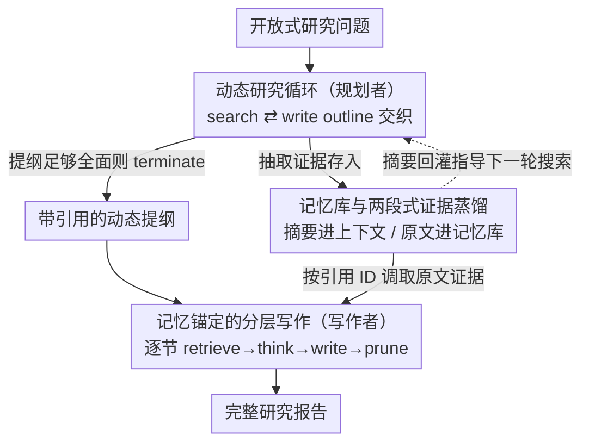

# WebWeaver: Structuring Web-Scale Evidence with Dynamic Outlines for Open-Ended Deep Research

**会议**: ICLR 2026  
**论文**: [OpenReview / ICLR 2026 conference paper]  
**代码**: https://github.com/Alibaba-NLP/DeepResearch (有)  
**领域**: Agent / 深度研究 / LLM 检索增强  
**关键词**: 开放式深度研究, 双智能体, 动态提纲, 记忆库, 引用锚定

## 一句话总结
WebWeaver 用「规划者 + 写作者」双智能体模拟人类做研究的过程：规划者边搜索边迭代优化一份带引用的提纲，写作者再按提纲逐节"取证-写作-剪枝"，从而在 DeepResearch Bench、DeepConsult、DeepResearchGym 三个开放式深度研究基准上拿下 SOTA，引用准确率高达 92%。

## 研究背景与动机
**领域现状**：开放式深度研究（Open-Ended Deep Research，OEDR）要求 AI agent 面对一个没有标准答案的复杂问题，自主检索、消化上百个网页/PDF（常超 10 万 token），最终产出一份带准确引用的长报告。这是当前自主 agent 的真正前沿——它考的不是"答对一道题"，而是好奇心驱动的信息综合与洞见发现。

**现有痛点**：现有开源方案分两类，都有结构性缺陷。一类是 "search-then-generate"（先搜全再直接写），因为没有提纲指引，写出来散乱、不连贯；另一类是 "outline-guided search"（先定死提纲再按提纲搜）或 "search-then-outlining"（先粗搜一遍再定死提纲）。前者的提纲来自 LLM 内部过时知识、看不见检索中涌现的新发现，后者把研究范围永久锁死在最初那次无方向的粗搜上。

**核心矛盾**：这些方法的通病是**单向流水线**——把"规划提纲"和"获取证据"解耦并各自固定，两者无法互相反馈。更糟的是，最终写作阶段往往把所有搜来的材料一股脑塞进上下文，触发 "lost in the middle"、上下文串扰（contextual bleeding）和幻觉，损害报告的准确性与深度，引用准确率惨不忍睹。

**本文目标**：(1) 让提纲与检索能**共同演化**而非各自固定；(2) 让长报告写作只看相关证据，杜绝噪声上下文导致的幻觉与跨节串扰。

**切入角度**：观察人类专家做研究——他们从不把"打草稿"和"查资料"分成两个固定阶段，而是让二者交织演进直到收敛出一份完整提纲；写作时也只翻看对应章节的那几条笔记。WebWeaver 就把这套"像人一样研究"的直觉工程化。

**核心 idea**：用一个**动态研究循环**（搜索 ⇄ 提纲优化交织）取代单向流水线产出带引用的提纲，再用**记忆锚定的分层写作**（按引用逐节取证-写作-剪枝）取代一次性灌全文的生成。

## 方法详解

### 整体框架
WebWeaver 是一个双智能体框架：**规划者（planner）**负责探索式的"取证 + 提纲优化"动态循环，**写作者（writer）**负责证据锚定的逐节综合，二者通过一个**记忆库（memory bank）**衔接。两个 agent 都用 ReAct 范式运行——每一步生成 thought、执行可解析的 action、等待环境返回 observation，直到输出 `<terminate>` 结束。

整条管线分两段：**规划段**，规划者反复在 search（取证）和 write outline（优化提纲）两个动作间切换，每次把新证据用于扩写/重构提纲，并在提纲里嵌入指向记忆库证据 ID 的引用，循环到提纲足够全面才 terminate，产出一份"源头锚定"的提纲；**写作段**，写作者拿到这份提纲后，对每个章节先 retrieve（按提纲里的引用 ID 只取该节需要的证据）、再 think（综合分析）、再 write，写完即把这节用过的原始材料从上下文剪除。记忆库的关键作用是上下文管理：搜索阶段只把网页的**短摘要**喂进规划者上下文，**原文证据**则存入记忆库、留到写作时按引用调取。

### 关键设计

**1. 动态研究循环：让提纲与检索共同演化，而不是谁先定死谁**

针对"单向流水线无法适应新发现"这个根本痛点，规划者的核心是一个**搜索与提纲优化交织**的迭代循环。每一步它从 search、write outline、terminate 三个动作中选一个。当它判断证据不足以支撑一份完整提纲时，就执行 search：先用查询去 web 搜索引擎拿回带标题/摘要的 URL，然后做**两阶段过滤**——先让 LLM 根据标题和摘要只选相关 URL，再对解析后的每个页面同时做两件事：蒸馏出 query 相关的摘要（回灌进规划者上下文，指导下一轮搜什么）、抽取可验证的细节证据（quote、数据点，存进记忆库）。拿到新证据后执行 write outline：这不是一次性生成，而是持续精炼——用新信息扩写章节、补引用、甚至重构整份提纲，并把每个章节映射到记忆库里具体的证据 ID。这样精炼后的提纲又反过来当作战略蓝图，主动指引后续搜索去填补已识别的知识空白。和旧范式相比，这里形成的是真正的双向反馈回路，而非"先提纲后搜索"或"先搜索后提纲"的一次性顺序。实测平均搜索约 15.7 步、优化提纲约 2.16 次、存下约 112 个页面。

**2. 记忆库与两段式证据蒸馏：搜索只进摘要、写作才取原文**

针对长输入（规划者常解析 >100 个页面、>10 万 token）与长输出（报告常 >2 万 token）双双爆上下文的痛点，WebWeaver 引入记忆库做上下文管理。核心机制是把"知道有这条证据"和"看到证据原文"解耦：搜索阶段，每个网页只把**短摘要**放进 agent 上下文，让规划者能感知信息全貌而不被原文撑爆；**原文级证据**则结构化地存进记忆库，只有到写对应章节时才按提纲里的引用 ID 把它调取出来。这一步看似工程优化，实则是整个框架成立的前提——没有它，规划者根本撑不过上百个页面的检索，写作者也会因灌入全部原文而触发 "lost in the middle"。消融显示，即便把负责"选 URL/摘要/抽证据"的模型从 GPT-oss-120b 换成更小的 Qwen3-30b-a3b，DeepResearchGym 上仅从 96.74 掉到 96.68，说明性能主要来自架构本身、而非这个子步骤用了多强的模型。

**3. 记忆锚定的分层写作：按引用逐节"取证-写作-剪枝"，杜绝跨节串扰**

针对"一次性灌全部证据导致注意力饱和、幻觉、跨节串扰"的痛点，写作者放弃整体式生成，改用分层、引用锚定的逐节合成。每节的写作是一个有意设计的"节内推理循环"：先确定当前子任务（如"写第一节"），执行 retrieve 动作——只按提纲该节的引用从记忆库拉相关证据；拿到证据后进入 think 阶段分析前文与新证据、挑出最有说服力的证据、组织出连贯的叙述结构（这一步是从"摘要堆砌"走向"真正综合"的关键）；最后才 write，把成文包进 `<write>` 标签。一节写完，它对应的源材料就被显式从上下文窗口**剪除**并替换成占位提示。这套"检索-剪枝"机制是核心：它让写作者的上下文始终只含当前相关、连贯的信息，既避免上下文溢出，又防止一节的信息错误影响另一节的合成。如此分层重复直到输出 `<terminate>`。这也是 92.13% 引用准确率的来源——规划者把引用 ID 嵌进提纲，写作者用这套结构做精准检索，从源头压住了 context-bleeding 和引用幻觉。

### 损失函数 / 训练策略
WebWeaver 本身是**训练无关**的推理框架（兼容 Qwen3-30b/235b、GPT-oss-120b、Claude-sonnet-4 等多种 LLM，消融默认用 Claude-sonnet-4）。但作者额外验证了它能当"数据引擎"：用框架自动生成一份高质量 SFT 数据集 **WebWeaver-3k**（覆盖十个领域、与基准在 N-gram 上语义差异大、无数据泄漏），把"思考-搜索-写作"的复杂技能蒸馏给小模型。在 Qwen3-30b-a3b-Instruct 上做 SFT 后，小模型即可逼近此前只有大型专有系统才有的专家级表现，证明这套复杂 agentic 技能是可学习的。

## 实验关键数据

### 主实验
在 DeepResearch Bench 上对比报告质量（RACE）与引用质量（FACT），WebWeaver 全面 SOTA，甚至超过参考答案分数：

| 系统 | Overall(RACE) | 综合性 Comp. | 洞见 Insight | 有效引用 Eff.c | 引用准确率 C.acc(%) |
|------|------|------|------|------|------|
| ReAct (Qwen3-235b) | 46.16 | 45.04 | 43.20 | - | - |
| openai-deepresearch | 46.45 | 46.46 | 43.73 | 39.79 | 75.01 |
| Gemini-2.5-pro-deepresearch | 49.71 | 49.51 | 49.45 | 165.34 | 78.30 |
| **WebWeaver (Qwen3-235b)** | **50.80** | 51.45 | 51.39 | 152.70 | 75.72 |
| **WebWeaver (Claude-sonnet-4)** | 50.48 | **51.65** | 49.67 | **216.99** | **92.13** |

在 DeepConsult（商业咨询）与 DeepResearchGym（真实复杂查询）上同样领先，验证泛化性：

| 基准 | 指标 | WebWeaver(Claude-4) | 最强对手 |
|------|------|------|------|
| DeepConsult | 胜率 win(%) | 67.69 | ReAct 51.55 |
| DeepResearchGym | 平均分 | 96.74 | ReAct 86.72 |

### 消融实验

| 配置 | DeepResearchGym 平均分 | 说明 |
|------|------|------|
| 摘要/抽证用 GPT-oss-120b（默认） | 96.74 | 完整框架 |
| 摘要/抽证换小模型 Qwen3-30b-a3b | 96.68 | 仅掉 0.06，性能来自架构非子模型 |

提纲优化轮次分布（DeepResearch Bench）：1 轮 15%、2 轮 59%、3 轮 21%、4 轮 5%，平均约 2.16 次，说明动态循环确实在多轮迭代中持续重构提纲，而非走个过场。

### 关键发现
- **引用准确率是最大亮点**：92.13% 远超 openai-deepresearch（75.01%）与 Gemini-2.5-pro（78.30%），且有效引用数 216.99 也是最高，证明"逐节取证-写作"对引用可信度的提升是结构性的。
- **架构 > 子模型**：负责选 URL/摘要/抽证据的模型从 120B 换到 30B 几乎不掉点，说明增益主要来自动态循环 + 记忆锚定写作的架构创新。
- **能力可蒸馏**：WebWeaver-3k 让 30B 小模型逼近专家级表现，把昂贵专有系统的能力开源化。

## 亮点与洞察
- **把"像人一样研究"工程化**：人类做研究时草稿与查资料交织演进、写作时只翻对应笔记——WebWeaver 把这两条直觉分别落成"动态研究循环"和"记忆锚定分层写作"，思路非常清晰且可迁移到任何长文档综合任务。
- **记忆库解耦"知道"与"看到"**：搜索只进摘要、写作才取原文，这个解耦既是上下文管理的工程手段，也直接换来了引用准确率——是本文最值得复用的 trick。
- **检索-剪枝防跨节串扰**：写完一节立刻把该节材料从上下文剪除，用最朴素的办法解决了长文写作中"前后章节互相污染"的顽疾。
- **框架即数据引擎**：用强框架自动生成 SFT 轨迹蒸馏小模型，给"agentic 能力如何下放到小模型"提供了一条可复制的路径。

## 局限与展望
- **依赖强基座 LLM 做规划/写作**：默认配置用 Claude-sonnet-4，规划者的"判断证据是否充分""重构提纲"高度依赖基座推理能力，弱基座下循环质量可能下降（消融只验证了**子步骤**模型可缩小，未验证主 agent 缩小）。
- **成本与时延**：动态循环平均搜 15+ 步、存上百页面、输出 2 万+ token，wall-clock 与 API 成本不低（论文 Appendix F 专门做了成本分析），实际部署需权衡。
- **评测多为 LLM-as-judge**：主指标 RACE/FACT 由 LLM 评判，虽有 15 样本的人评佐证（Support 胜率 76%、Depth 69%），但样本规模有限。
- **改进思路**：可探索让规划者学会显式估计"边际信息增益"来更早收敛循环、降低成本；或把记忆库做成可跨任务复用的持久知识库。

## 相关工作与启发
- **vs search-then-generate（WebShaper 等）**: 他们先搜全再直接生成，无提纲指引导致输出散乱、引用差；WebWeaver 用动态提纲全程指引写作，引用准确率与连贯性大幅领先。
- **vs outline-guided / search-then-outlining（STORM 等）**: 他们要么先定死提纲（受困于 LLM 过时内部知识）、要么先粗搜再定死提纲（范围被初搜锁死）；WebWeaver 让提纲与检索双向反馈共同演化，既能利用涌现发现、又能用提纲反过来指引后续搜索。
- **vs 一次性灌全文的长报告生成**: 他们把全部证据塞进上下文触发 lost-in-the-middle 与跨节串扰；WebWeaver 用记忆库 + 逐节检索-剪枝，把长文写作拆成只看相关证据的可控子任务。

## 评分
- 新颖性: ⭐⭐⭐⭐ 双向演化的动态提纲 + 记忆锚定分层写作组合，把"像人研究"清晰工程化，理念不算全新但落地完整。
- 实验充分度: ⭐⭐⭐⭐⭐ 三个基准全面 SOTA，含统计量分析、子模型消融、人评、成本分析与 SFT 蒸馏验证。
- 写作质量: ⭐⭐⭐⭐ 动机与方法叙事流畅、图示清楚，少数指标定义需查附录。
- 价值: ⭐⭐⭐⭐⭐ 引用准确率 92%、可蒸馏小模型、代码开源，对深度研究 agent 落地价值高。

<!-- RELATED:START -->

## 相关论文

- [\[ICLR 2026\] Open Data Synthesis for Deep Research](open_data_synthesis_for_deep_research.md)
- [\[ICLR 2026\] ChinaTravel: An Open-Ended Travel Planning Benchmark with Compositional Constraint Validation for Language Agents](chinatravel_an_open-ended_travel_planning_benchmark_with_compositional_constrain.md)
- [\[ICLR 2026\] A Benchmark for Deep Information Synthesis (DeepSynth)](a_benchmark_for_deep_information_synthesis.md)
- [\[ICLR 2026\] Deep Ignorance: Filtering Pretraining Data Builds Tamper-Resistant Safeguards into Open-Weight LLMs](deep_ignorance_filtering_pretraining_data_builds_tamper-resistant_safeguards_int.md)
- [\[ICLR 2026\] EXP-Bench: Can AI Conduct AI Research Experiments?](exp-bench_can_ai_conduct_ai_research_experiments.md)

<!-- RELATED:END -->
