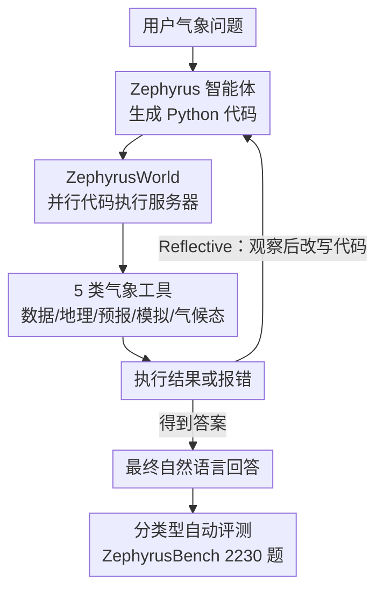

# Zephyrus: An Agentic Framework for Weather Science

**会议**: ICLR 2026  
**OpenReview**: [https://openreview.net/forum?id=aVeaNahsID](https://openreview.net/forum?id=aVeaNahsID)  
**代码**: https://github.com/Rose-STL-Lab/Zephyrus  
**领域**: Agent / 气象科学 / 工具调用 / 基准评测  
**关键词**: 气象智能体, 代码生成, ReAct, 工具环境, WeatherBench 2

## 一句话总结
本文构建了首个面向气象科学的智能体框架：用一个统一的 Python 工具环境（ZephyrusWorld）让 LLM 通过写代码去调用气象数据、预报模型与气候模拟器，配套两种执行策略（一步式 Direct / 多轮反思 Reflective）和一个含 2230 道题、49 类任务的基准 ZephyrusBench，结果在正确率上比纯文本基线最多高 44 个百分点，但困难任务仍普遍做不好。

## 研究背景与动机

**领域现状**：气象领域近年靠神经网络基础模型（GraphCast、Pangu、Stormer 等）在中期预报上反超传统数值模式，且算得更快。另一边，LLM 在文献阅读、代码生成、结构化表格上能力很强，开始被搬进化学、材料、生物等科学发现的智能体里（ChemCrow、Coscientist、Biomni）。

**现有痛点**：气象基础模型只吃结构化的数值再分析数据，没有自然语言接口，无法对话式地被询问或推理；而 LLM 反过来又读不懂高维、多通道、时空耦合的气象场。两边各自强大却彼此割裂。更现实的问题是：气象工作流要在一堆零散的数据源、预报系统、坐标/地名转换、气候统计工具之间来回拼接，门槛极高，把非专家挡在门外。

**核心矛盾**：气象数据的时空多通道结构和 RGB 图像、文本这类常规模态根本不同，标准多模态 VLM 既不擅长定量分析、又只能处理少数变量子集；已有的"气象+语言"混合模型在很多关键气象任务上还打不过领域专用基线。也就是说，没有任何系统真正把"气象数据"和"自然语言推理"统一起来做广义、交互式的科学应用。

**本文目标**：让 LLM 能对高维气象数据做语言层面的推理与分析，并且这套能力要可交互、可扩展、可被系统评测。

**切入角度**：不去硬训一个"既懂气象又懂语言"的端到端多模态大模型，而是退一步——把气象工具都包成干净的 Python API，让 LLM 用它最擅长的"写代码 + 看执行结果"的方式去操作数据。代码即接口，把高维数据交给程序，把推理交给语言模型。

**核心 idea**：用"智能体写代码调用气象工具环境"代替"端到端多模态模型"，来打通气象数据与语言推理。

## 方法详解

### 整体框架

Zephyrus 框架由四根支柱组成。第一根是 **ZephyrusWorld**——一个把碎片化气象能力统一成 Python API 的智能体环境，内含 5 类工具（数据索引、地理编码、预报、气候模拟、气候态统计），并由一个 FastAPI 的并行代码执行服务器在沙箱里跑 LLM 生成的代码。第二根是 **Zephyrus 智能体家族**：给定一个气象问题，智能体写一段 Python 代码丢给执行服务器，拿到结果后要么继续写代码精化、要么直接作答；它有 Direct（一步生成）和 Reflective（多轮 ReAct 式反思）两种执行策略。第三根是 **ZephyrusBench**——一个用人工 + 半合成流水线构造的可验证基准，覆盖从查数据到反事实推理的 49 类任务。第四根是 **分类型自动评测**，针对数值/时间/布尔/地理/描述这几类答案各设一套打分方法。

下图是运行时的智能体—环境交互回路（数据与评测两侧分别喂进工具与评分）：

### 关键设计

**1. ZephyrusWorld：把碎片化气象工具统一成可写代码的沙箱环境**

针对"气象工作流要在一堆零散工具间手工拼接、门槛太高"这个痛点，本文把气象科学能力全部封装成高层 Python API，并在推理时把工具的 docstring 文档塞进模型上下文，让 LLM 直接照着文档写代码。环境提供五类工具：(1) **WeatherBench 2 数据索引**，通过 `xarray` 接口访问 ERA5 再分析数据；(2) **地理编码器**，基于 Natural Earth 做地名↔坐标的正/反向编码、区域掩膜、面积加权图、地理距离，用 `geopandas`/`shapely` 实现并缓存空间索引；(3) **预报器**，集成 transformer 架构的 Stormer 神经预报模型，从任意大气初始条件出发跑短到中期预报；(4) **模拟器**，用基于 NeuralGCM 动力核、SPEEDY 物理参数化的 JCM 中等复杂度大气模式，默认 T32（约 3.5° 分辨率、8 层），在 A100 上跑 5 天模拟只需约 25 秒；(5) **气候态工具**，预先在 1979–2000 参考期算好均值、极值、标准差、经验分位数，支持全时段/季节/月/日/六小时多种时间尺度查询。

支撑这套工具的是一个 **FastAPI 服务器—客户端架构的并行代码执行服务器**：每个工具维护一个资源池，资源管理器用 acquire/release 语义保证每个执行线程独占一整套工具、又不死锁。每次执行严格遵循"取资源 → 载数据 → 注入工具实例 → 带超时执行用户代码 → 捕获输出/报错回传"的协议。这样多个气象分析任务能真正并行而不互相争抢资源，这是把"智能体批量跑代码"工程化落地的关键。

**2. Zephyrus 智能体家族：一步式 Direct 与多轮反思 Reflective**

环境有了，怎么驱动它就是智能体的事。本文刻意保持两种智能体设计都很简单，目的是干净地隔离并测量"LLM 解气象问题的智能体能力本身"。提示词里塞满工具文档、变量描述、单位与坐标系说明；模型生成调用这些工具的 Python 函数，在服务器上执行，报错或超时会回传给模型重写直到通过。**Zephyrus-Direct** 一次性生成完整 Python 解法、把执行输出当最终答案，只跑错误纠正循环（最多 20 次）。**Zephyrus-Reflective** 则实现 ReAct 式的多轮工作流：智能体一块块地执行代码、把输出当作观察喂回 LLM，由它判断结果的科学合理性、发现异常或错误、再改写后续代码块，最多迭代 20 轮。区别在于 Direct 是"盲写一次"，Reflective 能"边看边改"，因此在需要判断科学可信度、逐步逼近的任务上更稳——尤其是生成文本型天气讨论这类输出，Direct 直接吐程序结果太僵硬，Reflective 的"执行—观察—求解"回路明显更合适。

**3. ZephyrusBench：人工 + 半合成的可验证气象基准**

要系统评测智能体，得有一个既真实又能自动判分的题库。ZephyrusBench 基于 WeatherBench 2 的 ERA5 数据（1.5° 空间、6 小时时间分辨率），共 2230 道题、49 类任务，按工具使用复杂度分 Easy/Medium/Hard 三档：Easy 是查极值、取特定值等基础检索；Medium 引入预报和复杂数据分析流水线；Hard 要求实打实的气象专业能力，如极端事件检测、综合天气评估、ENSO 展望报告这类要综合多个大气—海洋变量的预报讨论。题目分两路来源：**人工生成**任务由研究生在领域专家协助下写问题模板 + Python 求解代码，极端事件用 EM-DAT 国际灾害库按时间地点匹配 ERA5；**半合成**任务则用一条流水线放大多样性——先用 `gpt-4.1` 的"声明抽取智能体"从 NOAA 气象报告里挑出可量化的科学声明，转成带占位符（地点/时段/变量）的模板，再让 LLM 为每个模板写一段能对照 ERA5 验证任意实例的校验代码，最后由人工审核科学价值与代码正确性，共产出 30 类人验证的合成任务。每道题的标准答案都由人写或人验证过的代码在原始 ERA5 上确定性算出，保证可自动判分。

**4. 分类型自动评测：给开放式气象答案打分**

由于模型输出是自然语言，而答案有数值/时间/布尔/地理/描述五大类，本文设计了一条"抽取 → 校验 → 按类打分"的多阶段评测管线：先用 `gpt-4.1-mini` 从回答里抽出结构化答案（格式不合法就重抽最多三次），再按题型打分。数值题用 **标准化中位绝对误差**（按变量标准差归一，使不同量纲变量可比），并报 25%/75%/99% 分位以刻画误差分布、避免被离群值带偏；时间题用中位绝对误差（单位都是小时，不归一）；布尔题用 F1 与正确率。地理题用 **Earth Mover's Distance（EMD）**：把预测和参考位置都转成纬经网格上面积加权、归一化的概率分布，用测地距离算网格点间代价、再求 EMD，另报精确匹配的 Location Accuracy。描述题最巧妙——把模型回答和参考答案各自拆成讨论点，用 LLM logits 判每条声明相对另一方是 SUPPORTED/REFUTED/NEUTRAL，softmax 归一后定义精确率（模型声明被支持的比例，排除中性）$\text{Precision}=\frac{\sum_{i\in S}P_{\text{model}\to\text{ref}}(\text{Supported}_i)}{\sum_{i\in S}P_{\text{model}\to\text{ref}}(\text{Supported}_i)+\sum_{i\in S}P_{\text{model}\to\text{ref}}(\text{Refuted}_i)}$ 与召回率 $\text{Recall}=\frac{1}{N}\sum_{i=1}^{N}P_{\text{ref}\to\text{model}}(\text{Supported}_i)$，最终 discussion score 取二者的 F1。为便于汇报，各题型再额外定义"落在可接受范围内即算对"的 correctness 标准。

### 一个完整示例

以一道困难的"ENSO 展望报告"任务为例：用户用自然语言问某地未来某季的天气展望。Reflective 智能体先写一段代码调 **WeatherBench 2 索引** 取相关海温/大气变量，执行后观察到数据形状和量纲，发现需要参考气候态——于是第二轮调 **气候态工具** 取该时段的均值与分位数做对照，第三轮可能再调 **预报器/模拟器** 跑前瞻预测，把多源结果综合成一段文本讨论作答。评测时，系统把这段回答和 NOAA 参考讨论各自拆成讨论点、用 SUPPORTED/REFUTED/NEUTRAL 逐条比对，算出 precision/recall 再取 F1 当 discussion score。这条链清楚展示了"写代码→观察→改写"的回路如何把零散工具串成一次完整的科学推理。

## 实验关键数据

评测用了五个 LLM 骨干：GPT-5.2、GPT-5-Mini、Gemini 2.5 Flash（闭源），gpt-oss-120b、Qwen3-30B-A3B-Thinking（开源），思考型模型推理强度设为 high。对比三种设定：纯文本基线（只用语言元数据、无结构化气象数据）、Zephyrus-Direct、Zephyrus-Reflective。

### 主实验

全数据集整体正确率（%，Reflective / Direct / Text-Only）：

| LLM 骨干 | Reflective | Direct | Text-Only | 智能体增益 |
|----------|-----------|--------|-----------|-----------|
| GPT-5.2 | 58.9 | 57.7 | 17.6 | +约 41 |
| GPT-5-Mini | 61.2 | 58.5 | 17.0 | +44.2 |
| gpt-oss-120b | 56.2 | 55.4 | 13.3 | +约 43 |
| Qwen3-30B | 44.2 | 51.2 | 16.4 | +约 35 |
| Gemini 2.5 Flash | 52.5 | 56.0 | 15.7 | +约 40 |

Zephyrus 智能体在所有模型上都大幅碾压纯文本基线（高出 27.8–44.2 个百分点），证明把答案接地到 WeatherBench 数据确实有效。Reflective 在 OpenAI 系模型上比 Direct 高 0.8–2.7%，但优势不一致——Qwen3-30B 和 Gemini 上反而是 Direct 更好。

### 细粒度 / 难度分解

| 维度 | 配置 | 关键指标 | 说明 |
|------|------|---------|------|
| 数值任务 | Reflective/Direct | 标准化绝对误差显著低于文本基线 | 智能体在数值与定位任务上最强 |
| 地理定位 | GPT-5.2 + Reflective | 90.4% Location Acc | 文本基线仅 18.2% |
| 报告生成 | GPT-5.2 + Reflective | discussion score 0.27 | 最好成绩也很低，普遍做不好 |
| Easy 任务 | Zephyrus 智能体 | 76.2–90.9% 正确率 | 基础数据分析能做好 |
| Medium 任务 | Zephyrus 智能体 | 49.3–63.5% | 中等 |
| Hard 任务 | Zephyrus 智能体 | 14.2–37.7% | 普遍很差 |

### 关键发现
- **接地是决定性的**：纯文本基线正确率普遍只有 13–18%，加上工具环境后直接跳到 44–61%，说明 LLM 自身的气象先验远不够，必须真去操作数据。
- **难度天花板明显**：Easy 任务能到 90%+，但 Hard 任务即便用前沿模型也只有 14–38%；尤其是跨三个月的全球气候预报任务"所有模型彻底失败"，而美国本土的气象讨论生成能到 0.43 discussion score——长时程、大尺度的气象推理仍是开放难题。
- **Reflective 不是稳赢**：多轮反思对描述型/报告型任务帮助明显（Direct 直接吐程序结果太僵硬），但在数值任务上对 GPT-5.2 几乎无差别、对 Qwen3-30B 差异才显著；弱模型甚至可能被多轮带偏，导致 Direct 反超。

## 亮点与洞察
- **"代码即接口"绕开了多模态对齐难题**：不去训"既懂气象场又懂语言"的端到端模型，而是让 LLM 用最擅长的写代码方式操作高维数据，把定量计算交给程序、把推理交给语言——这套思路可直接迁移到水文、遥感、气候等同样"数据高维但工具零散"的科学领域。
- **半合成数据流水线可规模化造可验证题**：从真实 NOAA 报告抽声明 → 模板化 → LLM 写校验代码 → 人审，既保证科学真实性又能批量扩题，且每题答案都由确定性代码算出、天然可自动判分。
- **描述型答案的 SUPPORTED/REFUTED/NEUTRAL 双向打分**很值得借鉴：用 LLM logits 做声明级蕴含判断、再组成 precision/recall/F1，给开放式科学文本提供了一个比纯字符匹配更合理的自动评分方案。
- **并行代码执行服务器**用资源池 + acquire/release 把"智能体批量跑沙箱代码"工程化，是这类科学智能体落地常被忽视但很关键的一环。

## 局限与展望
- **困难任务整体偏弱**：Hard 任务正确率仅 14–38%、全球长时程气候预报完全失败，说明当前 LLM 即便给了工具也还不具备从数据直接推理复杂气象现象的能力。
- **报告生成是明显短板**：最好的 discussion score 只有 0.27，文本型天气讨论生成远未可用。
- **智能体设计刻意从简**：Direct/Reflective 都很基础（只有错误纠正与 ReAct 循环），没有引入记忆、规划、多智能体协作等更强机制，留下大量提升空间。
- **评测依赖 LLM 当裁判**：答案抽取与描述题打分都用 GPT-4.1 系模型，可能引入裁判模型自身的偏差。
- **作者展望**：ZephyrusWorld 的模块化设计便于接入新工具、新数据源与领域工作流，可扩展到水文、地理感知、气候科学；也可作为开发更强气象智能体（如训练专用 agent 模型）的沙箱。

## 相关工作与启发
- **vs 气象基础模型（GraphCast / Pangu / Stormer / Aurora）**: 它们只做结构化数值预报、无对话接口；本文不取代它们，而是把 Stormer 当作环境里的一个工具被智能体调用，补上自然语言交互与跨任务推理这一层。
- **vs 气象多模态/VLM（WeatherQA / ClimateIQA / CLLMate / 气象-语言混合模型）**: 它们聚焦极端天气检测等窄场景、只用少量变量子集，且常打不过领域基线；本文走"智能体写代码"路线，覆盖几乎全部 WeatherBench 2 通道、做广义交互式推理。
- **vs 科学发现智能体（ChemCrow / Coscientist / Biomni）**: 同属"LLM + 工具 + 反馈"的智能体范式，但它们针对化学、生物；本文把这套范式首次系统地搬到气象科学这一此前空白的领域，并配套了专门的工具环境与可验证基准。

## 评分
- 新颖性: ⭐⭐⭐⭐⭐ 首个气象科学智能体框架，环境+智能体+基准三件套成体系，填补领域空白。
- 实验充分度: ⭐⭐⭐⭐ 5 个骨干 × 3 种设定 × 49 类任务，分难度/分类型分析到位；但部分细粒度结果在附录、主文只给聚合图。
- 写作质量: ⭐⭐⭐⭐ 动机与系统设计清晰，工具与评测讲得细；图表偏多依赖附录。
- 价值: ⭐⭐⭐⭐⭐ 提供可扩展的气象智能体沙箱与可自动判分基准，对气象+LLM 交叉方向有平台级价值。

<!-- RELATED:START -->

## 相关论文

- [\[ICML 2026\] Towards a Science of AI Agent Reliability](../../ICML2026/llm_agent/towards_a_science_of_ai_agent_reliability.md)
- [\[ACL 2025\] REPRO-Bench: Can Agentic AI Systems Assess the Reproducibility of Social Science Research?](../../ACL2025/llm_agent/repro-bench_can_agentic_ai_systems_assess_the_reproducibility_of_research_claims.md)
- [\[ACL 2025\] REPRO-Bench: Can Agentic AI Systems Assess the Reproducibility of Social Science?](../../ACL2025/llm_agent/repro-bench_can_agentic_ai_systems_assess_the_reproducibility_of_social_science_.md)
- [\[ACL 2026\] OctoTools: An Agentic Framework with Extensible Tools for Complex Reasoning](../../ACL2026/llm_agent/octotools_an_agentic_framework_with_extensible_tools_for_complex_reasoning.md)
- [\[ICLR 2026\] TusoAI: Agentic Optimization for Scientific Methods](tusoai_agentic_optimization_for_scientific_methods.md)

<!-- RELATED:END -->
