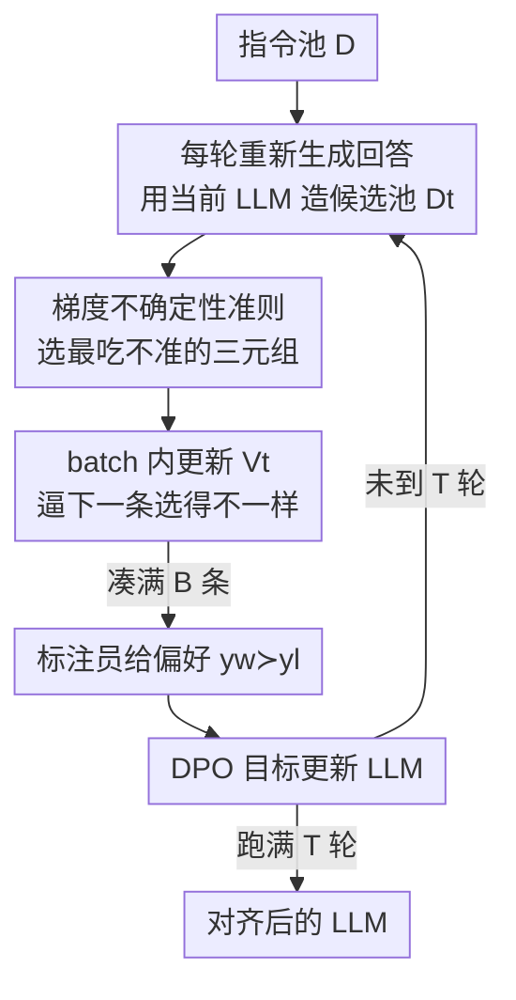

# ActiveDPO: Active Direct Preference Optimization for Sample-Efficient Alignment

**会议**: ICLR2026  
**OpenReview**: [https://openreview.net/forum?id=RD4XgyVyGh](https://openreview.net/forum?id=RD4XgyVyGh)  
**代码**: 待确认  
**领域**: 对齐RLHF / 主动学习 / DPO  
**关键词**: 主动偏好选择、DPO、隐式奖励、梯度不确定性、样本高效对齐

## 一句话总结
ActiveDPO 用「被对齐的 LLM 自身」当奖励模型，基于其隐式奖励的梯度推导出一套有理论保证的不确定性准则，主动挑选最值得标注的偏好三元组，从而在固定标注预算下用更少的人工偏好标签把 LLM 对齐到更高水平。

## 研究背景与动机
**领域现状**：用人类偏好对齐 LLM（RLHF / DPO）已经成为提升问答、数学推理、代码生成等下游能力的标配。这两类方法都依赖高质量的偏好数据集——标注员对同一 prompt 的两个回答 $y_1, y_2$ 给出二元偏好 $y_w \succ y_l$，再据此训练模型。

**现有痛点**：偏好标注需要熟练的人工，既贵又慢，于是出现了「主动选择一小撮最值得标的三元组」这条线。但已有主动选择方法有两类硬伤：一类（APLP 等）是**纯启发式**，没有理论保证，换个任务/模型就可能比随机还差；另一类（APO 等）虽有理论保证，却建立在**线性隐奖励函数**这种过强假设上，而 LLM 对齐里的隐式奖励本质是高度非线性的。

**核心矛盾**：更深的一个问题是——绝大多数方法的数据选择都**独立于被对齐的那个 LLM**（用一个外部奖励模型来打分选数据）。这隐含假设「所有 LLM 都需要同一批数据来对齐」，但实际上不同模型在 SFT 阶段覆盖的信息不同，需要补的数据也不同。选数据时不看目标模型，自然选不准。

**本文目标**：设计一个**既有理论根基、又对非线性奖励有效、还显式考虑目标 LLM**的主动偏好选择算法。

**切入角度**：DPO 的一个关键性质是它把 LLM 自身参数化成了一个隐式奖励函数 $r_\theta$。既然如此，与其再训一个外部奖励模型，不如**直接用这个隐式奖励的梯度**来度量「对某个三元组的偏好估计有多不确定」，让选择天然绑定到被对齐的模型上。

**核心 idea**：借鉴 neural dueling bandits 的不确定性量化，证明「奖励差估计误差」可由隐式奖励的梯度范数 $\|\nabla r_\theta(x,y_1)-\nabla r_\theta(x,y_2)\|_{V^{-1}}$ 上界刻画，于是用这个梯度不确定性当选择准则，优先标注模型最吃不准的三元组。

## 方法详解

### 整体框架
ActiveDPO 是一个迭代式的「生成—选择—标注—训练」循环。从一批针对特定任务的指令/prompt 出发，每一轮：① 用当前 LLM 重新生成回答，组成候选池 $D_t$；② 按梯度不确定性准则从池中逐条挑出一个 batch（共 $B$ 条）；③ 把这批三元组交给标注员（实验中用训练好的奖励模型当 oracle 模拟）拿到偏好标签；④ 用 DPO 目标在新标注数据上更新模型。跑 $T = k/B$ 轮后得到最终对齐模型。整条管线相对已有方法只换了「怎么选数据」这一个环节，训练与标注流程保持一致，从而把性能差异完全归因到选择策略。

### 关键设计

**1. 隐式奖励梯度不确定性准则：用被对齐的模型自己来选数据**

这一步直击「选数据不看目标模型」的痛点。DPO 把 LLM 参数化成隐式奖励 $r_\theta(x,y) = \beta\left(\log\frac{\pi_\theta(y\mid x)}{\pi_{\text{ref}}(y\mid x)} + Z(x)\right)$，偏好由 BTL 模型 $p(y_1\succ y_2\mid x)=\sigma(r_\theta(x,y_1)-r_\theta(x,y_2))$ 决定。论文的 Proposition 1（基于 neural dueling bandits）给出：奖励差的估计误差有上界

$$\left|\big(r_\theta(x,y_1)-r_\theta(x,y_2)\big)-\big(r(x,y_1)-r(x,y_2)\big)\right| \le \nu_T \left\|\tfrac{1}{\sqrt{m}}\big(\nabla r_\theta(x,y_1)-\nabla r_\theta(x,y_2)\big)\right\|_{V_{t-1}^{-1}} + \varepsilon$$

也就是说，两个回答的**梯度差在 $V_{t-1}^{-1}$ 度量下的范数越大，模型对这对回答的偏好就越没把握**。于是选择准则自然变成挑这个范数最大的三元组：

$$x,y_1,y_2 = \arg\max_{x,y_1,y_2\sim D_t\setminus D_t^s} \left\|\nabla r_\theta(x,y_1)-\nabla r_\theta(x,y_2)\right\|_{V_{t-1}^{-1}}$$

（实现里去掉了 $1/\sqrt{m}$，因为它只缩放梯度、且 LLM 的「宽度 $m$」无良定义。）相比 APLP 用「估计奖励差」当准则——那东西在奖励函数变准后会偏向「margin 大但其实已经预测对了」的样本，越到后期越没信息量——梯度准则衡量的是「这对回答相对已标注数据有多新」，因此持续偏向探索未覆盖区域。而最关键的是：这个准则建立在**正在被训练的那个 LLM** 上，而非外部奖励模型，所以它选出来的数据是**模型专属**的，能补上该模型 SFT 阶段没覆盖的信息。

**2. $V_{t-1}^{-1}$ 多样性正则：压低已探索过的梯度方向**

矩阵 $V_{t-1}=\sum_{p}\sum \varphi\varphi^\top$（其中 $\varphi=\frac{1}{\sqrt{m}}(\nabla r_\theta(x,y_1)-\nabla r_\theta(x,y_2))$）累积了此前所有被选样本的梯度外积。它在准则里起的是**多样性正则**的作用：随着某个梯度方向被反复采到，$V_{t-1}$ 在该方向的特征值变大，$V_{t-1}^{-1}$ 就把它压小，于是和已选数据梯度相似的样本得分下降、被去优先级。直观效果是鼓励选「梯度方向互补、覆盖面更广」的数据，避免反复标注同质样本。

**3. Batch 选择 + batch 内增量更新 $V$：把每轮重算梯度/重训的代价摊薄**

逐条选择要求每选一条就重算所有样本梯度、并重训模型一次，代价不可接受。Batch 选择规定每轮一次性挑 $B$ 条、$T=k/B$ 轮，从而梯度只需每 $B$ 条重算一次、DPO 也每 $B$ 条才训一次。但纯 batch 会丢信息——同一 batch 内后选的样本可能和先选的撞车。解法是**在 batch 内部就增量更新** $V$：每选中一条 $(x_b^t,y_{b,1}^t,y_{b,2}^t)$ 立刻

$$V_{t-1} = V_{t-1} + \varphi_{t-1}(x_b^t,y_{b,1}^t,y_{b,2}^t)\,\varphi_{t-1}(x_b^t,y_{b,1}^t,y_{b,2}^t)^\top$$

这样同一 batch 里下一条也会被推着选得和前一条不同，把多样性约束维持到 batch 粒度。

**4. LoRA 梯度 + 随机投影 + 梯度归一化：让准则在现代 LLM 上真正可算**

准则要对每个 prompt-response 对算并存梯度，而全量梯度和 LLM 权重一样大，直接算 $V_{t-1}$ 及其逆完全不可行。三招组合拳：（a）用 **LoRA** 只算低秩适配器的梯度（实验用 rank 128、$\alpha=512$）；（b）即便如此 LoRA 梯度仍占全模型 1–2%，再用**随机投影**把维度压到固定大小（实验用 8192），由 Johnson–Lindenstrauss 引理保证投影后内积近似原内积，因此准则值几乎不失真，同时也压低了矩阵求逆成本；（c）**梯度归一化**——已有工作发现回答越长、$\ell_2$ 梯度范数越小，若不处理准则会偏向选短回答（对长答更好的问答场景有害），于是先把所有梯度归一化到单位范数再算准则，把「长度」这个混淆因素剔除，让选择真正由信息量驱动。

### 损失函数 / 训练策略
训练目标就是标准 DPO 目标（在选出并标注的数据 $D_l^t$ 上）：

$$\mathcal{L}_{\text{DPO}}(\pi_\theta,\pi_{\text{ref}}) = -\mathbb{E}_{(x,y_w,y_l)\sim D_l}\big[\log\sigma\big(r_\theta(y_w\mid x)-r_\theta(y_l\mid x)\big)\big]$$

理论部分需在该目标上额外加一个正则项来训练隐式奖励 $r_\theta$（用于支撑 Proposition 1 的误差界）。每个任务先用 SFT（1 epoch，lr 2e-5）得到初始模型 $\pi_{\text{SFT}}$ 作为参考模型；每轮随机取 1000 个 prompt、各生成 3 个回答（构成 3000 个三元组候选），从中选 50 条标注，DPO 训练 4 epoch（lr 1e-4）。

## 实验关键数据

### 主实验
- **数据集**：TLDR 摘要、WebGPT 长文问答（两者都自带人类偏好标注，用作 oracle）。
- **模型**：Llama-2-7B、Gemma-2B、Qwen3-4B（跨 3 个家族、3 种规模）。
- **基线**：Random、APO（线性奖励假设、为 RLHF 设计）、APLP（DPO 的启发式主动学习）。
- **评测**：用奖励模型对 100 个 prompt 的生成回答打平均奖励，奖励越高代表越对齐。

| 设置 | 关键现象 | 对比基线 |
|------|---------|---------|
| 6 组（3 模型 × 2 任务） | ActiveDPO 平均奖励持续高于所有基线 | 一致领先 |
| TLDR / WebGPT + Llama-2 | APLP 首轮靠前但后期甚至跌破 Random | 启发式不稳定 |
| 大模型最后一轮 | 各方法趋同（数据足够后差异收窄） | 符合预期 |

### 消融实验

| 配置 | 关键指标 | 说明 |
|------|---------|------|
| 完整 ActiveDPO | 最优 reward / win-rate | 梯度准则 + 归一化 + 投影 8192 |
| w/o 梯度归一化 | reward/win-rate 下降 | 准则偏向短回答，混淆长度与质量 |
| 投影维度 < 8192 | 性能随维度降而退化 | 维度太低丢信息 |
| 投影维度 > 8192 | 性能饱和、无额外收益 | 故选 8192 平衡性能与开销 |
| Model 1 vs Model 2 同数据 | 同一数据集对两模型一好一坏 | 验证「最优数据是模型专属的」 |

### 关键发现
- **「模型专属」假设被实证**：把 Gemma 在两份不相交 SFT 子集上各训出 Model 1/2，再在三份 DPO 子集上分别 DPO——Dataset 2 对 Model 2 是最好、对 Model 1 却是最差（win-rate）。这直接证明「选数据必须考虑目标模型」，正是 ActiveDPO 用模型自身梯度选数据的根据。
- **梯度归一化是必要而非可选**：去掉后准则系统性偏向长回答，把响应长度误当质量，归一化才让选择由信息量驱动。
- **APLP 为何不稳**：其「估计奖励差」准则在奖励函数变准后会选到「margin 大但已预测对」的无信息样本，所以后期掉点；ActiveDPO 的梯度准则衡量的是相对已标注数据的「新颖度」，能持续探索。
- **额外算力开销由标注效率买单**：ActiveDPO 比 Random/APLP 多了前向+反向求梯度的开销（见复杂度表），但人工标注成本远高于这点算力，因此值得。

## 亮点与洞察
- **把「被对齐的模型」搬进选择准则**：用 DPO 隐式奖励的梯度当不确定性来源，让数据选择和最终对齐目标共用同一个 $r_\theta$，绕开了「先改外部奖励模型、再 RL 兑现」的两段式错配——选出来的数据能直接转化成对齐收益。
- **理论与工程双落地**：从 neural dueling bandits 借来非线性奖励的误差界（不靠线性假设），又用 LoRA + 随机投影 + batch 增量把原本不可算的 $V^{-1}$ 准则压到 8192 维可算，是「有界 + 可跑」少见兼得的例子。
- **可迁移的 trick**：梯度归一化去除长度偏置、JL 随机投影近似高维内积、batch 内增量更新协方差保多样性——这三招对任何「基于梯度特征做主动选择」的任务都通用。

## 局限与展望
- **oracle 是奖励模型而非真人**：为可行性用训练好的奖励模型模拟人类标注，真实人工偏好下的表现仍待验证。
- **理论建立在全连接网络上**：Proposition 1 严格只对 FC 网络成立，作者在附录论证可外推到 Transformer，但属于「论证」而非证明（⚠️ 以原文为准）。
- **额外算力非零**：每轮要对候选做前向+反向求梯度，比 Random/APLP 重；大模型最后阶段各方法趋同，说明在「数据已足够多 / 模型已很大」时主动选择的边际收益会缩小。
- **超参依赖**：投影维度、LoRA rank、batch size 都需调；改进方向可探索自适应 batch 与投影维度。

## 相关工作与启发
- **vs APO（Das et al., 2024）**：APO 有理论保证但假设**线性**隐奖励、且为 RLHF 设计、独立于被对齐的 LLM；ActiveDPO 处理**非线性**奖励、直接长在 DPO 隐式奖励上、模型专属，故跨设置更稳。
- **vs APLP（Muldrew et al., 2024）**：APLP 是启发式、用估计奖励差选数据，缺理论保证、换设置就崩（Llama-2 上不如 Random）；ActiveDPO 用梯度不确定性，有界且持续探索。
- **vs 经典 RLHF 主动学习**：传统路线选数据是为了改进一个**独立奖励模型**，之后还要 RL 才能兑现到 LLM，存在「奖励模型改进未必转化为对齐改进」的错配；ActiveDPO 把选择直接对准 LLM 的隐式奖励，单段式贯通。

## 评分
- 新颖性: ⭐⭐⭐⭐⭐ 把 neural dueling bandits 的不确定性界迁到 DPO 隐式奖励，理论根基扎实且角度新。
- 实验充分度: ⭐⭐⭐⭐ 覆盖 3 模型 × 2 任务并验证「模型专属」假设，但仅 oracle 标注、缺真人评测。
- 写作质量: ⭐⭐⭐⭐ 动机—理论—工程链条清晰，公式与近似的取舍交代到位。
- 价值: ⭐⭐⭐⭐⭐ 在标注成本主导的对齐场景里直接降低人工预算，实用性强。

<!-- RELATED:START -->

## 相关论文

- [\[ICML 2026\] Autoregressive Direct Preference Optimization](../../ICML2026/llm_alignment/autoregressive_direct_preference_optimization.md)
- [\[ICML 2026\] Boosting Direct Preference Optimization with Penalization](../../ICML2026/llm_alignment/boosting_direct_preference_optimization_with_penalization.md)
- [\[ICLR 2026\] SafeDPO: A Simple Approach to Direct Preference Optimization with Enhanced Safety](safedpo_preference_optimization_safety.md)
- [\[ICLR 2026\] Is On-Policy Data always the Best Choice for Direct Preference Optimization-based LM Alignment?](is_on-policy_data_always_the_best_choice_for_direct_preference_optimization-base.md)
- [\[ICLR 2026\] Token-Importance Guided Direct Preference Optimization (TI-DPO)](token-importance_guided_direct_preference_optimization.md)

<!-- RELATED:END -->
