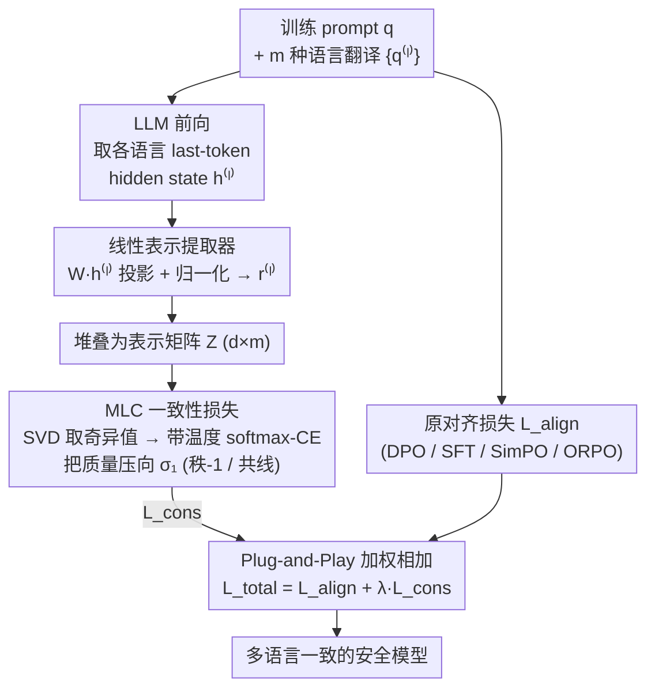

# Align Once, Benefit Multilingually: Enforcing Multilingual Consistency for LLM Safety Alignment

**会议**: ICLR 2026  
**arXiv**: [2602.16660](https://arxiv.org/abs/2602.16660)  
**代码**: 无  
**领域**: LLM对齐  
**关键词**: multilingual safety, consistency alignment, singular value decomposition, cross-lingual transfer, DPO

## 一句话总结
提出 Multi-Lingual Consistency (MLC) 辅助损失，通过 SVD 操控多语言表示矩阵的奇异值使其趋向秩-1（即多语言表示共线），仅需多语言 prompt 翻译（无需目标语言的 response），即可将一种语言的安全对齐效果一致性地迁移到所有语言。

## 研究背景与动机
**领域现状**：LLM 安全对齐（SFT/DPO）主要在英语等高资源语言上进行，结果是模型在英语上表现安全，但在低资源语言（如斯瓦希里语、库尔德语）上安全率可能从 93% 骤降到 6-12%。

**现有痛点**：扩展多语言对齐的两种主流路线都有局限——(a) 在每种目标语言上收集高质量安全数据，资源成本极高；(b) 将英语作为锚语言逐对迁移（如 SDRRL/MPO），扩展性差且效果参差不齐，某些语言仍然落后。

**核心矛盾**：如果所有语言都对齐到同一个锚语言，理论上应该获得相近的安全水平，但实际上性能差异很大——这说明现有方法未能充分利用锚语言中已有的安全信号。

**本文目标** 如何在单次训练中同时对齐多种语言，且不需要目标语言的 response 数据？

**切入角度**：多语言表示的一致性决定了行为一致性。如果同一 query 在不同语言下的内部表示方向一致（共线），模型就会产生一致的安全行为。

**核心 idea**：用奇异值分析将多语言表示矩阵约束为秩-1，实现"对齐一次，多语言受益"。

## 方法详解

### 整体框架
这篇论文要解决的是：怎么只用一种语言（英语）的对齐数据，就让安全行为一致地迁移到所有语言、而不必为每种目标语言单独收集 response。它的切入点是「行为一致源于表示一致」——只要同一个 query 在不同语言下的内部表示方向一致（共线），模型自然会给出一致的安全行为。

整条流程是这样转的：给定训练 prompt $q$ 及其 $m$ 种语言翻译 $\{q^{(\ell)}\}_{\ell=1}^m$，先让 LLM 各跑一遍前向、取每种语言最后一个 token 的 hidden state，经一个可训练线性投影 + 归一化得到表示向量，再把 $m$ 种语言的表示堆叠成矩阵 $\mathbf{Z} \in \mathbb{R}^{d \times m}$；对 $\mathbf{Z}$ 做 SVD，用一项 MLC 辅助损失把它压向「秩-1」（即所有语言共线）；最后把这项辅助损失加到原始对齐损失上一起反传，总损失 $\mathcal{L}_{total} = \mathcal{L}_{align} + \lambda_{aux}\,\mathcal{L}_{cons}$。整套机制不改训练数据格式，只是给现成的对齐管线挂一个加项。

### 关键设计

**1. 线性表示提取器：用一个可训练投影抓住跨语言的语义方向**

要对哪一组表示做共线约束，是后面 MLC 能否生效的前提——选错了表示子空间，再怎么压秩也压不到安全相关的方向上。本文取 LLM 在每种语言 prompt 上最后一个 token 的 hidden state $\mathbf{h}^{(\ell)}$，经一个线性投影 $\mathbf{r}^{(\ell)} = \mathbf{W}\mathbf{h}^{(\ell)} + b$（$\mathbf{W} \in \mathbb{R}^{d \times d_h}$）映射到低维表示空间，再归一化后把 $m$ 种语言堆成矩阵 $\mathbf{Z}$。投影矩阵 $\mathbf{W}$ 与 LLM 联合训练，让模型自己学出哪一个子空间最能体现跨语言语义一致性。值得注意的是这里没有用更复杂的提取器——实验显示简单线性投影反而更优，说明跨语言一致性方向本身就是近似线性可分的。

**2. MLC 一致性损失：把"多语言行为一致"翻译成"表示矩阵秩-1"**

有了矩阵 $\mathbf{Z}$，剩下的问题是怎么把「各语言表示方向一致」这件抽象的事写成一个可优化的目标。本文把它量化成矩阵秩的问题：对 $\mathbf{Z}$ 做 SVD 得到奇异值 $\{\sigma_j\}$，如果 $\sigma_1$ 远大于其余奇异值，就说明所有语言的表示几乎落在同一条方向上（共线），即矩阵近似秩-1。于是只要把 $\sigma_1$ 顶上去、把其余奇异值压下去，就等价于强迫各语言表示对齐到同一方向。具体做法是把奇异值当作 logits，用带温度 $\tau$ 的 softmax 交叉熵鼓励整个概率质量集中到 $\sigma_1$：

$$\mathcal{L}_{cons} = -\frac{1}{N}\sum_{n=1}^N \log \frac{\exp(\sigma_1^{(n)}/\tau)}{\sum_j \exp(\sigma_j^{(n)}/\tau)}$$

这个形式的好处是处处可微、梯度平滑，避免了直接对秩做硬约束的不可导问题。理论上它也站得住脚：由 Eckart-Young 定理，秩-1 约束等价于最小化 $\|\mathbf{Z} - \tilde{\mathbf{Z}}\|_F^2$，即让多语言表示尽量贴近自己的最佳秩-1 近似；论文的 Proposition 1 进一步证明，最小化这个重构误差就等价于最大化 $\sigma_1$ 相对其余奇异值的优势，正好对应上面的 softmax 目标。

**3. Plug-and-Play 集成：只当一项辅助 loss，不碰原训练管线**

MLC 不替换任何已有的对齐算法，而是作为加项挂在原损失上：$\mathcal{L}_{total} = \mathcal{L}_{align} + \lambda_{aux} \mathcal{L}_{cons}$，$\lambda_{aux}$ 控制一致性约束的权重。关键在于这项约束只读多语言 prompt 的表示、不碰 response，因此不改变原始训练数据格式——这也正是「不需要目标语言 response」的来源。正因如此，它能与 SFT、DPO、SimPO、ORPO 等任意对齐范式无缝拼接，实验中对四种范式都带来正收益。

### 训练策略
只需英语 response 数据 + 多语言 prompt 翻译，翻译可用机器翻译获得（成本极低）。训练时同时前向传播所有语言的 prompt，算出 MLC loss 后与原始对齐 loss 加权相加再一起反传。

## 实验关键数据

### 主实验：PKU-SafeRLHF 多语言安全率

| 方法 | EN | ZH | RU | JA | AR | BN | SW | UR | PS | KU | Avg↑ | Var↓ | PAG↑ |
|------|----|----|----|----|----|----|----|----|----|----|------|------|------|
| Qwen Raw | 93.3 | 96.1 | 93.3 | 92.2 | 93.9 | 53.3 | 6.1 | 33.9 | 21.1 | 12.2 | 59.6 | 13.14 | 0.50 |
| DPO | 99.4 | 98.3 | 97.2 | 97.8 | 96.1 | 70.6 | 7.2 | 50.6 | 30.0 | 17.2 | 66.4 | 12.44 | 0.54 |
| MPO | 81.1 | 81.7 | 82.2 | 77.2 | 78.3 | 77.2 | 4.4 | 70.6 | 59.4 | 42.8 | 65.5 | 5.53 | 0.70 |
| **DPO+MLC** | **99.4** | **96.7** | **97.8** | **98.3** | **98.3** | **95.0** | **92.8** | **92.8** | **91.1** | **97.2** | **95.9** | **0.07** | **0.97** |

### 消融实验（MultiJail OOD，ASR↓）

| 方法 | EN | ZH | AR | BN | SW | Avg ID↓ | KO | IT | JV | TH | VI | Avg OOD↓ |
|------|----|----|----|----|----|---------|----|----|----|----|----|----------|
| DPO | 2.9 | 1.9 | 5.1 | 17.8 | 25.1 | 10.5 | 3.2 | 3.5 | 4.1 | 5.4 | 1.9 | 3.6 |
| **DPO+MLC** | **0.6** | **0.3** | **1.0** | **1.0** | **0.6** | **0.7** | **0.6** | **0.6** | **0.3** | **1.0** | **0.0** | **0.5** |

### 关键发现
- DPO+MLC 将 Qwen 在 10 种语言上的平均安全率从 59.6% 提升到 95.9%，Variance 从 13.14 降至 0.07。
- 关键对比：DPO 仅让英语安全率提升但低资源语言几乎不变（斯瓦希里语仍 7.2%），而 MLC 将其拉到 92.8%。
- 在 OOD 测试集 MultiJail 上，DPO+MLC 的 ASR 降至 0.5-0.7%，且对训练中未见过的语言（韩语、意大利语等）同样有效。
- MLC 与 SFT/DPO/SimPO/ORPO 四种对齐范式都兼容，一致带来正收益。
- 对通用能力（MMLU）影响 <1%。

## 亮点与洞察
- **奇异值视角的跨语言一致性**：将多语言表示的一致性问题转化为矩阵的秩最小化问题，理论清晰且工程实现简单（一个 SVD + softmax loss）。核心洞见是：如果多语言表示共线，那么模型会对所有语言产生一致行为。
- **资源效率极高**：不需要任何目标语言的 response 数据，仅需 prompt 翻译。这对低资源语言安全是巨大突破——翻译 prompt 的成本远低于生成高质量对齐数据。
- **安全下限的显著提升**：相比于"平均安全率"的提升，更有意义的是低资源语言的安全率从 6-12% 跳到 91-97%，这意味着多语言安全不再有"短板"。

## 局限与展望
- 依赖 prompt 翻译质量，低资源语言的机器翻译可能引入噪声（论文中使用 GPT-4 翻译，实际部署的成本和质量可能不同）。
- 共线约束过强可能导致不同文化背景下需要差异化安全策略的场景出现问题（如某些内容在某些文化中可接受但在其他文化中不可接受）。
- 仅在 7-9B 模型上验证。
- 线性提取器是否在所有架构上都最优？论文未在完全不同的架构（如 MoE）上验证。

## 相关工作与启发
- **vs MPO (Zhao et al., 2025)**：MPO 用高资源语言的 reward gap 做监督，属于逐对迁移，在多语言上表现不稳定（如斯瓦希里语仅 4.4%）。MLC 通过表示一致性约束实现一次对齐所有语言。
- **vs SDRRL (Zhang et al., 2024b)**：SDRRL 用自蒸馏生成目标语言 response，需要额外数据和计算。MLC 不需任何目标语言 response。
- **vs AlphaSteer**：AlphaSteer 用零空间保护效用，MLC 用共线约束对齐多语言。两者都利用了表示空间的线性结构，但目标不同。

## 评分
- 新颖性: ⭐⭐⭐⭐ SVD 视角的多语言一致性约束是巧妙的理论贡献
- 实验充分度: ⭐⭐⭐⭐⭐ 10 种语言 × 2 个模型 × 4 种对齐范式 × ID+OOD 测试 × MMLU utility
- 写作质量: ⭐⭐⭐⭐ 理论推导完整，但符号较多需仔细跟读
- 价值: ⭐⭐⭐⭐⭐ 解决了多语言安全对齐的核心瓶颈，实用且high-impact

<!-- RELATED:START -->

## 相关论文

- [\[ACL 2025\] MPO: Multilingual Safety Alignment via Reward Gap Optimization](../../ACL2025/llm_alignment/mpo_multilingual_safety_alignment.md)
- [\[ICLR 2026\] Enforcing Axioms for AI Alignment under Loss-Based Rules](enforcing_axioms_for_ai_alignment_under_loss-based_rules.md)
- [\[ICLR 2026\] Alignment-Weighted DPO: A Principled Reasoning Approach to Improve Safety Alignment](alignment-weighted_dpo_a_principled_reasoning_approach_to_improve_safety_alignme.md)
- [\[ICLR 2026\] Beyond Pairwise: Empowering LLM Alignment With Ranked Choice Modeling](beyond_pairwise_empowering_llm_alignment_with_ranked_choice_modeling.md)
- [\[ICLR 2026\] RE-PO: Robust Enhanced Policy Optimization as a General Framework for LLM Alignment](re-po_robust_enhanced_policy_optimization_as_a_general_framework_for_llm_alignme.md)

<!-- RELATED:END -->
